# Manual conceitual, executivo, comercial e estrategico: implementacao de AG-UI na plataforma

## 1. O que e esta feature

O slice AG-UI deste repositorio e a camada que transforma execucao agentic em experiencia de interface observavel. Em vez de o produto expor apenas um endpoint que responde texto, ele expoe um protocolo de interface que permite a uma tela corporativa pedir uma execucao, acompanhar o progresso, ver quais ferramentas governadas foram usadas, reconstruir estado incremental e encerrar com sucesso, erro ou interrupcao humana.

Na pratica, isso significa que a plataforma nao trata interface agentic como um detalhe cosmestico. Ela trata a interface como parte do contrato do produto. A tela nao recebe so uma frase final. Ela recebe a historia da execucao.

Esse e o ponto central da feature. O AG-UI local nao e um chat qualquer. Ele e uma ponte entre sistemas de negocio e runtimes agentic, pensada para software houses que precisam embutir IA em PDV, varejo, ERP, operacao comercial e gestao, sem empurrar SQL livre, segredos ou logica arbitraria para o navegador.

## 2. Que problema ela resolve

Sem uma camada como essa, cada tela rica do produto teria de reinventar sozinha os mesmos problemas.

1. Como disparar uma execucao agentic sem acoplar a pagina a um endpoint opaco.
2. Como acompanhar progresso sem polling artesanal e sem inventar eventos proprietarios por tela.
3. Como mostrar contexto, mensagens, tools, estado e correlation_id de forma consistente.
4. Como suportar revisao humana sem criar um fluxo paralelo por pagina.
5. Como montar dashboards dinamicos sem abrir a porta para HTML, JavaScript ou SQL livre gerado pela IA.

O AG-UI resolve isso criando uma lingua comum entre backend e interface. A pagina fala em execucao e capability. O backend traduz isso em runtime, ferramentas governadas, eventos e estado. O frontend reconstrui a experiencia usando um runtime compartilhado. O ganho tecnico e reduzir duplicacao. O ganho operacional e tornar a IA menos opaca. O ganho de produto e levar agentes para dentro de telas de negocio reais.

## 3. Visao executiva

Para lideranca, o principal valor do AG-UI nao e "ter um chat bonito". O valor e transformar execucao de IA em um processo governado, rastreavel e reaproveitavel.

Isso importa por quatro motivos.

1. Reduz risco de caixa-preta: a interface mostra quando a execucao comecou, o que aconteceu no meio e como terminou.
2. Melhora suporte e operacao: correlation_id, replay e timeline de ferramentas ajudam a diagnosticar incidente sem depender de achismo.
3. Acelera novas entregas: uma vez que o protocolo e o runtime da interface existem, novas telas podem reaproveitar a mesma base.
4. Aproxima a IA do negocio: a feature deixa de ser um backend isolado e passa a ser uma capacidade visual embutivel em produtos da empresa.

Em termos simples, o AG-UI permite que a plataforma trate interface agentic como capacidade corporativa, nao como experimento local.

## 4. Visao comercial

Comercialmente, o slice AG-UI ajuda a vender a plataforma de um jeito muito mais forte do que um endpoint de texto. O cliente nao compra apenas um agente que "responde perguntas". Ele compra uma experiencia de negocio em que a IA acompanha a operacao, mostra progresso, explica o que esta fazendo, monta resultado reutilizavel e respeita governanca.

No codigo atual, isso aparece de maneira muito concreta.

1. Existe um hub AG-UI de varejo com quatro telas dedicadas: cockpit de vendas, radar de checkout, central de catalogo e dashboard dinamico.
2. Existe um runtime compartilhado que pode ser reutilizado por outras paginas e tambem por terceiros dentro do ecossistema interno.
3. Existe discovery de capabilities, o que facilita explicar ao cliente "o que esta liberado" sem expor SQL, DSN ou segredo.
4. Existe replay sanitizado, o que ajuda a demonstrar governanca e auditoria.

O diferencial comercial nao esta em prometer liberdade total. Esta em prometer IA aplicavel com controle. Isso fala muito melhor com clientes enterprise, especialmente em varejo e ERP, onde previsibilidade, auditoria e seguranca pesam mais do que liberdade irrestrita no frontend.

## 5. Visao estrategica

Estrategicamente, a implementacao atual fortalece a plataforma em cinco eixos.

1. Separa interface agentic do backend de negocio atraves de um protocolo estavel.
2. Permite que a empresa escale novas telas agentic sem recriar o mesmo plumbing a cada vez.
3. Mantem a governanca no servidor, nao no navegador.
4. Cria um runtime compartilhado em JavaScript puro, coerente com a stack real do repositorio.
5. Abre caminho para que outros dominios usem o mesmo contrato, mesmo quando o slice visual pronto hoje esta mais forte em PDV e varejo demo.

Esse ponto e importante para a estrategia de produto. O repositorio nao esta apenas com uma demo AG-UI. Ele ja tem um boundary executavel, um registry de adapters, um discovery publico, um runtime compartilhado, replay e um caminho explicito para deepagent, workflow e dominios governados. O supervisor classico `agent` foi desligado deste boundary, para evitar perpetuar um fluxo legado. Isso significa que a plataforma ja possui o esqueleto de uma camada agentic de interface reaproveitavel.

## 6. Conceitos necessarios para entender

### 6.1. AG-UI

AG-UI, no contexto deste projeto, e o contrato de interface que organiza a conversa entre tela e runtime. Ele define como um run comeca, como eventos intermediarios chegam, como snapshots e deltas de estado sao aplicados, como o run termina e como uma interrupcao humana aparece para a UI.

### 6.2. Capability governada

Uma capability governada e uma intencao de negocio autorizada pelo backend. A tela diz "quero resumo de vendas" ou "quero materializar um dashboard dinamico". Ela nao manda SQL livre, HTML livre nem uma instrucao arbitraria para o browser executar.

### 6.3. Snapshot e delta

Snapshot e a fotografia completa do estado. Delta e a alteracao incremental aplicada sobre esse estado. Os dois juntos permitem uma UI progressiva: a tela comeca simples, recebe um estado inicial e depois vai sendo enriquecida sem precisar recarregar tudo do zero.

### 6.4. Sidecar agentic

O sidecar e o painel auxiliar que acompanha a tela de negocio. Ele concentra status, mensagens, correlation_id, contexto da tela, timeline de tools e interrupcoes humanas. Isso evita misturar tudo na area principal da pagina.

### 6.5. HIL

HIL significa human in the loop, ou seja, uma decisao humana inserida no fluxo. No slice atual, deepagent e workflow podem encerrar o run com outcome de interrupcao e depois continuar pelo mesmo boundary AG-UI, cada um usando seu mecanismo canônico de continuidade.

### 6.6. DashboardSpec segura

No dashboard dinamico, o agente nao manda HTML. Ele manda uma especificacao tipada e fechada, com widgets permitidos, fontes de dados governadas, layout controlado e travas de seguranca explicitas. Isso permite flexibilidade visual sem abrir uma fronteira insegura.

## 7. O que existe hoje, de fato

O slice atual tem sete capacidades estruturais importantes, todas confirmadas no codigo.

1. Boundary HTTP dedicado em /ag-ui.
2. Discovery publico de capabilities em /ag-ui/capabilities.
3. Execucao publica oficial em /ag-ui/runs, sem rotas paralelas por `agent_id`.
4. Replay sanitizado por run e por thread.
5. Adapters registrados para deepagent, workflow, retail_demo e erp_backoffice_demo.
6. Runtime compartilhado do frontend em JavaScript puro.
7. Materializacao governada de dashboard dinamico.

Isso muda o enquadramento correto da feature. O AG-UI deste repositorio nao e apenas a demo de varejo. A demo de varejo e a vitrine mais tangivel do slice. Mas a infraestrutura ja serve tambem como boundary agentic mais amplo, com executionKind para deepagent, workflow e dominios governados.

## 8. O que a feature disponibiliza

Do ponto de vista de produto, o AG-UI entrega tres camadas de valor.

### 8.1. Para a UI final

1. Mensagens incrementais do assistente.
2. Timeline de ferramentas acionadas.
3. Estado observavel por snapshot e delta.
4. Correlation_id retornado pelo backend.
5. Interrupcoes humanas renderizaveis.
6. Canvas dinamico seguro para dashboard.

### 8.2. Para o backend da plataforma

1. Registry explicito de adapters.
2. Orquestracao central do lifecycle do run.
3. Discovery publico sem expor segredos.
4. Replay de eventos com sanitizacao.
5. Separacao entre protocol boundary e logica de dominio.

### 8.3. Para terceiros e outras equipes internas

1. Pacote interno de runtime reutilizavel.
2. Exemplo minimo fora das paginas administrativas.
3. Contrato de request e eventos suficientemente claro para integrar outra interface.
4. Base pronta para novas telas agentic sem copiar toda a infraestrutura do frontend atual.

## 9. Como a feature funciona por dentro

Em nivel macro, o fluxo funciona assim.

1. A pagina externa monta um `AgUiRunRequest` com threadId, runId, input, metadata, frontend tools permitidas e uma fonte explicita de configuracao.
2. O backend autentica, resolve correlation_id e monta um contexto imutavel de execucao.
3. O orchestrator emite RUN_STARTED e delega ao adapter correto.
4. O adapter produz eventos AG-UI coerentes com o dominio e com o runtime.
5. O encoder serializa esses eventos como SSE.
6. O cliente JavaScript consome o stream por POST, sem inventar correlation_id no browser.
7. O store reconstrui o estado da interface.
8. O sidecar e a area principal da tela renderizam mensagens, tool timeline, estado e interrupcoes.

O que esse diagrama mostra e simples: o protocolo e comum, mas o dominio por tras dele pode variar. Isso e justamente o que torna o AG-UI estrategico.

## 10. Divisao em etapas ou submodulos

Detalhamento aprofundado por etapa:

1. [Fronteira de protocolo](README-CONCEITUAL-AG-UI-FRONTEIRA-DE-PROTOCOLO.md)
2. [Borda HTTP dedicada](README-CONCEITUAL-AG-UI-BORDA-HTTP-DEDICADA.md)
3. [Orquestracao do lifecycle](README-CONCEITUAL-AG-UI-ORQUESTRACAO-DO-LIFECYCLE.md)
4. [Registry e adapters](README-CONCEITUAL-AG-UI-REGISTRY-E-ADAPTERS.md)
5. [Dominio varejo demo](README-CONCEITUAL-AG-UI-DOMINIO-VAREJO-DEMO.md)
6. [Runtime compartilhado do frontend](README-CONCEITUAL-AG-UI-RUNTIME-COMPARTILHADO-DO-FRONTEND.md)
7. [Replay e auditoria](README-CONCEITUAL-AG-UI-REPLAY-E-AUDITORIA.md)

### 10.1. [Fronteira de protocolo](README-CONCEITUAL-AG-UI-FRONTEIRA-DE-PROTOCOLO.md)

E a camada que define o request tipado, os eventos oficiais, os outcomes terminais e o replay. Ela existe para evitar que cada pagina crie um contrato proprio.

### 10.2. [Borda HTTP dedicada](README-CONCEITUAL-AG-UI-BORDA-HTTP-DEDICADA.md)

E a camada que expõe discovery, runs e replay. Ela existe para separar AG-UI das rotas antigas e preservar um boundary unico de interface agentic.

### 10.3. [Orquestracao do lifecycle](README-CONCEITUAL-AG-UI-ORQUESTRACAO-DO-LIFECYCLE.md)

E a camada que conhece run started, run finished, run error, sequencia de evento e persistencia opcional no event store. Ela nao conhece PDV, ERP ou dashboard. Ela conhece o lifecycle.

### 10.4. [Registry e adapters](README-CONCEITUAL-AG-UI-REGISTRY-E-ADAPTERS.md)

E a camada que pluga dominios e runtimes especificos no protocolo comum. Isso permite evolucao sem if hardcoded no core.

### 10.5. [Dominio varejo demo](README-CONCEITUAL-AG-UI-DOMINIO-VAREJO-DEMO.md)

E a camada hoje mais concreta em termos de experiencia visual pronta. Ela converte capabilities em consultas aprovadas ou em materializacao de dashboard dinamico.

### 10.6. [Runtime compartilhado do frontend](README-CONCEITUAL-AG-UI-RUNTIME-COMPARTILHADO-DO-FRONTEND.md)

E a camada que permite reuso entre paginas. Ela concentra cliente SSE, store, sidecar, renderer de tool timeline e renderer de dashboard.

### 10.7. [Replay e auditoria](README-CONCEITUAL-AG-UI-REPLAY-E-AUDITORIA.md)

E a camada que permite reconstituir a historia da execucao sem reexpor segredo. Ela fortalece suporte, troubleshooting e demonstracao de governanca.

## 11. Vantagens praticas

As vantagens concretas da implementacao atual sao estas.

1. A tela fica menos acoplada ao runtime interno.
2. O frontend nao precisa conhecer DSN, SQL nem segredos.
3. O usuario percebe progresso e contexto, em vez de so esperar uma resposta final.
4. O mesmo protocolo suporta consulta governada, dashboard dinamico e HIL.
5. O runtime do frontend pode ser reaproveitado sem React, coerente com a UI real do projeto.
6. Replay sanitizado e correlation_id aumentam capacidade de suporte e auditoria.
7. Discovery de capabilities ajuda a expor o que o produto realmente disponibiliza.

Para software houses de food service, varejo e ERP, isso tem um efeito direto: a IA deixa de parecer um plugin magico e passa a parecer uma capacidade industrializavel do produto.

## 12. Como terceiros podem usar

Para o caminho pratico de SDK, leia GUIA-AG-UI-SDK-TERCEIROS.md. Ele consolida explicacao 101, primeiro run, seguranca, varejo/vendas, adaptacao ERP e matriz de eventos.

Terceiros ou outras equipes internas podem usar o slice de tres formas diferentes.

### 12.1. Consumindo o backend existente

Uma nova pagina externa deve mandar request para /ag-ui/runs, consumir SSE por POST e reconstruir estado via runtime compartilhado ou implementacao propria compativel. O produto nao expõe mais URL publica por `agent_id`, o que evita identidade paralela de runtime e reforca o boundary YAML-first.

### 12.2. Reaproveitando o pacote interno de runtime

O pacote interno @prometeu/ag-ui-runtime agora deve ser lido como wrapper fino de plataforma, nao como protocolo paralelo. Ele reexporta o cliente oficial da Plataforma de Agentes de IA sobre @ag-ui/client, tipos oficiais de @ag-ui/core, store, sidecar, renderers, timeline, validadores de dashboard, Component Catalog seguro e helpers de integracao para auth, agent id, tenant, replay, diagnostico, catalogo e frontend tools. Ele nao e publicado como pacote externo publico, mas ja funciona como fachada interna de reuso.

O Component Catalog e importante para UI generativa. Em vez de deixar o agente mandar qualquer tela, o frontend so aceita componentes, actions, bindings e props declarados em allowlist. Se algo nao estiver no catalogo, a tela falha fechado e nao renderiza como se fosse verdade. Isso reduz risco de HTML, script, SQL livre, segredo ou dado interno aparecerem na interface.

### 12.3. Implementando um novo adapter de dominio

Uma nova equipe pode criar um executionKind proprio, registrando um adapter novo no registry explicito, sem reescrever o orchestrator.

Esse ponto e muito relevante para terceiros. O protocolo nao obriga a copiar a interface de varejo demo. Ele oferece um contrato reutilizavel para embutir IA em qualquer tela corporativa compatível.

## 13. Como isso se aplica ao dia a dia corporativo de varejo e ERP

### 13.1. Cockpit de vendas

Cenario: uma lideranca comercial quer abrir o sistema e entender em segundos o comportamento do periodo.

Como o AG-UI ajuda: a tela pede sales_summary, mostra a tool governada acionada, apresenta o resultado como estado reconstituido e deixa o sidecar contar a historia da analise.

Valor pratico: menos dependencia de leitura manual de planilhas e mais contexto operacional no proprio sistema.

### 13.2. Radar de checkout

Cenario: uma operacao digital suspeita piora de conversao e precisa ver gargalos.

Como o AG-UI ajuda: a tela pede checkout_funnel, acompanha a execucao, mostra a ferramenta usada e devolve um resultado estruturado que pode ser interpretado na mesma jornada visual.

Valor pratico: a IA entra como assistente operacional, nao apenas como chat lateral solto.

### 13.3. Oportunidades de catalogo

Cenario: time comercial e de estoque quer cruzar vendas, oferta e disponibilidade.

Como o AG-UI ajuda: a tela usa capability fechada, o backend aciona dyn_sql aprovada e a UI materializa o resultado governado com contexto de execucao.

Valor pratico: a interface passa a ser uma ferramenta de conversa com os dados, mas sem entregar SQL livre ao usuario final.

### 13.4. Dashboard dinamico para gestao

Cenario: a lideranca quer um painel sob medida para uma reuniao, com KPI, serie temporal, ranking e narrativa curta.

Como o AG-UI ajuda: o sistema aceita uma DashboardSpec segura, valida a estrutura e monta o canvas dinamicamente por eventos.

Valor pratico: flexibilidade visual com contrato, sem virar uma tela que renderiza qualquer HTML gerado pelo modelo.

### 13.5. ERP com aprovacao humana

Cenario: uma tela de ERP precisa apoiar analise, propor acao e pedir aprovacao humana antes de continuar.

Como o AG-UI ajuda: deepagent e workflow conseguem encerrar o run em interrupt e retomar pelo mesmo boundary AG-UI, cada um pelo seu caminho canonico de continuidade.

Valor pratico: a empresa pode desenhar uma experiencia assistida de aprovacao sem abrir um fluxo paralelo so para HIL.

Importante: o repositorio nao prova hoje uma tela fixa pronta de ERP com esse comportamento. O que o codigo prova e que o boundary AG-UI e o runtime compartilhado ja suportam esse padrao para novos casos de uso.

### 13.6. Suporte e auditoria

Cenario: uma equipe precisa entender por que um usuario viu um resultado estranho.

Como o AG-UI ajuda: replay por run ou thread, correlation_id no header e event store sanitizado permitem seguir a historia da execucao sem reexpor segredo.

Valor pratico: investigacao mais rapida e mais segura.

## 14. O que acontece em caso de sucesso

No caminho feliz, a pagina envia o run, o backend valida o contrato, o sidecar mostra status e correlation_id, a tool governada ou a materializacao dinamica acontece, o estado e reconstruido no frontend e o run termina com success. O usuario percebe uma interface viva, com feedback de processo, e nao um spinner opaco esperando resposta final.

## 15. O que acontece em caso de erro

Os erros confirmados no codigo se agrupam em cinco familias.

1. Boundary sem autenticacao.
2. Ausencia de fonte explicita de configuracao.
3. agent_id inexistente, capability nao autorizada ou runtime legado desligado.
4. Falha de dominio governado, como SQL livre, parametro proibido ou configuracao PDV ausente.
5. DashboardSpec invalida ou insegura.

O ponto mais importante e este: o slice falha fechado. Ele nao tenta mascarar problema com fallback implicito.

## 16. Limites reais e pegadinhas

Esta secao e importante porque evita vender ou documentar mais do que o codigo confirma.

1. O replay nao deve ser descrito como apenas memoria: development/test podem usar memoria, mas fora disso o provider canônico precisa estar configurado e o provider duravel suportado hoje e PostgreSQL.
2. Workflow ja possui continuidade AG-UI por executor dedicado; nao documente workflow como sem resume de forma geral.
3. O dominio visual pronto hoje e mais forte em varejo demo do que em ERP pronto de fabrica.
4. O pacote de runtime e interno e privado. Ele nao esta configurado como biblioteca publica externa.
5. O dashboard dinamico e flexivel, mas nao aceita HTML, script, SQL livre, segredo ou correlation_id no payload.
6. Discovery publica capabilities, nao formulas SQL ou detalhes sensiveis de conexao.

Esses limites nao diminuem o valor da feature. Eles apenas definem corretamente o que ja esta pronto e o que ainda e uma possibilidade de evolucao.

## 17. Explicacao 101

Uma forma simples de entender o AG-UI deste repositorio e imaginar um painel de comando entre a tela e o agente.

Sem AG-UI, a tela aperta um botao e recebe uma resposta final quase sem contexto. Se algo der errado, parece magia quebrada.

Com AG-UI, a tela aperta o botao e o sistema passa a narrar o processo: quando começou, que tipo de execucao esta acontecendo, que ferramenta entrou em cena, que estado foi montado, se precisa de aprovacao humana e como tudo terminou. Isso torna a IA menos misteriosa e mais utilizavel dentro de sistemas corporativos.

## 18. Checklist de entendimento

- Entendi que AG-UI aqui e um protocolo de interface, nao apenas uma pagina demo.
- Entendi que a tela pede capabilities governadas, nao SQL livre.
- Entendi que existe discovery, run streaming e replay.
- Entendi que o runtime do frontend e compartilhado e feito em JavaScript puro.
- Entendi que deepagent, workflow e dominios governados usam o mesmo boundary, com limites diferentes.
- Entendi que o dashboard dinamico usa uma especificacao segura, nao HTML livre.
- Entendi que replay sanitizado e correlation_id ajudam suporte e auditoria.
- Entendi que o slice atual esta mais pronto em varejo demo, mas ja serve como base para outros dominios.

## 19. Evidencias no codigo

- src/api/routers/ag_ui_router.py
  - Motivo da leitura: confirmar os endpoints publicos do boundary AG-UI.
  - Simbolo relevante: router, get_ag_ui_capabilities_service, get_ag_ui_orchestrator.
  - Comportamento confirmado: discovery, runs e replay protegidos por autenticacao.

- src/api/services/ag_ui_adapter_registry.py
  - Motivo da leitura: entender como novos dominios entram no runtime.
  - Simbolo relevante: AgUiAdapterRegistry.default.
  - Comportamento confirmado: registry explicito com deepagent, workflow, retail_demo e erp_backoffice_demo.

- src/api/services/ag_ui_capabilities_service.py
  - Motivo da leitura: validar discovery publico.
  - Simbolo relevante: AgUiCapabilitiesService.default.
  - Comportamento confirmado: capabilities genericas para runtimes agentic e catalogo seguro para retail_demo.

- src/api/services/ag_ui_event_store.py
  - Motivo da leitura: entender replay e sanitizacao.
  - Simbolo relevante: InMemoryAgUiEventStore, PostgresAgUiEventStore, sanitize_ag_ui_event_payload.
  - Comportamento confirmado: replay por run e thread com provider canonico e redacao de segredos.

- src/api/services/ag_ui_retail_demo_adapter.py
  - Motivo da leitura: confirmar o dominio visual pronto do slice.
  - Simbolo relevante: RetailDemoAgUiAdapter, RetailDemoQueryCatalog.
  - Comportamento confirmado: capabilities PDV fechadas, bloqueio de SQL livre e rota especial para dashboard_dynamic.

- src/api/services/ag_ui_dashboard_materialization.py
  - Motivo da leitura: entender como o dashboard dinamico nasce.
  - Simbolo relevante: DashboardMaterializationService.build_events.
  - Comportamento confirmado: snapshot inicial, validacao, deltas e custom events de materializacao.

- packages/ag-ui-runtime/index.js
  - Motivo da leitura: confirmar reuso por terceiros e outras paginas.
  - Simbolo relevante: createAgUiSseClient, createAgUiStateStore, createAgUiSidecarChat.
  - Comportamento confirmado: fachada interna publica do runtime compartilhado.

- tests/unit/test_02-01-48_ag_ui_router.py
  - Motivo da leitura: validar o contrato realmente protegido por teste.
  - Simbolo relevante: testes de capabilities, runs e replay.
  - Comportamento confirmado: autenticacao obrigatoria, discovery sem segredos, SSE valido e replay ordenado e sanitizado.
