# Manual conceitual, executivo, comercial e estratégico: scheduler, agendamento agentic em background, comunicação HIL e Generative UI

## 1. O que é esta capacidade

Esta capacidade permite que a plataforma receba um pedido em linguagem natural, transforme esse pedido em uma solicitação durável de execução agentic e faça essa solicitação rodar fora da conversa síncrona, no momento certo, com rastreabilidade, governança e possibilidade de pausa humana.

O ponto importante é que o sistema não agenda apenas um nome de agente. Ele agenda a intenção completa do usuário. O pedido original continua existindo como comando persistido, o alvo agentic continua definido por tipo e referência, e a agenda decide quando aquilo deve virar execução real.

Em linguagem simples, a plataforma funciona como uma combinação de agenda, fila operacional e trilha de auditoria para agentes, deepagents e workflows. O usuário pede algo em texto natural. A plataforma guarda esse pedido, programa a hora de rodar, dispara o worker certo e acompanha o resultado ou a pausa humana sem perder o contexto.

## 2. Que problema ela resolve

Sem essa capacidade, a plataforma ficaria presa a um modelo frágil: tudo precisa acontecer na mesma requisição HTTP, na mesma janela do chat e com o mesmo operador olhando a tela até o fim.

Isso gera três problemas práticos.

O primeiro problema é operacional. Nem toda tarefa agentic cabe no tempo e no contexto de uma conversa síncrona. Relatórios, conciliações, rotinas periódicas e análises demoradas precisam continuar existindo mesmo quando o usuário não está mais online.

O segundo problema é de governança. Algumas execuções precisam de aprovação humana no meio do caminho. Se essa aprovação ficar solta em uma conversa informal, a plataforma perde rastreabilidade, identidade do aprovador e continuidade segura da thread.

O terceiro problema é arquitetural. Quando cada canal ou endpoint cria seu próprio jeito de “agendar” ou “esperar aprovação”, o produto vira um conjunto de fluxos paralelos, difíceis de operar e quase impossíveis de auditar.

Esta capacidade resolve isso unificando três responsabilidades que precisam andar juntas: agenda canônica, execução agentic em background e retomada HIL governada.

## 3. Visão executiva

Para liderança, essa feature reduz dependência de operação manual e melhora previsibilidade. A empresa deixa de depender de alguém lembrar de rodar uma tarefa, de acompanhar uma execução longa em tempo real ou de refazer manualmente uma etapa que ficou pendente de aprovação.

Na prática, isso reduz risco operacional, organiza rotinas recorrentes e transforma automação agentic em capacidade utilizável em cenários reais de negócio. A automação não fica limitada a demonstrações instantâneas. Ela passa a cobrir rotinas periódicas, jornadas longas e decisões humanas controladas.

## 4. Visão comercial

Comercialmente, essa capacidade ajuda a responder duas objeções comuns.

A primeira objeção é: “o agente só funciona quando alguém fica esperando a resposta?”. O código confirma que não. A execução pode ser criada como solicitação durável e depois acompanhada por runs, eventos e APIs administrativas.

A segunda objeção é: “se o agente precisar de aprovação humana, ele trava e perde contexto?”. O código confirma que, para agentes e deepagents, a pausa pode gerar um pedido HIL durável com comunicação externa e continuação formal. Isso é especialmente valioso em cenários de operação, varejo e atendimento, nos quais a decisão pode chegar por e-mail ou WhatsApp em vez de vir da mesma tela.

O benefício percebido pelo cliente é claro: automação com calendário, histórico e freio humano oficial. A promessa comercial correta não é “o sistema entende qualquer data em texto livre e agenda sozinho”. A promessa correta é “o sistema preserva o pedido do usuário em linguagem natural, agenda a execução por contrato estruturado e retoma com governança quando houver aprovação humana”.

## 5. Visão estratégica

Estrategicamente, essa capacidade fortalece a plataforma em cinco frentes.

A primeira frente é topologia. Scheduler, worker e API continuam separados. Isso evita misturar coordenação temporal com execução pesada e com borda HTTP.

A segunda frente é governança agentic. O runtime deixa de ser apenas reativo. Ele passa a operar também por agenda, com histórico, runs e eventos.

A terceira frente é omnichannel. A pausa humana deixa de depender da interface original. A decisão pode ser tratada por uma rota segura ou por ponte de canal, desde que respeite o contrato HIL.

A quarta frente é sustentabilidade do produto. Ao manter o pedido original, o alvo agentic, a agenda e a decisão humana dentro de contratos tipados, a plataforma cria base para operação recorrente e auditável sem cair em scripts paralelos ou improvisações locais.

A quinta frente é genericidade de superfície. O que foi confirmado no código não é uma experiência presa a um canal único. Scheduler, worker, bridge HIL, painel de revisão e AG-UI foram montados como peças reutilizáveis. Isso permite que a mesma pausa humana seja tratada por API, canal externo ou interface generativa sem reescrever a lógica central de decisão.

## 6. Conceitos necessários para entender

### 6.1. Solicitação background

É o pedido original do usuário persistido como intenção executável. Ela guarda o comando pedido, o alvo, o snapshot YAML e o contexto necessário para o worker reconstruir a execução depois.

### 6.2. Agenda canônica

É o registro temporal que define quando a solicitação deve virar execução concreta. No caminho canônico atual, a agenda durável usada no runtime fica no schema scheduler, não em um relógio local embutido na API.

### 6.3. Run

É a execução real de uma solicitação. Uma solicitação recorrente pode gerar vários runs ao longo do tempo. Cada run tem status, correlation_id, thread, telemetria, resultado e erro próprios.

### 6.4. Prompt em linguagem natural

No slice lido, o pedido do usuário continua persistido como texto em requested_command. Isso significa que a intenção em linguagem natural não é perdida quando a tarefa sai do chat e vira background.

### 6.5. Agenda estruturada

O momento de execução não é texto livre. Ele é validado por um contrato tipado com schedule_type, run_at, cron_expression, interval_seconds e timezone. Isso evita ambiguidades temporais silenciosas.

### 6.6. Scheduler universal

É o processo responsável por claimar execuções vencidas, publicar trabalho para o worker oficial e reconciliar dispatches pendentes. Ele não executa o runtime agentic diretamente.

### 6.7. Human-in-the-Loop em background

É a pausa humana durável ligada a um run em background. Quando um deepagent ou agente pausa, a plataforma pode registrar um pedido HIL persistido, notificar aprovadores e retomar a thread original quando a decisão chega.

### 6.8. Correlation ID

É o identificador lógico de ponta a ponta. O mesmo correlation_id acompanha criação da solicitação, scheduler, worker, runtime e HIL. Isso é essencial para auditoria e troubleshooting.

### 6.9. Generative UI compartilhada

Generative UI, neste contexto, não é um enfeite visual específico de uma tela. Ela é a camada de interface orientada a eventos que consegue mostrar andamento, mensagens, tools acionadas, estado materializado e interrupções HIL sem acoplar a experiência a um framework único ou a um domínio de negócio fixo.

### 6.10. Superfície agnóstica

Chamar o desenho de agnóstico aqui tem um significado prático: o scheduler não sabe de varejo, cobrança ou qualquer domínio específico; ele só conhece agenda e dispatch. O ledger background não sabe se o alvo é agente ou workflow por capricho visual; ele conhece target_type e target_ref. E a UI compartilhada de HIL não depende de um chat específico; ela recebe um contrato de revisão e devolve uma decisão.

## 7. Como a capacidade funciona por dentro

O fluxo começa quando um agente em execução usa a tool interna de agendamento background. Essa tool cria uma solicitação com o pedido do usuário, identifica o alvo agentic e monta uma agenda estruturada. O pedido em linguagem natural continua preservado em requested_command.

Depois disso, a plataforma grava duas coisas diferentes. De um lado, grava a solicitação background e os dados de execução no domínio agent_background. De outro, grava a agenda canônica no schema scheduler. Isso separa bem duas responsabilidades: o que deve rodar e a história do que efetivamente rodou.

Quando a hora chega, o processo scheduler-only, se estiver apto e líder, executa uma rodada do dispatcher universal. Esse dispatcher faz claim das execuções vencidas, publica o trabalho para o worker oficial e registra o dispatch no ledger canônico do scheduler.

O handler específico de background pega a reserva do scheduler, projeta um run no domínio background e entrega esse run ao worker handler. A partir daí, o runtime reconstrói o YAML, reidrata segredos de forma segura, resolve thread_id e chama o runtime agentic oficial conforme o target_type.

Se a execução termina sem pausa humana, o run é fechado como completed ou failed. Se a execução pausa aguardando decisão humana, o run entra em waiting_hil e a plataforma tenta criar uma aprovação assíncrona durável quando o contrato do supervisor permite isso.

Quando a decisão humana chega, ela não recomeça a execução do zero. Ela retoma a mesma thread. Se a decisão vier por rota segura, a plataforma valida token, status, expiração e aprovador. Se vier por canal, a bridge de HIL intercepta a mensagem antes do fluxo normal do canal e envia a decisão ao mesmo caso de uso interno.

Na camada de interface, isso pode aparecer de formas diferentes. Uma tela web tradicional pode receber o envelope HIL e responder por endpoint dedicado. Um canal como WhatsApp pode receber botão interativo e devolver a decisão pela bridge. E uma experiência de Generative UI pode exibir a interrupção no sidecar compartilhado usando o mesmo contrato de revisão humana. O ponto forte aqui é que a governança não nasce na interface. A interface só consome um contrato comum.

## 8. Divisão em etapas ou submódulos

### 8.1. Captura da intenção do usuário

Esta etapa existe para preservar o pedido original. O comando solicitado em linguagem natural é gravado como requested_command e pode ter também uma versão normalized_command.

Ela resolve o problema de transformar uma conversa em trabalho durável sem perder o que o usuário realmente pediu.

O que recebe: alvo agentic, comando pedido, contexto e agenda.

O que entrega: uma solicitação pronta para persistência.

Valor para o fluxo completo: garante que o background continue representando a intenção do usuário e não apenas um identificador técnico.

### 8.2. Agendamento canônico

Esta etapa existe para separar intenção de tempo. O sistema valida o tipo de agenda, calcula a próxima execução e registra o trabalho no scheduler universal.

Ela resolve o problema de evitar relógios paralelos e agendamentos locais inconsistentes.

O que recebe: solicitação validada e política temporal.

O que entrega: schedule_id canônico e próxima execução prevista.

Valor para o fluxo completo: permite recorrência, retomada após reinício e observabilidade temporal.

### 8.3. Projeção e execução do run

Esta etapa existe para transformar agenda vencida em execução concreta. O scheduler não roda o agentic diretamente. Ele projeta o run e publica o trabalho para o worker.

Ela resolve o problema de manter separação entre coordenação temporal e execução pesada.

O que recebe: reserva do scheduler.

O que entrega: run em fila e depois em execução real.

Valor para o fluxo completo: preserva a topologia da plataforma e reduz acoplamento.

### 8.4. Pausa HIL durável

Esta etapa existe para governar decisões humanas em execuções longas. Quando o runtime pausa, o run não fica invisível. Ele muda de status e pode virar pedido HIL persistido.

Ela resolve o problema de aprovação humana fora da tela original.

O que recebe: resultado waiting_hil, thread_id e envelope HIL.

O que entrega: pedido HIL durável, com notificação e regras de decisão.

Valor para o fluxo completo: transforma pausa humana em contrato operacional, não em improviso.

### 8.5. Continuação governada

Esta etapa existe para retomar a thread original depois da decisão.

Ela resolve o problema de manter a execução coerente, sem recomeço manual e sem perda de estado.

O que recebe: token de aprovação, identidade do decisor e payload de decisão.

O que entrega: continuação do agente e sincronização do run background.

Valor para o fluxo completo: fecha o ciclo entre agenda, execução e aprovação humana.

### 8.6. Comunicação com o usuário para HIL

Esta etapa existe para levar a pausa humana até a pessoa certa sem prender a decisão ao mesmo front que iniciou o fluxo.

Ela resolve o problema de execuções longas ou noturnas que precisam de aprovação depois, quando o operador já não está mais na conversa original.

O que recebe: envelope HIL síncrono, pedido HIL durável ou interrupção emitida pela camada de interface generativa.

O que entrega: uma resposta humana estruturada por API, canal ou painel visual compartilhado.

Valor para o fluxo completo: torna a aprovação humana transportável entre superfícies sem duplicar a lógica do runtime.

## 9. Fluxo principal de ponta a ponta

1. O usuário formula um pedido em linguagem natural e o runtime agentic decide usar a tool de agendamento background.
2. A tool cria uma BackgroundExecutionRequestCommand com requested_command, target_type, target_ref e agenda tipada.
3. O serviço valida o escopo autenticado, confere se o alvo está habilitado no tenant e calcula next_run_at.
4. A solicitação é persistida no domínio background e a agenda canônica é gravada no scheduler universal.
5. O processo scheduler-only roda em separado, respeita liderança Redis e ativa o dispatcher universal apenas quando está apto.
6. Quando a agenda vence, o dispatcher faz claim da execução, publica o trabalho para o worker e registra a reserva.
7. O handler de background projeta um run no ledger background e delega o processamento ao worker handler.
8. O runtime reconstrói o YAML a partir do snapshot, reidrata placeholders de security_keys, escolhe o runtime agentic correto e executa o requested_command.
9. Se o resultado for final, o run fecha como completed ou failed.
10. Se o resultado exigir revisão humana, o run muda para waiting_hil e a plataforma tenta abrir um pedido HIL assíncrono durável.
11. A decisão chega por POST seguro, por canal interceptado pela bridge HIL ou por uma interface generativa que consome o contrato de revisão compartilhado.
12. A continuação roda na mesma thread e o finalizador sincroniza o run background com o resultado da decisão.

## 10. Decisões técnicas e trade-offs

### 10.1. Preservar o comando em linguagem natural

Ganho: a solicitação background continua representando a intenção do usuário.

Custo: o runtime precisa guardar texto, contexto e snapshot de configuração.

Impacto prático: o sistema consegue explicar depois o que foi agendado e por quê.

### 10.2. Exigir agenda estruturada em vez de texto livre

Ganho: elimina ambiguidade de tempo e reduz risco de interpretação errada.

Custo: alguém precisa preencher schedule_type, horário ISO, cron ou intervalo de forma explícita.

Impacto prático: o sistema preserva o pedido em linguagem natural, mas não improvisa parser temporal invisível.

### 10.3. Usar o scheduler universal como fonte canônica

Ganho: toda coordenação temporal fica centralizada e compatível com outros domínios do produto.

Custo: o domínio background precisa conviver com dois tipos de persistência, uma para agenda e outra para execução.

Impacto prático: a plataforma evita relógios paralelos e consegue reconciliar dispatches depois de reinício.

### 10.4. Executar somente pelo worker oficial

Ganho: preserva consistência operacional, fila única de trabalho pesado e trilha uniforme de logs.

Custo: aumenta a dependência de fila e do worker para qualquer execução de background.

Impacto prático: o scheduler decidir quando rodar não significa que ele executa o agentic por conta própria.

### 10.5. Falhar fechado em workflow com HIL assíncrono

Ganho: evita runs waiting_hil sem continuação durável confiável.

Custo: workflows em background ainda não têm o mesmo caminho assíncrono robusto já existente para agentes e deepagents.

Impacto prático: a plataforma prefere erro explícito a pausa invisível.

### 10.6. Usar componentes de UI compartilhados em vez de telas acopladas

Ganho: a mesma lógica visual de revisão humana pode aparecer em AG-UI, webchat e interfaces administrativas sem reimplementar o contrato HIL.

Custo: a interface precisa respeitar o contrato comum e plugar a continuação corretamente em vez de improvisar texto livre.

Impacto prático: a camada visual fica mais reaproveitável e o produto pode trocar de superfície sem reescrever a regra de negócio.

## 11. O que o sistema agenda de verdade quando o usuário usa NL

O código confirma uma distinção crítica.

Ele preserva o pedido do usuário em linguagem natural no campo requested_command. Portanto, existe sim um agendamento de pedido em NL, no sentido de que o que roda depois continua sendo a instrução textual original.

Mas o código não confirma um parser livre de agenda em linguagem natural. O horário, a recorrência e a política temporal continuam sendo declarados por schedule_type, run_at, cron_expression, interval_seconds e timezone. Ou seja: a intenção do trabalho é NL; o relógio é contrato tipado.

Essa distinção é importante para não prometer uma capacidade que o slice lido não demonstra.

## 12. O que acontece em caso de sucesso

No caminho feliz, o sistema cria a solicitação, grava a agenda, dispara o run na hora certa, executa o runtime oficial e fecha o ledger com resultado completo.

Se houver HIL e a decisão chegar de forma válida, a continuação roda na mesma thread e o run final também é sincronizado como completed.

Para o usuário, o efeito prático é este: o trabalho foi pedido uma vez, continuou existindo fora da conversa e terminou com histórico consultável.

## 13. O que acontece em caso de erro

Se o alvo não estiver habilitado para o tenant, a solicitação é rejeitada antes de persistir.

Se o snapshot YAML não estiver disponível ou não puder reidratar segredos, o worker falha fechado para evitar fallback implícito.

Se o runtime agentic falhar, o run é marcado como failed com error_type e error_message.

Se uma retomada HIL background falhar ou gerar uma nova pausa sem emissão durável vinculada ao run, o finalizador falha o run explicitamente para evitar espera invisível.

Se um workflow em background entrar em HIL, o runtime interrompe a execução com erro explícito porque a retomada assíncrona equivalente ainda não está suportada nesse caminho.

## 14. Impacto técnico

Esta capacidade reduz acoplamento entre conversa síncrona, relógio operacional, execução pesada e decisão humana.

Ela encapsula complexidade em contratos explícitos de solicitação, agenda, run, evento e aprovação HIL.

Também reforça o padrão arquitetural de separação entre API, scheduler e worker, com correlation_id de ponta a ponta e sem fallback silencioso para segredos ou execução temporal.

## 15. Impacto executivo

O impacto executivo principal é previsibilidade operacional. Rotinas agentic deixam de depender de supervisão manual contínua e passam a ter agenda, ledger e trilha de decisão humana.

Isso reduz risco de esquecimento, melhora governança e facilita operações recorrentes com menor atrito entre áreas técnicas e operacionais.

## 16. Impacto comercial

O impacto comercial principal é transformar automação agentic em capacidade vendável para cenários reais, não apenas em resposta de chat.

É mais fácil vender relatório recorrente, rotina agendada, operação noturna, reprocessamento programado e aprovação assíncrona quando o produto já demonstra agenda, histórico, cancelamento e retomada governada.

## 17. Impacto estratégico

O impacto estratégico está em aproximar a plataforma de um sistema operacional agentic, não de uma coleção de chamadas sob demanda.

Com agenda canônica, execução background e HIL durável, o produto ganha base para automações mais longas, governadas e distribuídas entre canais.

Ao mesmo tempo, a Generative UI compartilhada reforça a estratégia de agnosticismo: a plataforma não depende de um front único para expor execução, estado e aprovação humana. O mesmo núcleo pode ser usado em telas estáticas, sidecars, webchat e experiências futuras que só precisem falar HTTP e consumir eventos.

## 18. Exemplos práticos guiados

### 18.1. Relatório diário pedido em linguagem natural

Cenário: um usuário pede “gere todo dia às 7h um resumo executivo das vendas de ontem”.

O que o código confirma: a parte “resumo executivo das vendas de ontem” pode continuar preservada como requested_command. A parte “todo dia às 7h” precisa chegar ao serviço como agenda tipada, por exemplo um cron estruturado.

Impacto: a intenção do trabalho fica clara e o calendário fica auditável.

### 18.2. DeepAgent que precisa de aprovação humana

Cenário: um deepagent em background chega a uma tool sensível e pausa.

O que o código confirma: o run vai para waiting_hil, a plataforma pode criar um pedido HIL durável, notificar aprovadores e aceitar a decisão depois por rota segura ou por canal.

Impacto: o aprovador não precisa estar vendo a mesma tela e a thread original não é perdida.

### 18.3. Workflow em background com pausa humana

Cenário: um workflow em background entra em HIL.

O que o código confirma: esse caminho ainda falha fechado. A plataforma não deixa um waiting_hil sem continuação durável apenas para parecer que suportou o caso.

Impacto: a limitação fica explícita e observável.

### 18.4. Tela com Generative UI mostrando aprovação pendente

Cenário: uma tela AG-UI ou webchat mostra o andamento da execução e recebe uma interrupção de aprovação.

O que o código confirma: a UI compartilhada consegue renderizar mensagens, tools, estado e um painel HIL reutilizável a partir de um contrato comum de revisão. A decisão visual não precisa ser texto livre.

Impacto: a experiência fica mais clara para o usuário e a aprovação humana deixa de depender de parsing de mensagem ou de tela hardcoded.

## 19. Explicação 101

Pense nesta capacidade como uma combinação de agenda corporativa com um motor de execução inteligente.

O usuário escreve o que quer em linguagem normal. A plataforma guarda esse pedido. Depois ela marca no calendário quando aquilo deve rodar. Quando a hora chega, ela entrega o trabalho ao processo que realmente executa. Se no meio do caminho alguém precisar autorizar algo, a plataforma pausa, guarda o estado e espera a decisão certa chegar. Quando a decisão chega, ela continua do ponto onde parou.

Ou seja: não é só “rodar depois”. É “rodar depois sem esquecer o que foi pedido, sem perder o contexto e sem pular a governança humana”.

## 20. Limites e pegadinhas

O sistema não confirmou um parser livre de datas em linguagem natural.

O sistema não confirmou um endpoint administrativo para criar a solicitação background. No slice lido, a criação nasce da tool interna agentic, enquanto a API administrativa serve para leitura e cancelamento.

O contrato de notificação HIL assíncrona confirma canais declarativos whatsapp e email. A bridge de decisão por canal é mais genérica, mas isso não significa que toda combinação de canal já esteja oficialmente suportada no contrato async_approval.

O slice AG-UI local confirma renderizacao de interrupcoes, uso de painel HIL compartilhado e continuacao encapsulada no mesmo endpoint de run do boundary. Para integracoes publicas novas, isso acontece em `POST /ag-ui/runs`. DeepAgent e Workflow ja suportam resume AG-UI nesse boundary. O limite atual nao e ausencia de superficie publica, e sim o caminho assincrono de background: workflow `waiting_hil` em background continua falhando fechado.

O runtime atual falha fechado para workflow waiting_hil em background.

O bootstrap atual registra explicitamente que o dispatcher legado de background é ignorado e que o caminho canônico é o scheduler universal.

## 21. Troubleshooting

### 21.1. A solicitação foi criada, mas nada rodou

Causa provável: o scheduler não está ativo, não virou líder ou o dispatcher universal está desabilitado.

Como confirmar: verificar logs do scheduler-only, liderança Redis e markers do dispatcher universal.

### 21.2. O scheduler publicou, mas o resultado não apareceu

Causa provável: o worker oficial da fila background não está disponível ou o run falhou no worker.

Como confirmar: separar o status de dispatch do scheduler do status do run no ledger background.

### 21.3. O run ficou waiting_hil e ninguém recebeu nada

Causa provável: async_approval não está habilitado, está inválido ou a notificação falhou.

Como confirmar: consultar o ledger HIL, o status de notificação e os eventos do run.

### 21.4. A decisão humana foi enviada, mas a execução não continuou

Causa provável: token inválido, aprovação expirada, aprovador não autorizado ou continuação falhou.

Como confirmar: usar approval_request_id, correlation_id e logs da decisão HIL.

## 22. Diagrama macro

O diagrama mostra a separação entre intenção, agenda, dispatch, execução real e decisão humana.

## 23. Checklist de entendimento

- Entendi que o pedido do usuário continua persistido em linguagem natural.
- Entendi que a agenda temporal é estruturada e validada por contrato.
- Entendi a diferença entre solicitação, agenda e run.
- Entendi por que o scheduler não executa o runtime agentic diretamente.
- Entendi que o worker oficial continua sendo obrigatório.
- Entendi como o HIL assíncrono entra no ciclo de background.
- Entendi como API, canal e Generative UI podem servir como superfícies de comunicação da mesma pausa HIL.
- Entendi em que sentido o desenho é genérico e agnóstico.
- Entendi que workflow waiting_hil em background ainda falha fechado.
- Entendi os limites atuais do contrato de canais para async_approval.

## 24. Evidências no código

- src/agentic_layer/tools/system_tools/background_execution.py
  - Motivo da leitura: confirmar como a solicitação nasce e como o pedido em linguagem natural é persistido.
  - Símbolo relevante: create_background_execution_tools, schedule_background_execution_request.
  - Comportamento confirmado: a criação ocorre por tool interna e requested_command é persistido.

- src/agentic_layer/background_execution/models.py
  - Motivo da leitura: confirmar contratos de solicitação, agenda e status.
  - Símbolo relevante: BackgroundExecutionRequestCommand, BackgroundExecutionScheduleSpec.
  - Comportamento confirmado: agenda é tipada e validada por contrato.

- src/agentic_layer/background_execution/services.py
  - Motivo da leitura: confirmar caso de uso de schedule, dispatch e execução do worker.
  - Símbolo relevante: BackgroundExecutionService, BackgroundExecutionWorkerHandler.
  - Comportamento confirmado: criação, listagem, cancelamento e status do run.

- src/api/startup/runtime_bootstrap.py
  - Motivo da leitura: confirmar o caminho operacional canônico do scheduler.
  - Símbolo relevante: RuntimeBootstrap.start.
  - Comportamento confirmado: dispatcher legado ignorado e scheduler universal usado como caminho canônico.

- src/scheduler_layer/handlers/background_execution_job_handler.py
  - Motivo da leitura: confirmar integração entre scheduler universal e ledger background.
  - Símbolo relevante: BackgroundExecutionSchedulerJobHandler.handle.
  - Comportamento confirmado: projeção do run e delegação ao worker handler.

- src/api/services/background_execution_hil_approval_dispatcher.py
  - Motivo da leitura: confirmar criação do pedido HIL durável para run background.
  - Símbolo relevante: dispatch_waiting_hil.
  - Comportamento confirmado: waiting_hil pode gerar aprovação assíncrona durável.

- src/api/services/hil_approval_decision_service.py
  - Motivo da leitura: confirmar validação e retomada da decisão humana.
  - Símbolo relevante: HilApprovalDecisionService.decide.
  - Comportamento confirmado: decisão valida token, aprovador, expiração e sincroniza a continuação.
