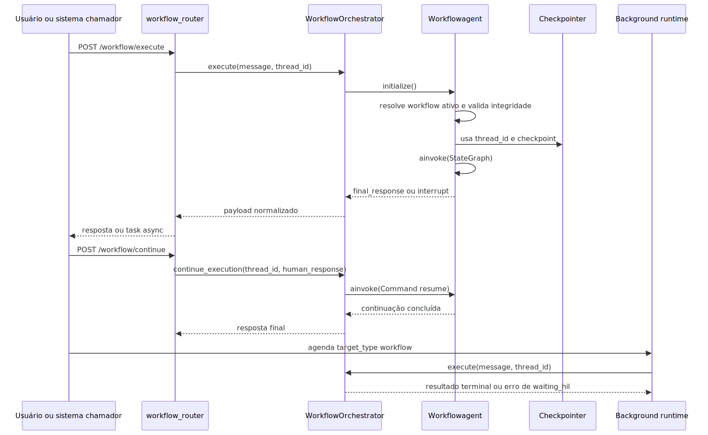

# Manual conceitual, executivo, comercial e estratégico: agente workflow completo

## 1. O que é esta feature

O agente workflow é a capacidade da plataforma para transformar um processo de negócio em trilho declarativo, governado e executável. Em vez de deixar cada automação nascer de código ad hoc, prompts soltos ou decisões implícitas, o sistema exige que o fluxo seja descrito em YAML, convertido para AST tipada, validado semanticamente e só então executado como grafo LangGraph.

Na prática, isso significa que workflow não é só um grafo e não é só um arquivo de configuração. Ele é um contrato operacional completo. Esse contrato define quais nodes existem, como os dados circulam, quando o fluxo desvia, quando uma tool é chamada, quando um subfluxo é disparado, quando o processo pausa para humano e como a execução pode ser retomada sem perder a identidade da thread.

Em termos simples: workflow é o mecanismo de transformar processo corporativo em software configurável sem abrir mão de rastreabilidade.

## 2. Que problema ela resolve

Sem workflow, três problemas aparecem rápido em automações sérias.

O primeiro é imprevisibilidade. Um processo com várias etapas, regras, validações e integrações tende a ficar espalhado entre routers, services, prompts e handlers. Isso torna o comportamento difícil de prever.

O segundo é opacidade. Quando algo falha, operação e suporte ficam sem resposta objetiva para perguntas básicas: qual passo rodou, qual decisão foi tomada, qual dado foi escrito, por que o fluxo foi para a rota B e não para a A.

O terceiro é custo de evolução. Cada novo caso de uso acaba criando seu próprio mini-orquestrador, o que gera duplicação, drift arquitetural e manutenção cara.

O workflow resolve esses três pontos impondo uma espinha dorsal única. O YAML descreve. A AST tipa. O parser coleta diagnóstico. O validador bloqueia inconsistência real. O runtime resolve o workflow ativo, monta o StateGraph, executa com checkpointer e expõe pause/continue com thread_id estável. Isso reduz improviso e aumenta governança.

## 3. Visão executiva

Para liderança, o valor do workflow não está em “usar LangGraph”. O valor está em transformar automações complexas em ativos governáveis.

Isso melhora previsibilidade operacional porque o processo deixa de depender de comportamento implícito do modelo. Também melhora governança porque selected_workflow, nodes, edges, retry_policy, human_approval e thread_id passam a ser parte de um contrato verificável. E melhora suporte porque a execução deixa trilha suficiente para diagnóstico.

Em termos executivos, workflow reduz risco de automação opaca. Ele permite dizer com clareza que o produto consegue modelar processo, aplicar regras, pausar, retomar, registrar decisões e escalar a automação sem multiplicar fluxos paralelos frágeis.

## 4. Visão comercial

Comercialmente, workflow é automação configurável com controle. A mensagem correta para cliente não é “temos IA em grafo”. A mensagem correta é “temos um motor que transforma processo de negócio em fluxo declarativo, auditável e reutilizável”.

Isso ajuda a responder objeções corporativas comuns.

- Como garantir que uma decisão de desvio não ficou escondida em prompt.
- Como provar em qual etapa o processo falhou.
- Como reaproveitar um subfluxo sem duplicar lógica.
- Como misturar IA, tools, validação de schema, canais e checkpoints sem perder governança.

O benefício percebido pelo cliente é flexibilidade com disciplina. O código lido sustenta isso até onde o processo respeita o contrato canônico. O que o produto não promete é automação livre sem gramática e sem validação.

## 5. Visão estratégica

Estratégicamente, o workflow fortalece a plataforma em seis eixos.

1. Aproxima configuração e runtime. O YAML não fica solto; ele entra em um pipeline canônico de parse, AST, validação, compilação e execução.
2. Reduz acoplamento. A lógica de processo sai de routers e services específicos e passa a viver no contrato agentic.
3. Aumenta reutilização. O modo sub_workflow permite compor fluxos maiores a partir de fluxos menores.
4. Melhora extensibilidade. Novos tipos de node precisam entrar pelo caminho oficial de AST, parser, NodeFactory e validator, o que evita crescimento caótico.
5. Prepara a plataforma para operação longa. Checkpointer, thread_id, interrupt e continue_execution tornam o runtime apto a casos mais próximos do mundo real.
6. Conecta a camada de workflow com a capacidade de background execution, que aceita target_type workflow no runtime canônico de execuções agendadas.

## 6. Conceitos necessários para entender

### 6.1. Workflow determinístico

Workflow determinístico significa que o caminho principal do processo é descrito antes da execução. O modelo pode participar de decisões, mas dentro de um trilho definido.

### 6.2. AST canônica

AST é a representação tipada do bloco workflows. Ela define a gramática oficial do recurso: quais modos existem, quais campos compartilhados cada node aceita e como edges e settings são representados.

### 6.3. Parse leniente e validação forte

O parser tenta ler o máximo possível e produzir diagnóstico útil. A validação semântica é a barreira forte que impede execução ambígua ou inconsistente.

### 6.4. Workflow ativo

Se houver mais de um workflow habilitado, o sistema não adivinha. selected_workflow passa a ser obrigatório para o resolver escolher o alvo correto.

### 6.5. Estado compartilhado

O estado do workflow é a memória operacional que passa de node para node. Ele carrega messages, variables, metadata, current_step, last_output, input_text e outros campos necessários para continuidade e auditoria.

### 6.6. Node-driven e edge-first

Node-driven é o modo em que a ordem dos nodes e campos como true_go_to, false_go_to e router.go_to_node governam a transição. Edge-first é o modo em que a transição é declarada explicitamente em edges com from, to, when e default.

### 6.7. Human-in-the-loop

Human-in-the-loop é a capacidade de interromper a execução com interrupt e retomar depois com Command resume na mesma thread.

### 6.8. Thread ID

thread_id é a identidade persistida da execução. Sem ela, não existe retomada real, apenas uma nova execução que parece continuidade.

### 6.9. Background execution

O projeto tem duas formas de rodar workflow de forma assíncrona.

- Assíncrono efêmero da API, via direct_async com BackgroundTasks e progress tracking.
- Background persistido e agendável, via capacidade agentic de background execution com target_type workflow.

Essa distinção importa porque os dois caminhos têm objetivos operacionais diferentes.

## 7. Como a feature funciona por dentro

O fluxo começa no assembly agentic. A seção workflows do YAML é parseada para WorkflowAST. Depois disso, a validação semântica verifica seleção do workflow, catálogo de tools, referências cruzadas, sub_workflow, edges e expressões. O resultado governado é então entregue ao runtime.

No runtime, WorkflowConfigResolver aplica a lógica de seleção do workflow ativo, compõe tools_library, resolve memória e entrega um ActiveWorkflowContext. Workflowagent carrega esse contexto, executa WorkflowIntegrityAnalyzer como última barreira antes da compilação, inicializa ToolsFactory e MemoryFactory, resolve checkpointer, tenta reaproveitar um grafo compilado por hash e, se necessário, monta um novo StateGraph.

Na execução, cada node é criado pela NodeFactory. As transições são montadas em modo node-driven ou edge-first. O orquestrador encapsula o runtime e normaliza a resposta para API, canais e background runtime. Quando há pause humana, a thread fica suspensa e pode ser retomada por /workflow/continue.

## 8. Divisão em etapas ou submódulos

### 8.1. Modelagem declarativa

É a etapa em que o processo é escrito em YAML. Ela existe para tornar o processo audível e editável sem espalhar a lógica em código de aplicação.

### 8.2. AST, parser e compilação

Essa camada converte YAML em contrato tipado, registra diagnósticos e prepara o fragmento canônico para validação e execução.

### 8.3. Validação semântica

Aqui o sistema rejeita workflow ambíguo, tool inexistente, edge inconsistente, seleção inválida e autorreferência de sub_workflow.

### 8.4. Resolução do contexto ativo

Essa etapa decide qual workflow efetivamente roda e qual combinação de defaults, memória e catálogo de tools vai alimentá-lo.

### 8.5. Runtime executor

É a camada que transforma contrato em StateGraph, executa nodes, registra metadata e entrega resposta final ou pausa humana.

### 8.6. Borda de produto

É a camada que expõe execução síncrona, execução assíncrona curta e retomada. Também é onde o workflow se conecta ao runtime de background persistido.

## 9. Pipeline ou fluxo principal

O ponto central do diagrama é este: o runtime não nasce do YAML bruto. Ele nasce de um pipeline de governo. Isso é o que diferencia a feature de um exemplo simples de LangGraph montado diretamente em código.

## 10. Decisões técnicas e trade-offs

### 10.1. Parser tolerante, runtime rígido

O ganho é diagnóstico melhor. O custo é pipeline mais complexo. A vantagem prática é conseguir explicar o erro sem aceitar execução insegura.

### 10.2. Dois modelos de transição

O ganho é flexibilidade. Fluxos lineares ficam compactos em node-driven. Fluxos mais auditáveis ficam explícitos em edge-first. O custo é exigir mais clareza conceitual de quem modela.

### 10.3. Checkpointer e thread_id como contrato

O ganho é continuidade real. O custo é tornar identidade da execução parte explícita do uso. Sem isso, HIL seria apenas uma simulação de pausa.

### 10.4. Base comum para nodes

O ganho é coerência. Reads, writes, retry_policy, human_approval, execution_trace e snapshots seguem padrão comum. O custo é disciplina maior ao adicionar novos modos.

### 10.5. Background efêmero separado de background persistido

O ganho é atender dois cenários diferentes.

- Execuções rápidas ou médias disparadas por API usam direct_async.
- Processos persistidos, recorrentes e agendáveis usam a capacidade agentic de background execution.

O custo é precisar explicar dois modelos assíncronos, mas isso evita misturar tarefa efêmera de request com job corporativo durável.

## 11. Configurações que mudam o comportamento

As configurações que realmente mudam o comportamento do recurso são estas.

- selected_workflow: escolhe o fluxo ativo quando há ambiguidade.
- workflows_defaults: compartilha defaults entre workflows.
- settings.max_iterations: limita iteração no runtime e no executor quando aplicável.
- edges: muda o modelo para edge-first.
- retry_policy: muda resiliência por node.
- human_approval: ativa pausa humana nos nodes compatíveis.
- tools_library e local_tools_configuration: definem catálogo efetivo de tools.
- enabled: controla elegibilidade do workflow.

Dois campos existem no contrato, mas não tiveram consumo operacional específico confirmado no slice executor lido desta tarefa.

- settings.background_execution_subagent
- local_mcp_configuration

Nesses casos, a forma correta de documentar é: presente no contrato, consumo específico não confirmado no código lido.

## 12. Contratos, entradas e saídas

O contrato declarativo principal é a coleção workflows. O contrato operacional público aparece na API.

Em /workflow/execute, a entrada inclui message, user_email, thread_id opcional, correlation_id opcional, encrypted_data e execution_mode. A saída pode ser síncrona ou assíncrona. No modo síncrono, a resposta traz final_response, execution_steps, thread_id, workflow_metadata, analysis e success. No modo assíncrono, a resposta devolve task_id e URLs de status.

Em /workflow/continue, a entrada inclui thread_id, correlation_id e human_response. A saída devolve a continuação da mesma thread, ou falha cedo se a identidade da thread for inválida.

No background persistido, a entrada da tool de agendamento inclui target_type, target_ref, requested_command e a agenda. O runtime de background aceita workflow como target_type válido.

## 13. O que acontece em caso de sucesso

No caminho feliz, a AST é aceita, a validação aprova o fluxo, o resolver escolhe o workflow ativo, o runtime inicializa memória e tools, o StateGraph executa os nodes previstos e o orquestrador devolve um payload coerente com a trilha rodada.

Em foreground, esse sucesso pode terminar em resposta final imediata ou em pausa humana recuperável por /workflow/continue.

Em background persistido, o sucesso significa que o run foi concluído com status terminal válido no runtime agentic de background.

## 14. O que acontece em caso de erro

Os erros principais se dividem em cinco famílias.

1. Erros de parse: o YAML não consegue ser lido como coleção válida de workflows.
2. Erros de validação: o contrato é legível, mas semanticamente inválido.
3. Erros de integridade runtime: o fluxo não passa na análise estática final antes da compilação.
4. Erros de execução: tool, expressão, schema, roteamento ou node falha durante a thread.
5. Erros de continuidade: a thread não existe mais, o checkpoint não está disponível ou a retomada veio sem identidade válida.

Há ainda uma limitação importante do caminho background persistido: se um workflow em background entrar em waiting_hil, o runtime agentic interrompe a execução com erro de validação para evitar um run pausado sem caminho durável de continuação.

## 15. Observabilidade e diagnóstico

O workflow deixa sinais úteis em várias camadas.

- Logs do parser e validador para problemas de contrato.
- Logs do resolver para seleção do workflow ativo.
- Logs do runtime para integridade, compilação, transições de edge e execução.
- execution_trace em metadata para trilha de nodes.
- read_snapshots e write_snapshots para explicar circulação de dados.
- correlation_id e thread_id para ligar API, runtime e retomada.

O começo da investigação costuma seguir esta ordem.

1. Qual workflow foi selecionado.
2. Qual thread_id foi usada.
3. O erro aconteceu antes do runtime ou dentro de um node.
4. Houve interrupt humana.
5. O problema está no contrato, na transição ou na tool.

## 16. Impacto técnico

O impacto técnico principal é reduzir espalhamento de lógica de processo. O workflow concentra orquestração em uma gramática comum, reaproveita ToolsFactory e MemoryFactory, padroniza state e cria uma trilha mais forte entre contrato declarativo e execução real.

## 17. Impacto executivo

O impacto executivo é previsibilidade. Automação deixa de ser comportamento implícito e passa a ser processo auditável, o que melhora governança, suporte e confiança em operações mais críticas.

## 18. Impacto comercial

O impacto comercial é oferecer automação configurável com rastreabilidade. Isso é especialmente relevante em contas enterprise que exigem processo observável, retomada controlada e capacidade de modularizar fluxos sem duplicação massiva de código.

## 19. Impacto estratégico

O impacto estratégico é consolidar o projeto como plataforma YAML-first agentic de verdade. Workflow deixa de ser recurso isolado e passa a ser uma das espinhas dorsais de orquestração da plataforma, ao lado do DeepAgent.

## 20. Exemplos práticos guiados

### 20.1. Exemplo real do repositório: edge-first declarativo

O modelo do sistema traz workflow_edge_first_demo. Ele prova que o produto suporta transição declarativa por edges, com from START, when baseado em metadata.router_decision e fallback por default. O ganho prático é tornar a transição mais auditável do que depender apenas da ordem do array de nodes.

### 20.2. Exemplo real do repositório: WhatsApp multimídia

workflow_food_whatsapp_atendimento mostra um fluxo com set, agent, function, merge, whatsapp_media_resolver e whatsapp_send. Esse caso prova que workflow não serve apenas para texto; ele já consegue preparar payload multimídia de canal, resolver media_id com cache e montar outgoing_message estruturado.

### 20.3. Exemplo real do repositório: modularização por sub_workflow

workflow_food_atendimento_modular mostra reuso explícito de sub_workflow. O fluxo pai delega ao FAQ e depois aplica um pós-processamento final. Isso é importante porque demonstra modularização real, e não apenas repetição de nodes iguais em YAMLs diferentes.

### 20.4. Exemplo real do repositório: planner e executor

workflow_food_planejamento_estrategico mostra planner, executor e finalize. Ele é a demonstração mais clara de processo em múltiplas etapas com iteração, retry e failure_policy dentro do próprio workflow.

Para consulta node a node, o manual técnico agora centraliza uma matriz rápida com os 16 modes e o exemplo composto correspondente. Isso evita espalhar exemplos curtos por vários documentos e mantém a explicação conceitual focada em valor de negócio e desenho operacional.

### 20.5. Exemplo corporativo ERP em background: conciliação de contas a pagar

Este é um cenário modelável com o runtime atual, embora o repositório lido não traga o YAML pronto desse ERP específico.

Cenário: toda madrugada, o ERP precisa comparar títulos previstos, liquidações bancárias e divergências de fornecedor.

Entrada: um workflow agendado em background com target_type workflow, target_ref do fluxo de conciliação e requested_command orientando a janela de processamento.

Processamento esperado: um node set prepara o contexto, um planner quebra o trabalho por lote ou fornecedor, um executor percorre os passos, nodes tool ou agent consultam bases ou APIs do ERP, schema_validator garante formato do consolidado e um sub_workflow pode reaproveitar a etapa de classificação de divergências.

Saída: resumo consolidado de divergências, payload estruturado para fila de exceções e telemetria persistida do run.

Impacto prático: reduzir trabalho manual de madrugada e produzir uma lista auditável de inconsistências para o financeiro.

### 20.6. Exemplo corporativo ERP em background: auditoria fiscal de notas e eventos

Este cenário também é modelável com o runtime atual, mas não apareceu como YAML pronto no codebase lido.

Cenário: um processo recorrente precisa verificar notas, eventos fiscais, confirmações e inconsistências documentais antes do fechamento diário.

Entrada: job cron em background persistido.

Processamento esperado: planner define a sequência de checagens, executor itera os passos, tool nodes consultam serviços fiscais e bases internas, function e merge consolidam payloads, schema_validator impede seguir com estrutura inválida e router ou if desviam para trilhas de erro quando houver documento inconsistente.

Saída: relatório estruturado por documento, severidade e causa provável.

Impacto prático: reduzir risco de fechamento com documento inconsistente e dar visibilidade operacional antes do fiscal perceber a falha tarde demais.

### 20.7. Exemplo corporativo ERP em background: replanejamento inteligente de backlog de pedidos

Também é um cenário suportado pela arquitetura, mas não veio pronto como YAML no repositório lido.

Cenário: um ERP omnichannel precisa reavaliar backlog de pedidos com base em SLA, estoque, prioridade comercial e capacidade de atendimento.

Entrada: execução recorrente em intervalos curtos ou por agenda fixa.

Processamento esperado: nodes set e function normalizam métricas de prioridade, um planner define grupos de reordenamento, executor aplica regras por lote, router separa pedidos críticos, sub_workflow reaproveita cálculo de criticidade e, ao final, um outgoing_message ou payload estruturado pode ser encaminhado a canais ou filas operacionais.

Saída: backlog reordenado, resumo das prioridades ajustadas e trilha auditável de por que cada grupo foi tratado primeiro.

Impacto prático: transformar uma fila estática em operação dinâmica, sem depender de análise humana contínua.

## 21. Explicação 101

Se fosse para explicar de forma simples: workflow é a linha de produção da automação. Em vez de cada tarefa improvisar o próximo passo, o sistema já sabe quais peças existem, quando desviar, o que ler, o que escrever e como parar para pedir ajuda humana. Isso faz a automação parecer menos mágica e mais profissional.

## 22. Limites e pegadinhas

- Workflow não é liberdade total de modelagem. O runtime aceita apenas os modos registrados no contrato canônico.
- YAML válido não significa workflow executável. O validator pode bloquear antes do runtime.
- Campo presente no schema não é prova automática de consumo operacional específico. Quando isso não foi confirmado no código lido, a documentação precisa dizer explicitamente.
- HIL existe no runtime de workflow e na API /workflow/continue, mas workflow em background persistido não suporta hoje uma pausa waiting_hil com continuação durável.
- Edge-first e node-driven resolvem problemas parecidos, mas têm trade-offs diferentes de legibilidade e auditoria.

## 23. Troubleshooting

Se a execução falhar antes de compilar o grafo, investigue parser, validator e integridade.

Se a continuação falhar com 400, revise thread_id e human_response.

Se a continuação falhar com 404, suspeite de checkpoint ou thread ausente.

Se o workflow em background falhar ao entrar em waiting_hil, isso é limitação atual do runtime persistido, não mero detalhe de configuração.

Se um sub_workflow quebrar cedo, revise workflow_id e possível recursão no stack.

## 24. Diagramas

O diagrama mostra um ponto importante: a mesma espinha dorsal do workflow serve tanto para API quanto para background runtime, mas o caminho background persistido hoje interrompe a execução se o workflow parar em waiting_hil.

## 25. Mapa de navegação conceitual

Para entender a feature de forma correta, siga esta ordem mental.

1. Primeiro entenda o contrato declarativo: workflows, nodes, edges, settings.
2. Depois entenda a governança: parser, compiler e validator.
3. Em seguida entenda o runtime: resolver, StateGraph, nodes e orquestrador.
4. Por fim, entenda os caminhos de produto: API síncrona, API assíncrona curta e background persistido.

## 26. Como colocar para funcionar

O caminho confirmado no código é este.

1. Criar ou ajustar um YAML com seção workflows válida.
2. Garantir que selected_workflow esteja definido quando houver mais de um fluxo habilitado.
3. Executar pela borda /workflow/execute com autenticação compatível com workflow.execute.
4. Se houver pausa humana, retomar a mesma thread com /workflow/continue.
5. Se o objetivo for job recorrente ou durável, usar a capacidade de background execution com target_type workflow.

O código lido confirma a superfície HTTP, o orquestrador e o runtime de background. Esta tarefa não incluiu execução manual ponta a ponta do fluxo.

## 27. Exercícios guiados

Exercício 1. Compare workflow_edge_first_demo com um fluxo node-driven e explique qual deles deixa a transição mais explícita para auditoria.

Exercício 2. Leia workflow_food_atendimento_modular e explique por que sub_workflow reduz duplicação real.

Exercício 3. Modele mentalmente um fluxo de contas a pagar em background e diga onde você usaria planner, executor, schema_validator e sub_workflow.

## 28. Checklist de entendimento

- Entendi o que é workflow como recurso da plataforma.
- Entendi por que ele não é só um grafo LangGraph cru.
- Entendi a diferença entre AST, validação, runtime e borda HTTP.
- Entendi a diferença entre node-driven e edge-first.
- Entendi o papel de thread_id e checkpoint.
- Entendi o que o recurso já suporta em background.
- Entendi a limitação atual de HIL no workflow background persistido.
- Entendi os casos de uso reais e os cenários ERP modeláveis.

## 29. Evidências no código

- src/config/agentic_assembly/ast/workflow.py
  - Motivo da leitura: confirmar a gramática canônica do recurso.
  - Símbolos relevantes: WorkflowAST, WorkflowNodeAST, WorkflowEdgeAST, WorkflowSettingsAST.
  - Comportamento confirmado: catálogo oficial de modos, edges declarativas e settings globais.

- src/config/agentic_assembly/parsers/workflow_parser.py
  - Motivo da leitura: confirmar parse leniente e fallback para unsupported.
  - Símbolo relevante: WorkflowParser.
  - Comportamento confirmado: modos desconhecidos geram diagnóstico e UnsupportedNodeAST.

- src/config/agentic_assembly/validators/workflow_semantic_validator.py
  - Motivo da leitura: confirmar validação de seleção, tools, edges, expressões e sub_workflow.
  - Símbolo relevante: WorkflowSemanticValidator.
  - Comportamento confirmado: falha fechada para referências cruzadas inválidas.

- src/agentic_layer/workflow/agent_workflow.py
  - Motivo da leitura: confirmar montagem do StateGraph, NodeFactory, cache por hash e execução real.
  - Símbolo relevante: Workflowagent.
  - Comportamento confirmado: suporte a edge-first, node-driven, thread_id e checkpointer.

- src/orchestrators/workflow_orchestrator.py
  - Motivo da leitura: confirmar execute e continue_execution.
  - Símbolo relevante: WorkflowOrchestrator.
  - Comportamento confirmado: retomada usa Command resume com a mesma thread.

- src/api/routers/workflow_router.py
  - Motivo da leitura: confirmar o contrato HTTP público.
  - Símbolo relevante: /workflow/execute e /workflow/continue.
  - Comportamento confirmado: execução híbrida com direct_sync, direct_async e retomada HIL.

- src/agentic_layer/background_execution/runtime.py
  - Motivo da leitura: confirmar workflow como alvo do runtime persistido de background.
  - Símbolo relevante: AgenticBackgroundExecutionRuntime.
  - Comportamento confirmado: target_type workflow é suportado, mas waiting_hil em background gera erro explícito.
