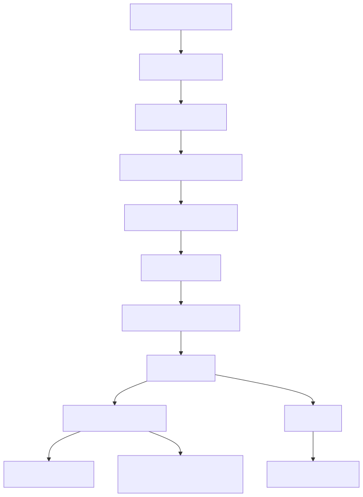

# WorkflowAgent: visão conceitual, executiva e de produto

## 1. O que é

WorkflowAgent transforma um processo de negócio em um fluxo declarativo,
governado e executável. O YAML descreve nodes e transições; a AST tipa o
contrato; validators bloqueiam inconsistências; e o runtime monta um grafo
LangGraph observável.

Em linguagem simples, ele é a linha de produção da automação. Cada estação tem
responsabilidade conhecida, dados de entrada e saída e uma regra explícita
para decidir o próximo passo.

## 2. Que problema resolve

Processos corporativos implementados apenas com prompts e handlers ad hoc
costumam sofrer com:

- comportamento difícil de prever;
- regra de desvio escondida no prompt;
- pouca evidência sobre a etapa que falhou;
- duplicação de orquestradores por caso de uso;
- pausas humanas que não conseguem retomar o mesmo estado;
- trabalhos longos presos à vida de um request web.

WorkflowAgent resolve esse conjunto com uma espinha dorsal comum: YAML, AST,
validação, grafo, checkpoint, Job Core e logs correlacionados.

## 3. Valor executivo e comercial

O valor não é apenas “usar LangGraph”. É transformar automações em ativos
governáveis:

- processos podem ser revisados antes de executar;
- decisões e transições deixam trilha;
- trabalho longo pode continuar fora do request;
- uma aprovação humana pode ocorrer horas depois sem perder a thread;
- subfluxos e Tools evitam duplicação;
- Skills carregam instruções especializadas somente quando necessárias.

Para um cliente enterprise, isso significa flexibilidade com controle. A
plataforma não promete uma automação sem limites; promete uma automação
configurável dentro de um contrato verificável.

## 4. Conceitos essenciais

### Workflow determinístico

O trilho principal existe antes da execução. A LLM pode classificar, planejar
ou produzir conteúdo, mas dentro de nodes e destinos governados.

### AST canônica

A AST é a representação tipada do contrato agentic. No domínio de Workflow,
ela define modes, nodes, settings, edges e referências válidas. O YAML
persistido é compilado a partir desse modelo governado.

### Parse diagnóstico e validação forte

O parser tenta coletar o máximo de informação útil. O validator decide se o
contrato pode executar. Conseguir ler um YAML não significa aceitá-lo.

### Node-driven e edge-first

- Node-driven liga o fluxo pela ordem dos nodes e destinos declarados neles.
- Edge-first explicita as arestas e condições em `edges`.

O primeiro é compacto para sequências simples. O segundo facilita auditoria de
fluxos com muitos desvios.

### Estado, checkpoint e thread

O estado transporta mensagens, variáveis, contexto, saídas e metadados entre
nodes. O checkpointer persiste esse estado. `thread_id` identifica a execução
que será retomada. Sem a mesma thread, não existe continuidade real.

### Skills

Skill é um pacote de instruções especializado. A biblioteca fica na raiz do
YAML, e cada node `agent` escolhe os nomes que pode usar. O prompt recebe só
nome e descrição; o conteúdo completo é aberto por `read_file` quando o modelo
identifica que precisa dele. Esse modelo reduz contexto inicial e separa
instrução especializada do prompt geral.

### Human-in-the-Loop

HIL é a pausa governada para decisão humana. Um `interrupt` suspende a thread;
uma resposta ou decisão tipada aplica `Command(resume=...)` ao mesmo estado.

## 5. Como funciona

```text
YAML
  -> AST e diagnósticos
  -> compilação canônica
  -> validação semântica
  -> resolução do workflow ativo
  -> montagem/reuso do StateGraph
  -> execução por node
  -> resposta, pausa HIL ou Job Core
```

O runtime não nasce do YAML bruto. Essa etapa de governo é o que diferencia o
produto de um grafo montado diretamente em um script.



## 6. Skills no WorkflowAgent

O contrato permite Skills somente em node `agent`:

```yaml
skills_library:
  - name: "politica-devolucao"
    description: "Use para dúvidas sobre devolução e arrependimento."
    content: |
      # Política de devolução
      - Confirme a data de entrega.
      - O prazo é 7 dias corridos.

workflows:
  - id: "atendimento"
    enabled: true
    nodes:
      - id: "responder"
        mode: "agent"
        skills: ["politica-devolucao"]
        prompt:
          system: "Leia a skill aplicável antes de responder."
```

Três garantias importam:

1. nome ausente na biblioteca reprova a configuração;
2. cada node enxerga apenas sua seleção;
3. workflow sem Skills não paga o custo de abrir o store.

O conteúdo é materializado no store PostgreSQL canônico, isolado por ambiente,
usuário, workflow e node. Não há tabela `agent_skills` como fonte paralela.

## 7. Três modelos de execução

### Síncrono

`/workflow/execute` com `direct_sync` aguarda o grafo e devolve o resultado na
mesma chamada. É apropriado quando a duração cabe no request.

### Assíncrono imediato

`/workflow/execute` com `direct_async` publica uma execução no Job Core e
devolve `task_id` e URLs de acompanhamento. Esse caminho não depende de
`FastAPI BackgroundTasks`.

### Agendado

A Tool `schedule_background_execution_request` registra uma agenda no
Scheduler para alvo `workflow` ou `deepagent`. É o caminho para recorrência ou
execução futura.

`direct_async` e agendamento são duráveis, mas respondem a intenções
diferentes: “execute agora fora do request” e “execute conforme agenda”.

## 8. HIL no foreground e em background

### Foreground

O integrador chama `/workflow/continue` com a mesma `thread_id`, a mesma
`correlation_id` e exatamente um entre resposta livre ou `resume` tipado.

### Background

Workflow background também pode pausar e continuar. O desenho usa dois jobs:

1. o primeiro job chega a uma ação que exige aprovação;
2. a plataforma persiste o pedido HIL;
3. o aprovador decide por API segura ou canal;
4. a decisão publica um segundo job, com nova correlação;
5. esse job retoma a mesma thread;
6. uma nova pausa cria uma nova rodada de aprovação.

O HTTP `202 continuation_submission_confirmed` significa que o segundo job foi
aceito, não que terminou. O cliente deve acompanhá-lo.

Esse desenho evita manter um processo web vivo enquanto aguarda uma pessoa e
preserva a regra de uma correlação por execução.

## 9. Integração com DeepAgent

Há duas formas, com semânticas diferentes:

- `deepagent_call`: delegação síncrona; o resultado volta ao grafo e uma pausa
  do DeepAgent pode ser propagada como interrupt do workflow;
- Tool de background: agenda um alvo `deepagent`; o retorno imediato é o
  protocolo do agendamento, não o resultado final do especialista.

Escolha pela necessidade de continuidade imediata ou desacoplamento temporal,
não por preferência de implementação.

## 10. Exemplos de negócio

### Atendimento com política sob demanda

Um primeiro node `agent` seleciona uma Skill de troca ou escalonamento e abre o
`SKILL.md`. Um segundo node revisa a resposta sem receber Skills. Isso reduz o
contexto e impede que o revisor invente uma política diferente.

Exemplo versionado:
[`rag-config-workflow-skills-demo.yaml`](../../app/yaml/rag-config-workflow-skills-demo.yaml).

### Conciliação financeira recorrente

O Scheduler dispara o workflow toda madrugada. Nodes consultam sistemas,
normalizam títulos e classificam divergências. Quando uma ação sensível exige
aprovação, o primeiro job registra HIL; após a decisão, o segundo job retoma e
publica o resultado.

### Atendimento multimídia

Nodes de transformação, agente, merge, resolução de mídia e envio de WhatsApp
formam um processo com dados estruturados. A LLM produz apenas o conteúdo que
cabe ao node; a entrega ao canal continua governada.

### Investigação com DeepAgent

O workflow prepara os dados e chama um supervisor especialista por
`deepagent_call`. Depois, valida o retorno e segue para uma etapa determinística
de decisão ou apresentação.

## 11. Modelo de dados em linguagem 101

Cada componente guarda apenas o que lhe pertence:

| Componente | Guarda |
| --- | --- |
| Scheduler | agenda e comando a executar |
| Job Core | lifecycle, tentativas, lease e eventos do job |
| `agent_background` | alvo, resultado/erro funcional, aprovação HIL e outbox |
| Checkpointer/store | estado da thread e materialização de Skills |

Não há um segundo lifecycle escondido nas tabelas agentic. Isso evita duas
fontes discordando sobre o estado da mesma execução.

## 12. Observabilidade

Uma investigação deve conseguir responder:

- qual workflow e node executaram;
- qual thread foi pausada ou retomada;
- qual transição foi escolhida;
- quais dados foram lidos e escritos;
- quais Skills foram expostas ao node;
- qual job gerou a aprovação e qual job continuou;
- qual correlação pertence a cada execução.

O cliente captura a correlação devolvida pelo boundary. Ele não inventa uma
correlação para o primeiro request nem reaproveita a correlação do primeiro job
como identidade do segundo.

## 13. Limites e cuidados

- YAML sintaticamente válido ainda pode ser semanticamente inválido.
- Skills só pertencem a nodes `agent` e exigem store PostgreSQL resolvido.
- Um token HIL não deve ir em query string nem ser aprovado por GET.
- `202` exige acompanhamento posterior.
- `projectKey` e `encrypted_data` não podem competir no mesmo execute.
- `subprocess` não é modo público do endpoint; use `direct_async`.
- O resultado factual do domínio agentic não substitui o lifecycle do Job
  Core.

## 14. Como começar

1. Leia o [tutorial 101 de Workflow, Skills e HIL](../usuario/TUTORIAL-101-WORKFLOW-SKILLS-HIL.md).
2. Parta do YAML de demonstração versionado.
3. Valide a AST por `/config/assembly/validate`.
4. Prove primeiro o caminho `direct_sync`.
5. Prove pausa e continuação na mesma thread.
6. Só então valide `direct_async` ou agendamento, acompanhando o Job Core.
7. Em falha real, use o `correlation_id` para consultar o log oficial.

## 15. Evidências executáveis

- `src/config/agentic_assembly/ast/workflow.py`
- `src/config/agentic_assembly/validators/workflow_semantic_validator.py`
- `src/agentic_layer/workflow/agent_workflow.py`
- `src/agentic_layer/workflow/nodes/agent_node.py`
- `src/agentic_layer/workflow/nodes/deepagent_call_node.py`
- `src/agentic_layer/skills/skills_store_materializer.py`
- `src/api/routers/workflow_router.py`
- `src/api/routers/agent_router.py`
- `src/api/services/workflow_direct_async_publisher.py`
- `src/api/services/background_hil_continuation_execution_service.py`
