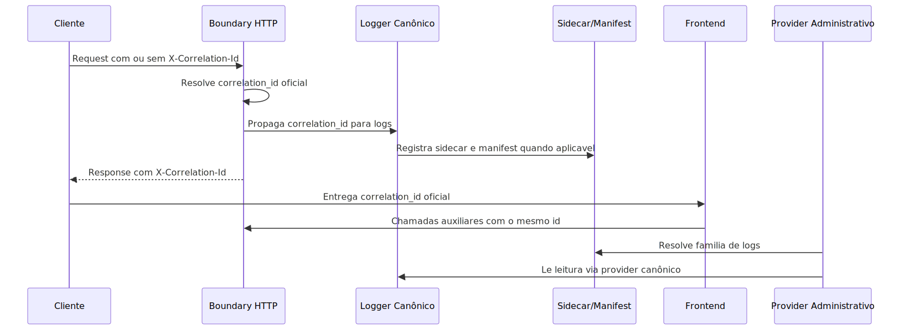

# Manual conceitual: correlation_id, logs e rastreabilidade operacional

## 1. O que este documento explica

Este manual explica a regra conceitual do projeto para correlation_id e logs.
O foco aqui nao e detalhar cada classe, e sim responder tres perguntas simples.

1. Onde nasce a identidade oficial da execucao.
2. Como essa identidade atravessa backend, worker, scheduler e UI.
3. Como o log deixa de ser texto solto e vira evidencia operacional.

Em linguagem simples: este sistema foi desenhado para que uma execucao real possa ser seguida ponta a ponta sem adivinhacao.

## 2. Ideia central

O projeto trata correlation_id como a identidade oficial de uma execucao real.
Ele nao e um detalhe visual e nao e um numero local criado por qualquer camada.
Ele nasce no boundary oficial do processo e, a partir desse ponto, precisa ser preservado.

O log, por sua vez, nao e tratado como diario informal.
Ele e tratado como evidência operacional.
Isso significa que os eventos precisam usar nomes previsiveis, campos canônicos e contexto suficiente para reconstruir o caminho real do runtime.

## 3. Regras conceituais do correlation_id

### 3.1. Regra de origem

Em requests HTTP normais, o boundary oficial compartilhado e o middleware de request.
Ele tenta reutilizar um correlation_id ja presente em request.state, depois no header X-Correlation-Id e, so se nada existir, cria um unico id oficial para aquela execucao.

Em processos nao interativos iniciados pelo proprio sistema, como scheduler, runner ou outro iniciador real de produto, esse iniciador ocupa o papel de boundary oficial.
Ele cria uma unica vez o correlation_id oficial e abre a execucao ja com o logger oficial ligado a esse mesmo id.

Em linguagem simples: o sistema tenta preservar o id existente antes de criar outro. Criar um novo id no meio do caminho e erro de rastreabilidade.

### 3.2. Regra de propagacao

Depois que o id oficial foi resolvido, as camadas abaixo nao devem criar outro.
Services, workers, schedulers, tools, repositories, gateways e componentes de dominio devem receber esse valor e continuar usando o mesmo.

O contrato da classe base BaseCorrelationComponent reforca essa regra ao exigir user_session.correlation_id e user_session.user_email no yaml_config e ao criar o logger do componente via create_logger_with_correlation.

### 3.3. Regra da resposta HTTP

Quando a execucao passa pela API, a resposta precisa devolver X-Correlation-Id.
Se a resposta for JSON compativel e ainda nao trouxer correlationId ou correlation_id no corpo, o middleware injeta correlationId no payload.

Em linguagem simples: quem chamou a API recebe o id oficial de volta para poder acompanhar status, baixar log e cruzar a trilha da execucao.

### 3.4. Regra da UI

O frontend nao pode gerar correlation_id.
No codigo atual, existe inclusive uma funcao legado no browser que falha de proposito quando alguem tenta criar um id client-side.

O papel da UI e este:

1. capturar o id devolvido pelo backend;
2. exibir esse valor ao operador quando fizer sentido;
3. propagar o mesmo id em chamadas auxiliares relacionadas a mesma execucao.

Em linguagem simples: o browser so carrega a etiqueta oficial que o backend emitiu. Ele nao inventa uma etiqueta nova.

## 4. Regras conceituais do log

### 4.1. Logger canônico e logger tecnico nao sao a mesma coisa

Quando o componente esta dentro de um processo real correlacionado, o caminho correto e create_logger_with_correlation.
Quando o componente esta apenas emitindo log tecnico fora de um processo real, o caminho correto e create_component_logger.

Fora do boundary oficial, o componente nao pode criar logger com identidade propria so porque ficou mais pratico.
Se a classe precisar de um logger local, essa instancia local precisa nascer com o mesmo correlation_id oficial ja existente no contexto.

Isso evita dois erros comuns:

1. usar logger tecnico para esconder uma execucao real sem correlation_id;
2. criar correlation_id artificial so para “poder logar”;
3. criar logger novo com identidade propria no meio de uma execucao que ja tem contexto oficial.

### 4.2. Log estruturado nao e liberdade total

O projeto nao aceita cada modulo inventando o proprio vocabulário global.
Os campos transversais vivem em src/core/log_canonical_fields.py.
O builder global build_canonical_log_context(...) monta a parte canônica do payload.

Quando um slice precisa de semantica propria, ele compoe sobre isso, como acontece com os builders de ingestao e RAG.

### 4.3. Event_name e obrigatorio

O runtime tolera receber LogRecord comum, mas quando um evento chega sem event_name canônico o formatter marca isso como logging.contract.violation.

Em linguagem simples: JSON sozinho nao prova conformidade. Se o evento nao vier com nome oficial previsivel, o proprio sistema deixa claro que houve violacao do contrato.

### 4.4. O log precisa contar a historia

O objetivo do log neste projeto e permitir debug offline.
O operador precisa conseguir responder perguntas como estas sem abrir o processo em modo debug:

1. qual execucao estou investigando;
2. em qual boundary ela entrou;
3. quais componentes receberam o controle;
4. onde ela falhou, desviou ou terminou;
5. qual arquivo ou provider administrativo contem essa trilha.

## 5. Como a arquitetura funciona de ponta a ponta

### 5.1. Fluxo principal

1. A requisicao entra na API.
2. O middleware resolve o correlation_id oficial.
3. O request recebe esse valor em request.state e nos contextvars do request.
4. Os componentes correlacionados emitem logs usando esse mesmo id.
5. A resposta devolve X-Correlation-Id e, quando cabivel, correlationId no JSON.
6. A UI captura o valor e o reutiliza em operacoes auxiliares.
7. A trilha operacional pode ser lida depois pelo provider canônico de logs.

### 5.2. Arquivo dedicado, sidecar e manifest

Quando o correlation_id esta no formato canônico e enable_correlation_file_logging esta ligado, create_logger_with_correlation cria arquivo dedicado por correlacao.
Nessa mesma etapa, o runtime grava um sidecar de origem e registra a relacao no correlation_manifest.jsonl.

Em linguagem simples: o sistema nao depende de listar cegamente a pasta inteira de logs para descobrir onde esta o caso certo.

### 5.3. Provider administrativo

Para ler logs depois da execucao, o projeto usa um provider canônico.
Em development, o provider ativo e sempre filesystem.
Fora de development, LOG_PROVIDER_TYPE precisa estar explicitamente configurado com um valor suportado.

O sistema nao tenta adivinhar provider alternativo para mascarar erro de configuracao.

## 6. O que a arquitetura evita

Esta arquitetura foi montada para bloquear alguns vicios operacionais.

### 6.1. Evita correlation_id paralelo

Nao pode haver helper, service, worker ou browser criando outro id no meio do caminho porque isso quebra a linha de rastreabilidade.

### 6.2. Evita payload global improvisado

Nao pode haver cada modulo inventando nomes globais diferentes para a mesma ideia, como usar step, phase e etapa como alias livres de stage.

### 6.3. Evita fallback escondido de provider

Fora de development, o ambiente precisa dizer explicitamente qual provider administrativo de logs sera usado.
Se a configuracao estiver errada, o sistema falha cedo.

### 6.4. Evita frontend inventando identidade

O browser so recebe, mostra e reaproveita a identidade oficial emitida pelo backend.

## 7. Como pensar nisso no dia a dia

Se voce estiver criando ou ajustando um fluxo, use esta regra mental.

1. Descubra qual e o boundary oficial do processo.
2. Garanta que o correlation_id nasce ali uma unica vez.
3. Garanta que os componentes abaixo so preservam esse valor.
4. Garanta que os logs usem event_name previsivel e campos canônicos.
5. Garanta que o chamador consiga recuperar o mesmo id na resposta.

Se qualquer camada estiver criando outro correlation_id, escrevendo log global com vocabulário paralelo ou escondendo provider por fallback, a arquitetura foi quebrada.

## 8. Diagrama conceitual

## 9. Evidencia no codigo

- src/api/service_api.py
- src/core/logging_system.py
- src/core/base_correlation_component.py
- src/core/log_canonical_fields.py
- src/core/log_origin_metadata.py
- src/api/services/log_provider_service.py
- src/api/services/canonical_log_reader.py
- src/api/services/logs_admin_service.py
- app/ui/static/js/plataforma-agentes-ia-crypto.js
- app/ui/static/js/admin-ingestao.js
- app/ui/static/js/ui-webchat-v3.js

## 10. Lacunas no codigo

### 10.1. Tracing distribuido

Nao encontrado no codigo.

Onde deveria estar:

- src/core/
- src/api/services/
- src/telemetry/

### 10.2. Contrato canônico de telemetria frontend

Nao encontrado no codigo.
O frontend atual captura e propaga correlation_id, mas nao existe um contrato formal de emissao de logs canônicos de browser equivalente ao backend.

Onde deveria estar:

- app/ui/static/js/
- app/ui/static/
