# Manual conceitual, executivo, comercial e estratégico: arquitetura e stack do projeto

## 1. O que é esta feature

Neste contexto, “arquitetura e stack do projeto” não é uma feature isolada. É a explicação de como a plataforma inteira foi montada para operar como produto de IA aplicada, integração governada e execução operacional contínua. O código lido mostra um sistema que junta API HTTP, processamento assíncrono, agendamento, assembly agentic, ingestão, RAG, canais, autenticação, logging e integrações especializadas dentro da mesma fundação.

O ponto mais importante é este: o repositório não foi desenhado como um aplicativo único que só responde perguntas. Ele foi montado como plataforma. Isso significa que a arquitetura existe para suportar famílias de fluxos diferentes com base compartilhada, controle operacional e expansão por configuração.

## 2. Que problema ela resolve

Sem essa arquitetura, cada capacidade do produto tenderia a nascer como um subsistema separado: uma API para ingestão, outra para agentes, outro processo para jobs, outro projeto para canais, outro código para checkout, outro para dashboards, outro para observabilidade. Esse desenho costuma gerar três problemas graves:

- duplicação de infraestrutura e de lógica transversal;
- acoplamento entre features que crescem sem contrato claro;
- dificuldade de operar, auditar e evoluir o sistema sem quebrar outras frentes.

O projeto resolve isso criando uma fundação comum em que API, worker e scheduler têm papéis explícitos, a configuração operacional nasce de YAML, os fluxos agentic passam por AST e validação semântica, e os recursos externos entram por contratos e camadas especializadas.

## 3. Visão executiva

Executivamente, a arquitetura importa porque transforma um conjunto de features de IA em uma plataforma governável. O ganho não é só técnico. O negócio passa a ter uma base única para entregar ingestão, RAG, agentes, canais, analytics e integrações externas sem multiplicar projetos independentes a cada nova necessidade.

Isso reduz risco em quatro frentes:

- risco operacional, porque API, worker e scheduler não disputam a mesma responsabilidade;
- risco de produto, porque a expansão funcional reutiliza a mesma fundação;
- risco de governança, porque configuração, permissões e logs atravessam vários domínios com padrão comum;
- risco de suporte, porque a observabilidade foi desenhada para contar a história da execução com correlation_id.

## 4. Visão comercial

Comercialmente, a stack e a arquitetura sustentam uma proposta de valor mais forte do que “chat com IA”. O código lido suporta uma narrativa de plataforma para varejo, operação, integração e automação governada.

Isso permite vender a base como infraestrutura de solução, não apenas como tela ou endpoint. O mesmo núcleo consegue sustentar:

- ingestão e consulta de conhecimento;
- agentes configurados por YAML;
- workflows determinísticos;
- analytics e NL2SQL governado;
- canais como WhatsApp e Instagram;
- jornadas UCP e slices de varejo via AG-UI.

O diferencial comercial prático é este: a empresa não precisa montar uma pilha nova para cada cliente ou cada canal. Ela reutiliza uma fundação já preparada para conectar dados, agentes, canais e integrações.

## 5. Visão estratégica

Estrategicamente, a arquitetura fortalece a plataforma porque combina três características difíceis de manter juntas:

- flexibilidade de composição por YAML;
- controle forte por contratos, validação e permissões;
- separação operacional entre borda HTTP, execução assíncrona e agendamento.

Esse desenho prepara o produto para crescer em novos casos de uso sem depender de refações totais. Em vez de cada nova capability forçar outro sistema paralelo, ela tende a entrar como novo slice sobre a mesma espinha dorsal operacional.

## 6. Conceitos necessários para entender

### 6.1 Plataforma

Aqui, plataforma significa uma base reutilizável que suporta múltiplos fluxos de negócio. Isso é diferente de uma aplicação isolada. O código mostra isso porque o mesmo runtime suporta ingestão, consulta, workflows, DeepAgent, canais, provisionamento, autenticação, NL2SQL, logs e operação agendada.

### 6.2 Topologia de processos

A arquitetura operacional foi separada em três processos principais:

- API: recebe requisições, autentica, valida contratos e expõe endpoints.
- Worker: executa processamento assíncrono e componentes pesados sem bloquear a borda.
- Scheduler: executa tarefas de manutenção, reconciliação e disparo temporal.

Essa separação existe para reduzir contenção, melhorar previsibilidade e tornar o comportamento operacional mais legível.

### 6.3 YAML-first com governança

O sistema usa YAML como fonte declarativa de comportamento, mas não executa esse YAML como texto livre. O YAML passa por resolução, montagem tipada, validação e compilação. Isso é o que permite flexibilidade sem abrir mão de contrato.

### 6.4 Runtime agentic

O runtime agentic é a camada em que supervisores, DeepAgents, workflows e tools são materializados para execução. Ele depende da configuração declarativa, mas é governado por AST, validators, catálogo de tools e lógica de montagem.

### 6.5 Stack

Neste manual, stack significa o conjunto de tecnologias e infraestruturas que tornam a plataforma executável. Não é só linguagem de programação. Inclui runtime web, mensageria, cache, persistência, vector store, bibliotecas agentic, UI, testes, container e dependências de integração.

## 7. Como a arquitetura funciona por dentro

O projeto começa pela separação operacional. O launcher principal e os runners dedicados confirmam que API, worker e scheduler são processos diferentes. A API sobe o boundary FastAPI com middlewares, routers, validação de infraestrutura e endpoints especializados. O worker sobe um runtime assíncrono com bootstrap coordenado, fila obrigatória e serviços de processamento. O scheduler sobe a camada temporal e de manutenção.

Sobre essa topologia, o sistema organiza capacidades de domínio em slices. Alguns produzem acervo e contexto, como ingestão, ETL, schema metadata e vector stores. Outros consomem esse contexto para responder, decidir e agir, como RAG, NL2SQL, DeepAgent, workflows, canais e UCP. Em volta disso, há uma camada transversal de segurança, permissões, configuração, logging e startup guardrails.

Em termos simples, a arquitetura foi montada como um conjunto de trilhos. O domínio especializado pode variar, mas a fundação operacional continua a mesma.

## 8. Divisão em etapas ou submódulos

### 8.1 Borda HTTP e contratos públicos

É a camada que recebe requisições e expõe o produto para UI, integrações, automações e operação. Ela existe para concentrar autenticação, autorização, middlewares, validação, roteamento e serialização.

### 8.2 Execução assíncrona e jobs

É a camada que retira carga pesada da borda HTTP. Ela existe porque ingestão, ETL, pipelines e fan-out documental não devem competir com a API pelo mesmo processo.

### 8.2.1 Job Core V1 e fila canônica

Em termos simples, a plataforma agora trata job assíncrono como uma ficha única de trabalho. Essa ficha nasce como `JobEnvelope` e é transportada como `QueuedJobEnvelope`. O produtor oficial, seja API, scheduler ou produtor interno, publica essa ficha pelo mesmo contrato: `publish_job_envelope(...)`.

Na prática, isso evita um problema comum em sistemas que cresceram por fatias: cada domínio criar seu próprio jeito de mandar trabalho para a fila. Quando isso acontece, o runtime vira um conjunto de atalhos paralelos difícil de auditar. O corte recente eliminou essa direção no caminho oficial.

O worker continua usando RabbitMQ e Dramatiq como transporte e consumo reais, mas a decisão sobre qual trabalho executar passou a depender do envelope canônico e do roteamento por `route_kind + dispatch_mode`. Isso significa o seguinte em linguagem direta:

- existe uma porta oficial de publicação de job;
- existe um dispatcher oficial de job;
- existe um runtime oficial de consumo de job.

O efeito prático é reduzir ambiguidade. Ingestão pai, ingestão `resolve_on_worker`, filho de fan-out documental, ETL e background execution continuam existindo, mas todos entram pela mesma porta e pelo mesmo trilho de execução.

No slice de ingestão, isso aparece hoje em dois boundaries canônicos complementares. Um publica `prepared_yaml` quando a borda HTTP já resolveu o YAML. O outro publica `resolve_on_worker` quando a borda envia o payload criptografado para resolução final dentro do worker. Os dois continuam no mesmo contrato de job, sem abrir publish paralelo.

### 8.3 Agendamento e manutenção

É a camada responsável por tarefas recorrentes, despacho temporal e housekeeping operacional. Ela existe para que a plataforma continue íntegra ao longo do tempo, sem depender só de chamadas síncronas de usuários.

### 8.4 Núcleo agentic e configuração declarativa

É a camada que materializa supervisores, DeepAgents, workflows, tools e runtime agentic a partir do YAML. Ela existe para permitir composição sem transformar cada novo caso de uso em código hardcoded.

### 8.5 Dados, busca e contexto

É a camada que transforma documentos, integrações e dados estruturados em acervo consultável. Ela sustenta ingestão, ETL, schema metadata, vector stores, catálogos e recuperação contextual.

### 8.6 Governança transversal

É a camada que garante que tudo isso continue controlável. Inclui permissões, autenticação, correlation_id, logs estruturados, checagens de infraestrutura e validação explícita de contratos.

## 9. Pipeline ou fluxo principal

O fluxo macro da plataforma, olhando de ponta a ponta, segue esta lógica:

1. Um cliente, UI, canal ou sistema externo chama a API.
2. A API autentica, aplica permissões, valida o contexto e decide se a operação é síncrona ou assíncrona.
3. Se a operação for pesada ou temporal, ela é deslocada para worker ou scheduler.
4. Quando a operação vira job assíncrono, o produtor monta um envelope canônico e o worker o entrega ao Job Core V1 pelo runtime oficial RabbitMQ + Dramatiq.
5. O runtime agentic ou o pipeline de dados usa o YAML e os contratos tipados para montar a execução real.
6. O sistema consulta dados, vector stores, tools, canais ou integrações externas conforme o caso.
7. O resultado volta à API, ao canal, à UI ou ao estado persistido do processo.
8. A observabilidade registra o caminho inteiro com correlation_id e logs estruturados.

No worker, a prontidão completa também é observável por markers distintos. `MULTICHANNEL_SUPERVISOR_READY` confirma o plano de controle, `WORKER_RUNTIME_READY` confirma o runtime unificado e `WORKER_READY` fecha o bootstrap do processo. Isso ajuda a separar falha de startup do worker de falha do domínio assíncrono.

Esse fluxo é importante porque mostra que a plataforma foi desenhada para compor capacidades, não para responder apenas em uma camada única.

## 10. Decisões técnicas e trade-offs

### 10.1 Separar API, worker e scheduler

Ganho: previsibilidade operacional, menor contenção e melhor observabilidade por papel.

Custo: mais complexidade de bootstrap e coordenação entre processos.

### 10.2 YAML-first com AST e validação

Ganho: alta configurabilidade com governança.

Custo: aumenta a complexidade da camada de assembly e exige documentação forte para evitar uso incorreto.

### 10.3 Plataforma única para vários domínios

Ganho: reuso, expansão comercial e coerência operacional.

Custo: exige disciplina arquitetural para o projeto não virar um monólito confuso.

### 10.4 Infraestrutura mandatória com fail-fast

Ganho: evita iniciar processos em estado semi-quebrado.

Custo: aumenta a exigência de ambiente correto antes do bootstrap.

## 11. Configurações que mudam o comportamento

As configurações mais relevantes observadas no código para a arquitetura são estas:

- PROCESS_ROLE: define se o processo atual é API, worker ou scheduler.
- FASTAPI_HOST, FASTAPI_PORT e FASTAPI_WORKERS: moldam o bootstrap HTTP.
- ASYNC_JOB_QUEUE_BACKEND e ASYNC_JOB_CONSUMER_RUNTIME: governam a esteira assíncrona obrigatória.
- RABBITMQ_AMQP_URL e afins: definem a fila mandatória do runtime.
- INGESTION_TELEMETRY_DSN e OFFLINE_KEY_STORE_DSN: sustentam contratos PostgreSQL mandatórios.
- REDIS_*: sustentam cache, coordenação e partes do controle operacional.
- YAMLs de app/yaml: determinam supervisores, workflows, tools, pipelines e integrações por tenant ou cenário.

## 12. Contratos, entradas e saídas

No nível de arquitetura, os principais contratos confirmados são:

- contratos HTTP expostos pela FastAPI;
- contratos YAML tipados e validados do assembly agentic;
- contratos de fila e runtime assíncrono obrigatórios;
- contrato canônico de job assíncrono por `JobEnvelope` e `QueuedJobEnvelope`;
- contratos de persistência e readiness para PostgreSQL;
- contratos de cache e coordenação em Redis;
- contratos de busca vetorial e busca gerenciada.

## 13. O que acontece em caso de sucesso

Quando o ambiente está íntegro e a configuração é válida, cada processo assume seu papel. A API aceita requisições, o worker processa a carga assíncrona, o scheduler mantém os ciclos recorrentes, o runtime agentic monta os fluxos do YAML, e a observabilidade permite rastrear cada execução.

Na prática, isso significa que a plataforma consegue expor endpoints, executar tarefas pesadas, disparar manutenção, consultar dados e coordenar agentes sem depender de um único processo fazendo tudo ao mesmo tempo.

## 14. O que acontece em caso de erro

O desenho favorece falha explícita em infraestrutura mandatória. O código de startup valida PostgreSQL obrigatório, Redis e backend assíncrono antes de entregar controle ao runtime principal. Isso evita subir uma plataforma que parece viva, mas falha logo depois em pontos críticos.

Também há isolamento entre processos. Um problema de processamento assíncrono não precisa derrubar a borda HTTP para ser tratado como incidente de worker. Essa separação melhora o diagnóstico e a contenção.

## 15. Observabilidade e diagnóstico

Observabilidade aqui não é apêndice. Ela faz parte da arquitetura. O projeto usa correlation_id, logging estruturado, markers de prontidão, logs dedicados por processo e checagens de startup para contar a história da execução.

Do ponto de vista operacional, isso permite responder perguntas como:

- o processo nem chegou a subir ou caiu depois do bootstrap;
- o problema está na API, no worker ou no scheduler;
- faltou infraestrutura obrigatória ou houve erro de negócio mais adiante;
- a falha ocorreu antes ou depois da montagem do runtime agentic.

## 16. Impacto técnico

Tecnicamente, a arquitetura reduz acoplamento entre borda, processamento pesado e agendamento. Também encapsula melhor as responsabilidades transversais e torna possível expandir a plataforma por slices de domínio sem reescrever a fundação.

## 17. Impacto executivo

Executivamente, a arquitetura aumenta previsibilidade de evolução e reduz custo de manter soluções desconectadas. A empresa passa a operar uma base única para múltiplas ofertas e múltiplos clientes.

## 18. Impacto comercial

Comercialmente, a stack e a arquitetura viabilizam pacotes consultivos e de produto sobre a mesma fundação. Isso acelera discovery, prova de valor, implantação e expansão por canal, por jornada ou por capacidade de IA.

## 19. Impacto estratégico

Estrategicamente, a plataforma fica mais preparada para crescer em direção a novos agentes, novos canais, novas integrações e novos fluxos de operação sem depender de refações estruturais totais.

## 20. Exemplos práticos guiados

### 20.1 Exemplo de leitura do sistema como plataforma

Um mesmo repositório expõe rotas de AG-UI, provisionamento de Instagram, checkout UCP, execução de agente, workflow, RAG e administração. Isso mostra que a arquitetura foi desenhada para reunir domínios diferentes sob contratos comuns de segurança, configuração e observabilidade.

### 20.2 Exemplo de valor da separação operacional

Uma ingestão pesada pode ser empurrada para o worker enquanto a API continua aceitando requisições e o scheduler continua cuidando de manutenção. O ganho prático é evitar que um pipeline caro degrade toda a plataforma.

## 21. Explicação 101

Uma forma simples de entender esta arquitetura é pensar em uma empresa com três times operacionais diferentes. Um atende a porta de entrada, outro executa o trabalho pesado nos bastidores e o terceiro cuida do que precisa acontecer na hora certa. Todos usam a mesma regra da casa, os mesmos registros e a mesma fonte de configuração. Isso é exatamente o que API, worker e scheduler fazem aqui.

## 22. Limites e pegadinhas

- O projeto é amplo. Ler só um entrypoint não basta para entender a plataforma.
- O pyproject não representa sozinho toda a stack operacional; requirements e Dockerfile complementam essa verdade.
- A flexibilidade do YAML não significa ausência de contrato. O assembly agentic existe justamente para impedir isso.
- O índice anterior apontava para um README-ARQUITETURA inexistente; essa era uma lacuna documental real do catálogo central.

## 23. Troubleshooting

### Sintoma: a plataforma sobe parcialmente

Causa provável: um dos processos ou dependências mandatórias não está íntegro. A primeira distinção correta é identificar se a falha pertence à API, ao worker ou ao scheduler.

### Sintoma: ambiente local “parece funcionar”, mas o runtime quebra depois

Causa provável: a infraestrutura obrigatória não foi validada como em produção. O código atual favorece fail-fast justamente para evitar esse falso positivo.

### Sintoma: time entende a plataforma como um único app web

Esse entendimento está errado. O código lido confirma um runtime multiprocesso com espinha dorsal YAML-first, stack agentic e infraestrutura externa mandatória.

## 24. Diagramas

### 24.1 Fluxo macro da arquitetura

O diagrama mostra que API, worker e scheduler não são anexos do sistema. Eles são a topologia operacional principal sobre a qual os domínios especializados executam.

## 25. Mapa de navegação conceitual

- Topologia operacional: API, worker, scheduler.
- Configuração e governança: YAML, settings, AST, validators.
- Núcleo de capacidades: ingestão, ETL, RAG, agentic, canais, UCP.
- Infraestrutura externa: PostgreSQL, Redis, RabbitMQ, vector stores, integrações cloud.
- Observabilidade e segurança: permissões, autenticação, logs, correlation_id.

## 26. Como colocar para funcionar

O caminho confirmado no código é subir explicitamente os papéis necessários com o launcher principal ou pelos entrypoints dedicados. A fundação operacional pressupõe ambiente com Python 3.11, API FastAPI, fila RabbitMQ obrigatória, PostgreSQL obrigatório para telemetria e cofre, Redis para cache e coordenação, e variáveis de ambiente resolvidas.

## 27. Exercícios guiados

### Exercício 1

Objetivo: entender a diferença entre papel e domínio.

Passos: seguir o launcher principal e os três runners dedicados.

O que observar: API, worker e scheduler são papéis operacionais; ingestão, RAG e agentic são domínios de capacidade que executam sobre esses papéis.

### Exercício 2

Objetivo: entender por que a stack é maior do que FastAPI.

Passos: comparar requirements, Dockerfile e settings.

O que observar: web, fila, cache, bancos, vector store, OCR, Java, Node e libs agentic fazem parte da mesma stack executável.

## 28. Checklist de entendimento

- Entendi que o projeto é plataforma, não apenas API.
- Entendi a separação entre API, worker e scheduler.
- Entendi o papel do YAML-first com governança.
- Entendi que a stack inclui infraestrutura externa e toolchain, não só Python.
- Entendi os ganhos executivos, comerciais e estratégicos da arquitetura.

## 29. Evidências no código

- app/main.py
  - Motivo da leitura: confirmar o entrypoint da API.
  - Comportamento confirmado: a fachada HTTP delega para runner dedicado.
- app/worker_main.py
  - Motivo da leitura: confirmar o entrypoint de workers.
  - Comportamento confirmado: o processo worker é separado da API.
- app/scheduler_main.py
  - Motivo da leitura: confirmar o entrypoint do scheduler.
  - Comportamento confirmado: o processo scheduler é separado da API e do worker.
- app/runners/api_runner.py
  - Motivo da leitura: confirmar bootstrap HTTP, preflight e Uvicorn.
  - Comportamento confirmado: API valida infraestrutura e sobe FastAPI como processo dedicado.
- app/runners/worker_runner.py
  - Motivo da leitura: confirmar bootstrap assíncrono do worker.
  - Comportamento confirmado: worker opera com role própria, runtime coordenado e shutdown gracioso.
- src/api/services/worker_process_runtime.py
  - Motivo da leitura: confirmar a prontidão real do runtime unificado do worker.
  - Comportamento confirmado: `WORKER_RUNTIME_READY` depende da combinação entre plano de controle multicanal e runtime assíncrono.
- src/api/services/ingestion_job_executor.py
  - Motivo da leitura: confirmar o boundary canônico da ingestão com resolução no worker.
  - Comportamento confirmado: o caminho `resolve_on_worker` continua dentro do mesmo contrato assíncrono de jobs.
- app/runners/scheduler_runner.py
  - Motivo da leitura: confirmar bootstrap do scheduler.
  - Comportamento confirmado: scheduler opera como processo próprio e executa bootstrap coordenado.
- requirements.txt
  - Motivo da leitura: confirmar a stack Python operacional além do pyproject.
  - Comportamento confirmado: FastAPI, Uvicorn, LangGraph, Dramatiq, APScheduler, Redis, Psycopg, Qdrant e Azure Search fazem parte da stack ativa.
