# Manual conceitual, executivo, comercial e estratégico: autenticação do projeto com Google e MFA

## 1. O que é esta feature

O sistema de autenticação do projeto é a capacidade que transforma uma prova de identidade humana em uma sessão web confiável para o painel administrativo e outras superfícies HTML protegidas. No runtime atual, essa capacidade combina login federado com Google, login local por e-mail e senha, sessão assinada em cookie httpOnly, e uma etapa adicional de MFA por TOTP quando a conta já usa segundo fator ou quando a política global exige isso.

Na prática, isso significa que a plataforma não entrega acesso ao painel apenas porque alguém clicou em Entrar com Google. O backend valida o token de identidade, decide se o domínio do usuário é permitido, registra a sessão no cache central, consulta o estado TOTP persistido e só então libera o cookie final ou desvia a navegação para o passo complementar de MFA.

Essa feature não é só uma tela de login. Ela é a porta de entrada da identidade humana em todo o runtime web autenticado.

## 2. Que problema ela resolve

Sem essa camada, o projeto ficaria com identidades humanas fragmentadas e frágeis. O frontend poderia confiar apenas no retorno do Google, o backend poderia não ter uma sessão própria, e o MFA viraria um fluxo paralelo difícil de governar. Isso geraria quatro problemas práticos.

1. O backend não teria controle canônico sobre quando uma identidade humana está realmente autenticada.
2. O login federado dependeria demais do navegador e pouco do servidor.
3. O segundo fator teria de reinventar o fluxo inteiro em vez de complementar a sessão principal.
4. Diagnóstico operacional ficaria difuso, porque parte da verdade estaria no Google, parte no browser e parte no banco.

O desenho atual resolve isso trazendo a autoridade final para o backend. O Google prova a identidade inicial, mas quem emite a sessão utilizável pelo produto é o próprio sistema.

## 3. Visão executiva

Para liderança, essa feature importa porque reduz risco de acesso indevido ao painel, separa identidade humana de credencial técnica e cria governança operacional mais previsível. O valor executivo não está só em ter login Google. Está em ter uma sessão canônica controlada pelo backend, com validade própria, política de MFA e possibilidade de revogação.

Isso reduz dependência de comportamento implícito do navegador, melhora a rastreabilidade do acesso humano e ajuda a sustentar auditoria, suporte e operação em ambiente multi-tenant.

## 4. Visão comercial

Comercialmente, a feature permite explicar a plataforma como um produto que já suporta autenticação corporativa moderna sem abrir mão de controle interno. Em conversa com cliente, o argumento correto não é apenas “tem login Google”, mas sim “o produto integra com Google para provar identidade e mantém sessão própria com MFA e governança no servidor”.

Isso responde dores comuns de cliente.

1. Evitar senha avulsa para todo usuário administrativo.
2. Exigir segundo fator em acessos mais sensíveis.
3. Manter experiência web coerente mesmo quando a identidade vem de provedor externo.
4. Integrar autenticação humana ao restante da governança do produto, em vez de manter um login isolado.

O que o código confirma hoje: integração federada com Google, login local, sessão web própria e MFA TOTP. O que o código não confirma como pronto: múltiplos provedores externos além de Google, recovery codes, SMS ou push approval.

## 5. Visão estratégica

Estrategicamente, essa feature fortalece a plataforma porque desacopla a origem da identidade da forma de uso interno dessa identidade. O provedor Google serve para validar quem é a pessoa. A plataforma serve para decidir como essa pessoa circula nas superfícies protegidas.

Esse desacoplamento prepara o produto para crescer em quatro direções.

1. Adicionar novos provedores sem reescrever o conceito de sessão web.
2. Fortalecer políticas de segurança sem desmontar o login principal.
3. Reaproveitar a mesma sessão humana em áreas administrativas diferentes.
4. Integrar autenticação humana com governança multi-tenant e autorização já existente.

Esse ponto é mais importante do que parece. No código atual, a mesma sessão emitida no login não serve apenas para abrir páginas HTML. Ela também sustenta leitura e atualização de perfil pessoal, cartões de pagamento da conta e governança administrativa de memberships e permissões. Em termos estratégicos, isso transforma autenticação em fundação transversal do portal humano, e não em um formulário isolado.

## 6. Conceitos necessários para entender

### Login federado

Login federado é quando a identidade inicial vem de um provedor externo. No código lido, esse provedor é o Google. O frontend obtém um id_token e o backend decide se ele é válido para este sistema.

### Sessão federada

Sessão federada, neste projeto, não significa que o Google controla a navegação inteira. Significa que a identidade veio de um provedor federado, mas a sessão útil do produto é emitida e armazenada pelo próprio backend.

### Cookie assinado

O navegador recebe um cookie httpOnly com o identificador assinado da sessão. Isso impede leitura direta por JavaScript da UI e reduz risco de manipulação simples do valor.

### Cache central de sessão

O cookie não carrega todos os dados da identidade. Ele aponta para um registro persistido em cache central. Isso permite revogar sessão, atualizar snapshot de autorização e controlar TTL sem depender apenas do navegador.

### MFA com TOTP

MFA é a exigência de uma segunda prova de identidade. No projeto, essa segunda prova é TOTP, o código temporário gerado por aplicativo autenticador compatível com padrão otpauth.

### Sessão temporária versus sessão final

Quando MFA entra no caminho, o backend ainda não emite diretamente o cookie final. Primeiro ele devolve um session_token temporário assinado para o frontend concluir o desafio TOTP. Só depois do sucesso o cookie final é gravado.

### Bypass local explícito

Existe um bypass local sintético, mas ele não é fluxo normal de produção. Ele só entra quando a autenticação web está habilitada, o bypass foi explicitamente configurado e a requisição vem de loopback.

## 7. Como a feature funciona por dentro

O fluxo humano principal começa no gateway web de autenticação. A UI tenta iniciar Google Identity Services. Quando o Google devolve uma credencial válida, o frontend envia provider_id e id_token para o backend. O backend valida o token com a biblioteca oficial google-auth, confere audience, issuer, e-mail verificado e domínio permitido, quando configurado.

Depois dessa validação, o sistema não entrega acesso imediatamente por confiar cegamente no Google. Ele cria ou reforça a identidade local, resolve dados complementares do diretório, emite uma sessão federada própria no cache central e decide se a etapa de MFA é necessária.

Se o usuário já tem TOTP habilitado, o login entra em modo mfa_challenge. Se o usuário ainda não tem TOTP, mas a política global FEDERATED_MFA_REQUIRED está ligada, o login entra em modo mfa_setup_required. Se nenhuma dessas condições se aplicar, o backend emite o cookie final e a UI segue para a área protegida.

O login local reutiliza a mesma ideia de sessão web. A diferença é que a prova inicial não vem do Google, e sim de credencial local protegida por Argon2. Depois da autenticação, o restante do pipeline converge para a mesma família de sessão, o que evita dois mundos separados para navegação humana.

## 8. Divisão em etapas ou submódulos

### 8.1. Prova inicial de identidade

É a etapa em que o sistema decide se pode confiar na identidade apresentada. No Google, isso significa validar o id_token contra audience, issuer, expiração, emissão e e-mail verificado. No login local, isso significa validar a senha da conta já persistida.

### 8.2. Consolidação da identidade interna

Depois que a prova inicial passa, o sistema resolve ou reforça dados internos, como perfil humano, vínculo com YAML pessoal e contexto multi-tenant. Essa etapa existe porque autenticar uma pessoa não basta; o produto precisa amarrar essa pessoa ao seu próprio modelo de dados.

### 8.3. Emissão da sessão web

A sessão web é o objeto operacional que o restante do backend entende. Ela inclui email, provider_id, expiração, snapshot de permissões efetivas, user_account_id, tenant_id e outros metadados úteis para a navegação autenticada.

Na prática, isso permite que o mesmo contrato de sessão alimente não só a proteção de páginas HTML, mas também endpoints autenticados de perfil e governança administrativa sem precisar reinventar um segundo mecanismo de identidade para cada subárea do produto.

### 8.4. Decisão de MFA

Aqui o sistema consulta o estado TOTP persistido e a política global. Essa etapa existe para separar autenticação principal de autenticação reforçada. O ganho prático é grande: o MFA vira um degrau complementar, não um login independente.

Durante o setup inicial existe um detalhe relevante: o sistema usa uma sessão temporária real e um cache efêmero de ativação. Isso significa que o onboarding do segundo fator não depende de artifício de frontend para “lembrar” o segredo enquanto o usuário escaneia o QR Code. O backend segura esse estado por uma janela curta e controlada.

### 8.5. Navegação protegida por middleware

Depois de emitida a sessão, o middleware tenta carregar o cookie em toda requisição HTTP. O redirecionamento para o gateway só é imposto em páginas HTML protegidas. Isso evita quebrar APIs e, ao mesmo tempo, protege a navegação web.

## 9. Fluxo principal

O diagrama mostra que o backend emite a sessão antes de decidir a liberação final. Isso importa porque o MFA opera sobre uma sessão temporária real, e não sobre um estado improvisado no frontend.

## 10. Decisões técnicas e trade-offs

### Sessão própria em vez de confiar só no Google

Ganho: o produto mantém controle sobre TTL, revogação, refresh de snapshot e integração com governança interna.

Custo: existe mais infraestrutura para operar, como cache central, cookie assinado e middleware.

### MFA como etapa posterior ao login

Ganho: não duplica fluxo de autenticação nem inventa uma segunda sessão paralela.

Custo: o frontend precisa entender estados intermediários, como mfa_challenge e mfa_setup_required.

### TOTP com cache efêmero para ativação

Ganho: o segredo temporário não precisa ir direto ao banco antes da confirmação do usuário.

Custo: existe risco operacional de expiração durante o onboarding, que o frontend precisa tratar. Além disso, a janela curta de ativação exige cuidado porque o cache efêmero mantém o segredo plain temporariamente até a confirmação.

### Bypass local de desenvolvimento

Ganho: facilita desenvolvimento local sem simular o Google o tempo todo.

Custo: precisa ser extremamente contido, porque um bypass frouxo viraria falha de segurança. No código lido, ele só funciona com configuração explícita e origem loopback.

## 11. Configurações que mudam o comportamento

### web_federated_auth.enabled

Liga ou desliga a camada de autenticação web. Se estiver falso, o backend devolve erro nas rotas de login humano.

### web_federated_auth.signing_secret

É obrigatório para assinar o cookie da sessão e o session_token temporário do MFA. Sem ele, o fluxo web não consegue operar corretamente.

### web_federated_auth.cookie_name

Define o nome do cookie final da sessão. No código lido, o padrão é federated_session.

### web_federated_auth.session_ttl_seconds

Controla o tempo de vida da sessão no cache central e também o max_age do cookie emitido ao navegador.

### web_federated_auth.providers.google.*

Controla se o Google está pronto para autenticar, qual client_id ou audience deve ser aceito, qual issuer reforça a validação e quais domínios corporativos podem entrar.

### FEDERATED_MFA_REQUIRED

É a chave de política global que força o onboarding de MFA mesmo quando a conta ainda não tem TOTP ativado.

### totp_attempt_window_seconds, totp_attempt_max_attempts, totp_attempt_block_seconds

Controlam a proteção contra força bruta no segundo fator.

### web_federated_auth.local_bypass_enabled

Ativa a sessão sintética apenas para loopback. Não é mecanismo de produção.

## 12. O que acontece em caso de sucesso

No caminho feliz com Google, a UI recebe do Google uma credencial válida, o backend valida o token, cria a sessão, avalia MFA e emite o cookie final ou o session_token de continuação. Quando o MFA é concluído, o navegador passa a enviar o cookie httpOnly e o middleware reconhece a sessão nas próximas requisições.

No caminho feliz local, a conta é autenticada por senha, a mesma família de sessão é emitida e a navegação segue com o mesmo contrato operacional.

## 13. O que acontece em caso de erro

Os erros mais importantes confirmados no código lido são estes.

1. Token Google vazio, expirado, com issuer errado, audience errada, e-mail não verificado ou domínio não permitido gera falha de autenticação.
2. Ausência de signing_secret bloqueia a emissão da sessão final.
3. Código TOTP inválido mantém o login incompleto.
4. Excesso de tentativas TOTP aciona bloqueio temporário.
5. Segredo temporário expirado obriga reinício do setup.
6. Sessão web inválida ou expirada impede leitura do contexto autenticado.

## 14. Observabilidade e diagnóstico

Para diagnosticar autenticação humana, a ordem correta de investigação é esta.

1. Confirmar se a autenticação web está habilitada e com signing_secret configurado.
2. Confirmar se o provedor Google está realmente pronto, com client_id e audience coerentes.
3. Verificar se o frontend conseguiu obter credencial do GIS.
4. Verificar se o backend aceitou o id_token e emitiu CreateFederatedSessionResponse.
5. Verificar se o estado retornado foi ok, mfa_challenge ou mfa_setup_required.
6. Se houver MFA, verificar se o bloqueio é por política, por TOTP já habilitado, por código inválido ou por expiração do setup.
7. Se a sessão some após o login, verificar cookie, TTL e leitura pelo middleware.

## 15. Impacto técnico

Tecnicamente, a feature reforça um padrão importante do projeto: identidade humana validada externamente, mas sessão operacional mantida internamente. Isso reduz acoplamento ao provedor de identidade, melhora testabilidade do restante da aplicação e permite que autorização e sessão caminhem sobre contratos próprios do sistema.

## 16. Impacto executivo

Executivamente, a feature reduz exposição do painel a credenciais frágeis, melhora previsibilidade de operação e dá à liderança uma base mais madura para governança de acesso humano.

## 17. Impacto comercial

Comercialmente, a feature ajuda a vender a ideia de um painel administrativo corporativo, não um backend improvisado com login simples. O diferencial real é combinar conveniência do Google com controle do servidor e segundo fator.

## 18. Impacto estratégico

Estrategicamente, a plataforma fica pronta para crescer em autenticação humana sem reinventar tudo. O núcleo passa a ser a sessão interna e o contrato de MFA, não o provedor específico do momento.

## 19. Exemplos práticos guiados

### Exemplo 1. Login Google sem MFA obrigatório

O usuário entra com Google, o token é validado, a sessão é emitida, o cookie final é gravado e o middleware libera a navegação.

### Exemplo 2. Login Google com TOTP já habilitado

O backend reconhece que a conta já usa TOTP e não entrega o cookie final ainda. Em vez disso, devolve mfa_challenge com session_token temporário.

### Exemplo 3. Primeiro acesso com política global de MFA

O login principal passa, mas a política global obriga setup do TOTP. A UI recebe mfa_setup_required, busca QR Code na API e só conclui o acesso após a confirmação do primeiro código.

## 20. Explicação 101

Pense no sistema como uma portaria com três camadas. A primeira pergunta é: o Google ou a senha local provaram quem é essa pessoa? A segunda pergunta é: o próprio sistema já criou um crachá interno para ela? A terceira pergunta é: essa pessoa precisa mostrar também o código do autenticador antes de entrar?

O resultado é uma entrada mais segura e mais organizada. O Google ajuda a provar identidade, mas quem decide se a porta abre é o backend do próprio produto.

## 21. Limites e pegadinhas

1. O código lido confirma somente Google como provedor federado efetivamente implementado no manager.
2. MFA aqui significa TOTP. Não foram confirmados recovery codes, SMS, push ou autenticação por hardware token.
3. O bypass local não é atalho de produção; é mecanismo explícito de desenvolvimento em loopback.
4. Autenticação não é autorização. Entrar no sistema não significa, por si só, permissão para toda operação interna.
5. Existe método de disable no serviço TOTP, mas não foi confirmado endpoint HTTP público para autosserviço de desligamento.
6. O parâmetro next do gateway não é redirecionamento livre. A UI saneia esse valor para ficar no mesmo origin, então qualquer tentativa de tratá-lo como escape para site externo está conceitualmente errada.

## 22. Troubleshooting

### Sintoma: o botão Google aparece, mas o login não conclui

Causa provável: GIS não carregou, client_id não foi configurado ou o Google não devolveu credential válida.

Como confirmar: verificar o gateway web e a presença do client_id exposto para o frontend.

### Sintoma: o backend rejeita o token federado

Causa provável: audience, issuer, domínio permitido ou e-mail verificado não bate com a configuração esperada.

Como confirmar: revisar a configuração do provedor Google e a validação em federated_auth.py.

### Sintoma: a UI entra em MFA e não sai disso

Causa provável: session_token temporário ausente, código TOTP inválido, setup expirado ou bloqueio por excesso de tentativas.

Como confirmar: revisar o status devolvido pelo backend e o retorno de /api/auth/federated/session/totp/confirm.

### Sintoma: login aparentemente funciona, mas a página protegida redireciona de volta para o gateway

Causa provável: cookie não foi emitido, foi rejeitado pelo navegador, expirou ou a sessão não foi encontrada no cache central.

Como confirmar: verificar nome do cookie, TTL, SameSite, Secure e leitura pelo FederatedSessionMiddleware.

## 23. Checklist de entendimento

- Entendi que o backend, não o Google, é quem emite a sessão utilizável pelo produto.
- Entendi que o login local e o login Google convergem para a mesma família de sessão web.
- Entendi que o MFA TOTP é uma etapa complementar, não um login separado.
- Entendi que a sessão vive em cache central e o navegador recebe apenas um identificador assinado.
- Entendi que o bypass local existe, mas é controlado e não é caminho de produção.

## 24. Evidências no código

- src/api/security/federated_auth.py
  - Motivo da leitura: confirmar o provedor Google e as regras reais de validação do id_token.
  - Símbolo relevante: GoogleIdentityProvider e FederatedAuthManager.
  - Comportamento confirmado: valida audience, issuer, expiração, emissão, domínio permitido e e-mail verificado.
- src/api/routers/auth_router.py
  - Motivo da leitura: seguir o entrypoint real do login humano e dos endpoints de MFA.
  - Símbolo relevante: create_federated_session, create_local_session, start_totp_activation, confirm_totp_code, get_account_profile e list_admin_memberships.
  - Comportamento confirmado: login web converge para sessão própria e a mesma sessão sustenta superfícies autenticadas de perfil e governança.
- src/api/middleware/federated_session.py
  - Motivo da leitura: entender enforcement da navegação HTML protegida.
  - Símbolo relevante: FederatedSessionMiddleware.
  - Comportamento confirmado: carrega a sessão em toda request HTTP e redireciona apenas páginas HTML protegidas.
- src/api/security/totp_service.py
  - Motivo da leitura: confirmar ativação, verificação, expiração e bloqueio do TOTP.
  - Símbolo relevante: TotpService.
  - Comportamento confirmado: usa cache efêmero para setup, persistência auditável e limitador de tentativas.
- app/ui/static/js/auth-gateway.js
  - Motivo da leitura: confirmar o fluxo real do frontend com Google e MFA.
  - Símbolo relevante: executarFluxoGis, finalizeAuthenticatedPayload, renderTotpSetup, sanitizeRedirect.
  - Comportamento confirmado: o gateway entende estados ok, mfa_setup_required e mfa_challenge, mostra fallback do GIS e restringe o redirect ao mesmo origin.
