# Manual conceitual, executivo, comercial e estratégico: ETL completo da plataforma

## 1. O que é esta feature

Neste repositório, ETL é a capacidade dedicada da plataforma para extrair, transformar e carregar dados estruturados sem passar pelo pipeline documental de ingestão. Ele não existe como apêndice da ingestão nem como script operacional solto. Existe como domínio próprio, com endpoint HTTP, runtime assíncrono, worker oficial, fan-out por pipeline, telemetria e tratamento explícito de cancelamento.

O ponto mais importante para entender o ETL aqui é este: ele serve para transformar fontes estruturadas e integrações externas em ativos internos reutilizáveis. No código lido, isso aparece em duas famílias principais.

1. Família Apify, voltada à coleta estruturada de hotéis, reviews e sinais de hospitality vindos de Booking.com, Hotels.com e TripAdvisor.
2. Pipeline de schema metadata, voltado a ler a estrutura de bancos relacionais e gravá-la no catálogo técnico interno em dbschemas.

Em linguagem simples, ETL entra quando o produto precisa entender estrutura e não apenas texto. Ele prepara informação operacional para outras capacidades da plataforma, como analytics técnico, hospitality intelligence e preparação de terreno para schema RAG e NL2SQL.

## 2. Que problema ela resolve

Sem essa feature, a plataforma precisaria misturar quatro problemas diferentes na mesma esteira.

1. Receber um pedido autenticado pela API.
2. Coordenar execução longa, monitorável e cancelável.
3. Integrar provedores externos ou bancos relacionais com contratos muito diferentes.
4. Transformar o dado bruto em estruturas internas persistidas de forma consistente.

Isso seria ruim por três razões práticas. A primeira é acoplamento: o boundary HTTP passaria a conhecer detalhes de Apify, banco relacional, hospitality e schema técnico. A segunda é observabilidade: ficaria muito mais difícil saber se a falha veio do request, do worker, do provider externo ou da transformação. A terceira é governança: tabelas de banco e places de hospitality seriam tratados como se fossem apenas blobs genéricos.

O ETL resolve isso separando claramente as responsabilidades. A API aceita e autentica. O runtime assíncrono agenda e acompanha. O service valida se o YAML realmente permite a operação. O orquestrador coordena apenas os pipelines habilitados. Cada pipeline concreto faz sua transformação específica.

## 3. Visão executiva

Executivamente, o ETL importa porque transforma fontes estruturadas em ativos operacionais internos de forma repetível e governada. Isso reduz dependência de trabalho manual, melhora previsibilidade de rollout e cria base técnica mais forte para produtos que dependem de estrutura, não só de texto.

Na prática, essa feature reduz riscos em quatro frentes.

1. Risco de onboarding manual de schemas grandes e complexos.
2. Risco de depender de integração artesanal para dados externos de hospitality.
3. Risco de não ter rastreabilidade quando um job estruturado falha em produção.
4. Risco de misturar preparação de dados com consulta inteligente e gerar arquitetura confusa.

Para liderança, o valor não é “rodar um job”. O valor é criar uma ponte confiável entre fonte estruturada, observabilidade operacional e evolução de produto.

## 4. Visão comercial

Comercialmente, o ETL permite sustentar uma mensagem mais forte do que “a plataforma conversa com documentos”. O código confirma que ela também lida com estrutura operacional pronta, vinda de integrações externas e de bancos relacionais.

Isso ajuda em dois tipos de conversa comercial.

1. Casos de social proof e inteligência de hospitality, onde o cliente quer consolidar hotéis, reviews e sinais públicos de plataformas conhecidas.
2. Casos de dados corporativos e NL2SQL, onde o cliente já tem banco relacional e quer transformar esse patrimônio técnico em contexto governado para análise e consulta assistida.

O que pode ser prometido com segurança a partir do código lido é isto: a plataforma já tem ETL dedicado para Apify hospitality e para schema metadata relacional. O que não pode ser prometido é que qualquer integração externa nova já esteja pronta dentro do ETL. No slice lido, além dessas famílias, não foram confirmados outros pipelines ETL concretos.

## 5. Visão estratégica

Estratégicamente, o ETL fortalece a plataforma por seis razões.

1. Mantém dados estruturados fora do pipeline documental, preservando fronteiras arquiteturais.
2. Reforça o uso de jobs assíncronos canônicos, com monitoramento e cancelamento reais.
3. Permite paralelizar por pipeline habilitado sem misturar estados internos.
4. Cria uma fundação reutilizável para novas integrações ETL sem reescrever a borda HTTP.
5. Separa captura estrutural de consulta inteligente, o que reduz acoplamento entre preparação e uso.
6. Materializa o catálogo técnico do banco antes de qualquer tentativa de NL2SQL, o que melhora governança e qualidade.

Em linguagem simples, ETL aqui não é só uma feature operacional. Ele é uma peça de fundação para a plataforma crescer em integração estruturada com previsibilidade.

## 6. Conceitos necessários para entender

### 6.1. ETL dedicado

ETL dedicado significa que extração, transformação e carga não são tratadas como detalhe da ingestão. Elas têm contrato próprio, runtime próprio e critérios próprios de validação.

### 6.2. Prepared YAML

O request do ETL não vai direto para o pipeline bruto. Primeiro o sistema resolve o YAML, injeta sessão, correlation_id, user_email e metadados operacionais. Esse YAML preparado vira a fonte de verdade da execução.

### 6.3. Pipeline habilitado

Pipeline habilitado é uma esteira concreta explicitamente ligada no bloco extract_transform_load. No código lido, isso inclui apify_booking, apify_hotels_com, apify_tripadvisor e schema_metadata.

### 6.4. Fan-out por pipeline

Fan-out por pipeline significa que, quando mais de um pipeline real está habilitado, o job pai pode publicar um job filho por pipeline. Isso melhora paralelismo sem quebrar o correlation_id lógico.

### 6.5. Hospitality

Hospitality é a camada interna onde os pipelines Apify persistem places, detalhes de hotel e reviews. O ETL não para no dado bruto do actor. Ele transforma esse dado em registros internos consumíveis.

### 6.6. Schema metadata

Schema metadata é o mapa estrutural de um banco relacional: tabelas, colunas, chaves primárias, chaves estrangeiras e, opcionalmente, amostras de linhas. Esse mapa é persistido em dbschemas.

### 6.7. Correlation ID

Correlation ID é o identificador lógico único da execução. No ETL ele nasce na borda HTTP e precisa atravessar job pai, jobs filhos, callbacks, worker e logs sem ser recriado.

### 6.8. Job run canônico

O job run canônico é a camada que registra o estado operacional do ETL de forma durável. Ele permite polling, streaming, cancelamento e consolidação de fan-out.

## 7. Como a feature funciona por dentro

O fluxo começa quando um operador chama o endpoint de ETL. A API resolve o YAML, autentica a operação, garante correlation_id e user_email e decide o modo de execução. No boundary HTTP, `subprocess` não é um modo público válido: se vier explicitamente no request, a API rejeita com erro claro. Quando a heurística automática pedir isolamento, o HTTP publica `direct_async` como modo final.

Se a execução seguir por background, o sistema cria um task_id determinístico, registra o job e publica um comando canônico de ETL. O worker oficial consome esse comando e delega à camada de serviço. O service falha cedo se o bloco extract_transform_load não existir, se enabled não estiver verdadeiro ou se nenhum subsistema estiver ativado.

Superada essa barreira, o orquestrador avalia quais pipelines concretos estão ligados no YAML. Se houver mais de um pipeline real, o runtime pode usar fan-out operacional por pipeline. Se houver apenas um, a execução segue de forma sequencial naquele job.

Quando o pipeline é da família Apify, o sistema chama actors externos, coleta datasets, normaliza o retorno com modelos Pydantic, transforma hotéis e reviews em estruturas internas da camada hospitality e opcionalmente executa pós-processamento NLP de reviews. Quando o pipeline é schema metadata, o sistema conecta no banco de origem, inspeciona tabelas, colunas e relacionamentos, e grava tudo no catálogo dbschemas do banco de destino.

No final, o ETL consolida warnings, errors, métricas, progresso, telemetria de paralelismo e metadados de execução. O resultado não é apenas “sucesso” ou “falha”. Ele conta a história da execução.

## 8. Divisão em etapas ou submódulos

### 8.1. Aceitação e autenticação do pedido

Essa etapa existe para garantir que ETL seja uma operação governada e não um atalho interno. Ela autentica, resolve o YAML e prepara a sessão de execução.

### 8.2. Preparação do runtime assíncrono

Essa etapa transforma o pedido em job operacional. Ela decide task_id, URLs de monitoramento, modo de execução, callback de progresso e contexto canônico do job.

### 8.3. Validação do bloco extract_transform_load

Essa etapa impede que o ETL execute com YAML vazio, desativado ou ambíguo. O ganho é falhar cedo antes de chamar integração externa ou banco.

### 8.4. Orquestração dos pipelines concretos

Essa etapa escolhe apenas as esteiras habilitadas e consolida resultados. Ela não conhece o detalhe de Booking, Hotels.com, TripAdvisor ou schema metadata. Só coordena.

### 8.5. Integração Apify

Essa etapa fala com a plataforma Apify, executa actors, busca datasets e transforma o resultado bruto em entidades internas. Aqui mora a maior parte da integração com provedores externos.

### 8.6. Transformação e persistência hospitality

Essa etapa converte hotel bruto em place, adiciona detalhes, converte reviews em inputs internos e grava tudo no repositório hospitality. Sem ela, o ETL Apify seria apenas coleta sem utilidade operacional.

### 8.7. Pós-processamento de reviews

Essa etapa é opcional e executa NLP de reviews quando review_nlp está habilitado. Ela acrescenta valor analítico ao dado coletado, mas também adiciona custo e pontos adicionais de falha.

### 8.8. Extração de schema metadata

Essa etapa existe para transformar a estrutura de um banco relacional em catálogo técnico persistido. Ela é a principal ponte entre ETL e preparação para NL2SQL.

### 8.9. Fan-out e consolidação

Essa etapa publica jobs filhos quando mais de um pipeline está ativo. O valor dela é permitir paralelismo real por pipeline habilitado sem duplicar lógica de negócio.

### 8.10. Observabilidade e cancelamento

Essa etapa registra progresso, permite polling e streaming e propaga cancelamento cooperativo. É ela que impede o ETL de virar caixa-preta operacional.

## 9. Pipeline ou fluxo principal

Esse fluxo mostra a fronteira mais importante do desenho atual: a API não executa transformação pesada. Ela prepara e delega. O worker, o service e o orquestrador fazem o trabalho pesado.

## 10. Decisões técnicas e trade-offs

### 10.1. Separar ETL da ingestão documental

Ganho: reduz acoplamento e deixa claro que dado estruturado não é documento.

Custo: exige outra esteira operacional, outra documentação e outra disciplina de configuração.

### 10.2. Usar prepared YAML como contrato de execução

Ganho: o job roda com contexto já resolvido e consistente.

Custo: exige disciplina para não tentar reconstruir contexto no meio da execução.

### 10.3. Fan-out por pipeline habilitado

Ganho: paralelismo real e melhor isolamento operacional.

Custo: aumenta complexidade de monitoramento e consolidação de estado.

### 10.4. Persistir Apify em hospitality, e não só guardar o bruto

Ganho: o dado externo vira ativo interno de fato.

Custo: a transformação precisa acompanhar a evolução dos modelos e pode falhar por inconsistência de dados externos.

### 10.5. Manter schema metadata separado do runtime de NL2SQL

Ganho: o ETL prepara estrutura; o runtime de consulta consome outra camada. Isso reduz acoplamento e melhora governança.

Custo: quem implanta NL2SQL precisa entender que ETL sozinho não fecha a história inteira.

## 11. Configurações que mudam o comportamento

As configurações mais importantes confirmadas no código são estas.

1. extract_transform_load.enabled: liga ou desliga o domínio ETL inteiro.
2. extract_transform_load.apify.enabled: abre a família Apify.
3. extract_transform_load.apify.booking.enabled, hotels_com.enabled e tripadvisor.enabled: escolhem quais pipelines externos rodam.
4. extract_transform_load.apify.*.search.search_list: define os alvos reais da coleta.
5. extract_transform_load.apify.*.reviews.enabled: liga a coleta de reviews, quando o pipeline suporta isso.
6. extract_transform_load.apify.*.reviews.post_processing.review_nlp.enabled: ativa NLP pós-coleta de reviews.
7. extract_transform_load.schema_metadata.enabled: liga a extração estrutural de banco.
8. extract_transform_load.schema_metadata.source_database e target_database: definem origem e destino no contrato novo.
9. extract_transform_load.schema_metadata.source_database.include_sample_rows: define se amostras de linhas serão coletadas.
10. execution_mode do request: muda o caminho entre sync e async. `subprocess` explícito é rejeitado no HTTP e o modo automático publica `direct_async` quando a heurística interna pedir isolamento.

## 12. Contratos, entradas e saídas

O principal entrypoint confirmado é o POST de ETL dedicado. Ele recebe request com encrypted_data, correlation_id, user_email, execution_mode e estimated_duration_seconds. A resposta assíncrona devolve task_id, URLs de acompanhamento e metadados de status.

No plano interno, os contratos mais importantes são estes.

1. PreparedEtlJobCommand entre API e worker.
2. Bloco extract_transform_load do YAML preparado.
3. Subresult por pipeline no orquestrador.
4. Place e review inputs na persistência hospitality.
5. IngestResult e catálogo dbschemas na extração de schema metadata.

## 13. O que acontece em caso de sucesso

No caminho feliz, o YAML está válido, o usuário está autorizado, ao menos um pipeline ETL está habilitado e as dependências externas respondem como esperado. O job é aceito, monitorado e concluído com resultado consolidado.

Nos pipelines Apify, sucesso significa que o actor retornou dataset utilizável, a validação por modelo passou e a persistência em hospitality conseguiu gravar places, detalhes e reviews. No schema metadata, sucesso significa que a conexão com origem e destino funcionou e que tabelas, colunas e relacionamentos foram persistidos no catálogo técnico.

## 14. O que acontece em caso de erro

Os erros mais relevantes confirmados no código lido são estes.

1. YAML sem extract_transform_load.
2. extract_transform_load.enabled falso.
3. Nenhum subsistema ETL habilitado.
4. Falta de token Apify ou infraestrutura hospitality indisponível.
5. Actor Apify falhando ou retornando dataset vazio.
6. Falha ao converter dados brutos em modelos ou inputs internos.
7. Falha de conexão no banco de origem ou de destino do schema metadata.
8. Configuração incompleta do schema metadata.
9. Divergência indevida entre worker_execution_correlation_id e correlation_id no fan-out.
10. Cancelamento solicitado durante execução longa.

## 15. Observabilidade e diagnóstico

O diagnóstico correto do ETL precisa seguir a ordem do fluxo, não o impulso de culpar o provider externo imediatamente.

1. Verifique se o request foi aceito e recebeu task_id.
2. Verifique se o YAML preparado realmente habilitava o pipeline esperado.
3. Verifique se o service falhou cedo por configuração e nem chegou a integrar externamente.
4. Verifique se houve fan-out e quais pipelines filhos foram publicados.
5. Verifique logs do pipeline específico, e não só do job pai.
6. Diferencie erro de integração externa, erro de transformação e erro de persistência.
7. Em schema metadata, diferencie falha na origem, no writer do destino e na seleção de tabelas.

## 16. Impacto técnico

Tecnicamente, o ETL reduz acoplamento, melhora observabilidade e reforça uma arquitetura de execução assíncrona mais limpa. Ele também protege o domínio de consulta ao separar captura estrutural de uso posterior.

## 17. Impacto executivo

Executivamente, o ETL reduz trabalho manual de preparação de dados, melhora previsibilidade operacional e cria trilha auditável para execuções estruturadas críticas.

## 18. Impacto comercial

Comercialmente, o ETL ajuda a posicionar a plataforma como base que entende estruturas operacionais, não apenas texto e prompt. Isso fortalece propostas em hospitality intelligence e preparação de dados para SQL assistido.

## 19. Impacto estratégico

Estratégicamente, o ETL prepara o produto para crescer em integrações estruturadas e novos pipelines, mantendo uma fundação única de autenticação, observabilidade e paralelismo.

## 20. Exemplos práticos guiados

### 20.1. Cliente de hospitality com inteligência de reviews

Cenário: um cliente quer consolidar hotéis e reviews públicos de múltiplas plataformas.

O ETL recebe um YAML com Booking, Hotels.com e TripAdvisor habilitados. O job pai aceita a execução, cria jobs filhos por pipeline, cada filho chama seu actor, transforma o retorno em places e reviews e grava tudo em hospitality. O valor prático é ter um acervo estruturado interno, e não três integrações manuais soltas.

### 20.2. Preparação de schema para NL2SQL

Cenário: um cliente já possui banco relacional e quer preparar o terreno para consultas em linguagem natural.

O ETL de schema metadata conecta no banco de origem, inspeciona estrutura e grava o catálogo em dbschemas. O valor prático é transformar a topologia do banco em ativo técnico persistido e auditável.

### 20.3. Execução paralela com fan-out

Cenário: o YAML habilita três pipelines Apify e schema metadata ao mesmo tempo.

O runtime descobre quatro pipelines reais, calcula paralelismo por pipeline e publica um filho por unidade habilitada. O valor prático é executar com isolamento, facilitando saber qual pipeline falhou e qual concluiu.

### 20.4. Cancelamento operacional seguro

Cenário: um job longo precisa ser interrompido.

O callback e o worker propagam cancelamento cooperativo. O valor prático é parar a execução sem depender de interrupção brusca e sem perder a história operacional do job.

## 21. Explicação 101

Pense no ETL aqui como uma linha de preparo de ingredientes antes do prato final. O cliente ainda não está perguntando nada ao sistema. Primeiro a plataforma precisa buscar ou ler uma fonte estruturada, limpar o que interessa, transformar no formato interno e guardar isso do jeito certo.

Quando a fonte é um site estruturado via Apify, o ETL traz hotéis e reviews e os transforma em registros internos. Quando a fonte é um banco relacional, ele não traz “os dados do negócio” completos; ele traz o mapa técnico do banco. Esse mapa depois ajuda outras capacidades da plataforma.

## 22. Limites e pegadinhas

1. No código lido, não foram confirmados outros pipelines ETL além de Apify Booking, Hotels.com, TripAdvisor e schema metadata.
2. ETL não é sinônimo de NL2SQL. Ele prepara estrutura, não gera a consulta final por si só.
3. Actor Apify retornar dado bruto não garante persistência bem-sucedida. A transformação pode falhar no meio.
4. Habilitar múltiplos pipelines muda o comportamento operacional do job por causa do fan-out.
5. Coletar sample rows no schema metadata aumenta utilidade diagnóstica, mas também eleva risco de exposição de dados.
6. A família Apify depende de infraestrutura hospitality disponível; sem isso, o pipeline aborta cedo.

## 23. Troubleshooting

### 23.1. Sintoma: o ETL foi aceito, mas não andou

Causa provável: o job foi enfileirado, mas o worker não consumiu ou o callback não foi atualizado.

### 23.2. Sintoma: o job falhou antes de integrar externamente

Causa provável: bloco extract_transform_load ausente, desativado ou sem subsistemas habilitados.

### 23.3. Sintoma: Apify retornou execução, mas nada foi persistido

Causa provável: dataset vazio, erro de model_validate ou falha de conversão para place ou review input.

### 23.4. Sintoma: schema metadata falha mesmo com YAML preenchido

Causa provável: conexão ruim na origem ou no destino, ou contrato incompleto de source_database e target_database.

### 23.5. Sintoma: o pipeline executou o conjunto errado de integrações

Causa provável: combinação errada de enabled no bloco apify, schema_metadata ou clone YAML do fan-out.

## 24. Checklist de entendimento

- Entendi por que o ETL é separado da ingestão documental.
- Entendi quais famílias de pipelines ETL existem no código real.
- Entendi o papel da integração Apify.
- Entendi como a transformação vira persistência em hospitality.
- Entendi o papel do schema metadata e sua relação com NL2SQL.
- Entendi quando existe fan-out por pipeline.
- Entendi o papel do worker, do callback e do job canônico.
- Entendi os principais erros e como diagnosticar.

## 25. Evidências no código

- src/api/routers/rag_router.py
  - Motivo da leitura: confirmar endpoint, request e resposta do ETL.
  - Símbolos relevantes: ExtractTransformLoadRequest, ExtractTransformLoadResponse, extract_transform_load_endpoint.
  - Comportamento confirmado: a API aceita ETL dedicado em 202 e delega para a compatibilidade de runtime.

- src/api/routers/rag_runtime_etl_compat.py
  - Motivo da leitura: confirmar a composição do runtime sync e async.
  - Símbolos relevantes: execute_etl.
  - Comportamento confirmado: o ETL gera task_id determinístico, rejeita `subprocess` explícito no HTTP, normaliza o modo automático para `direct_async` quando a heurística pedir isolamento e prepara o YAML final da execução.

- src/services/etl_service.py
  - Motivo da leitura: confirmar a validação do bloco extract_transform_load.
  - Símbolos relevantes: ExtractTransformLoadService, _ensure_etl_ready.
  - Comportamento confirmado: o service falha cedo quando o ETL não está realmente habilitado.

- src/etl_layer/orchestrator.py
  - Motivo da leitura: confirmar seleção e execução dos pipelines concretos.
  - Símbolos relevantes: classe principal do orquestrador, decisões de habilitação de Booking, Hotels.com, TripAdvisor e execução de schema metadata.
  - Comportamento confirmado: o orquestrador chama apenas pipelines explicitamente habilitados no YAML.

- src/api/services/etl_pipeline_fanout_coordinator.py
  - Motivo da leitura: confirmar fan-out real por pipeline.
  - Símbolos relevantes: EtlPipelineFanoutCoordinator, _publish_children, _await_children.
  - Comportamento confirmado: o job pai publica um filho por pipeline habilitado e consolida o resultado no final.

- src/telemetry/etl_parallelism_runtime.py
  - Motivo da leitura: confirmar descoberta de pipelines e snapshot de paralelismo.
  - Símbolos relevantes: resolve_enabled_etl_pipeline_descriptors, build_etl_parallelism_runtime, clone_yaml_for_single_etl_pipeline.
  - Comportamento confirmado: o paralelismo do ETL é calculado por pipeline real habilitado.

- src/etl_layer/providers/apify/base_apify_pipeline.py
  - Motivo da leitura: confirmar a espinha dorsal dos pipelines Apify.
  - Símbolos relevantes: BaseApifyETLPipeline, _ensure_hospitality_repo.
  - Comportamento confirmado: os pipelines Apify abortam cedo sem infraestrutura hospitality e compartilham estrutura comum de execução.

- src/etl_layer/providers/data/table_schema_metadata_processor.py
  - Motivo da leitura: confirmar o fluxo moderno de schema metadata.
  - Símbolos relevantes: classe principal do processor, etapa de processamento do catálogo e resolução opcional de sample rows.
  - Comportamento confirmado: o processor inspeciona schema relacional e grava o catálogo técnico no destino.
