# Manual conceitual, executivo, comercial e estratégico: HIL por APIs, WhatsApp e banco

## 1. O que é esta feature

Human-in-the-Loop, ou HIL, é a capacidade da plataforma de interromper uma execução agentic quando uma ação sensível precisa de validação humana, preservar o ponto exato da pausa e retomar a mesma execução depois que a decisão chega.

Neste repositório, HIL não é uma pergunta informal jogada para a interface. É um contrato formal publicado por API, com `thread_id`, `correlation_id`, decisões permitidas, ações pendentes e, quando configurado, persistência durável em banco com distribuição assíncrona por canal.

Em linguagem simples: o agente para, explica o que quer fazer, espera uma decisão humana e só então continua de forma auditável.

## 2. Que problema ela resolve

Sem HIL, o produto cai em um de dois problemas ruins.

O primeiro problema é automação cega. O agente chama tool, envia mensagem, executa integração ou toma decisão operacional sem um ponto de controle.

O segundo problema é tirar a decisão para fora do runtime. A pessoa aprova em outro lugar, mas a execução original perde contexto, recomeça do zero ou depende de reconstrução manual.

HIL resolve isso transformando a aprovação humana em parte do próprio fluxo do runtime. O sistema não precisa adivinhar o que o operador quis dizer. Ele publica um contrato claro, registra a pausa e espera uma resposta compatível com esse contrato.

## 3. Visão executiva

Para liderança, HIL é uma camada de governança operacional sobre agentes e workflows. Ele reduz o risco de uma automação sensível agir sozinha em um ponto que deveria ser supervisionado.

O valor executivo não está só em “ter aprovação”. Está em conseguir provar quem decidiu, quando decidiu, por qual canal decidiu, qual execução estava pausada e qual foi o efeito dessa decisão na execução original.

Na prática, isso reduz risco operacional, melhora auditoria e torna a automação aceitável em contextos mais críticos.

## 4. Visão comercial

Comercialmente, HIL ajuda a responder uma objeção comum em projetos agentic: “o agente vai sair executando sem controle humano?”.

O posicionamento real desta plataforma passa a ser mais forte: o agente pode operar sozinho onde o risco é baixo e pode pausar exatamente nos pontos em que a política do cliente exige aprovação.

Isso é relevante para atendimento, operação, aprovações internas, mensagens externas e integrações que mexem com sistemas corporativos. O cliente percebe menos risco e mais previsibilidade.

## 5. Visão estratégica

Estrategicamente, HIL fortalece a plataforma em quatro frentes.

Primeiro, reforça governança sem desmontar a experiência agentic.

Segundo, cria uma ponte entre runtime agentic e operação omnichannel, porque a decisão não precisa ficar restrita à mesma tela da execução. Ela pode ser entregue por canal e registrada de forma durável.

Terceiro, aumenta reutilização: o mesmo contrato de pausa pode ser consumido por interface web, por canal externo e por processos administrativos de background.

Quarto, prepara o produto para automações mais críticas, porque adiciona uma fronteira clara entre “o agente sugeriu” e “a ação foi aprovada”.

## 6. Conceitos necessários para entender

### 6.1. Pausa HIL

É o estado em que a execução foi interrompida porque precisa de decisão humana antes de continuar.

### 6.2. `thread_id`

É o identificador lógico da execução pausada. A retomada correta depende do mesmo `thread_id`. Sem isso, o sistema não retoma a mesma conversa técnica com o runtime.

### 6.3. `correlation_id`

É o identificador de rastreabilidade de ponta a ponta. Ele conecta request HTTP, logs, pedido HIL durável, canal e continuação.

### 6.4. Envelope `hil`

É o bloco estruturado que o backend devolve quando há pausa humana pendente. Ele informa que existe aprovação a fazer, quais decisões são aceitas, quais ações estão aguardando revisão e qual endpoint deve ser usado para retomar.

### 6.5. Aprovação síncrona

É o caso em que o cliente recebe o envelope `hil` na própria resposta do endpoint e devolve a decisão pelo endpoint de continuação.

### 6.6. Aprovação assíncrona

É o caso em que a pausa também vira um pedido durável em banco. O sistema pode notificar aprovadores por canal e aceitar a decisão depois, sem depender da mesma interface continuar aberta.

### 6.7. Pedido HIL durável

É o registro persistido na tabela `agent_background.agent_hil_approval_requests`. Ele guarda token em hash, status, expiracão, aprovador esperado, decisão, metadados e vínculo com `correlation_id`, `thread_id` e, quando existir, `run_id` de background.

### 6.8. Canal de aprovação

É o meio operacional usado para entregar a aprovação assíncrona. No slice confirmado do código, o contrato assíncrono aceita `whatsapp` e `email`.

### 6.9. Botão interativo HIL

É o payload curto enviado por canal para registrar `approve` ou `reject`. Ele carrega `approval_request_id`, `decision_type` e `approval_token` no formato curto do codec HIL.

### 6.10. Banco como trilha operacional

Aqui, “banco” não é apenas armazenamento passivo. É a fonte de verdade operacional do HIL assíncrono: status, expiração, notificação, decisão e auditoria.

## 7. Como a feature funciona por dentro

O caminho mais simples começa em `POST /agent/execute`. Se o supervisor entra em pausa HIL, o backend responde com sucesso HTTP, mas inclui `thread_id`, `correlation_id`, `metrics.status=paused` e o envelope `hil`.

Esse é o HIL síncrono. O cliente lê o contrato, decide aprovar, editar ou rejeitar e responde por `POST /agent/continue`. A continuação reaproveita a mesma thread e injeta `Command(resume=...)` no supervisor.

O HIL assíncrono nasce de uma segunda camada. Quando o YAML ativa `async_approval`, a pausa também pode virar um pedido durável, com TTL, política de expiração, aprovadores permitidos e canais de notificação. Esse pedido é persistido, notificado e depois resolvido por token.

Se a decisão vier por API, o endpoint `POST /agent/hil/decisions` resolve o pedido atômico e continua a execução original.

Se a decisão vier por canal, o webhook de canal intercepta o payload HIL antes do fluxo agentic comum, resolve o pedido e dispara a mesma continuação por trás.

## 8. Divisão em etapas ou submódulos

### 8.1. Publicação do contrato HIL

Essa etapa transforma uma pausa interna do runtime em um contrato público consumível por cliente. Ela publica mensagem, decisões permitidas, ações pendentes e endpoint de retomada.

Valor entregue: a interface não precisa inferir HIL por texto solto.

### 8.2. Registro da pausa pendente

Essa etapa garante que a pausa exista como estado formal antes da continuação. Isso impede retomadas fora de contexto.

Valor entregue: consistência e rastreabilidade.

### 8.3. Continuação síncrona

Essa etapa recebe a decisão humana e reaplica `resume` na mesma execução.

Valor entregue: a decisão humana não recria a execução; ela retoma a execução original.

### 8.4. Persistência durável da aprovação assíncrona

Essa etapa cria o pedido HIL em banco, gera token, registra expiracão e guarda quem pode decidir.

Valor entregue: a aprovação deixa de depender da presença da pessoa na mesma tela e no mesmo momento.

### 8.5. Distribuição por canal

Essa etapa entrega a pendência HIL por WhatsApp ou e-mail quando esses canais foram declarados no contrato assíncrono.

Valor entregue: o aprovador recebe a decisão onde já opera.

### 8.6. Interceptação de decisão por canal

Essa etapa existe para evitar que uma mensagem de aprovação entre no fluxo normal do canal como se fosse uma conversa comum. O bridge HIL intercepta o payload interativo antes da execução agentic padrão.

Valor entregue: o canal responde à pendência operacional, não gera uma nova conversa paralela.

### 8.7. Sincronização com run background

Quando a pausa pertence a um run de background com `run_id`, a finalização HIL também sincroniza o ledger desse run.

Valor entregue: operação administrativa enxerga o desfecho do run e não só da aprovação.

## 9. Fluxo principal

Esse fluxo importa porque mostra que HIL não é um recurso isolado de interface. É um encadeamento entre runtime, API, persistência, canal e auditoria.

## 10. Decisões técnicas e trade-offs

### 10.1. Separar pausa pública de decisão pública

O backend publica a pausa em `hil`, mas a decisão volta por endpoints dedicados. Isso é melhor do que tentar codificar a decisão como texto livre porque reduz ambiguidade e permite validação tipada.

### 10.2. Persistir token em hash

O token bruto é emitido para o aprovador, mas o banco guarda apenas o hash. O ganho é segurança operacional. O custo é que a consulta humana ao banco não recupera o token original.

### 10.3. Interceptar decisão HIL antes do fluxo normal do canal

Se o webhook do canal não interceptasse o payload HIL, a aprovação viraria uma mensagem normal para o agente. Isso quebraria semântica e auditoria.

### 10.4. Manter canal e aprovador como contratos separados

O canal habilitado não identifica sozinho quem pode aprovar. O contrato também exige aprovadores e, para WhatsApp, `channel_user_ids.whatsapp`.

### 10.5. Restringir botão de canal a `approve` e `reject`

O payload curto de botão precisa caber em limite operacional e ser seguro. Isso simplifica o uso em canal, mas empurra `edit` para a API tipada.

### 10.6. Tratar workflow de forma diferente

O código atual suporta HIL em workflow, mas a decisão assíncrona por token ainda não retoma workflow. O ganho é ter o contrato síncrono já funcional. O custo é que o assíncrono ainda está concentrado em agent e deepagent.

## 11. Configurações que mudam o comportamento

As configurações que realmente mudam o comportamento são estas.

`middlewares.human_in_the_loop.enabled`
Liga a fronteira HIL no supervisor.

`multi_agents[].interrupt_on`
Define quais tools do DeepAgent disparam pausa humana.

`middlewares.human_in_the_loop.async_approval.enabled`
Liga a camada durável e a distribuição assíncrona.

`async_approval.ttl_seconds`
Controla por quanto tempo a decisão pode esperar.

`async_approval.expiration_policy`
Define se o pedido expira silenciosamente como `expired` ou se vira `failed` na política `fail_run`.

`async_approval.channels`
Declara os canais habilitados e o `template_id` exigido por canal.

`async_approval.approvers`
Declara quem pode aprovar e, no caso de WhatsApp, qual identificador do canal representa esse aprovador.

`channel_id` do canal de WhatsApp
Conecta a notificação HIL a uma definição de canal real que o runtime consiga resolver.

## 12. Contratos, entradas e saídas

No HIL síncrono, a entrada é a execução agentic normal. A saída muda quando há pausa: passa a existir `hil.pending=true`, `thread_id` e um contrato de retomada.

No HIL assíncrono, a saída operacional relevante também inclui um pedido durável com `approval_request_id`, `notification_status`, `notification_channel`, `approval_token_hint` e expiração.

As invariantes confirmadas são estas.

O cliente precisa devolver o mesmo `thread_id` da pausa.

O sistema preserva o mesmo `correlation_id` na continuação.

O pedido durável só pode ser resolvido uma vez.

O token bruto não é armazenado em claro no banco.

No botão de canal, apenas `approve` e `reject` são suportados pelo codec curto.

## 13. O que acontece em caso de sucesso

No caminho feliz síncrono, o execute publica a pausa, a pessoa decide e o continue retoma a mesma thread até estado terminal.

No caminho feliz assíncrono, a pausa gera um pedido durável, a notificação é entregue, a decisão chega por API ou canal, o pedido é resolvido atomicamente e a execução continua.

Se houver `run_id` de background, o finalizador também sincroniza o ledger do run como `completed` ou `failed`.

## 14. O que acontece em caso de erro

Os principais erros confirmados no código são estes.

Pedido não encontrado pelo token.

Pedido já resolvido ou não pendente.

Pedido expirado.

Decisão não permitida.

Aprovador ou usuário de canal divergente do esperado.

Canal habilitado sem destinatário compatível.

Credenciais do WhatsApp ausentes ou inválidas.

Workflow ainda não suportado no serviço de decisão assíncrona.

## 15. Observabilidade e diagnóstico

Para investigar HIL, o primeiro fio condutor é sempre o `correlation_id`.

No HIL síncrono, ele conecta execute, pausa e continue.

No HIL assíncrono, ele também conecta pedido durável, notificação, decisão e finalização do run.

Os eventos mais importantes confirmados no código são `hil.pause.created`, `hil.notification.dispatch.started`, `hil.notification.dispatch.finished`, `hil.decision.received`, `hil.decision.accepted`, `hil.decision.rejected`, `hil.continuation.started`, `hil.continuation.finished` e `agent_background.hil_decision.run_finalized`.

Se a investigação for operacional, o banco também entra como evidência: status do pedido, expiração, canal esperado e dados de decisão ficam na tabela durável.

## 16. Impacto técnico

HIL reduz acoplamento entre interface e runtime, porque a decisão humana deixa de depender de parsing textual. Ele também aumenta testabilidade, porque o fluxo fica dividido em contratos claros: pausa, persistência, notificação, decisão e continuação.

Além disso, o recurso melhora observabilidade porque cada etapa crítica tem registro separado.

## 17. Impacto executivo

O produto fica mais auditável, com melhor separação entre automação e autorização humana. Isso reduz risco de incidentes operacionais e facilita governança.

## 18. Impacto comercial

O cliente ganha confiança para usar agentes em processos mais sensíveis. Em vez de prometer autonomia irrestrita, a plataforma entrega autonomia governada.

## 19. Impacto estratégico

Essa feature aproxima a plataforma de um padrão mais maduro de operação agentic: execução rastreável, checkpoints, aprovação distribuída e integração com canais reais de negócio.

## 20. Exemplos práticos guiados

### 20.1. Exemplo feliz síncrono

Um DeepAgent tenta chamar uma tool sensível. A API devolve o envelope `hil`. A interface aprova via `POST /agent/continue`. A execução continua do mesmo `thread_id` e finaliza.

### 20.2. Exemplo feliz assíncrono por WhatsApp

Uma execução em background pausa, gera pedido durável e envia botões para o aprovador no WhatsApp. O aprovador clica em “Aprovar”. O webhook do canal intercepta o payload HIL, resolve a decisão e retoma a execução original.

### 20.3. Exemplo por banco

Uma operação administrativa consulta os pedidos HIL pendentes do tenant. O pedido existe no banco com `status=pending`, `notification_status`, `approval_token_hint`, `expires_at` e aprovador esperado. A decisão posterior muda o registro para `resolved` e preenche auditoria da decisão.

## 21. Explicação 101

Pense no agente como um carro autônomo dentro de um pátio da empresa. Na maior parte do tempo ele consegue andar sozinho. Mas quando chega perto do portão principal, alguém precisa autorizar a saída. HIL é esse portão com registro: o carro para, mostra para onde quer ir, espera autorização e só depois segue viagem. Se a autorização vier por WhatsApp, o portão continua sendo o mesmo; só mudou o interfone.

## 22. Limites e pegadinhas

HIL assíncrono não substitui todo HIL do sistema. Ele hoje está acoplado ao serviço de decisão de agent e deepagent, não de workflow.

O botão interativo do canal não cobre `edit`. Para editar argumentos, a rota segura por API é a superfície correta.

No slice lido, a criação de aprovação durável foi confirmada no caminho de execução assíncrona DeepAgent. A pausa síncrona publica o envelope HIL e registra a pausa, mas não mostrou o mesmo despacho durável no trecho lido.

O OpenAPI do router cita `app/yaml/hil-deepagent-minimo.yaml`, mas esse arquivo não foi localizado no workspace lido.

## 23. Troubleshooting

Sintoma: o execute pausou, mas ninguém recebeu a aprovação por canal.

Causa provável: `async_approval` desligado, canal sem `template_id`, aprovador sem destino compatível ou credenciais do canal ausentes.

Como confirmar: verificar `hil_async_approval` na resposta do fluxo assíncrono, logs `hil.notification.dispatch.*` e o registro no banco.

Sintoma: o aprovador clicou no botão, mas a decisão foi recusada.

Causa provável: `channel_user_ids.whatsapp` divergente, pedido expirado ou token já resolvido.

Como confirmar: logs `hil.decision.rejected` e campos `expected_channel_user_id`, `status` e `expires_at` do pedido durável.

Sintoma: a decisão foi aceita, mas o run background terminou como falha.

Causa provável: continuação HIL falhou ou gerou uma nova pausa HIL em run background, o que o finalizador atual trata como falha para evitar espera invisível.

## 24. Checklist de entendimento

- Entendi a diferença entre HIL síncrono e HIL assíncrono.
- Entendi por que `thread_id` e `correlation_id` são essenciais.
- Entendi o papel do banco no HIL assíncrono.
- Entendi como WhatsApp entra como canal de decisão.
- Entendi por que o botão do canal não cobre `edit`.
- Entendi os limites atuais para workflow.
- Entendi como investigar falhas de notificação e decisão.

## 25. Evidências no código

- `src/api/routers/agent_router.py`
  - Motivo da leitura: confirmar publicação do envelope `hil`, continuação e decisão por token.
  - Comportamento confirmado: `POST /agent/continue`, `POST /agent/hil/decisions` e despacho assíncrono no fluxo DeepAgent assíncrono.

- `src/api/services/hil_background_approval_service.py`
  - Motivo da leitura: confirmar criação do pedido durável e resolução do contrato `async_approval`.
  - Comportamento confirmado: criação do pedido HIL com TTL, aprovadores e metadados.

- `src/api/services/hil_approval_notification_service.py`
  - Motivo da leitura: confirmar canais, adapters e limitações dos botões.
  - Comportamento confirmado: suporte assíncrono a WhatsApp e e-mail; botões usam `approve` e `reject`.

- `src/api/services/hil_approval_channel_bridge.py`
  - Motivo da leitura: confirmar interceptação de decisão antes do fluxo normal do canal.
  - Comportamento confirmado: payload HIL recebido no canal resolve o pedido e continua a execução.

- `scripts/sql/20260502_create_agent_background_schema.sql`
  - Motivo da leitura: confirmar o contrato durável da tabela HIL.
  - Comportamento confirmado: tabela com status, token em hash, decisão, expiração e vínculo com run background.
