# Manual conceitual, executivo, comercial e estratégico: Pipeline de Ingestão Confluence completo

## 1. O que é esta feature

O pipeline de ingestão de Confluence é a esteira que transforma páginas do Confluence em acervo consultável, diagnosticável e reutilizável pelo restante da plataforma. Ele não é só um loader que baixa HTML. Ele existe para decidir quais páginas entram no escopo, como lidar com visibilidade pública e privada, como preservar autorização e anexos, quando bloquear páginas por qualidade e como enriquecer o conteúdo com sinais multimodais quando houver imagens úteis.

Na prática, ele fica no meio do caminho entre duas dores corporativas muito comuns. A primeira é a dor de aquisição: páginas vivem em uma wiki governada por autenticação, restrições, anexos, filhos e estrutura hierárquica. A segunda é a dor de consumo: um RAG, um agente ou um operador não precisa de HTML cru, mas de conteúdo já materializado, chunkado, acompanhado de metadados e explicável quando algo falha.

Por isso o pipeline Confluence é uma feature de plataforma, não um detalhe de integração. Ele converte uma wiki operacional em base de conhecimento utilizável sem abrir mão de governança, observabilidade e critérios de qualidade.

## 2. Que problema ela resolve

Sem essa feature, a plataforma teria quatro problemas práticos.

- Ela dependeria de capturas parciais de wiki, muitas vezes sem distinguir o que o usuário pode ver do que apenas existe no espaço.
- Ela indexaria HTML cru ou texto sem contexto, o que piora respostas de RAG e dificulta auditoria.
- Ela perderia anexos, imagens e sinais de autorização que muitas vezes carregam informação operacional tão importante quanto o texto da página.
- Ela deixaria suporte e operação sem uma história clara do que foi coletado, filtrado, bloqueado ou degradado.

O pipeline resolve isso organizando o fluxo em camadas. Primeiro ele define o alcance do crawl a partir do YAML. Depois decide como buscar páginas e filhos. Em seguida classifica visibilidade, materializa a página em conteúdo canônico, avalia qualidade, acopla anexos, opcionalmente enriquece com multimodalidade e só então segue para chunking e indexação.

## 3. Visão executiva

Para liderança, essa feature importa porque reduz o risco de transformar a base de conhecimento corporativa em um acervo pouco confiável. O ganho não está apenas em “ter Confluence indexado”. O ganho está em ter um processo previsível para decidir o que entrou, por que entrou, o que ficou de fora, que metadados de visibilidade foram preservados e que anexos acompanharam o documento.

Isso melhora três eixos de gestão.

- Confiabilidade: reduz respostas erradas causadas por captura incompleta ou conteúdo mal materializado.
- Governança: evita ingestões silenciosas de configuração legada e deixa critérios de visibilidade e qualidade explícitos.
- Operação: simplifica o diagnóstico quando uma página some do acervo ou quando o chunking é abortado por política.

## 4. Visão comercial

Comercialmente, a ingestão de Confluence resolve uma dor muito concreta: clientes corporativos frequentemente usam o Confluence como fonte de verdade para manuais, playbooks, runbooks, documentação técnica, procedimentos internos e páginas de produto. O que eles querem não é só “conectar a wiki”. Eles querem transformar esse patrimônio em algo consultável por IA sem perder contexto, anexos e controle de acesso.

O diferencial confirmado no código é que a plataforma não trata Confluence como texto genérico. Ela aplica alcance por página e recursão, filtro de visibilidade, coleta estruturada de anexos, extração de tabelas, blocos de código e links, além de um caminho multimodal para imagens relevantes. Isso é mais forte do que a promessa genérica de “importação de wiki”.

O que não deve ser prometido é sincronização incremental automática por evento ou descoberta de páginas por busca ampla no próprio Confluence. Isso não foi confirmado no código lido. O contrato atual é seed-based: o YAML informa páginas iniciais, e a recursão expande filhos a partir delas.

## 5. Visão estratégica

Estrategicamente, essa feature fortalece a plataforma em cinco pontos.

- Reforça o desenho YAML-first porque o escopo da ingestão nasce de configuração explícita, não de heurística escondida.
- Mantém separação entre aquisição, interpretação textual, tratamento de anexos e chunking, o que reduz acoplamento.
- Amplia a capacidade de reutilizar o mesmo pipeline tanto para páginas simples quanto para páginas com anexos, filhos e imagens.
- Prepara a base para casos de uso agentic e RAG que dependem de documentação operacional corporativa.
- Aumenta a governança do acervo porque visibilidade, qualidade e degradação controlada passam a fazer parte do runtime, e não de decisões manuais fora do sistema.

## 6. Conceitos necessários para entender

### 6.1. Seed de página

O pipeline não começa descobrindo o Confluence inteiro. Ele começa com páginas seed declaradas no YAML. Essas páginas são o ponto de partida da ingestão.

### 6.2. Recursão por filhos

Recursão significa expandir o alcance da ingestão para páginas filhas a partir da seed. Isso é importante para espaços em que a estrutura de navegação representa a própria organização do conhecimento.

### 6.3. Filtro de visibilidade

Visibilidade é a tentativa de classificar páginas como públicas, privadas ou desconhecidas. O objetivo prático é permitir ingestão de tudo, só do público ou só do privado, conforme a política definida no YAML.

### 6.4. Materialização canônica

Materialização canônica é o momento em que o HTML da página vira o conteúdo textual que realmente seguirá para chunking. Ela preserva o HTML original para rastreabilidade, mas estabelece um texto limpo como referência operacional.

### 6.5. Attachment-aware ingestion

Attachment-aware ingestion significa que anexos não são tratados como detalhe decorativo. O runtime coleta, filtra, deduplica, persiste e reacopla anexos às páginas e aos chunks quando eles são elegíveis.

### 6.6. Quality gating

Quality gating é o conjunto de regras que decide se uma página está boa o suficiente para ser indexada. No Confluence isso é importante porque páginas muito curtas, sem headings essenciais ou sem certos sinais semânticos podem poluir o acervo.

### 6.7. Multimodalidade

Multimodalidade, neste slice, significa enriquecer a página com conteúdo extraído de imagens úteis. Isso não substitui o texto principal da página. É um complemento quando o HTML carrega diagramas, prints ou figuras que adicionam informação operacional.

## 7. Como a feature funciona por dentro

O ciclo começa na configuração. O YAML informa se a ingestão de Confluence está habilitada, quais páginas seed entram e qual o maior nível de recursão permitido. A partir daí, o request de ingestão já chega ao runtime com uma intenção clara: processar páginas do Confluence, não arquivos locais ou scraping genérico.

Depois disso o runtime resolve o alcance real. Se a recursão estiver ligada, ele expande filhos respeitando o filtro de visibilidade. Se a recursão estiver desligada, ele ainda pode pré-filtrar as próprias seeds pela mesma política de visibilidade. Esse detalhe é importante: visibilidade não é uma preocupação só do crawl recursivo; ela também influencia o conjunto inicial.

Com as páginas elegíveis definidas, o datasource assume a aquisição. Ele pode trabalhar em modo SDK ou HTTP, com autenticação Basic ou Bearer, retry explícito, timeout e log por operação. Primeiro faz uma busca mínima para descoberta e classificação de visibilidade. Depois, para cada página aprovada, faz o fetch completo do documento, resolve snapshot de autorização e coleta metadados de anexos.

A página então deixa de ser apenas payload da API e vira documento interno. O processador textual remove boilerplate, normaliza tabelas Atlaskit, converte HTML para Markdown, extrai headings, links, tabelas e código, compõe um texto narrativo mais estável e injeta metadados de navegação, labels, autorização e anexos.

Nesse ponto o pipeline ainda não terminou. Ele avalia qualidade, decide se a página deve ser bloqueada, pode entrar em modo de materialização tardia se o conteúdo canônico estiver ausente, pode anexar payload multimodal de imagens e só então parte para chunking. O chunking herda metadados canônicos da página e também pode emitir chunks de imagem quando a política de image chunking permite.

## 8. Divisão em etapas ou submódulos

### 8.1. Contrato YAML e fronteira de configuração

O contrato canônico do slice vive em ingestion.confluence e ingestion.confluence.attachments. Ele existe para impedir que o runtime aceite caminhos antigos ou ambíguos.

O que recebe: o bloco de ingestão do YAML.

O que faz: consolida defaults, rejeita chaves legadas e define o perfil operacional do pipeline.

O que entrega: configuração final com transporte, visibilidade, processamento, qualidade, attachments, metadata e multimodalidade.

O que pode dar errado: payload usando confluence na raiz ou attachments legados em multimodal_ai.

Como diagnosticar: o resolvedor falha fechado com ValueError explícito apontando o caminho inválido.

### 8.2. Resolução de seeds e escopo

Essa etapa recebe a lista de páginas declaradas e extrai page_ids e o maior recursion_level configurado.

O valor dela é simples, mas importante: transformar YAML em alcance executável sem depender de dedução implícita.

### 8.3. Descoberta, recursão e visibilidade

Essa etapa decide quais páginas realmente entram no lote. Ela usa fetch mínimo de descoberta, classificação de visibilidade e, quando necessário, busca paginada de filhos.

Por que existe: páginas do Confluence não vivem isoladas. A estrutura hierárquica frequentemente representa a árvore de conhecimento, e uma ingestão que ignora isso perde contexto.

O que recebe: seeds, profundidade máxima e política de visibilidade.

O que faz: expande filhos, filtra seeds quando a recursão está desligada e registra páginas classificadas como unknown.

O que entrega: lista final de page_ids elegíveis.

### 8.4. Aquisição e autorização

Aqui o runtime faz o fetch completo da página, resolve o snapshot de restrições e identifica anexos.

Por que existe: uma wiki governada não pode ser tratada como HTML público simples. O pipeline precisa saber se a página está restrita, se há sinais de lock e de onde essa informação veio.

O que recebe: page_id elegível.

O que faz: baixa body, space, labels, ancestors, versão e restrições; resolve autorização; coleta anexos.

O que entrega: raw_data enriquecido para materialização do documento.

### 8.5. Inteligência textual da página

Essa etapa transforma HTML em conhecimento textual mais estável.

Ela remove ruído, converte para Markdown, extrai headings, blocos de código, tabelas e links, compõe o conteúdo final e enriquece pages_info para que o chunking não trabalhe às cegas.

### 8.6. Quality gating

Essa etapa existe para impedir que páginas ruins ou sem sinais mínimos de valor contaminem o índice. O benefício prático é proteger o acervo, mesmo que isso reduza cobertura bruta.

### 8.7. Attachments como contexto, não como sobra

O pipeline coleta anexos elegíveis, deduplica por página e URI, agrega métricas, reacopla attachments ao documento e ainda propaga URIs de imagem quando esses anexos são imagens.

### 8.8. Multimodalidade orientada a imagens úteis

Quando habilitada, a multimodalidade tenta extrair valor de imagens relevantes da página. O ganho aqui é recuperar contexto que um HTML puro não entrega, como diagramas e prints.

### 8.9. Chunking final

A etapa final divide o conteúdo da página em chunks textuais e, quando aplicável, em chunks de imagem. Ela só roda se quality gating não tiver bloqueado a página.

## 9. Pipeline principal de ponta a ponta

Esse fluxo mostra uma decisão central do desenho: o sistema não manda o HTML do Confluence direto para chunking. Primeiro ele fecha escopo, classifica visibilidade, registra autorização, entende anexos e materializa a página em um formato operacional mais estável.

## 10. Decisões técnicas e trade-offs

### 10.1. Contrato estrito em vez de tolerância a legado

Ganho: reduz ambiguidade e força o YAML canônico.

Custo: quebra payloads antigos em vez de aceitá-los silenciosamente.

Impacto prático: o runtime falha cedo quando encontra caminhos legados, o que evita drift de configuração.

### 10.2. Transporte duplo, mas sem fallback implícito

Ganho: permite usar SDK quando conveniente e HTTP quando o caso pedir observabilidade ou independência do SDK.

Custo: exige suportar dois caminhos equivalentes.

Impacto prático: se o transporte configurado for inválido, o pipeline falha fechado. Ele não troca de modo sozinho.

### 10.3. Visibilidade como etapa própria

Ganho: permite separar “a página existe” de “a página deve entrar neste lote”.

Custo: adiciona chamadas e lógica de classificação.

Impacto prático: o acervo pode ser alinhado a políticas de público, privado ou tudo, sem deixar essa decisão para depois da indexação.

### 10.4. Quality gating antes da indexação

Ganho: protege o índice contra páginas inúteis, curtas demais ou sem semântica suficiente.

Custo: reduz cobertura bruta e pode bloquear páginas legítimas se a política estiver mal calibrada.

Impacto prático: mais precisão operacional, menos ingestão cega.

### 10.5. Attachments integrados ao documento pai

Ganho: preserva contexto documental sem obrigar uma segunda trilha paralela de recuperação.

Custo: mais metadados e necessidade de deduplicação.

Impacto prático: anexos úteis acompanham a página e podem enriquecer tanto documento quanto chunks.

## 11. O que acontece em caso de sucesso

No caminho feliz, o YAML define seeds e política de visibilidade. O runtime resolve a lista final de páginas, busca cada uma com autenticação válida, materializa texto canônico, aprova a página nos filtros de qualidade, acopla anexos, eventualmente processa imagens e gera chunks com metadados consistentes.

O operador percebe sucesso porque o lote termina com páginas processadas, chunks gerados, métricas de anexos quando existirem e logs que contam quantas páginas foram visitadas, coletadas, filtradas, bloqueadas ou enriquecidas.

## 12. O que acontece em caso de erro

Os erros mais importantes confirmados no código são estes.

- Transporte inválido: o datasource falha explicitamente e não troca de modo sozinho.
- Credencial incoerente: autenticação Basic ou Bearer inválida interrompe a aquisição.
- Falha ao consultar restrições: o runtime tenta resumir lock status a partir do payload já expandido e registra que entrou em fallback do payload.
- Página sem conteúdo canônico: o processor tenta materialização tardia, marca degradação controlada e segue se houver conteúdo legado útil.
- Página bloqueada por qualidade: o chunking é abortado e o metadata registra ingestion_block_reason igual a quality_filters.
- Attachment incompatível com a política global de persistência de imagens: o datasource falha com erro de contrato, em vez de publicar URI efêmera.

## 13. Observabilidade e diagnóstico

O pipeline foi desenhado para contar a história da ingestão. Os pontos de diagnóstico mais úteis são estes.

- Plano de autenticação e visibilidade configurado.
- Início e conclusão da recursão, com páginas visitadas, coletadas e unknown.
- Materialização da página a partir da API, incluindo representação de body e contagem de anexos.
- Avaliação de qualidade com flags, headings ausentes e natureza do diagnóstico.
- Coleta, paginação e deduplicação de attachments.
- Decisão de reutilizar conteúdo canônico ou entrar em materialização tardia.
- Decisão de emitir ou ignorar image chunks multimodais.

Isso é importante porque separa causas muito diferentes que o usuário costuma confundir.

- Problema de configuração: transporte, visibilidade, contrato YAML, política de imagem.
- Problema de aquisição: timeout, autenticação, restrição, page fetch.
- Problema de conteúdo: HTML vazio, headings ausentes, conteúdo curto.
- Problema de enriquecimento: attachments não elegíveis, multimodalidade indisponível.

## 14. Comparação com estado da arte

O estado da arte oficial do Confluence Cloud, segundo a documentação da Atlassian, combina três ideias importantes: expansão explícita de recursos, paginação controlada por limit e cursor ou start conforme a família de endpoint, e respeito estrito às permissões do usuário autenticado. O slice atual está alinhado com essa lógica em vários pontos.

- Ele expande seletivamente campos de página em vez de assumir payload completo sempre.
- Ele pagina filhos e anexos explicitamente.
- Ele trata autenticação e autorização como parte do contrato do fetch, não como detalhe invisível.

Ao mesmo tempo, ele vai além do loader genérico de wiki em alguns pontos.

- Não para na coleta do body; ele incorpora snapshot de autorização.
- Não trata anexos como etapa separada opaca; ele os reacopla ao documento pai.
- Não confia apenas em HTML cru; ele cria conteúdo canônico, aplica filtros de qualidade e pode enriquecer imagens.

Mas também há limites quando comparado ao estado da arte de conectores corporativos mais amplos.

- O pipeline é seed-based; não foi confirmado um modo de descoberta por CQL, label ou crawl amplo por espaço.
- O transporte do código lido usa endpoints REST v1 baseados em content e o SDK correspondente, enquanto a documentação mais nova da Atlassian destaca fortemente superfícies v2 com paginação por links e cursor.
- Não foi confirmada sincronização incremental por webhook ou delta temporal específica para o slice Confluence.

## 15. Exemplos práticos guiados

### 15.1. Manual técnico com filhos e anexos

Cenário: uma página raiz de runbook possui duas páginas filhas e um PDF de procedimento anexado.

Entrada: YAML com a página raiz e recursion_level maior que zero.

Processamento: o runtime expande os filhos, coleta anexos elegíveis, materializa as três páginas, reacopla o PDF às páginas corretas e só então chunka.

Saída: três páginas entram no índice, e o PDF aparece como contexto anexo ligado à página pai correta.

### 15.2. Página curta bloqueada por qualidade

Cenário: a página existe, mas contém texto mínimo demais para ser útil.

Entrada: página com HTML válido, porém conteúdo pequeno.

Processamento: o processor converte o HTML, avalia quality_filters e marca a página como bloqueada.

Saída: a página não gera chunks e o metadata explica que a indexação foi abortada por quality_filters.

### 15.3. Página com diagrama importante

Cenário: o texto da página é suficiente, mas a imagem principal contém diagrama operacional relevante.

Entrada: página com HTML e imagem útil, multimodalidade habilitada.

Processamento: o pipeline textual continua sendo a base, enquanto a etapa multimodal produz payload adicional de imagem.

Saída: o documento ganha contexto multimodal e pode emitir image chunks se image_chunking estiver habilitado.

## 16. Explicação 101

Imagine que o Confluence é uma biblioteca corporativa. Não basta abrir a porta e jogar tudo para dentro de um índice. Primeiro alguém precisa decidir quais prateleiras entram, quais salas estão liberadas, quais livros têm anexos importantes, quais páginas estão vazias ou incompletas e quais ilustrações ajudam a entender o conteúdo.

Esse pipeline faz exatamente esse trabalho. Ele pega páginas da wiki, entende o alcance, respeita visibilidade, organiza o texto, junta anexos úteis, aproveita imagens quando necessário e só então entrega material pronto para consulta por IA.

## 17. Limites e pegadinhas

- Página existente não significa página elegível. O filtro de visibilidade pode removê-la.
- Página elegível não significa página indexada. O quality gating pode bloquear o chunking.
- Attachment listado não significa attachment publicado. A política de tamanho, tipo e persistência ainda decide.
- Multimodalidade habilitada não garante image chunks. O processor multimodal pode não encontrar imagens úteis ou image_chunking pode estar desligado.
- Falha na consulta oficial de restrições não significa ausência de restrição. O runtime pode cair para resumo baseado no payload expandido.

## 18. Troubleshooting

### Sintoma: nenhuma página foi processada

Causa provável: seeds vazias ou resolução final eliminou todas as páginas por recursão e visibilidade.

Como confirmar: procurar logs de nenhuma página especificada ou nenhuma página elegível após recursão e visibilidade.

### Sintoma: a página existe no Confluence, mas não entrou no índice

Causa provável: filtro de visibilidade, bloqueio por quality_filters ou falha de autenticação.

Como confirmar: revisar logs de classificação de visibilidade, quality_flags e erros 401 ou 403.

### Sintoma: anexos não apareceram

Causa provável: attachments desabilitados, nenhum anexo elegível, tipo não permitido ou política global de persistência de imagens incompatível.

Como confirmar: revisar logs da coleta de attachments, métricas agregadas e eventuais erros de contrato de imagem.

### Sintoma: conteúdo entrou, mas ficou pobre demais

Causa provável: HTML com pouco texto útil, sections filtradas por allowed_headings ou dependência excessiva de imagem não capturada.

Como confirmar: revisar pages_info, filtered_section_headings, body_representation_stats e resultado da etapa multimodal.

## 19. Checklist de entendimento

- Entendi que o pipeline Confluence começa por seeds declaradas no YAML.
- Entendi que recursão e visibilidade definem o alcance real do lote.
- Entendi que aquisição, autorização, texto, anexos e multimodalidade são etapas separadas.
- Entendi que quality_filters podem abortar a indexação mesmo quando a página foi baixada com sucesso.
- Entendi que attachments fazem parte do contexto da página, não de uma trilha paralela invisível.
- Entendi os limites atuais frente ao estado da arte, especialmente a ausência confirmada de descoberta ampla e sincronização incremental específica.

## 20. Evidências no código

- src/utils/confluence_config_resolver.py
  - Motivo da leitura: confirmar contrato YAML canônico, defaults e rejeição de caminhos legados.
  - Símbolo relevante: resolve_confluence_ingestion_config.
  - Comportamento confirmado: o contrato oficial nasce em ingestion.confluence e ingestion.confluence.attachments.

- src/services/ingestion_request_source_resolvers.py
  - Motivo da leitura: fechar como seeds e recursion_level entram no request.
  - Símbolo relevante: resolve_confluence.
  - Comportamento confirmado: o slice resolve page_ids e o maior recursion_level configurado.

- src/ingestion_layer/datasources/confluence_data_source.py
  - Motivo da leitura: entender aquisição, visibilidade, autorização e attachments.
  - Símbolo relevante: get_pages_recursive, _fetch_document_data, download_attachments.
  - Comportamento confirmado: o datasource separa descoberta, fetch completo, snapshot de autorização e coleta de anexos.

- src/ingestion_layer/processors/confluence_processor.py
  - Motivo da leitura: confirmar materialização textual, qualidade e chunking.
  - Símbolo relevante: build_from_storage, process_page_content, create_chunks.
  - Comportamento confirmado: o processor gera conteúdo canônico, aplica quality gating e aborta chunking quando necessário.

- src/ingestion_layer/processors/multimodal_wrappers.py
  - Motivo da leitura: validar o caminho multimodal específico do Confluence.
  - Símbolo relevante: ConfluenceMultimodalProcessor.process_document.
  - Comportamento confirmado: multimodalidade enriquece texto e pode produzir chunks adicionais de imagem.

- src/ingestion_layer/attachment_processor.py
  - Motivo da leitura: confirmar a vida dos attachments depois da coleta.
  - Símbolo relevante: métodos \_collect\_confluence\_attachments, \_build\_confluence\_attachment\_index e \_attach\_confluence\_page\_attachments.
  - Comportamento confirmado: attachments são deduplicados, indexados por página e reacoplados ao documento e aos chunks.
