# Manual técnico, executivo, comercial e estratégico: Pipeline de Ingestão de HTML

## 1. O que é esta feature

A ingestão de HTML é a capacidade que transforma uma página HTML em texto utilizável pelo restante da plataforma sem confundir aquisição do documento com interpretação do conteúdo. No código lido, ela existe como uma especialização do pipeline documental, apoiada em `ContentType.HTML`, `StorageDocument`, `HtmlContentProcessor` e `WebContentProcessor`.

O ponto mais importante para entender esta feature é o seguinte: neste repositório, HTML não é sinônimo de web scraping. HTML é o tipo de conteúdo. Web scraping é uma família de origem remota que produz documentos HTML e adiciona responsabilidades extras, como URL, status HTTP, anexos, multimodalidade web e processamento por domínio.

Isso significa que a feature documentada aqui é menor e mais específica do que o pipeline de Web Scraping. O papel dela é converter HTML bruto em texto limpo e chunkável. Ela não cobre descoberta de links, navegação anti-bot, autenticação em site nem crawling. Esses problemas pertencem ao pipeline de Web Scraping e não devem ser confundidos com o slice HTML base.

## 2. Que problema ela resolve

Sem uma esteira específica para HTML, a plataforma teria dois problemas práticos.

- Conteúdo vindo em marcação HTML seria indexado com ruído estrutural, como tags, scripts e estilos misturados ao texto.
- A plataforma misturaria em uma mesma camada problemas muito diferentes: baixar uma página, entender seu contexto web e extrair apenas o texto humano útil.

O pipeline de HTML resolve a parte de interpretação do documento HTML. Ele recebe um documento bruto, converte a árvore em texto legível, remove componentes não humanos como `script` e `style`, normaliza espaços e entrega uma base adequada para chunking.

O ganho prático é simples: o sistema deixa de tratar HTML como texto cru e passa a tratá-lo como documento com semântica estrutural mínima.

## 3. Visão executiva

Para liderança, esta feature importa porque ela reduz uma fonte clássica de degradação de acervo: indexar conteúdo web ou documental com ruído de apresentação. Em termos simples, ela evita que o motor de busca e a geração trabalhem sobre lixo estrutural quando o conteúdo de entrada está em HTML.

Ela também deixa mais claro o desenho da plataforma. A aquisição remota continua isolada na família web, enquanto a limpeza estrutural do HTML fica concentrada em processors próprios. Esse isolamento reduz risco de acoplamento e facilita evolução futura.

## 4. Visão comercial

Comercialmente, a ingestão de HTML é a capacidade que sustenta uma promessa específica: a plataforma não lê apenas PDF e JSON; ela também consegue transformar páginas e documentos HTML em acervo consultável.

O benefício tangível para o cliente é conseguir aproveitar bases documentais que já existem em portais, help centers, páginas exportadas, artigos estáticos e conteúdos internos publicados como HTML. O diferencial real suportado pelo código é a separação entre HTML como conteúdo e scraping como aquisição.

O que não deve ser prometido é extração editorial avançada de “conteúdo principal” no nível de ferramentas especializadas de readability ou boilerplate removal. O slice atual limpa HTML e produz texto; ele não implementa um extrator editorial de artigo com ranking semântico da árvore.

## 5. Visão estratégica

Estrategicamente, esta feature fortalece a arquitetura por três motivos.

- Consolida HTML como tipo de conteúdo explícito no núcleo da ingestão.
- Permite que pipelines mais ricos, como Web Scraping, reutilizem a base HTML em vez de duplicar regras de limpeza.
- Mantém a plataforma preparada para evoluir de extração estrutural simples para extração editorial mais sofisticada sem reescrever toda a esteira documental.

Na prática, isso significa que o projeto já tem a fronteira correta entre “capturar um HTML” e “interpretar um HTML”, mesmo que a etapa de interpretação ainda seja conservadora quando comparada ao estado da arte.

## 6. Conceitos necessários para entender

### HTML como conteúdo, não como origem

HTML é o formato do documento. Ele pode nascer de arquivo local, objeto remoto ou página baixada da web. O pipeline precisa separar esse formato do modo como o documento foi obtido.

### Materialização canônica

Materializar canonicamente significa transformar um `StorageDocument` bruto em uma representação coerente para o processor. No caso de HTML remoto, isso inclui texto limpo e metadados estruturados como `pages_info`.

### Boilerplate

Boilerplate é o conteúdo estrutural repetitivo de uma página, como menu, rodapé, banner, navegação e blocos auxiliares. O slice HTML atual remove ruído óbvio como `script` e `style`, mas não faz uma etapa dedicada de remoção editorial de boilerplate.

### Readability

Readability é a família de algoritmos que tenta identificar o “corpo principal” de um documento HTML. Ferramentas como `readability-lxml` e mecanismos consumidos por Trafilatura atacam esse problema de forma mais sofisticada do que um simples `get_text()`.

### Chunking

Chunking é a quebra do texto em partes menores para indexação e recuperação. No slice HTML, isso acontece depois da extração e da normalização do texto.

### Multimodalidade web

Quando habilitada, a multimodalidade web processa imagens da página para enriquecer o texto. No código lido, esse gate fica em `ingestion.web.multimodal`, não no slice HTML genérico.

## 7. Como a feature funciona por dentro

O fluxo conceitual observado no código é este.

O ponto mais importante do diagrama é a decisão central do runtime: HTML remoto passa por materialização canônica explícita antes do chunking. Já HTML não remoto só tem suporte confirmado em nível de datasource e processor, mas não teve, no slice lido, um contrato YAML-first equivalente ao de outras famílias locais.

## 8. Divisão em etapas ou submódulos

### 8.1. Identificação do conteúdo HTML

Esta etapa existe para reconhecer que um documento deve ser tratado como `ContentType.HTML`.

Ela aparece em mais de um ponto do código.

- `FileSystemDataSource` infere `.html` e `.htm` como `ContentType.HTML`.
- `WebDataSource` devolve HTML por padrão para páginas remotas.
- O núcleo do storage também reconhece MIME types de HTML.

Valor entregue: o runtime trata HTML como tipo de conteúdo nativo, não como texto genérico por acidente.

### 8.2. Conversão de HTML em texto

Esta é a responsabilidade central de `HtmlContentProcessor`.

Ele usa `BeautifulSoup` com `html.parser`, remove elementos `script` e `style`, extrai o texto com separador por quebra de linha e depois colapsa espaços com regex. O resultado é texto plano, pronto para a esteira comum de chunking.

Valor entregue: ruído estrutural básico sai do documento antes da indexação.

### 8.3. Especialização web sobre a base HTML

`WebContentProcessor` herda de `HtmlContentProcessor` e adiciona responsabilidades que não são do HTML genérico.

- Preserva `url` e `status_code`.
- Cria `pages_info` com `html_content`, `text_raw` e `text_clean`.
- Atualiza o texto limpo antes do chunking.
- Pode aplicar processamento por domínio.

Valor entregue: páginas web remotas ganham contexto de origem e persistência diagnóstica mais rica.

### 8.4. Enriquecimento multimodal opcional

O processor padrão registrado hoje para `ContentType.HTML` é `WebMultimodalProcessor`. Ele herda de `WebContentProcessor`, carrega configuração multimodal do tipo `web` e só ativa enriquecimento de imagens quando o gate específico está habilitado.

Valor entregue: o pipeline HTML da família web pode combinar texto e imagens sem duplicar a base de limpeza HTML.

### 8.5. Chunking adaptativo

Depois da limpeza, o conteúdo segue para chunking usando os parâmetros comuns de ingestão. O slice HTML registra telemetria específica de chunking antes de delegar à implementação base.

Valor entregue: o HTML participa da mesma governança de tamanho de chunk aplicada aos outros tipos documentais.

## 9. Pipeline ou fluxo principal

No caminho mais bem confirmado do código, o fluxo principal do HTML é este.

1. Um documento chega ao pipeline com `ContentType.HTML`.
2. O runtime resolve o processor padrão para HTML, que hoje é o stack web multimodal.
3. Se a origem for `REMOTE_FILE`, o dispatcher materializa o documento via `build_from_storage` antes do chunking.
4. A base HTML converte o markup em texto limpo.
5. A camada web, quando presente, preserva `pages_info`, `url`, `status_code` e contexto adicional.
6. O conteúdo é normalizado e quebrado em chunks.
7. Os chunks seguem para persistência e indexação.

O detalhe decisivo é que o pipeline remoto está claramente protegido pela materialização canônica. Já o HTML não remoto aparece como capacidade parcial: existe no núcleo técnico, mas não aparece com o mesmo contrato explícito de entrada visto em PDF, JSON ou DOCX.

## 10. Decisões técnicas e trade-offs

### Usar BeautifulSoup com `html.parser`

Ganho: zero dependência pesada extra e implementação simples.

Custo: menor robustez e menor performance do que alternativas como `lxml`, além de menos tolerância a HTML quebrado do que `html5lib`.

Impacto prático: o slice atual prioriza simplicidade de manutenção sobre extração editorial avançada.

### Remover `script` e `style` explicitamente

Ganho: elimina ruído humano óbvio antes da extração final.

Custo: não resolve menu, rodapé, navegação, comentários e outros blocos de boilerplate visível.

Impacto prático: o texto final melhora, mas ainda não vira automaticamente “corpo principal do artigo”.

### Reutilizar a base HTML no processor web

Ganho: simetria arquitetural e reuso.

Custo: aumenta a importância de documentar bem a diferença entre HTML genérico e Web Scraping.

Impacto prático: a plataforma evita duplicação de lógica de limpeza, mas a leitura do runtime fica mais sutil.

### Registrar `ContentType.HTML` no processor multimodal web

Ganho: páginas web remotas podem enriquecer texto com imagens no mesmo stack.

Custo: o tipo HTML fica fortemente associado ao slice web no runtime padrão.

Impacto prático: isso reforça a lacuna atual do HTML local como feature oficialmente exposta.

## 11. Configurações que mudam o comportamento

As configurações confirmadas no código lido são estas.

- `ingestion.content_processing.chunk_size`
  Controla o tamanho base de chunk consumido por `BaseContentProcessor`.
- `ingestion.content_processing.chunk_overlap`
  Controla a sobreposição base entre chunks.
- `ingestion.content_processing.max_chunks_per_document`
  Limita a quantidade de chunks por documento.
- `ingestion.web.multimodal`
  Controla o gate multimodal usado por `WebMultimodalProcessor`.

Valor padrão de parser HTML alternativo não foi confirmado no código lido, porque o processor fixa `html.parser` dentro da chamada ao `BeautifulSoup`.

## 12. Contratos, entradas e saídas

O contrato mais relevante aqui é uma ausência observável: `IngestionRequest` não expõe `html_file_paths`, e o resolver YAML de `local_files` não inclui `.html` como família dedicada.

Na prática, isso significa que o núcleo técnico sabe lidar com HTML, mas o produto não publica hoje um contrato YAML-first específico para ingestão local de HTML equivalente ao que já existe para JSON, PDF, DOCX, PPT e Markdown.

Saída confirmada: uma lista de `ContentChunk` produzida a partir de texto limpo, com metadados documentais. No slice web, essa saída pode carregar também contexto de `pages_info`, URL e status HTTP.

## 13. O que acontece em caso de sucesso

No caminho feliz, o HTML bruto é convertido em texto legível, scripts e estilos saem da árvore, o conteúdo é normalizado, o chunking registra sua telemetria e o documento segue para indexação.

O operador percebe sucesso quando o run gera chunks não vazios e os logs mostram início e fechamento do processor, além do evento de chunking HTML ou web.

## 14. O que acontece em caso de erro

Os cenários de erro confirmados no código lido são estes.

- Se `build_from_storage` receber algo que não seja `StorageDocument`, o processor falha com `ValueError`.
- Se `BeautifulSoup` falhar na limpeza, a exceção é propagada e registrada em log.
- Se o processor receber um `content_type` incompatível, `BaseContentProcessor` falha fechado.

O que não foi confirmado no código lido: um fallback silencioso para outro extrator de HTML. Isso é importante porque mantém o comportamento observável e compatível com a regra do repositório de não mascarar falhas estruturais.

## 15. Observabilidade e diagnóstico

O slice HTML já produz dois tipos úteis de observabilidade.

- Log de inicialização do processor HTML.
- Log de chunking com parâmetros adaptativos no HTML e no web.

No slice web, há ainda logs específicos para o estado de `pages_info`.

Como diagnosticar na prática:

1. Confirmar se o documento entrou como `ContentType.HTML`.
2. Confirmar a origem: `REMOTE_FILE` ou não.
3. Verificar se houve materialização canônica via `build_from_storage`.
4. Checar se o conteúdo final virou texto ou ainda carrega markup.
5. Se o problema for texto “sujo”, distinguir entre falha de parsing e ausência de um extrator editorial mais sofisticado.

## 16. Impacto técnico

Tecnicamente, o pipeline HTML reforça a separação entre formato de conteúdo e família de origem. Isso reduz duplicação de regra e sustenta reutilização entre HTML puro e web.

Ao mesmo tempo, a arqueologia do código mostrou uma limitação importante: o suporte local não aparece como contrato de produto simétrico ao suporte remoto. Isso não invalida o design, mas impõe clareza documental para não prometer um fluxo ponta a ponta que o código lido não confirmou.

## 17. Impacto executivo

Executivamente, esta feature reduz risco de acervo degradado quando o material entra em HTML e evita que páginas da web precisem ser tratadas como texto puro. Também prepara a base para evolução futura sem reengenharia do pipeline de ingestão.

## 18. Impacto comercial

Comercialmente, ela ajuda a vender a plataforma como capaz de absorver páginas e documentos HTML. Mas a mensagem correta é: “a plataforma limpa e converte HTML em acervo consultável”, não “a plataforma já executa extração editorial estado da arte em qualquer página complexa”.

## 19. Impacto estratégico

O principal impacto estratégico é arquitetural. O projeto já separou corretamente a fundação HTML da camada de web remoto. Isso facilita evoluir o extrator HTML no futuro, inclusive com técnicas mais próximas do estado da arte, sem desmontar a integração com web scraping, multimodalidade e domínio.

## 20. Exemplos práticos guiados

### Exemplo 1: página HTML remota simples

Cenário: uma página institucional baixa em `StorageDocument` com `raw_bytes` HTML.

Processamento: o dispatcher reconhece `ContentType.HTML` e `SourceType.REMOTE_FILE`, chama `build_from_storage`, extrai texto, registra `pages_info` e executa chunking.

Saída: chunks com texto limpo e metadados de URL.

### Exemplo 2: HTML com `script` e `style`

Cenário: documento contém CSS inline e JavaScript.

Processamento: `HtmlContentProcessor` remove esses nós antes de chamar `get_text()`.

Saída: o texto humano permanece e o conteúdo de script não é indexado.

### Exemplo 3: expectativa errada de extrator editorial

Cenário: uma página de notícia contém menu, rodapé, navegação lateral e corpo do artigo.

Processamento: o slice atual limpa a árvore e extrai texto, mas não aplica ranking editorial do corpo principal.

Saída: o texto útil aparece, mas pode vir junto com ruído estrutural visível.

Impacto: isso não é bug automático; é limite técnico confirmado do desenho atual.

## 21. Explicação 101

Pense no HTML como uma página cheia de peças de apresentação. O pipeline HTML é o funcionário que pega essa página, joga fora o que claramente não é leitura humana, junta o texto que sobra e o corta em pedaços para o restante da plataforma usar.

O pipeline de Web Scraping é outro funcionário. Ele sai para buscar a página, lidar com URL, contexto web, anexos e eventualmente imagens. Depois que ele traz a página, ele aproveita a base HTML para limpar e organizar o texto.

## 22. Limites e pegadinhas

- HTML suportado no núcleo não significa contrato YAML-first local publicado.
- Limpeza estrutural simples não equivale a extração editorial avançada.
- `ContentType.HTML` não significa automaticamente que o documento veio de scraping.
- O processor padrão de HTML hoje está acoplado ao stack web multimodal, o que torna o comportamento local menos explícito no runtime.

## 23. Troubleshooting

### Sintoma: o texto final ainda contém markup ou parece texto cru

Causa provável: o documento não passou por materialização canônica e seguiu como HTML textual bruto.

Como confirmar: verificar se a origem era `REMOTE_FILE` e se houve chamada de `build_from_storage` no slice observado.

### Sintoma: a página veio com muito menu e rodapé

Causa provável: limite do extrator atual, que remove `script` e `style`, mas não aplica readability ou boilerplate removal dedicado.

Como confirmar: comparar o texto final com a árvore original e verificar a ausência de qualquer etapa de scoring editorial no código lido.

### Sintoma: tentativa de configurar HTML local no YAML não surte efeito

Causa provável: ausência de contrato YAML-first específico para HTML local em `IngestionRequestBuilder` e nos source resolvers.

Como confirmar: revisar `IngestionRequest`, `resolve_local_files` e o builder do request.

## 24. Comparação com estado da arte

O estado atual do projeto fica no nível de extração estrutural simples com BeautifulSoup. Isso é coerente com a documentação oficial do BeautifulSoup: `get_text()` é adequado para recuperar texto humano da árvore e a própria biblioteca recomenda parsers alternativos como `lxml` quando velocidade e robustez importam mais.

Quando comparado ao estado da arte, há três diferenças principais.

- Ferramentas como Trafilatura combinam extração, metadata, deduplicação, pruning por XPath e tentativas de safety net com readability ou jusText.
- `readability-lxml` tenta identificar o corpo principal do documento e devolver um resumo HTML já depurado do artigo.
- O slice atual não implementa essas estratégias; ele faz limpeza estrutural mínima, normalização e chunking.

Isso não torna a implementação ruim. Torna o posicionamento técnico mais preciso: o projeto já tem a abstração certa e a separação arquitetural correta, mas ainda não opera no topo da sofisticação editorial para extração de conteúdo principal.

## 25. Checklist de entendimento

- Entendi que HTML é tipo de conteúdo e não sinônimo de scraping.
- Entendi que o slice HTML base limpa markup e entrega texto chunkável.
- Entendi que a esteira web reutiliza a base HTML e adiciona contexto remoto.
- Entendi que o runtime atual privilegia o caminho remoto para materialização canônica.
- Entendi que não há contrato YAML-first confirmado para HTML local dedicado.
- Entendi que o estado da arte faz mais do que a implementação atual.

## 26. Evidências no código

- `src/ingestion_layer/processors/html_processor.py`
  - Motivo da leitura: confirmar a técnica real de limpeza e chunking do HTML.
  - Símbolo relevante: `HtmlContentProcessor`.
  - Comportamento confirmado: uso de `BeautifulSoup`, remoção de `script/style`, `get_text()` e normalização com regex.
- `src/ingestion_layer/processors/web_processor.py`
  - Motivo da leitura: separar HTML base de HTML remoto/web.
  - Símbolo relevante: `WebContentProcessor`.
  - Comportamento confirmado: herança sobre HTML base, `pages_info`, URL, status e processamento por domínio.
- `src/ingestion_layer/processors/multimodal_wrappers.py`
  - Motivo da leitura: confirmar o processor padrão efetivo de HTML no runtime.
  - Símbolo relevante: `WebMultimodalProcessor`.
  - Comportamento confirmado: gate multimodal em `content_type="web"` e fallback limpo quando multimodal está desligado.
- `src/services/ingestion_request_source_resolvers.py`
  - Motivo da leitura: validar o contrato YAML-first de entrada.
  - Símbolo relevante: `resolve_local_files`.
  - Comportamento confirmado: ausência de família local dedicada para HTML.
- `src/ingestion_layer/core/data_models.py`
  - Motivo da leitura: confirmar o contrato do request.
  - Símbolo relevante: `IngestionRequest`.
  - Comportamento confirmado: não existe `html_file_paths`.
