# Manual conceitual, executivo, comercial e estratégico: Pipeline de Ingestão de JSON

## 1. O que é esta feature

O pipeline de ingestão de JSON é a capacidade da plataforma de transformar arquivos JSON em acervo consultável sem tratar o conteúdo como texto solto. O objetivo não é apenas armazenar um blob legível. O objetivo é preservar estrutura, detectar coleções úteis, resumir schema, enriquecer metadados de domínio e gerar chunks coerentes com o formato semi-estruturado do documento.

No código real, o JSON não entra como um “texto qualquer” que depois vira chunk por sentença. Ele passa por validação de bytes, tentativa controlada de encoding, parse obrigatório, análise estrutural, heurísticas de domínio e chunking que respeita a diferença entre objeto, array e valor primitivo.

## 2. Que problema ela resolve

JSON parece um formato simples, mas ele costuma concentrar três dificuldades operacionais ao mesmo tempo.

- O arquivo pode ser profundamente aninhado e perder utilidade se virar texto linear cedo demais.
- O dado pode representar domínios muito diferentes, como catálogo de produtos, cupons fiscais ou schema metadata técnico.
- A qualidade do conteúdo pode variar bastante entre um JSON bem formado e um payload válido, mas pobre ou enganoso para busca futura.

Sem uma esteira dedicada, a plataforma teria quatro perdas práticas.

- Perderia contexto estrutural, porque chaves, arrays e caminhos virariam apenas texto bruto.
- Perderia governança de formato, porque um decode frouxo esconderia erro de encoding ou integridade.
- Perderia contexto de negócio, porque catálogo e cupom ficariam indistintos para o retrieval.
- Perderia utilidade futura, porque o JSON deixaria de carregar schema resumido, estatísticas numéricas e sombra textual normalizada.

## 3. Visão executiva

Para liderança, esta feature importa porque JSON é um formato dominante em integrações, exportações de sistemas, catálogos, payloads de APIs e artefatos técnicos. Se a plataforma apenas aceita o arquivo, mas não o transforma em ativo consultável com contexto, a ingestão parece funcionar e o valor de negócio não aparece na resposta final.

O desenho atual tenta reduzir esse risco de forma objetiva.

- Falha fechado quando o arquivo não pode ser decodificado com integridade.
- Rejeita caminhos YAML legados para evitar contrato ambíguo.
- Detecta sinais de domínio para catálogo e cupom fiscal.
- Resume schema e estatísticas numéricas por caminho JSON.
- Produz metadados adicionais para retrieval sem adulterar o JSON bruto.

Em termos simples: o sistema tenta manter o JSON útil como dado estruturado, não apenas como texto indexado.

## 4. Visão comercial

Comercialmente, o pipeline de JSON sustenta uma promessa importante para clientes que operam com integrações e exportações de sistemas: a plataforma consegue ingerir arquivos semi-estruturados preservando contexto suficiente para perguntas futuras, filtros e leitura analítica.

Isso conversa com dores muito concretas.

- Catálogos de produto exportados de ERP ou e-commerce.
- Cupons e comprovantes estruturados de varejo.
- Dumps de APIs internas.
- Artefatos técnicos de schema metadata para consulta assistida.

O diferencial confirmado no código não é simplesmente aceitar um arquivo JSON. O diferencial é combinar parse estrito, análise estrutural, detecção de domínio, resumo de schema, estatísticas numéricas e chunking que respeita a natureza do conteúdo.

O que não deve ser prometido é ingestão universal de qualquer formato parecido com JSON. O contrato confirmado aceita JSON canônico em arquivo `.json`. Arquivos `.jsonl` ou NDJSON não seguem este caminho e não devem ser vendidos como equivalentes ao slice atual.

## 5. Visão estratégica

Estratégicamente, o pipeline de JSON fortalece a plataforma em cinco frentes.

- Amplia a esteira de ingestão para além de documentos lineares como PDF e texto.
- Cria uma ponte entre dado semi-estruturado e retrieval sem exigir ETL completo antes da indexação.
- Permite enriquecimento de domínio sem abrir pipelines paralelos por tipo de payload.
- Prepara consumo especializado posterior no ecossistema de JSON RAG e análise tabular.
- Reforça a disciplina YAML-first no contrato de ingestão do formato.

Isso é relevante porque JSON costuma ficar entre dois mundos: documento e dado. Se o sistema trata JSON só como texto, perde estrutura. Se trata apenas como dado tabular, perde flexibilidade para conteúdos heterogêneos. O desenho atual tenta equilibrar esses dois lados.

## 6. Conceitos necessários para entender

### 6.1. JSON estrito

JSON estrito significa que o arquivo precisa ser decodificado com um encoding permitido e depois aceito pelo parser. Não há caminho silencioso que “conserta” o conteúdo ruim e segue em frente.

### 6.2. Schema resumido

Schema resumido é o inventário leve dos caminhos encontrados no documento, com tipos detectados e amostras de valores. Ele existe para tornar o JSON observável e mais útil para busca e diagnóstico.

### 6.3. Estatística numérica por caminho

O pipeline registra métricas como contagem, mínimo, máximo e média por caminho numérico. Isso ajuda tanto a entender o dado quanto a enriquecer consultas futuras.

### 6.4. Heurística de domínio

Heurística de domínio é o conjunto de regras que tenta reconhecer se o JSON parece catálogo de produto ou cupom comercial. Não é um classificador universal; é uma inteligência prática limitada a domínios configurados.

### 6.5. Sombra normalizada

A sombra normalizada é uma versão textual simplificada do conteúdo, em ASCII, sem stopwords relevantes e sem duplicação excessiva. Ela não substitui o JSON original. Ela complementa a recuperação textual.

### 6.6. Chunking estrutural

Chunking estrutural significa quebrar o documento respeitando a sua forma. Um objeto pode virar chunk único ou por chave de primeiro nível. Um array pode ficar inteiro ou ser quebrado em itens individuais.

### 6.7. Perfil de processamento

O pipeline JSON não é monolítico. Ele possui ao menos um perfil padrão e um perfil restrito para schema metadata, com metas e permissões diferentes.

## 7. Como a feature funciona por dentro

O fluxo começa quando o arquivo é reconhecido como `.json` e materializado como `StorageDocument`. Em seguida, o builder de metadados assume o papel mais sensível da esteira: validar tamanho, exigir bytes brutos, tentar decodificação com encodings permitidos e confirmar que o parse JSON é íntegro.

Depois disso, o builder transforma o arquivo em `TextDocument` enriquecido com:

- preview estrutural do JSON;
- resumo de schema;
- estatísticas numéricas;
- flags de qualidade;
- amostras e estatísticas de catálogo ou cupom quando detectados;
- sombra normalizada para recuperação textual.

Na etapa seguinte, o `JsonContentProcessor` escolhe o perfil do documento, registra a estratégia ativa, cria metadata adicional sobre a estrutura, executa o chunking estrutural e, se habilitado, passa os chunks pelos plugins de domínio.

Por fim, a esteira comum de ingestão indexa e persiste os chunks junto com o restante do acervo.

## 8. Divisão em etapas ou submódulos

Detalhamento aprofundado por etapa:

1. [Resolucao de contrato YAML](README-CONCEITUAL-INGESTAO-JSON-PIPELINE-COMPLETO-RESOLUCAO-DE-CONTRATO-YAML.md)
2. [Validacao fisica do arquivo](README-CONCEITUAL-INGESTAO-JSON-PIPELINE-COMPLETO-VALIDACAO-FISICA-DO-ARQUIVO.md)
3. [Parse e leitura estrutural](README-CONCEITUAL-INGESTAO-JSON-PIPELINE-COMPLETO-PARSE-E-LEITURA-ESTRUTURAL.md)
4. [Enriquecimento de dominio e qualidade](README-CONCEITUAL-INGESTAO-JSON-PIPELINE-COMPLETO-ENRIQUECIMENTO-DE-DOMINIO-E-QUALIDADE.md)
5. [Perfis de processamento](README-CONCEITUAL-INGESTAO-JSON-PIPELINE-COMPLETO-PERFIS-DE-PROCESSAMENTO.md)
6. [Chunking estrutural](README-CONCEITUAL-INGESTAO-JSON-PIPELINE-COMPLETO-CHUNKING-ESTRUTURAL.md)
7. [Indexacao e persistencia comuns](README-CONCEITUAL-INGESTAO-JSON-PIPELINE-COMPLETO-INDEXACAO-E-PERSISTENCIA-COMUNS.md)

### 8.1. [Resolucao de contrato YAML](README-CONCEITUAL-INGESTAO-JSON-PIPELINE-COMPLETO-RESOLUCAO-DE-CONTRATO-YAML.md)

Esta etapa existe para garantir que JSON use um caminho de configuração canônico. Ela evita que o runtime continue aceitando chaves legadas espalhadas.

### 8.2. [Validacao fisica do arquivo](README-CONCEITUAL-INGESTAO-JSON-PIPELINE-COMPLETO-VALIDACAO-FISICA-DO-ARQUIVO.md)

Esta etapa existe para impedir ingestão “melhor esforço” sobre bytes inválidos. O builder exige bytes brutos, aplica limite de tamanho e tenta decodificar com a lista ordenada de encodings permitidos.

### 8.3. [Parse e leitura estrutural](README-CONCEITUAL-INGESTAO-JSON-PIPELINE-COMPLETO-PARSE-E-LEITURA-ESTRUTURAL.md)

Esta etapa existe para confirmar que o conteúdo é JSON de verdade. Sem ela, a esteira correria o risco de indexar lixo textual como se fosse dado semi-estruturado.

### 8.4. [Enriquecimento de dominio e qualidade](README-CONCEITUAL-INGESTAO-JSON-PIPELINE-COMPLETO-ENRIQUECIMENTO-DE-DOMINIO-E-QUALIDADE.md)

Esta etapa existe para transformar um JSON válido em algo útil para negócio. O builder procura sinais de catálogo e cupom, calcula estatísticas e marca flags de qualidade, mas o enriquecimento não para aí.

Depois do profiling estrutural, o processor pode ativar a capability transversal de domain processing. No código, isso acontece por um resolvedor central que lê `domain_specific_processing`, monta uma factory de plugins, ordena os processadores habilitados por prioridade e aplica a cadeia sobre os chunks. Isso permite que o mesmo pipeline reconheça catálogos, cupons, software de PDV, software de gestão, food service, hospitalidade, recursos humanos, DNIT e outros domínios suportados, sem criar um processor JSON separado para cada segmento.

Há um detalhe importante de governança: o perfil padrão aceita domain processing, mas o perfil `schema_metadata` o desliga explicitamente. Isso evita misturar enriquecimento de negócio com um documento cujo objetivo é ser um artefato técnico controlado e previsível.

### 8.5. [Perfis de processamento](README-CONCEITUAL-INGESTAO-JSON-PIPELINE-COMPLETO-PERFIS-DE-PROCESSAMENTO.md)

Esta etapa existe para ajustar comportamento conforme a natureza do documento. O perfil padrão prioriza metadata e plugins de domínio. O perfil de schema metadata desliga partes pesadas para privilegiar um único chunk controlado.

### 8.6. [Chunking estrutural](README-CONCEITUAL-INGESTAO-JSON-PIPELINE-COMPLETO-CHUNKING-ESTRUTURAL.md)

Esta etapa existe para preservar sentido estrutural no acervo. Objeto, array e valor primitivo não recebem a mesma estratégia de chunking.

### 8.7. [Indexacao e persistencia comuns](README-CONCEITUAL-INGESTAO-JSON-PIPELINE-COMPLETO-INDEXACAO-E-PERSISTENCIA-COMUNS.md)

Esta etapa existe para manter o slice JSON dentro da esteira oficial do produto. O formato é especializado no processamento, mas converge de volta para o mesmo fechamento operacional da ingestão.

## 9. Fluxo principal

O diagrama mostra a diferença principal do slice JSON: o enriquecimento pesado acontece antes do chunking, porque o sistema precisa conhecer o documento antes de decidir como quebrá-lo.

## 10. Decisões técnicas e trade-offs

### 10.1. Falhar fechado em decode e parse

Ganho: evita indexar conteúdo corrompido ou ambíguo.

Custo: reduz tolerância a arquivos malformados.

Impacto: aumenta confiabilidade operacional e facilita diagnóstico.

### 10.2. Preservar o JSON bruto como conteúdo principal

Ganho: mantém o documento fiel à fonte original.

Custo: a recuperação depende mais de metadata e chunking do que de um texto já “arrumado” para leitura humana.

Impacto: reduz risco de o pipeline inventar ou deformar o payload original.

### 10.3. Enriquecer com schema e stats sem alterar o conteúdo

Ganho: a plataforma ganha leitura estrutural sem adulterar a fonte.

Custo: parte da inteligência fica nos metadados, exigindo consumo disciplinado downstream.

Impacto: melhora rastreabilidade e flexibilidade.

### 10.4. Usar heurísticas de domínio em vez de hardcode por arquivo

Ganho: o pipeline detecta padrões de negócio sem depender de um nome exato de arquivo e sem criar um fluxo rígido por tipo de exportação.

Custo: toda heurística tem risco de falso positivo ou falso negativo, e a cadeia de plugins exige manutenção disciplinada de prioridade e schema de metadata.

Impacto: o acervo fica mais rico para casos de catálogo, cupom e outros domínios configurados sem exigir pipelines separados. Também fica mais fácil evoluir o sistema, porque a inteligência de domínio mora em plugins governados pelo resolvedor central, e não em ifs espalhados pelo chunking.

### 10.5. Distinguir perfil padrão e perfil restrito de schema metadata

Ganho: evita custo e ruído desnecessários para documentos técnicos de schema.

Custo: cria uma superfície adicional de configuração e exige documentação mais cuidadosa.

Impacto: melhora adequação do pipeline ao tipo real do documento.

## 11. Comparação com estado da arte

O estado da arte contemporâneo para ingestão de JSON costuma caminhar em três direções complementares.

- Parsers de alta performance, como bibliotecas focadas em velocidade e conformidade estrita.
- Parsers iterativos ou streaming, voltados a arquivos muito grandes sem carregar tudo de uma vez.
- Ferramentas de normalização tabular, que achatam estruturas aninhadas para análise em colunas.

Comparando o pipeline do projeto com essas linhas:

### 11.1. Onde o projeto converge

- O pipeline é estrito com parse e integridade, alinhando-se à preocupação moderna com correção do dado e não apenas tolerância ao erro.
- O uso de schema resumido e estatísticas numéricas aproxima o sistema de abordagens modernas de profiling estrutural.
- A detecção de coleções de catálogo e cupom conversa com a prática atual de enriquecer JSON com semântica de negócio antes da recuperação.

### 11.2. Onde o projeto é diferente

- Em vez de normalizar tudo para tabela plana, o projeto mantém o JSON bruto e adiciona metadata e chunks estruturais. Isso preserva flexibilidade para payloads heterogêneos.
- Em vez de fazer streaming item a item, o pipeline atual carrega o documento inteiro em memória e trabalha sobre o objeto parseado. Isso simplifica análise estrutural, mas reduz escala para volumes extremos.
- Em vez de usar um parser voltado a throughput máximo, o código usa a pilha padrão da linguagem e investe mais em governança, metadata e semântica de domínio.

### 11.3. Onde o projeto fica atrás do estado da arte

- Não há ingestão streaming para arquivos JSON muito grandes.
- Não há suporte nativo a NDJSON ou `.jsonl` no slice canônico.
- Não há um flattening declarativo comparável a ferramentas tabulares como normalização por caminho e metadata explícita de `record_path`.
- Não há validação por schema formal de contrato, como modelos fortemente tipados por tipo de payload.

## 12. O que acontece em caso de sucesso

No caminho feliz, o arquivo é aceito como `.json`, os bytes são decodificados com encoding válido, o parse é confirmado, schema e estatísticas são gerados, os domínios detectáveis são enriquecidos, o perfil certo é selecionado e os chunks estruturais são indexados na esteira comum.

Para o usuário, isso aparece como JSON consultável com mais contexto semântico do que um texto bruto. Para operação, isso aparece como documento com preview estrutural, flags de qualidade, schema resumido e telemetria comum de ingestão.

## 13. O que acontece em caso de erro

Os principais cenários confirmados no código são estes.

- Arquivo sem bytes brutos.
- Arquivo acima do limite configurado.
- Falha de decode para todos os encodings permitidos.
- Texto decodificado, mas rejeitado pelo parser JSON.
- Perfil restrito com JSON inválido, sem fallback.
- Configuração YAML em caminho legado para JSON.

Também existe um limite operacional importante: se o arquivo for `.jsonl`, ele não entra neste pipeline como JSON canônico.

## 14. Observabilidade e diagnóstico

Os pontos mais valiosos de observabilidade do slice JSON são:

- hash dos bytes brutos para auditoria de decode;
- registro do encoding efetivo escolhido;
- estágio exato da falha, diferenciando decode de parse;
- `json_info`, `json_preview`, `json_schema_summary` e `json_numeric_stats` na metadata;
- `quality_flags` e `qualidade_aprovada` para visão rápida de qualidade;
- `json_normalized_shadow` para leitura do reforço textual;
- `domain_processor` e campos enriquecidos de catálogo ou cupom quando plugins atuam.

Em termos práticos, o troubleshooting eficiente segue esta ordem.

1. Confirmar extensão e tipo de conteúdo real do arquivo.
2. Confirmar presença de bytes brutos.
3. Ver qual encoding foi aceito ou em que estágio a falha ocorreu.
4. Ver se o documento gerou `json_schema_summary` e `json_numeric_stats`.
5. Ver se houve enriquecimento de domínio.
6. Só então investigar indexação e recuperação.

## 15. Impacto técnico

O impacto técnico principal é permitir ingestão semi-estruturada dentro da esteira comum sem achatamento prematuro do JSON. O pipeline reforça:

- falha fechada para integridade de encoding e parse;
- preservação do conteúdo original;
- enriquecimento progressivo por schema, qualidade e domínio;
- chunking coerente com objeto e array;
- integração com retrieval posterior sem criar um subsistema isolado demais.

## 16. Impacto executivo

Para liderança, esta feature reduz o risco de integrações e exports estruturados entrarem na plataforma como um conteúdo “aceito”, mas inútil para consulta real.

## 17. Impacto comercial

Para venda e pré-venda, o diferencial é poder dizer que a plataforma não apenas lê JSON: ela interpreta o suficiente para preservar estrutura útil, estatísticas e contexto de negócio.

## 18. Impacto estratégico

Estratégicamente, o pipeline JSON prepara a plataforma para evoluções futuras em análise de dados semi-estruturados, schema metadata, catálogos e consultas assistidas sobre objetos complexos sem exigir ETL completo em todos os cenários.

## 19. Exemplos práticos guiados

### 19.1. Catálogo de produtos exportado de ERP

Cenário: o cliente envia um JSON com lista de itens, preços, categorias e tags.

Resultado esperado: o pipeline detecta registros de produto, gera estatísticas de catálogo, coleta metadados opcionais e enriquece os chunks com campos relevantes para busca futura.

### 19.2. Arquivo de cupons de venda

Cenário: o cliente exporta promoções e cupons em um JSON estruturado.

Resultado esperado: o pipeline detecta código, descrição, tipo, validade e restrições, produz metadados de cupom e mantém o documento observável por schema e qualidade.

### 19.3. Documento técnico de schema metadata

Cenário: o sistema exporta schema metadata para ingestão técnica.

Resultado esperado: o perfil restrito gera chunk único, desliga enriquecimentos pesados e evita fallback permissivo em caso de JSON inválido.

## 20. Explicação 101

Pense nesse pipeline como alguém que recebe uma pasta com arquivos JSON e precisa decidir se aquilo é confiável, útil e consultável.

Primeiro ele confere se o arquivo realmente pode ser lido sem corromper caracteres. Depois ele verifica se aquilo é JSON de verdade. Em seguida tenta entender a estrutura, descobrir se parece catálogo, cupom ou documento técnico, e só então quebra o conteúdo em partes menores para guardar no acervo.

O valor está em não pular direto da leitura do arquivo para a indexação cega.

## 21. Limites e pegadinhas

- O contrato canônico é `.json`; `.jsonl` não entra neste slice como JSON.
- O pipeline atual lê o documento inteiro em memória; isso limita escala para arquivos muito grandes.
- Heurística de domínio ajuda, mas não substitui modelagem formal de schema.
- Sombra normalizada melhora recuperação textual, mas não substitui o JSON original.
- O perfil padrão e o perfil de schema metadata convivem; documentar ou configurar só um deles produz entendimento incompleto.
- Há uma superfície de configuração pouco visível para perfil padrão no topo do YAML, além do bloco canônico de JSON.

## 22. Checklist de entendimento

- Entendi por que JSON não pode ser tratado como texto simples.
- Entendi a diferença entre validar bytes, decodificar e fazer parse.
- Entendi o papel do schema resumido e das estatísticas numéricas.
- Entendi como catálogo e cupom são detectados por heurística.
- Entendi por que objeto e array recebem estratégias diferentes de chunking.
- Entendi os limites em relação a streaming, NDJSON e flattening tabular.

## 23. Evidências no código

- [src/ingestion_layer/processors/json_processor.py](../src/ingestion_layer/processors/json_processor.py)
  - Motivo da leitura: processor principal do slice JSON.
  - Símbolo relevante: JsonContentProcessor.
  - Comportamento confirmado: perfis de processamento, metadata estrutural, chunking por objeto e array, plugins de domínio e fallback controlado.

- [src/ingestion_layer/processors/json_metadata_builder.py](../src/ingestion_layer/processors/json_metadata_builder.py)
  - Motivo da leitura: materialização do documento JSON e enriquecimento estrutural.
  - Símbolo relevante: JsonMetadataBuilder.
  - Comportamento confirmado: decode estrito, parse obrigatório, schema summary, numeric stats, quality flags, sombras normalizadas e detecção de coleções de catálogo/cupom.

- [src/utils/json_config_resolver.py](../src/utils/json_config_resolver.py)
  - Motivo da leitura: contrato YAML do slice JSON.
  - Símbolo relevante: resolve_json_ingestion_config e validate_json_yaml_contract.
  - Comportamento confirmado: apenas ingestion.content_profiles.type_specific.json é aceito como caminho canônico.

- [src/ingestion_layer/processors/domain_plugins/product_catalog_domain_processor.py](../src/ingestion_layer/processors/domain_plugins/product_catalog_domain_processor.py)
  - Motivo da leitura: enriquecimento de domínio para catálogo.
  - Símbolo relevante: ProductCatalogDomainProcessor.
  - Comportamento confirmado: extrai campos estruturados de produto e adiciona metadados específicos aos chunks.

- [src/ingestion_layer/processors/domain_plugins/sales_coupon_domain_processor.py](../src/ingestion_layer/processors/domain_plugins/sales_coupon_domain_processor.py)
  - Motivo da leitura: enriquecimento de domínio para cupons.
  - Símbolo relevante: SalesCouponDomainProcessor.
  - Comportamento confirmado: extrai código, descrição, validade, restrições e outros metadados de cupom.

- [src/ingestion_layer/file_pipeline_services.py](../src/ingestion_layer/file_pipeline_services.py)
  - Motivo da leitura: encaixe do JSON na esteira comum de processamento e indexação.
  - Símbolo relevante: DocumentProcessorExecutor e DocumentIndexingExecutor.
  - Comportamento confirmado: o processor dedicado roda dentro da pipeline canônica e depois devolve chunks para indexação comum.

- [app/yaml/system/rag-config-modelo.yaml](../app/yaml/system/rag-config-modelo.yaml)
  - Motivo da leitura: configuração de referência do runtime.
  - Símbolo relevante: bloco json dentro de ingestion.content_profiles.type_specific.
  - Comportamento confirmado: expõe chunking, estrutura, processamento de cupom e catálogo, além de metadata.
