# Manual técnico, executivo, comercial e estratégico: Pipeline de Ingestão de PDF

## 1. O que é esta feature

O pipeline de ingestão de PDF é a capacidade da plataforma de transformar um PDF bruto em acervo consultável com rastreabilidade operacional. Ele não existe só para “tirar texto do arquivo”. Ele existe para decidir quando confiar no texto nativo, quando ativar OCR, quando trocar de engine, quando enriquecer com leitura visual, como preservar sinais de página e como devolver chunks úteis para busca, auditoria e RAG.

Na prática, este pipeline é uma cadeia de decisão. O código mostra que o PDF não é tratado como arquivo simples. Ele passa por um runtime especializado com bootstrap próprio, builder de engine, pipeline de extração, pipeline textual, fluxo rico, trilha multimodal, manifesto operacional e integração com a esteira comum de persistência e indexação.

## 2. Que problema ela resolve

PDF é o tipo documental mais traiçoeiro do produto. Dois arquivos com a mesma extensão podem representar problemas completamente diferentes.

- Um PDF pode ser nascido digital e ter texto limpo.
- Um PDF pode ser escaneado e não ter texto útil algum.
- Um PDF pode ter texto parcial, tabelas, imagens, anexos e páginas com qualidade desigual.
- Um PDF pode parecer textual, mas carregar texto corrompido ou pouco denso.
- Um PDF pode exigir leitura visual complementar para imagens relevantes, diagramas e trechos não capturados pela trilha textual.

Sem um pipeline especializado, o produto sofreria com três perdas graves.

- Perda de qualidade do acervo, porque PDF ruim entraria como texto quebrado.
- Perda de governança, porque OCR, parsing e chunking aconteceriam de forma opaca.
- Perda comercial, porque clientes corporativos medem a maturidade da plataforma pela capacidade real de lidar com PDF complexo.

## 3. Visão executiva

Para liderança, este pipeline importa porque ele protege a parte mais frágil da cadeia de valor: a entrada de conhecimento documental. Se a ingestão do PDF falha ou empobrece o conteúdo, todo o resto fica comprometido. O RAG responde pior, a auditoria perde explicabilidade, o suporte gasta mais tempo em investigação e o cliente percebe baixa confiabilidade.

O código confirma que a plataforma tenta reduzir esse risco com uma abordagem em camadas.

- Pré-processamento documental opcional para PDFs suspeitos.
- Parsing determinístico por fila ordenada de engines.
- OCR básico apenas quando o texto não basta.
- Pipeline multimodal com fallback textual explícito.
- Manifesto operacional por etapa para facilitar retomada e troubleshooting.

Em linguagem simples: a plataforma não trata PDF como upload passivo. Ela trata PDF como um processo de engenharia de qualidade de conteúdo.

## 4. Visão comercial

Comercialmente, esta feature sustenta uma promessa importante: o cliente pode trazer documentos reais, inclusive PDFs difíceis, e a plataforma tem uma esteira séria para transformá-los em base consultável.

Isso resolve dores muito concretas.

- Contratos e editais que chegam escaneados.
- Relatórios técnicos longos com tabelas e imagens.
- Normas e laudos com leitura por página.
- Catálogos e manuais com mistura de texto, diagramas e anexos.

O diferencial suportado pelo código não é apenas ter OCR. O diferencial é a combinação entre parsing estruturado, OCR seletivo, filas determinísticas de engine, multimodalidade opcional e telemetria por etapa. O que não deve ser prometido é milagre. O próprio código deixa claro que qualidade depende do documento, do ambiente e das engines disponíveis.

## 5. Visão estratégica

Estratégicamente, o pipeline PDF fortalece a plataforma em cinco frentes.

- Reduz acoplamento entre parsing, OCR, chunking e persistência.
- Sustenta evolução incremental de engines sem reescrever o core.
- Reforça a arquitetura YAML-first, porque seleção de comportamento vem de contrato canônico.
- Cria base operacional para retomada e observabilidade fina.
- Prepara o produto para cenários multimodais e document intelligence mais ricos.

Isso é relevante porque PDF costuma virar atalho perigoso em produtos de IA. Quando o produto resolve PDF com heurística rasa, a dívida técnica nasce na entrada e contamina todo o restante. Aqui o desenho tenta impedir isso explicitamente.

## 6. Conceitos necessários para entender

### 6.1. Parsing nativo

Parsing nativo é a leitura do que já existe no PDF como texto, tabela, imagem incorporada, metadado e estrutura de página. Ele é mais barato e, quando funciona bem, preserva melhor o conteúdo original do que rasterizar tudo.

### 6.2. OCR document-level

OCR document-level é o pré-processamento do PDF inteiro antes do parsing principal. No código, ele existe para casos em que o documento parece escaneado, vazio demais ou suspeito demais para confiar no texto nativo.

### 6.3. OCR básico complementar

OCR básico complementar é um passo posterior, acionado no fluxo rico quando o conteúdo processado ainda está vazio ou quando a configuração manda tentar OCR em páginas vazias. Ele não substitui o parsing; ele tenta completar o que faltou.

### 6.4. Engine determinística

Engine determinística significa que a ordem de tentativa de parsing vem do YAML, e não de ifs escondidos no core. O resolvedor monta uma fila ordenada e cada engine só leva à próxima quando falha, devolve resultado insuficiente ou está indisponível conforme a política configurada.

### 6.4.1. Arquitetura plug-and-play de engines

No contexto deste projeto, plug-and-play não significa plugar qualquer biblioteca arbitrária e esperar que o core descubra sozinho como usá-la. Significa outra coisa, mais disciplinada: o runtime PDF foi desenhado para compor engines compatíveis dentro de uma fila ordenada por YAML, usando um contrato comum de options, modes, gatilhos e política de falha.

Na prática, isso cria uma arquitetura de composição. O parser comum lê a fila declarada, o resolvedor transforma cada item em uma engine suportada, a engine determinística decide quando a próxima deve entrar e o restante do pipeline continua neutro em relação ao nome da engine escolhida. O ganho operacional é importante: a plataforma pode reordenar, combinar, desativar ou tornar obrigatória uma engine sem reescrever o fluxo principal de PDF.

Esse desenho também protege contra dois erros comuns. O primeiro erro seria hardcode no orquestrador, do tipo se a engine anterior for X, rode Y. O segundo erro seria fallback implícito por conveniência. O código observado evita os dois: a fila vem do contrato canônico, a passagem para a próxima engine depende de sinais objetivos e a política de falha fica explícita.

O limite importante é este: a composição plug-and-play só vale para engines compatíveis com o contrato do runtime e efetivamente suportadas no resolvedor. Não existe promessa honesta de que qualquer engine externa entra sem implementação dedicada.

### 6.5. Failure policy

Failure policy é a regra que decide o que fazer quando nenhuma engine alcança sucesso formal.

- `strict_first_success` aborta quando ninguém entrega sucesso aceitável.
- `best_effort` permite devolver o melhor resultado parcial disponível.

### 6.6. Fluxo rico

Fluxo rico é a orquestração que junta resolução do texto-base, pós-processamento textual, OCR complementar, multimodalidade opcional e chunking final.

### 6.7. Multimodalidade

Multimodalidade, neste contexto, é a capacidade de tratar imagens do PDF como fonte útil de evidência. O runtime pode extrair imagens, aplicar OCR visual, descrever imagens e produzir chunks enriquecidos com metadata visual.

### 6.8. Manifesto operacional

Manifesto operacional é o registro por etapa persistido em `metadata.operational_controls.execution_manifest`. Ele existe para contar a história do processamento, manter checkpoints e permitir retomada coerente.

## 7. Como a feature funciona por dentro

O entrypoint lógico do PDF é o `PDFContentProcessor`, mas a decisão real fica distribuída em serviços especializados. O bootstrap inicializa o runtime PDF, resolve configurações canônicas, monta as engines e constrói dois pipelines explícitos: extração e limpeza textual. Depois disso, o boundary oficial do `process_document` delega para um fluxo rico que pode passar por OCR básico, multimodalidade e chunking.

O ponto arquitetural mais relevante para este pedido é que esse bootstrap não escolhe uma engine fixa. Ele monta uma composição plug-and-play governada pelo YAML. Isso permite que o parsing PDF evolua por troca de opções e combinação de engines suportadas, em vez de forçar uma única biblioteca a resolver todos os tipos de documento.

O ponto importante é que o pipeline não é monolítico. O código separa claramente:

- bootstrap e wiring do runtime;
- extração do conteúdo bruto do PDF;
- limpeza e normalização textual;
- decisão de OCR complementar;
- decisão multimodal;
- overrides de domínio aplicados sobre a configuração PDF quando um domínio ativo assim determina;
- chunking por Strategy Pattern;
- enriquecimento de chunks por cadeia de processadores de domínio;
- checkpoint e manifesto operacional;
- reentrada na esteira comum de indexação e persistência.

Essa separação tem valor prático. Ela permite responder perguntas diferentes com precisão.

- O problema aconteceu antes ou depois do parsing?
- O PDF precisava de OCR document-level?
- A engine falhou ou só não entregou texto suficiente?
- O multimodal abortou ou caiu em fallback textual?
- O chunking falhou por estratégia ou por falta de conteúdo útil?

### 7.1. O que acontece antes de o PDF chegar ao processor

No produto real, o PDF não entra primeiro no `PDFContentProcessor`. Antes disso, a API pública recebe `POST /rag/ingest`, compõe o YAML com a sessão do usuário, resolve o paralelismo documental e agenda um job pai na fila assíncrona.

Em linguagem simples: a API organiza o pedido e entrega o trabalho para o worker. Ela não fica esperando OCR, parsing ou chunking terminarem dentro da resposta HTTP.

### 7.2. O que o job pai faz

O job pai é o coordenador do lote. Ele decide se a ingestão segue como lote simples ou se vale quebrar o trabalho em documentos individuais.

Quando o fan-out documental é elegível, esse job inventaria os documentos, grava o plano no estado durável e publica envelopes filhos para a fila documental. Isso quer dizer que o job pai prepara a execução, mas não é ele quem faz o parsing final de cada PDF.

### 7.3. O que o job filho faz

O job filho executa uma unidade documental real. Ele recebe a referência do documento, valida se o pai ainda autoriza execução, respeita cancelamento cooperativo e só então chama a esteira especializada do PDF.

Na prática, quando alguém fala que o sistema está processando PDFs em paralelo, o código atual quer dizer isto: vários jobs filhos podem estar executando documentos diferentes ao mesmo tempo, cada um passando pela mesma esteira PDF.

### 7.4. Quando existe paralelismo de verdade

O paralelismo por documento não vale para qualquer origem. O código lido só considera fan-out quando a fonte é remota, replayable e compartilhável entre processos. Se o arquivo depende de filesystem local não compartilhado, o comportamento correto é não abrir jobs filhos paralelos.

Essa regra existe para evitar um erro comum: imaginar que basta pedir `document_parallelism=8` para qualquer upload local virar oito workers úteis. Sem fonte compartilhável, isso seria só aparência de paralelismo.

## 8. Divisão em etapas ou submódulos

Detalhamento aprofundado por etapa:

1. [Bootstrap do runtime PDF](README-CONCEITUAL-INGESTAO-PDF-PIPELINE-COMPLETO-BOOTSTRAP-DO-RUNTIME-PDF.md)
2. [Extracao documental principal](README-CONCEITUAL-INGESTAO-PDF-PIPELINE-COMPLETO-EXTRACAO-DOCUMENTAL-PRINCIPAL.md)
3. [Pos-processamento textual](README-CONCEITUAL-INGESTAO-PDF-PIPELINE-COMPLETO-POS-PROCESSAMENTO-TEXTUAL.md)
4. [OCR complementar](README-CONCEITUAL-INGESTAO-PDF-PIPELINE-COMPLETO-OCR-COMPLEMENTAR.md)
5. [Trilha multimodal](README-CONCEITUAL-INGESTAO-PDF-PIPELINE-COMPLETO-TRILHA-MULTIMODAL.md)
6. [Chunking orientado por estrategia](README-CONCEITUAL-INGESTAO-PDF-PIPELINE-COMPLETO-CHUNKING-ORIENTADO-POR-ESTRATEGIA.md)
7. [Persistencia operacional e indexacao](README-CONCEITUAL-INGESTAO-PDF-PIPELINE-COMPLETO-PERSISTENCIA-OPERACIONAL-E-INDEXACAO.md)

### 8.1. [Bootstrap do runtime PDF](README-CONCEITUAL-INGESTAO-PDF-PIPELINE-COMPLETO-BOOTSTRAP-DO-RUNTIME-PDF.md)

Esta etapa existe para consolidar tudo o que o processor precisa saber antes de tocar no documento. Ela resolve o contrato YAML, inicializa parâmetros de OCR, tabelas, filtros de qualidade, metadata, multimodalidade e só então instancia os serviços de suporte.

O que recebe: configuração YAML já carregada.

O que faz: traduz a configuração canônica em runtime executável.

O que entrega: coordinator, builder, pipelines, flags de multimodalidade e bundle de serviços.

Por que isso importa: evita que cada documento tenha de descobrir sua configuração em vários lugares diferentes.

### 8.2. [Extracao documental principal](README-CONCEITUAL-INGESTAO-PDF-PIPELINE-COMPLETO-EXTRACAO-DOCUMENTAL-PRINCIPAL.md)

Esta etapa existe para transformar bytes de PDF em um resultado estruturado de parsing. Ela valida bytes, pode aplicar OCR documental antes do parsing, executa a engine resolvida e prepara o payload final com texto, tabelas, imagens, anexos e metadata derivada.

O que recebe: `StorageDocument` com bytes do PDF.

O que faz: produz a base técnica do documento.

O que entrega: texto extraído, resumo de OCR documental, metadata e artefato de extração.

Por que isso importa: é a etapa que define se o sistema está trabalhando sobre um PDF real e legível ou sobre uma ilusão de conteúdo.

### 8.3. [Pos-processamento textual](README-CONCEITUAL-INGESTAO-PDF-PIPELINE-COMPLETO-POS-PROCESSAMENTO-TEXTUAL.md)

Esta etapa existe para limpar sem destruir. Ela preserva a estrutura do PDF, remove artefatos básicos e corrige alguns ruídos simples de OCR.

O que recebe: texto extraído do parsing.

O que faz: normaliza o texto para uso posterior.

O que entrega: texto processado e checkpoint do pipeline textual.

Por que isso importa: texto bruto de PDF costuma ser tecnicamente extraído, mas semanticamente ruim para chunking e recuperação.

### 8.4. [OCR complementar](README-CONCEITUAL-INGESTAO-PDF-PIPELINE-COMPLETO-OCR-COMPLEMENTAR.md)

Esta etapa existe para evitar dois extremos ruins.

- Confiar cegamente em texto insuficiente.
- Aplicar OCR pesado em tudo e degradar conteúdo bom.

O que recebe: texto já processado e acesso à fonte visual do PDF.

O que faz: decide se vale rodar OCR básico e, se rodar, mescla o novo texto sem sobrescrever o que já era útil.

O que entrega: texto complementado ou a confirmação de que o parsing inicial era suficiente.

Por que isso importa: reduz custo e reduz risco de degradar PDFs já bons.

### 8.5. [Trilha multimodal](README-CONCEITUAL-INGESTAO-PDF-PIPELINE-COMPLETO-TRILHA-MULTIMODAL.md)

Esta etapa existe para quando o PDF é visual o suficiente para merecer leitura por imagem. Ela tenta extrair imagens relevantes, processá-las e transformar esse material em enriquecimento do texto e dos chunks.

O que recebe: documento PDF, conteúdo textual já processado e fonte visual resolvível.

O que faz: executa OCR multimodal, descrição de imagem, possível embedding visual e montagem de chunks multimodais.

O que entrega: texto enriquecido, relatórios por etapa, artefatos de execução e chunks multimodais.

Por que isso importa: alguns PDFs falham não porque não têm texto, mas porque a evidência relevante está em imagem, figura, diagrama ou bloco visual.

### 8.6. [Chunking orientado por estrategia](README-CONCEITUAL-INGESTAO-PDF-PIPELINE-COMPLETO-CHUNKING-ORIENTADO-POR-ESTRATEGIA.md)

Esta etapa existe para não cortar todo PDF do mesmo jeito. O serviço avalia o tipo de conteúdo, informações de página e a ordem de estratégias disponíveis para decidir como quebrar o documento. Quando uma estratégia finalmente produz chunks válidos, o fluxo ainda não terminou: o processor pode passar esses chunks pela capability de domain processing para acrescentar metadata especializada de negócio.

O que recebe: texto final processado e metadata do documento.

O que faz: tenta estratégias ordenadas, cai em chunking simples se nenhuma gerar resultado e, quando `domain_specific_processing` está ativo, aplica a cadeia de plugins configurados por prioridade.

O que entrega: `ContentChunk` com metadata de página, estratégia, seção e, quando aplicável, sinais de domínio enriquecidos para retrieval posterior.

Por que isso importa: chunk errado compromete recuperação mesmo quando a extração textual foi boa. E chunk sem metadata de domínio pode continuar "legível", mas perder muito valor em cenários como food service, ERP, catálogos, cupons ou outros domínios suportados.

### 8.7. [Persistencia operacional e indexacao](README-CONCEITUAL-INGESTAO-PDF-PIPELINE-COMPLETO-PERSISTENCIA-OPERACIONAL-E-INDEXACAO.md)

Esta etapa existe para ligar o PDF processado à esteira comum da ingestão. Depois que o processor devolve chunks, o executor genérico completa metadata canônica, indexa no vector store e persiste o documento processado.

O que recebe: documento processado e chunks.

O que faz: indexa, persiste e registra telemetria final.

O que entrega: documento efetivamente incorporado ao acervo.

Por que isso importa: o pipeline de PDF não termina no chunk. Ele só vira valor de produto quando entra no acervo consultável.

## 9. Pipeline ou fluxo principal

O diagrama mostra o fluxo ponta a ponta observado no código. A mensagem principal é simples: a ingestão PDF começa na API, passa por fila e worker e só depois entra no slice especializado do documento.

### 9.1. Subpipeline interno do documento PDF

Esse segundo diagrama é o que acontece dentro da unidade documental, seja ela executada pelo lote simples, seja por um worker filho do fan-out.

## 10. Decisões técnicas e trade-offs

### 10.1. OCR documental separado do OCR complementar

Ganho: o sistema diferencia o PDF inteiro parece problemático de faltou texto em partes do fluxo.

Custo: mais complexidade operacional e mais telemetria para manter.

Impacto: melhora o controle sobre quando rasterizar ou não, evitando OCR indiscriminado.

### 10.2. Fila determinística de engines em vez de engine única

Ganho: o produto pode combinar engines com perfis diferentes sem hardcode no core.

Custo: mais cuidado de configuração e mais cenários de indisponibilidade para tratar.

Impacto: reduz dependência de uma única engine e aproxima o produto de um runtime evolutivo.

Em linguagem direta, essa decisão é o que materializa a arquitetura plug-and-play do parsing PDF. O produto deixa de ter um parser único e passa a ter uma bancada ordenada de engines compostas, governadas por contrato e trocáveis sem refatorar o fluxo principal.

### 10.3. Falha explícita para contrato legado de parsing

Ganho: evita ambiguidade entre contrato antigo e contrato novo.

Custo: quebra configurações velhas em vez de mascará-las.

Impacto: melhora governança do YAML e reduz comportamento escondido.

### 10.4. Multimodalidade com `strict_mode` explícito

Ganho: a plataforma distingue um enriquecimento opcional de um enriquecimento obrigatório.

Custo: exige que o operador saiba qual tolerância quer para falha visual.

Impacto: evita fallback silencioso quando o caso exige leitura visual obrigatória.

### 10.5. Manifesto operacional e artefatos de retomada

Ganho: observabilidade forte e possibilidade de retomar a partir de estágios posteriores.

Custo: maior volume de metadata e necessidade de manter coerência entre manifesto e artefatos.

Impacto: reduz custo de reprocessamento e facilita troubleshooting forense.

## 11. Comparação com estado da arte

O estado da arte atual em ingestão de PDF, olhando para as referências normativas oficiais das stacks relevantes, converge em alguns princípios.

- OCR deve ser seletivo, não indiscriminado.
- PDFs digitais e PDFs escaneados não devem seguir o mesmo custo por padrão.
- Tabelas exigem tratamento especializado.
- Layout e imagens importam para RAG em documentos complexos.
- A ordem de leitura e a estrutura de página influenciam a qualidade final do chunking.

Comparando o pipeline do projeto com essas práticas:

### 11.1. Convergências fortes

- O OCR document-level usa análise heurística antes de aplicar OCR, o que converge com a ideia de OCR seletivo defendida por OCRmyPDF e PyMuPDF4LLM.
- A fila determinística de parsing aproxima o runtime de uma estratégia auto, mas com governança local explícita pelo YAML.
- O uso opcional de Docling, PyMuPDF4LLM, Unstructured, PyMuPDF, GMFT e OCRmyPDF mostra alinhamento com o ecossistema contemporâneo de document intelligence.
- A trilha multimodal reconhece que imagem e figura podem carregar evidência útil, o que está alinhado com a evolução recente de pipelines documentais para RAG.

### 11.2. Diferenciais práticos do projeto

- O projeto separa claramente manifesto operacional, checkpoint, artefato de retomada e fallback multimodal textual. Isso não é só parsing; é engenharia operacional do documento.
- A seleção de engine é governada por contrato YAML canônico, em vez de heurística escondida no core.
- O pipeline liga parsing e multimodalidade diretamente à esteira comum de indexação do produto, o que reduz trabalho duplicado entre extração documental e ingestão de fato.

### 11.3. Limites frente ao estado da arte

- O projeto ainda depende da disponibilidade local das dependências de engine. Quando elas faltam, algumas opções são desabilitadas e o resultado passa a depender da fila remanescente.
- O OCR document-level usa heurísticas próprias e OCRmyPDF com uma única família de engine permitida. Isso é robusto para governança, mas menos plural do que alguns stacks de document intelligence mais recentes.
- A documentação oficial das stacks como Docling e PyMuPDF4LLM já expõe recursos mais ricos para layout, VLM e exportações estruturadas. O projeto usa parte desse potencial, mas não todo ele de forma confirmada no slice lido.

## 12. O que acontece em caso de sucesso

No caminho feliz, o PDF entra com bytes válidos, o runtime é inicializado, a engine adequada extrai conteúdo útil, o texto é limpo, o multimodal só roda quando faz sentido, o chunking encontra uma estratégia adequada e a esteira comum indexa e persiste o resultado.

Para o usuário do produto, isso aparece como um documento que passa a ser recuperável e consultável. Para operação, isso aparece como manifesto operacional coerente, métricas de página, engine usada, estratégia de chunking, status multimodal e chunks indexados.

## 13. O que acontece em caso de erro

Os principais cenários confirmados no código são estes.

- PDF sem bytes ou com assinatura inválida.
- Runtime de OCR documental indisponível.
- Engine de parsing indisponível em modo obrigatório.
- Falha de parsing sem resultado utilizável.
- Ausência de conteúdo base para o fluxo rico.
- Falha na origem visual para OCR básico ou multimodal.
- Exceção no processador multimodal com `strict_mode=true`, abortando o fluxo.
- Chunking sem estratégia útil, levando ao fallback simples.
- Retomada solicitada sem artefato de extração obrigatório.

O ponto mais importante é este: vários erros são tratados com decisão explícita, não com silêncio. O pipeline registra status, motivo e, quando aplicável, decide entre abortar e cair para texto.

## 14. Observabilidade e diagnóstico

O pipeline PDF foi desenhado para contar a história do documento. Os pontos de observabilidade mais relevantes são:

- logs de início e fim do `process_document`;
- logs do OCR document-level com análise, decisão e runtime preflight;
- logs da fila determinística de parsing e da engine efetivamente usada;
- `metadata.operational_controls.execution_manifest`;
- `metadata.operational_controls.execution_artifacts`;
- `multimodal_status_details`;
- métricas de OCR básico, páginas, chunking e qualidade;
- resumo operacional final do PDF antes da indexação.

Na prática, o diagnóstico eficiente sempre segue esta ordem.

1. Confirmar se o documento entrou como PDF válido.
2. Descobrir qual engine foi tentada e qual venceu.
3. Ver se houve OCR documental e por quê.
4. Ver se o texto continuou vazio ou insuficiente depois do parsing.
5. Conferir se houve multimodal e qual status final ele registrou.
6. Confirmar qual estratégia de chunking gerou os chunks finais.
7. Só então investigar persistência e indexação.

## 15. Impacto técnico

O impacto técnico principal é aumentar a separação de responsabilidades sem perder encadeamento operacional. O pipeline reforça:

- baixo acoplamento entre decisão de OCR, decisão de parsing e chunking;
- capacidade de trocar ou reordenar engines por contrato;
- maior testabilidade de etapas específicas;
- melhor diagnóstico de falha por slice;
- preparação concreta para documentos multimodais;
- integração limpa com a esteira comum de persistência do produto.

## 16. Impacto executivo

Para liderança, esta feature reduz risco de conhecimento mal ingerido e aumenta previsibilidade de operação documental. Também reduz a dependência de diagnósticos manuais ad hoc, porque o pipeline produz uma trilha operacional mais explicável.

## 17. Impacto comercial

Para venda e pré-venda, o pipeline PDF melhora a história em contas corporativas onde documento regulatório, manual técnico, contrato e laudo são fontes centrais de conhecimento. O diferencial não é aceita PDF, e sim tem uma esteira governada para PDF difícil.

## 18. Impacto estratégico

Estratégicamente, esta feature prepara a plataforma para ampliar document intelligence sem refazer a ingestão do zero. O desenho atual já suporta evolução por engine, por multimodalidade e por contratos YAML mais ricos, o que é muito mais valioso do que um parser único difícil de evoluir.

## 19. Exemplos práticos guiados

### 19.1. PDF digital bem formado

Cenário: o cliente envia um manual técnico em PDF com texto nativo e algumas tabelas.

Processamento esperado: o pipeline usa a trilha de parsing sem precisar de OCR documental, limpa o texto, detecta tabelas, gera chunks por estratégia e indexa normalmente.

Impacto prático: custo menor e preservação melhor do texto original.

### 19.2. PDF escaneado com pouco texto

Cenário: o cliente envia um relatório escaneado com páginas quase sem texto nativo.

Processamento esperado: o OCR document-level detecta sinais de documento escaneado, tenta pré-processamento, a fila de parsing trabalha sobre o novo material e, se ainda faltar conteúdo, o fluxo rico pode complementar com OCR básico.

Impacto prático: o documento deixa de entrar vazio no acervo.

### 19.3. PDF com imagens relevantes

Cenário: um laudo contém diagramas, plantas ou imagens que carregam evidência.

Processamento esperado: a trilha multimodal só roda se o documento for visual, o recurso estiver habilitado e a fonte visual estiver disponível. Se tudo der certo, o texto é enriquecido e os chunks podem ganhar metadata visual.

Impacto prático: o produto reduz o risco de perder conhecimento que não está só no texto corrido.

## 20. Explicação 101

Pense no pipeline PDF como uma triagem hospitalar para documento.

Primeiro ele pergunta: isso aqui é mesmo um PDF válido?
Depois pergunta: dá para confiar no texto que já existe ou preciso de OCR?
Depois pergunta: qual ferramenta faz mais sentido para este caso?
Depois pergunta: o texto final está bom o suficiente ou ainda falta algo visual?
Só no final ele pergunta: como vou quebrar isso em pedaços úteis para a busca?

Esse encadeamento é o que impede o sistema de tratar todo PDF como se fosse igual.

## 21. Limites e pegadinhas

- PDF válido não significa PDF útil. Ele ainda pode ter texto ruim.
- OCR melhora cobertura, mas não cria qualidade onde o scan é ruim demais.
- Engine mais rica não é automaticamente melhor para todos os documentos.
- Multimodalidade não é gratuita. Ela aumenta custo e superfície de falha.
- Chunking correto depende do texto final. Se a extração veio ruim, o chunking só organiza um problema já existente.
- Parte do estado da arte atual já oferece recursos ainda mais ricos de layout e VLM. O projeto está alinhado em direção, mas não usa tudo isso de forma comprovada no slice lido.

## 22. Checklist de entendimento

- Entendi por que PDF precisa de pipeline próprio.
- Entendi a diferença entre OCR document-level e OCR complementar.
- Entendi por que a fila de engines é determinística.
- Entendi quando o multimodal entra.
- Entendi que o chunking é a etapa final do processor, não o pipeline inteiro.
- Entendi como o manifesto operacional ajuda no diagnóstico.
- Entendi o valor executivo, comercial e estratégico da feature.
- Entendi os limites e as promessas que não devem ser exageradas.

## 23. Evidências no código

- `src/api/routers/rag_ingestion_router.py`
  - Motivo da leitura: localizar a borda HTTP pública da ingestão.
  - Símbolo relevante: `build_router`.
  - Comportamento confirmado: registra `POST /rag/ingest` como entrada oficial da ingestão documental.

- `src/api/routers/rag_runtime_ingestion_compat.py`
  - Motivo da leitura: entender a preparação do pedido antes da fila.
  - Símbolo relevante: `PreparedAsyncIngestionExecutionService.__call__`.
  - Comportamento confirmado: compõe YAML, resolve paralelismo, agenda o job pai e devolve contrato HTTP de acompanhamento.

- `src/api/services/ingestion_http_prepared_async_service.py`
  - Motivo da leitura: confirmar o agendamento do job pai preparado.
  - Símbolo relevante: `schedule_prepared_ingestion_worker_job`.
  - Comportamento confirmado: registra run pai, valida telemetria durável e publica o envelope `prepared_yaml`.

- `src/api/services/async_job_dramatiq.py`
  - Motivo da leitura: entender como o worker separa pai e filho.
  - Símbolo relevante: `DramatiqAsyncJobWorkerRuntime.start`.
  - Comportamento confirmado: sobe consumidores separados para filas pai e filha com contrato versionado.

- `src/api/services/worker_process_runtime.py`
  - Motivo da leitura: confirmar o runtime oficial do worker.
  - Símbolo relevante: `build_worker_process_runtime` e `WorkerProcessRuntime.start`.
  - Comportamento confirmado: exige Dramatiq + RabbitMQ e sobe o runtime unificado do processo worker.

- `app/runners/worker_runner.py`
  - Motivo da leitura: entender o bootstrap do processo worker.
  - Símbolo relevante: `run_worker_process`.
  - Comportamento confirmado: prepara ambiente, valida infraestrutura e inicia o runtime oficial do worker.

- `src/services/ingestion_service.py`
  - Motivo da leitura: localizar a decisão entre lote simples e fan-out.
  - Símbolo relevante: `_build_document_fanout_plan`.
  - Comportamento confirmado: delega o planejamento paralelo ao coordenador especializado.

- `src/services/document_fanout_coordinator.py`
  - Motivo da leitura: entender o que significa paralelismo por documento.
  - Símbolo relevante: `build_plan`.
  - Comportamento confirmado: só habilita fan-out para fontes remotas elegíveis e publica envelopes filhos até o limite operacional.

- `src/services/document_fanout_child_executor_service.py`
  - Motivo da leitura: entender a responsabilidade do filho.
  - Símbolo relevante: `DocumentFanoutChildExecutorService.execute`.
  - Comportamento confirmado: executa um documento por vez, consulta a gate canônica e persiste estado terminal antes do ACK.

- `tests/integration/test_03-01-08_async_job_dramatiq_real_flow.py`
  - Motivo da leitura: confirmar o fluxo assíncrono com evidência executável.
  - Símbolo relevante: `test_runtime_real_consumes_parent_and_child_queues`.
  - Comportamento confirmado: valida consumo real de envelopes pai e filho em filas distintas.

- `src/ingestion_layer/processors/pdf_processor.py`
  - Motivo da leitura: entrypoint real, bootstrap, decisões de OCR básico, multimodalidade, chunking e checkpoint.
  - Símbolo relevante: `PDFContentProcessor`.
  - Comportamento confirmado: coordena runtime PDF, fluxo rico, multimodal e integração com a esteira comum.

- `src/ingestion_layer/processors/pdf_document_processing_application_service.py`
  - Motivo da leitura: boundary oficial de `process_document`.
  - Símbolo relevante: `PdfDocumentProcessingApplicationService.process_document`.
  - Comportamento confirmado: valida o documento, executa pre e post hooks, chama o fluxo rico e faz cleanup final.

- `src/ingestion_layer/processors/pdf_extraction_application_service.py`
  - Motivo da leitura: extração principal, manifesto e retomada.
  - Símbolo relevante: `PdfExtractionApplicationService.extract_pdf_text`.
  - Comportamento confirmado: executa pipeline de extração, persiste manifesto e cria artefato de extração reutilizável.

- `src/ingestion_layer/processors/pdf_document_ocr_service.py`
  - Motivo da leitura: decisão de OCR documental.
  - Símbolo relevante: `PdfDocumentOcrService.maybe_preprocess_pdf`.
  - Comportamento confirmado: analisa heurísticas do PDF e só aplica OCR documental quando a decisão justificar.

- `src/ingestion_layer/processors/pdf_parsing_runtime_builder.py`
  - Motivo da leitura: wiring do runtime de parsing.
  - Símbolo relevante: `PdfParsingRuntimeBuilder.build`.
  - Comportamento confirmado: monta OCR, tabelas, metadata, pages info e a engine final de parsing.

- `src/ingestion_layer/processors/pdf_parsing_engine_resolver.py`
  - Motivo da leitura: fila determinística de engines.
  - Símbolo relevante: `PdfParsingEngineResolver.resolve`.
  - Comportamento confirmado: rejeita contrato legado e monta options ordenadas por YAML com policy explícita.

- `src/ingestion_layer/pdf_tools/deterministic_lego_pdf_parsing_engine.py`
  - Motivo da leitura: semântica de tentativa e sucesso das engines.
  - Símbolo relevante: `DeterministicLegoPdfParsingEngine`.
  - Comportamento confirmado: tenta engines em ordem, decide handoff e aplica `strict_first_success` ou `best_effort`.

- `src/ingestion_layer/processors/pdf_multimodal_application_service.py`
  - Motivo da leitura: trilha multimodal do PDF.
  - Símbolo relevante: `PdfMultimodalApplicationService.process_multimodal_document`.
  - Comportamento confirmado: decide fallback textual, persiste stage reports, registra status multimodal e monta chunks multimodais.

- `src/ingestion_layer/processors/pdf_chunking_service.py`
  - Motivo da leitura: chunking final do PDF.
  - Símbolo relevante: `PdfChunkingService.create_chunks`.
  - Comportamento confirmado: aplica Strategy Pattern e fallback simples quando nenhuma estratégia gera chunks.

- `src/ingestion_layer/file_pipeline_services.py`
  - Motivo da leitura: fechamento na esteira comum.
  - Símbolo relevante: `DocumentIndexingExecutor.finalize`.
  - Comportamento confirmado: adiciona metadata canônica, indexa os chunks e persiste o documento processado.
