# Manual técnico, executivo, comercial e estratégico: Pipeline de Ingestão Web Scraping

## 1. O que é esta feature

O pipeline de ingestão Web Scraping é a capacidade da plataforma de transformar URLs da web em acervo consultável sem tratar a página como um arquivo HTML qualquer. No código real, a plataforma separa duas preocupações diferentes: capturar a página com estratégia de rede adequada e depois entregar esse resultado para a esteira oficial de chunking e persistência.

Isso significa que Web Scraping, neste projeto, não é sinônimo de "baixar HTML". Ele é um pipeline remoto completo, com decisão de estratégia, política de autenticação, rate limiting, proxy, cache, deduplicação, coleta de anexos, preparação de documento rico e reentrada controlada no pipeline padrão.

## 2. Que problema ela resolve

Sem esta feature, a plataforma dependeria de upload manual, exportação prévia de páginas ou re-fetch improvisado em processors HTML. Isso criaria três problemas graves.

- O conhecimento corporativo publicado em portais, intranets, FAQs e documentação web ficaria fora do acervo ou entraria de forma manual demais.
- Páginas dinâmicas, autenticadas ou protegidas por políticas anti-bot teriam comportamento imprevisível.
- O pipeline comum de ingestão teria de assumir responsabilidades de rede, autenticação e scraping, misturando aquisição remota com interpretação de conteúdo.

Na prática, esta feature resolve a dor de capturar conhecimento vivo na web com governança suficiente para auditoria, troubleshooting e reaproveitamento na camada RAG.

## 3. Visão executiva

Para liderança, o valor desta feature é ampliar a capacidade de produção de acervo sem exigir que o cliente reorganize seu patrimônio digital antes de usar a plataforma. O produto passa a buscar conteúdo onde ele já vive: portais, centrais de ajuda, wikis web e áreas autenticadas.

Isso reduz risco operacional, porque o conhecimento deixa de depender só de uploads manuais. Também reduz risco comercial, porque acelera provas de valor em clientes cuja documentação já está publicada na web. E melhora governança, porque a captura continua entrando na esteira oficial de persistência, logs e observabilidade.

## 4. Visão comercial

Comercialmente, Web Scraping é uma capacidade vendável porque responde a uma objeção recorrente de cliente: "meu conteúdo está espalhado em portais e páginas, não em arquivos prontos". O que o código sustenta como promessa é isto: a plataforma consegue capturar URLs seed, adaptar a estratégia de coleta ao perfil da página, enriquecer o documento com metadata útil e colocar esse conteúdo no acervo oficial.

O benefício tangível para o cliente é reduzir o trabalho manual de copiar e subir páginas importantes. O diferencial é não tratar scraping como utilitário isolado, mas como etapa governada da produção de acervo. O que não deve ser prometido é cobertura irrestrita de qualquer site, de qualquer bloqueio ou de qualquer jornada dinâmica. O código confirma heurística, proxy, autenticação e fallback, mas não confirma sucesso universal para todo site nem crawling amplo oficial orientado a sitemap em todos os fluxos.

## 5. Visão estratégica

Estrategicamente, esta feature fortalece a plataforma em cinco frentes.

- Expande a fronteira de ingestão para além de arquivos e conectores documentais tradicionais.
- Mantém a arquitetura hexagonal da ingestão ao separar aquisição remota da interpretação HTML.
- Reforça o padrão de pipeline comum, porque o scraping prepara o documento, mas não tenta substituir a esteira padrão de chunking e persistência.
- Cria base para integrações futuras com portais web, centrais autenticadas e jornadas digitais sem inventar novos caminhos paralelos de indexação.
- Aumenta a capacidade da plataforma de operar como solução de conhecimento vivo, e não apenas como repositório de uploads estáticos.

## 6. Conceitos necessários para entender

### URL seed

URL seed é a lista explícita de páginas de entrada. No slice oficial lido, o request nasce a partir de `ingestion.remote_sources.web_scraping.sources` e vira `web_scraping_urls` no `IngestionRequest`. O fluxo confirmado é orientado a seeds, não a descoberta ampla automática do site inteiro.

### Estratégia básica versus avançada

Estratégia básica é a captura HTTP com parsing HTML tradicional. Estratégia avançada é a trilha usada quando a página parece dinâmica, SPA ou exige renderização mais rica. O código usa heurística e detecção rápida de SPA para decidir quando o custo da estratégia avançada faz sentido.

### Anti-bot

Anti-bot é o conjunto de regras para user agent, fingerprint de navegador, rate limiting, CAPTCHA e Cloudflare. Isso importa porque scraping corporativo costuma falhar mais por política de acesso e comportamento de rede do que por parsing HTML puro.

### Prefetched document

Prefetched document é o documento web rico já capturado e preparado antes de entrar na esteira comum. No pipeline oficial, ele é obrigatório. Isso impede que a etapa genérica de arquivo tente refazer a busca da URL por conta própria.

### Attachment document

Attachment document é um documento derivado da página principal, identificado como anexo web. O pipeline trata anexos separadamente, constrói índice próprio e ainda propaga o relacionamento deles com a página principal.

### Materialização canônica HTML

Materialização canônica é o momento em que o resultado do scraping vira um documento HTML com texto limpo, metadata, `pages_info` e estado coerente para chunking. Isso garante que o conteúdo indexado venha do documento preparado pelo runtime de scraping, e não de um fetch improvisado.

### Gate multimodal local

O gate multimodal do Web não mora dentro de `remote_sources.web_scraping`. O resolvedor canônico exige `ingestion.web.multimodal`. Isso é importante porque o scraping pode coletar imagens e preparar conteúdo rico, mas a decisão de ativar o gate multimodal do tipo web segue contrato separado do bloco remoto.

## 7. Como a feature funciona por dentro

O fluxo começa quando o resolver de fontes encontra `ingestion.remote_sources.web_scraping.enabled` e coleta as URLs em `sources`. Essas URLs entram no `IngestionRequest` como `web_scraping_urls`.

Quando o `ContentTypeDispatcher` vê URLs web no request, ele não chama um processor HTML direto. Em vez disso, ele delega o problema à `RemoteContentFamilyService`, que assume a família remota e valida se há vector store disponível para a continuação do pipeline.

Na família remota, o `WebScrapingDatasourceMultimodalAdapterClient` é instanciado a partir do YAML completo e extrai dele as políticas de processamento, segurança, anti-bot, proxy, cache, deduplicação, anexos e multimodalidade. Para cada URL, o client faz a captura com a melhor estratégia disponível, limpa o HTML, produz conteúdo preferido, coleta metadata e transforma a página em documento rico.

Esse documento ainda não é indexado diretamente. Primeiro ele é particionado entre páginas principais e anexos. Depois a família remota monta o mapa de `prefetched_documents`, materializa anexos em diretório de sandbox e propaga o índice de anexos web.

Só então a URL volta para a esteira comum. A diferença é que agora a esteira comum recebe a própria URL junto com um documento prefetched obrigatório. Isso força `DataSourceDocumentExecutor` a reutilizar o documento rico já preparado. Na sequência, o `WebContentProcessor` normaliza o HTML, preserva `pages_info`, calcula parâmetros adaptativos de chunking e entrega o resultado para a persistência oficial.

## 8. Divisão em etapas ou submódulos

### 8.1. Resolução de escopo web

Esta etapa transforma o YAML em lista de URLs seed. Ela existe para impedir que o pipeline remoto invente origem ou descubra páginas sem comando explícito.

O que recebe: bloco `ingestion.remote_sources.web_scraping`.

O que faz: valida se a família remota está habilitada e extrai a lista de `sources`.

O que entrega: `web_scraping_urls` no `IngestionRequest`.

O que pode dar errado: ausência de `remote_sources`, bloco desabilitado ou lista de seeds vazia.

Qual valor entrega: governança de escopo e previsibilidade operacional.

### 8.2. Aquisição resiliente da página

Esta etapa existe porque páginas web não falham só por HTML ruim. Elas falham por bloqueio, latência, autenticação, JavaScript, CAPTCHA e política de proxy.

O que recebe: URL seed e configuração do tenant.

O que faz: extrai autenticação do domínio, escolhe headers e fingerprint, aplica rate limiting, avalia proxy premium, decide entre scraping básico e avançado e executa a captura.

O que entrega: `raw_data` com URL final, título, conteúdo preferido, HTML limpo, links, imagens, performance e metadados de anexos.

O que pode dar errado: falha de conexão, bloqueio por domínio, página dinâmica não renderizada no modo básico ou configuração inconsistente de proxy e autenticação.

Qual valor entrega: aumentar taxa de captura útil sem empurrar toda URL para o caminho mais caro.

### 8.3. Construção do documento rico

Esta etapa existe para transformar resposta de rede em contrato documental canônico da ingestão.

O que recebe: `raw_data` já capturado.

O que faz: saneia o identificador da URL, monta metadata, cria `pages_info`, preserva tempo de resposta e estratégia usada e produz um `StorageDocument` web.

O que entrega: documento principal pronto para seguir ao pipeline.

O que pode dar errado: conteúdo vazio, metadata incompleta ou falha no enriquecimento por domínio.

Qual valor entrega: ponte limpa entre a camada remota e a camada documental.

### 8.4. Tratamento de anexos

Esta etapa existe porque páginas web frequentemente apontam para PDFs, imagens ou outros artefatos que também têm valor documental.

O que recebe: HTML, links de attachment e política de anexos.

O que faz: processa anexos permitidos, constrói metadata indexável, materializa os arquivos em sandbox e associa esses caminhos às páginas relacionadas.

O que entrega: attachment documents e índice `_web_attachment_index`.

O que pode dar errado: ausência de storage service, tipo de anexo bloqueado ou metadata de attachment insuficiente.

Qual valor entrega: contexto documental mais rico que a página principal sozinha.

### 8.5. Reentrada com prefetch obrigatório

Esta etapa existe para evitar re-fetch escondido e divergência entre aquisição e chunking.

O que recebe: lista de URLs, mapa `prefetched_documents` e índice de anexos.

O que faz: envia a URL para `_process_files_with_pipeline` com `require_prefetched_documents=True`.

O que entrega: continuação do fluxo na esteira padrão de arquivo, mas agora com documento já resolvido.

O que pode dar errado: URL solicitada sem documento prefetched correspondente.

Qual valor entrega: consistência entre a página capturada e a página chunkada.

### 8.6. Materialização HTML, chunking e persistência

Esta etapa existe para converter o documento web rico em chunks úteis para retrieval.

O que recebe: documento prefetched já preparado.

O que faz: materializa HTML, extrai texto limpo, atualiza `pages_info`, calcula chunking adaptativo e aplica processamento por domínio quando configurado.

O ponto arquitetural relevante é a ordem. No código lido, o client remoto prepara o documento com `pipeline_ready=True`, justamente para não misturar aquisição de rede com enriquecimento documental pesado. O domain processing entra depois, no `WebContentProcessor`, quando a página já virou documento canônico e os chunks já existem. Isso mantém a camada remota responsável por capturar a página e a camada documental responsável por enriquecer o conteúdo.

O que entrega: chunks persistíveis no vector store e metadata operacional reutilizável depois pelo RAG.

O que pode dar errado: HTML pouco útil, conteúdo limpo pobre ou chunking sem sinal de valor.

Qual valor entrega: conteúdo web finalmente pronto para consulta sem carregar ruído de captura.

## 9. Pipeline principal

O diagrama mostra o ponto mais importante do desenho: a esteira remota prepara o documento, mas a indexação continua acontecendo pelo pipeline comum. Isso evita um segundo caminho paralelo de persistência só para web.

## 10. Decisões técnicas e trade-offs

### Separar captura remota de chunking HTML

Ganho: cada camada resolve o problema certo. A camada remota lida com rede, autenticação e estratégia; a camada HTML lida com texto e chunks.

Custo: o fluxo fica mais longo e exige ponte explícita via `prefetched_documents`.

Impacto prático: mais previsibilidade, menos duplicação de responsabilidade.

Esse mesmo trade-off vale para domain processing. O projeto evita enriquecer domínio ainda na camada de rede e empurra essa inteligência para a etapa documental. Isso reduz risco de uma heurística de domínio depender de resposta HTTP transitória ou de HTML ainda bruto demais.

### Tornar o prefetch obrigatório

Ganho: impede que o pipeline comum faça novo fetch e indexe conteúdo diferente do originalmente capturado.

Custo: qualquer falha de preparação aborta cedo.

Impacto prático: falha mais explícita, mas muito menos surpresa operacional.

### Escolher estratégia avançada só quando necessário

Ganho: reduz custo médio da ingestão web e reserva Playwright para URLs que realmente parecem SPA ou dinâmicas.

Custo: heurística imperfeita pode escolher scraping básico para uma página que ainda precisaria de renderização.

Impacto prático: melhor equilíbrio entre throughput e cobertura.

### Manter anexos como documentos separados

Ganho: preserva relação entre página e artefatos sem misturar tudo em um blob único.

Custo: mais etapas de metadata e materialização lateral.

Impacto prático: melhor contexto para RAG e troubleshooting.

## 11. Comparação com estado da arte

Comparando com o estado da arte, o pipeline atual está alinhado a três ideias fortes do mercado.

- Assim como o Playwright é usado como ferramenta geral de automação de browser para conteúdo dinâmico, o projeto separa uma trilha avançada para páginas que parecem SPA ou dependem de renderização JavaScript.
- Assim como a arquitetura do Scrapy separa engine, downloader, spider e item pipeline, este projeto separa aquisição remota, normalização do documento e persistência/chunking em estágios distintos.
- Assim como ferramentas de extração focadas em conteúdo principal, como Trafilatura, buscam reduzir ruído estrutural e preservar texto útil, o projeto limpa HTML e prioriza conteúdo estruturado ou texto preferido antes da indexação.

Ao mesmo tempo, o desenho atual não tenta ser um crawler amplo genérico no caminho oficial lido. O pacote web tem helpers de crawling recursivo e integração com Scrapy, mas o slice oficial confirmado nesta leitura continua sendo seed-based por URL. Esse é um ponto importante de honestidade técnica: o runtime já tem peças de breadth crawl, mas isso não ficou confirmado como caminho canônico do request oficial de ingestão web.

## 12. Impacto técnico

Tecnicamente, a feature reduz acoplamento entre rede e parsing, fortalece o reuso do pipeline comum e melhora observabilidade de páginas problemáticas. Ela encapsula política de scraping sem forçar cada processor HTML a entender autenticação, proxy ou deduplicação.

Também aumenta a evolutividade da plataforma, porque novas estratégias de captura podem entrar no client remoto sem exigir reescrita da camada de chunking.

## 13. Impacto executivo

Executivamente, a feature reduz dependência de curadoria manual para capturar conhecimento web, melhora a velocidade de onboarding de clientes com conteúdo já publicado e aumenta previsibilidade na produção de acervo digital.

Ela também reduz risco de incidentes opacos, porque a lógica de escolha de estratégia e a passagem para o pipeline comum deixam rastros claros em log.

## 14. Impacto comercial

Para vendas e pré-venda, a feature ajuda a responder cenários como central de ajuda, portal de manuais, documentação autenticada e páginas operacionais que não existem como PDF ou DOCX. Isso amplia o escopo do que a plataforma pode ingerir sem exigir projeto paralelo de integração.

O diferencial comercial não é apenas "faz scraping". O diferencial é "transforma scraping em acervo governado".

## 15. Impacto estratégico

Estrategicamente, Web Scraping aproxima a plataforma de um modelo de conhecimento vivo. O produto deixa de depender só de documentos estáticos e passa a conseguir absorver parte do conhecimento que muda diretamente na web.

Isso fortalece a visão de plataforma YAML-first porque a mesma esteira continua sendo comandada por configuração, observada por logs e integrada ao restante do runtime agentic e RAG.

## 16. Exemplos práticos guiados

### Exemplo 1. Portal institucional com FAQ estático

Cenário: o cliente publica FAQs em páginas HTML simples.

O que acontece: a URL seed entra, a heurística escolhe scraping básico, o HTML é limpo, o documento é transformado em prefetch obrigatório e segue para chunking.

Impacto para o usuário: perguntas sobre o FAQ passam a ter evidência web no acervo.

Impacto para operação: troubleshooting tende a ser simples porque a captura não depende de renderização avançada.

### Exemplo 2. Portal autenticado com comportamento dinâmico

Cenário: a página exige autenticação por domínio e forte uso de JavaScript.

O que acontece: o runtime usa o contexto de autenticação do domínio, considera proxy e heurísticas de SPA, tenta a estratégia avançada e só depois materializa o documento para a esteira comum.

Impacto para o usuário: o conteúdo pode entrar sem exportação manual do portal.

Impacto para operação: investigação precisa olhar logs de estratégia, autenticação e possível fallback.

### Exemplo 3. Página com anexos relevantes

Cenário: a página principal aponta para PDF técnico e imagens úteis.

O que acontece: o runtime trata a página como documento principal, separa anexos permitidos, materializa esses anexos e propaga o vínculo com a página.

Impacto para o usuário: o contexto consultável deixa de ser só o texto da página.

Impacto para operação: o índice de anexos e os paths materializados ajudam a comprovar o que foi realmente capturado.

## 17. Explicação 101

Pense no pipeline como um mensageiro em duas etapas. Na primeira, ele vai até o site e traz a página do jeito certo, respeitando se ela é simples, dinâmica, autenticada ou cheia de anexos. Na segunda, ele pega esse material já capturado e transforma em pedaços organizados para o sistema consultar depois.

O detalhe importante é que a segunda etapa não sai sozinha para buscar a página de novo. Ela trabalha somente com o que a primeira já trouxe. Isso evita divergência entre o que foi capturado e o que foi indexado.

## 18. Limites e pegadinhas

- O contrato oficial lido é seed-based por URL. Crawling amplo recursivo existe no pacote, mas não ficou confirmado como caminho canônico do request oficial.
- O gate multimodal do Web não vive em `remote_sources.web_scraping.multimodal`; esse caminho é rejeitado pelo resolvedor.
- O client atual aceita autenticação em `web_scraping.authentication` e ainda lê `security.authentication` como compatibilidade local, o que é uma superfície mais ambígua do que o resolvedor dedicado de autenticação.
- Cache e deduplicação tentam Redis, mas caem para memória quando Redis não está disponível. Isso preserva funcionamento local, porém reduz previsibilidade distribuída entre processos.
- Sucesso em scraping não garante conteúdo útil para RAG. Página capturada ainda pode ser ruidosa, curta ou pouco informativa.

## 19. Troubleshooting

### Sintoma: a URL entrou no request, mas nada foi indexado

Causa provável: o documento rico não foi preparado e o prefetch obrigatório falhou.

Como confirmar: procurar logs de preparação web e a exceção de documentos prefetched ausentes.

### Sintoma: a página foi capturada, mas o texto ficou pobre

Causa provável: HTML com pouco conteúdo útil ou estratégia básica inadequada para página dinâmica.

Como confirmar: comparar os logs de `WEB_STRATEGY`, o método usado e o tamanho do conteúdo preferido.

### Sintoma: anexos não aparecem

Causa provável: política de attachments desabilitada, tipo não permitido ou falta de storage service.

Como confirmar: revisar a configuração de attachments e o índice `_web_attachment_index` na telemetria e nos logs.

## 20. Checklist de entendimento

- Entendi que Web Scraping é uma família remota de ingestão, não apenas processamento HTML.
- Entendi por que o pipeline usa documento prefetched obrigatório.
- Entendi a diferença entre estratégia básica e avançada.
- Entendi o papel de anexos, cache, deduplicação e proxy.
- Entendi onde o multimodal do Web realmente é configurado.
- Entendi os limites do caminho oficial hoje confirmado no código.

## 21. Evidências no código

- `src/services/ingestion_request_source_resolvers.py`
  - Motivo da leitura: confirmar o contrato seed-based de `remote_sources.web_scraping.sources`.
  - Símbolo relevante: `resolve_web_scraping`.
  - Comportamento confirmado: o request oficial nasce a partir de URLs explícitas.
- `src/ingestion_layer/remote_content_family.py`
  - Motivo da leitura: confirmar a ponte entre scraping remoto e esteira padrão.
  - Símbolo relevante: `process_web_scraping`.
  - Comportamento confirmado: a família remota exige vector store, monta prefetch obrigatório e reinjeta a URL no pipeline comum.
- `src/ingestion_layer/content_type_dispatcher.py`
  - Motivo da leitura: confirmar a partição entre páginas, anexos e `prefetched_documents`.
  - Símbolo relevante: `_partition_web_documents_for_pipeline`.
  - Comportamento confirmado: anexos web são separados e páginas são indexadas por URL normalizada.
- `src/ingestion_layer/clients/web_scraping/_client.py`
  - Motivo da leitura: confirmar estratégia de captura, construção do documento rico e modo pipeline-ready.
  - Símbolos relevantes: `_fetch_document_data`, `_transform_to_document_async`, `get_documents_for_pipeline`.
  - Comportamento confirmado: o client decide estratégia, produz documento rico e devolve bundle otimizado para a esteira oficial.
- `src/ingestion_layer/processors/web_processor.py`
  - Motivo da leitura: confirmar a materialização HTML canônica e o chunking web.
  - Símbolo relevante: `WebContentProcessor`.
  - Comportamento confirmado: o processor preserva `pages_info`, texto limpo, URL e status antes do chunking.
- `src/core/multimodal_runtime/config_resolver.py`
  - Motivo da leitura: confirmar o contrato canônico do multimodal web.
  - Símbolo relevante: `resolve_local_multimodal_gate_config_from_yaml`.
  - Comportamento confirmado: o gate web válido está em `ingestion.web.multimodal`, e caminhos legados sob `remote_sources.web_scraping` falham explicitamente.
