# Manual conceitual, executivo, comercial e estrategico: comunicacao de agente via Instagram em comentarios, mencoes e mensagem direta

## 1. O que e esta feature

Esta feature transforma o Instagram em um canal governado para interacao com agentes. Ela cobre tres superficies diferentes que, em operacoes reais, costumam ser tratadas como se fossem a mesma coisa, mas nao sao.

1. onboarding da conta Instagram Business;
2. conversa por mensagem direta;
3. leitura e resposta em comentarios ou eventos de publicacao.

No codigo real, o produto ja separa essas responsabilidades. O onboarding vive em uma borda administrativa dedicada. O runtime de mensagens entra pela camada multicanal. E a forma de responder depende do tipo de evento que chegou: mensagem direta, postback, comentario ou status.

Isso importa porque usar Instagram para um agente aqui nao significa apenas "ligar um bot". O sistema precisa saber qual conta comercial pertence ao tenant, qual canal logico foi registrado, qual YAML governa a execucao, quais segredos devem ser injetados, quais eventos o webhook deve assinar e se a resposta precisa ser DM ou reply publico a comentario.

Tambem importa entender que Instagram aqui nao e uma integracao isolada. Ele vive dentro da mesma camada de channels usada por WhatsApp, webchat, Teams, Slack e outros conectores. O que muda e o provedor e a semantica da resposta. O contrato de canal, porem, continua o mesmo: um `channel_id`, um `client_code`, um `yaml_path` e um `execution_mode` governando o runtime.

## 2. Que problema ela resolve

Sem essa feature, o Instagram viraria uma integracao fragil entre portal Meta, segredos do tenant, webhook, pagina Facebook associada e logica do agente. Na pratica, isso gera quatro dores operacionais.

1. A conta esta ativa na Meta, mas nao existe no diretorio interno do produto.
2. O webhook entrega evento, mas o backend nao sabe qual canal e qual YAML devem responder.
3. O comentario publico entra no sistema como texto, mas ninguem define se a resposta deve ser publica ou privada.
4. O envio final para a Graph API falha porque a conta, o token ou o identificador do canal nao estao alinhados.

O modulo resolve esse problema tratando Instagram como capacidade de plataforma, e nao como integracao artesanal. O onboarding fica repetivel, a recepcao do webhook fica tipada, a execucao do agente reaproveita o core existente e a entrega final se adapta ao tipo de resposta que o Instagram aceita.

## 3. Visao executiva

Executivamente, essa feature importa porque leva a plataforma para um canal de relacionamento e marketing de alto uso sem abrir mao de governanca. O negocio ganha uma forma padronizada de ativar conta Instagram, receber eventos de mensagem ou comentario e acionar um agente com rastreabilidade.

Tambem reduz risco de implantacao. Em vez de cada cliente depender de um fluxo manual entre portal Meta, webhook improvisado e logica customizada de resposta, o produto passa a operar onboarding, parser, orquestracao e entrega na mesma trilha.

Isso melhora previsibilidade de rollout, reduz custo de suporte e cria base para operacao multi-tenant mais segura.

## 4. Visao comercial

Comercialmente, a feature resolve uma necessidade clara: permitir que o cliente use o Instagram como porta de entrada para atendimento, qualificacao ou resposta orientada por agente, sem depender de um front-end novo.

O valor vendavel confirmado no codigo se divide em dois cenarios.

1. conversa por DM, com texto, quick replies e midia;
2. reacao a comentario ou mencao em publicacao, com possibilidade de resposta publica e eventual continuidade em DM.

Isso ajuda a vender atendimento em redes sociais, moderacao assistida, triagem comercial em inbox e respostas automatizadas para interacoes em posts. O que nao deve ser prometido sem ressalva e que qualquer configuracao em modo `agent` ou `ask` ja respondera publicamente a comentario. O runtime so produz reply publico quando a camada de saida emite metadado explicito para isso.

## 5. Visao estrategica

Estrategicamente, o Instagram mostra que a plataforma consegue unificar canal social, onboarding administrativo e runtime agentic na mesma base. Isso fortalece a tese de produto em quatro frentes.

1. o mesmo core de execucao atende canal social e outros canais;
2. o mesmo diretorio multi-tenant injeta `client_code`, `yaml_path`, `security_keys` e `client_context`;
3. o mesmo processor de canais persiste historico, aplica politica de remetente e registra telemetria;
4. o mesmo boundary HTTP consegue tratar handshake, webhook bruto, envio manual e auditoria.

Na pratica, isso prepara a plataforma para casos mais amplos de social commerce, atendimento omnichannel e jornadas orientadas por workflow.

## 6. Conceitos necessarios para entender

### 6.1. Conta Instagram Business

E o ativo comercial integrado ao produto. O onboarding so funciona com uma conta comercial valida e com a pagina Facebook associada.

### 6.2. Pagina Facebook associada

No codigo, a assinatura de mensagens nao acontece no identificador da conta Instagram diretamente. Ela acontece no `page_id` ligado a essa conta. Isso e importante porque muita implantacao falha quando a conta comercial existe, mas a pagina nao esta corretamente associada.

### 6.3. Webhook de Instagram

E a borda que recebe eventos de `messages`, `comments` e `mentions`. O onboarding ja pede esses campos para a Meta, mas o runtime so funciona se o callback apontar para uma rota que o app realmente serve.

### 6.4. Mensagem direta

E o fluxo de inbox privado do Instagram. No parser, esse evento entra pela lista `messaging` e vira payload interno de texto, midia, interativo ou status.

### 6.5. Comentario ou mencao em publicacao

E o fluxo publico ou semi-publico ligado a um post. No parser, isso entra por `changes` e vira um payload textual com metadados como `comment_id` e `post_id`.

### 6.6. Reply publico a comentario

E uma resposta enviada para `/{comment_id}/replies` na Graph API. No runtime atual, isso nao acontece automaticamente so porque o evento de entrada foi comentario. A saida precisa carregar `instagram_comment_reply`.

### 6.7. DM de continuidade

E a mensagem privada enviada ao usuario pela rota de mensagens da conta Instagram. Ela e o caminho padrao quando o `OutgoingMessage` traz texto, quick replies ou midia.

### 6.8. `execution_mode`

E a decisao que define o comportamento interno do canal.

1. `ask`: usa `QuestionService`.
2. `agent`: usa `AgentOrchestrator`, mas esse caminho e legado e deve ficar restrito a contas ja existentes em migracao.
3. `workflow`: usa `WorkflowOrchestrator`.

Essa decisao importa muito para comentarios. O modo `workflow` consegue devolver metadados estruturados na saida. Os modos `ask` e `agent` devolvem texto simples no slice lido, e `agent` nao deve ser recomendado para novas implantacoes.

### 6.9. Canal registrado

E a definicao persistida do canal no diretorio, com `channel_id`, `client_code`, `yaml_path`, modo de execucao e politicas.

O detalhe mais importante e que o canal nao aponta para um `agent_id` separado. O que liga o Instagram ao comportamento do produto e o par `yaml_path` + `execution_mode`.

Tambem existe uma diferenca operacional entre provisionar a conta e configurar o canal. O onboarding da conta Instagram cria uma entrada base no diretorio, mas o comportamento final so fica fechado quando o canal recebe um YAML valido e o modo de execucao correto.

### 6.10. Correlation ID

E a trilha de rastreabilidade entre webhook, processor, execucao do agente e entrega ao provedor.

## 7. Como a feature funciona por dentro

O ciclo comeca no onboarding. O operador informa identificadores da conta, pagina, credenciais Meta, callback e token de verificacao. O backend consulta a Graph API, assina a pagina para mensagens, configura o webhook e registra a conta no diretorio.

Mas esse primeiro registro ainda nao e a associacao final com o agente. No slice lido, a conta entra no diretorio em estado base, com `execution_mode=ask` e sem `yaml_path`. Isso resolve a existencia administrativa da conta, mas nao fecha a estrategia do canal.

Depois disso vem a configuracao de runtime do canal. O operador registra ou regrava o mesmo `channel_id` com o `yaml_path` que representa o agente ou workflow desejado e define o `execution_mode` coerente. E nesse momento que a conta Instagram deixa de ser apenas uma conta provisionada e vira um canal governado de execucao.

Depois disso entra o runtime conversacional. Quando o Instagram entrega um evento ao app, o parser especifico converte esse evento para `IncomingMessagePayload`. Se o evento veio de inbox, ele pode virar texto, midia, quick reply ou status. Se veio de comentario ou mencao, ele vira texto com metadados de comentario.

O processor persiste o bruto, resolve o contexto do canal, aplica politica de remetente, carrega o YAML do tenant com `security_keys` e delega ao motor de execucao. Esse motor escolhe ask, workflow ou, apenas como compatibilidade legada, agent. O resultado volta como `OutgoingMessage`.

A partir dai, o responder decide como a saida sera traduzida para a Graph API. Se houver `instagram_comment_reply`, ele monta resposta publica ao comentario. Se houver texto, quick replies ou midia, ele monta mensagem direta. Em seguida, o cliente HTTP do Instagram entrega tudo ao provedor.

## 8. Divisao em etapas ou submodulos

### 8.1. Provisionamento da conta

Essa etapa valida credenciais, assina a pagina, configura o webhook e registra a conta no diretorio.

Ela existe para transformar a conta Instagram em ativo operacional da plataforma.

Mas ela nao encerra a configuracao do canal. O efeito pratico e deixar a conta apta a existir no diretorio e conversar com a Meta, nao escolher qual YAML deve responder.

### 8.1.1. Governanca administrativa do canal

Essa subetapa existe para completar o cadastro operacional do canal.

E aqui que o time associa o `yaml_path`, confirma o `execution_mode`, ajusta `default_user_email`, revisa metadados e consegue trocar o comportamento da conta sem reprovisionar o Instagram na Meta.

### 8.2. Recepcao e normalizacao do webhook

Essa etapa traduz o corpo bruto da Meta para o modelo interno. Ela separa eventos de inbox, postback, status e comentario.

Sem essa etapa, o core da plataforma ficaria acoplado ao formato cru da Graph API.

### 8.3. Resolucao do contexto multi-tenant

Essa etapa injeta YAML, segredos e identidade do tenant no runtime do canal.

Ela garante que o mesmo endpoint consiga servir clientes diferentes sem mistura de contexto.

### 8.4. Execucao do caso de uso

Essa etapa usa ask, workflow ou, apenas como compatibilidade legada, agent para gerar a resposta logica.

O valor aqui e manter a mesma fundacao agentic em redes sociais e nos demais canais.

### 8.5. Adaptacao da resposta

Essa etapa decide se a saida vira DM, quick reply, midia ou reply publico a comentario.

Esse e o ponto em que a plataforma deixa de pensar em texto abstrato e passa a pensar em semantica real do canal.

## 9. Fluxo principal

Esse fluxo importa porque mostra que comentario e DM compartilham parser e motor, mas nao compartilham exatamente a mesma semantica de resposta.

## 10. Decisoes tecnicas e trade-offs

### 10.1. Separar onboarding de runtime

Ganho: implantacao da conta fica auditavel e independente do comportamento do agente.

Custo: nao basta ter credencial Meta. Ainda e preciso registrar a conta e o canal corretamente.

### 10.2. Tratar comentario como texto com metadados

Ganho: comentarios entram no mesmo pipeline basico de execucao dos demais textos.

Custo: a resposta publica nao sai automaticamente. E preciso sinalizar a intencao de reply publico na saida.

### 10.3. Permitir reply publico e DM no mesmo runtime

Ganho: uma mesma jornada pode agradecer publicamente e continuar em privado.

Custo: a automacao precisa ser mais rica que texto simples. Isso puxa o desenho para `workflow` ou envio manual estruturado.

### 10.4. Reaproveitar `execution_mode`

Ganho: o canal nao precisa de um motor especifico so por ser Instagram.

Custo: nem todo modo devolve estrutura suficiente para interacoes sociais mais ricas. `ask` e `agent` no slice lido devolvem texto, nao reply publico estruturado. Por isso, `agent` deve ser tratado como compatibilidade legada e nao como direcao de produto.

### 10.4.1. Vincular o canal ao YAML, e nao a um cadastro nominal de agente

Ganho: a mesma regra de runtime vale para Instagram, WhatsApp e outros canais, sem criar um modelo especial por rede social.

Custo: a operacao precisa entender que trocar `yaml_path` muda o comportamento inteiro da conta, mesmo sem trocar webhook, pagina ou credencial Meta.

Consequencia pratica: o catalogo de canais vira parte do contrato de negocio, nao apenas detalhe tecnico de implantacao.

### 10.5. Unificar comentario e mencao no mesmo caminho de parser

Ganho: reduz duplicacao no runtime.

Custo: o contrato depende da forma como a Meta entrega os campos do evento. Quando a estrutura diverge, o parser pode nao reconhecer o payload como comentario respondido publicamente.

## 11. O que acontece em caso de sucesso

No caminho feliz, a conta ja esta provisionada, o webhook entrega um evento valido, o parser o converte para payload interno, o canal executa o caso de uso e o responder produz uma entrega compativel com a Graph API.

Para DM, o usuario percebe conversa no inbox. Para comentario, o usuario percebe reply publico quando a saida traz o metadado certo.

Do ponto de vista operacional, sucesso tambem significa que o catalogo administrativo consegue mostrar qual YAML esta ligado a conta Instagram e que o time consegue trocar esse vinculo sem reabrir onboarding na Meta.

## 12. O que acontece em caso de erro

Os erros mais importantes confirmados no codigo sao estes.

1. onboarding falha por payload invalido ou erro da Graph API;
2. evento de webhook falha por corpo sem `entry` ou sem mensagem valida;
3. conta ou canal nao estao registrados no diretorio;
4. a conta foi provisionada, mas o canal continua sem `yaml_path` valido;
5. token do Instagram esta ausente ou parece placeholder;
6. a saida do caso de uso nao tem semantica suficiente para reply publico;
7. a Graph API rejeita o envio de DM ou de resposta a comentario.

## 13. Observabilidade e diagnostico

O diagnostico correto precisa separar onboarding de runtime.

1. Se a conta nem chega a registrar no diretorio, o problema esta no onboarding.
2. Se o webhook nao vira payload, o problema esta no parser ou no callback.
3. Se o payload virou `OutgoingMessage`, mas o comentario nao recebeu reply publico, verifique se a saida continha `instagram_comment_reply`.
4. Se o envio falhou, verifique token, identificador da conta e resposta HTTP da Meta.

Quando a conta responder com o comportamento errado, a investigacao correta nao comeca na Meta. Ela comeca no catalogo de channels: `channel_id`, `yaml_path`, `execution_mode`, `default_user_email` e metadados operacionais.

## 14. Impacto tecnico

Tecnicamente, essa feature reduz acoplamento entre Graph API e casos de uso do agente. Ela encapsula parser, responder e cliente HTTP em camadas proprias e reaproveita a mesma fundacao de canais e orchestrators.

Tambem deixa explicita uma fronteira importante: ler comentario e responder publicamente nao e o mesmo que ler DM e responder inbox.

## 15. Impacto executivo

Executivamente, a feature reduz o tempo para ativar atendimento ou moderacao assistida em um canal social relevante. Tambem melhora suporte, porque os pontos de falha ficam mais rastreaveis.

## 16. Impacto comercial

Comercialmente, a plataforma passa a cobrir dois momentos valiosos do Instagram.

1. interacao privada por inbox;
2. interacao publica em comentario ou mencao.

Isso fortalece ofertas de atendimento, marketing conversacional, moderacao e qualificacao de leads em social.

Tambem cria um argumento comercial importante: a mesma conta Instagram pode mudar de jornada, campanha ou estrategia de atendimento quando o canal troca o YAML associado no diretorio. Isso reduz custo de mudanca e acelera experimentacao, desde que a governanca administrativa seja madura.

## 17. Impacto estrategico

Estrategicamente, Instagram reforca a tese de que a plataforma consegue unir redes sociais, workflows, agentes e governanca multi-tenant no mesmo stack. Isso aumenta o potencial de expansao para outros canais e jornadas de social commerce.

## 18. Explicacao 101

Pense no Instagram aqui como duas portas diferentes para o mesmo sistema. Uma porta e a inbox privada. A outra porta e a area publica de comentarios e mencoes.

As duas entram no backend, mas o tipo de resposta nao e igual. Em inbox, o sistema responde com mensagem direta. Em comentario, o sistema so responde publicamente se a saida disser explicitamente que quer fazer um reply naquele comentario. Se a saida vier apenas como texto simples, o sistema nao ganha automaticamente a intencao de publicar esse texto embaixo do post.

## 19. Limites e pegadinhas

1. O onboarding pede `comments`, `mentions` e `messages`, mas a semantica publica de resposta depende da saida estruturada do runtime.
2. Modos `ask` e `agent` leem o evento e respondem com texto simples no slice lido. Eles nao criam `instagram_comment_reply` sozinhos.
3. O modo `workflow` e o caminho mais natural para comentario com reply publico automatizado, porque consegue devolver metadata estruturado.
4. O cliente de envio usa `definition.channel_id` como identificador no endpoint de mensagens da conta. Se esse valor nao estiver alinhado com o identificador operacional esperado, o envio pode falhar.
5. O callback da Meta precisa apontar para uma rota que aceite handshake GET e POST do webhook. O app tem essa combinacao na rota generica de canais.
6. O runtime monta DM depois de comentario quando a saida traz texto, mas a aceitacao desse movimento pelo provedor nao foi validada ponta a ponta no slice lido.
7. Trocar `yaml_path` no catalogo sem revisar o `execution_mode` pode deixar a conta com comportamento parcialmente incoerente.

## 20. Troubleshooting

### 20.1. Sintoma: comentario entrou, mas nao houve reply publico

Causa provavel: o caso de uso devolveu apenas texto simples, sem `instagram_comment_reply`.

### 20.2. Sintoma: onboarding passou, mas o webhook nao conversa com o agente

Causa provavel: callback nao aponta para a rota certa, canal nao esta registrado ou YAML nao esta resolvendo o tenant correto.

### 20.3. Sintoma: DM envia, mas comentario nao responde

Causa provavel: a conta esta operacional para inbox, mas o fluxo de comentario nao esta emitindo a estrutura de reply publico.

### 20.4. Sintoma: a conta Instagram responde, mas com a jornada errada

Causa provavel: o `yaml_path` foi trocado no catalogo sem revisar o `execution_mode`, ou a conta ficou no estado base criado pelo provisionamento e nunca foi promovida para o runtime final do canal.

## 21. Checklist de entendimento

- Entendi que Instagram aqui cobre onboarding, DM e comentario.
- Entendi que comentario e DM nao sao a mesma coisa no momento de responder.
- Entendi que `workflow` e o caminho mais adequado para reply publico automatizado.
- Entendi que `ask` devolve texto simples e que `agent` ficou como caminho legado no slice lido.
- Entendi que o callback precisa apontar para uma rota com GET e POST compativeis com Meta.
- Entendi os principais riscos de identificador, token e semantica de resposta.

## 22. Evidencias no codigo

- `src/channel_layer/instagram_processor.py`
  - Motivo da leitura: confirmar parsing de DM, postback, status e comentario.
  - Simbolos relevantes: `build_payloads`, `_build_message_payload`, `_build_comment_payload`.
  - Comportamento confirmado: comentarios viram payload textual com `comment_id` e `post_id`.

- `src/channel_layer/responders/instagram_responder.py`
  - Motivo da leitura: confirmar como a saida vira DM ou reply publico.
  - Simbolos relevantes: `_build_payload`, `_build_comment_reply`.
  - Comportamento confirmado: `instagram_comment_reply` gera resposta publica; texto e botoes viram DM/quick replies.

- `src/channel_layer/clients/instagram_message_client.py`
  - Motivo da leitura: confirmar envio para inbox e para comentario publico.
  - Simbolos relevantes: `send_batch`, `_send_comment_reply`.
  - Comportamento confirmado: a Graph API de comentarios e a de mensagens sao chamadas por caminhos distintos.

- `src/channel_layer/services/instagram_onboarding.py`
  - Motivo da leitura: confirmar assinatura e webhook da conta.
  - Simbolos relevantes: `subscribe_page_to_messages`, `configure_webhook`.
  - Comportamento confirmado: o onboarding pede `comments`, `mentions` e `messages` no webhook.

- `src/api/routers/instagram_provision_router.py`
  - Motivo da leitura: confirmar payload administrativo de onboarding.
  - Simbolo relevante: `start_instagram_provisioning`.
  - Comportamento confirmado: a conta e registrada e persistida pelo boundary administrativo.

- `src/api/routers/channel_router.py`
  - Motivo da leitura: confirmar que o app expoe webhook, envio manual, historico e teste de parser.
  - Simbolos relevantes: `register_channel`, `ChannelMessageRequest`, `submit_message`, `submit_instagram_message`, `list_channel_end_users`, `upsert_channel_end_user`, `send_instagram_message`, `test_instagram_webhook`.
  - Comportamento confirmado: existe superficie HTTP para registrar ou regravar o canal, receber webhook bruto, governar remetentes, testar parser e operar envio manual ao Instagram.

- `src/security/channel_repository.py`
  - Motivo da leitura: confirmar o que o onboarding grava no diretorio e como o catalogo de canais pode ser ajustado depois.
  - Simbolos relevantes: `register_instagram_account`, `list_channels_catalog`, `update_channel_catalog`.
  - Comportamento confirmado: a conta provisionada nasce com definicao base e a associacao de YAML pode ser atualizada administrativamente sem reprovisionar a Meta.

- `src/api/routers/admin/users_router.py`
  - Motivo da leitura: confirmar catalogo e manutencao administrativa dos canais.
  - Simbolos relevantes: `list_channels`, `update_channel`.
  - Comportamento confirmado: a plataforma consegue auditar e ajustar o vinculo operacional do canal Instagram pelo catalogo administrativo.
