# Manual conceitual, executivo, comercial e estratégico: MCP no sistema

## 1. O que é esta feature

O MCP neste projeto é a capacidade de conectar ferramentas externas ao runtime agentic sem embutir cada integração manualmente dentro do código do supervisor, do workflow ou do agente especialista. Na prática, o YAML declara servidores MCP, o runtime resolve essas conexões por escopo e as tools publicadas por esses servidores passam a conviver com as tools locais do catálogo da plataforma.

Isso significa que MCP aqui não é apenas “um protocolo externo”. Ele virou uma peça da plataforma YAML-first. A configuração pode nascer no bloco global do YAML, ser refinada no supervisor, no agente ou no workflow, e então influenciar diretamente quais tools o runtime enxerga, em qual escopo elas aparecem, como são nomeadas e como são autenticadas.

O código lido mostra uma única forma de uso dentro do sistema: **consumo** de tools MCP pelo
runtime agentic, via resolução e merge com as tools locais. O projeto não hospeda servidor MCP
próprio nem faz proxy de transporte: quando o servidor é remoto, a conexão é direta por
HTTP/SSE/WebSocket; quando o servidor é `stdio`, o próprio cliente MCP spawna o subprocesso
local. A antiga exposição HTTP em `/mcp` (proxy stdio) foi removida.

## 2. Que problema ela resolve

Sem MCP, cada integração externa precisaria ser transformada em tool nativa da plataforma, com código próprio, wiring próprio, autenticação própria e manutenção própria. Isso aumenta acoplamento, amplia o catálogo interno de forma artificial e torna mais caro experimentar novos provedores ou novos conjuntos de ferramentas.

O MCP reduz esse custo separando dois problemas diferentes:

- A plataforma continua governando quem pode usar qual ferramenta, em que escopo e com qual YAML.
- O servidor MCP continua responsável por publicar as capacidades especializadas daquele domínio.

Na prática, isso reduz o tempo para incorporar novos ecossistemas de tools, evita duplicação de wrappers internos e permite compor agentes com capacidades externas sem transformar todo novo caso de uso em desenvolvimento de tool nativa.

## 3. Visão executiva

Executivamente, MCP importa porque aumenta a velocidade de expansão funcional da plataforma sem exigir que cada nova integração vire um projeto de engenharia dedicado. O ganho não é só técnico. O negócio passa a conseguir plugar capacidades novas, como busca documental especializada ou catálogos de produtos, sem crescer o núcleo da plataforma na mesma proporção.

O desenho atual também reduz risco operacional em três pontos importantes:

- O uso é governado por YAML e permissões, então a integração não nasce “solta” no runtime.
- O catálogo efetivo do runtime e o catálogo efetivo validado pela semântica do assembly usam a mesma lista declarada em local_mcp_configuration.tools.
- Quando o escopo declara uma tool MCP específica e ela não materializa no carregamento, o runtime falha fechado em vez de mascarar a ausência.

Isso apoia governança porque permite dizer com clareza quais tools externas estão habilitadas globalmente, quais foram expostas apenas a um workflow específico e quais foram autorizadas para um agente específico.

## 4. Visão comercial

Comercialmente, MCP pode ser explicado como a camada que permite conectar a plataforma a ecossistemas externos de ferramentas sem reescrever tudo como integração proprietária. Para o cliente, isso se traduz em menor tempo para disponibilizar novas capacidades no agente e menor dependência de uma fila longa de desenvolvimento interno.

Um exemplo suportado pelo código é o uso de um MCP de documentação AWS para um agente pesquisador técnico e o uso de um MCP de catálogo de compras para um agente de busca de produtos. A mensagem comercial viável é esta: a plataforma consegue combinar ferramentas nativas e ferramentas publicadas por servidores MCP dentro do mesmo runtime governado.

O que não deve ser prometido com base no código lido:

- Não há evidência de descoberta automática universal de qualquer servidor MCP sem configuração YAML.
- Não há evidência de um painel administrativo completo para cadastrar e operar todo o ciclo de vida de servidores MCP no caminho canônico.
- Não há evidência de que o gateway manager legado seja a porta operacional principal do sistema atual.

## 5. Visão estratégica

Estrategicamente, MCP fortalece a direção YAML-first e a arquitetura agentic por três razões.

Primeiro, ele desacopla capacidade funcional de implementação nativa. A plataforma deixa de depender apenas do catálogo builtin para crescer.

Segundo, ele preserva governança. As tools MCP não entram no runtime como um atalho lateral. Elas passam por resolução de configuração por escopo, por validação semântica do catálogo efetivo, por seleção explícita dos ids declarados no YAML e por merge com o conjunto local.

Terceiro, ele prepara a plataforma para cenários em que diferentes agentes ou workflows precisem conversar com ecossistemas distintos sem que o core precise conhecer os detalhes de cada servidor. Isso é especialmente importante para uma arquitetura de agentes especialistas, onde o valor está em montar composições diferentes a partir do mesmo trilho operacional.

## 6. Conceitos necessários para entender

### 6.1 MCP

MCP, aqui, é o contrato pelo qual um servidor externo publica ferramentas e o cliente as consome como tools. O ponto importante no projeto é que MCP não substitui a governança da plataforma. Ele fornece a fonte externa de capabilities; a plataforma decide onde essas capabilities entram.

### 6.2 Escopo global e escopo local

O sistema trabalha com camadas de configuração. O bloco global define um baseline para todo o YAML. Depois disso, supervisor, agente e workflow podem sobrescrever partes desse baseline com local_mcp_configuration. Isso permite habilitar um servidor para todo o tenant, mas só expor certas tools a um agente específico, por exemplo.

### 6.3 Tool name prefix

Quando tool_name_prefix está habilitado, o nome publicado para a tool passa a carregar o id do servidor. Isso existe para evitar conflito entre tools com o mesmo nome vindas de servidores diferentes ou entre uma tool MCP e uma tool local.

### 6.4 stdio versus HTTP

No MCP deste projeto, stdio e HTTP são duas formas diretas de chegar ao mesmo tipo de servidor.
Em HTTP/SSE/WebSocket, o servidor é um endereço remoto (`url`). Em stdio, o servidor é um
programa local: o YAML declara `command` e `args`, e o cliente MCP da plataforma spawna esse
subprocesso na própria máquina/container e conversa com ele por stdin/stdout. Em nenhum dos
casos existe intermediário: o antigo proxy HTTP em `/mcp` para stdio foi removido.

### 6.5 Catálogo efetivo

O catálogo efetivo é o conjunto de tools que realmente existe naquele escopo depois da composição entre catálogo builtin, tools locais do YAML e tools MCP declaradas. Essa noção importa porque o validator semântico e a resolução de runtime precisam concordar sobre quais ids existem de verdade naquele contexto.

## 7. Como a feature funciona por dentro

O fluxo começa no YAML. O bloco global_mcp_configuration define o baseline de habilitação, prefixo de nomes, TTL de cache, defaults compartilhados e a lista de servidores. Depois, local_mcp_configuration pode aparecer em multi_agents, em agentes individuais e em workflows.

Quando o runtime precisa materializar tools para um agente ou workflow, o MCPConfigResolver lê essas camadas, faz merge em ordem, expande placeholders sensíveis e também preserva a lista declarada de ids MCP do escopo. A partir daí, o MCPToolsResolver cria o cliente MultiServerMCPClient, carrega as tools brutas, guarda o resultado em cache por tenant e escopo e só depois aplica o filtro pelos ids explicitamente pedidos.

Por fim, o MCPToolsMerger une esse conjunto MCP às tools locais já resolvidas pelo runtime. Se o escopo não pediu nenhuma tool MCP, ele preserva apenas o conjunto local. Se houver colisão de nome, a tool MCP é ignorada com warning, preservando a tool que já existia no conjunto base.

No caso específico de servidores stdio, não existe fluxo paralelo: o resolver devolve `command`,
`args` e `env` exatamente como declarados no YAML, e é o cliente MCP quem spawna o subprocesso
local na hora de carregar as tools. O processo nasce, conversa e morre sob controle do cliente —
nada passa por HTTP local.

## 8. Divisão em etapas ou submódulos

### 8.1 Declaração e herança de configuração

É a etapa em que o YAML diz o que existe. O problema resolvido aqui é evitar repetição e permitir override local sem duplicar toda a configuração global. O merge acontece por camadas, preservando a ordem e mesclando defaults e servidores por id.

### 8.2 Normalização para conexões executáveis

Depois da herança, o sistema precisa transformar a configuração em algo que um cliente MCP consiga usar. É aqui que entram validações de transport, URL, command, args, headers, auth e timeouts. Se a configuração estiver inconsistente, a resolução falha cedo.

### 8.3 Incorporação ao catálogo efetivo

O catálogo agentic precisa reconhecer que certas tools MCP existem naquele escopo. As tools MCP são descobertas dos servidores e persistidas no mesmo catálogo builtin das nativas (com `tool_type='mcp'`), pelo comando explícito `mcp_catalog_builder`. A lista declarada em local_mcp_configuration.tools seleciona, dentro desse catálogo já persistido, o que cada agente ou workflow pode ver. Essa etapa existe para manter coerência entre validação semântica e runtime — não existe fabricação de entrada sintética só porque um id apareceu no YAML.

### 8.4 Carregamento e cache das tools

Depois da resolução, o runtime precisa conversar com os servidores MCP e trazer as tools. Esse passo é potencialmente caro, então o sistema usa cache. No runtime agentic, o cache é calculado com tenant, escopo, conexões e policy de prefixo, mas o filtro por ids declarados acontece depois da leitura do cache. Isso evita recalcular o catálogo bruto só porque um agente ou workflow pediu subconjuntos diferentes da mesma conexão.

## 9. Pipeline ou fluxo principal

1. O YAML declara global_mcp_configuration e, quando necessário, local_mcp_configuration em supervisor, agente ou workflow.
2. O mcp_catalog_builder (comando explícito) já descobriu e persistiu as tools MCP no catálogo builtin, com tool_type='mcp'.
3. O runtime injeta o tools_library do escopo (nativas + MCP persistidas) pela cadeia oficial.
4. O ToolsFactory separa ids locais de ids MCP usando o tipo da tool no catálogo efetivo.
5. O runtime resolve a configuração MCP do mesmo escopo, preservando os ids MCP selecionados no YAML.
6. O sistema carrega as tools MCP, aplica cache ao catálogo bruto e então filtra apenas os ids explicitamente pedidos.
7. O merger junta tools locais e MCP filtradas, descartando nomes conflitantes do lado MCP.
8. O agente ou workflow executa já vendo esse conjunto final como seu catálogo utilizável.

No caso de stdio, não há etapa intermediária: a conexão resolvida já carrega `command`, `args` e
`env`, e o subprocesso local do servidor MCP é spawnado pelo próprio cliente durante o passo 6.

## 10. Decisões técnicas e trade-offs

### 10.1 MCP é complementar às tools locais, não substituto

Ganho: preserva o catálogo interno como núcleo governado e usa MCP para expansão.

Custo: o operador precisa entender dois mundos, tools locais e tools MCP.

### 10.2 Merge por escopo em vez de um catálogo MCP único global

Ganho: reduz exposição indevida de tools e melhora especialização por agente ou workflow, porque o próprio runtime só materializa as tools MCP pedidas naquele escopo.

Custo: aumenta a complexidade de raciocínio sobre qual tool aparece em qual escopo e exige manter a lista declarada de ids sincronizada com o que o servidor realmente publica.

### 10.3 stdio direto, sem camada intermediária

Ganho: menos uma peça para operar e diagnosticar — o cliente MCP fala direto com o subprocesso, sem proxy, sem rota HTTP local e sem cache paralelo.

Custo: o executável do servidor stdio precisa existir no mesmo ambiente (máquina/container) do processo que executa o agente; servidores stdio em JavaScript, por exemplo, exigem Node.js no container.

### 10.4 Conflito de nome resolve preservando a tool base

Ganho: evita substituir silenciosamente uma tool que o runtime já conhecia.

Custo: a tool MCP em conflito some do conjunto final e o operador precisa observar os warnings para perceber isso.

## 11. Configurações que mudam o comportamento

As configurações mais importantes confirmadas no código são estas.

- enabled: liga ou desliga MCP no escopo.
- tool_name_prefix: controla se o nome publicado recebe prefixo do servidor.
- cache_ttl_s: define por quanto tempo o catálogo MCP pode ser reutilizado.
- defaults: baseline compartilhado entre servidores do mesmo bloco.
- servers: lista de servidores MCP declarados.
- transport: aceita stdio, sse, http, streamable_http, streamable-http e websocket.
- auth.type e auth.token: permitem autenticação bearer ou api_key.
- headers: adiciona cabeçalhos estáticos.
- timeout_s e sse_read_timeout_s: ajustam timeouts conforme o transporte.
- command e args: obrigatórios para stdio.
- url: obrigatória para transportes não stdio.
- tools em local_mcp_configuration: lista os ids de tools MCP que o escopo quer expor no catálogo efetivo.

## 12. Contratos, entradas e saídas

A entrada principal é o YAML com os blocos MCP. A saída prática é uma lista de BaseTool já materializada e incorporada ao conjunto final de tools do agente ou workflow, respeitando exatamente os ids MCP declarados naquele escopo.

Há invariantes importantes no código:

- stdio exige command e args; transportes remotos exigem url.
- MCP habilitado sem servidores configurados gera erro.
- tool_name_prefix precisa ser booleano.
- cache_ttl_s precisa ser inteiro positivo.
- a resolução por agente exige supervisor_id e agent_id; por workflow, workflow_id.

## 13. O que acontece em caso de sucesso

Quando tudo está correto, o YAML define os servidores, o runtime resolve a camada efetiva do escopo, as tools MCP declaradas para aquele escopo são carregadas e passam a aparecer junto das tools locais. No caso de stdio, isso inclui o cliente MCP spawnar o subprocesso local do servidor e descobrir as tools por stdin/stdout.

Para o usuário final, o sucesso aparece como uma capacidade nova disponível no agente ou workflow sem que essa capacidade precise ter sido reimplementada como tool nativa.

## 14. O que acontece em caso de erro

Os erros confirmados no código mostram um comportamento de falha dura e visível, simétrico ao das tools nativas.

- Erros estruturais de configuração, como transport inválido, ausência de url e ausência de command ou args, geram exceção explícita.
- Se MCP estiver habilitado mas sem servidores, a resolução falha explicitamente.
- Se o cliente MCP falhar ao buscar tools (servidor remoto fora do ar, subprocesso stdio que não sobe), o resolver registra a exceção e propaga o erro — a execução quebra, em vez de a tool sumir silenciosamente.
- Se o escopo declarou ids MCP específicos e essas tools não materializam, o runtime registra falha de seleção e levanta erro explícito.

Esse desenho significa que problemas de contrato e de carga são tratados de forma dura: a ausência de uma capacidade declarada nunca é mascarada por degradação silenciosa.

## 15. Observabilidade e diagnóstico

O código registra eventos importantes nestes momentos:

- resolução da configuração por escopo;
- carregamento de tools MCP (início, sucesso e falha — a falha propaga);
- aplicação da seleção explícita de ids MCP e falha de seleção quando faltar tool declarada;
- reaproveitamento e atualização de cache;
- merge com as tools locais (conflito de nome gera warning).

O correlation_id oficial da execução é herdado por todos os componentes do slice MCP — não existe boundary HTTP próprio de MCP nem identificador paralelo.

Para investigar MCP, a pergunta certa é sempre: o problema está na declaração YAML, na resolução do escopo, na descoberta/persistência do catálogo, na comunicação com o servidor MCP (remoto ou subprocesso stdio) ou no merge final com as tools locais?

## 16. Impacto técnico

Tecnicamente, MCP reduz a necessidade de wrappers nativos e reforça uma arquitetura onde a plataforma orquestra e governa, enquanto a capability especializada pode morar fora do núcleo. Também reforça a separação entre catálogo efetivo, configuração declarativa e transporte executável.

## 17. Impacto executivo

Executivamente, a feature reduz tempo para disponibilizar novas capacidades, melhora flexibilidade do produto e reduz acoplamento entre roadmap funcional e backlog de tool nativa.

## 18. Impacto comercial

Comercialmente, permite demonstrar especialização rápida por domínio. O mesmo core pode ganhar um agente com documentação AWS, um agente com catálogo de compras ou um workflow com ferramentas específicas sem exigir um pacote inteiro de desenvolvimento de integração proprietária.

## 19. Impacto estratégico

Estrategicamente, o MCP aproxima a plataforma de um papel de orquestrador governado de capabilities. Isso é coerente com uma arquitetura de agentes especialistas, workflows configuráveis e expansão contínua por YAML.

## 20. Exemplos práticos guiados

### 20.1 Exemplo feliz: agente com MCP de documentação AWS

O YAML global habilita um servidor HTTP remoto e o agente declara em local_mcp_configuration quais tools quer expor. O runtime resolve as conexões, carrega essas tools e o agente passa a poder chamar search_documentation, read_documentation e outras tools declaradas naquele escopo.

### 20.2 Exemplo feliz: agente com servidor stdio local

O YAML declara um servidor stdio com command e args (ex.: `uvx agora-mcp`). O resolver preserva esses campos na conexão e, na carga das tools, o cliente MCP spawna o subprocesso local e descobre as tools por stdin/stdout. O operador só precisa garantir que o executável exista no ambiente do processo.

### 20.3 Exemplo de limitação real

Servidores stdio rodam como subprocesso do próprio container da plataforma. Isso significa que a dependência do servidor (ex.: Node.js para MCPs em JavaScript, habilitado por `ENABLE_NODEJS` no Dockerfile) precisa estar instalada na imagem — não basta declarar o servidor no YAML.

## 21. Explicação 101

Pense no MCP como uma tomada padronizada para ferramentas externas. A plataforma continua sendo a casa: ela decide em qual cômodo aquela tomada existe, quem pode usá-la e com qual chave. O servidor MCP é o aparelho especializado conectado nessa tomada. O valor da feature está em permitir trocar ou acrescentar aparelhos sem reconstruir a casa.

## 22. Limites e pegadinhas

- Declarar um servidor MCP não basta para o catálogo efetivo do escopo reconhecer automaticamente qualquer nome de tool que você quiser usar. A tool precisa ter sido descoberta e persistida pelo mcp_catalog_builder, e a lista de ids em local_mcp_configuration.tools dirige a seleção real no runtime.
- Em conflito de nome, a tool MCP não substitui a tool base.
- Falha de carregamento de tools MCP propaga e quebra a execução — não existe degradação silenciosa para lista vazia.
- stdio significa subprocesso local: o executável do servidor precisa existir no ambiente do processo da plataforma.

## 23. Troubleshooting

### Sintoma: a tool MCP não aparece no agente

Causa provável: o catálogo MCP não foi descoberto/persistido pelo mcp_catalog_builder, local_mcp_configuration.tools não declarou o id esperado, ou houve conflito de nome com tool base (warning no log).

### Sintoma: a execução quebra ao carregar tools MCP

Causa provável: servidor remoto inacessível ou, no stdio, subprocesso que não sobe (executável ausente, args/env errados). Esse é o comportamento desenhado: a falha de carga propaga em vez de sumir.

### Sintoma: stdio configurado, mas nada aparece em /mcp

A rota /mcp não existe mais — o proxy stdio foi removido. No desenho atual, stdio é subprocesso local spawnado pelo cliente MCP; não há endpoint HTTP para inspecionar.

## 24. Diagramas

### 24.1 Fluxo macro do MCP na plataforma

O diagrama mostra que MCP não é um caminho lateral. Ele entra no pipeline declarativo, passa por resolução, conecta direto ao servidor (subprocesso local no stdio, URL nos transportes remotos), pode usar cache e só depois integra o runtime final.

## 25. Mapa de navegação conceitual

- Configuração declarativa: global_mcp_configuration e local_mcp_configuration.
- Catálogo governado: mcp_catalog_builder e o registro builtin (tool_type='mcp').
- Runtime agentic: MCPToolsResolver e MCPToolsMerger.
- Transporte stdio: subprocesso local spawnado pelo MultiServerMCPClient.
- Segurança: autenticação normal dos endpoints agentic (não há permissões específicas de MCP).

## 26. Como colocar para funcionar

O caminho confirmado no código é este:

1. Declarar global_mcp_configuration no YAML, com pelo menos um servidor.
2. Declarar local_mcp_configuration no supervisor, agente ou workflow quando quiser restringir ou especializar o escopo.
3. Rodar o mcp_catalog_builder para descobrir e persistir as tools dos servidores no catálogo builtin.
4. Se o transporte for stdio, garantir que o executável do servidor (command) exista no ambiente do processo.
5. Executar normalmente pelo endpoint agentic — a autenticação é a padrão da plataforma.

## 27. Exercícios guiados

### Exercício 1

Objetivo: entender a diferença entre declaração global e local.

Passos: localizar um YAML que tenha global_mcp_configuration e comparar com um agente que tenha local_mcp_configuration.tools.

O que observar: o global declara servidores e defaults; o local restringe e especializa o escopo.

### Exercício 2

Objetivo: entender o caminho stdio direto.

Passos: seguir no código a resolução de um servidor stdio (`MCPConfigResolver._inject_stdio_settings`) até a carga das tools no `MCPToolsResolver._load_tools`.

O que observar: a conexão resolvida preserva command, args e env, e é o MultiServerMCPClient quem spawna o subprocesso local — não existe URL nem proxy no meio.

## 28. Checklist de entendimento

- Entendi que MCP aqui é capability governada por YAML, não integração avulsa.
- Entendi a diferença entre configuração global e local.
- Entendi que stdio é subprocesso local spawnado pelo cliente, sem proxy HTTP.
- Entendi como as tools MCP entram no catálogo efetivo.
- Entendi como o merge com tools locais funciona.
- Entendi os principais riscos operacionais.
- Entendi o valor executivo, comercial e estratégico.

## 29. Evidências no código

- src/agentic_layer/mcp/mcp_config_resolver.py
  - Motivo da leitura: confirmar merge por escopo, transports suportados e o caminho stdio direto.
  - Comportamento confirmado: global_mcp_configuration e local_mcp_configuration geram conexões executáveis por escopo; stdio preserva command/args/env na conexão final (sem URL, sem proxy).
- src/agentic_layer/mcp/mcp_tools_resolver.py
  - Motivo da leitura: confirmar carga e cache das tools MCP.
  - Comportamento confirmado: tools MCP são carregadas pelo MultiServerMCPClient por escopo, com falha de carga propagada, e mescladas ao runtime.
- src/agentic_layer/mcp/mcp_catalog_builder.py
  - Motivo da leitura: confirmar a descoberta e persistência do catálogo MCP.
  - Comportamento confirmado: comando explícito que descobre tools dos servidores e as persiste no catálogo builtin com tool_type='mcp'.
- src/api/service_api.py
  - Motivo da leitura: confirmar qual superfície HTTP está montada no runtime.
  - Comportamento confirmado: não existe rota /mcp — o projeto é apenas consumidor de MCP (servidor e proxy eliminados).
- tests/unit/test_02-04-51_mcp_resolvers.py (TestMcpStdioDirectResolution) e tests/unit/test_02-06-36_mcp_hosting_axis_removed_guard.py
  - Motivo da leitura: confirmar os guards de regressão do desenho consumidor-only.
  - Comportamento confirmado: stdio resolve direto (sem url) e os módulos do servidor/proxy não são importáveis.
