# Manual conceitual, executivo, comercial e estratégico: Pipeline RAG de recuperação avançada

## 1. O que é esta feature

Esta feature é o runtime de pergunta e resposta do RAG moderno da plataforma. Ela começa quando uma pergunta entra no sistema e termina quando o usuário recebe uma resposta gerada com base em evidências recuperadas, filtradas, priorizadas e formatadas. O foco aqui não é produzir corpus, indexar documentos ou explicar ingestão. O foco é o que o sistema faz depois que o acervo já está disponível para consulta.

Na prática, este módulo existe para evitar o padrão ingênuo de RAG em que a aplicação apenas pega a pergunta, faz uma busca vetorial simples e envia qualquer resultado para o LLM. O código real do projeto mostra um desenho bem mais disciplinado: a pergunta pode ser reescrita, analisada semanticamente, roteada para estratégias diferentes, enriquecida com busca lexical, passar por cache semântico, fusão, deduplicação, controle de acesso e só então chegar à geração final.

Em linguagem simples: esta feature é a inteligência de recuperação da plataforma. Ela decide como procurar, o que aproveitar, o que descartar e o que vale a pena entregar ao modelo para responder com mais precisão e mais rastreabilidade.

## 2. Que problema ela resolve

Sem esse pipeline, a plataforma sofreria com problemas típicos de RAG corporativo.

- Perguntas com códigos, siglas, normas, nomes de colunas e termos exatos dependeriam só de embeddings, o que piora recuperação literal.
- Perguntas estruturadas, como consultas sobre planilhas e dados tabulares, seriam tratadas como texto solto, desperdiçando estrutura.
- Consultas complexas ou ambíguas não seriam adaptadas antes da busca, reduzindo a chance de encontrar a evidência correta.
- O sistema não conseguiria diferenciar se uma resposta ruim veio de busca inadequada, ACL bloqueando documentos, cache, fusão mal calibrada ou geração final.

O pipeline resolve isso separando responsabilidades. Primeiro ele melhora a pergunta. Depois entende que tipo de pergunta recebeu. Em seguida escolhe a estratégia de recuperação mais adequada. Só depois disso ele aplica pós-processamento e chama o LLM.

O efeito prático é direto: o sistema deixa de ser “chat sobre documentos” e passa a ser um mecanismo de recuperação orientado por decisão.

## 3. Escopo real deste manual

Este manual trata apenas da metade online do RAG, isto é, a parte de inferência e recuperação avançada.

Incluído neste escopo:

- entrada da pergunta;
- query rewrite;
- análise de query;
- roteamento adaptativo;
- retrieval tradicional, híbrido, self-query e multi-query;
- especialização para JSON e Excel quando confirmada no código;
- cache semântico;
- FTS;
- fusão de resultados;
- rerank;
- ACL pós-retrieval;
- geração final;
- telemetria, diagnósticos e limites.

Fora deste escopo:

- ingestão de documentos;
- chunking;
- OCR de PDF;
- geração de embeddings na indexação;
- versionamento do corpus;
- ETL e indexação.

Esses assuntos só aparecem aqui quando influenciam diretamente uma decisão do runtime de recuperação. Eles não são tratados como fluxo principal.

## 4. Visão executiva

Para liderança, esta feature importa porque reduz incerteza operacional. Em um RAG simples, quando a resposta sai ruim, quase tudo vira culpa genérica do modelo. Neste projeto, o caminho é mais investigável.

- A pergunta pode ter sido reescrita ou preservada.
- O router pode ter escolhido busca híbrida, semântica, estruturada ou multi-query.
- O FTS pode ter enriquecido ou não o resultado.
- A ACL pode ter removido os melhores documentos.
- O cache semântico pode ter reaproveitado um resultado anterior.
- O reranker pode ter reordenado o conjunto final.

Isso é importante porque transforma um problema subjetivo de IA em um problema operacional analisável por etapa. O benefício executivo não é apenas “responder melhor”. O benefício é governar melhor custo, confiabilidade, segurança de acesso e diagnóstico.

## 5. Visão comercial

Comercialmente, a feature sustenta uma mensagem mais forte do que “temos chat com documentos”. O que o código suporta de fato é uma camada de recuperação avançada que adapta a estratégia de busca ao tipo de pergunta.

Isso ajuda em dores comuns de clientes corporativos:

- busca por normas, códigos e siglas que exigem match literal;
- consultas tabulares sobre Excel e JSON já materializados no acervo;
- necessidade de explicar por que certos documentos entraram ou foram bloqueados;
- pressão por latência menor em perguntas repetidas;
- necessidade de resposta com mais coerência quando a pergunta está mal formulada.

O diferencial vendável não é prometer onisciência. O diferencial suportado pelo código é dizer que a plataforma trata recuperação como engenharia séria, com múltiplas estratégias, trilha diagnóstica e controle de acesso aplicado depois da busca.

## 6. Visão estratégica

Estrategicamente, essa feature fortalece a plataforma em seis frentes.

- Consolida a direção de runtime moderno obrigatório, sem fallback silencioso como contrato principal.
- Reforça a separação entre recuperação e geração, o que melhora manutenção e diagnósticos.
- Permite especialização por tipo de dado, especialmente para cenários tabulares.
- Abre espaço para busca híbrida real, incluindo combinação lexical e semântica.
- Mantém o sistema apto a operar com segurança em ambientes com ACL por documento.
- Prepara o terreno para evolução futura em avaliação, otimização de router, multimodalidade e experimentos de ranking.

Em termos de produto, isso move a plataforma de um RAG genérico para um RAG com capacidade de orquestração de recuperação.

## 7. Conceitos necessários para entender

### 7.1. RAG ingênuo vs. RAG avançado

RAG ingênuo faz três coisas: embute a pergunta, busca chunks parecidos e manda o resultado para o LLM. RAG avançado adiciona preparação da query, roteamento, múltiplos retrievers, pós-processamento, segurança e avaliação. O runtime deste projeto está claramente mais próximo da segunda categoria.

### 7.2. Query rewrite

Query rewrite é a reescrita controlada da pergunta antes da busca. O objetivo não é mudar a intenção do usuário. O objetivo é melhorar a recuperabilidade, corrigindo ortografia, ampliando sinônimos e limpando ruído sem distorcer significado.

### 7.3. Query analysis

Query analysis é a etapa que tenta entender o que a pergunta quer. O sistema classifica tipo da pergunta, tipo provável de dado, domínio, complexidade, entidades e palavras-chave. Isso importa porque a melhor busca para uma pergunta operacional não é necessariamente a melhor busca para uma pergunta conceitual.

### 7.4. Query router

O router é a peça que escolhe a estratégia de recuperação. Em vez de aplicar a mesma busca para tudo, ele decide entre caminhos como semântico, híbrido, self-query e outros processadores especializados.

### 7.5. Busca semântica

A busca semântica tenta encontrar documentos por proximidade de significado. Ela é forte para perguntas abertas e conceituais, mas pode falhar quando a pergunta depende muito de termos exatos.

### 7.6. BM25 e FTS

BM25 e FTS são mecanismos lexicais. Eles são especialmente úteis quando o usuário busca nomes exatos, códigos, normas, colunas, siglas ou frases importantes. No projeto, o léxico não substitui o vetor. Ele complementa a recuperação.

### 7.7. Busca híbrida

Busca híbrida combina sinais diferentes, normalmente vetor e léxico. O código suporta tanto uma forma nativa, quando o vector store sabe fazer hybrid search sozinho, quanto uma forma manual, em que o sistema combina resultados e aplica fusão depois.

### 7.8. Self-query

Self-query é a tentativa de transformar a pergunta em uma busca mais estruturada, normalmente quando a consulta parece depender de filtros ou semântica de domínio.

### 7.9. Multi-query

Multi-query expande uma pergunta em várias formulações relacionadas para cobrir ângulos diferentes da mesma intenção. É útil quando a pergunta original é curta, ambígua ou pobre em vocabulário de recuperação.

### 7.10. Cache semântico

Cache semântico reaproveita resultados de consultas parecidas, não apenas idênticas. O ganho é reduzir latência e custo em perguntas recorrentes sem depender de igualdade literal de texto.

### 7.11. Rerank

Rerank é reordenação pós-recuperação. Em vez de confiar apenas na ordem original dos retrievers, um modelo especializado pode reclassificar os documentos para aumentar a relevância dos itens que vão para o prompt final.

### 7.12. ACL pós-retrieval

A busca pode recuperar documentos relevantes que o usuário não pode ver. Por isso o pipeline aplica controle de acesso depois da recuperação. Isso significa que “o sistema encontrou” não é o mesmo que “o sistema pode usar”.

### 7.13. Metadata de domínio gerada na ingestão

O pipeline RAG não cria sozinho a maior parte do contexto de domínio. Parte importante desse contexto nasce antes, na ingestão, quando JSON, PDF, HTML e Web podem passar por domain processing e ganhar metadados especializados de negócio. Na prática, isso significa que o retriever não enxerga apenas texto e embedding. Ele pode herdar sinais como tipo de catálogo, cupom, domínio operacional, classificações e outros campos enriquecidos pelos plugins de domínio.

## 8. Como a feature funciona por dentro

O fluxo canônico começa em uma fachada de serviço que recebe a pergunta, resolve timeout, monta o sistema de QA e chama o pipeline moderno. A partir daí, o runtime segue uma ordem clara.

1. A pergunta é validada.
2. O sistema resolve preferências como fontes e contexto de acesso.
3. O orchestrator inteligente reescreve a pergunta quando a política permite.
4. A query é analisada semanticamente.
5. O router decide a estratégia de recuperação.
6. O retrieval é executado com o processador escolhido.
7. O sistema pode aplicar cache, FTS, fusão, deduplicação e rerank.
8. A ACL remove documentos proibidos.
9. O LLM recebe contexto formatado e gera a resposta.
10. O serviço enriquece o retorno com diagnósticos, telemetria e fontes.

O ponto importante é que a geração vem depois da recuperação. O modelo não é tratado como substituto do retriever. Ele é tratado como a camada final de redação sobre evidência.

Há um pré-requisito silencioso, mas decisivo, para esse fluxo funcionar bem: a qualidade da metadata produzida na ingestão. Quando domain processing enriquece os chunks antes da indexação, o RAG passa a recuperar e diagnosticar o acervo com mais contexto de negócio. Quando esse enriquecimento não existe ou não se aplica, o pipeline continua funcionando, mas fica mais dependente de texto bruto e sinais genéricos.

## 9. Divisão em etapas ou submódulos

Detalhamento aprofundado por etapa:

1. [Fachada de pergunta](README-CONCEITUAL-RAG-PIPELINE-COMPLETO-FACHADA-DE-PERGUNTA.md)
2. [Montagem do runtime de QA](README-CONCEITUAL-RAG-PIPELINE-COMPLETO-MONTAGEM-DO-RUNTIME-DE-QA.md)
3. [Governança do modo moderno](README-CONCEITUAL-RAG-PIPELINE-COMPLETO-GOVERNANCA-DO-MODO-MODERNO.md)
4. [Reescrita da consulta](README-CONCEITUAL-RAG-PIPELINE-COMPLETO-REESCRITA-DA-CONSULTA.md)
5. [Análise e roteamento](README-CONCEITUAL-RAG-PIPELINE-COMPLETO-ANALISE-E-ROTEAMENTO.md)
6. [Recuperação especializada](README-CONCEITUAL-RAG-PIPELINE-COMPLETO-RECUPERACAO-ESPECIALIZADA.md)
7. [Pós-retrieval](README-CONCEITUAL-RAG-PIPELINE-COMPLETO-POS-RETRIEVAL.md)
8. [Geração final](README-CONCEITUAL-RAG-PIPELINE-COMPLETO-GERACAO-FINAL.md)
9. [Diagnóstico e observabilidade](README-CONCEITUAL-RAG-PIPELINE-COMPLETO-DIAGNOSTICO-E-OBSERVABILIDADE.md)

### 9.1. [Fachada de pergunta](README-CONCEITUAL-RAG-PIPELINE-COMPLETO-FACHADA-DE-PERGUNTA.md)

Esta etapa recebe a pergunta, valida entrada, decodifica imagem em base64 quando existe, aplica timeout e registra telemetria operacional. O valor dela é proteger a interface pública e manter diagnósticos estáveis para API e outros chamadores.

### 9.2. [Montagem do runtime de QA](README-CONCEITUAL-RAG-PIPELINE-COMPLETO-MONTAGEM-DO-RUNTIME-DE-QA.md)

Aqui o sistema monta ou reaproveita o pipeline de QA a partir do cache global. Essa etapa garante que a recuperação use o runtime moderno configurado, incluindo LLM, embeddings, vector store, memória e pipeline inteligente.

### 9.3. [Governança do modo moderno](README-CONCEITUAL-RAG-PIPELINE-COMPLETO-GOVERNANCA-DO-MODO-MODERNO.md)

O código força um comportamento importante: quando o modo moderno está ativo, ausência do orchestrator inteligente é falha, não caminho alternativo silencioso. Isso reforça o caráter fail-fast do pipeline.

### 9.4. [Reescrita da consulta](README-CONCEITUAL-RAG-PIPELINE-COMPLETO-REESCRITA-DA-CONSULTA.md)

Se habilitada, a pergunta passa por um reescritor que corrige, parafraseia e expande de forma controlada. Se a similaridade entre original e reescrita cair abaixo do limiar configurado, a reescrita é descartada.

### 9.5. [Análise e roteamento](README-CONCEITUAL-RAG-PIPELINE-COMPLETO-ANALISE-E-ROTEAMENTO.md)

O analisador identifica sinais como domínio, filtros, entidades, tipo de dado e complexidade. O router usa esses sinais para escolher estratégia e fallback lógico. Há uma regra especialmente relevante: consultas com sinais técnicos ou códigos exatos são empurradas para busca híbrida com prioridade, mesmo quando a rota inicial poderia parecer puramente semântica.

### 9.6. [Recuperação especializada](README-CONCEITUAL-RAG-PIPELINE-COMPLETO-RECUPERACAO-ESPECIALIZADA.md)

Esta é a etapa que efetivamente busca documentos. O runtime suporta múltiplos caminhos: tradicional, híbrido, self-query, multi-query e JSON/Excel especializado.

### 9.7. [Pós-retrieval](README-CONCEITUAL-RAG-PIPELINE-COMPLETO-POS-RETRIEVAL.md)

Depois de recuperar documentos, o sistema ainda pode fundir rankings, deduplicar chunks, acionar FTS, aplicar cache, reordenar resultados e filtrar por ACL.

### 9.8. [Geração final](README-CONCEITUAL-RAG-PIPELINE-COMPLETO-GERACAO-FINAL.md)

Só então a resposta é gerada com LLM. A geração recebe contexto formatado, histórico recente quando houver, memória do usuário quando houver e uma seleção limitada de documentos e fontes.

### 9.9. [Diagnóstico e observabilidade](README-CONCEITUAL-RAG-PIPELINE-COMPLETO-DIAGNOSTICO-E-OBSERVABILIDADE.md)

Ao final, o payload carrega métricas, decisão de roteamento, traço de retrieval, status de hybrid retry quando presente, estatísticas BM25 e resumo de controle de acesso. Isso faz parte da feature, não é detalhe cosmético.

## 10. Pipeline principal

Esse diagrama mostra o ponto central do desenho: a plataforma não enxerga retrieval como uma única chamada. Ela enxerga retrieval como uma pequena orquestração de decisão e refinamento.

## 11. Especificidades para JSON, Excel e PDF

### 11.1. JSON e Excel

O código confirma uma trilha especializada para dados estruturados, especialmente Excel materializado como JSON consultável. Essa trilha não é só um rótulo. Ela tem detector próprio, usa content types disponíveis no vector store e pode acionar um componente chamado JSONSpecializedRAGExcel.

Há uma característica importante aqui: quando a consulta especializada de Excel detecta problema de completude da ingestão tabular, ela não mascara isso como simples fallback feliz. O código aborta explicitamente com erro de completude. Isso é coerente com a visão do projeto de não esconder erro estrutural em consulta supostamente confiável.

Também existe um caminho determinístico para perguntas tabulares antes do fallback generativo via JSON Agent. Na prática, isso significa que consultas estruturadas podem ser resolvidas com menos improviso do que uma busca textual comum.

### 11.2. PDF

O que foi confirmado no código lido não é um retriever específico para PDF. O que foi confirmado é outra coisa.

- o runtime de geração e formatação reconhece metadados típicos de PDF;
- o pipeline de recuperação suporta busca multimodal por visão quando a pergunta traz imagem e o backend oferece esse recurso;
- documentos derivados de PDF podem participar normalmente das estratégias semânticas, híbridas e multimodais.

Portanto, a conclusão correta é esta: não foi confirmado um “processador PDF” dedicado do lado da recuperação avançada, mas o acervo derivado de PDF pode ser usado pelo pipeline geral e, quando há vetores visuais e consulta multimodal, pode se beneficiar de busca com sinal de visão.

## 12. Comparação com o pipeline padrão de mercado

Comparando com o padrão de mercado mais simples, o projeto está acima do RAG ingênuo em vários pontos.

- Tem query preprocessing real, não apenas embedding da pergunta original.
- Tem query router, em vez de uma única estratégia fixa.
- Tem busca híbrida explícita, com forma nativa e manual.
- Tem FTS como enriquecimento ou fallback lexical.
- Tem cache semântico na camada de retrieval.
- Tem especialização para dados estruturados JSON e Excel.
- Tem ACL pós-retrieval.
- Tem telemetria e diagnóstico de pipeline.

Comparando com um pipeline avançado de mercado, o desenho local também mostra maturidade em aspectos como query rewriting, subestratégias de retrieval, post-retrieval processing e trilha diagnóstica, que são práticas alinhadas ao que referências oficiais de RAG avançado descrevem para query preprocessing, query routing e post-retrieval processing.

Ao mesmo tempo, o código lido não confirmou alguns elementos como parte obrigatória do caminho online principal.

- Não foi confirmado um fact-check pós-geração dentro do mesmo orquestrador online.
- Não foi confirmado um retriever PDF dedicado separado do fluxo geral.
- Não foi confirmado um compressor de prompt explícito como etapa autônoma do pipeline moderno.

Isso não torna o desenho fraco. Apenas significa que a comparação correta é com um RAG avançado focado em recuperação e montagem de contexto, não com uma suíte completa de governança pós-resposta dentro do mesmo fluxo.

## 13. O que acontece em caso de sucesso

No caminho feliz, o usuário envia a pergunta, o runtime escolhe a estratégia correta, recupera documentos úteis, remove o que a ACL bloqueia e entrega uma resposta com fontes, métricas e diagnósticos suficientes para auditoria posterior.

O sinal de sucesso não é só haver texto na resposta. O sinal de sucesso operacional é haver uma cadeia coerente entre:

- decisão de roteamento;
- documentos recuperados;
- documentos permitidos;
- estratégia registrada;
- resposta compatível com o contexto.

## 14. O que acontece em caso de erro

Os principais erros confirmados no código lido são estes.

- Pergunta vazia: falha cedo.
- Pipeline moderno indisponível: falha fechada no QAQuestionProcessor.
- Reescrita sem LLM ou com parse ruim: a pergunta volta para o original.
- Retriever ausente para a estratégia escolhida: o runtime tenta fallback dentro do processador quando isso está implementado.
- Falha de completude no Excel especializado: aborta sem tratar como sucesso disfarçado.
- Falha de retrieval ou timeout: pode cair em pipeline de fallback em alguns pontos internos do orchestrator, mas o contrato principal do modo moderno continua sendo fail-fast quando o componente obrigatório não existe.

O mais importante aqui é a filosofia geral: o projeto evita esconder indisponibilidade estrutural sob uma resposta aparentemente normal.

## 15. Observabilidade e diagnóstico

O pipeline foi desenhado para deixar rastros úteis.

- O QuestionService extrai retrieval_metrics para log.
- O PipelineDiagnosticsBuilder resume BM25, métodos de retrieval, resultado do retrieval e efeito da ACL.
- O orchestrator anexa retrieval_trace com cada tentativa relevante.
- O cache semântico registra hit, miss e motivo.
- O FTS registra quando foi ignorado, acionado ou finalizado.
- O JSON/Excel especializado registra detector, modo de coleta e falhas de completude.

Na prática, isso permite responder perguntas operacionais como:

- a pergunta foi reescrita ou não;
- o router escolheu híbrido, semântico ou estruturado;
- houve cache hit;
- o FTS entrou como augment ou fallback;
- a ACL removeu todos os documentos;
- a especialização Excel foi acionada ou descartada.

No caso do bloco `processadores_dominio`, a leitura correta é importante: ele não significa que o RAG executou plugins de domínio em tempo de pergunta. Ele resume sinais e metadados herdados da ingestão e expostos ao diagnóstico do pipeline para explicar por que certos documentos pareceram mais específicos, mais ricos ou mais filtráveis.

## 16. Impacto técnico

Tecnicamente, a feature reduz acoplamento entre busca e geração, encapsula complexidade de recuperação em componentes separados, reforça o modelo de fail-fast do runtime moderno e melhora observabilidade.

Também cria um ponto forte de evolução: novas estratégias podem ser adicionadas como retrievers, routers, fusão ou especializações sem transformar a camada pública em uma coleção de ifs frágeis.

## 17. Impacto executivo

Executivamente, a feature reduz risco de respostas erradas sem explicação, diminui custo de suporte em debugging de RAG e aumenta previsibilidade operacional. Ela ajuda liderança a tratar qualidade de resposta como capacidade governável, não como aposta cega no modelo.

## 18. Impacto comercial

Comercialmente, a feature melhora o discurso de valor para clientes que têm acervos técnicos, regulatórios ou tabulares. Ela sustenta uma narrativa de precisão, governança e adequação a conteúdo corporativo, sem depender de promessas exageradas sobre “IA que entende tudo”.

## 19. Impacto estratégico

Estrategicamente, esta é uma das peças que mais fortalecem a plataforma como produto de IA corporativa. Ela conecta qualidade de busca, segurança, especialização por dado e observabilidade, e deixa a plataforma mais preparada para múltiplos domínios, multimodalidade e evolução contínua do runtime de agentes e RAG.

## 20. Exemplos práticos guiados

### 20.1. Pergunta conceitual com recuperação semântica

Cenário: o usuário pede explicação sobre um conceito técnico sem citar norma nem código.

O pipeline tende a manter a pergunta no caminho semântico. O router entende que não há sinal forte de busca literal. O resultado esperado é recuperação vetorial tradicional, possível enriquecimento FTS se configurado e resposta final com fontes.

### 20.2. Pergunta com código normativo ou termo exato

Cenário: o usuário cita uma norma, um código ou um identificador técnico.

O comportamento observado no router é favorecer busca híbrida. A razão prática é simples: esse tipo de pergunta pede match lexical forte e contexto semântico ao mesmo tempo.

### 20.3. Pergunta sobre planilha

Cenário: o usuário pergunta sobre colunas, linhas, abas ou tabela de Excel já disponível no acervo.

O detector pode acionar o caminho JSONSpecializedRAGExcel se houver conteúdo compatível e palavras-chave suficientes. Se a trilha especializada não puder garantir completude, o sistema pode abortar com erro explícito em vez de fingir precisão.

### 20.4. Pergunta repetida ou muito parecida

Cenário: a mesma pergunta ou uma variação semântica reaparece.

Se o cache semântico estiver ativo e o retriever for elegível, o pipeline pode retornar diretamente documentos já aproveitados antes, reduzindo latência e custo.

## 21. Explicação 101

Pense neste pipeline como um bibliotecário corporativo muito disciplinado.

- Primeiro ele melhora a pergunta para evitar procurar do jeito errado.
- Depois ele decide qual catálogo consultar.
- Em seguida ele mistura busca por significado com busca por termo exato quando precisa.
- Se a pergunta for sobre planilha, ele tenta usar uma lógica mais apropriada para tabela.
- Depois ele remove documentos que o usuário não pode ver.
- Só no fim ele pede para o redator, que é o LLM, escrever a resposta.

Isso é melhor do que mandar a pergunta direto para o redator porque o redator sozinho não sabe procurar tão bem nem sabe, por conta própria, o que pode ou não pode ser mostrado.

## 22. Limites e pegadinhas

- Busca híbrida melhora recuperação, mas não corrige corpus ruim.
- Reescrita de query ajuda, mas pode ser descartada se fugir demais da pergunta original.
- Cache semântico reduz custo, mas pode confundir diagnóstico se a equipe esquecer que houve reaproveitamento.
- Excel especializado não deve mascarar incompletude estrutural.
- ACL pode fazer uma boa recuperação parecer ruim porque os melhores documentos podem ter sido bloqueados.
- Não foi confirmado um processador PDF dedicado no lado de retrieval. Não se deve prometer isso como feature específica sem ressalva.
- Ter resposta com fontes não significa automaticamente que a resposta está perfeita; significa que houve evidência usada no caminho de geração.

## 23. Troubleshooting

### Sintoma: resposta vazia ou sem documentos

Causa provável: estratégia de retrieval inadequada, query pobre, FTS não acionado ou ACL removendo tudo.

Como confirmar: verificar resultado_retrieval, bm25, retrieval_trace e controle_acesso nos diagnósticos.

### Sintoma: pergunta sobre Excel retorna erro explícito

Causa provável: falha de completude da ingestão tabular detectada pelo especializado.

Como confirmar: verificar logs e metadados do JSONSpecializedRAGExcel, especialmente collection_mode e exhaustive.

### Sintoma: latência irregular

Causa provável: ausência de cache hit, uso de multi-query, rerank, busca híbrida nativa com retry ou FTS acionado.

Como confirmar: verificar retrieval_trace, hybrid_retry_status, métricas de pipeline e telemetria do cache.

### Sintoma: documentos certos foram encontrados, mas a resposta continua fraca

Causa provável: ordem dos documentos, limite de contexto, geração final ou falta de compressão/curadoria adicional do prompt.

Como confirmar: comparar source_documents, sources e resposta final; inspecionar se os melhores documentos ficaram no contexto final.

## 24. Checklist de entendimento

- Entendi que este manual cobre só recuperação avançada, não ingestão.
- Entendi como a pergunta entra no runtime.
- Entendi o papel de query rewrite e query analysis.
- Entendi por que o router escolhe estratégias diferentes.
- Entendi a diferença entre busca semântica, híbrida, multi-query e self-query.
- Entendi a especialização para JSON e Excel.
- Entendi o papel de FTS, cache semântico, fusão e rerank.
- Entendi o papel da ACL pós-retrieval.
- Entendi os limites do tratamento de PDF no lado de recuperação.
- Entendi como diagnosticar problemas no pipeline.
- Entendi o valor executivo, comercial e estratégico da feature.

## 25. Evidências no código

- src/services/question_service.py
  - Motivo da leitura: fachada pública de consulta RAG.
  - Símbolo relevante: QuestionService.execute.
  - Comportamento confirmado: timeout, chamada ao ContentQASystem, extração de retrieval_metrics e telemetria.

- src/qa_layer/qa_question_processor.py
  - Motivo da leitura: boundary do fluxo pergunta-resposta.
  - Símbolo relevante: QAQuestionProcessor.ask_question.
  - Comportamento confirmado: falha fechada no modo moderno e chamada do orchestrator inteligente.

- src/qa_layer/rag_engine/intelligent_orchestrator.py
  - Motivo da leitura: coração do pipeline moderno.
  - Símbolo relevante: IntelligentRAGOrchestrator.intelligent_retrieve.
  - Comportamento confirmado: query rewrite, routing, execução da estratégia, ACL, geração final, retrieval_trace.

- src/qa_layer/rag_engine/retrieval_engine.py
  - Motivo da leitura: execução das estratégias de retrieval.
  - Símbolo relevante: execute_hybrid_processor, execute_self_query_processor, execute_multi_query_processor, execute_json_processor, maybe_enrich_with_fts.
  - Comportamento confirmado: híbrido nativo/manual, self-query, multi-query, FTS, cache semântico, JSON/Excel especializado.

- src/qa_layer/rag_engine/query_analyzer.py
  - Motivo da leitura: análise semântica da pergunta.
  - Símbolo relevante: QueryAnalyzer.analyze.
  - Comportamento confirmado: classificação de query, data_type, domain, keywords, complexity e hints.

- src/qa_layer/rag_engine/adaptive_router.py
  - Motivo da leitura: decisão adaptativa de estratégia.
  - Símbolo relevante: AdaptiveQueryRouter.analyze_and_route.
  - Comportamento confirmado: regras, thresholds e prioridade para sinais técnicos e códigos exatos.

- src/qa_layer/json_rag/specialized_rag_excel.py
  - Motivo da leitura: especialização tabular confirmada no runtime.
  - Símbolo relevante: JSONSpecializedRAGExcel.ask_question.
  - Comportamento confirmado: coleta exaustiva direta quando possível, caminho determinístico e erro explícito de completude.
