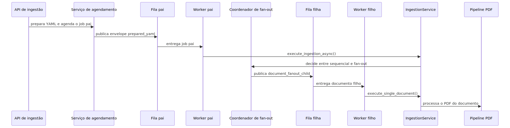

# Manual técnico, executivo, comercial e estratégico: Sistema de Jobs, Worker e Paralelismo

## 1. O que é esta feature

Este módulo é o mecanismo assíncrono que permite à plataforma receber um pedido pesado, transformar esse pedido em um job durável, entregá-lo a um processo worker isolado, acompanhar sua execução e, quando necessário, quebrar o trabalho em unidades paralelas sem misturar transporte, regra de negócio e observabilidade.

Em linguagem simples: ele é a infraestrutura que impede a API de virar um gargalo ou de carregar dentro da resposta HTTP trabalhos longos como ingestão, ETL e execuções agentic em background. Ele também impede que cada domínio invente sua própria fila, seu próprio modelo de status e sua própria forma de paralelizar.

O código lido mostra que esse sistema foi dividido em camadas:

- um núcleo genérico de job, sem dependência de ingestão, ETL ou background;
- uma borda de transporte assíncrono que publica e consome envelopes versionados;
- um runtime de worker dedicado, com bootstrap próprio e pools separados por papel;
- um executor de payload que converte envelopes heterogêneos em comandos tipados;
- especializações de domínio, como ingestão e fan-out documental, que usam a mesma espinha dorsal.

Isso significa que o sistema não é “a fila do PDF”. O PDF é apenas uma especialização importante sobre um mecanismo maior e mais genérico.

## 2. Que problema ela resolve

Sem esse mecanismo, a plataforma sofreria de quatro problemas clássicos de sistemas assíncronos.

- A API ficaria acoplada ao trabalho pesado. Um pedido de ingestão poderia segurar a requisição HTTP durante parsing, OCR, chunking e indexação.
- Cada domínio criaria seu próprio caminho assíncrono. Ingestão, ETL e background teriam contratos, status e logs diferentes.
- O paralelismo seria improvisado. Em vez de uma topologia canônica, haveria concorrência difusa, difícil de operar e quase impossível de cancelar com segurança.
- O diagnóstico seria fraco. Quando um job falhasse, ficaria difícil responder se o problema nasceu no produtor, na fila, no worker, no domínio ou no provider externo.

O desenho atual existe para encapsular essa complexidade. Ele cria um contrato genérico de job, um ledger durável, uma fronteira clara entre transporte e execução e um modelo explícito para jobs pais e filhos quando o domínio precisa de fan-out.

## 3. Visão executiva

Para liderança, este sistema importa porque ele transforma processamento pesado em capacidade operacional governável. Isso reduz risco de indisponibilidade da API, melhora previsibilidade do throughput e permite escalar trabalhos longos sem depender de acoplamento direto entre frontend, borda HTTP e lógica pesada.

O valor executivo real é este:

- separa recepção do pedido de execução do trabalho;
- cria trilha auditável do ciclo de vida do job;
- permite isolar concorrência por papel, como pai, filho, ETL e background;
- reduz o risco de um domínio contaminar o runtime do outro;
- cria base para cancelamento cooperativo, reconciliação e operação assistida.

Em linguagem 101: em vez de torcer para a aplicação “aguentar”, o produto cria uma esteira que recebe, distribui, acompanha e encerra trabalho pesado de forma organizada.

## 4. Visão comercial

Comercialmente, essa feature sustenta uma promessa importante para clientes corporativos: a plataforma consegue processar cargas pesadas de forma rastreável e escalável, sem tratar automação, ingestão e execução em lote como scripts frágeis escondidos atrás da API.

Isso ajuda a responder dores comuns de cliente.

- “Vocês processam lotes longos sem travar a API?”
- “Como eu sei se meu processamento ficou na fila, falhou ou terminou?”
- “Dá para paralelizar sem perder governança?”
- “Existe trilha operacional para suporte e auditoria?”

O diferencial não é apenas usar fila. Muitas soluções usam fila e continuam opacas. O diferencial observado no código é a combinação entre contrato versionado, worker dedicado, ledger durável, separação pai/filho e telemetria operacional.

O que não deve ser prometido é paralelismo irrestrito para qualquer caso. O próprio código confirma que o fan-out documental de ingestão depende de pré-requisitos estruturais e de fontes replayable, não de um botão mágico de “rodar em paralelo”.

## 5. Visão estratégica

Estratégicamente, este sistema fortalece a plataforma em cinco frentes.

- Reduz acoplamento entre entrada HTTP, runtime físico de fila e regra de negócio.
- Permite evoluir novos tipos de job sem redesenhar o mecanismo inteiro.
- Reforça governança: não existe fallback implícito entre filas, handlers ou modos de dispatch.
- Cria um plano de controle durável que prepara o terreno para reconciliação, cancelamento e diagnósticos melhores.
- Dá uma base reutilizável para ingestão, ETL e automações agentic de background.

Em termos de produto, isso significa que a plataforma passa a ter um “sistema nervoso” de trabalho assíncrono, e não uma coleção de exceções locais.

## 6. Conceitos necessários para entender

### 6.1. Job

Job é uma unidade lógica de trabalho. No core lido, isso aparece como um envelope mínimo com identidade, rota, modo de dispatch, payload e metadados. O job não conhece PDF, ETL nem scheduler. Ele conhece apenas o suficiente para ser validado, roteado e encerrado.

### 6.2. Envelope

Envelope é o contrato que transporta o trabalho. Ele existe em dois níveis.

- No core, o `JobEnvelope` representa a identidade lógica do trabalho.
- Na borda assíncrona, o `QueuedJobEnvelope` adiciona informações operacionais do transporte, como `worker_execution_correlation_id`, `run_id` e `queued_at`.

O motivo dessa separação é simples: o core não deve depender da tecnologia de fila, mas o transporte precisa carregar dados adicionais para operar no mundo real.

### 6.3. route_kind e dispatch_mode

`route_kind` diz qual família lógica do job está sendo executada. `dispatch_mode` diz qual variação concreta daquele fluxo será usada.

Na prática:

- ingestão pode ter `prepared_yaml`, `resolve_on_worker` e `document_fanout_child`;
- ETL reaproveita `prepared_yaml`, mas em outro `route_kind`;
- background usa outro `dispatch_mode` específico.

Essa separação existe para evitar ambiguidade. O próprio repositório já registra a lição de que `handler_key` isolado não basta quando mais de um domínio compartilha nomes parecidos.

### 6.4. Worker

Worker é o processo dedicado a consumir envelopes assíncronos e executar o trabalho fora da borda HTTP. Ele tem bootstrap próprio, guarda de infraestrutura, runtime dedicado e logs operacionais de prontidão e shutdown.

Em linguagem simples: é o processo que faz o trabalho pesado para que a API continue sendo uma borda de entrada, não uma sala de máquinas.

### 6.5. Plano de controle durável

Plano de controle durável é o conjunto de registros persistidos fora da memória do processo para contar a história do job e permitir decisões corretas mesmo quando a mensagem atrasa, é reentregue ou cai em replay.

No que foi lido, isso aparece em dois níveis.

- O `PostgresJobRunStore` registra o lifecycle genérico do Job Core.
- A telemetria canônica da ingestão mantém o estado operacional do run pai e dos documentos filhos.

Esse plano de controle é o que permite falhar fechado quando a infraestrutura crítica não está íntegra.

### 6.6. worker_execution_correlation_id

Esse identificador não é o `correlation_id` lógico do pedido. Ele é a identidade operacional reservada para a execução do worker. O produtor precisa informá-lo explicitamente, e o helper compartilhado de publicação o persiste antes de publicar a mensagem.

Na prática, isso separa duas perguntas diferentes.

- “A qual operação lógica este trabalho pertence?”
- “Qual foi a identidade operacional reservada para esta execução no worker?”

### 6.7. Fan-out

Fan-out é quando um job pai não faz todo o trabalho sozinho. Em vez disso, ele inventaria um lote e publica jobs filhos para unidades menores de execução.

No slice lido, a principal especialização desse padrão é a ingestão por documento, em que o pai coordena o lote e os filhos executam documentos individuais.

### 6.8. Contrato versionado de transporte

O adapter físico adiciona versão de schema da mensagem, versão de contrato da fila e papel da fila. Isso existe para impedir que backlog antigo, publicação errada ou actor incorreto consumam uma mensagem compatível apenas por sorte.

Em linguagem simples: a mensagem precisa provar que pertence à fila certa.

### 6.9. Retry de domínio versus retry de transporte

O código lido mostra uma decisão importante: o transporte Dramatiq usa `max_retries=0` nos actors. Isso indica que o broker não é o lugar onde a regra de retry de negócio vive. Quando o domínio precisa retry, ele implementa retry explícito e observável, como o executor do documento filho na ingestão.

Isso evita um problema comum: deixar a fila esconder reexecuções sem contexto de negócio.

## 7. Como a feature funciona por dentro

O fluxo genérico começa quando algum boundary do produto decide que o trabalho não deve ser executado inline. Esse boundary cria um envelope canônico, reserva a identidade operacional do worker, persiste o monitoramento inicial e publica a mensagem por uma porta abstrata de fila.

Depois disso, o adapter físico de RabbitMQ e Dramatiq adiciona o contrato versionado de transporte e encaminha a mensagem para a fila correta conforme o papel do job. O worker dedicado sobe o runtime, registra prontidão e consome mensagens apenas das filas que fazem sentido para o papel configurado.

Quando a mensagem entra no actor, o adapter valida três coisas antes de delegar qualquer execução.

- se a mensagem respeita a versão de schema esperada;
- se a versão do contrato de fila é compatível;
- se o papel da fila coincide com o actor que a recebeu.

Se isso passa, o adapter chama um bridge que entrega o payload ao Job Core genérico. O Job Core valida o envelope, cria ou recupera a run durável, registra eventos estruturados, resolve o handler pela chave composta `route_kind + dispatch_mode` e só então executa o trabalho.

O trabalho concreto não é feito diretamente pelo core. Ele é entregue ao executor de payload do worker, que converte o payload heterogêneo em um comando tipado, escolhe o handler de domínio certo e chama a especialização correspondente.

Essa arquitetura cria uma ordem de responsabilidade clara:

- o produtor decide publicar;
- a porta abstrata decide como falar com o transporte;
- o transporte decide a fila física correta e valida contrato;
- o Job Core decide lifecycle genérico;
- o executor de payload decide o comando tipado;
- o domínio decide a regra de negócio real.

## 8. Divisão em etapas ou submódulos

### 8.1. Núcleo genérico de job

Este submódulo existe para representar jobs de forma mínima, durável e reutilizável. Ele recebe envelopes lógicos, executa validações, registra eventos e encerra status terminais sem conhecer ingestão, ETL ou background.

O ganho arquitetural é importante: a plataforma consegue falar de lifecycle do job sem repetir essa lógica em cada domínio.

### 8.2. Porta de fila e envelope operacional

Este submódulo existe para separar “o que é um job” de “como ele é publicado”. Ele recebe envelopes já preparados e os transforma em publicação concreta para o runtime assíncrono configurado.

O que ele evita: acoplar a regra de negócio diretamente a RabbitMQ, Dramatiq ou qualquer adapter físico.

### 8.3. Adapter RabbitMQ e Dramatiq

Este submódulo existe para cuidar da parte física do transporte: nomes de fila, papel de fila, actors, timeout, TTL, schema versionado e startup do runtime consumidor.

Ele não existe para decidir regra de negócio. O papel dele é transportar com contrato rígido.

### 8.4. Runtime do processo worker

Este submódulo existe para subir o processo worker como unidade operacional independente. Ele instala guardrails de infraestrutura, inicia o runtime assíncrono, emite markers de prontidão e faz shutdown coordenado.

O ganho prático é reduzir a mistura entre bootstrap de processo, scheduler e execução de job.

### 8.5. Executor de payload e comandos tipados

Este submódulo existe porque o envelope vindo da fila ainda é genérico demais para o domínio. Ele materializa comandos fortemente interpretados, como ingestão preparada, filho de fan-out, ETL preparada e background execution.

Isso melhora clareza, validação e isolamento. Em vez de o domínio ficar catando chaves soltas do dicionário, ele recebe um comando que já foi normalizado.

### 8.6. Observabilidade e ledger durável

Este submódulo existe para registrar a história do job e permitir diagnóstico. Ele não depende do processo estar vivo. Ele persiste run, transições de status e eventos, com retry explícito para acesso ao banco.

Em linguagem simples: é o que permite explicar depois o que aconteceu, mesmo quando a execução já passou.

### 8.7. Paralelismo por papel

Este submódulo existe para separar concorrência de coordenação e concorrência de trabalho unitário. No caso de ingestão, o sistema distingue job pai e job filho. Em outros domínios, ele distingue filas e pools conforme o papel operacional.

Isso evita starvation e mistura de responsabilidade, que eram problemas típicos de designs com fila única.

## 9. Pipeline ou fluxo principal

### 9.1. Passo 1: um boundary decide que o trabalho será assíncrono

Esse boundary pode ser um endpoint HTTP ou outro orquestrador interno. O ponto importante é que ele sai do mundo inline e entra no mundo de job.

### 9.2. Passo 2: o boundary monta o envelope canônico

O envelope precisa identificar o job e indicar a combinação `route_kind + dispatch_mode`. Essa decisão é importante porque ela governa o roteamento posterior.

### 9.3. Passo 3: o produtor reserva a identidade operacional do worker

Antes de publicar, o produtor persiste o `worker_execution_correlation_id` no monitoramento inicial. Isso evita jobs “fantasmas” sem identidade operacional reservada.

### 9.4. Passo 4: a porta abstrata publica o envelope

A porta de fila não executa o trabalho. Ela apenas publica o job no runtime assíncrono oficial.

### 9.5. Passo 5: o adapter físico adiciona contrato versionado

O transporte injeta `schema_version`, `queue_contract_version`, `queue_role` e `kind`. Isso garante que o actor certo valide a mensagem certa.

### 9.6. Passo 6: o worker consome a fila compatível com seu papel

O worker runtime sobe actors separados por papel e não consome inline no produtor.

### 9.7. Passo 7: o bridge entrega a mensagem ao Job Core

O bridge transforma o payload do transporte em execução genérica de core, sem deixar o adapter físico conhecer o domínio.

### 9.8. Passo 8: o Job Core registra lifecycle e resolve o handler

Aqui o job deixa de ser apenas mensagem e vira execução observável. O core cria run, registra eventos e falha se não existir handler registrado.

### 9.9. Passo 9: o executor de payload materializa o comando tipado

Esse passo reduz ambiguidade e prepara o domínio para trabalhar com dados coerentes.

### 9.10. Passo 10: o domínio executa a regra real

É aqui que ingestão, ETL ou background fazem seu trabalho concreto.

### 9.11. Passo 11: o core persiste o estado terminal

O job termina como `succeeded`, `partial_success`, `cancelled` ou `failed`, com razão final e eventos associados.

O diagrama mostra o ponto principal do sistema: transporte, core e domínio são camadas diferentes. Isso é o que permite especializar o mecanismo sem reescrevê-lo.

## 10. Especialização para ingestão e PDF

### 10.1. Onde a ingestão entra no mecanismo genérico

A ingestão reutiliza o mesmo mecanismo, mas com envelopes e handlers próprios. Hoje existem dois boundaries oficiais para o job pai.

- O caminho `prepared_yaml`, usado quando a borda HTTP já tem o YAML pronto e publica o envelope completo.
- O caminho `resolve_on_worker`, usado quando a borda publica o payload criptografado e deixa a resolução final do YAML para o worker.

Nos dois casos, o worker pai executa a ingestão assíncrona e decide se o lote segue como execução simples ou como fan-out por documento.

### 10.2. O papel do job pai de ingestão

O job pai não existe para parsear PDF. Ele existe para coordenar o lote. Isso inclui carregar configuração, iniciar o monitoramento canônico, chamar `IngestionService` e, quando o cenário permite, publicar envelopes filhos de documento.

No branch `resolve_on_worker`, o `IngestionParentJobHandler` ainda precisa resolver YAML e descobrir `user_email` antes de chamar `execute_ingestion_async`. No branch `prepared_yaml`, esses dados já entram prontos no envelope. Em ambos os casos, quem coordena o lote continua sendo o job pai, não o pipeline PDF.

### 10.3. Quando o paralelismo documental é permitido

O código lido mostra que o fan-out não é um direito automático do request. Ele depende de elegibilidade operacional e de inventário de documentos por origem compartilhável. Em vez de tentar paralelizar qualquer coisa, o sistema monta um plano, verifica bloqueios, calcula capacidade e só então publica filhos.

### 10.4. O papel do job filho de ingestão

O job filho é a unidade documental real. Ele recebe contexto do documento, consulta a gate canônica de execução, respeita cancelamento do pai, aplica retry de domínio quando apropriado e processa um único documento com `document_parallelism=1`.

Essa restrição de `document_parallelism=1` no filho é deliberada. Ela evita reentrada paralela incorreta dentro do mesmo documento e mantém a topologia pai-filho previsível.

### 10.5. Onde o PDF especializado finalmente roda

Quando o documento filho é um PDF, o executor do filho chama o serviço de ingestão em modo de documento único. É nesse ponto que a esteira especializada de PDF entra em ação. Ou seja, o mecanismo genérico prepara o trabalho, mas a inteligência de parsing, OCR e chunking continua vivendo no slice PDF.

O diagrama mostra a fronteira correta entre mecanismo genérico e especialização. O sistema de jobs não substitui o pipeline PDF. Ele o hospeda de forma governada.

## 11. Decisões técnicas e trade-offs

### 11.1. Registry por route_kind + dispatch_mode

Ganho: elimina ambiguidade entre domínios que usam nomes parecidos.

Custo: exige disciplina maior ao adicionar novos handlers.

Risco evitado: colisão silenciosa de `handler_key`.

### 11.2. Fail-closed no contrato de fila

Ganho: impede consumo acidental de backlog incompatível.

Custo: migração de contrato precisa ser explícita.

Risco evitado: filho executando na fila pai ou actor errado consumindo mensagem por compatibilidade acidental.

### 11.3. Retry fora do broker para casos de domínio

Ganho: retry fica observável e alinhado à semântica do caso de uso.

Custo: o domínio precisa implementar sua própria política quando isso fizer sentido.

Risco evitado: reexecução automática invisível pelo transporte.

### 11.4. Separação física entre pai e filho

Ganho: evita starvation da coordenação pelo backlog de trabalho unitário.

Custo: mais filas, mais topologia e mais configuração.

Risco evitado: lote novo travado atrás de filhos antigos.

### 11.5. Plano de controle durável

Ganho: o sistema consegue decidir com base em estado persistido, não só em memória.

Custo: exige dependência saudável do banco e telemetria operacional íntegra.

Risco evitado: jobs zumbis, replay cego e cancelamento enganoso.

## 12. Configurações que mudam o comportamento

### 12.1. Backend e runtime consumidor

O código lido confirma backend `rabbitmq` e runtime consumidor `dramatiq` como caminho oficial. Isso não é detalhe operacional pequeno. Isso define o mecanismo assíncrono inteiro.

### 12.2. Nomes de fila e versão de contrato

Os nomes físicos das filas são versionados. Isso governa compatibilidade de consumo e isola backlog legado.

### 12.3. Topologia de threads do worker

O runtime valida quantidade de threads para filas pai e filho. Isso muda throughput e também muda o paralelismo real possível.

### 12.4. document_parallelism

Na ingestão, esse valor afeta planejamento de fan-out. Ele não garante paralelismo sozinho; ele apenas informa a intenção que o coordenador vai confrontar com elegibilidade e capacidade.

### 12.5. Feature flag de fan-out documental

Na ingestão, existe uma flag operacional específica para habilitar ou desligar fan-out por documento. Se ela estiver desabilitada, o fluxo permanece sequencial.

## 13. Contratos, entradas e saídas

As entradas conceituais do sistema são pedidos de trabalho vindos de algum boundary. As saídas conceituais são estados terminais observáveis e payloads de resultado ou erro.

No caminho atual, isso se materializa como:

- envelopes publicados na fila oficial;
- callbacks e progresso no monitoramento do job;
- registros duráveis de run e eventos;
- resultado terminal do core;
- telemetria especializada do domínio quando o caso exige, como ingestão.

## 14. O que acontece em caso de sucesso

Quando tudo funciona, o sistema conta uma história coerente.

- o produtor registra o job e publica a mensagem;
- o worker consome a fila correta;
- o contrato de transporte é validado;
- o Job Core registra a run e executa o handler adequado;
- o domínio conclui o trabalho;
- o core persiste o estado terminal;
- os logs e a telemetria mostram quem produziu, quem executou e como terminou.

No caso da ingestão com fan-out, sucesso do pai pode significar duas coisas diferentes.

- ou o lote inteiro terminou;
- ou o pai publicou os filhos e ficou aguardando a conclusão agregada deles.

Essa distinção é essencial para não declarar sucesso cedo demais.

## 15. O que acontece em caso de erro

Os erros confirmados no código lido se distribuem em camadas.

- Erro de contrato do envelope: o job nem deveria seguir para execução.
- Erro de contrato da fila: a mensagem chegou na fila errada ou com versão incompatível.
- Erro de infraestrutura crítica: o runtime especializado não consegue confirmar o plano de controle necessário.
- Erro de roteamento: não existe handler registrado para a chave composta.
- Erro do domínio: o caso de uso específico falha depois do roteamento correto.

O comportamento correto não é mascarar isso com fallback implícito. O desenho observado falha fechado quando o contrato estrutural se rompe.

## 16. Observabilidade e diagnóstico

O sistema foi desenhado para que a investigação não comece “adivinhando”. Ela começa por identificadores e eventos.

Os principais fios de investigação confirmados no código são:

- `correlation_id` lógico;
- `worker_execution_correlation_id` para a execução reservada no worker;
- status e eventos duráveis do Job Core;
- markers de prontidão e shutdown do processo worker;
- eventos estruturados de fan-out e de gate de execução na ingestão.

Na prática, isso permite responder perguntas operacionais reais.

- O job foi publicado mesmo?
- Caiu na fila correta?
- O worker estava pronto?
- O handler foi resolvido?
- O pai publicou filhos ou morreu antes?
- O filho foi bloqueado por gate, cancelamento ou infraestrutura?

## 17. Impacto técnico

Tecnicamente, este sistema reduz acoplamento entre API, fila, runtime e domínio. Ele encapsula a complexidade do lifecycle assíncrono, padroniza roteamento e melhora testabilidade porque cada camada pode ser validada em separado.

## 18. Impacto executivo

Executivamente, ele aumenta previsibilidade operacional, reduz risco de travamento da borda HTTP e cria base para escala controlada de cargas pesadas.

## 19. Impacto comercial

Comercialmente, ele sustenta uma narrativa séria de processamento corporativo: trabalho pesado com trilha operacional, governança de paralelismo e isolamento entre coordenação e execução.

## 20. Impacto estratégico

Estratégicamente, ele prepara a plataforma para crescer em novas famílias de jobs sem multiplicar mecanismos concorrentes de execução assíncrona.

## 21. Exemplos práticos guiados

### 21.1. Ingestão preparada sem fan-out

Cenário: a API resolve o YAML e publica um envelope `prepared_yaml`, mas o lote não é elegível para fan-out.

Processamento: o worker pai executa a ingestão inteira como um único fluxo.

Impacto: o sistema continua assíncrono, mas não abre jobs filhos.

### 21.2. Ingestão preparada com fan-out documental

Cenário: a origem permite replay remoto e o plano encontra vários documentos elegíveis.

Processamento: o job pai publica filhos para a fila documental, e cada filho executa um documento com `document_parallelism=1`.

Impacto: o throughput melhora sem transformar o pai em processador de PDF.

### 21.3. Execução background agentic

Cenário: um pedido agentic programado precisa rodar no worker.

Processamento: o mesmo mecanismo genérico publica e roteia o job, mas o handler concreto muda.

Impacto: o produto reaproveita a infraestrutura assíncrona sem reinventar pipeline paralelo.

## 22. Explicação 101

Pense neste sistema como um centro de distribuição.

- A API recebe a encomenda.
- O envelope diz o que é a encomenda e para qual trilha ela vai.
- A fila é a esteira de transporte.
- O worker é o galpão que realmente processa.
- O Job Core é o sistema que registra entrada, execução e saída.
- O domínio é o setor especializado que sabe fazer o trabalho real, como ingestão ou ETL.

Quando a encomenda é grande demais, o sistema pode quebrá-la em caixas menores. Isso é o fan-out. Mas essa quebra só acontece quando existe regra e estrutura para isso. Senão, o sistema mantém a execução inteira em um único fluxo.

## 23. Limites e pegadinhas

- Fila não substitui plano de controle. Mensagem reentregue não é autorização automática para trabalhar.
- Paralelismo configurado não é paralelismo garantido. A topologia física e a elegibilidade do domínio ainda mandam.
- Sucesso do despacho do pai não é o mesmo que sucesso do lote agregado.
- Retry do broker desligado não significa ausência de retry. Significa que retry de domínio precisa ser explícito.
- Adicionar job novo sem respeitar `route_kind + dispatch_mode` reabre ambiguidade e fragilidade.

## 24. Troubleshooting

### 24.1. Sintoma: o job foi publicado, mas não anda

Causa provável: worker indisponível, fila errada ou contrato de transporte incompatível.

Como confirmar: verificar logs de prontidão do worker e eventos estruturados do adapter.

### 24.2. Sintoma: o pai de ingestão publicou, mas não há progresso no lote

Causa provável: o pai ficou aguardando filhos ou o fan-out foi bloqueado por pré-requisito operacional.

Como confirmar: verificar eventos de fan-out e estado agregado do run pai.

### 24.3. Sintoma: o filho acorda, mas não processa o documento

Causa provável: gate bloqueou execução por cancelamento, run pai terminal ou infraestrutura crítica ausente.

Como confirmar: verificar eventos do executor filho e o estado canônico do run pai.

## 25. Mapa de navegação conceitual

- Produção do job: boundary HTTP ou orquestrador interno.
- Contrato genérico: Job Core.
- Transporte físico: RabbitMQ + Dramatiq.
- Processo executor: worker dedicado.
- Normalização do payload: fábrica de comandos tipados.
- Regra concreta: handler do domínio.
- Paralelismo: topologia por papel e, quando aplicável, pai versus filhos.

## 26. Como colocar para funcionar

O código lido confirma estes pré-requisitos.

- backend assíncrono configurado para RabbitMQ;
- runtime consumidor configurado para Dramatiq;
- worker subido pelo entrypoint Python de `app/worker_main.py`;
- banco de telemetria disponível para o ledger durável do core e, no caso da ingestão, para o plano de controle especializado.

O caminho exato de comando de deploy do container não foi confirmado integralmente nos arquivos lidos. O que está confirmado é o entrypoint Python do processo worker e a dependência explícita do runtime assíncrono canônico.

## 27. Exercícios guiados

### 27.1. Exercício: separar transporte de domínio

Objetivo: entender por que a fila não deve conhecer regra de PDF.

Passos: acompanhe um envelope do produtor até o worker e identifique o ponto em que o domínio realmente começa.

Resposta esperada: o domínio só começa depois do bridge, do core e da desserialização do comando.

### 27.2. Exercício: distinguir pai de filho

Objetivo: entender por que o pai não deve processar documentos como se fosse filho.

Passos: compare mentalmente o papel do pai de ingestão com o do documento filho.

Resposta esperada: o pai coordena; o filho executa unidade documental.

### 27.3. Exercício: localizar o ponto de falha fechada

Objetivo: entender onde o sistema se recusa a seguir com contrato incompatível.

Passos: procure no fluxo onde a mensagem ainda pode ser rejeitada antes do domínio rodar.

Resposta esperada: validação do contrato de fila, ausência de handler e indisponibilidade de infraestrutura crítica são pontos explícitos de bloqueio.

## 28. Checklist de entendimento

- Entendi que o sistema de jobs é maior do que a ingestão PDF.
- Entendi a diferença entre envelope lógico e envelope operacional.
- Entendi por que o roteamento usa `route_kind + dispatch_mode`.
- Entendi a separação entre produtor, transporte, core e domínio.
- Entendi o papel do worker dedicado.
- Entendi o que é o plano de controle durável.
- Entendi como o fan-out pai/filho funciona conceitualmente.
- Entendi por que o pai não é o executor de PDF.
- Entendi como o sistema evita fallback implícito na fila.
- Entendi onde investigar quando o job não anda.
- Entendi o valor técnico, executivo, comercial e estratégico do mecanismo.

## 29. Evidências no código

- [../src/core/job_core/models.py](../src/core/job_core/models.py)
  - Motivo da leitura: confirmar o contrato mínimo do Job Core.
  - Símbolos relevantes: `JobEnvelope`, `JobExecutionContext`, `JobExecutionResult`.
  - Comportamento confirmado: o core é genérico, opaco ao domínio e orientado a `route_kind + dispatch_mode`.

- [../src/core/job_core/executor.py](../src/core/job_core/executor.py)
  - Motivo da leitura: confirmar o lifecycle do executor genérico.
  - Símbolo relevante: `JobCoreExecutor.execute`.
  - Comportamento confirmado: cria run, registra eventos, resolve handler e persiste estado terminal.

- [../src/core/job_core/registry.py](../src/core/job_core/registry.py)
  - Motivo da leitura: confirmar a chave de roteamento do registry.
  - Símbolo relevante: `JobHandlerRegistry`.
  - Comportamento confirmado: não existe fallback implícito; a chave é `route_kind + dispatch_mode`.

- [../src/core/job_core/postgres_store.py](../src/core/job_core/postgres_store.py)
  - Motivo da leitura: confirmar ledger durável e política de retry.
  - Símbolo relevante: `PostgresJobRunStore`.
  - Comportamento confirmado: persistência durável com retry explícito sobre o banco.

- [../src/api/services/async_job_dramatiq.py](../src/api/services/async_job_dramatiq.py)
  - Motivo da leitura: confirmar o adapter físico, o contrato versionado e as filas por papel.
  - Símbolos relevantes: `_build_async_job_actors`, `_validate_transport_payload`, `_build_transport_job_core_executor`.
  - Comportamento confirmado: Dramatiq valida fila por papel e entrega o payload ao core por bridge explícito.

- [../src/api/services/async_job_worker_payload_executor.py](../src/api/services/async_job_worker_payload_executor.py)
  - Motivo da leitura: confirmar a normalização tipada e os handlers de domínio.
  - Símbolos relevantes: `AsyncJobCommandFactory`, `IngestionParentJobHandler`, `IngestionDocumentJobHandler`.
  - Comportamento confirmado: o worker não entrega dicionário cru ao domínio; ele cria comandos tipados e handlers específicos.

- [../src/api/services/ingestion_job_executor.py](../src/api/services/ingestion_job_executor.py)
  - Motivo da leitura: confirmar o caminho oficial do job pai com resolução no worker.
  - Símbolos relevantes: `RedisRuntimeIngestionStreamPublisher.publish`, `build_resolve_on_worker_ingestion_job_envelope`.
  - Comportamento confirmado: existe um boundary canônico adicional de ingestão que publica `resolve_on_worker`, sem criar fluxo paralelo fora do mecanismo de jobs.

- [../src/api/services/rag_async_execution_service.py](../src/api/services/rag_async_execution_service.py)
  - Motivo da leitura: confirmar a entrada da ingestão no mecanismo genérico.
  - Símbolo relevante: `execute_ingestion_async`.
  - Comportamento confirmado: o job pai entra aqui, carrega YAML, registra monitoramento e decide entre conclusão direta e espera pelos filhos.

- [../src/services/document_fanout_coordinator.py](../src/services/document_fanout_coordinator.py)
  - Motivo da leitura: confirmar o fan-out pai e a publicação dos filhos.
  - Símbolo relevante: `DocumentFanoutCoordinator.build_response`.
  - Comportamento confirmado: o pai inventaria documentos, aplica pré-requisitos operacionais e publica filhos na fila dedicada.

- [../src/services/document_fanout_child_executor_service.py](../src/services/document_fanout_child_executor_service.py)
  - Motivo da leitura: confirmar a execução segura do filho.
  - Símbolo relevante: `DocumentFanoutChildExecutorService.execute`.
  - Comportamento confirmado: o filho respeita gate, cancelamento, retry de domínio e promoção do próximo documento.

- [../app/runners/worker_runner.py](../app/runners/worker_runner.py)
  - Motivo da leitura: confirmar o bootstrap do processo worker.
  - Símbolo relevante: `run_worker_process`.
  - Comportamento confirmado: o processo sobe runtime dedicado, emite prontidão e faz shutdown coordenado.

- [../src/api/services/worker_process_runtime.py](../src/api/services/worker_process_runtime.py)
  - Motivo da leitura: confirmar quando o runtime do worker fica realmente pronto.
  - Símbolos relevantes: `WorkerProcessRuntime.start`, `WorkerProcessRuntimeSnapshot`.
  - Comportamento confirmado: a prontidão final depende da combinação entre plano de controle multicanal e runtime assíncrono.

- [../tests/integration/test_03-01-08_async_job_dramatiq_real_flow.py](../tests/integration/test_03-01-08_async_job_dramatiq_real_flow.py)
  - Motivo da leitura: confirmar evidência executável do fluxo real.
  - Símbolo relevante: `test_quando_runtime_real_executa_matriz_critica_entao_boundary_completo_passa_pelo_job_core_e_executor_canonico`.
  - Comportamento confirmado: o repositório testa RabbitMQ/Dramatiq reais no boundary completo para a matriz crítica de `route_kind + dispatch_mode`, incluindo ingestão, ETL, background execution e scheduler.
  - Comportamentos confirmados adicionais: falha real de leaf marcando `failed` no Job Core, cancelamento cooperativo do pai suprimindo domínio, concorrência real observável entre jobs e preservação de linhagem por `worker_execution_correlation_id` dentro de log físico compartilhado por `correlation_id` no boundary por actor.
