# Manual conceitual, executivo, comercial e estrategico: telemetria de interacoes do agente

> Navegacao rapida: volte ao [README principal](../README.md) para o catalogo mestre, use [README-INDICE.MD](../README.md) para navegar por intencao, leia [README-CONCEITUAL-AGENTE-WORKFLOW-COMPLETO.md](./README-CONCEITUAL-AGENTE-WORKFLOW-COMPLETO.md) para o contexto do runtime agentic, complemente com [README-CONCEITUAL-ARQUITETURA-LOGGING-CORRELATION-ID.md](./README-CONCEITUAL-ARQUITETURA-LOGGING-CORRELATION-ID.md) para correlation_id e observabilidade, e siga para [README-TECNICO-TELEMETRIA-INTERACOES-AGENTE.md](../tecnico/README-TECNICO-TELEMETRIA-INTERACOES-AGENTE.md) quando a necessidade for operacao e troubleshooting.

## 1. O que e esta feature

Esta feature e o mecanismo que transforma interacoes do agente em historico monitoravel. O codigo lido confirma que a plataforma registra a interacao principal em uma tabela chamada interaction_runs, guardando pelo menos a pergunta recebida, a resposta enviada, metadados operacionais, correlacao, sinais de erro e indicadores uteis para analise posterior.

Na pratica, isso significa que a resposta do agente nao precisa morrer no momento da entrega. Ela pode virar material observavel para auditoria, acompanhamento de qualidade, revisao humana e aperfeicoamento futuro.

O ponto mais importante e este: a plataforma nao trata a resposta do agente apenas como saida transitoria. Ela a trata como dado operacional que pode ser consultado depois.

## 2. Que problema ela resolve

Sem essa telemetria, a operacao fica cega logo depois que o agente responde. O time perde a capacidade de responder perguntas basicas como:

- o que o usuario perguntou;
- o que o agente respondeu;
- qual workflow ou agente estava associado aquela resposta;
- se houve erro, resposta incompleta ou fallback sem evidencia;
- quais interacoes merecem revisao humana;
- quais respostas precisam alimentar um ciclo de melhoria.

Essa feature resolve exatamente essa lacuna. Ela cria um historico pesquisavel e anotavel das interacoes, reduzindo a dependencia de memoria humana, planilhas paralelas ou investigacao manual em logs crus.

## 3. Visao executiva

Executivamente, a tabela de interacoes reduz risco operacional e melhora governanca. Ela permite que a empresa trate o agente como processo auditavel, e nao como uma caixa-preta que responde e desaparece.

O ganho pratico para lideranca e previsibilidade. Com uma trilha persistida, fica mais facil medir qualidade, detectar erro recorrente, identificar casos sem resposta util e orientar backlog de melhoria com base em evidencia concreta.

## 4. Visao comercial

Comercialmente, esta capacidade ajuda a sustentar um discurso de IA corporativa governada. O valor nao esta apenas em responder. O valor esta em responder com historico, rastreabilidade e possibilidade de revisao posterior.

Isso e especialmente util em cenarios como atendimento, vendas consultivas, suporte tecnico e canais externos. O cliente percebe que a plataforma nao entrega apenas automacao, mas tambem supervisao e capacidade de aprendizado operacional.

## 5. Visao estrategica

Estrategicamente, interaction_runs fortalece a plataforma em tres frentes.

A primeira e observabilidade. A interacao deixa de existir apenas em logs dispersos e passa a ter uma linha persistida com identidade propria.

A segunda e melhoria continua. O campo observacoes e os filtros de consulta formam um laco explicito entre operacao humana e aperfeicoamento futuro.

A terceira e governanca de produto. A plataforma ganha base para dashboards, revisao de respostas, priorizacao de correcoes e futura curadoria de exemplos de qualidade.

## 6. Conceitos necessarios para entender

### Interacao principal

Interacao principal e o registro consolidado da troca entre usuario e sistema. No codigo lido, ela contem a pergunta recebida, a resposta enviada e o contexto operacional suficiente para analise posterior.

### Telemetria de interacao

Telemetria de interacao e a captura estruturada dessa troca. Diferente de log bruto, ela grava campos uteis para consulta, filtro e comparacao entre execucoes.

### Observacoes humanas

Observacoes humanas sao anotacoes livres que o usuario ou auditor pode registrar depois da interacao. Esse ponto e central para o pedido atual, porque ele e o elo entre monitoramento e aperfeicoamento futuro.

### Correlacao

Correlation_id e o identificador que permite ligar o registro persistido ao restante da trilha operacional. Isso evita que a tabela vire uma lista solta de respostas sem contexto de investigacao.

## 7. Como a feature funciona por dentro

O fluxo observado no codigo segue uma logica simples e importante.

Primeiro, a aplicacao monta o resultado da interacao. Depois, um recorder ou processor extrai pergunta, resposta, metricas, sinais de erro, metadados e evidencias resumidas. Em seguida, o InteractionTelemetryManager transforma isso em um registro padronizado e o enfileira para persistencia assincrona. Por fim, o lote e gravado em PostgreSQL pela camada de persistencia da telemetria.

O efeito pratico e que a gravacao da telemetria nao bloqueia o fluxo principal da resposta. A experiencia do usuario nao fica refem de uma escrita sincrona linha a linha.

## 8. Divisao em etapas ou submodulos

### 8.1 Coleta da interacao

Esta etapa captura o que realmente importa da execucao: pergunta, resposta, sucesso, erro, latencia, uso de tokens, workflow, agente e contexto adicional.

Ela existe para separar o dado util do payload bruto. Sem isso, o historico persistido seria desorganizado e pouco aproveitavel.

### 8.2 Normalizacao do registro

Depois da coleta, o manager monta um InteractionTelemetryRecord coerente. Esse ponto importa porque a operacao precisa de uma estrutura estavel para consulta futura, independentemente da origem da interacao.

### 8.3 Persistencia assincrona

O manager enfileira e agrupa registros antes da escrita em banco. Essa etapa existe para reduzir custo operacional e evitar que a gravacao de telemetria degrade a experiencia principal.

### 8.4 Consulta e anotacao

Depois de persistido, o registro deixa de ser apenas telemetria de bastidor e vira material de trabalho para usuario, operacao e analise. O endpoint de consulta permite filtrar e o endpoint de observacoes permite registrar aprendizado humano.

## 9. Pipeline ou fluxo principal

O diagrama mostra por que esta feature e mais do que logging. Ela fecha um ciclo. A resposta sai do runtime, vira registro persistido e volta para o processo humano de revisao e aperfeicoamento.

## 10. Decisoes tecnicas e trade-offs

### Persistir a interacao principal em tabela estruturada

Ganho: facilita busca, filtros, monitoramento e feedback humano.

Custo: exige disciplina de schema e persistencia.

Consequencia: a plataforma ganha base analitica real em vez de depender apenas de logs.

### Usar escrita assincrona em lote

Ganho: protege a latencia da resposta principal.

Custo: a persistencia deixa de ser instantanea e passa a depender de fila e flush.

Consequencia: melhora operacao online, mas exige cuidado com falhas de persistencia.

### Permitir observacoes livres do usuario

Ganho: cria um laco explicito entre monitoramento e melhoria futura.

Custo: observacao humana e dado semiestruturado e exige governanca de uso.

Consequencia: o historico deixa de ser so analitico e passa a servir tambem para revisao qualitativa.

## 11. Impacto executivo

Esta feature reduz custo de auditoria, melhora capacidade de revisao pos-atendimento e da base concreta para decisoes de melhoria. Em vez de discutir qualidade do agente com percepcao subjetiva, a lideranca pode usar historico consultavel.

## 12. Impacto comercial

O impacto comercial esta em demonstrar que a plataforma nao apenas responde, mas aprende operacionalmente com historico revisavel. Isso ajuda a responder a objecao classica de cliente corporativo: como acompanhar e melhorar a qualidade depois do go-live.

## 13. Impacto estrategico

O impacto estrategico e consolidar a plataforma como sistema agentic governado. interaction_runs aproxima execucao, monitoramento e aperfeicoamento humano numa mesma trilha operacional.

## 14. Explicacao 101

Pense nessa tabela como o caderno de campo do agente. Cada vez que ele responde em uma interacao suportada, a plataforma guarda o que entrou, o que saiu e o contexto da resposta. Depois, alguem pode voltar nesse registro, procurar casos problematicos e escrever observacoes para orientar melhorias futuras.

## 15. Limites e pegadinhas

- O codigo lido confirma a gravacao da interacao principal, nao uma tabela unica consolidando toda saida intermediaria de cada subagente.
- O slice lido confirma com clareza as trilhas de perguntas web e canais. Nao foi confirmado nesta leitura que todo endpoint agentic direto use interaction_runs da mesma forma.
- A tabela nao substitui logs. Ela complementa os logs com uma visao estruturada da interacao.
- Observacoes ajudam na revisao humana, mas nao automatizam sozinhas o aperfeicoamento do agente.

## 16. Checklist de entendimento

- Entendi que a plataforma persiste a pergunta e a resposta principal em interaction_runs.
- Entendi que isso serve para monitoramento e revisao posterior.
- Entendi que o usuario pode registrar observacoes livres para melhoria futura.
- Entendi que a tabela complementa logs e nao equivale a todas as saidas intermediarias internas.

## 17. Evidencias no codigo

- src/services/question_service.py
  - Motivo da leitura: confirmar o ponto onde a execucao web aciona o recorder de telemetria.
  - Simbolo relevante: self._telemetry_recorder.record.
  - Comportamento confirmado: perguntas web persistem telemetria apos sucesso e apos erro.

- src/services/question/question_telemetry_recorder.py
  - Motivo da leitura: confirmar como pergunta, resposta e metadados viram registro estruturado.
  - Simbolo relevante: QuestionTelemetryRecorder.record.
  - Comportamento confirmado: extracao de question_text, answer_text, confidence, error_flag e evidence_summary.
- src/channel_layer/processor.py
  - Motivo da leitura: confirmar a trilha de canais.
  - Simbolo relevante: metodos internos de registro da telemetria e montagem do registro da interacao.
  - Comportamento confirmado: interacoes de canal tambem viram registros com resposta enviada, agente, workflow e metadados.

- src/telemetry/interaction/interaction_telemetry_manager.py
  - Motivo da leitura: confirmar o manager central.
  - Simbolo relevante: build_record e enqueue.
  - Comportamento confirmado: montagem padronizada e enfileiramento assincrono para interaction_runs.

- src/api/routers/interaction_runs_router.py
  - Motivo da leitura: confirmar uso humano posterior.
  - Simbolo relevante: /interaction-runs/query e /interaction-runs/observacoes.
  - Comportamento confirmado: consulta filtravel e atualizacao de observacoes para revisao futura.

## 18. Lacunas reais encontradas

- Nao foi confirmada nesta leitura uma tabela unica que consolide toda saida intermediaria de cada subagente ou cada passo interno do workflow.
- A DDL fisica completa de interaction_runs nao apareceu no slice de codigo lido nesta trilha; o contrato observado foi confirmado pelos campos gravados e consultados no runtime.
