# Manual conceitual, executivo, comercial e estratégico: comunicacao via WhatsApp com agentes e onboarding do canal

## 1. O que e esta feature

Esta feature transforma o WhatsApp em um canal conversacional governado para a plataforma. Na pratica, ela conecta quatro responsabilidades que costumam ficar espalhadas em projetos improvisados: onboarding do numero na Meta, cadastro do canal no diretorio interno, recebimento seguro de webhooks e execucao do nucleo do produto em modo ask, em modo workflow ou, apenas como compatibilidade legada, em modo agent.

Isso significa que conversar com um agente por WhatsApp, neste projeto, nao e apenas enviar texto para um modelo. O sistema precisa saber qual tenant e dono do canal, qual YAML deve ser usado, quais credenciais e segredos podem ser injetados, como validar o webhook recebido, como preservar correlation_id e como devolver a resposta no formato aceito pela Cloud API da Meta.

Tambem nao e apenas um fluxo de provisionamento. O onboarding so deixa o numero pronto para operar. A feature completa continua depois disso: uma mensagem entra pelo webhook, o diretorio resolve o contexto do cliente, o processor aplica as regras do canal, o motor executa o caso de uso configurado e o responder monta o payload final para a Meta.

Tambem e importante entender que WhatsApp aqui vive dentro de uma camada multicanal, nao como integracao isolada. O mesmo contrato de canal suporta outros tipos como webchat, Teams, Slack e Instagram. O que muda no WhatsApp e o provedor externo e o responder especifico. O conceito de canal registrado, YAML associado e modo de execucao continua o mesmo.

## 2. Que problema ela resolve

Sem essa feature, o WhatsApp viraria um acoplamento fragil entre portal Meta, segredos do tenant, webhook HTTP e logica do agente. Esse tipo de integracao costuma falhar por quatro motivos operacionais.

1. O numero fica ativo na Meta, mas o produto nao sabe qual cliente e dono dele.
2. O webhook chega sem contexto suficiente e o backend nao sabe qual YAML ou qual agente deve responder.
3. O segredo do webhook ou o token da Meta ficam espalhados em configuracoes paralelas e viram fonte de erro silencioso.
4. A resposta do agente nao considera as restricoes reais do canal, como formato interativo, sequencia de mensagens, tipos de midia e limites do payload.

O modulo resolve isso tratando WhatsApp como capacidade de plataforma. O produto passa a operar onboarding, runtime, auditoria e resposta de forma coordenada, em vez de depender de scripts isolados ou integracoes manuais por cliente.

## 3. Visao executiva

Executivamente, essa feature importa porque converte um canal comercial e operacional de alto uso em uma capacidade previsivel da plataforma. Ela reduz risco de implantacao porque o mesmo backend controla cadastro do canal, onboarding do numero, validacao de webhook, execucao do agente e entrega da resposta.

Tambem reduz risco de suporte. Quando um cliente diz que o numero nao responde, a investigacao nao precisa comecar na Meta por tentativa e erro. O time consegue seguir a trilha pelo canal registrado, pelo client_code, pelo YAML associado, pela configuracao de webhook, pelo correlation_id e pelo resultado de delivery.

Na pratica, isso melhora governanca, previsibilidade de implantacao e capacidade de operar multiplos clientes sem criar uma excecao por tenant.

## 4. Visao comercial

Comercialmente, essa feature resolve uma dor muito comum: o cliente quer conversar com um agente no canal que a operacao ja usa, sem abrir um novo front-end e sem depender de uma implantacao artesanal.

O argumento vendavel confirmado no codigo e concreto. A plataforma consegue:

1. ativar o numero via Meta Cloud API;
2. registrar o canal no diretorio multi-tenant;
3. receber a mensagem do usuario por webhook;
4. executar FAQ, agente ou workflow;
5. devolver texto, lista interativa e midia no formato aceito pela Meta.

Isso ajuda a vender atendimento automatizado, triagem operacional, resposta assistida, notificacao com botao interativo e jornadas guiadas por workflow. O que nao deve ser prometido sem ressalva e transcricao automatica completa de audio recebido do webhook bruto da Meta, porque esse comportamento nao esta fechado no slice lido.

## 5. Visao estrategica

Estrategicamente, WhatsApp aqui nao e uma integracao lateral. Ele reaproveita a mesma fundacao que o resto da plataforma usa: YAML-first, diretorio multi-tenant, injecao de security_keys, correlation_id, orchestrators existentes e regras formais de autorizacao.

Isso fortalece a arquitetura em quatro frentes.

1. Reduz acoplamento entre canal externo e caso de uso interno.
2. Permite trocar o comportamento do canal mudando `execution_mode` e YAML, sem reescrever o webhook.
3. Mantem a seguranca centralizada no diretorio e nos secrets do tenant.
4. Abre caminho para operar outros canais com a mesma disciplina arquitetural.

Em termos de plataforma, o valor nao e so atender WhatsApp. O valor e padronizar como canais entram, executam e respondem.

## 6. Conceitos necessarios para entender

### 6.1. Canal registrado

E a definicao persistida do canal no diretorio. Ela carrega `channel_id`, `client_code`, `channel_type`, `execution_mode`, `queue_mode`, `yaml_path`, regras de seguranca e metadados operacionais.

Sem esse cadastro, o webhook nao consegue resolver o contexto do cliente nem o YAML correto.

O ponto conceitual mais importante aqui e que o canal nao conhece um agente por nome proprio. Ele conhece um contrato de runtime. Esse contrato diz qual YAML deve ser carregado e em qual modo de execucao esse YAML sera usado.

### 6.2. Onboarding do numero

E o fluxo que registra e ativa um numero WhatsApp Business na Meta. Neste projeto, ele e separado do runtime conversacional. Primeiro o numero vira um ativo operacional valido. Depois o canal usa esse ativo para conversar.

### 6.3. Diretorio multi-tenant

E a fonte de verdade para cliente, canal, telefone, `yaml_path`, `client_code` e enrich de `security_keys` e `client_context`. Ele impede que o webhook dependa de configuracao manual enviada a cada chamada.

### 6.4. Webhook GET e webhook POST

O GET existe para a Meta verificar se este app pode assumir o callback do canal. O POST e o trafego real de mensagens e eventos. Os dois caminhos existem no codigo e cumprem papeis diferentes.

### 6.5. `execution_mode`

E a decisao que define o que o canal faz com a mensagem recebida.

1. `ask`: usa o fluxo de pergunta e resposta.
2. `agent`: usa `AgentOrchestrator`, mas esse caminho e legado e deve ficar restrito a canais ja existentes em migracao.
3. `workflow`: usa `WorkflowOrchestrator`.

Essa separacao e importante porque o canal nao escolhe sozinho qual logica usar. Ele obedece a definicao registrada. Para novos canais, a recomendacao publica e evitar `agent` e preferir `workflow` quando a automacao precisar de comportamento agentic mais rico.

### 6.6. `security_keys`

Sao os segredos injetados no YAML em runtime a partir do diretorio e da store de secrets do tenant. Para envio de mensagem no WhatsApp, o cliente HTTP procura credenciais canonicas como `access_token` e `phone_number_id` dentro desse bloco enriquecido.

### 6.7. Responder de canal

E a camada que traduz a resposta logica do sistema para o payload que o provedor externo entende. No WhatsApp, ela decide entre mensagem interativa, texto simples, sequencia de mensagens e midia.

### 6.8. Principal persistido do remetente

E o registro do usuario externo do canal dentro do sistema. Para WhatsApp, a politica pode observar, permitir por allowlist ou bloquear por blocklist. Isso existe para controlar quem pode interagir com o canal.

### 6.9. Correlation ID

E o identificador de rastreabilidade ponta a ponta. No fluxo de canais, ele pode ser enriquecido com `channel_id`, `client_code` e telefone do remetente para facilitar diagnostico operacional.

## 7. Como a feature funciona por dentro

O ciclo completo comeca antes da primeira conversa. Um operador registra o canal, normalmente com `channel_type=whatsapp`, `client_code`, `yaml_path` e `execution_mode`. Em paralelo, o tenant precisa ter perfil Meta e configuracao de webhook no diretorio.

Esse cadastro e o ponto onde o canal fica associado ao comportamento do agente. O numero de telefone, por si so, nao escolhe nada. Quem escolhe o comportamento e o par `yaml_path` + `execution_mode`. Isso traz uma consequencia pratica importante: o mesmo numero pode manter o mesmo endpoint de webhook e mudar de comportamento quando o catalogo administrativo troca o YAML associado ao canal.

Depois disso vem o onboarding do numero. O router de provisionamento registra o numero na Meta, solicita o codigo SMS, conclui a verificacao, ativa o numero, assume o webhook e registra o estado local do telefone. Esse fluxo pode acontecer do zero ou a partir de um numero ja existente na Meta, usando importacao e takeover.

Quando o numero ja esta pronto e a Meta aponta para este app, a conversa operacional comeca em `POST /channels/{channel_id}/messages`. O webhook chega cru, o router normaliza o evento Meta para o modelo interno, monta ou enriquece o `correlation_id`, resolve o `yaml_path` automaticamente pelo diretorio quando o webhook nao trouxe configuracao e valida a assinatura HMAC se o canal tiver `secret_token`.

Em seguida, o `ChannelMessageProcessor` cria a mensagem interna, persiste o bruto para auditoria, aplica politica de remetente e decide se precisa interceptar uma decisao HIL. Se nao for HIL, ele resolve o YAML do canal com contexto multi-tenant e delega a execucao para o motor.

O motor nao conhece WhatsApp. Ele so olha `execution_mode` e executa o caso de uso correto. O resultado volta como `OutgoingMessage`. So depois disso o `WhatsAppResponder` entra para decidir como essa resposta sera empacotada para a Cloud API da Meta.

Por fim, o cliente HTTP do WhatsApp resolve as credenciais canonicas do canal, envia o lote de mensagens e devolve um snapshot de delivery para a API. O canal, portanto, fecha o ciclo completo: recebe, contextualiza, executa, formata e entrega.

## 8. Divisao em etapas ou submodulos

### 8.1. Cadastro do canal

Essa etapa existe para dar identidade formal ao canal. Ela define dono, YAML, modo de execucao, fila e politicas de seguranca.

Sem ela, o webhook nao sabe para qual cliente nem para qual runtime deve entregar a mensagem.

Tambem e aqui que o canal vira objeto governavel de administracao. Depois do cadastro inicial, o projeto consegue listar o canal, atualizar `yaml_path`, revisar metadados e controlar remetentes persistidos sem mudar o numero na Meta.

### 8.2. Onboarding do numero WhatsApp

Essa etapa existe para transformar um numero em recurso operacional valido na Meta e no diretorio local.

Ela separa claramente o problema de habilitar o numero do problema de executar o agente. Isso reduz confusao entre configuracao de canal e logica conversacional.

### 8.3. Verificacao e posse do webhook

Essa etapa garante que o callback da Meta aponta para o app correto e que o token de verificacao bate com o perfil do tenant.

Ela existe para evitar trafego indevido e para garantir que o numero so comece a operar depois que o ambiente atual assumiu o webhook.

### 8.4. Normalizacao do evento Meta

Essa etapa traduz o payload bruto da Meta para `IncomingMessagePayload`. O objetivo e padronizar texto, botoes interativos, midia, status e metadados antes da execucao.

Ela encapsula a complexidade do provedor e protege o resto do sistema de depender do formato bruto da Meta.

### 8.5. Resolucao do contexto multi-tenant

Essa etapa injeta `security_keys`, `client_context`, `user_session` e `yaml_path` no runtime real do canal.

Esse e o ponto que transforma uma mensagem recebida em execucao governada do cliente certo.

No desenho atual, a resolucao do YAML tem dois niveis. O nivel principal e o `yaml_path` salvo diretamente no canal. O nivel complementar, usado quando esse campo nao esta salvo, e a busca de um `yaml_path` ativo no diretorio por `client_code` e `channel_type`. Isso permite onboarding e webhook governados sem fallback implicito aleatorio, porque a fonte continua sendo o diretorio central.

### 8.6. Execucao do nucleo

Essa etapa executa o caso de uso do canal. O mesmo webhook pode virar FAQ, agente ou workflow, dependendo da definicao registrada.

O valor dessa etapa e separar integracao de canal de logica de negocio.

### 8.7. Montagem e entrega da resposta

Essa etapa adapta a resposta do sistema para texto, lista interativa, sequencia ou midia compativel com a Cloud API da Meta.

Ela existe porque o resultado logico do agente nao pode ser despejado diretamente no canal sem uma camada de adaptacao.

## 9. Fluxo principal

Esse fluxo mostra uma decisao arquitetural importante: o canal nao conhece a logica do agente e o agente nao conhece os detalhes da Meta. Cada camada resolve um problema proprio.

## 10. Decisoes tecnicas e trade-offs

### 10.1. Resolver YAML automaticamente no webhook

Ganho: a Meta nao precisa enviar configuracao sensivel a cada POST.

Custo: o canal precisa estar corretamente registrado no diretorio, com `client_code` e `yaml_path` validos.

### 10.2. Separar onboarding do runtime conversacional

Ganho: implantacao e operacao deixam de se misturar.

Custo: existe uma etapa administrativa real antes da primeira conversa. Nao basta apontar a Meta para qualquer endpoint.

### 10.3. Injetar `security_keys` via diretorio

Ganho: segredos ficam centralizados e reutilizaveis por tenant.

Custo: um canal mal cadastrado ou um segredo ausente nao tem fallback silencioso. O runtime falha explicitamente.

### 10.3.1. Associar o canal ao YAML, e nao a um agent_id separado

Ganho: o mesmo mecanismo serve para FAQ, agente e workflow, sem criar tres modelos de cadastro distintos por canal.

Custo: a operacao precisa entender que mudar `yaml_path` muda o comportamento do numero, mesmo sem alterar webhook, telefone ou provider.

Consequencia pratica: a governanca de canal precisa tratar `yaml_path` como contrato de negocio, nao como detalhe tecnico irrelevante.

### 10.4. Usar `execution_mode` em vez de um unico tipo de bot

Ganho: o mesmo canal pode servir FAQ, agente e workflow sem trocar endpoint.

Custo: a definicao do canal precisa ser intencional. Se o modo estiver errado, o comportamento do canal tambem estara.

### 10.5. Adaptar a resposta com responder especifico

Ganho: botoes, midia e sequencias respeitam o contrato real do WhatsApp.

Custo: nem toda resposta rica do sistema cabe de forma identica no canal. O formato precisa ser simplificado para o que a Meta aceita.

## 11. Configuracoes que mudam o comportamento

No recorte lido, as configuracoes mais importantes sao estas.

1. `ChannelDefinition.execution_mode`: escolhe ask ou workflow no caminho oficial do produto.
2. `ChannelDefinition.queue_mode`: define se o canal tenta processar inline ou com fila externa.
3. `ChannelDefinition.yaml_path`: aponta qual YAML governara a execucao.
4. `ChannelDefinition.metadata.default_user_email`: define o email operacional padrao do canal.
5. `ChannelDefinition.metadata.channel_end_user_policy`: define se o remetente e so observado, controlado por allowlist ou blocklist.
6. `definition.security.secret_token`: ativa a validacao HMAC do webhook.
7. Perfil do tenant com `meta_access_token`, `meta_app_id`, `meta_whatsapp_business_account_id`, `meta_webhook_callback_url` e `meta_webhook_verify_token`: sustenta onboarding e takeover.
8. `security_keys` do canal com credenciais canonicas de envio: sustenta o envio efetivo da resposta.

## 12. O que acontece em caso de sucesso

No caminho feliz, o numero ja esta ativo, o canal esta registrado e o webhook chega assinado. O router normaliza a mensagem, resolve o contexto do tenant, executa o caso de uso configurado e envia a resposta pela Meta.

Para o usuario final, o efeito e simples: ele fala com o numero e recebe resposta do agente no proprio WhatsApp. Para a operacao, o processo continua rastreavel porque o sistema preserva `channel_id`, `client_code`, `message_id`, `wa_id`, `phone_number_id` e `correlation_id`.

Do ponto de vista de operacao de canais, sucesso tambem significa outra coisa: o catalogo administrativo consegue mostrar qual YAML esta ligado ao canal e o time consegue mudar esse vinculo sem reprovisionar o numero. Isso reduz custo de evolucao, desde que a mudanca seja governada.

## 13. O que acontece em caso de erro

Os erros mais importantes confirmados no codigo sao estes.

1. Canal nao encontrado no diretorio: o webhook falha porque nao consegue resolver `channel_id`.
2. Canal sem `yaml_path`: o runtime nao sabe qual configuracao carregar.
3. Canal sem `client_code`: o webhook nao consegue vincular o tenant.
4. Segredos ausentes: o runtime falha ao enriquecer `security_keys` ou ao enviar a resposta.
5. Assinatura HMAC invalida: o webhook para antes de entrar no processor.
6. Numero ainda nao onboardado ou takeover nao concluido: a Meta pode ate enviar verificacao, mas a operacao conversacional nao fica pronta.
7. Resposta vazia: o responder cria fallback textual minimo para nao devolver lote vazio.
8. Canal apontando para YAML errado: o numero responde, mas com comportamento operacional diferente do esperado.

## 14. Observabilidade e diagnostico

O diagnostico correto nao comeca na interface do WhatsApp. Ele comeca por estes pontos.

1. Confirmar se o `channel_id` existe no diretorio.
2. Confirmar se o canal tem `client_code` e `yaml_path` validos.
3. Confirmar se o profile do tenant tem webhook configurado.
4. Confirmar se `security_keys` do canal possuem `access_token` e `phone_number_id` validos.
5. Confirmar se o webhook passou na verificacao de token e HMAC.
6. Confirmar se a mensagem virou `OutgoingMessage` e se houve `delivery_result` do provedor.

Se a pergunta for por que este numero esta respondendo com o fluxo errado, a investigacao correta nao comeca na Meta. Ela comeca no catalogo de canais: `channel_id`, `execution_mode`, `yaml_path`, `default_user_email` e metadados de politica.

Na pratica, isso separa erro de implantacao, erro de segredo, erro de execucao e erro de entrega externa.

## 15. Impacto tecnico

Tecnicamente, a feature reduz acoplamento entre canal, onboarding, secrets e logica do agente. Ela encapsula a complexidade do provedor Meta em camadas especificas, reaproveita orchestrators existentes e reforca o padrao de enrich do YAML com contexto multi-tenant.

Tambem melhora testabilidade. O canal pode ser inspecionado por camada: normalizacao do webhook, resolucao de contexto, execucao do core e montagem da resposta.

## 16. Impacto executivo

Executivamente, a feature reduz risco de rollout de canais porque o processo deixa de depender de conhecimento tribal do portal Meta. O onboarding vira fluxo administravel e o runtime passa a ter pontos claros de observabilidade.

Isso reduz custo operacional de suporte e acelera implantacao de novos clientes com menos improviso tecnico.

## 17. Impacto comercial

Comercialmente, a plataforma passa a oferecer um canal de conversa que o cliente ja usa, com governanca de tenant e com flexibilidade de comportamento interno. Isso apoia propostas de atendimento, vendas assistidas, operacao omnichannel e jornadas guiadas.

O diferencial pratico e que o mesmo canal pode responder via FAQ, agente ou workflow sem trocar toda a integracao.

Isso tambem habilita uma conversa comercial mais forte com clientes ERP e omnichannel: o numero continua o mesmo, mas o comportamento do canal pode ser ajustado por campanha, area de negocio, unidade ou etapa operacional ao trocar o YAML associado no diretorio.

## 18. Impacto estrategico

Estrategicamente, esse slice fortalece a tese de plataforma. O canal WhatsApp nao e uma feature isolada. Ele prova que a base YAML-first, multi-tenant e agentic consegue chegar ate a borda operacional do negocio.

Isso prepara o produto para ampliar automacao em outros canais e para combinar conversa, workflow, HIL e integracoes governadas em jornadas mais complexas.

## 19. Exemplos praticos guiados

### 19.1. FAQ via WhatsApp

Cenario: o canal esta configurado com `execution_mode=ask`.

O usuario envia uma pergunta comum. O sistema trata o WhatsApp como porta de entrada, resolve o YAML do cliente e usa o fluxo de pergunta e resposta ja existente. O valor pratico e baixo custo de entrada para atendimento automatizado.

### 19.2. Runtime legado em migracao

Cenario: existe um canal antigo em migracao para o contrato oficial.

O usuario envia uma solicitacao mais aberta. A orientacao publica para o canal e convergir para `workflow`, mantendo o mesmo `channel_id` e apenas trocando o `yaml_path` e o modo de execucao governado. Isso elimina dependencia da trilha legada e preserva a integracao do numero.

### 19.3. Workflow com botoes e midia

Cenario: o canal esta configurado com `execution_mode=workflow`.

O workflow devolve `outgoing_message` com texto, botoes ou midia. O responder traduz isso para lista interativa, sequencia de mensagens e anexos compativeis com a Meta. O valor e suportar jornadas guiadas, nao apenas texto livre.

### 19.4. Migracao de numero existente

Cenario: o cliente ja tinha numero ativo na Meta.

Em vez de refazer todo o onboarding, a plataforma importa o numero e depois assume o webhook por takeover. O valor e reduzir risco de corte durante migracao.

### 19.5. Mesmo numero, novo comportamento comercial

Cenario: o cliente tinha um numero WhatsApp voltado a suporte e quer transforma-lo em canal de vendas assistidas.

Em vez de trocar o numero ou reconstruir a integracao, o time atualiza o canal no catalogo administrativo e aponta `yaml_path` para um YAML voltado a vendas, mantendo o mesmo `channel_id`. O valor pratico e mudar a estrategia do canal sem reprovisionar a Meta nem alterar o endpoint de webhook.

### 19.6. Canal com governanca de remetente por allowlist

Cenario: um canal WhatsApp deve atender apenas vendedores homologados ou parceiros externos controlados.

O time configura politica de principal persistido no canal e usa a governanca de remetentes para permitir explicitamente alguns numeros e bloquear outros. O valor pratico e usar o mesmo canal de WhatsApp como porta operacional controlada, e nao como inbox aberto sem criterio.

## 20. Explicacao 101

Pense nesta feature como uma central telefonica inteligente para WhatsApp. O numero precisa primeiro ser liberado e conectado a central. Depois, toda mensagem que chega nesse numero entra pela recepcao, que identifica de qual cliente ela e, qual manual operacional deve seguir e quem deve responder.

Se o canal estiver configurado como FAQ, a resposta sai de um fluxo de perguntas. Se estiver como agente, sai do orquestrador de agentes. Se estiver como workflow, sai de uma jornada guiada. No fim, outra camada converte a resposta para o formato que o WhatsApp aceita e envia de volta.

Ou seja: o WhatsApp nao conversa direto com o agente. Ele conversa com uma cadeia governada que prepara contexto, executa a logica certa e entrega a resposta no formato correto.

## 21. Limites e pegadinhas

1. Numero ativo na Meta nao significa canal pronto na Plataforma de Agentes de IA. O canal ainda precisa estar registrado no diretorio com `client_code` e `yaml_path`.
2. Webhook configurado nao significa credenciais de envio corretas. O envio depende de `security_keys` validos no runtime do canal.
3. O mesmo endpoint de webhook nao escolhe automaticamente o tipo de bot. Quem decide isso e `execution_mode`.
4. Evento de status do WhatsApp nao gera resposta; ele e ignorado como evento operacional.
5. O slice lido mostra audio do webhook Meta convertido em anexo e tipo `AUDIO`, mas nao confirmou preenchimento de `audio_url` no payload interno. Na pratica, transcricao automatica de audio puro nao esta fechada nesse caminho.
6. Botao interativo e resposta rica dependem de o caso de uso devolver `OutgoingMessage` compativel. Nao basta ter WhatsApp provisionado.
7. Mudar `yaml_path` de um canal sem governanca pode trocar o comportamento do numero inteiro sem alterar nada na Meta. Esse poder precisa ser tratado como mudanca operacional relevante.

## 22. Troubleshooting

### 22.1. Sintoma: a Meta nao consegue validar o webhook

Causa provavel: `channel_id` nao cadastrado, `client_code` ausente no canal ou `meta_webhook_verify_token` ausente no perfil do tenant.

Como confirmar: validar se o GET de verificacao encontra o canal e o profile corretos.

Acao recomendada: corrigir o cadastro do canal e o profile do tenant antes de repetir o takeover.

### 22.2. Sintoma: o usuario manda mensagem e nada volta

Causa provavel: HMAC invalido, `yaml_path` ausente, segredo faltando ou falha de delivery na Meta.

Como confirmar: seguir a trilha do `delivery_result` e dos logs do processor.

Acao recomendada: separar se o erro aconteceu antes da execucao, durante a execucao ou na entrega final.

### 22.3. Sintoma: o numero foi ativado, mas responde com comportamento errado

Causa provavel: `execution_mode` do canal esta incorreto ou aponta para YAML inadequado.

Como confirmar: inspecionar `ChannelDefinition` do canal.

Acao recomendada: corrigir o cadastro do canal, nao o webhook.

## 23. Diagramas

O diagrama acima mostra que onboarding e runtime conversacional sao etapas diferentes do mesmo sistema. Essa leitura e importante porque evita dois erros comuns: achar que provisionar o numero ja basta para conversar, ou achar que o webhook sozinho escolhe o comportamento do agente.

## 24. Checklist de entendimento

- Entendi que WhatsApp aqui e um canal governado, nao uma chamada direta ao modelo.
- Entendi a diferenca entre cadastrar o canal e onboardar o numero.
- Entendi que o webhook depende do diretorio para resolver cliente e YAML.
- Entendi que `execution_mode` oficial do canal cobre ask e workflow.
- Entendi que a resposta passa por um responder especifico antes de ir para a Meta.
- Entendi que segredos ausentes devem falhar explicitamente.
- Entendi os principais riscos de implantacao e suporte.
- Entendi o limite atual do caminho de audio bruto vindo da Meta.

## 25. Evidencias no codigo

- `src/api/routers/channel_router.py`
  - Motivo da leitura: confirmar webhook GET e POST, normalizacao do evento Meta, auto-resolucao de YAML e validacao HMAC.
  - Simbolos relevantes: `_convert_meta_whatsapp_events`, `verify_webhook_subscription`, `_process_channel_message`, `submit_message`.
  - Comportamento confirmado: o webhook pode chegar bruto da Meta, o canal e resolvido pelo diretorio e a assinatura pode ser validada por `secret_token`.

- `src/api/routers/admin/users_router.py`
  - Motivo da leitura: confirmar catalogo e atualizacao administrativa dos canais.
  - Simbolos relevantes: `list_channels`, `update_channel`.
  - Comportamento confirmado: a operacao consegue listar canais e trocar `yaml_path`, `default_user_email`, `description` e `metadata` sem recriar o canal.

- `src/channel_layer/processor.py`
  - Motivo da leitura: confirmar pipeline interno do canal.
  - Simbolos relevantes: `_build_incoming_message`, `_resolve_channel_end_user_principal`, `_process_incoming`.
  - Comportamento confirmado: o processor persiste o bruto, aplica politica de remetente, executa o core e dispara o envio ao provedor.

- `src/channel_layer/execution_engine.py`
  - Motivo da leitura: confirmar como o canal escolhe ask ou workflow no caminho oficial.
  - Simbolo relevante: `ChannelExecutionEngine.execute`.
  - Comportamento confirmado: o modo de execucao vem da definicao do canal.

- `src/security/channel_repository.py`
  - Motivo da leitura: confirmar resolucao automatica de `yaml_path`, catalogo administrativo e registro do telefone WhatsApp no diretorio.
  - Simbolos relevantes: `resolve_channel_yaml_path`, `list_channels_catalog`, `update_channel_catalog`, `register_whatsapp_phone`.
  - Comportamento confirmado: o diretorio consegue localizar `yaml_path` por `client_code` e `channel_type`, alem de atualizar o vinculo do canal com o YAML.

- `src/channel_layer/responders/whatsapp_responder.py`
  - Motivo da leitura: confirmar formato real da resposta para WhatsApp.
  - Simbolo relevante: `WhatsAppResponder._build_payload`.
  - Comportamento confirmado: a camada prioriza interativo, depois texto, depois sequencia e midia.

- `src/channel_layer/clients/meta_whatsapp_client.py`
  - Motivo da leitura: confirmar origem das credenciais de envio.
  - Simbolos relevantes: `build_from_channel`, `_resolve_whatsapp_config`.
  - Comportamento confirmado: o cliente procura credenciais canonicas em `security_keys`, inclusive em escopos do canal.

- `src/api/routers/whatsapp_provision_router.py`
  - Motivo da leitura: confirmar onboarding, importacao e takeover.
  - Simbolos relevantes: `start_provisioning`, `verify_and_activate`, `import_existing_number`, `takeover_number`.
  - Comportamento confirmado: o numero pode ser provisionado do zero ou importado e assumido depois.

- `src/channel_layer/services/whatsapp_meta_onboarding.py`
  - Motivo da leitura: confirmar credenciais, webhook e fluxo Meta.
  - Simbolos relevantes: `MetaGraphCredentials`, `ClientPhoneProfile`, `MultiTenantWhatsAppManager.get_credentials`, `get_webhook_config`, `start_provision`, `finalize_provision`.
  - Comportamento confirmado: credenciais Meta e configuracao de webhook vem do diretorio do tenant.
