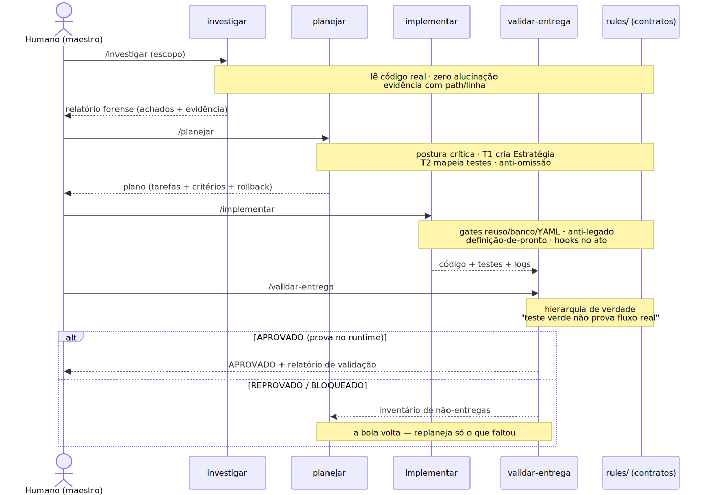
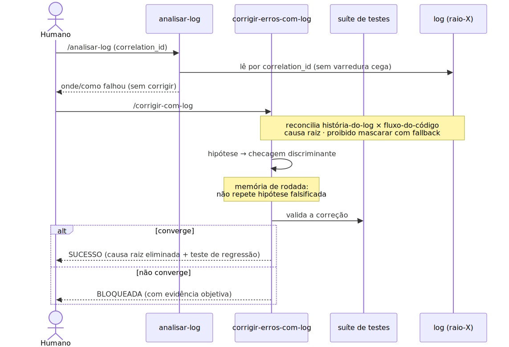

# Diagramas da Metodologia

> **Documento da base conceitual — diagramas neutros, reusados por todas as lentes.**
>
> **Critério editorial.** Aqui só entram diagramas que mostram algo que a prosa **não** mostra bem:
> a sequência temporal, os handoffs entre agentes e o **retorno** (o trabalho que volta), e a **decisão**
> de qual especialista chamar. Diagrama puramente decorativo de uma metáfora específica (ex.: a formação
> tática da lente futebol, o layout da linha da lente fábrica) fica **dentro de cada lente**, não aqui.
> Tudo em **Mermaid** — versiona no Git e renderiza direto no GitHub/VS Code, sem virar imagem solta que
> desatualiza.

---

## Diagrama 1 — O loop de desenvolvimento com retorno (sequência)

**O que ele revela que o texto não revela:** a ordem dos handoffs, o que cada agente entrega ao
próximo, e o **caminho de volta** quando a validação reprova. É a prova visual de que o processo **não
é uma esteira de mão única** — ele recupera o trabalho.

**Como usar na apresentação:** projete este diagrama no momento em que a lente percorre o fluxo
ponta-a-ponta. A seta `V-->>P` é o ponto que você deve enfatizar — é o anti-falso-verde em ação (o
trabalho que volta para ser refeito).

---

## Diagrama 2 — O loop de correção sem digitar código (sequência)

**O que ele revela:** que o **log substitui a leitura de código** como fonte de diagnóstico, e que a
correção converge ou declara bloqueio — nunca entrega "quase certo".

**Como usar na apresentação:** apoia o tema "desenvolver e corrigir sem digitar". O ponto a enfatizar:
o humano nunca abriu o código — o **log foi a fonte**.

---

## Diagrama 3 — Decisão: qual skill/agente chamar?

**O que ele revela:** resolve a dúvida operacional do dia a dia — *"isso é caso de `investigar`,
`analisar-log` ou `corrigir-com-log`?"*. É um artefato de uso diário, não só de aula.

**Como usar na apresentação:** é o diagrama "operacional" — bom para o público técnico que vai **usar**
o sistema amanhã. Também serve impresso, ao lado do monitor.

---

## Diagrama 4 — As três camadas transversais sobre o ciclo (visão de arquitetura)

**O que ele revela:** que DNA, observabilidade e arbitragem **atravessam** todas as fases, em vez de
pertencer a uma só. Complementa o [Ciclo de Vida do Software](ciclo-de-vida-software.md).

**Como usar na apresentação:** apoia o fechamento. Mostra que não é um amontoado de arquivos — é
cobertura intencional do ciclo inteiro.

---

**Relacionado (base conceitual):** [Ciclo de Vida do Software](ciclo-de-vida-software.md) ·
[Sem Digitar Código](sem-digitar-codigo.md) · [Os Dois Loops](os-dois-loops.md) ·
[↩ Voltar ao índice da metodologia](../README.md)
</content>
