# Mapa da Governança — Arquivo a Arquivo, Como o Processo Está Codificado

> **Onde este documento se encaixa.** Os outros materiais da base conceitual explicam os *conceitos*
> (os dois loops, a suíte como prova, as travas de escala). Este documento é o **mapa fiel da
> engenharia**: quais arquivos existem, o que cada um governa, quando cada um entra em contexto e como,
> juntos, eles orquestram o processo de desenvolvimento. É o documento para quem pergunta *"mas onde
> exatamente está escrita essa regra, e como ela chega até a IA na hora certa?"*.

> 🧑‍💼 **RESUMO EXECUTIVO.** Um processo de engenharia inteiro — investigação, planejamento,
> implementação, validação, correção forense, aprendizado — está **codificado em ~15.900 linhas de
> texto versionado** (~845 KB de markdown e shell), distribuído em **7 camadas** com carregamento
> inteligente de contexto: o que vale sempre fica num arquivo-raiz de 180 linhas; o resto só entra em
> contexto **quando o caminho, o gatilho ou a tarefa pedem**. A consequência prática: a IA não "se
> comporta bem por sorte" nem por talento do operador do dia — ela é **governada** por contratos
> explícitos, auditáveis por `git log`, e reforçada por travas determinísticas que rodam fora do
> modelo. Placar atual: **20 agentes · 17 skills · 20 rules · 7 hooks · 0 commands**.

---

## 1. O problema que este desenho resolve

Instruções para IA têm dois modos clássicos de falhar: **contexto de menos** (a regra existe, mas não
estava carregada quando importava) e **contexto de mais** (tudo carregado sempre, custo explode e as
regras importantes se diluem no ruído). O desenho deste repositório ataca os dois ao mesmo tempo com
uma ideia única: **cada regra vive em um só arquivo, e cada arquivo declara quando deve entrar em
contexto**. O resultado é um sistema de 7 camadas onde a constituição é curta e permanente, e todo o
resto é carregado sob demanda — por caminho de arquivo, por gatilho de pedido ou por evento de
ferramenta.

---

## 2. As 7 camadas e seus mecanismos de carregamento

### Camada 1 — `CLAUDE.md` raiz: a constituição (sempre em contexto)

- **O que governa:** os princípios inegociáveis que valem para qualquer tarefa — evidência antes de
  afirmação, fonte de verdade real, escopo mínimo sem fragilidade, os 9 portões do §5, contrato de
  `correlation_id`, proibição de DDL em runtime.
- **Quando entra:** **sempre**. São 180 linhas lidas em toda sessão.
- **Exemplo real:** o §5 declara *"toda implementação, evolução, manutenção, refatoração ou execução
  de plano passa pela skill/agente `implementar`"* — é a raiz que define a porta de entrada única, e
  delega o procedimento profundo para as camadas abaixo. O próprio cabeçalho explica o desenho:
  *"Contratos profundos → `.claude/rules/`"*, *"Procedimentos → skills"*.

### Camada 2 — `CLAUDE.md` aninhados: regras por região (entram por caminho)

- **O que governam:** as regras específicas de cada árvore: `src/`
  (484 ln — motor agentic, routers, Job Core), `app/ui/` (508 ln),
  `tests/` (196 ln), `app/yaml/`
  (59 ln) e `docs/` (27 ln).
- **Quando entram:** quando um arquivo daquela pasta é tocado.
- **Exemplo real:** `tests/CLAUDE.md` fixa *"Seleção 100% por marker explícito. Proibido inferir por
  diretório, nome de arquivo, import, fixture..."* — uma regra que só interessa a quem mexe em teste,
  e por isso não polui o contexto de quem edita UI. A precedência é declarada: os aninhados
  complementam o raiz; em sobreposição, o raiz é a base.

### Camada 3 — Rules (`.claude/rules/`): contratos profundos com escopo por caminho

- **O que governam:** os contratos que seriam longos demais para o raiz — logs canônicos, suíte de
  testes, reuso, loops estratégicos, tiering de subagentes (20 arquivos, 1.679 linhas).
- **Quando entram:** **19 das 20 rules têm frontmatter `paths:`** — a rule é injetada quando um
  arquivo que casa o padrão é tocado. A exceção é
  `qualidade-texto.md`, sem `paths:`, que vale para
  todo texto produzido e entra junto do raiz.
- **O mecanismo mais fino da governança — "injeção de dependência de contexto":** vários `paths:`
  apontam para **os próprios arquivos de agents e skills**. Exemplo real:
  `estrategia-recomendacoes.md` declara
  `paths: [".claude/agents/implementar.md", ".claude/agents/planejar.md", ...]` — quando o agente
  `implementar` roda, a rule que governa o handoff plano→execução **entra automaticamente no contexto
  dele**, sem que ninguém precise copiá-la para dentro do agente. Um lugar para editar, zero drift.

### Camada 4 — Agents (`.claude/agents/`): o procedimento completo, executado isolado

- **O que governam:** o passo a passo profundo de cada especialidade (investigar, planejar,
  implementar, validar-entrega, corrigir-erros-com-log, testar-ingestao-dnit...). São 20 arquivos e
  7.936 linhas — a camada mais volumosa, porque é onde mora o procedimento.
- **Quando entram:** quando o agente é acionado — e ele roda **isolado da janela principal**. As
  skills explicitam o porquê: *"o agente roda isolado ('vai e volta') para manter o contexto principal
  limpo e gastar menos tokens; o resultado volta como relatório do agente"*.
- **Exemplo real:** `validar-entrega.md` abre com
  *"Este agente e o fiscal final da entrega. Ele nao investiga do zero, nao implementa e nao corrige
  codigo"* — a separação de papéis está escrita no próprio arquivo, não combinada de boca.

### Camada 5 — Skills (`.claude/skills/`): o gatilho fino

- **O que governam:** o **roteamento** — reconhecer o pedido do usuário e despachar para o
  procedimento certo. 17 skills, 4.526 linhas, em dois tipos: **9 dispatchers finos** (16–65 linhas,
  com agente correspondente) e **8 autocontidas** (388–1.001 linhas, procedimento próprio sem agente
  espelho — as baterias de teste de webchat/NL2SQL/NL2YAML, `corrigir-com-log`, `playwright-cli`).
- **Quando entram:** quando o pedido do usuário casa a `description` do frontmatter (ex.: *"Use when:
  investigar, auditar ou analisar forensemente..."*).
- **Exemplo real de anti-duplicação:** todo dispatcher repete a mesma frase — *"Nada aqui duplica o
  agente: para mudar regra ou comportamento, edite o agente `investigar`, não esta skill."* A skill é
  gatilho; o agente é a fonte.

### Camada 6 — Hooks (`.claude/hooks/`): a trava determinística, fora do LLM

- **O que governam:** o que **não pode depender de o modelo lembrar**. São 7 scripts shell (308
  linhas) executados pelo harness em eventos de ferramenta: **3 bloqueiam**
  ([`bash-guard.sh`](../../../../.claude/hooks/bash-guard.sh),
  [`worktree-guard.sh`](../../../../.claude/hooks/worktree-guard.sh),
  [`write-guard.sh`](../../../../.claude/hooks/write-guard.sh)) e **3 apenas avisam**
  (`py-lint.sh`, `logging-nudge.sh`, `py-discipline.sh`). Um sétimo —
  [`stop-loop-reminder.sh`](../../../../.claude/hooks/stop-loop-reminder.sh) — está **pronto mas não
  registrado** em nenhum settings (lacuna conhecida e declarada; ver §8).
- **Quando entram:** `PreToolUse(Bash)` → bash-guard + worktree-guard; `PreToolUse(Write)` →
  write-guard; `PostToolUse(Edit|Write)` → os 3 nudges. Nada em SessionStart/Stop.
- **Exemplo real:** o cabeçalho de `bash-guard.sh` — *"bloqueia varredura cega de /logs (CLAUDE.md §9
  — pode travar a sessão); bloqueia comandos claramente destrutivos"*. E o de `worktree-guard.sh`
  assume postura oposta na falha: *"falha fechada. Toda exclusao desses worktrees exige confirmacao
  expressa do alvo exato"* (token nominal `CONFIRMO_EXCLUSAO_WT_ALHEIA=<nome-exato>`).

### Camada 7 — Scripts de dados (`.claude/scripts/`): o braço determinístico da "fonte de verdade real"

- **O que governam:** o acesso **real** aos recursos externos — PostgreSQL, Redis, Qdrant, RabbitMQ,
  scheduler, Job Core, logs. São ~46 ferramentas em 8 subpastas (`common` 10, `job-core` 10, `dnit` 7,
  `scheduler` 5, `testar_cli_log_analyzer` 5, `redis` 4, `postgresql` 3, `qdrant` 2), com convenções
  fixas: `--help` obrigatório e **dry-run por default em toda mutação**.
- **Quando entram:** sempre que uma conclusão depende do estado de um store físico. A rule
  `ferramentas-acesso-dados.md` é o
  inventário e o gatilho: *"LEIA ANTES de dizer 'não tenho como verificar' ou 'não tenho
  ferramenta'."*
- **Por que é uma camada de governança:** sem scripts prontos, a IA improvisa acesso ad-hoc ou conclui
  por proxy ("o grep não achou, logo não existe"). Com eles, a regra de ouro do raiz §1 — tocar a
  fonte de verdade real antes de afirmar ausência — tem um caminho executável e auditável.

---

## 3. O grafo de orquestração

### 3.1 O pipeline principal

O caminho oficial de qualquer mudança relevante é uma cadeia de 4 fases, e o **handoff entre fases é
um arquivo materializado** em `docs/.interno/.planos/<nome>/` — nunca só uma conversa:

Por que **"resposta só no chat é inválida"**: o agente `investigar` declara literalmente *"Resposta
apenas no chat, sem arquivo materializado, e invalida"*
(investigar.md). O motivo é de engenharia, não de
burocracia: a janela de contexto morre, o arquivo fica. O plano vira o estado durável da execução
(diário write-ahead), a validação vira relatório contável, e qualquer sessão futura — humana ou IA —
reconstrói o histórico sem depender de memória de conversa. Detalhes de cada fase: `planejar` recusa
"ideia solta" (exige investigação prévia); a seção `# Estrategia/Recomendacoes` do plano é contrato
formal entre produtor e consumidor
(estrategia-recomendacoes.md); e
`validar-entrega` fecha com um de 4 status — `APROVADO`, `APROVADO COM RESSALVAS`, `REPROVADO`,
`BLOQUEADO POR FALTA DE EVIDENCIA` — e, ao achar não-entrega, **aciona o planejar** em vez de
replanejar por conta própria.

### 3.2 A cadeia forense de correção por log

Erro real de runtime tem um trilho próprio, disparado pelo raiz §1 e contratado em
`loops-estrategicos.md`:

1. capturar o `correlation_id` da execução com erro;
2. abrir o log oficial (`python -m src.log_analyzer`);
3. **cara-crachá sequencial** log × código-fonte (debug forense, não adivinhação);
4. provar a causa raiz **antes** de rotular ("ambiente", "credencial" e "sem dado" por inferência são
   proibidos);
5. corrigir na origem, proteger com teste, voltar ao teste.

Em camadas de custo crescente: reflexo inline (`log_analyzer`) → skill/agente `analisar-log`
(diagnóstico sem corrigir) → skill `corrigir-com-log` → agente
`corrigir-erros-com-log` (correção completa,
com memória durável própria). Os artefatos desta cadeia ficam em `.sandbox/` (`log_<cid>.md`,
`plano-<cid>.md`) — efêmeros por rodada, diferentes dos artefatos duráveis do pipeline principal.

### 3.3 Os 9 portões do `CLAUDE.md §5` e quem define cada um

| # | Portão | Quem define o contrato |
|---|---|---|
| 1 | Entrada canônica de implementação | `skills/implementar` + `agents/implementar.md` |
| 2 | Reuso antes de criar | `rules/reuso-instructions.md` |
| 3 | Banco / schema / SQL | `docs/tecnico/README-SCHEMA-BANCO.md` (leitura obrigatória prévia) |
| 4 | Execução centralizada de SQL | o próprio raiz §5 (regra arquitetural inline) |
| 5 | Anti-DDL em runtime | o próprio raiz §5 (gate absoluto inline) |
| 6 | Testes / suíte oficial | `rules/suite-testes-instructions.md` |
| 7 | Log / observabilidade | `rules/log-instructions.md` |
| 8 | Repositório grande | `rules/large-repo-navigation.md` |
| 9 | Tier de modelo de subagente | `rules/regras_uso_subagentes.md` |

O padrão é sempre o mesmo: o raiz declara o portão em poucas linhas e aponta a fonte única do
contrato profundo — que só entra em contexto quando o caminho tocado a puxa.

---

## 4. Catálogo de mecanismos de engenharia

**Gates bloqueantes × nudges** — fonte: `settings.json` + `.claude/hooks/`. Problema: nem toda regra
merece o mesmo enforcement — bloquear tudo paralisa, avisar tudo é ignorável. Solução calibrada: só
bloqueia o **irreversível ou o que trava a sessão** (varredura cega de `logs/`, destrutivos, exclusão
de worktree alheia, teste em pasta proibida); disciplina de estilo e logging vira nudge injetado no
contexto após a edição. Até a política de falha é calibrada: `bash-guard` falha **aberta** (erro do
hook deixa passar), `worktree-guard` falha **fechada** (na dúvida, nega).

**Os dois loops estratégicos** — fonte:
`loops-estrategicos.md`. Problema declarado no
próprio arquivo: a observabilidade e a memória de rodada *"estavam corretas mas dispersas, e o reflexo
de usá-las não disparava sozinho"*. Loop 1 (auto-correção por log) transforma todo erro real em
investigação forense obrigatória (§3.2). Loop 2 (memória de rodada) registra cada tentativa com
evidência e exige reler antes de nova hipótese — anti-repetição dentro da campanha. A promoção para
memória **durável** tem gate próprio: só regra preventiva comprovada sobe para os
`licoes-aprendidas.md` dos agentes; *"não promover ruído operacional local"*.

**Fonte de verdade real / anti-proxy** — fonte: raiz §1 +
`ferramentas-acesso-dados.md` +
`disciplina-investigacao-teste.md`.
Problema: a IA conclui "não existe / vazio" a partir de grep, código ou log — e erra, porque camadas
que se parecem diferem ("tabela-registro vazia ≠ store físico vazio"). Imposição: afirmação de
ausência/estado só vale depois de **tocar o store físico** com os scripts prontos; em teste, enumerar
hipóteses e esgotá-las na fonte real antes de rotular causa.

**`correlation_id` ponta a ponta** — fonte: raiz §8 +
`log-instructions.md`. Problema: sem identidade única
por execução, o debug forense é impossível e logs de execuções distintas se misturam. Contrato: o id
nasce **uma vez** no boundary oficial, atravessa API/worker/scheduler da mesma execução, volta na
response (`X-Correlation-Id`), e **nenhuma camada abaixo cria, deriva ou recicla**. Objeto cacheado
nunca congela o id — resolve a correlação em tempo de chamada pelos mecanismos canônicos.

**Suíte como prova** — fonte:
`suite-testes-instructions.md`; papel
metodológico em [A Suíte como Prova](suite-como-prova.md). Problema: "rodei e passou" é opinião que
some. Imposição: entrypoint único (`python suite_de_testes_padrao.py <modo> --run-id <uuid>`), 13
modos exclusivos + 9 flags `--with-*`, `run_id` obrigatório amarrando `telemetry.json` + `state.json`
+ logs por target — validação vira **evidência auditável** reabrível por qualquer pessoa.

**Reuso antes de criar** — fonte:
`reuso-instructions.md`. Problema: em repositório
grande, "solução nova" costuma ser duplicação disfarçada. Imposição em 6 passos ordenados: identificar
candidatos → buscar implementações → **ler os arquivos direto** → entender a intenção → avaliar
reutilizar/evoluir → só então criar. Criar sem cumprir a ordem é violação de gate, não preferência.

**Travas de subagentes** — fonte:
`regras_uso_subagentes.md`. Problema: delegar
para modelo barato economiza, mas um falso negativo barato ("não existe", "100% coberto") contamina
decisões caras. Trava 1: conclusão de **ausência/completude fica no modelo forte** — busca para
coletar evidência pode ser barata; busca para afirmar que algo não existe, não. Trava 2: **baixar o
effort antes de baixar o tier**. Pergunta de corte: "se o subagente errar, o principal percebe e
corrige fácil?".

**Definição de pronto / anti-falso-verde** — fonte:
`definicao-de-pronto.md`. Problema: entrega
"pronta" que o runtime oficial ainda não usa — componente novo órfão, DDL aplicado, teste unitário
verde, e o caminho real intocado. Imposição: entrega está **incompleta** enquanto o caminho oficial de
runtime não usar a implementação nova; doc, pacote isolado e unit test não provam conclusão sozinhos.

**Fidelidade ao pedido** — fonte:
`fidelidade-pedido-usuario.md` (injetada nos
agentes `investigar`/`planejar`). Problema: pedidos com lista de itens viram um rótulo genérico e
metade do escopo evapora. Imposição: reapresentar o pedido de forma fiel e nível 101 no artefato de
saída, com o destino explícito de **cada item** — *"Item relevante não pode desaparecer
silenciosamente."*

**Navegação em repo grande** — fonte:
`large-repo-navigation.md`; conceito em
[Travas para Projetos Muito Grandes](travas-projetos-grandes.md). Problema: exploração ampla queima
contexto e induz conclusão global sem evidência. Imposição: âncora antes de abrir arquivos, fatia
mínima, proibição de varredura cega, aplicação proporcional à complexidade da tarefa.

**Execução resumível de planos** — fonte:
`execucao-plano-resumivel.md`. Problema:
plano longo executado numa janela só morre no meio e perde tudo. Imposição: **orquestrador quente**
(janela principal, nunca re-onboarda) + **worker descartável** (agente `implementar` por fase) +
**diário write-ahead por tarefa** gravado no arquivo do plano. Perda máxima = a tarefa em voo.
Contrapeso anti-burocracia: plano ≤ ~4 tarefas não fracionar.

**Segregação por ambiente** — fonte: raiz §3. Problema: dev, homologação e produção compartilham
fisicamente banco/Redis/filas — identificador fixo vaza dado entre ambientes. Imposição: todo nome,
chave, fila, namespace ou id persistente **inclui a variável `ENVIRONMENT`**; ao passar pelo caminho
de mudança, convergir para helpers que embutam a segregação por padrão.

**Anti-DDL em runtime** — fonte: raiz §5. Problema: `CREATE/ALTER` embutido em startup ou request
trava a tabela (`ACCESS EXCLUSIVE`) e congela o processo — mesmo o "idempotente" `IF NOT EXISTS`.
Imposição: todo DDL é executado à mão em janela controlada; código de aplicação assume schema
existente e **falha explícito** se faltar. DDL embutido encontrado é defeito a remover, não a melhorar.

**Qualidade de texto** — fonte:
`qualidade-texto.md` (única rule sem `paths:`, vale
sempre). Problema duplo e simétrico: **linguiça** (parafrasear, inflar volume) e **lacuna** (faltar o
que o leitor precisa). Imposição: o gate mede densidade de valor por linha, nunca tamanho — conteúdo
necessário entra mesmo longo, redundante sai mesmo curto. Este próprio documento foi escrito sob esse
gate.

---

## 5. Números do sistema

| Camada | Quantidade | Volume e detalhe |
|---|---|---|
| `CLAUDE.md` | 6 (raiz + 5 aninhados) | 1.454 ln / ~125 KB — raiz 180; `src/` 484; `app/ui/` 508; `tests/` 196; `app/yaml/` 59; `docs/` 27 |
| Rules | 20 | 1.679 ln / ~96 KB — 19/20 com `paths:` (path-scoped) |
| Agents | 20 | 7.936 ln / ~342 KB — maior: `testar-ingestao-dnit.md` (1.991 ln); 5 opus, 7 sonnet, 8 herdam default |
| Skills | 17 | 4.526 ln / ~258 KB — 9 dispatchers finos + 8 autocontidas; maior: `testar-webchat` (1.001 ln) |
| Hooks | 7 scripts | 308 ln — 3 bloqueiam, 3 nudges wired, 1 pronto sem wiring |
| Commands | 0 | roteamento é 100% por skill |
| Scripts de dados | ~46 em 8 subpastas | `--help` obrigatório; dry-run por default em mutação |
| Memória durável de agentes | 4 arquivos (2 pares) | `licoes-aprendidas.md` de 21,8 KB (corrigir-erros-com-log) e 23,7 KB (testar-ingestao-dnit) + 2 `log-rodada.md` |
| Portões nomeados (raiz §5) | 9 | ver §3.3 |
| Modos exclusivos da suíte | 13 (+9 flags `--with-*`) | entrypoint único com `--run-id` obrigatório |
| **Corpus total** | **~15.900 linhas / ~845 KB** | markdown + shell, sem contar `.py` dos scripts nem memórias |

**Placar de referência: 20 agentes · 17 skills · 20 rules · 7 hooks · 0 commands.**

---

## 6. As decisões de engenharia por trás do desenho

Esta é a seção "por que foi desenhado assim" — cada decisão nasceu de um modo de falha concreto.

1. **Contexto em camadas com carregamento sob demanda.** Raiz de 180 linhas delega a 20 rules
   path-scoped. Evita: constituição gigante sempre carregada, diluindo as regras críticas.
   (Evidência: cabeçalho do `CLAUDE.md`; frontmatters `paths:`.)
2. **Rules com `paths:` apontando para os próprios agents** ("injeção de dependência de contexto").
   Evita: copiar o contrato para dentro de cada agente e vê-los divergir.
   (Evidência: `estrategia-recomendacoes.md`
   casa `.claude/agents/implementar.md`.)
3. **Skill = roteamento; agente = procedimento.** Um lugar só para editar cada regra. Evita: a mesma
   instrução em dois arquivos, atualizada em um. (Evidência: frase padrão dos 9 dispatchers — *"Nada
   aqui duplica o agente"*.)
4. **`validar-entrega` separado e proibido de corrigir.** O fiscal não pode ser cúmplice do que
   fiscaliza; não-entrega volta ao `planejar`, nunca é remendada no ato. Evita: autovalidação
   complacente. (Evidência: `validar-entrega.md` —
   *"o fiscal final da entrega... nao implementa e nao corrige codigo"*.)
5. **Pipeline com artefatos materializados como handoff.** Estado sobrevive à janela de contexto e é
   auditável depois. Evita: decisão importante presa numa conversa que expira.
   (Evidência: `investigar.md` — *"Resposta apenas no
   chat, sem arquivo materializado, e invalida"*.)
6. **Execução resumível: write-ahead por tarefa, worker descartável, orquestrador quente.** Evita:
   perder um plano inteiro quando a execução morre no meio.
   (Evidência: `execucao-plano-resumivel.md`.)
7. **"Sucesso ≠ ausência de exceção".** Saúde se prova positivamente, item a item ("presente no
   log" / "ausente no log"). Evita: falha silenciosa e degraded mode passando por verde.
   (Evidência: raiz §9.)
8. **Trava do falso negativo no tier de modelo.** A política de custo é amarrada ao **tipo de
   conclusão**, não ao tipo de operação. Evita: economizar tokens numa busca cujo erro ("não existe")
   contamina toda a decisão seguinte.
   (Evidência: `regras_uso_subagentes.md`.)
9. **Hooks calibrados: só 3 bloqueiam.** Bloqueio para o irreversível; disciplina é nudge.
   `worktree-guard` é o único com falha fechada + token nominal, porque exclusão de worktree alheia
   não tem undo. Evita: tanto o hook-tirano quanto o aviso inócuo.
   (Evidência: cabeçalhos de [`bash-guard.sh`](../../../../.claude/hooks/bash-guard.sh) e
   [`worktree-guard.sh`](../../../../.claude/hooks/worktree-guard.sh).)
10. **Memória de lições com gate de promoção.** Efêmero (`log-rodada.md`) separado do durável
    (`licoes-aprendidas.md`); só promove regra preventiva comprovada. Evita: a memória durável virar
    lixão de ruído operacional.
    (Evidência: `corrigir-erros-com-log.md` e
    seus arquivos de memória.)
11. **Anti-proxy com taxonomia nomeada.** "Tabela-registro vazia ≠ store físico vazio"; "log diz X ≠
    estado real é X". Nasceu de post-mortem real de conclusões erradas por proxy. Evita: repetir o
    erro dando-lhe nomes vagos. (Evidência: raiz §1, "camadas que se parecem mas diferem".)
12. **Gate de teste que reprova por observabilidade.** Um `500` que volta **sem** `X-Correlation-Id`
    reprova a rodada — mesmo que o "bug em si" seja outro. Evita: erodir a rastreabilidade aos poucos,
    um caminho de erro por vez. (Evidência: `src/CLAUDE.md`, contrato de
    correlação.)
13. **Seleção de teste 100% por marker, nunca por pasta.** Policiada por dois hooks (`write-guard`
    bloqueia teste em pasta proibida; `py-discipline` avisa teste sem marker de família). Evita: o
    recorte da suíte depender de convenção implícita de diretório.
    (Evidência: `tests/CLAUDE.md` — *"Seleção 100% por marker
    explícito"*.)
14. **Depreciação governada com trilho.** O Job Core genérico está *"DEPRECADO — em depreciação
    ativa"*: proibido adicionar job novo, proibido desligar enquanto ETL/background dependem dele.
    Congela o crescimento sem quebrar o presente. Evita: tanto o legado que cresce quanto o big-bang
    de remoção. (Evidência: `src/CLAUDE.md` Parte 4.)
15. **Feedback de progresso como contrato, não cortesia.** A rodada longa deve emitir sinais de vida
    verificáveis; *"Heartbeat parado + processo ausente = rodada morta, nao 'espera'"*. Evita: esperar
    horas por um processo que já morreu.
    (Evidência: `executar-testes.md`.)

---

## 7. Inventário completo (tabelas de referência)

### 7.1 As 20 rules

| Rule | O que governa | Como carrega (`paths:`) |
|---|---|---|
| ambiente-local.md | Procedimentos de app local (FastAPI/porta presa) e automação de navegador | agents/skills de testar-\*, corrigir-\*, criar/executar-testes, validar-\*, analisar-log |
| componente-chat-embutivel.md | Fonte única do chat embutível `PrometeuEmbeddableChatRuntime` (reuso e regras de uso) | `app/ui/**` |
| definicao-de-pronto.md | Anti-falso-verde: entrega só vale ativa no caminho oficial de runtime | `src/**`, `tests/**`, `app/**` |
| disciplina-investigacao-teste.md | Trava anti-teste-raso: hipóteses esgotadas na fonte real antes de rotular causa | `tests/**` + agents/skills testar-\* |
| dyn-sql-tools-registro.md | Tools `dyn_sql`: resolução YAML-first (inline vence; registro de banco é fallback) | `app/yaml/**` |
| estrategia-recomendacoes.md | Contrato da seção `# Estrategia/Recomendacoes` (handoff plano → execução) | agents/skills implementar e planejar |
| execucao-plano-resumivel.md | Orquestrador quente + worker por fase + diário write-ahead por tarefa | agents/skills implementar e planejar |
| ferramentas-acesso-dados.md | Inventário do acesso real a Qdrant/Postgres/Redis/RabbitMQ/logs | `.claude/scripts/**`, agents gerenciar-\* |
| fidelidade-pedido-usuario.md | Reapresentação fiel do pedido; nenhum item some silenciosamente | agents/skills investigar e planejar |
| large-repo-navigation.md | Anti-varredura, âncora, fatia mínima e escopo em repositório grande | `src/**`, `app/**`, `tests/**` |
| log-instructions.md | Contrato de `correlation_id`, campos canônicos, builders e validação de log | `src/**`, `app/**`, `tests/**` |
| loops-estrategicos.md | Os 2 loops de 1ª classe: auto-correção por log + memória de rodada | `tests/**`, agents corrigir-\*/analisar-log, skill corrigir-com-log |
| padrao-listas-perguntas-teste.md | Formato simétrico das listas de perguntas dos testes de chat/webchat | agents/skills testar-\*/corrigir-\*, `tests/**` |
| python.md | Tipagem 100%, estilo, retry, mocks/doubles e disciplina Python | `**/*.py` |
| qualidade-texto.md | Gate anti-linguiça + anti-lacuna para todo texto produzido | **única sem `paths:`** — vale sempre |
| regras_uso_subagentes.md | Tiering de modelo por risco de conclusão (travas 1 e 2) | `app/yaml/**`, `.claude/agents/**`, `.claude/skills/**`, `docs/**` |
| reuso-instructions.md | Os 6 passos obrigatórios de reuso antes de criar solução nova | `src/**`, `tests/**`, `app/**` |
| subagentes-descricao-instructions.md | Validação de ambiguidade de roteamento das descrições de subagentes | `app/yaml/**`, CLIs `validar_descricao_subagentes.*`, agent implementar |
| suite-testes-instructions.md | Governança da suíte oficial: gates, sintaxe pública e flags | `tests/**`, `suite_de_testes_padrao.py`, agents/skills testar-\*/corrigir-\* |
| worktree.md | Procedimento operacional de worktrees (naming fixo, foco exclusivo) | agents implementar e planejar |

### 7.2 Os 20 agents

| Agente | Especialidade (descrição real, resumida) | Modelo |
|---|---|---|
| analisar-log | Análise forense de logs reais de execução, sem correção de código | sonnet |
| analisar-produto | Análise de produto, mercado e posicionamento de soluções | herda default |
| corrigir-erros-com-log | Debugging e correção com causa raiz provada por log | herda default |
| criar-testes | Expansão de cobertura de testes (foco: novos testes) | herda default |
| documentar | Documentação técnica, executiva, comercial e tutorial 101 | sonnet |
| executar-testes | Debugging e estabilização da suíte Python com foco em zero erros | herda default |
| gerenciar-job-core-ingestao | Operação real de Job Core, ingestão e RabbitMQ, com mutação auditável | herda default |
| gerenciar-postgresql | Operação real de PostgreSQL: snapshot, query controlada, mutação mínima | herda default |
| gerenciar-redis | Operação real de Redis: snapshot, chaves, análise de runtime | herda default |
| gerenciar-scheduler | Operação real do Scheduler: consulta, auditoria, cancelamento, purge | herda default |
| implementar | Evolução, manutenção, refatoração e execução de planos | **opus** |
| inventario-componentes-genericos | Inventário de classes, helpers e componentes reutilizáveis | **opus** |
| inventario-yaml | Inventário de arquivos YAML | sonnet |
| investigar | Investigação forense, auditoria, observabilidade e análise estática | **opus** |
| planejar | Planejamento de mudança para implementação/evolução/refatoração | **opus** |
| sincronizar-documentacao | Atualização de documentação técnica | sonnet |
| testar-cancelamento-ingestao-dnit | Teste de cancelamento forçado da ingestão DNIT pela UI real | sonnet |
| testar-cli-log-analyzer | Testar/corrigir/validar em loop a CLI do `src.log_analyzer` | sonnet |
| testar-ingestao-dnit | Ingestão DNIT em loop corretivo até encerramento sem erro no log | sonnet |
| validar-entrega | Validação de entrega, aderência ao plano, testes e observabilidade | **opus** |

A distribuição de modelos (5 opus, 7 sonnet, 8 herdam) aplica a regra do tiering: quem **conclui**
sobre ausência/completude ou decide arquitetura fica no modelo forte; quem executa procedimento
verificável fica no barato.

### 7.3 As 17 skills

| Skill | Tipo | O que dispara (da `description` real) |
|---|---|---|
| analisar-log | dispatcher | analisar log por correlation_id, erros, estatísticas, sem corrigir |
| auditoria-suite-testes | autocontida | auditar a suíte oficial em loop, com telemetria por tentativa |
| corrigir-com-log | autocontida | corrigir erro real do produto com base em logs da correlação |
| criar-testes | dispatcher | criar testes unitários, proteger módulo, ampliar cobertura |
| executar-testes | dispatcher | rodar/estabilizar a suíte, reproduzir falhas, validar rodada final |
| implementar | dispatcher | implementar/refatorar/ajustar feature, fluxo, YAML, código, wiring |
| inventario-componentes-genericos | dispatcher | inventariar classes, helpers e componentes reutilizáveis |
| investigar | dispatcher | investigar/auditar/analisar forensemente; "como implementar X?" |
| planejar | dispatcher | criar plano seguro e validável a partir de investigação concluída |
| playwright-cli | autocontida | automação de navegador e testes de páginas web |
| testar-ingestao-dnit | dispatcher | ingestão DNIT ao vivo com feedback em tempo real |
| testar-nl2sql | autocontida | testar a interface NL2SQL (SQL revisável, guardrail, diagnostics) |
| testar-nl2yaml | autocontida | testar o NL2YAML Studio (briefings → reconstrução de agentes) |
| testar-paginas-web-projeto | autocontida | depurar páginas web reais do projeto no navegador interno |
| testar-webchat | autocontida | loop teste→correção→teste nas 3 interfaces de chat até 100% verde |
| testar-webchat-dnit | autocontida | bateria de perguntas DNIT nos dois webchats, com telemetria |
| validar-entrega | dispatcher | validar uma entrega de plano realizada pelo agente implementar |

### 7.4 Os 7 hooks

| Hook | Tipo | O que faz | Wired? |
|---|---|---|---|
| bash-guard.sh | guard (bloqueia; falha aberta) | Nega varredura cega de `logs/` sem correlation_id e comandos destrutivos (`rm -rf`, `DROP/TRUNCATE`, `git push --force`); avisa escrita em `/tmp/` e `psql` sem pager | ✅ `PreToolUse(Bash)` |
| worktree-guard.sh | guard (bloqueia; **falha fechada**) | Nega exclusão de worktree/branch `worktree-codex`/`worktree-claude` sem token expresso `CONFIRMO_EXCLUSAO_WT_ALHEIA=<nome-exato>` | ✅ `PreToolUse(Bash)` |
| write-guard.sh | guard (bloqueia) | Nega criação de `test_*.py`/`*_test.py` em `tests/manual`, `disabled`, `temp` | ✅ `PreToolUse(Write)` |
| py-lint.sh | nudge | Roda `ruff check` no `.py` editado e injeta as questões no contexto | ✅ `PostToolUse(Edit\|Write)` |
| logging-nudge.sh | nudge | 6 detectores de violação de log: `logger.error` em except, f-string em log, logger paralelo, `print()` em `src/`, payload manual sem builder | ✅ `PostToolUse(Edit\|Write)` |
| py-discipline.sh | nudge | Detecta `except ImportError` (proibido), `FOR UPDATE` (justificar), teste sem marker de família | ✅ `PostToolUse(Edit\|Write)` |
| stop-loop-reminder.sh | nudge | Fim de rodada: lembra cobertura+observabilidade se editou `src/**.py` sem tocar `tests/` | ❌ **pronto, sem wiring** |

---

## 8. Limites honestos — o que a governança NÃO cobre sozinha

Governança escrita **reduz o risco, não o elimina**. Os limites conhecidos, declarados:

- **Curadoria humana dos contratos.** Os arquivos não se auto-escrevem nem se auto-corrigem: quando
  dois contratos derivam (e o próprio `tests/CLAUDE.md` prevê o caso, mandando tratar conflito local
  como drift dele mesmo frente à rule da suíte), é uma pessoa que detecta e reconcilia. A promoção de
  lição durável também passa por juízo — o gate "não promover ruído" é aplicado, não computado.
- **`stop-loop-reminder.sh` sem wiring.** O hook de fim de rodada existe e funciona, mas não está
  registrado em nenhum settings — hoje o lembrete "editou código sem tocar teste" não dispara.
  Lacuna conhecida; até o wiring, essa cobrança depende do contrato textual (raiz §10) e da revisão.
- **Indicadores ainda não agregados automaticamente.** As fontes de medição existem — status dos
  `validacao--*.md`, `telemetry.json` por `run_id`, disparos de guard, volume dos
  `licoes-aprendidas.md` — mas ninguém as consolida sozinho em painel; a agregação é manual (ver
  [Indicadores](indicadores.md)).
- **Hooks só pegam o padrão-detectável.** Guards e nudges operam por regex sobre comando/arquivo:
  cobrem as violações com assinatura conhecida, não julgamento semântico. E `bash-guard` falha
  **aberta** por desenho — um erro interno do hook deixa o comando passar.
- **Carregamento por `paths:` depende de tocar o caminho certo.** Uma rule path-scoped só entra em
  contexto quando um arquivo que casa o padrão é tocado; trabalho que deveria puxá-la por outro
  caminho depende dos ponteiros-gatilho do raiz e dos aninhados.

---

**Relacionado (base conceitual):** [Os Dois Loops](os-dois-loops.md) ·
[A Suíte como Prova](suite-como-prova.md) ·
[Travas para Projetos Muito Grandes](travas-projetos-grandes.md) ·
[Operar a Metodologia](operar-a-metodologia.md) · [Diagramas](diagramas.md) ·
[↩ Voltar ao índice](../README.md)
·
*Fontes primárias:* `CLAUDE.md` raiz ·
[`.claude/rules/`](../../../../.claude/rules/) · [`.claude/agents/`](../../../../.claude/agents/) ·
[`.claude/skills/`](../../../../.claude/skills/) · [`.claude/hooks/`](../../../../.claude/hooks/)
