# Manual técnico, executivo, comercial e estratégico: API, endpoints e Swagger

## 1. O que é esta feature

Este documento explica a superfície HTTP real da plataforma. Na prática,
isso cobre três coisas ao mesmo tempo:

- os endpoints de negócio e operação expostos pelo app FastAPI;
- os endpoints de acompanhamento assíncrono usados por polling e SSE;
- a publicação controlada do contrato OpenAPI em /docs, /redoc e
  /openapi.json.

O ponto importante é que a API deste projeto não é apenas uma camada de
transporte. Ela também é o boundary que separa autenticação, autorização,
validação, rate limit, correlação de logs, despacho assíncrono e retorno
de contratos tipados para agentes, workflows, RAG, configuração agentic,
portal do cliente e interfaces administrativas.

## 2. Que problema ela resolve

Sem uma superfície HTTP central e governada, cada capacidade da
plataforma tenderia a expor seu próprio contrato, sua própria política
de segurança e seu próprio jeito de acompanhar execução. Isso geraria um
problema operacional sério: a plataforma pareceria um conjunto de
features isoladas, e não um produto coerente.

Esta API resolve esse problema de quatro formas:

- centraliza publicação e descoberta dos contratos HTTP;
- aplica permissão e rate limit de forma consistente;
- separa chamadas síncronas de execuções longas acompanhadas por status;
- mantém OpenAPI e rotas reais no mesmo app, sem documentação paralela
  desconectada do runtime.

## 3. Visão executiva

Para liderança, esta feature importa porque reduz risco operacional e de
integração. Um cliente, parceiro ou time interno não precisa adivinhar
qual endpoint chamar, como autenticar, como rastrear uma execução longa
ou onde consultar status. Isso aumenta previsibilidade, reduz custo de
suporte e melhora governança.

Em termos práticos, a API também reduz o risco de iniciativas de IA
virarem protótipos difíceis de operar. O app HTTP já nasce com contratos
tipados, permissões nominais e rotas de monitoramento, o que facilita
auditoria e operação.

## 4. Visão comercial

Do ponto de vista comercial, a API é a porta de integração da
plataforma. Ela permite demonstrar que a solução não depende apenas de
interface visual: parceiros podem integrar agentes, workflows,
ingestões, ETL, status assíncrono e assembly agentic por contrato HTTP
estável.

Isso ajuda em três frentes:

- reduz objeção de cliente que precisa integrar com ERP, portal ou
  middleware existente;
- mostra maturidade técnica porque há OpenAPI, segurança e rotas
  rastreáveis;
- permite vender plataforma como capacidade integrável, e não só como
  tela pronta.

## 5. Visão estratégica

A API fortalece a estratégia da plataforma porque serve de camada comum
para módulos diferentes sem forçar cada domínio a reinventar seu próprio
boundary. O mesmo app publica RAG, agentes, workflows, configuração
governada, importação remota de Swagger, histórico operacional, portal do
cliente e UI web.

Isso importa estrategicamente porque a plataforma pode crescer por
domínio sem perder coerência de autenticação, observabilidade e contrato
HTTP.

## 6. Conceitos necessários para entender

### Como acessar o Swagger no runtime real

A superfície HTTP oficial deste projeto expõe três artefatos de contrato:

- `/docs`: UI Swagger interativa.
- `/redoc`: visualização ReDoc.
- `/openapi.json`: schema JSON utilizado por ferramentas, testes e CI.

O acesso a esses caminhos não é público. O fluxo real exige `x-api-key` válido e a permissão nominal `swagger.read`. Em ambiente local, a validação costuma ser feita com um header `x-api-key` e uma chamada direta ao schema JSON ou à interface HTML do Swagger.

Exemplo prático de verificação:

```bash
curl -i -H "x-api-key: <token-valido>" http://localhost:5555/openapi.json
```

Se a resposta for 401, a chave está ausente ou inválida. Se for 403, a chave existe, mas não possui `swagger.read`.

### OpenAPI e Swagger

OpenAPI é o contrato formal da API. Swagger e ReDoc são interfaces de
consulta desse contrato. Neste projeto, eles não são expostos como
conveniência pública; passam por controle de permissão.

### Boundary HTTP

Boundary é a borda entre o mundo externo e o runtime interno. Aqui ele
recebe payload, autentica, valida, escolhe serviços e decide se a
execução responde na mesma chamada ou segue em modo assíncrono.

### Execução síncrona e assíncrona

Chamadas rápidas podem responder no mesmo HTTP. Chamadas longas geram
task_id e URLs de acompanhamento. Isso evita bloquear o processo web com
trabalho pesado.

### Permissão por header, YAML ou sessão

Nem toda rota usa o mesmo modo de autorização. Há famílias que exigem
header, outras aceitam header ou YAML resolvido, e outras atendem fluxo
web autenticado.

### Correlação operacional

Correlation_id é o identificador lógico usado para ligar request,
status, logs e execução em worker. Sem ele, suporte e operação perdem o
fio da investigação.

## 7. Como a feature funciona por dentro

O app central é criado em src/api/service_api.py. Esse arquivo monta o
FastAPI com /docs, /redoc e /openapi.json, registra middlewares e inclui
os routers de domínio.

Depois disso, o runtime aplica uma regra importante: a documentação HTTP
publicada não é automaticamente pública. O middleware de proteção do
Swagger intercepta os caminhos sensíveis e exige a permissão
swagger.read.

Na sequência, cada família de router entra com seu prefixo e seu
contrato próprio. Alguns exemplos confirmados no código:

- /agent para execução, continuidade e cancelamento de agentes;
- /agent/hil/decisions para registrar decisão HIL assíncrona por POST
  seguro sem forçar continuação via chamada HTTP interna;
- /workflow para execução e retomada de workflows;
- /rag para ingestão, ETL, dispatcher unificado, reindex e rebuild de
  auto_config;
- /status e /api/v1/status para polling e SSE de tarefas assíncronas;
- /interaction-runs para consulta paginada da telemetria de interações
  e atualização do campo observacoes;
- /config/assembly para draft, validate, confirm, preflight, schema,
  catalog, recommend-tools e objective-to-yaml;
- /config/nl2sql para geração de SQL proposta a partir de linguagem
  natural;
- /admin/background-executions para consulta de requests, schedules,
  runs, eventos, pedidos HIL e cancelamento administrativo de agenda;
- /client-portal para perfil, credenciais, segredos e importação remota
  de Swagger/OpenAPI;
- /api/auth para login federado, sessão web e reset local de senha com
  envio transacional interno via provider oficial configurado, hoje
  Brevo ou Resend;
- /admin, /channels, /api/whatsapp, /api/instagram,
  /api/dnit e outras famílias de apoio operacional.

## 8. Divisão em submódulos lógicos

### 8.1 App HTTP central

É o ponto onde a plataforma publica o contrato OpenAPI e agrega todos os
routers. O valor aqui não é conter regra de negócio, e sim garantir uma
superfície única para segurança, middlewares e publicação da API.

### 8.2 Boundaries de execução

São os routers de agente, workflow e RAG. Eles resolvem autenticação,
normalizam correlation_id, escolhem modo de execução e devolvem resposta
final ou envelope assíncrono.

### 8.3 Boundaries de configuração governada

São os routers de assembly agentic, contrato legado e NL2SQL. O objetivo
é publicar capacidades de configuração de forma validada, sem tratar
texto gerado como contrato executável por si só.

### 8.4 Boundaries de acompanhamento

São as rotas de status e stream. Elas existem para separar aceitação da
requisição de observação de progresso, principalmente quando o trabalho
continua fora do processo HTTP.

### 8.5 Boundaries administrativos e de portal

São as rotas voltadas a operação, portal do cliente, integrações e
administração. Elas não são detalhe cosmético; representam governança,
segregação de acesso e operação multi-tenant.

## 9. Pipeline ou fluxo principal

O fluxo macro da API pode ser entendido assim:

1. O request entra no app FastAPI central.
2. Middlewares resolvem contexto básico, como sessão e políticas
   transversais.
3. O boundary correto recebe o payload e valida permissão.
4. O router resolve configuração, credencial e correlation_id.
5. O router decide se responde de forma síncrona ou se agenda a tarefa.
6. Quando a execução é longa, o cliente acompanha por /status ou
   /stream.
7. O mesmo correlation_id conecta resposta, progresso e logs.

## 10. Decisões técnicas e trade-offs

### Publicar OpenAPI dentro do app, mas proteger acesso

Ganho: contrato oficial e runtime ficam no mesmo lugar.

Custo: a proteção precisa ser tratada no próprio boundary HTTP.

Impacto prático: evita Swagger público por acidente e reduz exposição de
superfície sensível.

### Reaproveitar um app único para vários domínios

Ganho: coerência operacional, um padrão único de segurança e descoberta.

Custo: o app central precisa ser disciplinado para não virar god module.

Impacto prático: parceiros e times internos integram com uma plataforma,
não com um mosaico de microsserviços sem padrão.

### Responder 202 em operações pesadas de RAG

Ganho: o processo web não vira worker improvisado.

Custo: cliente precisa saber acompanhar task_id.

Impacto prático: ingestão e ETL escalam melhor e ficam mais observáveis.

### Permitir envelope assíncrono no próprio /agent/execute e /workflow/execute

Ganho: contrato mais simples para o cliente, que não precisa aprender um
segundo endpoint só para iniciar trabalho longo.

Custo: o consumidor do endpoint precisa estar preparado para dois tipos
de resposta legítima.

Impacto prático: a API fica mais flexível, mas exige documentação clara
para não confundir resultado final com aceitação de execução.

## 11. Configurações que mudam o comportamento

As configurações mais relevantes confirmadas no código lido são estas:

- FEATURE_AGENTIC_AST_ENABLED: controla se o grupo /config/assembly pode
  ser usado. Quando está desligado, o boundary responde com bloqueio
  explícito.
- execution_mode nos endpoints de agente e workflow: força ou sugere se
  a execução será síncrona ou assíncrona.
- Permissões nominais em PermissionKeys: definem quais grupos podem ser
  acessados por cada credencial.
- Rate limits por router: limitam consumo excessivo e reduzem risco de
  abuso.

Valor padrão de todas as flags e limites não foi consolidado em um único
manifesto HTTP no código lido.

## 12. Contratos, entradas e saídas

Os contratos mais importantes confirmados no código são:

- POST /agent/execute: pode devolver resultado final, pausa HIL ou
  envelope assíncrono com task_id, polling_url, stream_url e cancel_url.
- POST /agent/continue: continua execução pausada usando thread_id e
  correlation_id existente.
- POST /agent/hil/decisions: registra decisão HIL assíncrona por POST
  seguro, reaproveitando o mesmo contexto lógico da aprovação pendente.
- POST /agent/tasks/{task_id}/cancel: registra cancelamento de tarefa de
  agente ainda não terminal.
- POST /workflow/execute: executa workflow e pode responder de forma
  síncrona ou assíncrona.
- POST /workflow/continue: retoma workflow pausado por HIL.
- POST /rag/ingest: aceita ingestão em 202 e delega execução ao runtime
  assíncrono.
- POST /rag/etl: aceita ETL em 202 e delega ao worker.
- POST /rag/execute: dispatcher unificado que pode devolver 200 ou 202
  conforme a operação.
- POST /api/auth/local/password-reset/request: aceita o e-mail da conta,
  responde 202 para evitar enumeração de usuários e delega o envio do
  link para a camada transacional interna baseada no provider oficial
  configurado, hoje Brevo ou Resend.
- POST /api/auth/local/password-reset/confirm: recebe token assinado e
  nova senha para concluir a redefinição local.
- GET /status/{task_id} e GET /api/v1/status/{task_id}: polling de
  progresso.
- GET /status/stream/{task_id} e GET /api/v1/status/stream/{task_id}:
  stream SSE.
- POST /interaction-runs/query: consulta paginada da tabela
  interaction_runs com filtros, ordenação e insights agregados.
- POST /interaction-runs/observacoes: atualiza o campo observacoes de
  uma interação já persistida.
- POST /config/assembly/draft, /config/assembly/validate,
  /config/assembly/confirm, /config/assembly/objective-to-yaml,
  /config/assembly/preflight: montagem governada da AST agentic.
- GET /ui/static/...: mount oficial dos assets estáticos servidos pela mesma API.
- app/ui/static/js/admin-assembly-ast.js: UI administrativa que consome os endpoints de assembly AST.
- POST /config/nl2sql/generate: gera SQL proposta com diagnósticos.
- GET /admin/background-executions/requests,
  /communications/summary,
  /communications,
  /schedules,
  /runs/recent,
  /runs/active,
  /events,
  /hil,
  /runs/last,
  /runs/{run_id}: superfície administrativa de leitura do domínio
  agentic em background.
- DELETE /admin/background-executions/schedules/{schedule_id}: cancela
  uma agenda background preservando histórico e runs já gravados.
- POST /admin/background-executions/communications/{communication_id}/ack:
  confirma consumo idempotente de um item de comunicação assíncrona do
  webchat para o tenant autenticado.

### 12.1. Reset local de senha com provider transacional interno

O boundary HTTP do reset local continua em `/api/auth`, mas o provider
de envio nao fica no router. O fluxo oficial funciona assim:

1. o endpoint resolve o `correlation_id` oficial e monta a resposta HTTP;
2. o auth_router delega o pedido funcional ao
   `TransactionalEmailApplicationService`;
3. o service interno resolve o provider configurado e delega a chamada
  HTTP ao client concreto, hoje `BrevoTransactionalEmailClient` ou
  `ResendTransactionalEmailClient`.

Configuracao operacional de selecao do provider:

- `WEB_FEDERATED_AUTH__TRANSACTIONAL_EMAIL_PROVIDER`

Quando o valor for `brevo`, o service interno usa a API transacional da
Brevo. Quando o valor for `resend`, o service interno usa a API
transacional da Resend. Qualquer valor fora desse contrato falha
fechado, sem fallback implicito.

Configuracoes operacionais canônicas deste fluxo para Brevo:

- `WEB_FEDERATED_AUTH__BREVO_API_KEY`
- `WEB_FEDERATED_AUTH__BREVO_BASE_URL`
- `WEB_FEDERATED_AUTH__BREVO_SENDER_EMAIL`
- `WEB_FEDERATED_AUTH__BREVO_SENDER_NAME`
- `WEB_FEDERATED_AUTH__BREVO_TIMEOUT_SECONDS`

Configuracoes operacionais canônicas deste fluxo para Resend:

- `WEB_FEDERATED_AUTH__RESEND_API_KEY`
- `WEB_FEDERATED_AUTH__RESEND_BASE_URL`
- `WEB_FEDERATED_AUTH__RESEND_SENDER_EMAIL`
- `WEB_FEDERATED_AUTH__RESEND_SENDER_NAME`
- `WEB_FEDERATED_AUTH__RESEND_TIMEOUT_SECONDS`

Regra operacional importante: nao existe fallback implicito para SMTP no
caminho novo. Se a configuracao obrigatoria do provider selecionado
estiver ausente, o boundary responde falha explicita de configuracao.

Exemplo de request para solicitar o link:

```json
{
  "email": "usuario@example.com"
}
```

Exemplo de response de sucesso do request:

```json
{
  "status": "accepted",
  "message": "Se a conta existir, enviaremos um link de redefinição para o e-mail informado.",
  "correlation_id": "8a3b7f5a-4b9a-4e86-b0b0-1c2d3e4f5a6b"
}
```

Exemplo de request para confirmar a nova senha:

```json
{
  "token": "token-assinado-recebido-no-link",
  "password": "nova-senha-segura",
  "password_confirmation": "nova-senha-segura"
}
```

Exemplo de response de sucesso da confirmação:

```json
{
  "status": "password_reset",
  "message": "Senha redefinida com sucesso. Faça login com a nova senha.",
  "correlation_id": "9b4c8f6b-5c0b-4f97-a1c1-2d3e4f5a6b7c"
}
```

Exemplo de erro funcional comum na confirmação:

```json
{
  "detail": "A confirmação da nova senha deve ser idêntica à senha informada."
}
```

## 13. O que acontece em caso de sucesso

No caminho feliz, o boundary autentica o request, aplica a permissão do
endpoint, normaliza correlation_id e devolve uma destas respostas:

- resultado completo no próprio HTTP, quando o trabalho cabe em execução
  direta;
- aceitação assíncrona com task_id e URLs de acompanhamento, quando o
  trabalho continua fora do request;
- resposta tipada de configuração, quando o fluxo é AST ou NL2SQL.

Para operação, sucesso não é apenas status HTTP 200 ou 202. Também é a
capacidade de seguir o mesmo correlation_id até a execução real.

## 14. O que acontece em caso de erro

Os cenários mais importantes confirmados no código e nos testes lidos
são estes:

- 401 quando a rota protegida recebe chamada sem credencial válida;
- 403 quando a credencial existe, mas não possui a permissão exigida;
- 404 quando uma task consultada em /status não existe ou quando uma
  feature governada está desligada;
- 409 quando se tenta cancelar tarefa já terminal;
- 422 quando a validação Pydantic rejeita o payload;
- 400 quando o payload ou a configuração resolvida são inválidos para o
  caso de uso;
- 500 quando o boundary captura falha interna inesperada.

## 15. Observabilidade e diagnóstico

Para diagnosticar problema real nesta feature, a ordem prática é:

1. Confirmar qual família de rota foi chamada.
2. Confirmar qual permissão nominal protege esse endpoint.
3. Verificar se o endpoint responde de forma síncrona ou assíncrona.
4. Se houver task_id, consultar /status antes de culpar a API web.
5. Cruzar correlation_id do HTTP com o log e com o status.

Sinais concretos confirmados no código:

- o Swagger protegido é testado em suíte unitária;
- os endpoints de status usam contratos tipados para progresso;
- os boundaries de agente e workflow devolvem polling_url e stream_url
  quando executam em modo assíncrono.
- a decisão HIL assíncrona entra por endpoint POST seguro dedicado,
  sem depender de continuação HTTP interna entre serviços.
- os endpoints de interaction_runs calculam insights agregados e
  restringem o escopo ao tenant autenticado.
- os endpoints administrativos de background expõem filtros por
  access_key, status, run_id e correlation_id para operação auditável.

## 16. Impacto técnico

Tecnicamente, esta feature reduz acoplamento entre cliente e runtime
interno. O consumidor da API fala com contratos HTTP previsíveis, e a
plataforma mantém liberdade para evoluir os serviços internos.

Também reforça três padrões arquiteturais relevantes:

- boundary HTTP fino com regra de acesso explícita;
- separação entre aceitação de request e execução longa;
- observabilidade por correlation_id e task_id.

## 17. Impacto executivo

Executivamente, a API reduz custo de integração, de suporte e de
investigação. Ela também melhora governança porque o acesso ao contrato
OpenAPI e às rotas de operação passa por permissão nominal, não por
acesso implícito.

## 18. Impacto comercial

Comercialmente, a plataforma pode ser apresentada como sistema
integrável, não apenas como interface pronta. Isso é importante para
clientes que precisam conectar ERP, portais, automações e canais
externos sem depender de trabalho manual em cada implantação.

## 19. Impacto estratégico

Estrategicamente, a API é o eixo que permite plugar novos domínios na
plataforma sem criar novos padrões de acesso do zero. Ela suporta a
visão YAML-first, a montagem governada de agentes e a operação
assíncrona observável no mesmo boundary.

## 20. Exemplos práticos guiados

### Exemplo 1. Agente com envelope assíncrono

O cliente chama /agent/execute para uma tarefa longa. Em vez do texto
final, recebe task_id, polling_url, stream_url e cancel_url. Isso
significa que o boundary aceitou a execução, mas o resultado final deve
ser acompanhado pelo domínio de status.

### Exemplo 2. Ingestão em 202

O cliente chama /rag/ingest e recebe 202. O sentido operacional desse
status é: o processo web validou e aceitou a requisição, mas o trabalho
pesado foi delegado ao runtime assíncrono.

### Exemplo 3. Swagger protegido

Um operador tenta abrir o HTML do portal Swagger sem credencial. O teste
unitário confirma que o app devolve 401. Quando a credencial existe mas
não carrega swagger.read, a resposta correta é 403.

## 21. Explicação 101

Em linguagem simples, esta API é a recepção organizada da plataforma.
Ela não só recebe pedidos; ela também confere se a pessoa pode entrar,
descobre para qual setor o pedido deve ir, e avisa como acompanhar o
processo quando ele não termina na hora.

Swagger é o quadro de instruções da recepção. Só que aqui esse quadro
não fica aberto para qualquer pessoa por padrão.

## 22. Limites e pegadinhas

- HTTP 200 em /agent/execute não significa sempre resposta final; pode
  ser envelope assíncrono ou pausa HIL.
- /agent/hil/decisions não substitui /agent/continue para todos os
  cenários; ele cobre a decisão HIL assíncrona durável, não a retomada
  genérica de qualquer pausa.
- HTTP 202 em RAG não significa falha; significa aceitação para execução
  fora do request.
- API web viva não prova que o domínio assíncrono terminou o trabalho.
- /interaction-runs depende de tenant autenticado coerente entre YAML e
  access key; sem isso o boundary falha fechado.
- /admin/background-executions é superfície administrativa; sem a
  permissão nominal correta, a leitura e o cancelamento falham.
- OpenAPI publicado não substitui leitura de permissão e comportamento
  por família de rota.
- O código lido não expõe um manifesto único listando, em um só lugar,
  todas as rotas ativas, permissões e flags do ambiente.

## 23. Troubleshooting

### Sintoma: /docs abre para alguns usuários e falha para outros

Causa provável: diferença de permissão swagger.read.

Como confirmar: revisar a credencial usada e o teste de proteção do
Swagger.

### Sintoma: o cliente recebeu task_id, mas não vê resultado final

Causa provável: a execução continua fora do request.

Como confirmar: consultar /status/{task_id} ou /api/v1/status/{task_id}
antes de investigar o worker.

### Sintoma: /rag/ingest retorna 202, mas o usuário espera conteúdo no mesmo HTTP

Causa provável: interpretação errada do contrato assíncrono.

Como confirmar: verificar que /rag/ingest e /rag/etl são publicados com
status 202 no subrouter RAG.

### Sintoma: o pedido HIL foi aprovado, mas a automação externa não sabe qual endpoint chamar

Causa provável: uso incorreto de /agent/continue em vez do endpoint
dedicado de decisão assíncrona.

Como confirmar: revisar o contrato de POST /agent/hil/decisions e o
payload esperado para approve ou reject.

### Sintoma: a consulta de interaction_runs devolve 403 mesmo com chave válida

Causa provável: a chave autenticada não resolve um tenant coerente com o
YAML informado ou não possui a permissão nominal exigida.

Como confirmar: revisar o tenant resolvido, a permission
logs.analyze_ui e o contexto de autenticação do request.

### Sintoma: /admin/background-executions retorna vazio para um tenant que claramente tem histórico

Causa provável: access_key consultada não pertence ao tenant correto,
ou o filtro de status/run_id/correlation_id está estreitando demais.

Como confirmar: repetir a consulta com a access_key correta e reduzir os
filtros até validar se há requests, runs ou eventos para o tenant.

## 24. Diagramas

### Fluxo macro da superfície HTTP

Este diagrama mostra a sequência real do boundary: entrada, controle de
acesso, roteamento e eventual acompanhamento assíncrono.



## 25. Mapa de navegação conceitual

O mapa conceitual da API é este:

- app central publica contrato e agrega routers;
- boundaries de domínio executam agentes, workflows e RAG;
- boundaries governados publicam AST agentic e NL2SQL;
- boundaries de observabilidade acompanham tarefas longas;
- boundaries administrativos e de portal cobrem operação multi-tenant.

## 26. Como colocar para funcionar

O caminho de execução completo deste documento depende da API local em
execução. O código lido confirma os caminhos HTTP e a proteção de
Swagger, mas não consolida neste arquivo os comandos operacionais únicos
para subir toda a stack.

O que fica confirmado:

- a API publica /docs, /redoc e /openapi.json;
- as rotas protegidas exigem permissão nominal;
- operações longas devem ser validadas junto com /status.

## 27. Checklist de entendimento

- Entendi que a API é o boundary central da plataforma.
- Entendi que OpenAPI e Swagger são publicados no mesmo app.
- Entendi que Swagger é protegido por permissão.
- Entendi que /agent e /workflow podem responder de forma híbrida.
- Entendi que /rag/ingest e /rag/etl aceitam trabalho assíncrono.
- Entendi que /status e /stream acompanham o processamento posterior.
- Entendi que correlation_id e task_id são partes do contrato
  operacional.
- Entendi que nem toda rota usa o mesmo modo de autenticação.

## 28. Evidências no código

- src/api/service_api.py
  - Motivo da leitura: montagem do app FastAPI, publicação do OpenAPI e
    inclusão de routers.
  - Comportamento confirmado: /docs, /redoc e /openapi.json existem e
    há middleware específico para proteção do Swagger.
- src/api/security/permissions.py
  - Motivo da leitura: catálogo de permissões nominais.
  - Comportamento confirmado: swagger.read existe como permissão própria.
- src/api/routers/agent_router.py
  - Motivo da leitura: contrato híbrido de /agent/execute,
    /agent/continue, /agent/hil/decisions e cancelamento.
  - Comportamento confirmado: /agent/execute pode devolver envelope
    assíncrono com task_id, polling_url, stream_url e cancel_url; e
    /agent/hil/decisions registra approve/reject por POST seguro.
- src/api/routers/workflow_router.py
  - Motivo da leitura: contrato de execução e retomada de workflows.
  - Comportamento confirmado: /workflow/execute decide entre sync e
    async e publica URLs de acompanhamento.
- src/api/routers/rag_ingestion_router.py
  - Motivo da leitura: status HTTP de ingestão.
  - Comportamento confirmado: /rag/ingest responde com 202 Accepted.
- src/api/routers/rag_etl_router.py
  - Motivo da leitura: status HTTP de ETL.
  - Comportamento confirmado: /rag/etl responde com 202 Accepted.
- src/api/routers/rag_operations_router.py
  - Motivo da leitura: dispatcher unificado do domínio RAG.
  - Comportamento confirmado: /rag/execute pode responder 200 ou 202
    conforme a operação.
- src/api/routers/streaming_router.py
  - Motivo da leitura: polling e SSE de status.
  - Comportamento confirmado: /status/{task_id},
    /api/v1/status/{task_id}, /status/stream/{task_id} e
    /api/v1/status/stream/{task_id} são contratos públicos do
    acompanhamento assíncrono.
- src/api/routers/config_assembly_router.py
  - Motivo da leitura: confirmar grupo de rotas de AST agentic.
  - Comportamento confirmado: draft, objective-to-yaml, validate,
    confirm, schema, catalog, preflight e recommend-tools estão no
    boundary /config/assembly.
- src/api/routers/config_nl2sql_router.py
  - Motivo da leitura: confirmar contrato dedicado de NL2SQL.
  - Comportamento confirmado: /config/nl2sql/generate devolve SQL
    proposta com diagnósticos.
- src/api/routers/interaction_runs_router.py
  - Motivo da leitura: confirmar consulta e edição da telemetria de
    interaction_runs.
  - Comportamento confirmado: /interaction-runs/query pagina registros
    com insights agregados, e /interaction-runs/observacoes atualiza o
    campo observacoes no escopo do tenant autenticado.
- src/api/routers/admin/background_execution_router.py
  - Motivo da leitura: confirmar a superfície administrativa do domínio
    agentic em background.
  - Comportamento confirmado: /admin/background-executions publica
    leitura de requests, schedules, runs, eventos, HIL e cancelamento de
    agenda por permission key administrativa.
- src/api/routers/client_portal_router.py
  - Motivo da leitura: confirmar importação remota de Swagger pelo
    portal do cliente.
  - Comportamento confirmado: /client-portal/integrations/swagger-import
    reutiliza o caso de uso central de importação.
- tests/unit/test_02-06-04_swagger_access_protection.py
  - Motivo da leitura: validação executável da proteção do Swagger.
  - Comportamento confirmado: ausência de credencial devolve 401,
    permissão insuficiente devolve 403 e credencial válida entrega HTML.
