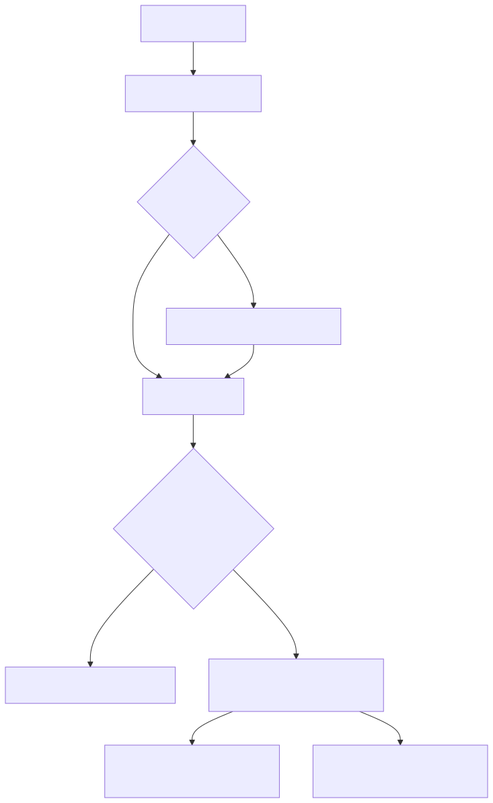

# Manual técnico, executivo, comercial e estratégico: API, endpoints e Swagger

## 1. O que é esta feature

Este documento explica a superfície HTTP real da plataforma. Na prática,
isso cobre três coisas ao mesmo tempo:

- os endpoints de negócio e operação expostos pelo app FastAPI;
- os endpoints de acompanhamento assíncrono usados por polling e SSE;
- a publicação controlada do contrato OpenAPI em /docs, /redoc e
  /openapi.json.

O ponto importante é que a API deste projeto não é apenas uma camada de
transporte. Ela também é o boundary que separa autenticação, autorização,
validação, rate limit, correlação de logs, despacho assíncrono e retorno
de contratos tipados para agentes, workflows, RAG, configuração agentic,
portal do cliente e interfaces administrativas.

## 2. Que problema ela resolve

Sem uma superfície HTTP central e governada, cada capacidade da
plataforma tenderia a expor seu próprio contrato, sua própria política
de segurança e seu próprio jeito de acompanhar execução. Isso geraria um
problema operacional sério: a plataforma pareceria um conjunto de
features isoladas, e não um produto coerente.

Esta API resolve esse problema de quatro formas:

- centraliza publicação e descoberta dos contratos HTTP;
- aplica permissão e rate limit de forma consistente;
- separa chamadas síncronas de execuções longas acompanhadas por status;
- mantém OpenAPI e rotas reais no mesmo app, sem documentação paralela
  desconectada do runtime.

## 3. Visão executiva

Para liderança, esta feature importa porque reduz risco operacional e de
integração. Um cliente, parceiro ou time interno não precisa adivinhar
qual endpoint chamar, como autenticar, como rastrear uma execução longa
ou onde consultar status. Isso aumenta previsibilidade, reduz custo de
suporte e melhora governança.

Em termos práticos, a API também reduz o risco de iniciativas de IA
virarem protótipos difíceis de operar. O app HTTP já nasce com contratos
tipados, permissões nominais e rotas de monitoramento, o que facilita
auditoria e operação.

## 4. Visão comercial

Do ponto de vista comercial, a API é a porta de integração da
plataforma. Ela permite demonstrar que a solução não depende apenas de
interface visual: parceiros podem integrar agentes, workflows,
ingestões, ETL, status assíncrono e assembly agentic por contrato HTTP
estável.

Isso ajuda em três frentes:

- reduz objeção de cliente que precisa integrar com ERP, portal ou
  middleware existente;
- mostra maturidade técnica porque há OpenAPI, segurança e rotas
  rastreáveis;
- permite vender plataforma como capacidade integrável, e não só como
  tela pronta.

## 5. Visão estratégica

A API fortalece a estratégia da plataforma porque serve de camada comum
para módulos diferentes sem forçar cada domínio a reinventar seu próprio
boundary. O mesmo app publica RAG, agentes, workflows, configuração
governada, importação remota de Swagger, histórico operacional, portal do
cliente e UI web.

Isso importa estrategicamente porque a plataforma pode crescer por
domínio sem perder coerência de autenticação, observabilidade e contrato
HTTP.

## 6. Conceitos necessários para entender

### Como acessar o Swagger no runtime real

A superfície HTTP oficial deste projeto expõe três artefatos de contrato:

- `/docs`: UI Swagger interativa.
- `/redoc`: visualização ReDoc.
- `/openapi.json`: schema JSON utilizado por ferramentas, testes e CI.

O acesso a esses caminhos não é público. O fluxo real exige `x-api-key` válido e a permissão nominal `swagger.read`. Em ambiente local, a validação costuma ser feita com um header `x-api-key` e uma chamada direta ao schema JSON ou à interface HTML do Swagger.

Exemplo prático de verificação local. A porta deve vir de `FASTAPI_PORT` no
`.env`; não fixe uma porta diferente no cliente:

```bash
source .env
curl -i -H "x-api-key: <token-valido>" \
  "http://${FASTAPI_HOST}:${FASTAPI_PORT}/openapi.json"
```

Se a resposta for 401, a chave está ausente ou inválida. Se for 403, a chave existe, mas não possui `swagger.read`.

### OpenAPI e Swagger

OpenAPI é o contrato formal da API. Swagger e ReDoc são interfaces de
consulta desse contrato. Neste projeto, eles não são expostos como
conveniência pública; passam por controle de permissão.

### Boundary HTTP

Boundary é a borda entre o mundo externo e o runtime interno. Aqui ele
recebe payload, autentica, valida, escolhe serviços e decide se a
execução responde na mesma chamada ou segue em modo assíncrono.

### Execução síncrona e assíncrona

Chamadas rápidas podem responder no mesmo HTTP. Chamadas longas geram
task_id e URLs de acompanhamento. Isso evita bloquear o processo web com
trabalho pesado.

### Permissão por header, YAML ou sessão

Nem toda rota usa o mesmo modo de autorização. Há famílias que exigem
header, outras aceitam header ou YAML resolvido, e outras atendem fluxo
web autenticado.

### Correlação operacional

Correlation_id é o identificador lógico usado para ligar request,
status, logs e execução em worker. Sem ele, suporte e operação perdem o
fio da investigação.

## 7. Como a feature funciona por dentro

O app central é criado em src/api/service_api.py. Esse arquivo monta o
FastAPI com /docs, /redoc e /openapi.json, registra middlewares e inclui
os routers de domínio.

Depois disso, o runtime aplica uma regra importante: a documentação HTTP
publicada não é automaticamente pública. O middleware de proteção do
Swagger intercepta os caminhos sensíveis e exige a permissão
swagger.read.

Na sequência, cada família de router entra com seu prefixo e seu
contrato próprio. Alguns exemplos confirmados no código:

- /agent para execução, continuidade e cancelamento de agentes;
- /agent/hil/review-context para carregar o contrato pendente de uma
  revisão por token, sem expor o segredo em uma URL GET;
- /agent/hil/decisions para registrar decisão HIL por POST seguro e,
  quando a execução original era background, publicar o segundo job de
  continuação no Job Core;
- /workflow para execução e retomada de workflows;
- /rag para ingestão, ETL, dispatcher unificado, reindex e rebuild de
  auto_config;
- /status e /api/v1/status para polling e SSE de tarefas assíncronas;
- /interaction-runs para consulta paginada da telemetria de interações
  e atualização do campo observacoes;
- /config/assembly para draft, validate, confirm, preflight, schema,
  catalog, recommend-tools e objective-to-yaml;
- /config/nl2sql para geração de SQL proposta a partir de linguagem
  natural;
- /admin/background-executions para consultar agendas do Scheduler,
  resultados factuais, pedidos HIL e comunicações, além de confirmar
  consumo do outbox e cancelar agenda;
- /admin/job-core para consultar o ledger genérico, abrir eventos, pedir
  cancelamento cooperativo e excluir somente jobs terminais do próprio
  escopo autenticado;
- /admin/tenant-yaml para publicar versões imutáveis do YAML de tenant e
  emitir, religar ou revogar chaves ligadas a uma versão;
- /client-portal para perfil, credenciais, segredos e importação remota
  de Swagger/OpenAPI;
- /api/auth para login federado, sessão web e reset local de senha com
  envio transacional interno via provider oficial configurado, hoje
  Brevo ou Resend;
- /channels para cadastro, remoção, mensagens, governança de remetentes e
  controle/status do runtime local de workers de canal;
- /api/whatsapp/provision para onboarding e teste assinado do callback;
- /admin, /api/instagram, /api/dnit e outras famílias de apoio operacional.

## 8. Divisão em submódulos lógicos

### 8.1 App HTTP central

É o ponto onde a plataforma publica o contrato OpenAPI e agrega todos os
routers. O valor aqui não é conter regra de negócio, e sim garantir uma
superfície única para segurança, middlewares e publicação da API.

### 8.2 Boundaries de execução

São os routers de agente, workflow e RAG. Eles resolvem autenticação,
normalizam correlation_id, escolhem modo de execução e devolvem resposta
final ou envelope assíncrono.

### 8.3 Boundaries de configuração governada

São os routers de assembly agentic, contrato legado e NL2SQL. O objetivo
é publicar capacidades de configuração de forma validada, sem tratar
texto gerado como contrato executável por si só.

### 8.4 Boundaries de acompanhamento

São as rotas de status e stream. Elas existem para separar aceitação da
requisição de observação de progresso, principalmente quando o trabalho
continua fora do processo HTTP.

### 8.5 Boundaries administrativos e de portal

São as rotas voltadas a operação, portal do cliente, integrações e
administração. Elas não são detalhe cosmético; representam governança,
segregação de acesso e operação multi-tenant.

## 9. Pipeline ou fluxo principal

O fluxo macro da API pode ser entendido assim:

1. O request entra no app FastAPI central.
2. Middlewares resolvem contexto básico, como sessão e políticas
   transversais.
3. O boundary correto recebe o payload e valida permissão.
4. O router resolve configuração, credencial e correlation_id.
5. O router decide se responde de forma síncrona ou se agenda a tarefa.
6. Quando a execução é longa, o cliente acompanha por /status ou
   /stream.
7. O mesmo correlation_id conecta resposta, progresso e logs.

## 10. Decisões técnicas e trade-offs

### Publicar OpenAPI dentro do app, mas proteger acesso

Ganho: contrato oficial e runtime ficam no mesmo lugar.

Custo: a proteção precisa ser tratada no próprio boundary HTTP.

Impacto prático: evita Swagger público por acidente e reduz exposição de
superfície sensível.

### Reaproveitar um app único para vários domínios

Ganho: coerência operacional, um padrão único de segurança e descoberta.

Custo: o app central precisa ser disciplinado para não virar god module.

Impacto prático: parceiros e times internos integram com uma plataforma,
não com um mosaico de microsserviços sem padrão.

### Responder 202 em operações pesadas de RAG

Ganho: o processo web não vira worker improvisado.

Custo: cliente precisa saber acompanhar task_id.

Impacto prático: ingestão e ETL escalam melhor e ficam mais observáveis.

### Permitir envelope assíncrono no próprio /agent/execute e /workflow/execute

Ganho: contrato mais simples para o cliente, que não precisa aprender um
segundo endpoint só para iniciar trabalho longo.

Custo: o consumidor do endpoint precisa estar preparado para dois tipos
de resposta legítima.

Impacto prático: a API fica mais flexível, mas exige documentação clara
para não confundir resultado final com aceitação de execução.

## 11. Configurações que mudam o comportamento

As configurações mais relevantes confirmadas no código lido são estas:

- FEATURE_AGENTIC_AST_ENABLED: controla se o grupo /config/assembly pode
  ser usado. Quando está desligado, o boundary responde com bloqueio
  explícito.
- execution_mode nos endpoints de agente e workflow: força ou sugere se
  a execução será síncrona ou assíncrona.
- Permissões nominais em PermissionKeys: definem quais grupos podem ser
  acessados por cada credencial.
- Rate limits por router: limitam consumo excessivo e reduzem risco de
  abuso.

Valor padrão de todas as flags e limites não foi consolidado em um único
manifesto HTTP no código lido.

## 12. Contratos, entradas e saídas

Os contratos mais importantes confirmados no código são:

- POST /agent/execute: pode devolver resultado final, pausa HIL ou
  envelope assíncrono com task_id, polling_url, stream_url e cancel_url.
- POST /agent/continue: continua execução pausada usando thread_id e
  correlation_id existente.
- POST /agent/hil/review-context: recebe `approval_token` e, opcionalmente,
  `approval_request_id`; devolve somente o contexto pendente necessário
  para a UI de revisão.
- POST /agent/hil/decisions: aceita `approve`, `edit`, `reject` ou
  `respond`. Devolve `200 resolved` com `continuation` quando a retomada é
  síncrona; para execução background, devolve
  `202 continuation_submission_confirmed` com os identificadores do
  segundo job.
- POST /agent/tasks/{task_id}/cancel: registra cancelamento de tarefa de
  agente ainda não terminal.
- POST /workflow/execute: executa workflow e pode responder de forma
  síncrona ou publicar `direct_async` no Job Core.
- POST /workflow/continue: retoma workflow pausado por HIL.
- POST /rag/ingest: aceita ingestão em 202 e delega execução ao runtime
  assíncrono.
- POST /rag/etl: aceita ETL em 202 e delega ao worker.
- POST /rag/execute: dispatcher unificado que pode devolver 200 ou 202
  conforme a operação. O campo `operation` aceita: `ingest`, `ask`,
  `delete`, `etl` e `data_sources`. O payload muda conforme a operação;
  o YAML cifrado vai sempre em `payload.encrypted_data`.
  - operation `data_sources` (200): lista os data sources ingeridos no
    vector store do YAML. Mesma segurança do `ask` (`RAG_ASK`) — quem pode
    consultar o RAG pode chamar esta. Reflete o acervo VIVO/registrado
    (tabela `vector_active_documents`, status `active`), não uma varredura
    do store físico. A resposta traz `sources` (fontes distintas
    `source_system` + `source_uri` com `document_count` por fonte) e
    `documents` (página de documentos anotados com a origem); `page`,
    `page_size` e `name_filter` paginam/filtram apenas a parte `documents`.
    Devolve o `correlation_id` no corpo e no header `X-Correlation-Id`.
- POST /admin/vector-store/documents (200): lista, paginada e filtrável
  por nome, os documentos ingeridos (acervo VIVO) de um vector store. É a
  superfície administrativa equivalente ao `data_sources` acima, mas sob a
  permissão `admin.vector.preview` (ADMIN_VECTOR_PREVIEW) em vez de
  `RAG_ASK`, e devolve só a lista de documentos (não as `sources`). O alvo
  é resolvido pelo YAML: o serviço usa `vector_store.id` do YAML informado
  (em `yaml_path` ou `yaml_content`) e o tenant resolvido do mesmo YAML;
  `vectorstore_id` no corpo só é necessário para sobrescrever o id do YAML.
  Reflete a tabela `vector_active_documents` com status `active` (consulta
  server-side: filtro por nome e paginação rodam no banco, pensados para
  acervos grandes), nunca uma varredura do store físico. A resposta traz
  `total`, `total_pages`, `page`, `page_size`, `tenant_code`,
  `vectorstore_id`, `name_filter` aplicado e `items` (cada item com
  `active_document_id`, `document_name`, `document_path`,
  `ingestion_status`, `updated_at` e, quando disponíveis, `total_pages` e
  `file_size_bytes`). Devolve o `correlation_id` no corpo e no header
  `X-Correlation-Id`. Exemplo completo em §20 (Exemplo 4).
- POST /api/auth/local/password-reset/request: aceita o e-mail da conta,
  responde 202 para evitar enumeração de usuários e delega o envio do
  link para a camada transacional interna baseada no provider oficial
  configurado, hoje Brevo ou Resend.
- POST /api/auth/local/password-reset/confirm: recebe token assinado e
  nova senha para concluir a redefinição local.
- GET /status/{task_id} e GET /api/v1/status/{task_id}: polling de
  progresso.
- GET /status/stream/{task_id} e GET /api/v1/status/stream/{task_id}:
  stream SSE.
- POST /interaction-runs/query: consulta paginada da tabela
  interaction_runs com filtros, ordenação e insights agregados.
- POST /interaction-runs/observacoes: atualiza o campo observacoes de
  uma interação já persistida.
- POST /config/assembly/draft, /config/assembly/validate,
  /config/assembly/confirm, /config/assembly/objective-to-yaml,
  /config/assembly/preflight: montagem governada da AST agentic.
- GET /ui/static/...: mount oficial dos assets estáticos servidos pela mesma API.
- app/ui/static/js/admin-assembly-ast.js: UI administrativa que consome os endpoints de assembly AST.
- POST /config/nl2sql/generate: gera SQL proposta com diagnósticos.
- GET /admin/background-executions/schedules,
  /runs/recent,
  /hil,
  /communications/summary,
  /communications,
  /runs/last e
  /runs/{run_id}: superfície administrativa atual. Não existem rotas
  `/requests`, `/runs/active` ou `/events` nesse router; lifecycle e
  eventos pertencem ao Job Core.
- DELETE /admin/background-executions/schedules/{schedule_id}: cancela
  uma agenda background preservando histórico e runs já gravados.
- POST /admin/background-executions/communications/{communication_id}/ack:
  confirma consumo idempotente de um item de comunicação assíncrona do
  webchat para o tenant autenticado.
- POST /admin/job-core/runs/query: lista o ledger paginado e filtrável no
  escopo `environment + tenant + usuário` resolvido pela `X-API-Key`. Exige
  `admin.job_core.read`.
- POST /admin/job-core/runs/detail: abre um job por `job_id` ou
  `target_correlation_id` e devolve seus eventos cronológicos no mesmo
  escopo. Ausência dos dois identificadores recebe 400; job fora do escopo
  ou inexistente recebe 404.
- POST /admin/job-core/runs/cancel: solicita cancelamento cooperativo de um
  job ativo. Exige `admin.job_core.write`; devolve 404 quando o job não é
  localizado e 409 quando o estado atual não aceita a solicitação.
- DELETE /admin/job-core/runs/{job_id}: exclui um job individual somente
  quando terminal; job ativo recebe 409. DELETE /admin/job-core/runs remove
  os jobs terminais do mesmo escopo sem transformar o histórico ativo em
  alvo de limpeza.
- POST /channels/register: cadastra ou atualiza uma definição no registry
  resolvido pelo YAML e exige `channels.register`.
- POST /channels/list: lista as definições do mesmo registry e exige
  `channels.list`.
- GET /admin/channels: lista o catálogo administrativo com
  `admin.channels.view`; o filtro opcional de `environment` existe somente
  para leitura autorizada.
- PUT /admin/channels/{channel_id}: atualiza `description`,
  `default_user_email`, `metadata` e `yaml_path` com
  `admin.channels.manage`.
- DELETE /channels/{channel_id}: remove o canal do registry usando o mesmo
  corpo de resolução YAML de `/channels/list`; exige `channels.delete`.
- POST /channels/{channel_id}/worker/start e
  POST /channels/{channel_id}/worker/stop: iniciam ou sinalizam parada do
  worker daquele canal e devolvem `WorkerStatusResponse`; exigem
  `channels.worker.control`. Esse controle pertence ao manager local em
  memória e não é uma projeção durável do Job Core.
- GET /channels/worker/status: lista snapshots dos workers locais e suas
  filas; exige `channels.worker.status` e não substitui consulta ao ledger
  de jobs.
- POST /api/whatsapp/provision/test-callback: recebe `client_code` e
  `channel_id` obrigatórios, com remetente/mensagem/overrides opcionais,
  resolve a configuração do canal e executa um callback de teste assinado
  com o segredo vigente. Exige `provision.whatsapp` e devolve assinatura,
  corpo assinado, payload e resultado/delivery quando disponíveis.
- GET e POST /admin/tenant-yaml/{tenant_id}/versions: listam e publicam
  versões imutáveis de `tenant_yaml` no ambiente corrente.
- GET e POST /admin/tenant-yaml/{tenant_id}/keys: listam metadados ou
  emitem uma chave ligada a uma versão; o segredo da nova chave só é
  devolvido na emissão.
- PATCH /admin/tenant-yaml/{tenant_id}/keys/{access_key_id}/binding e
  POST /admin/tenant-yaml/{tenant_id}/keys/{access_key_id}/revoke:
  religam uma chave ativa ou a revogam sem editar a versão publicada.
- PATCH /admin/tenant-yaml/{tenant_id}/keys/{access_key_id}/permissions:
  substitui as permissões de uma chave **ativa** pelo estado completo
  informado. É o único caminho de produto para conceder ou tirar um
  privilégio de chave já emitida — antes dele, só havia `UPDATE` manual em
  produção seguido de restart. Permissão exigida:
  `admin.tenant_yaml.write`.
  - Corpo: `{"permissions": {"<chave do catálogo>": true|false, ...}}`. É
    **estado completo, não remendo parcial**: o que não vier marcado como
    concedido é removido. Reenviar o mesmo corpo produz o mesmo estado
    final (idempotente).
  - Chave que não existe no catálogo central é recusada com **422** antes
    de qualquer escrita, e conjunto vazio também é **422** — chave sem
    nenhuma permissão é revogação disfarçada, e revogação tem rota própria.
  - **O que já está gravado fora do catálogo é preservado**, não apagado:
    tanto concessões por prefixo (`rag`, `agent`) quanto chaves órfãs
    (família `mcp.*` existente em produção). Elas voltam na resposta em
    `preserved_unknown`. A tela que consome esta rota não as envia no corpo.
  - `permissions_json` e `scope` são as duas representações da mesma
    verdade e são escritos na **mesma sentença** `UPDATE`, derivados do
    mesmo conjunto ordenado — nunca divergem.
  - Chave inexistente ou de outro tenant → **404**; chave revogada →
    **409** (existe, mas não serve). Nos dois casos nada é escrito.
  - Resposta: estado final em `permissions` e `scope`, o diff aplicado em
    `added` / `removed`, `preserved_unknown`, `correlation_id` e
    `propagation_seconds` (**30**). Esse número é honesto e vem do TTL do
    cache canônico de credenciais: a mudança passa a valer em todos os
    processos e containers em até 30 segundos, **sem reiniciar nada** — não
    é efeito instantâneo.
  - A mutação registra log canônico
    `admin_tenant_yaml.key.permissions_updated` com o `correlation_id`, o
    tenant, o `access_key_id` e as listas de permissões adicionadas e
    removidas. Chave de permissão não é segredo e entra por extenso; o
    segredo da API key nunca aparece.
- A leitura GET /admin/tenant-yaml/{tenant_id}/keys passou a devolver, por
  chave, dois campos derivados que a UI consome sem recalcular nada:
  `effective_permissions` (uma entrada por permissão de máquina do
  catálogo, com `granted` e `granted_by` = `direta`, `prefixo:<chave>`,
  `coringa` ou `admin`) e `unknown_permissions` (o que está gravado e o
  catálogo não descreve). Quem decide "esta permissão está concedida?" é o
  predicado canônico único `is_permission_granted`
  (`src/api/security/permissions.py`), o mesmo usado pela autorização HTTP.
- GET /chat/conversations (200): lista, mais recentes primeiro e paginadas,
  as conversas NÃO deletadas do dono do chat embutível. Escopo obrigatório
  por `tenant_code` + `user_email` (nunca vaza conversa de outro dono).
  Autenticação por header `X-API-Key` (primária) ou YAML via
  `?yaml_config=<path>` same-origin, sob a permissão `RAG_ASK`
  (HEADER_OR_YAML). Query params: `user_email` (obrigatório), `limit`
  (1..200, default 50), `offset` (>=0), `config_ref`, `mode` e `scope_ref`
  (filtros opcionais). `scope_ref` seleciona o bucket de isolamento: ausente
  lista o bucket geral (conversas sem projeto, `scope_ref IS NULL`); informado
  lista só aquele escopo (ex.: `scope_ref=<projeto>`), de forma que conversas
  gerais e de projeto não se misturam. A resposta traz `correlation_id` e
  `items` (cada item com `conversation_id`, `tenant_code`, `user_email`,
  `config_ref`, `scope_ref`, `mode`, `thread_id`, `title`, `status`,
  `message_count`, `created_at`, `updated_at`, `last_message_at`). Devolve o
  `correlation_id` no corpo e no header `X-Correlation-Id`.
- GET /chat/conversations/{conversation_id} (200): abre uma conversa do
  dono com suas mensagens, ordenadas por `seq`. Mesmo escopo e mesma
  autenticação do endpoint de lista. Query params: `user_email`
  (obrigatório), `message_limit` (1..500, default 200) e `message_offset`
  (>=0). A resposta traz `correlation_id`, `conversation` (o mesmo cabeçalho
  da lista) e `messages` (cada uma com `message_id`, `seq`, `role`,
  `content`, `correlation_id`, `created_at`). Responde 404 quando a conversa
  não existe ou é de outro dono. Devolve o `correlation_id` no corpo e no
  header `X-Correlation-Id`, inclusive no 404 (na mensagem entre parênteses).
- PATCH /chat/conversations/{conversation_id} (200): renomeia a conversa do
  dono. Corpo JSON com `user_email` (obrigatório), `title` (obrigatório) e
  `encrypted_data` (opcional, YAML cifrado para autenticação HEADER_OR_YAML
  quando não vier `X-API-Key`). O título é normalizado (trim e truncado em
  80 caracteres). A resposta traz `correlation_id` e `conversation`
  atualizada. Responde 404 quando inexistente ou de outro dono. Devolve o
  `correlation_id` no corpo e no header `X-Correlation-Id`.
- DELETE /chat/conversations/{conversation_id} (200): soft-delete
  (marca `status=deleted`) da conversa do dono; idempotente. Query param
  `user_email` (obrigatório); autenticação por X-API-Key/YAML (HEADER_OR_YAML).
  Sem corpo: o cliente HTTP oficial não define `Content-Type: application/json`
  em DELETE, então o escopo viaja na query, não no corpo.
  A resposta traz `correlation_id` e `deleted` (bool): `true` quando algo
  foi afetado, `false` no no-op idempotente (conversa inexistente, já
  deletada ou de outro dono) — não é 404. Devolve o `correlation_id` no
  corpo e no header `X-Correlation-Id`.

Observações do domínio de conversas do chat: não existe `POST
/chat/conversations`. A criação é *lazy*: a conversa nasce no primeiro turno
persistido (o front gera o `conversation_id` estável e o backend faz upsert
pela chave natural na primeira gravação de turno). "Nova conversa" é um gesto
local do cliente; a linha aparece no banco quando o primeiro turno é
persistido pelo caminho síncrono de execução (`/agent/execute`,
`/workflow/execute`, `/rag/execute`).

### 12.1. Reset local de senha com provider transacional interno

O boundary HTTP do reset local continua em `/api/auth`, mas o provider
de envio nao fica no router. O fluxo oficial funciona assim:

1. o endpoint resolve o `correlation_id` oficial e monta a resposta HTTP;
2. o auth_router delega o pedido funcional ao
   `TransactionalEmailApplicationService`;
3. o service interno resolve o provider configurado e delega a chamada
  HTTP ao client concreto, hoje `BrevoTransactionalEmailClient` ou
  `ResendTransactionalEmailClient`.

Configuracao operacional de selecao do provider:

- `WEB_FEDERATED_AUTH__TRANSACTIONAL_EMAIL_PROVIDER`

Quando o valor for `brevo`, o service interno usa a API transacional da
Brevo. Quando o valor for `resend`, o service interno usa a API
transacional da Resend. Qualquer valor fora desse contrato falha
fechado, sem fallback implicito.

Configuracoes operacionais canônicas deste fluxo para Brevo:

- `WEB_FEDERATED_AUTH__BREVO_API_KEY`
- `WEB_FEDERATED_AUTH__BREVO_BASE_URL`
- `WEB_FEDERATED_AUTH__BREVO_SENDER_EMAIL`
- `WEB_FEDERATED_AUTH__BREVO_SENDER_NAME`
- `WEB_FEDERATED_AUTH__BREVO_TIMEOUT_SECONDS`

Configuracoes operacionais canônicas deste fluxo para Resend:

- `WEB_FEDERATED_AUTH__RESEND_API_KEY`
- `WEB_FEDERATED_AUTH__RESEND_BASE_URL`
- `WEB_FEDERATED_AUTH__RESEND_SENDER_EMAIL`
- `WEB_FEDERATED_AUTH__RESEND_SENDER_NAME`
- `WEB_FEDERATED_AUTH__RESEND_TIMEOUT_SECONDS`

Regra operacional importante: nao existe fallback implicito para SMTP no
caminho novo. Se a configuracao obrigatoria do provider selecionado
estiver ausente, o boundary responde falha explicita de configuracao.

Exemplo de request para solicitar o link:

```json
{
  "email": "usuario@example.com"
}
```

Exemplo de response de sucesso do request:

```json
{
  "status": "accepted",
  "message": "Se a conta existir, enviaremos um link de redefinição para o e-mail informado.",
  "correlation_id": "8a3b7f5a-4b9a-4e86-b0b0-1c2d3e4f5a6b"
}
```

Exemplo de request para confirmar a nova senha:

```json
{
  "token": "token-assinado-recebido-no-link",
  "password": "nova-senha-segura",
  "password_confirmation": "nova-senha-segura"
}
```

Exemplo de response de sucesso da confirmação:

```json
{
  "status": "password_reset",
  "message": "Senha redefinida com sucesso. Faça login com a nova senha.",
  "correlation_id": "9b4c8f6b-5c0b-4f97-a1c1-2d3e4f5a6b7c"
}
```

Exemplo de erro funcional comum na confirmação:

```json
{
  "detail": "A confirmação da nova senha deve ser idêntica à senha informada."
}
```

### 12.1. Exemplo completo de revisão e decisão HIL por token

O cliente não coloca o token na query string. Ele abre a tela segura e envia
o segredo no corpo de um `POST`:

```http
POST /agent/hil/review-context
Content-Type: application/json

{
  "approval_token": "<token-recebido-pelo-aprovador>",
  "approval_request_id": "hil_01J..."
}
```

A resposta `200` contém `thread_id`, `mode`, `hil.action_requests`,
`hil.review_configs` e `hil.allowed_decisions`. A interface deve renderizar
somente as decisões publicadas nessa lista. Para aprovar:

```http
POST /agent/hil/decisions
Content-Type: application/json

{
  "approval_token": "<token-recebido-pelo-aprovador>",
  "approval_request_id": "hil_01J...",
  "decision_type": "approve",
  "approver_email": "aprovador@empresa.com",
  "decided_channel": "webchat"
}
```

Uma execução originalmente síncrona continua na mesma chamada e responde
`200`:

```json
{
  "status": "resolved",
  "approval_request_id": "hil_01J...",
  "decision_type": "approve",
  "correlation_id": "20260728_101500-...",
  "thread_id": "thread_01J...",
  "continuation": {
    "resume": {"decisions": [{"type": "approve"}]},
    "response": "Execução retomada e concluída.",
    "steps": [],
    "tools_used": [],
    "metrics": {},
    "processing_time_ms": 812.4,
    "correlation_id": "20260728_101500-...",
    "thread_id": "thread_01J...",
    "success": true,
    "error": null,
    "hil": null
  },
  "continuation_job_id": null,
  "continuation_correlation_id": null,
  "previous_execution_correlation_id": null
}
```

Quando a pausa nasceu em background, a decisão só confirma a publicação do
segundo job e responde `202`:

```json
{
  "status": "continuation_submission_confirmed",
  "approval_request_id": "hil_01J...",
  "decision_type": "approve",
  "correlation_id": "20260728_101500-...",
  "thread_id": "thread_01J...",
  "continuation": null,
  "continuation_job_id": "job_01J...",
  "continuation_correlation_id": "20260728_102030-...",
  "previous_execution_correlation_id": "20260728_101500-..."
}
```

O consumidor acompanha `continuation_job_id` pelas superfícies do Job Core.
Não trate `202` como resposta final e não reutilize
`previous_execution_correlation_id` como correlação do segundo job.

## 13. O que acontece em caso de sucesso

No caminho feliz, o boundary autentica o request, aplica a permissão do
endpoint, normaliza correlation_id e devolve uma destas respostas:

- resultado completo no próprio HTTP, quando o trabalho cabe em execução
  direta;
- aceitação assíncrona com task_id e URLs de acompanhamento, quando o
  trabalho continua fora do request;
- resposta tipada de configuração, quando o fluxo é AST ou NL2SQL.

Para operação, sucesso não é apenas status HTTP 200 ou 202. Também é a
capacidade de seguir o mesmo correlation_id até a execução real.

## 14. O que acontece em caso de erro

Os cenários mais importantes confirmados no código e nos testes lidos
são estes:

- 401 quando a rota protegida recebe chamada sem credencial válida;
- 403 quando a credencial existe, mas não possui a permissão exigida;
- 404 quando uma task consultada em /status não existe ou quando uma
  feature governada está desligada;
- 409 quando se tenta cancelar tarefa já terminal;
- 422 quando a validação Pydantic rejeita o payload;
- 400 quando o payload ou a configuração resolvida são inválidos para o
  caso de uso;
- 500 quando o boundary captura falha interna inesperada.

## 15. Observabilidade e diagnóstico

Para diagnosticar problema real nesta feature, a ordem prática é:

1. Confirmar qual família de rota foi chamada.
2. Confirmar qual permissão nominal protege esse endpoint.
3. Verificar se o endpoint responde de forma síncrona ou assíncrona.
4. Se houver task_id, consultar /status antes de culpar a API web.
5. Cruzar correlation_id do HTTP com o log e com o status.

Sinais concretos confirmados no código:

- o Swagger protegido é testado em suíte unitária;
- os endpoints de status usam contratos tipados para progresso;
- os boundaries de agente e workflow devolvem polling_url e stream_url
  quando executam em modo assíncrono.
- a decisão HIL assíncrona entra por endpoint POST seguro dedicado,
  sem depender de continuação HTTP interna entre serviços.
- os endpoints de interaction_runs calculam insights agregados e
  restringem o escopo ao tenant autenticado.
- os endpoints administrativos de background expõem filtros por
  access_key, status, run_id e correlation_id para operação auditável.

## 16. Impacto técnico

Tecnicamente, esta feature reduz acoplamento entre cliente e runtime
interno. O consumidor da API fala com contratos HTTP previsíveis, e a
plataforma mantém liberdade para evoluir os serviços internos.

Também reforça três padrões arquiteturais relevantes:

- boundary HTTP fino com regra de acesso explícita;
- separação entre aceitação de request e execução longa;
- observabilidade por correlation_id e task_id.

## 17. Impacto executivo

Executivamente, a API reduz custo de integração, de suporte e de
investigação. Ela também melhora governança porque o acesso ao contrato
OpenAPI e às rotas de operação passa por permissão nominal, não por
acesso implícito.

## 18. Impacto comercial

Comercialmente, a plataforma pode ser apresentada como sistema
integrável, não apenas como interface pronta. Isso é importante para
clientes que precisam conectar ERP, portais, automações e canais
externos sem depender de trabalho manual em cada implantação.

## 19. Impacto estratégico

Estrategicamente, a API é o eixo que permite plugar novos domínios na
plataforma sem criar novos padrões de acesso do zero. Ela suporta a
visão YAML-first, a montagem governada de agentes e a operação
assíncrona observável no mesmo boundary.

## 20. Exemplos práticos guiados

### Exemplo 1. Agente com envelope assíncrono

O cliente chama /agent/execute para uma tarefa longa. Em vez do texto
final, recebe task_id, polling_url, stream_url e cancel_url. Isso
significa que o boundary aceitou a execução, mas o resultado final deve
ser acompanhado pelo domínio de status.

### Exemplo 2. Ingestão em 202

O cliente chama /rag/ingest e recebe 202. O sentido operacional desse
status é: o processo web validou e aceitou a requisição, mas o trabalho
pesado foi delegado ao runtime assíncrono.

### Exemplo 3. Swagger protegido

Um operador tenta abrir o HTML do portal Swagger sem credencial. O teste
unitário confirma que o app devolve 401. Quando a credencial existe mas
não carrega swagger.read, a resposta correta é 403.

### Exemplo 4. Listar documentos ingeridos de um vector store

Um operador quer ver, página a página, quais documentos estão no acervo
vivo de um vector store. Ele chama `POST /admin/vector-store/documents`
informando o YAML que descreve o vector store (aqui o YAML de produção do
DNIT) e a credencial administrativa pelo header `X-API-Key`. O alvo é
resolvido pelo próprio YAML: `vector_store.id` (`dnit_producao`) e o
tenant (`engenharia_dnit`) saem do YAML, então não é preciso mandar
`vectorstore_id` no corpo.

Pedido (sem filtro de nome, primeira página de 5):

```bash
source .env
curl -X POST "http://${FASTAPI_HOST}:${FASTAPI_PORT}/admin/vector-store/documents" \
  -H "Content-Type: application/json" \
  -H "X-API-Key: <access_key_administrativa>" \
  -d '{
    "yaml_path": "app/yaml/rag-config-mrctito-dnit-ingest-producao-200.yaml",
    "user_email": "operador@empresa.com",
    "page": 1,
    "page_size": 5
  }'
```

Resposta `200 OK` (header `X-Correlation-Id` igual ao `correlation_id` do
corpo; lista truncada para 2 itens por brevidade):

```json
{
  "status": "success",
  "message": "394 documento(s) no acervo; exibindo a página 1 de 79.",
  "correlation_id": "20260624_113152-235a824a-d094-41c2-84e8-d8d2b0bd137d",
  "tenant_code": "engenharia_dnit",
  "vectorstore_id": "dnit_producao",
  "name_filter": null,
  "page": 1,
  "page_size": 5,
  "total": 394,
  "total_pages": 79,
  "items": [
    {
      "active_document_id": "8bac53c9-a562-420e-9f7d-ebeb97caebe4",
      "document_name": "656_manual_de_tecnicas_de_conclaves.pdf",
      "document_path": "/.../1G6NwAN0wxUdYC9I8y0IfndiVGSyT_MFx",
      "total_pages": null,
      "file_size_bytes": null,
      "ingestion_status": "active",
      "updated_at": "2026-06-23T06:00:02.379555+00:00"
    },
    {
      "active_document_id": "756adc7a-d57a-46d9-9cc2-766751021ccf",
      "document_name": "698-manual-de-projeto-de-obras-de-arte-especiais-1.pdf",
      "document_path": "/.../1iJeNoXc-udd7m2WoMQEnMXW7iFt5RtrJ",
      "total_pages": null,
      "file_size_bytes": null,
      "ingestion_status": "active",
      "updated_at": "2026-06-23T05:50:13.720080+00:00"
    }
  ],
  "timestamp": "2026-06-24T14:33:05.763445Z"
}
```

Para procurar por nome, basta acrescentar `name_filter` (case-insensitive,
casa parte do nome). Com `"name_filter": "pontes"` no mesmo pedido, o
`total` cai de 394 para 14 e a resposta passa a refletir só os documentos
cujo nome contém "pontes" (ex.: `709_manual_de_inspecao_de_pontes_rodoviarias.pdf`,
`DNIT 010_2024 – PRO - Inspeções em pontes e viadutos...pdf`). O filtro e a
paginação rodam no banco (`vector_active_documents`, status `active`), não
no navegador — por isso o endpoint aguenta acervos grandes sem trazer tudo
de uma vez.

## 21. Explicação 101

Em linguagem simples, esta API é a recepção organizada da plataforma.
Ela não só recebe pedidos; ela também confere se a pessoa pode entrar,
descobre para qual setor o pedido deve ir, e avisa como acompanhar o
processo quando ele não termina na hora.

Swagger é o quadro de instruções da recepção. Só que aqui esse quadro
não fica aberto para qualquer pessoa por padrão.

## 22. Limites e pegadinhas

- HTTP 200 em /agent/execute não significa sempre resposta final; pode
  ser envelope assíncrono ou pausa HIL.
- /agent/hil/decisions não substitui /agent/continue para todos os
  cenários; ele cobre a decisão HIL assíncrona durável, não a retomada
  genérica de qualquer pausa.
- O cliente não inventa `correlation_id`: ele captura
  `X-Correlation-Id`/campo de resposta no primeiro request e o reapresenta
  apenas nas operações de continuação que exigem a identidade anterior.
- HTTP 202 em RAG não significa falha; significa aceitação para execução
  fora do request.
- API web viva não prova que o domínio assíncrono terminou o trabalho.
- /interaction-runs depende de tenant autenticado coerente entre YAML e
  access key; sem isso o boundary falha fechado.
- /admin/background-executions é superfície administrativa; sem a
  permissão nominal correta, a leitura e o cancelamento falham.
- OpenAPI publicado não substitui leitura de permissão e comportamento
  por família de rota.
- O código lido não expõe um manifesto único listando, em um só lugar,
  todas as rotas ativas, permissões e flags do ambiente.

## 23. Troubleshooting

### Sintoma: /docs abre para alguns usuários e falha para outros

Causa provável: diferença de permissão swagger.read.

Como confirmar: revisar a credencial usada e o teste de proteção do
Swagger.

### Sintoma: o cliente recebeu task_id, mas não vê resultado final

Causa provável: a execução continua fora do request.

Como confirmar: consultar /status/{task_id} ou /api/v1/status/{task_id}
antes de investigar o worker.

### Sintoma: /rag/ingest retorna 202, mas o usuário espera conteúdo no mesmo HTTP

Causa provável: interpretação errada do contrato assíncrono.

Como confirmar: verificar que /rag/ingest e /rag/etl são publicados com
status 202 no subrouter RAG.

### Sintoma: o pedido HIL foi aprovado, mas a automação externa não sabe qual endpoint chamar

Causa provável: uso incorreto de /agent/continue em vez do endpoint
dedicado de decisão assíncrona.

Como confirmar: revisar o contrato de POST /agent/hil/decisions e o
payload esperado para approve ou reject.

### Sintoma: a consulta de interaction_runs devolve 403 mesmo com chave válida

Causa provável: a chave autenticada não resolve um tenant coerente com o
YAML informado ou não possui a permissão nominal exigida.

Como confirmar: revisar o tenant resolvido, a permission
logs.analyze_ui e o contexto de autenticação do request.

### Sintoma: /admin/background-executions retorna vazio para um tenant que claramente tem histórico

Causa provável: access_key consultada não pertence ao tenant correto,
ou o filtro de status/run_id/correlation_id está estreitando demais.

Como confirmar: repetir a consulta com a `access_key` correta e reduzir
os filtros de agenda, run ou HIL. Para lifecycle e eventos do job, consultar
o Job Core; essas projeções não pertencem ao router de background agentic.

## 24. Diagramas

### Fluxo macro da superfície HTTP

Este diagrama mostra a sequência real do boundary: entrada, controle de
acesso, roteamento e eventual acompanhamento assíncrono.



## 25. Mapa de navegação conceitual

O mapa conceitual da API é este:

- app central publica contrato e agrega routers;
- boundaries de domínio executam agentes, workflows e RAG;
- boundaries governados publicam AST agentic e NL2SQL;
- boundaries de observabilidade acompanham tarefas longas;
- boundaries administrativos e de portal cobrem operação multi-tenant.

## 26. Como colocar para funcionar

O caminho de execução completo deste documento depende da API local em
execução. O código lido confirma os caminhos HTTP e a proteção de
Swagger, mas não consolida neste arquivo os comandos operacionais únicos
para subir toda a stack.

O que fica confirmado:

- a API publica /docs, /redoc e /openapi.json;
- as rotas protegidas exigem permissão nominal;
- operações longas devem ser validadas junto com /status.

## 27. Checklist de entendimento

- Entendi que a API é o boundary central da plataforma.
- Entendi que OpenAPI e Swagger são publicados no mesmo app.
- Entendi que Swagger é protegido por permissão.
- Entendi que /agent e /workflow podem responder de forma híbrida.
- Entendi que /rag/ingest e /rag/etl aceitam trabalho assíncrono.
- Entendi que /status e /stream acompanham o processamento posterior.
- Entendi que `/admin/job-core` é a superfície genérica do ledger e que
  cancelamento é cooperativo.
- Entendi que o status de worker em `/channels` é um snapshot do runtime
  local, não o histórico durável do Job Core.
- Entendi que correlation_id e task_id são partes do contrato
  operacional.
- Entendi que nem toda rota usa o mesmo modo de autenticação.

## 28. Evidências no código

- src/api/service_api.py
  - Motivo da leitura: montagem do app FastAPI, publicação do OpenAPI e
    inclusão de routers.
  - Comportamento confirmado: /docs, /redoc e /openapi.json existem e
    há middleware específico para proteção do Swagger.
- src/api/security/permissions.py
  - Motivo da leitura: catálogo de permissões nominais.
  - Comportamento confirmado: swagger.read existe como permissão própria.
- src/api/routers/agent_router.py
  - Motivo da leitura: contrato híbrido de /agent/execute,
    /agent/continue, /agent/hil/decisions e cancelamento.
  - Comportamento confirmado: /agent/execute pode devolver envelope
    assíncrono com task_id, polling_url, stream_url e cancel_url;
    /agent/hil/review-context consulta a pendência por POST; e
    /agent/hil/decisions aceita approve/edit/reject/respond, respondendo
    200 para continuação inline ou 202 para submissão do segundo job.
- src/api/routers/workflow_router.py
  - Motivo da leitura: contrato de execução e retomada de workflows.
  - Comportamento confirmado: /workflow/execute decide entre sync e
    async e publica URLs de acompanhamento.
- src/api/routers/chat_conversations_router.py
  - Motivo da leitura: contrato CRUD das conversas persistidas do chat
    embutível.
  - Comportamento confirmado: GET /chat/conversations e
    GET/PATCH/DELETE /chat/conversations/{conversation_id} escopam por
    tenant + user_email, devolvem `X-Correlation-Id`, respondem 404 em
    leitura/rename de conversa inexistente e soft-delete idempotente com
    `deleted` bool. Não há POST: a criação é lazy no primeiro turno.
- src/api/routers/rag_ingestion_router.py
  - Motivo da leitura: status HTTP de ingestão.
  - Comportamento confirmado: /rag/ingest responde com 202 Accepted.
- src/api/routers/rag_etl_router.py
  - Motivo da leitura: status HTTP de ETL.
  - Comportamento confirmado: /rag/etl responde com 202 Accepted.
- src/api/routers/rag_operations_router.py
  - Motivo da leitura: dispatcher unificado do domínio RAG.
  - Comportamento confirmado: /rag/execute pode responder 200 ou 202
    conforme a operação. Operações suportadas: `ingest`, `ask`, `delete`,
    `etl`, `data_sources`. A operação `data_sources` responde 200 com a
    lista de fontes e documentos vivos do vector store do YAML, sob a
    mesma permissão do `ask` (`RAG_ASK`).
- src/api/routers/streaming_router.py
  - Motivo da leitura: polling e SSE de status.
  - Comportamento confirmado: /status/{task_id},
    /api/v1/status/{task_id}, /status/stream/{task_id} e
    /api/v1/status/stream/{task_id} são contratos públicos do
    acompanhamento assíncrono.
- src/api/routers/config_assembly_router.py
  - Motivo da leitura: confirmar grupo de rotas de AST agentic.
  - Comportamento confirmado: draft, objective-to-yaml, validate,
    confirm, schema, catalog, preflight e recommend-tools estão no
    boundary /config/assembly.
- src/api/routers/config_nl2sql_router.py
  - Motivo da leitura: confirmar contrato dedicado de NL2SQL.
  - Comportamento confirmado: /config/nl2sql/generate devolve SQL
    proposta com diagnósticos.
- src/api/routers/interaction_runs_router.py
  - Motivo da leitura: confirmar consulta e edição da telemetria de
    interaction_runs.
  - Comportamento confirmado: /interaction-runs/query pagina registros
    com insights agregados, e /interaction-runs/observacoes atualiza o
    campo observacoes no escopo do tenant autenticado.
- src/api/routers/admin/background_execution_router.py
  - Motivo da leitura: confirmar a superfície administrativa do domínio
    agentic em background.
  - Comportamento confirmado: /admin/background-executions publica
    schedules, runs factuais, HIL, comunicações, ack do outbox e
    cancelamento de agenda por permission key administrativa; não publica
    requests, runs ativos ou eventos próprios.
- src/api/routers/admin/job_core_router.py
  - Motivo da leitura: confirmar a superfície administrativa genérica do
    ledger.
  - Comportamento confirmado: query, detalhe com eventos, cancelamento
    cooperativo e exclusão de jobs terminais são escopados pela
    `X-API-Key` em ambiente, tenant e usuário.
- src/api/routers/channel_router.py
  - Motivo da leitura: confirmar cadastro, lista, remoção de canal e
    controle/status de worker.
  - Comportamento confirmado: register/list/delete operam sobre o registry;
    start/stop e status expõem o manager local e têm permissões nominais
    próprias.
- src/api/routers/admin/users_router.py
  - Motivo da leitura: confirmar a administração do catálogo de canais.
  - Comportamento confirmado: GET lista com escopo de ambiente somente para
    leitura; PUT atualiza os quatro campos administrativos autorizados.
- src/api/routers/whatsapp_provision_router.py
  - Motivo da leitura: confirmar o teste do callback de provisionamento.
  - Comportamento confirmado: `/api/whatsapp/provision/test-callback`
    resolve o canal, assina o payload e exige `provision.whatsapp`.
- src/api/routers/admin/tenant_yaml_router.py
  - Motivo da leitura: confirmar governança HTTP das versões e chaves de
    YAML por tenant.
  - Comportamento confirmado: versões são publicadas por inserção; chaves
    podem ser emitidas, religadas e revogadas sem expor o segredo nas
    listagens.
- src/api/routers/admin/vector_preview_router.py
  - Motivo da leitura: confirmar o contrato de listagem de documentos
    ingeridos de um vector store.
  - Comportamento confirmado: POST /admin/vector-store/documents responde
    200 com a lista paginada/filtrável do acervo vivo, sob a permissão
    admin.vector.preview; o serviço AdminVectorPreviewService.list_documents
    resolve tenant + vector_store.id pelo YAML e consulta server-side a
    tabela vector_active_documents (status active). Comprovado em runtime
    real com o YAML do DNIT (correlation_id 20260624_113152-235a824a-...,
    total=394, sem erro no log).
- src/api/routers/client_portal_router.py
  - Motivo da leitura: confirmar importação remota de Swagger pelo
    portal do cliente.
  - Comportamento confirmado: /client-portal/integrations/swagger-import
    reutiliza o caso de uso central de importação.
- tests/unit/test_02-06-04_swagger_access_protection.py
  - Motivo da leitura: validação executável da proteção do Swagger.
  - Comportamento confirmado: ausência de credencial devolve 401,
    permissão insuficiente devolve 403 e credencial válida entrega HTML.
