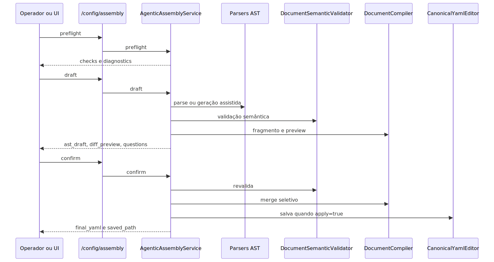

# Manual técnico, executivo, comercial e estratégico: AST e AST Designer

## 1. O que é esta feature

A AST e o AST Designer formam a camada governada que permite editar, validar, compilar, revisar e publicar o escopo agentic do YAML sem tratar o YAML bruto como contrato direto de edição.

Na prática, o sistema não trabalha o trecho agentic como texto livre. Ele transforma esse trecho em uma representação tipada chamada AgenticDocumentAST, valida essa representação, compila apenas o fragmento governado do alvo escolhido e só então gera preview ou publicação do YAML final.

Esse ponto é o coração da feature. O AST Designer não é um editor visual cosmético. Ele é um pipeline de montagem assistida, com contrato público, diagnósticos estruturados, preflight operacional, diff de preview, detecção de drift e persistência canônica.

## 2. Que problema ela resolve

Sem essa camada, a plataforma cairia em um problema clássico de produtos YAML-first: toda edição visual, assistida por linguagem natural ou automatizada viraria uma edição de texto com baixa garantia de consistência.

Isso criaria riscos concretos.

1. O usuário alteraria YAML sem saber se o runtime realmente entende aquele recorte.
2. O sistema misturaria parse, validação, merge e persistência no mesmo passo.
3. Um erro de catálogo, alvo ou semântica apareceria tarde demais.
4. Uma UI de designer precisaria replicar regras internas do backend.
5. Qualquer tooling externo, como editor assistido, passaria a depender de heurística frágil em vez de contrato governado.

A AST existe para quebrar esse problema em etapas seguras e rastreáveis.

## 3. Visão executiva

Para liderança, esta feature importa porque ela reduz o custo e o risco de operar uma plataforma agentic configurável.

- Diminui erro humano em edição de YAML crítico.
- Cria trilha previsível entre intenção, validação e publicação.
- Reduz retrabalho de suporte e de engenharia para corrigir configuração inválida.
- Permite construir experiências guiadas sem abrir mão da governança do runtime.
- Melhora a capacidade de escalar configuração agentic sem depender de especialistas editando arquivos manualmente.

Em termos executivos, isso aumenta governança, previsibilidade e velocidade de evolução do produto.

## 4. Visão comercial

Comercialmente, AST e AST Designer permitem posicionar a plataforma como um produto configurável com disciplina de engenharia, e não como um conjunto de YAMLs frágeis mexidos na mão.

- Ajuda a demonstrar que WorkflowAgent e DeepAgent podem ser montados com validação real.
- Ajuda a vender segurança de configuração em vez de liberdade caótica.
- Dá base para experiências de montagem assistida por prompt, por formulário e por tooling de editor.
- Permite mostrar que a plataforma consegue recomendar tools, gerar rascunhos e validar contratos antes da publicação.

Promessa comercial que o código sustenta: configuração agentic governada com checagem operacional, semântica e de catálogo.

Promessa comercial que o código não sustenta como fato confirmado: um designer frontend completo e totalmente autônomo de ponta a ponta já pronto em tela. O que está confirmado no código lido é o backend do designer, o contrato consumível por UI e o tooling editor-friendly reutilizando a mesma base semântica.

## 5. Visão estratégica

Estratégicamente, esta feature fortalece a plataforma em sete frentes.

1. Faz a AST virar fonte de verdade do escopo agentic em vez do YAML cru.
2. Separa claramente parse, validação, compilação, preview e persistência.
3. Permite reuso do mesmo contrato em API, tooling e análise editor-friendly.
4. Reduz drift entre o que a UI monta e o que o runtime realmente aceita.
5. Prepara a plataforma para montagem assistida por linguagem natural sem romper governança.
6. Preserva blocos fora do alvo governado, o que evita reescrita destrutiva do documento inteiro.
7. Cria base para evolução segura de WorkflowAgents e DeepAgents com contratos paralelos, mas orquestração unificada.

## 6. Conceitos necessários para entender

### AST

AST, neste contexto, é a representação tipada e estruturada do pedaço agentic do YAML. Ela existe para que o sistema trabalhe com objetos coerentes, não com texto solto.

### Escopo agentic governado

É o subconjunto do documento YAML em que a AST vira a fonte de verdade de edição, parse, validação e compilação. No código lido, esse envelope inclui seleção de workflow, seleção histórica via selected_supervisor para DeepAgent, workflows, multi_agents, tools_library e alguns blocos auxiliares do documento.

### Target

Target é o alvo da montagem. Nesta documentação, os alvos oficiais são auto, workflow e deepagent. Isso existe para que a plataforma não trate todos os casos de uso como se fossem o mesmo tipo de documento.

### Draft

Draft é o rascunho AST inicial. Ele pode nascer de YAML existente ou de prompt em linguagem natural.

### Validate

Validate é a etapa que verifica se o AST faz sentido para o alvo, para o catálogo efetivo de tools e para o contrato do runtime.

### Confirm

Confirm é a consolidação. Ele recompõe o AST, aplica respostas pendentes, recompila, detecta drift, gera diff e, se autorizado, persiste o resultado.

### Objective to YAML

É o fluxo composto que encadeia preflight, draft, validate e confirm em dry-run para sair de um objetivo em linguagem natural até um YAML governado final.

### Drift governado

É a divergência entre o fingerprint armazenado do fragmento governado e o estado atual do YAML base. Ele existe para evitar publicação cega em cima de base que já mudou ou se degradou semanticamente.

### Designer backend

No código lido, o AST Designer aparece como capacidade de backend: endpoints HTTP, contratos tipados, schemas JSON, catálogo efetivo, preflight e persistência. Ele também aparece como tooling editor-friendly no language server que reutiliza os mesmos parsers, schemas e validadores.

## 7. Como a feature funciona por dentro

O centro da orquestração é o AgenticAssemblyService. Ele reúne todas as peças necessárias para transformar YAML ou intenção em uma montagem governada.

No construtor do serviço, a arquitetura já fica explícita.

- YamlLoader para leitura do documento.
- WorkflowParser, DeepAgentParser e ToolDefinitionsParser para converter o payload oficial em AST tipada.
- Compatibilidades clássicas residuais ficam isoladas fora do wiring oficial do assembly e servem apenas para diagnóstico controlado de legado.
- DocumentSemanticValidator para consolidar validação por alvo.
- DocumentCompiler para aplicar apenas o fragmento governado.
- AgenticAssemblySchemaService para expor contratos consumíveis por UI e tooling.
- ToolCatalogResolver para montar o catálogo efetivo do contexto.
- GovernedYamlDriftDetector para checar coerência do YAML governado ao longo do tempo.
- DiffPreviewService para mostrar o impacto antes de publicar.
- IntentParser, WorkflowArchetypeFactory, AssemblyRepairLoop e LlmAstDraftGenerator para suportar montagem assistida por prompt.

Isso mostra uma decisão arquitetural importante: o designer não é uma tela acoplada a um parser. Ele é um pipeline completo de montagem assistida.

## 8. Divisão em etapas e submódulos

### 8.1. Envelope AST do documento

O que é: a representação canônica do documento agentic completo.

Por que existe: para concentrar em um objeto só os recortes relevantes para workflow e deepagent.

Como funciona: AgenticDocumentAST carrega target, selected_workflow, selected_supervisor, workflows_defaults, workflows, multi_agents, deepagent_multi_agents, tools_library e alguns blocos auxiliares como local_tools_configuration, global_tools_configuration e memory.

O que entrega: um modelo único que depois pode ser convertido em fragmento YAML orientado ao target.

### 8.2. Parsers especializados

O que são: parsers dedicados para workflow, deepagent e tools, além das compatibilidades internas ainda existentes.

Por que existem: porque cada espinha dorsal tem semântica própria e não deve ser tratada por um parser genérico e opaco.

Como funcionam: o serviço lê o YAML, chama cada parser especializado e monta um AgenticDocumentAST consolidado.

O que entregam: AST tipada mais diagnósticos de parse.

### 8.3. Resolvedor de target

O que é: a lógica que identifica qual slice do documento está ativo ou deve ser montado.

Por que existe: porque workflow e deepagent não podem compartilhar o mesmo fluxo de compilação sem contexto. Compatibilidades históricas ficam isoladas e fora da trilha oficial.

Como funciona: TargetScopeResolver usa seleção explícita quando existe e, se necessário, encontra workflow habilitado ou o DeepAgent compatível com o tipo de execução esperado.

O que entrega: o alvo operacional que vai guiar validação, compilação e merge.

### 8.4. Validação semântica agregada

O que é: a orquestração central dos validadores por alvo.

Por que existe: para separar responsabilidade técnica entre workflow, deepagent e tools_library.

Como funciona: DocumentSemanticValidator delega para WorkflowSemanticValidator, DeepAgentSemanticValidator e ToolsSemanticValidator. No target auto, ele agrega apenas os alvos oficiais do runtime agentic atual. Diagnóstico do supervisor clássico residual fica fora desse wiring principal.

O que entrega: ValidationReport com fragmento compilado, contagem de erros, contagem de warnings e lista de diagnósticos estruturados.

### 8.5. Schema e catálogo para designer e tooling

O que é: a camada que expõe o contrato formal do assembly para consumo externo.

Por que existe: para que UI, tooling e fluxos assistidos não repliquem regra interna na mão.

Como funciona: AgenticAssemblySchemaService gera JSON Schemas para workflow, deepagent, common e document, além de catálogo com workflow_modes, tools_catalog, safe_functions, execution_modes e middlewares deepagent.

O que entrega: base consumível para designer visual, validação cliente e tooling de editor.

### 8.5.1. Contrato workflow -> DeepAgent no AST

O AST de workflow agora possui um node tipado específico para essa ponte: `DeepAgentCallNodeAST`, apoiado por `DeepAgentCallParamsAST`.

Na prática, isso significa três coisas importantes.

1. `mode: deepagent_call` deixou de ser texto solto e passou a fazer parte da união discriminada oficial de `WorkflowNodeAST`.
2. O contrato estrutural exige `params.supervisor_id` e exatamente uma fonte de entrada entre `input_path` e `input_value`.
3. A validação semântica do workflow cruza esse node com `multi_agents` para garantir que o `supervisor_id` aponta para um DeepAgent habilitado.

Isso também impacta o schema público: quando `NodeFactory.registry` expõe `deepagent_call`, o catálogo `workflow_modes` e o schema de workflow passam a refletir esse modo oficialmente.

### 8.5.2. Contrato DeepAgent -> AG-UI no AST

O alvo DeepAgent do assembly também passou a expor o bloco canônico `ag_ui.ui_specs` no schema público.

Na prática, isso quer dizer três coisas.

1. `ag_ui.ui_specs` deixou de ser convenção solta e passou a existir como campo tipado do `DeepAgentSupervisorAST`.
2. Cada item da lista precisa ter `id` estável e `spec` validada como `UISpec`, com falha fechada para conteúdo inseguro.
3. O parser do DeepAgent rejeita o caminho top-level `ui_specs`, porque o contrato oficial agora exige o namespace `ag_ui` para evitar dual-read e drift entre editor, validator e runtime.

O efeito prático para tooling é simples: designer visual, schema público e validação semântica passam a enxergar o mesmo caminho canônico, em vez de cada consumidor adivinhar onde a configuração visual deveria morar.

### 8.5.3. Contrato Workflow -> AG-UI no AST

O alvo Workflow usa o mesmo caminho canônico `ag_ui.ui_specs`, agora representado por `WorkflowAgUiAST` e validado pela mesma regra semântica compartilhada.

Na prática, isso quer dizer três coisas.

1. `workflows[].ag_ui.ui_specs` é o único local governado para UISpec de Workflow.
2. Cada item precisa ter `id` único dentro do próprio workflow e `spec` validada como `UISpec`, com falha fechada para conteúdo inseguro.
3. O runtime AG-UI resolve `uiSpecId` apenas contra a UISpec declarada no workflow selecionado por `selected_workflow`, ou falha fechado quando o YAML estiver ambíguo.

O efeito prático é o mesmo do DeepAgent: YAML, AST, schema, validator e runtime usam o mesmo contrato. Isso evita duas formas diferentes de declarar a mesma tela gerada e impede que o browser receba uma UISpec inventada fora do YAML governado.

### 8.6. Compilação e merge canônico

O que é: a etapa que transforma AST validada em YAML final sem destruir o resto do documento.

Por que existe: para evitar reescrita integral e acoplamento entre slices independentes.

Como funciona: DocumentCompiler atualiza apenas chaves do target governado. Para workflow, mexe em selected_workflow, workflows_defaults, workflows e tools_library. Para DeepAgent, trata selected_supervisor, faz merge seletivo de multi_agents e atualiza tools_library por id, preservando slices clássicos residuais apenas quando eles já existem fora do alvo governado.

O que entrega: documento final coerente com o slice governado e preservação do restante do YAML.

### 8.7. Persistência canônica

O que é: a escrita final controlada do YAML publicado.

Por que existe: para preservar blocos não governados e impedir gravação fora do perímetro permitido.

Como funciona: CanonicalYamlEditor salva o resultado reescrevendo apenas blocos top-level gerenciados e a persistência só aceita caminhos .yaml ou .yml dentro de app/yaml.

O que entrega: publicação segura, seletiva e previsível.

### 8.8. Tooling editor-friendly

O que é: a reutilização do mesmo núcleo semântico fora da API principal.

Por que existe: para que diagnóstico em editor e montagem governada compartilhem a mesma verdade técnica.

Como funciona: o serviço AgenticYamlAnalysisService do language server reutiliza AgenticDocumentAST, parsers, schema service e DocumentSemanticValidator para analisar YAML, mapear diagnósticos semânticos e construir símbolos editoriais.

O que entrega: consistência entre backend do designer e experiência de edição assistida no editor.

## 9. Pipeline principal de ponta a ponta

### 9.1. Preflight operacional

O preflight verifica se o ambiente está realmente apto a montar AST com segurança.

No código lido, ele valida pelo menos estes pontos.

1. Se a feature FEATURE_AGENTIC_AST_ENABLED está ativa.
2. Se o operador informou user_email.
3. Se existe configuração llm válida quando o modo exige geração estruturada.
4. Se o fallback heurístico está explicitamente autorizado quando o modo auto precisa cair para heurística.
5. Se o catálogo efetivo de tools não está vazio.

Isso é importante porque o designer deixa de ser um clique cego e passa a ter gate operacional explícito.

### 9.2. Draft

O draft resolve base_yaml, resolve target, monta catálogo efetivo e escolhe o caminho de geração.

- Se veio prompt, o serviço tenta construir rascunho AST a partir da intenção.
- Se não veio prompt, ele parseia o YAML base.
- Em ambos os casos, ele valida o documento, compila o fragmento do target, gera merged_preview e diff_preview.

O resultado já nasce com questions, diagnostics, validation_report e correlation_id.

### 9.3. Validate

O validate parte de ast_payload enviado pela UI ou por outro integrador.

- Reparseia o AST para o target solicitado.
- Resolve catálogo efetivo no contexto do base_yaml.
- Executa validação semântica.
- Detecta drift do YAML governado.
- Falha fechado com diagnóstico explícito quando multi_agents mistura material clássico e DeepAgent no mesmo documento.

Se strict for verdadeiro, o sucesso acompanha a validade semântica. Se strict for falso, o fluxo pode seguir mesmo com relatório inválido, mantendo os diagnósticos explícitos.

### 9.4. Confirm

O confirm é a etapa de consolidação e publicação controlada.

- Resolve o target final do payload.
- Reparseia o AST.
- Aplica answers quando existem perguntas pendentes.
- Revalida o documento.
- Detecta drift e bloqueia base mista antes do merge final.
- Compila o fragmento final.
- Faz merge no base_yaml.
- Carimba o fingerprint governado no metadata do documento.
- Gera diff_preview.
- Se apply for verdadeiro, persiste em arquivo dentro de app/yaml.

Esse é o ponto em que o designer sai do modo preparação e entra no modo publicação.

### 9.5. Objective to YAML

Esse fluxo monta uma esteira única de objetivo para YAML.

- Roda preflight.
- Se passar, roda draft.
- Se o draft gerar perguntas ou erro bloqueante, interrompe com blocking_stage.
- Se passar, roda validate.
- Se passar, roda confirm em dry-run.
- Devolve final_yaml, final_yaml_text, ast_payload, diff_preview, chosen_tools, decision_trace e relatório de validação.

Isso transforma um pedido em linguagem natural em um fluxo governado com checkpoints claros.

### 9.6. Schema, catálogo e recomendação de tools

O AST Designer não se resume ao pipeline de publicação.

O mesmo módulo também expõe:

1. schema para UI e tooling;
2. catálogo efetivo do contexto agentic;
3. recomendação estruturada de tools para uma situação de negócio.

Isso amplia a feature de editor para plataforma de assembly assistido.

## 10. Tática arquitetural adotada

A tática principal observada no código é esta: tratar o YAML agentic como artefato compilado a partir de uma representação tipada, e não como superfície primária de edição.

Essa tática se apoia em quatro ideias.

1. Contrato primeiro: modelos tipados e endpoints com response model explícito.
2. Alvo explícito: workflow e deepagent seguem fluxos próprios, ainda que componham o mesmo documento.
3. Merge seletivo por slice: o sistema preserva o que não pertence ao slice governado, mas não trata mais base mista em multi_agents como caminho normal.
4. Reuso do núcleo semântico: API, schema, catálogo e language server usam a mesma base técnica.

Essa tática evita os dois extremos ruins.

- Nem tudo é edição manual de YAML.
- Nem tudo depende de um designer visual desconectado do runtime.

## 11. Técnica usada para sustentar a feature

As técnicas principais confirmadas no código são estas.

- Modelos Pydantic para contratos de request, response e diagnóstico.
- AST canônica com recorte por target.
- Parsers especializados por espinha dorsal.
- Validação semântica agregada por alvo.
- JSON Schema para consumo externo.
- Resolução de catálogo efetivo conforme base_yaml e target.
- Detecção de drift por fingerprint do fragmento governado.
- Diff preview antes da publicação.
- Persistência canônica preservando blocos top-level não governados.
- Boundary HTTP com endpoints dedicados e permissão config.generate.
- Tooling de editor reaproveitando o mesmo núcleo semântico.

## 12. Configurações que mudam o comportamento

As configurações mais relevantes observadas no código são estas.

### FEATURE_AGENTIC_AST_ENABLED

Controla se os endpoints de assembly podem ser usados. Quando desativada, a borda HTTP bloqueia o acesso e o preflight acusa erro.

### FEATURE_AGENTIC_AST_AUTO_HEURISTIC_FALLBACK_ENABLED

Controla a autorização explícita para o modo auto cair para heurística quando o provider LLM estruturado não está pronto.

### generation_mode

Controla se o draft usa llm_schema, heuristic ou auto. Isso muda diretamente a exigência de provider com saída estruturada.

### target

Controla o recorte governado que será montado, validado e publicado.

### apply e output_path

Controlam se o confirm será apenas preview ou persistência real. Quando apply é verdadeiro, output_path passa a ser obrigatório e precisa permanecer dentro de app/yaml.

### strict

No validate, controla se o sucesso depende de validade semântica completa ou se a etapa pode retornar sucesso operacional mesmo com relatório inválido.

## 13. Contratos, entradas e saídas

Na borda HTTP, o backend do designer é publicado em /config/assembly e exige permissão config.generate.

Os endpoints confirmados no código são estes.

1. POST /config/assembly/preflight
2. POST /config/assembly/draft
3. POST /config/assembly/validate
4. POST /config/assembly/confirm
5. POST /config/assembly/objective-to-yaml
6. GET /config/assembly/schema
7. GET /config/assembly/catalog
8. POST /config/assembly/recommend-tools

Os contratos mais importantes expostos pela feature são estes.

- DraftRequest e DraftResponse para rascunho AST com preview.
- ValidateRequest e ValidateResponse para validação de AST enviada pela UI.
- ConfirmRequest e ConfirmResponse para consolidação e aplicação opcional.
- ObjectiveToYamlRequest e ObjectiveToYamlResponse para o fluxo unificado de objetivo até YAML governado.
- SchemaResponse e CatalogResponse para UI e tooling.
- ToolRecommendationRequest e ToolRecommendationResponse para recomendação assistida de tools.

## 14. O que acontece em caso de sucesso

O caminho feliz da feature é este.

1. O preflight confirma que ambiente, identidade do operador, provider e catálogo estão prontos.
2. O draft produz AST coerente e preview do impacto.
3. O validate confirma consistência do recorte governado para o target.
4. O confirm recompila o fragmento, faz merge seletivo e carimba fingerprint do trecho governado.
5. Se apply for verdadeiro, o YAML é salvo de forma canônica dentro de app/yaml.
6. A resposta devolve correlation_id, diagnostics, diff_preview e, quando aplicável, saved_path.

Para o usuário, isso significa sair de intenção ou edição assistida até um YAML final sem precisar adivinhar se o runtime aceitou o contrato.

## 15. O que acontece em caso de erro

Os principais cenários de erro confirmados no código lido são estes.

### Erro de preflight

O ambiente não está pronto porque a feature está desligada, o operador não informou user_email, o provider LLM estruturado não está apto ou o catálogo efetivo está vazio.

### Erro de parse

O YAML ou ast_payload não conseguem ser convertidos para a estrutura esperada.

### Erro semântico

O AST parece válida estruturalmente, mas não fecha com as regras do target, das referências ou do catálogo de tools.

### Erro de drift

O fingerprint armazenado do recorte governado diverge do estado atual do base_yaml e o serviço acusa isso como problema de coerência.

### Erro de base mista

Quando multi_agents mistura slices clássicos e deepagent, o validate e o confirm falham fechado com o diagnóstico AGENTIC_AST_BASE_MISTA_NAO_SUPORTADA.

O que o sistema faz: interrompe a publicação e exige separação ou migração explícita do documento antes de continuar.

### Erro de publicação

O confirm com apply verdadeiro falha se output_path estiver ausente, se apontar para arquivo fora de app/yaml, se o sufixo não for .yaml ou .yml, ou se o arquivo já existir sem force.

## 16. Observabilidade e diagnóstico

A feature foi desenhada para ser diagnosticável por etapa, e isso é um ganho operacional importante.

Na borda HTTP, cada endpoint registra início e fim do fluxo com marker específico, usuário, target, correlation_id e estatísticas relevantes.

No serviço, os principais sinais de investigação são estes.

1. target resolvido.
2. diagnostics agregados.
3. error_count e warning_count.
4. questions pendentes no draft.
5. diff_preview do impacto esperado.
6. blocking_stage no objective-to-yaml.
7. llm_provider e supports_structured_output no preflight.
8. catalog_size no preflight.
9. saved_path na publicação.
10. diagnóstico AGENTIC_AST_BASE_MISTA_NAO_SUPORTADA para bases mistas.

O melhor jeito de investigar é seguir a ordem da esteira: preflight, draft, validate, confirm. Isso evita tentar consertar YAML final quando o problema real nasceu antes.

## 17. Impacto técnico

Tecnicamente, a feature entrega ganhos claros.

- Remove acoplamento entre edição e persistência.
- Reforça AST como contrato canônico do escopo agentic.
- Evita reescrita destrutiva do documento inteiro.
- Reutiliza o mesmo núcleo semântico em API e editor.
- Diminui fragilidade de tooling por linguagem natural.
- Melhora rastreabilidade de erro e de decisão.
- Mantém workflow e deepagent em contratos separados, mas com orquestração única.

## 18. Impacto executivo

Para liderança, o maior ganho é previsibilidade.

- Mais segurança para liberar configuração agentic com governança.
- Menor dependência de intervenção manual especializada.
- Menos risco de incidentes causados por edição direta de YAML.
- Mais clareza entre rascunho, validação e publicação.
- Mais capacidade de construir experiências guiadas para times menos especializados.

## 19. Impacto comercial

Para venda e pré-venda, a feature ajuda a sustentar estas mensagens.

- A plataforma não exige edição bruta de YAML para cada evolução agentic.
- A configuração pode ser guiada por contrato, catálogo e validação.
- É possível demonstrar preview e controle antes de publicar.
- O produto já está preparado para experiências de designer, recomendação de tools e montagem assistida.

Quem mais se beneficia desse posicionamento são clientes com operação governada, múltiplos fluxos agentic e necessidade de reduzir dependência de especialistas de backend para toda mudança.

## 20. Impacto estratégico

No longo prazo, a feature é importante porque transforma o AST em plataforma interna de montagem, não apenas em detalhe de implementação.

Isso prepara o produto para:

1. designers visuais mais ricos sem reimplementar semântica no frontend;
2. NL2YAML governado com checkpoints claros;
3. análise semântica consistente no editor;
4. maior reuso entre assembly, validação, catálogo e tooling;
5. evolução de contratos agentic sem depender de edição manual de texto.

## 21. Exemplos práticos guiados

### 21.1. Montar um workflow a partir de um YAML base

Cenário: o operador já tem um documento com workflows e quer editar apenas o fluxo ativo.

O que acontece: o target workflow é resolvido, o documento vira AST, a validação foca no slice de workflow e o merge final atualiza apenas selected_workflow, workflows_defaults, workflows e tools_library do recorte.

Impacto prático: o restante do YAML não é reescrito desnecessariamente.

### 21.2. Detectar base mista antes da publicação

Cenário: o documento tem multi_agents misto, com material legado e deepagent.

O que acontece: o validate e o confirm falham fechado com AGENTIC_AST_BASE_MISTA_NAO_SUPORTADA antes de qualquer merge em multi_agents.

Impacto prático: o operador precisa separar ou migrar o documento antes de publicar mudanças agentic modernas.

### 21.3. Sair de um objetivo textual até um YAML final

Cenário: o operador descreve o que quer em linguagem natural.

O que acontece: o objective-to-yaml roda preflight, draft, validate e confirm em dry-run, devolvendo questions, decision_trace, chosen_tools, diff_preview e, se tudo fechar, final_yaml.

Impacto prático: a linguagem natural entra como assistente de montagem, não como atalho cego para publicação.

### 21.4. Publicar o resultado em arquivo governado

Cenário: o operador aprovou o preview e quer persistir o YAML.

O que acontece: o confirm exige output_path dentro de app/yaml, salva apenas o slice governado reescrevendo blocos top-level controlados e preserva o restante do arquivo.

Impacto prático: a publicação respeita perímetro operacional e reduz dano colateral.

### 21.5. Usar o mesmo contrato no editor

Cenário: um desenvolvedor edita YAML agentic no editor e precisa de feedback semântico.

O que acontece: o language server reusa AST, parsers, schema e validator para gerar diagnósticos, símbolos e definições alinhados ao backend do assembly.

Impacto prático: editor e runtime deixam de divergir por interpretação paralela.

## 22. Explicação 101

Pense no YAML agentic como um contrato importante demais para ser editado direto no escuro.

A AST é como uma versão organizada desse contrato, em que o sistema consegue enxergar cada peça, conferir se ela faz sentido e só depois montar a versão final.

O AST Designer é o conjunto de mecanismos que usa essa representação organizada para ajudar o operador a montar, revisar e publicar configuração sem improviso.

## 23. Limites e pegadinhas

- AST não é sinônimo de frontend visual pronto. O backend do designer e o contrato consumível estão confirmados; a tela completa não foi tomada como fato sem leitura específica da UI.
- Preview não é publicação. Confirm com apply falso não persiste nada.
- Validação estrutural não substitui validação semântica.
- Objetivo em linguagem natural não elimina a necessidade de catálogo efetivo e preflight operacional.
- Base YAML existente pode estar semanticamente inválida mesmo sendo sintaticamente válida.
- Ferramenta recomendada ou escolhida não garante sucesso de negócio se o catálogo base estiver incorreto.
- Edição governada não significa que todo o YAML virou AST-first; o foco confirmado é o escopo agentic.

## 24. Troubleshooting

### 24.1. O preflight bloqueia antes do draft

Sintoma: a UI ou o integrador não consegue iniciar a montagem.

Causa provável: feature flag desligada, user_email ausente, provider LLM sem suporte estruturado quando exigido, ou catálogo efetivo vazio.

Como confirmar: revisar checks, diagnostics, llm_provider, supports_structured_output e catalog_size da resposta de preflight.

### 24.2. O draft gera perguntas e não publica

Sintoma: o fluxo avança, mas para antes do YAML final.

Causa provável: ainda há lacunas obrigatórias que o draft não conseguiu resolver sozinho.

Como confirmar: revisar questions no draft ou blocking_stage igual a draft no objective-to-yaml.

### 24.3. O validate acusa erro mesmo com YAML aparentemente correto

Sintoma: o documento parece bem formado, mas o relatório vem inválido.

Causa provável: erro semântico de target, referência, catálogo ou contrato específico da espinha dorsal.

Como confirmar: revisar diagnostics, target resolvido e compiled_fragment.

### 24.4. O confirm não salva o arquivo

Sintoma: o preview existe, mas a publicação falha.

Causa provável: output_path ausente, fora de app/yaml, sufixo inválido, arquivo existente sem force ou erro bloqueante ainda presente.

Como confirmar: revisar mensagem do erro, saved_path vazio, apply, force e diagnostics do confirm.

### 24.5. O documento mistura material legado e deepagent

Sintoma: receio de que um slice sobrescreva o outro.

Causa provável: base mista em multi_agents.

Como confirmar: procurar o diagnóstico AGENTIC_AST_BASE_MISTA_NAO_SUPORTADA.

O que o sistema faz: falha fechado e exige migração explícita do material legado antes da publicação.

## 25. Diagramas

Esse diagrama mostra a lógica macro da feature: a AST fica no centro e o designer deixa de ser uma edição direta de texto para virar esteira governada.

Esse diagrama mostra a ordem real da operação: a publicação só acontece depois de parse, validação e merge controlado.

## 26. Como colocar para funcionar

O caminho operacional confirmado no código lido é este.

1. Ativar FEATURE_AGENTIC_AST_ENABLED.
2. Entrar pela borda HTTP em /config/assembly com permissão config.generate.
3. Rodar preflight antes de draft ou objective-to-yaml.
4. Garantir user_email, catálogo efetivo utilizável e, quando necessário, provider LLM apto para saída estruturada.
5. Usar draft, validate e confirm conforme o fluxo desejado.
6. Se quiser persistir, informar output_path dentro de app/yaml.

O uso do modo auto com fallback heurístico só é seguro quando esse fallback foi explicitamente autorizado pela política correspondente.

## 27. Checklist de entendimento

- Entendi que a AST é a representação tipada do escopo agentic.
- Entendi que o designer é um pipeline governado, não só uma tela.
- Entendi que workflow e deepagent têm targets diferentes.
- Entendi que preflight, draft, validate e confirm têm responsabilidades distintas.
- Entendi que schema e catálogo são parte do contrato do designer.
- Entendi que o merge é seletivo e preserva blocos fora do alvo.
- Entendi que a publicação real só pode acontecer dentro de app/yaml.
- Entendi que o language server reutiliza o mesmo núcleo semântico.
- Entendi que drift é tratado explicitamente e base mista em multi_agents agora é bloqueada.
- Entendi os limites do que está confirmado como backend e tooling versus tela de UI final.

## 28. Lacunas confirmadas no código lido

Algumas conclusões importantes precisam ser tratadas com honestidade técnica.

- O backend do designer está claramente implementado e publicado por endpoints.
- O contrato consumível por UI e tooling também está claramente implementado.
- O uso do mesmo núcleo semântico no language server está confirmado.
- A existência de uma tela específica e completa do AST Designer não foi tomada como fato aqui porque esse slice de UI não foi a fonte de verdade lida nesta tarefa.

Essa distinção é importante para evitar vender como interface pronta algo que, nesta leitura, foi confirmado principalmente como backend governado e tooling reutilizável.

## 29. Evidências no código

- src/config/agentic_assembly/ast/document.py: lido para confirmar o envelope canônico da AST. Comportamento confirmado: AgenticDocumentAST concentra target, seletores, workflows, supervisores, deepagents e tools_library, e sabe converter esse estado em fragmento por target.

- src/config/agentic_assembly/models.py: lido para confirmar contratos públicos do assembly. Comportamento confirmado: alvos, modos de geração, diagnósticos estruturados e responses tipadas para preflight, draft, validate, confirm, objective-to-yaml, schema, catalog e recommend-tools.

- src/config/agentic_assembly/assembly_service.py: lido para confirmar o pipeline real do designer. Comportamento confirmado: draft, validate, confirm, objective-to-yaml, preflight, catalog, schema, recommend-tools, drift, diff preview, fingerprint governado e persistência canônica.

- src/config/agentic_assembly/validators/document_validator.py: lido para confirmar a estratégia de validação. Comportamento confirmado: orquestração por workflow, deepagent e tools_library com agregação no target auto, além das compatibilidades internas ainda vivas no código.

- src/config/agentic_assembly/schema_service.py: lido para confirmar o contrato consumível por UI e tooling. Comportamento confirmado: geração de schemas JSON e catálogo com workflow_modes, tools_catalog, safe_functions, execution_modes e middlewares deepagent.

- src/config/agentic_assembly/compilers/document_compiler.py: lido para confirmar o merge seletivo. Comportamento confirmado: atualização controlada apenas das chaves do target governado, com preservação de slices laterais por id.

- src/config/agentic_assembly/canonical_yaml_editor.py: lido para confirmar persistência canônica. Comportamento confirmado: reescrita de blocos top-level gerenciados preservando o restante do documento.

- src/config/agentic_assembly/target_scope_resolver.py: lido para confirmar resolução do alvo ativo. Comportamento confirmado: escolha do workflow ou do DeepAgent compatível com target e tipo de execução. Isso não transforma WorkflowAgent em substituto do DeepAgent, nem o inverso.

- src/api/routers/config_assembly_router.py: lido para confirmar a borda HTTP do designer. Comportamento confirmado: publicação de preflight, draft, validate, confirm, schema, catalog, objective-to-yaml e recommend-tools, todos com permissão config.generate e logging estruturado.

- src/api/service_api.py: lido para confirmar a publicação da feature na aplicação principal. Comportamento confirmado: inclusão do router config_assembly_router no boundary HTTP principal.

- tools/vscode-agentic-language-server/server/src/agentic_yaml_lsp/analysis_service.py: lido para confirmar reutilização do núcleo semântico fora da API. Comportamento confirmado: o language server reaproveita AST, parsers, schema service e validator para análise editor-friendly do YAML agentic.
