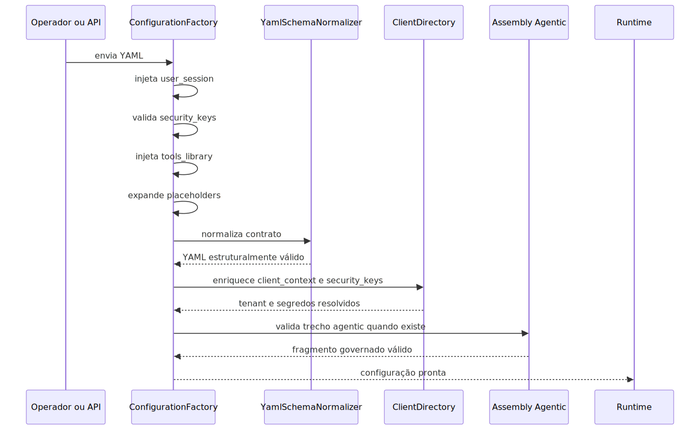

# Manual técnico, executivo, comercial e estratégico: configuração YAML

## Leitura especializada recomendada

Para a trilha completa e separada por finalidade sobre configuração declarativa de agentes, workflows e ETL sem editar Python, use estes dois manuais como referência principal.

1. [README-CONCEITUAL-CONFIGURACAO-YAML-AGENTES-WORKFLOW-ETL.md](../conceitual/README-CONCEITUAL-CONFIGURACAO-YAML-AGENTES-WORKFLOW-ETL.md) para entender valor, limites, impacto e o significado prático da promessa de configuração sem programação.
2. [README-TECNICO-CONFIGURACAO-YAML-AGENTES-WORKFLOW-ETL.md](./README-TECNICO-CONFIGURACAO-YAML-AGENTES-WORKFLOW-ETL.md) para seguir carga do YAML, assembly AST, seleção do WorkflowAgent ativo ou do DeepAgent ativo, injeção de tools_library e ativação de extract_transform_load.

Este arquivo continua sendo o manual geral de configuração YAML, mas os dois documentos acima passam a ser a entrada principal para o recorte específico de agentes, workflows e ETL sem programação.

## 1. O que é esta feature

A configuração YAML é o contrato operacional da plataforma. Ela descreve como o produto deve se comportar, em qual contexto de cliente, com quais segredos, quais pipelines, quais recursos de RAG, qual topologia agentic e sob quais regras de governança.

O ponto mais importante não é “ter um arquivo YAML”. O ponto importante é que a plataforma foi desenhada para nascer de configuração declarativa, e não de ramificações manuais de código para cada cliente, agente, canal ou fluxo.

No código lido, isso aparece de forma bem clara: o sistema não executa o YAML bruto que chegou. Ele primeiro carrega, normaliza, injeta contexto de sessão, resolve tenant, trata segredos, expande placeholders, injeta catálogo builtin de tools quando aplicável e, no escopo agentic, governa o trecho crítico por AST e validação semântica.

## 2. Que problema ela resolve

Sem esse contrato YAML, a plataforma cairia em quatro problemas clássicos.

1. Cada fluxo interpretaria configuração de um jeito diferente.
2. Cada personalização de cliente viraria demanda de código.
3. Credenciais, tenant e catálogos de tools se espalhariam por caminhos pouco auditáveis.
4. O runtime agentic ficaria vulnerável a YAMLs “bonitos”, mas semanticamente inválidos.

O YAML existe para deslocar customização da camada de código para uma camada declarativa governada.

## 3. Visão conceitual

Conceitualmente, a plataforma é YAML-first, mas não texto-livre-first.

Isso significa que a intenção do produto nasce em configuração, mas a configuração só vira runtime depois de passar por uma trilha controlada. No escopo não-agentic, essa trilha é formada por fábrica de configuração, normalização estrutural, contratos especializados e consumidores de runtime. No escopo agentic, a trilha é reforçada por AST tipada, parsers, validadores semânticos, diff preview e confirmação.

O conceito central é este: YAML é contrato de montagem, não atalho para bypass de governança.

## 4. Visão tática

Taticamente, o YAML permite que a empresa opere numa camada mais alta de abstração.

Em vez de dizer “vamos codificar mais uma variante do sistema”, a tática real do produto é dizer “vamos montar o contrato YAML correto para o tenant correto, com os recursos corretos, e deixar o runtime reutilizar o mesmo core”.

Essa tática é especialmente útil em três cenários.

1. Personalização por tenant sem bifurcar o core.
2. Montagem de WorkflowAgents e DeepAgents sem editar Python para toda variação.
3. Troca de provider, segredo, target vetorial, política de ingestão ou tool ativa sem reescrever o produto.

## 5. Visão técnica

Tecnicamente, o contrato YAML ativo não mora em um único arquivo. O código lido mostra quatro camadas de verdade.

1. A carga e finalização do YAML em ConfigurationFactory.
2. A validação estrutural e rejeição de layouts legados em YamlSchemaNormalizer.
3. Os contratos especializados, como VectorStoreContract.
4. O contrato agentic governado por AST, validadores semânticos e GovernedYamlDriftDetector.

Isso é importante porque evita um erro comum de documentação: tratar um arquivo-modelo ou um validador legado como se fossem a única fonte de verdade. O próprio código marca o validador antigo como deprecado.

## 6. Visão executiva

Para liderança, o YAML importa porque ele transforma customização em parametrização governada.

- Reduz dependência de desenvolvimento para toda mudança operacional.
- Aumenta velocidade de implantação e ajuste por cliente.
- Melhora previsibilidade de governança porque tenant, segredos, ferramentas e topologia não entram por caminhos soltos.
- Diminui custo de evolução ao reaproveitar o mesmo core em múltiplos cenários.

Em linguagem executiva, o YAML reduz custo marginal de personalização e melhora a escalabilidade operacional da plataforma.

## 7. Visão comercial

Comercialmente, o valor não é dizer que o produto “usa YAML”. O valor é dizer que a plataforma pode ser configurada com governança, isolamento por tenant, catálogo controlado de tools e trilha de validação real.

Isso ajuda a sustentar uma conversa mais forte com o cliente.

1. A solução pode ser adaptada sem prometer sprint de código para todo ajuste.
2. O cliente pode operar com segredos próprios e contexto próprio.
3. A configuração agentic não depende de edição textual cega.
4. A personalização pode escalar sem virar fábrica de projetos sob medida frágeis.

## 8. Visão estratégica

Estratégicamente, o YAML fortalece a plataforma em seis frentes.

1. Reuso do core técnico.
2. Separação entre produto e implantação.
3. Isolamento por tenant.
4. Governança de segredos e contexto operacional.
5. Evolução agentic apoiada por AST em vez de texto livre.
6. Capacidade de empurrar parte da montagem para consultoria, operação e tooling sem quebrar o runtime.

## 9. Conceitos necessários para entender

### YAML-first

YAML-first significa que a plataforma nasce de configuração declarativa. Não significa que qualquer texto YAML é aceito como contrato válido.

### Normalização estrutural

É a etapa que rejeita aliases legados, caminhos antigos e layouts não suportados, mantendo apenas o contrato canônico conhecido pelo runtime.

### Enriquecimento multi-tenant

É a etapa em que o sistema tenta completar client_context e security_keys a partir do diretório multi-tenant antes da execução real.

### Placeholder

É um valor simbólico no formato ${VAR}. O runtime tenta resolvê-lo usando security_keys e, quando necessário, fallback do store de segredos.

### Catálogo builtin

É o catálogo persistido de tools nativas. No fluxo agentic carregado pela fábrica, tools_library precisa existir na raiz e chegar vazia para ser preenchida automaticamente com esse catálogo.

### Escopo agentic governado

É o recorte do YAML que deixa de ser tratado como texto livre e passa a ser controlado por AST tipada, validação semântica, merge seletivo e selo de drift.

A feature flag `FEATURE_AGENTIC_AST_ENABLED` controla a ativação do caminho governado por AST. Na API, o endpoint `/config/assembly/validate` valida esse recorte antes de confirmar alterações sensíveis.

### Drift governado

É a divergência entre o fragmento agentic aprovado e o estado atual do YAML carregado. O runtime pode bloquear ou alertar quando isso acontece.

## 10. Como o contrato YAML funciona por dentro

O fluxo real observado no código é este.

1. O YAML chega por arquivo, payload inline ou payload criptografado.
2. ConfigurationFactory carrega o documento e injeta user_session.correlation_id e, quando aplicável, user_email.
3. A fábrica valida security_keys.
4. A fábrica exige tools_library na raiz e a injeta a partir do catálogo builtin quando a chave chega vazia.
5. O runtime garante security_keys como store lógico e expande placeholders.
6. YamlSchemaNormalizer rejeita aliases e caminhos legados.
7. Contratos especializados, como vector_store, validam regras adicionais.
8. O resolvedor multi-tenant tenta enriquecer client_context e security_keys quando o YAML não chegou completo.
9. Quando existe escopo agentic, a plataforma ainda pode validar o trecho governado por AST e checar drift.

Ou seja: YAML carregado não é YAML pronto.

## 11. Sintaxe realmente aceita pelo runtime

Quando o tema é sintaxe, o código confirma algumas regras bem objetivas.

1. A raiz do YAML precisa ser um objeto, não uma lista nem um escalar.
2. user_session deve existir na raiz.
3. authentication.user_session é proibido.
4. common na raiz é proibido.
5. modern_rag_system na raiz é proibido.
6. tools_library precisa existir na raiz do fluxo agentic carregado pela fábrica.
7. tools_library deve chegar vazia no YAML recebido; o catálogo builtin é injetado automaticamente.
8. client_context.client é o caminho canônico para identidade de cliente.
9. client_context.client.tenant_id é o caminho canônico para tenant.
10. metadata não pode carregar tenant_id, client_code nem yaml_path como atalhos.

Essa é a diferença entre sintaxe YAML válida e contrato YAML válido. O parser YAML pode aceitar um texto que o runtime rejeita logo depois.

## 12. Somente as chaves top-level válidas confirmadas no código

Esta seção lista apenas chaves top-level que consegui confirmar no código como lidas, validadas, exigidas ou apontadas explicitamente como destino canônico. Ela não tenta inventariar todas as subchaves do produto inteiro.

| Chave top-level      | Status confirmado                                  | Observação prática                                                          |
| -------------------- | -------------------------------------------------- | --------------------------------------------------------------------------- |
| user_session         | canônica e exigida                                 | Deve existir na raiz como objeto.                                           |
| security_keys        | válida e usada                                     | Pode vir do YAML, de payload auxiliar ou do diretório multi-tenant.         |
| tools_library        | válida e obrigatória no fluxo agentic pela fábrica | Deve existir na raiz e chegar vazia para auto-injeção.                      |
| rag_system           | chave oficial do pipeline RAG                      | modern_rag_system é rejeitada.                                              |
| qa_system            | ainda lida explicitamente                          | Continua sendo seção válida do runtime QA.                                  |
| vector_store         | válida e contratada                                | Possui contrato especializado, especialmente para if_exists.                |
| ingestion            | válida e canônica                                  | Centraliza estrutura de ingestão no layout atual.                           |
| content_sources      | lida como fallback                                 | Confirmada como compatibilidade, não como caminho preferido universal.      |
| embeddings           | válida e lida explicitamente                       | Usada por consumidores do runtime.                                          |
| authentication       | válida                                             | Usada para access_key; user_session sob ela é proibido.                     |
| client_context       | válida e estrutural                                | Identidade de cliente e tenant devem ficar aqui.                            |
| metadata             | válida com restrições                              | Parte dela é usada; tenant_id, client_code e yaml_path nela são rejeitados. |
| memory               | válida                                             | Participa de contratos de memória e checkpointer.                           |
| llm                  | válida na raiz                                     | memory.llm é rejeitado.                                                     |
| intelligent_pipeline | válida na raiz                                     | memory.intelligent_pipeline é rejeitado.                                    |
| schema_metadata      | válida quando o fluxo exige                        | Importante para schema_rag_sql.                                             |

## 13. Chaves top-level agentic válidas confirmadas

No escopo agentic governado, o próprio tooling e o detector de drift deixam explícito quais chaves top-level formam o artefato runtime final por alvo.

### Workflow governado

| Chave              | Papel                                    |
| ------------------ | ---------------------------------------- |
| selected_workflow  | escolhe o workflow ativo                 |
| workflows_defaults | guarda defaults do conjunto de workflows |
| workflows          | define os workflows do documento         |
| tools_library      | catálogo agentic visível ao runtime      |

### Deepagent governado no YAML final

| Chave               | Papel                                         |
| ------------------- | --------------------------------------------- |
| selected_supervisor | chave histórica que escolhe o DeepAgent ativo |
| multi_agents        | guarda o DeepAgent serializado para runtime   |
| tools_library       | catálogo agentic visível ao runtime           |

Observação importante: deepagent_multi_agents existe no envelope AST interno, mas não é a raiz canônica do YAML final de runtime.

## 14. Chaves obrigatórias versus opcionais, somente quando o código diz isso explicitamente

### Obrigatórias explícitas

| Chave ou caminho       | Condição                                                    |
| ---------------------- | ----------------------------------------------------------- |
| user_session           | obrigatória sempre na normalização estrutural               |
| tools_library          | obrigatória na raiz no fluxo agentic carregado pela fábrica |
| vector_store.if_exists | obrigatória quando o contrato de vector_store é avaliado    |
| workflows              | obrigatória na prática para target workflow válido          |
| multi_agents           | obrigatória na prática para target deepagent válido         |

### Obrigatórias condicionais explícitas

| Chave ou caminho                 | Quando se torna obrigatória                                         |
| -------------------------------- | ------------------------------------------------------------------- |
| selected_workflow                | quando existe mais de um workflow habilitado                        |
| selected_supervisor              | quando existe mais de um DeepAgent habilitado compatível com o alvo |
| schema_metadata.enabled          | quando alguma tool schema_rag_sql é habilitada                      |
| schema_metadata.vectorstore_id   | quando alguma tool schema_rag_sql é habilitada                      |
| schema_metadata.sql_dialect      | quando alguma tool schema_rag_sql é habilitada                      |
| memory.checkpointer.enabled      | quando human_in_the_loop está ativado em deepagent                  |
| multi_agents[].permissions       | quando filesystem middleware está ativado em deepagent              |
| multi_agents[].memory            | quando memory middleware está ativado em deepagent                  |
| multi_agents[].backend.type      | quando backend persistente do DeepAgent está ativado                |
| multi_agents[].backend.redis.url | quando multi_agents[].backend.type e store                          |
| multi_agents[].backend.scope     | quando multi_agents[].backend.type e store                          |
| multi_agents[].backend.policy    | quando multi_agents[].backend.type e store                          |
| multi_agents[].interrupt_on      | quando human_in_the_loop está ativado em deepagent                  |
| multi_agents[].skills            | quando skills middleware está ativado em deepagent                  |
| user_session.tenant_id           | quando multi_agents[].backend.scope e org                           |

### Opcionais explícitas

| Chave ou caminho    | Observação                                                                                      |
| ------------------- | ----------------------------------------------------------------------------------------------- |
| selected_workflow   | opcional quando só existe um workflow habilitado sem ambiguidade                                |
| selected_supervisor | opcional quando só existe um supervisor habilitado sem ambiguidade                              |
| security_keys       | pode ficar vazia apenas em fluxos que chamam a fábrica com allow_empty_security_keys verdadeiro |
| content_sources     | aceita como fallback de compatibilidade                                                         |

## 15. Chaves e localizações explicitamente rejeitadas ou legadas

Esta é a parte mais importante para o pedido de “somente as chaves válidas”. As entradas abaixo não devem ser tratadas como válidas no contrato atual.

| Caminho rejeitado                                                         | Destino canônico ou orientação                         |
| ------------------------------------------------------------------------- | ------------------------------------------------------ |
| modern_rag_system                                                         | usar rag_system                                        |
| authentication.user_session                                               | usar user_session na raiz                              |
| common                                                                    | mover as chaves para a raiz                            |
| qa                                                                        | usar qa_system                                         |
| hybrid_search                                                             | usar rag_system.retriever.hybrid                       |
| memory.llm                                                                | usar llm na raiz                                       |
| memory.intelligent_pipeline                                               | usar intelligent_pipeline na raiz                      |
| qa_system.user_memory                                                     | usar memory.qa_long_memory                             |
| qa_system.memory_history                                                  | usar memory.qa_short_history                           |
| multi_agents[].deepagent_memory                                           | usar multi_agents[].memory e multi_agents[].backend    |
| confluence na raiz                                                        | usar ingestion.confluence                              |
| content_profiles na raiz                                                  | usar ingestion.content_profiles                        |
| pdf na raiz                                                               | usar ingestion.content_profiles.type_specific.pdf      |
| json na raiz                                                              | usar ingestion.content_profiles.type_specific.json     |
| ingestion.web.enabled                                                     | usar ingestion.remote_sources.web_scraping.enabled     |
| ingestion.pdf                                                             | usar ingestion.content_profiles.type_specific.pdf      |
| ingestion.json                                                            | usar ingestion.content_profiles.type_specific.json     |
| ingestion.remote_sources.web_scraping.security.authentication.attachments | usar ingestion.remote_sources.web_scraping.attachments |
| rag_system.retriever.fts.pq_schema                                        | usar rag_system.retriever.fts.pg_schema                |
| qa_system.retrieval.vector_store_id                                       | usar vector_store.id                                   |
| vector_store.incremental_indexing.respect_last_modified                   | usar vector_store.incremental_indexing.enabled         |
| metadata.tenant_id                                                        | usar client_context.client.tenant_id                   |
| metadata.client_code                                                      | usar client_context.client.client_code                 |
| metadata.client_code_alias                                                | usar client_context.client                             |
| metadata.yaml_path                                                        | usar client_context.client.yaml_path                   |
| client_context.client.metadata.tenant_id                                  | usar client_context.client.tenant_id                   |
| client_context.client.metadata.yaml_path                                  | usar client_context.client.yaml_path                   |
| multimodal_scenarios                                                      | remover; o runtime rejeita esse cenário órfão          |
| multi_agents[].planner                                                    | removida do contrato agentic atual                     |
| multi_agents[].capabilities no deepagent                                  | rejeitada no topo do supervisor deepagent              |
| multi_agents[].context_schema no deepagent                                | rejeitada no topo do supervisor deepagent              |

## 16. Como a plataforma decide o que é válido

O código lido mostra uma regra prática: validade não vem de um schema global único e fechado para todo o produto. Ela vem da combinação de quatro filtros.

1. A fábrica de configuração garante carga, session context, security_keys e tools_library.
2. O normalizador rejeita layouts antigos e caminhos proibidos.
3. Contratos especializados validam slices críticos, como vector_store.
4. O runtime e o assembly agentic exigem semântica válida, não apenas forma válida.

Isso explica por que duas chaves podem parecer “parecidas” e, ainda assim, uma ser aceita e a outra falhar fechado.

## 17. Enriquecimentos e normalizações automáticas confirmados

O YAML final usado pelo runtime não é sempre igual ao YAML que entrou. O sistema aplica enrichments automáticos confirmados no código.

| Enriquecimento                            | O que faz                                                       |
| ----------------------------------------- | --------------------------------------------------------------- |
| user_session.correlation_id               | injeta o correlation_id operacional no YAML                     |
| user_session.user_email                   | injeta e-mail do operador quando disponível                     |
| merge de keys_payload                     | mescla chaves auxiliares em security_keys                       |
| ensure_security_keys_store                | garante store lógico de segredos                                |
| expansão de placeholders                  | resolve ${VAR} em todo o documento                              |
| injeção de security_keys via diretório    | tenta completar segredos do cliente pelo diretório multi-tenant |
| enrich_yaml_with_client_context           | tenta completar client_context do cliente                       |
| auto-injeção de tools_library             | injeta catálogo builtin persistido quando a chave chega vazia   |
| _config_metadata                          | grava metadados de origem, hash e carregamento                  |
| metadata.agentic_assembly.governed_hashes | grava fingerprint do fragmento agentic governado                |

## 18. O que acontece em caso de sucesso

No caminho feliz, o YAML passa por esta sequência.

1. É carregado como objeto válido na raiz.
2. Recebe user_session adequado ao contexto da execução.
3. Recebe ou consolida security_keys.
4. Recebe tools_library quando o fluxo agentic usa a fábrica.
5. É normalizado contra caminhos canônicos.
6. Recebe client_context e security_keys multi-tenant quando necessário.
7. Tem placeholders resolvidos.
8. Se houver escopo agentic governado, recebe também validação semântica e selo de hash.

O resultado não é apenas um YAML sintaticamente correto. É um YAML pronto para ser entendido pelo runtime real.

## 19. O que acontece em caso de erro

Os erros mais importantes confirmados no código lido se agrupam em algumas famílias.

### Erro de forma estrutural

O YAML não é um objeto na raiz ou não contém user_session canônico.

### Erro de layout legado

O documento usa caminhos explicitamente rejeitados, como common, qa, metadata.tenant_id ou authentication.user_session.

### Erro de catálogo agentic

tools_library falta na raiz ou chegou preenchida manualmente, o que quebra o contrato de auto-injeção.

### Erro de vector_store

vector_store.if_exists está ausente, com tipo errado ou com valor fora de overwrite, skip ou update.

### Erro de identidade multi-tenant

client_code não pode ser determinado, client_context.client não foi enriquecido ou tenant_id ficou em caminho inválido.

### Erro de segredo

security_keys do cliente não existem no diretório, ou um segredo referenciado não existe em tenant_secrets.

### Erro agentic

O trecho governado passa no parse YAML, mas falha em semântica, target, drift ou governança do assembly.

## 20. Observabilidade e diagnóstico

O diagnóstico correto do YAML segue esta ordem.

1. Confirmar se a origem do YAML foi resolvida corretamente.
2. Confirmar se user_session foi injetado na raiz.
3. Confirmar se client_context.client foi enriquecido com os identificadores esperados.
4. Confirmar se security_keys existe, está serializável e contém o que o fluxo precisa.
5. Confirmar se placeholders realmente foram expandidos.
6. Confirmar se tools_library existe e veio vazia antes da auto-injeção.
7. Confirmar se o YAML bate no contrato canônico do slice consumido.
8. No escopo agentic, confirmar diagnostics, compiled_fragment e metadata.agentic_assembly.governed_hashes.

Em linguagem simples: primeiro prove que o YAML foi preparado corretamente. Só depois investigue o domínio que o usa.

## 21. Impacto técnico

Tecnicamente, o YAML reduz acoplamento entre personalização e core do produto. Também melhora previsibilidade porque há pontos únicos de carga, normalização, enriquecimento e governança agentic.

O benefício real não é “mais configuração”. O benefício real é concentrar comportamento configurável em um contrato rastreável.

## 22. Impacto executivo

Executivamente, o YAML é um mecanismo de escala. Ele permite operar múltiplos clientes, múltiplos canais e múltiplas variantes do produto com menos dependência de desenvolvimento sob medida.

Isso melhora margem operacional, velocidade de resposta ao cliente e previsibilidade de implantação.

## 23. Impacto comercial

Comercialmente, o YAML ajuda a vender adaptabilidade com governança.

- O produto pode ser adaptado sem prometer reengenharia completa.
- O cliente pode operar em contexto isolado.
- O catálogo de tools e a configuração agentic não dependem de improviso.
- A empresa consegue sustentar discurso de plataforma multi-tenant real.

## 24. Impacto estratégico

Estratégicamente, o YAML prepara a plataforma para um modelo de software configurável, consultivo e governado. Isso fortalece a visão de produto em que configuração não é exceção, mas parte do desenho principal da solução.

## 25. Exemplos práticos guiados

### 25.1. Cliente com credenciais próprias

Cenário: o tenant quer usar suas próprias chaves.

O que acontece: o YAML pode vir sem security_keys completas, o diretório multi-tenant tenta enriquecer o documento, e placeholders passam a ser resolvidos no contexto correto.

Impacto prático: o produto usa o segredo do cliente sem precisar embutir constante em código.

### 25.2. Ajuste de ingestão sem mudar código-fonte

Cenário: o cliente quer mudar política do vector store.

O que acontece: a plataforma lê vector_store.if_exists e aplica apenas valores canônicos aceitos pelo contrato.

Impacto prático: a alteração fica concentrada na configuração, não em ramificação manual do runtime.

### 25.3. Montagem agentic governada

Cenário: o operador quer configurar um workflow ou um DeepAgent.

O que acontece: o YAML mantém only selected_workflow ou selected_supervisor, seus respectivos blocos governados e tools_library. O assembly agentic valida esse recorte antes de publicar.

Nota importante: WorkflowAgent e DeepAgent continuam sendo espinhas dorsais diferentes. Um não substitui o outro.

Impacto prático: a plataforma evita edição textual cega do núcleo agentic.

### 25.4. Falha por tenant_id no lugar errado

Cenário: alguém coloca tenant_id em metadata.

O que acontece: o contrato canônico rejeita o caminho e orienta o uso de client_context.client.tenant_id.

Impacto prático: o runtime não fica com ambiguidade sobre identidade do cliente.

## 26. Explicação 101

Pense no YAML como a ficha técnica completa de uma execução. Essa ficha diz quem é o cliente, quais segredos usar, quais recursos ligar e qual fluxo agentic ou RAG está ativo.

Só que o sistema não confia nessa ficha de olhos fechados. Ele lê, verifica, corrige caminhos esperados, completa contexto autorizado e só então libera a execução.

O YAML aqui não existe para abrir liberdade total. Ele existe para tornar a plataforma configurável sem perder disciplina operacional.

## 27. Limites e pegadinhas

Alguns erros de interpretação precisam ser evitados.

1. YAML-first não significa ausência de validação.
2. O contrato ativo não está centralizado em um único schema global do produto inteiro.
3. Nem toda chave lida por fallback deve ser tratada como caminho canônico preferido.
4. tools_library não é espaço para cadastro manual de catálogo builtin.
5. BYOK não é um isolamento puro em todos os fluxos, porque ainda existe compatibilidade com fallback do store de segredos.
6. Sintaxe YAML válida não significa contrato runtime válido.

## 28. Troubleshooting

### 28.1. O YAML carregou, mas o sistema não encontra tools

Sintoma: erro cedo relacionado a tools_library.

Causa provável: tools_library ausente na raiz ou preenchida manualmente.

Como confirmar: revisar o documento antes da fábrica e verificar se a chave existe e chega vazia.

### 28.2. O tenant correto não foi reconhecido

Sintoma: falhas em dataset, alvo vetorial ou autorização.

Causa provável: tenant_id ausente ou fora de client_context.client.tenant_id.

Como confirmar: revisar client_context já resolvido após enrichment.

### 28.3. Um placeholder não foi resolvido

Sintoma: o runtime ainda vê ${VAR} ou valor vazio.

Causa provável: segredo ausente em security_keys, tenant_secrets ou store de fallback.

Como confirmar: revisar security_keys, warnings de serialização e placeholders não resolvidos no resolvedor.

### 28.4. O contrato agentic falha mesmo com YAML legível

Sintoma: o documento parece correto, mas o runtime agentic acusa erro.

Causa provável: problema semântico, target ambíguo, ausência de selected_workflow ou selected_supervisor quando existe múltipla escolha, ou drift do fragmento governado.

Como confirmar: revisar validation_report, diagnostics e metadata.agentic_assembly.governed_hashes.

## 29. Diagramas

Esse diagrama mostra a lógica macro: o YAML não vai direto para o domínio. Ele atravessa carga, validação, enriquecimento e, quando necessário, governança AST.

Esse diagrama mostra a ordem real do preparo da configuração antes da execução.

## 30. Mapa de navegação conceitual

O mapa conceitual da feature pode ser lido assim.

1. Entrada: arquivo, inline ou payload criptografado.
2. Preparação: sessão, segredos, placeholders e catálogo builtin.
3. Normalização: rejeição de layouts legados e caminhos inválidos.
4. Especialização: contratos como vector_store e slices de domínio.
5. Contexto: client_context e tenant resolvidos.
6. Governança agentic: AST, validação semântica e drift.
7. Runtime: ingestão, RAG, agentic, canais e demais consumidores.

## 31. Como colocar para funcionar

O caminho confirmado no código lido é este.

1. Fornecer YAML como arquivo, conteúdo inline ou payload criptografado.
2. Garantir user_session na raiz.
3. Garantir tools_library na raiz quando o fluxo usa a fábrica agentic.
4. Deixar tools_library vazia para auto-injeção do catálogo builtin.
5. Garantir client_context.client quando o fluxo depende de identidade do cliente ou tenant.
6. Usar client_context.client.tenant_id como caminho canônico para tenant.
7. Garantir vector_store.if_exists quando o contrato de vector_store for usado.
8. Se houver escopo agentic, respeitar selected_workflow ou selected_supervisor quando existir ambiguidade.

## 32. Exercícios guiados

### Exercício 1

Objetivo: distinguir YAML sintaticamente válido de YAML contratualmente válido.

Passos: verifique se a raiz é objeto, se user_session está na raiz e se não existe common ou authentication.user_session.

O que observar: um YAML pode passar no parser e ainda assim ser rejeitado pelo normalizador.

### Exercício 2

Objetivo: entender o papel de tools_library.

Passos: confirme se a chave existe na raiz e se chega vazia no fluxo agentic.

O que observar: o runtime não aceita catálogo builtin declarado manualmente no YAML recebido.

### Exercício 3

Objetivo: localizar a identidade canônica do tenant.

Passos: procure tenant_id no documento e confirme se ele está em client_context.client.tenant_id.

O que observar: metadata.tenant_id e caminhos derivados não são aceitos como contrato canônico.

## 33. Checklist de entendimento

- Entendi que o contrato ativo do YAML não está em um único arquivo.
- Entendi que o validador legado não é a fonte de verdade atual.
- Entendi que user_session é obrigatório na raiz.
- Entendi que tools_library precisa existir na raiz e chegar vazia no fluxo agentic pela fábrica.
- Entendi que client_context.client é o lugar canônico da identidade do cliente.
- Entendi que client_context.client.tenant_id é o lugar canônico do tenant.
- Entendi que modern_rag_system, common e authentication.user_session são inválidos.
- Entendi que vector_store.if_exists tem valores canônicos explícitos.
- Entendi que o escopo agentic tem chaves top-level próprias e governadas.
- Entendi que sintaxe YAML válida não basta para garantir validade de runtime.

## 34. Evidências no código

- src/utils/yaml_schema_normalizer.py: lido para confirmar user_session na raiz, rejeição de common, modern_rag_system, authentication.user_session, aliases legados de QA, ingestão, memória e identidade de cliente.

- src/config/config_cli/configuration_factory.py: lido para confirmar a trilha de finalização do YAML, a validação de security_keys, a auto-injeção obrigatória de tools_library e a expansão de placeholders.

- src/api/routers/config_resolution.py: lido para confirmar enriquecimento via diretório multi-tenant, determinação de client_code, injeção de security_keys, expansão de placeholders após injeção e exigência prática de client_context.client.

- src/config/vector_store_contract.py: lido para confirmar que vector_store.if_exists é obrigatório quando o contrato é avaliado e que os valores aceitos são overwrite, skip e update.

- src/config/yaml_config_manager.py: lido para confirmar quais seções top-level continuam sendo lidas explicitamente pelo runtime e para confirmar o bloqueio de drift agentic no carregamento.

- src/config/agentic_assembly/ast/document.py: lido para confirmar o envelope AST do escopo agentic e distinguir campos internos da AST de chaves finais do YAML de runtime.

- src/config/agentic_assembly/drift_detector.py: usado indiretamente como fonte confirmada pelo relatório forense para as chaves governadas do YAML agentic e o selo metadata.agentic_assembly.governed_hashes.

- tools/vscode-agentic-language-server/server/src/agentic_yaml_lsp/analysis_service.py: lido para confirmar a lista explícita de chaves top-level governadas por alvo no tooling do YAML agentic.

- .sandbox/relatorio-contrato-yaml-codigo-2026-05-02.md: relatório forense derivado exclusivamente do código para consolidar chaves top-level confirmadas, obrigatórias condicionais, rejeições explícitas e lacunas de afirmação segura.
