# Produto: Plataforma de Agentes de IA

## Manual do Esquema de Banco de Dados

Guia de referência do schema PostgreSQL utilizado pela Plataforma de Agentes de IA Generic RAG.
Este documento separa o modelo SaaS **aplicado em produção** do que permanece futuro no plano.
Ao final, ele tambem documenta o schema implementado da solucao de integracoes, para que a modelagem persistente do modulo nao fique solta fora do manual oficial.

## Visão Geral

- Banco suportado: PostgreSQL.
- Tabelas que usam `gen_random_uuid()` dependem de suporte a `pgcrypto`.
- O schema atual está organizado, na prática, em dez grupos:
- estado e checkpoints,
- job core e ledger operacional de jobs,
- autenticação e login,
- ingestão de conteúdo,
- interações, eventos e aprovações humanas,
- execução agentic em background,
- tenants e segurança,
- YAML governado e bindings externos por tenant,
- memória de usuário,
- chat embutível (schema `chat`).

## Estado aplicado do módulo SaaS

> [!IMPORTANT]
> O DDL SaaS de 2026-07-11 e a materialização T7 foram aplicados no banco real
> `prometeu_generic_rag`. A introspecção canônica read-only atualizada em 2026-07-12 comprovou
> oito tabelas `saas_*`, sete projetos — cinco de catálogo e dois de validação arquivados —,
> dezessete releases e seis ponteiros. T8/T9 fornecem lifecycle e resolução projeto → release →
> YAML/hash/operação; T11/T12/T13 ligaram assinatura, billing simulado, entitlement e os
> boundaries HTTP/UI. O runtime interativo já resolve `projectKey` pela sessão assinante:
> Vendas usa AG-UI/agent, DNIT usa Q&A/RAG e Casa Moderna permanece no canal WhatsApp RAG.

### Legenda de status

| Rótulo | Significado |
|---|---|
| **APLICADO** | Estrutura já existente no schema atual documentado e usada pelo runtime atual. |
| **APLICADO, COM PROVA SIMULADA** | Estrutura e runtime simulado foram exercitados; registros cancelados/revogados permanecem como trilha auditável, sem cobrança real. |
| **FUTURO DE RUNTIME** | Comportamento previsto no plano; não implica coluna, tabela ou wiring já implantado. |

Fontes do estado comprovado:

- [forward manual aplicado](../../scripts/sql/20260711_expand_saas_project_release_model.sql) — criou sete tabelas e dois guards de imutabilidade;
- [materialização T7](../../scripts/sql/20260711_materialize_saas_project_releases.sql) — publicou 16 snapshots imutáveis em cinco projetos;
- [rollback antes do backfill](../../scripts/sql/20260711_rollback_saas_project_release_model.sql) — bloqueia se houver dados;
- [postcheck read-only](../../scripts/sql/20260711_postcheck_saas_project_release_model.sql) — audita escopo, ponteiro ativo e hash do manifesto;
- plano SaaS/YAML — tarefas posteriores de aplicação, runtime e contração;
- investigação de origem — evidências do estado atual e lacunas que motivaram o alvo.

### 1. Identidade, tenant e usuários — APLICADO



Leitura 101: conta pessoal, membership e cartão são conceitos diferentes. `tenant_users`
responde “de qual organização esta conta participa?”. Cartão responde apenas “qual método
tokenizado pode ser cobrado?”. Nenhum dos dois concede acesso a um projeto SaaS por si só.

### 2. Catálogo YAML, canais e API keys — APLICADO



Invariantes aplicados hoje:

- a API técnica pode chegar a `tenant_yaml.yaml_content` por binding direto ou, nas operações
  SaaS, por projeto + operação + release ativa;
- a sessão web resolve por `projectKey`, autorização/entitlement e release ativa; membership não
  escolhe YAML;
- o canal usa projeto/operação/release no resolvedor governado downstream, mas o webhook ainda
  exige `yaml_path` como precondição residual;
- FKs compostas com `environment + tenant_id + tenant_yaml_id` impedem cruzar tenant/ambiente;
- `yaml_path` é proveniência da release e não sua autoridade de execução, embora ainda seja lido
  nessa borda residual de canal;
- `tenant_user_yaml.agent_instructions_md` já foi removida fisicamente; a introspecção read-only de
  2026-07-28 confirmou sua ausência. A única fonte da instrução compartilhada é
  `agent-instructions-md` no YAML imutável da release, injetada pelo prompt composto.

### 3. Projeto SaaS, release e manifesto — APLICADO



Regras aplicadas e usadas por T8/T9:

- tenant 1:N projetos; projeto 1:N releases;
- cada release referencia **exatamente um** `tenant_yaml` do mesmo ambiente e tenant;
- `yaml_hash`, `manifest_json` e `manifest_hash` ficam congelados após `published`/`retired`;
- `tenant_yaml` referenciado por release publicada/retirada também não pode sofrer update/delete;
- a PK de `saas_project_active_releases` garante exatamente um ponteiro por projeto materializado e, estruturalmente, no máximo um por projeto/ambiente;
- o postcheck exige `manifest_json->>'yaml_hash' = saas_project_releases.yaml_hash`.

Estado atual sem segredos: sete projetos `prod`, 17 releases, seis ponteiros, 14 releases com
operação `agent`, 17 com `rag`, 13 com `ingest` e 11 com `etl`. O catálogo-base continua sendo
Apify (1 release), Casa Moderna (1), DNIT (6), Linx Demo (3) e PDV Vendas (5); os outros dois
projetos são provas T13 arquivadas, sendo apenas uma delas com release publicada/ativa.

Para a V1 comercial, o exemplo agentic funcional é **PDV Vendas**: release 3 publicada,
entrypoint `deepagent:ag_ui_pdv_operacoes_supervisor` e oferta restrita a `agent` + `rag`.
Casa Moderna e Engenharia DNIT são projetos de conteúdo (`rag` + `ingest`) e não oferecem
agente. DNIT abre chat RAG no browser; Casa Moderna orienta o assinante para o canal WhatsApp
RAG ativo. Um YAML pode continuar contendo outras espinhas dorsais, mas somente as operações
publicadas no manifesto e oferecidas pelo plano viram produto.

### 4. Planos, assinaturas, billing, entitlements e preferências — APLICADO



O entitlement físico é por projeto e operação: `agent`, `rag`, `ingest` ou `etl`.
Não existe `agent_id`, `workflow_id`, supervisor ou subagente nessas tabelas. O DDL de `saas_plans`
continua provider-neutral (preço/moeda/operações vivem em `provider_config_json`, jsonb), mas o
boundary HTTP já expõe `PATCH .../plans/{plan_id}` e `POST .../plans/{plan_id}/status`
(`src/api/services/saas_http_service.py:update_plan/set_plan_status`), que fazem `UPDATE` puro nesse
jsonb — sem DDL — para editar nome/operações/preço/moeda e transicionar
`active/inactive/archived`. Preferências aceitam apenas escalares JSON e não podem virar prompt livre.
Em produção existe o catálogo-base de cinco planos `simulated-free`. As jornadas reais também
deixaram registros auditáveis de prova: projetos arquivados, assinaturas canceladas,
entitlements revogados e eventos do provider. O estado inspecionado após a rodada funcional de
2026-07-12 contém nove assinaturas, quatro ativas, 22 eventos e 24 entitlements, dos quais dez
ativos. Esses registros não
são ofertas com cobrança real. O provider T12 é somente `simulated`, e o `SaasCommercialService`
recusa operar (`_require_deployment_environment`) quando o `environment` informado não é **o ambiente
canônico do processo** — checkout, transição de assinatura e concessão/revogação de entitlement acontecem
no ambiente do próprio deployment, nunca cruzados entre ambientes. As leituras
administrativas de projeto/release/plano, por outro lado, já derivam `environment` do segregador
canônico do processo (`SaasHttpRepository.environment`), não de um literal fixo. Preço/moeda por
plano deixaram de ser fixos em zero: o boundary aceita `UPDATE` de `provider_config_json` por
`PATCH .../plans/{plan_id}`, mas o catálogo-base seed permanece R$ 0,00 até alguém editar.

O tenant `pdv-vendas` possui exatamente uma linha em `tenant_security_keys`, identificada por
`pdv-vendas-agentic-v1`. Seu `keys_json` contém somente sete referências `${ENV}`; nenhum valor
de segredo é persistido ali. O runtime resolve as referências no boundary da requisição. O
payload público envia somente `project_key`, identidade da conversa e texto do usuário — nunca
YAML, API key ou seletor de agente.

Prova executável local de 2026-07-12, com `ENVIRONMENT=prod` e API + Worker + Scheduler:

- DNIT, publicado com `rag-config-mrctito-dnit-ingest-producao-600.yaml`, respondeu no chat do
  projeto assinado usando apenas sessão + `projectKey`; a API key continua obrigatória para
  integrações que não possuem assinatura autenticada;
- Casa Moderna respondeu pelo RAG do YAML e o Worker iniciou o único `tenant_channel` ativo,
  `casa_moderna_whatsapp`, ligado à operação `rag`;
- PDV Vendas abriu o transporte AG-UI e persistiu eventos em `ag_ui.run_events`. Uma consulta
  analítica longa ficou mais de cinco minutos entre eventos do supervisor e foi cancelada no
  cliente; portanto, esse cenário específico permanece um risco de latência e não é registrado
  como gate verde.

Não existe canal Instagram ativo no estado inspecionado. O suporte de código e os contratos de
webhook não substituem o provisionamento de uma conta Meta e um smoke externo autorizado.

#### Catálogo físico resumido aplicado

Esta lista foi reconciliada com `information_schema`, `pg_constraint` e `pg_indexes` em produção:

| Tabela aplicada | PK | Linhas | Relações/invariantes principais |
|---|---|---|---|
| `saas_projects` | `saas_project_id` | 7 | Cinco projetos de catálogo e duas provas T13 arquivadas; FK `tenant_id→tenants`; unique ambiente+tenant+project key. |
| `saas_project_releases` | `saas_project_release_id` | 17 | FKs compostas para projeto/YAML; número e YAML hash únicos por projeto; guard de imutabilidade. |
| `saas_project_active_releases` | `environment + tenant_id + saas_project_id` | 6 | FK composta garante que o ponteiro pertença ao mesmo projeto; troca por CAS em T8. |
| `saas_plans` | `saas_plan_id` | 6 | Cinco seeds e um plano de prova arquivado; todos `simulated-free` e de valor zero. |
| `saas_subscriptions` | `saas_subscription_id` | 9 | Quatro ativas; referência externa única e no máximo uma assinatura viva por usuário+plano. Os demais estados preservam a trilha das simulações. |
| `saas_billing_events` | `saas_billing_event_id` | 22 | Ledger append-only/idempotente do provider `simulated`; sem payload bruto. |
| `saas_entitlements` | `saas_entitlement_id` | 24 | Direitos por assinatura+projeto+operação; dez ativos; grant/revoke atômico. |
| `saas_user_preferences` | `saas_user_preference_id` | 0 | Preferência escalar por conta+projeto; não é prompt. |

#### Dicionário coluna a coluna das tabelas `saas_*`

Como ler: `N` significa `NOT NULL`; `S` significa nullable. Exemplos são fictícios e não
reproduzem UUIDs, e-mails, referências de gateway, hashes ou conteúdo reais. T7 materializou
projetos/releases/ponteiros; T8 é o owner do lifecycle de release e do compare-and-set do
ponteiro; T9 é o reader do snapshot ativo. T8/T9 passam pelo executor SQL central em
`src/saas_project/`. As quatro tabelas comerciais possuem writer/reader no boundary SaaS:
checkout simulado, confirmação/cancelamento, concessão/revogação de entitlements e listagem dos
projetos do assinante.

##### `saas_projects`

Finalidade 101: produto SaaS publicável dentro de um tenant. Cardinalidade: tenant 1:N projetos;
projeto 1:N releases/planos/entitlements/preferências. Lifecycle `active → inactive/archived`.
Invariantes: PK UUID; FK restritiva para `tenants`; unique por
`environment+tenant_id+project_key`; chave de 3–64 caracteres minúsculos; status fechado.

| Coluna | Tipo; nulo/default | Semântica e relação | Escrita/leitura | Exemplo seguro |
|---|---|---|---|---|
| `saas_project_id` | `uuid`; N/`gen_random_uuid()` | PK e identidade interna. | T8/T9 | `00000000-...-0101` |
| `environment` | `text`; N/— | Segregador; não vazio. | T7/T8/T9 | `prod` |
| `tenant_id` | `text`; N/— | FK `tenants`; owner do projeto. | T7/T8/T9 | `engenharia_dnit` |
| `project_key` | `text`; N/— | Chave pública única no escopo. | T7/T9 | `dnit` |
| `display_name` | `text`; N/— | Nome de exibição. | T7/T8 | `Engenharia DNIT` |
| `status` | `text`; N/`active` | `active/inactive/archived`. | T8/T9 | `active` |
| `created_at` | `timestamptz`; N/`now()` | Criação. | banco/T8 | `2026-07-11T20:00:00Z` |
| `updated_at` | `timestamptz`; N/`now()` | Última atualização administrativa. | T8 | `2026-07-11T20:00:00Z` |

##### `saas_project_releases`

Finalidade 101: snapshot publicável e imutável de exatamente um YAML. Cardinalidade: projeto
1:N releases; release N:1 `tenant_yaml`. Lifecycle `draft → published → retired`; uma linha
publicada/retirada não aceita `UPDATE` nem `DELETE`. Uniques protegem número e `yaml_hash` por
projeto. Checks exigem SHA-256 hexadecimal, manifesto objeto e coerência de publicação.

| Coluna | Tipo; nulo/default | Semântica e relação | Escrita/leitura | Exemplo seguro |
|---|---|---|---|---|
| `saas_project_release_id` | `uuid`; N/`gen_random_uuid()` | PK da release. | T7/T8/T9 | `00000000-...-0201` |
| `environment` | `text`; N/— | Parte das FKs de escopo. | T7/T8/T9 | `prod` |
| `tenant_id` | `text`; N/— | Parte das FKs de escopo. | T7/T8/T9 | `pdv-vendas` |
| `saas_project_id` | `uuid`; N/— | FK composta para projeto. | T7/T8/T9 | `00000000-...-0102` |
| `tenant_yaml_id` | `uuid`; N/— | FK composta para o único artefato. | T7/T9 | `00000000-...-0301` |
| `release_number` | `bigint`; N/— | Sequência positiva por projeto. | T7/T8 | `2` |
| `yaml_hash` | `text`; N/— | SHA-256 do `yaml_content`; unique por projeto. | compilador/T8/T9 | `aaaa…` (64 hex) |
| `manifest_json` | `jsonb`; N/— | Snapshot derivado: hashes, entrypoint e operações. | compilador/T8/T9 | `{"operations":["rag"]}` |
| `manifest_hash` | `text`; N/— | SHA-256 canônico do manifesto. | compilador/T8/T9 | `bbbb…` (64 hex) |
| `status` | `text`; N/`draft` | `draft/published/retired`. | T8/T9 | `published` |
| `published_at` | `timestamptz`; S/— | Obrigatório após publicação; nulo em draft. | T8 | `2026-07-11T20:10:00Z` |
| `created_at` | `timestamptz`; N/`now()` | Criação da identidade. | banco/T8 | `2026-07-11T20:05:00Z` |

##### `saas_project_active_releases`

Finalidade 101: ponteiro mutável para a release publicada usada em novas resoluções. A PK
`environment+tenant_id+saas_project_id` permite uma linha por projeto/ambiente. A FK composta
impede apontar para release de outro projeto. T8 troca o ponteiro por compare-and-set; rollback
é outra troca atômica, sem regravar release, assinatura ou entitlement.

| Coluna | Tipo; nulo/default | Semântica e relação | Escrita/leitura | Exemplo seguro |
|---|---|---|---|---|
| `environment` | `text`; N/— | PK/FK de escopo. | T8/T9 | `prod` |
| `tenant_id` | `text`; N/— | PK/FK de escopo. | T8/T9 | `linx-demo` |
| `saas_project_id` | `uuid`; N/— | PK/FK do projeto. | T8/T9 | `00000000-...-0103` |
| `saas_project_release_id` | `uuid`; N/— | FK para release do mesmo projeto. | T8/T9 | `00000000-...-0203` |
| `activated_at` | `timestamptz`; N/`now()` | Versão do ponteiro e chave de cache. | T8/T9 | `2026-07-11T20:20:00Z` |
| `activated_by_user_account_id` | `uuid`; S/— | FK opcional para ator; `SET NULL` se removido. | T8 | `00000000-...-0401` |

##### `saas_plans`

Finalidade 101: oferta comercial de um projeto. Projeto 1:N planos; plano 1:N assinaturas.
Lifecycle `active/inactive/archived`. Unique por projeto+`plan_key`; configuração precisa ser
objeto JSON. Owner de runtime: administração SaaS T13; existem seis planos `simulated-free`.

| Coluna | Tipo; nulo/default | Semântica e relação | Escrita/leitura | Exemplo seguro |
|---|---|---|---|---|
| `saas_plan_id` | `uuid`; N/`gen_random_uuid()` | PK do plano. | T11/T13 | `00000000-...-0501` |
| `environment` | `text`; N/— | Parte da FK/unique de escopo. | T11/T13 | `prod` |
| `tenant_id` | `text`; N/— | Parte da FK/unique de escopo. | T11/T13 | `apify` |
| `saas_project_id` | `uuid`; N/— | FK composta para projeto. | T11/T13 | `00000000-...-0104` |
| `plan_key` | `text`; N/— | Chave única dentro do projeto. | T11/T13 | `simulated-free` |
| `display_name` | `text`; N/— | Nome comercial. | T11/T13 | `Demonstração gratuita` |
| `status` | `text`; N/`active` | `active/inactive/archived`. | T11/T13 | `active` |
| `provider_config_json` | `jsonb`; N/`{}` | Configuração provider-neutral; objeto. | T11/T13 | `{"provider":"simulated"}` |
| `created_at` | `timestamptz`; N/`now()` | Criação. | banco/T11/T13 | `2026-07-12T12:00:00Z` |
| `updated_at` | `timestamptz`; N/`now()` | Última atualização. | T11/T13 | `2026-07-12T12:00:00Z` |

##### `saas_subscriptions`

Finalidade 101: vínculo contratual de uma conta com um plano. Conta 1:N assinaturas; plano
1:N assinaturas; assinatura 1:N entitlements. Status e período possuem checks; `version > 0`
prepara concorrência otimista. A unique `NULLS NOT DISTINCT` protege a referência externa por
ambiente/provider. O índice parcial `uq_saas_subscriptions_single_live_plan` impede duas
assinaturas vivas (`pending/trialing/active/past_due/paused`) para a mesma conta e plano. Owner:
runtime comercial T11/T12 e boundaries T13; existem seis linhas preservadas para auditoria.

| Coluna | Tipo; nulo/default | Semântica e relação | Escrita/leitura | Exemplo seguro |
|---|---|---|---|---|
| `saas_subscription_id` | `uuid`; N/`gen_random_uuid()` | PK da assinatura. | T11/T12/T13 | `00000000-...-0601` |
| `environment` | `text`; N/— | Segregador/FK composta. | T11/T12/T13 | `prod` |
| `tenant_id` | `text`; N/— | Tenant do plano/FK composta. | T11/T12/T13 | `linx-demo` |
| `user_account_id` | `uuid`; N/— | FK restritiva para assinante. | T11/T12/T13 | `00000000-...-0402` |
| `saas_plan_id` | `uuid`; N/— | FK composta para plano. | T11/T12/T13 | `00000000-...-0502` |
| `status` | `text`; N/— | `pending/trialing/active/past_due/paused/cancelled/expired`. | T11/T12/T13 | `cancelled` |
| `provider_name` | `text`; S/— | Gateway/provedor. | T12/T13 | `simulated` |
| `provider_customer_ref` | `text`; S/— | Referência opaca do cliente. | T12/T13 | `cus_redacted` |
| `provider_subscription_ref` | `text`; S/— | Referência opaca e única da assinatura. | T12/T13 | `sub_redacted` |
| `current_period_start` | `timestamptz`; S/— | Início do período. | T11/T12 | `2026-07-12T00:00:00Z` |
| `current_period_end` | `timestamptz`; S/— | Fim, quando informado, maior que início. | T11/T12 | `2026-08-12T00:00:00Z` |
| `version` | `bigint`; N/`1` | Versão otimista positiva. | T11/T12 | `3` |
| `created_at` | `timestamptz`; N/`now()` | Criação. | banco/T11/T12 | `2026-07-12T00:00:00Z` |
| `updated_at` | `timestamptz`; N/`now()` | Última atualização. | T11/T12 | `2026-07-12T00:00:00Z` |

##### `saas_billing_events`

Ledger append-only do provider interno `simulated`. Checkout admite
`saas_subscription_id` nulo porque o evento precede a criação da assinatura; depois disso a FK
composta protege ambiente e tenant. O runtime só insere resultados finais `processed/rejected`.
Persistem escopo (`environment`, `tenant_id`, projeto, plano e conta), IDs opacos de evento,
hashes SHA-256 de idempotência/payload, tipo/status alvo, tempo/sequência, versão CAS,
`correlation_id`, resultado e timestamps. Não há payload bruto, cartão, token, PAN ou CVV.

#### Bridges diretas do módulo aplicado

A introspecção de FKs e a leitura de T8/T9 provaram somente três tabelas públicas externas ao
prefixo `saas_` como bridges diretas: `tenants`, `user_accounts` e `tenant_yaml`. Memberships,
bindings, canais, API keys, cartões, jobs, AG-UI e chat são adjacentes existentes, porém ainda
não se ligam ao núcleo comercial por FK nem pelo resolver T9.

##### `tenants` — owner organizacional

Finalidade no módulo: owner 1:N de projetos. A FK `saas_projects.tenant_id` é restritiva.
`owner_user_account_id` é somente o owner administrativo do tenant; não concede assinatura ou
entitlement. Escrita/leitura pertence ao diretório/autenticação; T7/T9 apenas referenciam/lêem
`tenant_id`. PK em `tenant_id`; uniques em `client_code`, CNPJ, e-mail e telefone; índice único
parcial em `lower(billing_email)`.

| Coluna | Tipo; nulo/default | Semântica | Escrita/leitura | Exemplo seguro |
|---|---|---|---|---|
| `tenant_id` | `text`; N/— | PK e owner dos projetos. | cadastro/T7/T9 | `engenharia_dnit` |
| `client_code` | `text`; N/— | Código único do cliente. | cadastro/diretório | `DNIT` |
| `display_name` | `text`; N/— | Nome da organização. | cadastro/UI | `Engenharia DNIT` |
| `domain` | `text`; S/— | Domínio opcional. | cadastro/auth | `exemplo.invalid` |
| `tier` | `text`; S/— | Classificação administrativa atual. | cadastro | `standard` |
| `is_anonymous_flow` | `boolean`; N/`false` | Habilita fluxo anônimo legado. | cadastro/runtime legado | `false` |
| `is_active` | `boolean`; N/`true` | Tenant operacional. | administração/diretório | `true` |
| `metadata_json` | `jsonb`; N/`{}` | Metadados organizacionais. | administração/diretório | `{}` |
| `default_user_email` | `text`; S/— | E-mail default legado; não é membership. | administração | `user@example.invalid` |
| `created_at` | `timestamptz`; N/`now()` | Criação. | banco | `2026-07-11T00:00:00Z` |
| `updated_at` | `timestamptz`; N/`now()` | Última atualização. | administração | `2026-07-11T00:00:00Z` |
| `cnpj` | `text`; N/— | Identificador fiscal único. | cadastro/billing futuro | `00.000.000/0000-00` |
| `website` | `text`; N/— | Site institucional. | cadastro/UI | `https://example.invalid` |
| `email_comercial` | `text`; N/— | Contato comercial único. | cadastro | `sales@example.invalid` |
| `telefone_contato` | `text`; N/— | Contato único. | cadastro | `+5500000000000` |
| `meta_app_id` | `text`; S/— | Identificador Meta; não é SaaS project. | integração Meta | `app_redacted` |
| `meta_access_token` | `text`; S/— | Segredo Meta; nunca expor em docs/log. | integração Meta | `<redacted>` |
| `meta_whatsapp_business_account_id` | `text`; S/— | Conta WABA. | integração Meta | `waba_redacted` |
| `meta_graph_api_version` | `text`; S/— | Versão Graph API. | integração Meta | `vNN.0` |
| `meta_webhook_callback_url` | `text`; S/— | Callback Meta. | integração Meta | `https://example.invalid/hook` |
| `meta_webhook_verify_token` | `text`; S/— | Segredo de verificação. | integração Meta | `<redacted>` |
| `owner_user_account_id` | `uuid`; S/— | FK `user_accounts`, `SET NULL`. | cadastro/membership | `00000000-...-0401` |
| `billing_email` | `text`; S/— | Contato de cobrança único case-insensitive. | cadastro/billing futuro | `billing@example.invalid` |

##### `user_accounts` — identidade pessoal

Finalidade no módulo: ator opcional de ativação, assinante futuro e owner de preferência futura.
Não representa membership nem direito de uso. PK UUID, status fechado e e-mail único por
`lower(primary_email)`. Owner: autenticação/cadastro; T8 lê apenas o ator quando informado.

| Coluna | Tipo; nulo/default | Semântica | Escrita/leitura | Exemplo seguro |
|---|---|---|---|---|
| `user_account_id` | `uuid`; N/`gen_random_uuid()` | PK pessoal. | auth/T8/T10+ | `00000000-...-0401` |
| `primary_email` | `text`; N/— | Login principal único case-insensitive. | auth | `user@example.invalid` |
| `email_verified_at` | `timestamptz`; S/— | Verificação de e-mail. | auth | `2026-07-11T00:00:00Z` |
| `account_status` | `text`; N/`active` | `active/pending_verification/locked/disabled`. | auth | `active` |
| `display_name` | `text`; S/— | Nome de exibição. | perfil/UI | `Usuário Exemplo` |
| `picture_url` | `text`; S/— | Avatar. | perfil/UI | `https://example.invalid/avatar` |
| `last_login_at` | `timestamptz`; S/— | Último login. | auth | `2026-07-11T00:00:00Z` |
| `metadata_json` | `jsonb`; N/`{}` | Metadados de conta. | auth/perfil | `{}` |
| `created_at` | `timestamptz`; N/`now()` | Criação. | banco | `2026-07-11T00:00:00Z` |
| `updated_at` | `timestamptz`; N/`now()` | Última atualização. | auth/perfil | `2026-07-11T00:00:00Z` |

##### `tenant_yaml` — artefato imutável de release

Finalidade no módulo: armazenar o único bundle materializado de cada release. T9 lê
`yaml_content` no banco, nunca o arquivo de `yaml_path`. A unique composta
`environment+tenant_id+tenant_yaml_id` sustenta a FK anti-cross-scope; há unique por caminho e
unique parcial de default ativo. O guard `trg_released_tenant_yaml_immutable` rejeita
`UPDATE/DELETE` quando uma release publicada/retirada referencia a linha.

| Coluna | Tipo; nulo/default | Semântica | Escrita/leitura | Exemplo seguro |
|---|---|---|---|---|
| `tenant_yaml_id` | `uuid`; N/`gen_random_uuid()` | PK do artefato. | publicação/T7/T9 | `00000000-...-0301` |
| `tenant_id` | `text`; N/— | FK para tenant owner. | publicação/T9 | `pdv-vendas` |
| `yaml_path` | `text`; N/— | Proveniência da release; não é sua autoridade de execução, mas ainda é precondição residual do webhook de canal. | publicação/admin/webhook residual | `app/yaml/exemplo.yaml` |
| `yaml_content` | `text`; S/— | Bundle materializado; obrigatório na prática para release. | publicação/T9 | `<yaml omitido>` |
| `warmup_on_boot` | `boolean`; N/`true` | Elegibilidade de warmup legado. | administração/diretório | `false` |
| `is_default` | `boolean`; N/`false` | Default legado por tenant/ambiente; T9 usa ponteiro SaaS. | administração/runtime legado | `false` |
| `status` | `text`; N/`active` | T9 exige `active`. | publicação/T9 | `active` |
| `execution_mode` | `text`; S/— | Metadado legado de modo. | administração/runtime legado | `deepagent` |
| `descricao` | `text`; S/— | Descrição administrativa. | publicação/UI | `Release SaaS imutável` |
| `metadata_json` | `jsonb`; N/`{}` | Proveniência/metadados. | publicação/admin | `{"source_path":"…"}` |
| `created_at` | `timestamptz`; N/`now()` | Criação da identidade. | banco | `2026-07-11T00:00:00Z` |
| `updated_at` | `timestamptz`; N/`now()` | Última atualização antes da imutabilidade. | publicação | `2026-07-11T00:00:00Z` |
| `version` | `integer`; N/`1` | Versão administrativa do artefato. | publicação | `2` |
| `published_at` | `timestamptz`; S/— | Publicação do YAML. | publicação/runtime legado | `2026-07-11T00:00:00Z` |
| `deactivated_at` | `timestamptz`; S/— | Desativação administrativa. | administração | `null` |
| `yaml_hash` | `text`; S/— | SHA-256; release exige igualdade. | publicação/T9 | `aaaa…` (64 hex) |
| `source_kind` | `text`; N/`database` | Origem administrativa. | publicação | `database` |
| `environment` | `text`; N/— | Segregador/FK composta. | publicação/T9 | `prod` |
| `created_by_user_account_id` | `uuid`; S/— | Ator de criação opcional. | publicação/admin | `00000000-...-0401` |
| `updated_by_user_account_id` | `uuid`; S/— | Ator de atualização opcional. | administração | `00000000-...-0401` |

#### Tabelas adjacentes: o que está ligado e o que ainda não está

| Grupo | Estado real e contagem | Vínculo comprovado com o módulo SaaS |
|---|---|---|
| `tenant_users` (24) e `tenant_user_yaml` (0) | Membership existe; associação técnica está vazia. | Nenhuma FK para `saas_*`; T13 comprovou que membership administrativa e assinatura são independentes. |
| `tenant_access_keys` (4), `tenant_channels` (1), `tenant_channel_end_users` (0) | As colunas SaaS de projeto/operação foram aplicadas; o único canal ativo foi reconciliado como `rag`. Os bindings antigos de `tenant_yaml` permanecem somente para rollback até T17/T21. | T14 resolve canal/API key por projeto → release ativa → YAML/hash. As quatro API keys atuais não tinham binding YAML e não receberam operação presumida. |
| `user_account_payment_cards` (0), `tenant_payment_cards` (0) | Tabelas tokenizadas existem e seguem vinculadas a conta/tenant. | Nenhuma FK para plano/assinatura; cartão sozinho nunca concede acesso. T12/T13 usam somente simulação sem cartão. |
| `job_core.job_runs/events`, `ag_ui.run_events`, `chat.conversations/messages` | Ledgers/sessões existem. | Não há coluna/FK comercial nessas tabelas. O boundary resolve e valida o projeto antes de montar o request do runtime; o replay AG-UI persiste em `ag_ui.run_events`. |

Não se replica aqui o dicionário integral dessas tabelas adjacentes porque elas não são bridges
do módulo T9. Seus dicionários canônicos permanecem nas seções próprias deste manual. Essa
delimitação evita declarar um vínculo comercial que o banco e o runtime ainda não entregam.

#### Continuação do dicionário `saas_*`: entitlement e preferência

##### `saas_entitlements`

Finalidade 101: direito granular concedido pela assinatura a uma operação do projeto. Unique
por assinatura+projeto+operação. Operações válidas: `agent/rag/ingest/etl`; status
`active/suspended/revoked/expired`; validade final precisa ser posterior à inicial; limits é
objeto JSON. Owner: runtime comercial T11/T12; existem oito direitos de prova, todos revogados.

| Coluna | Tipo; nulo/default | Semântica e relação | Escrita/leitura | Exemplo seguro |
|---|---|---|---|---|
| `saas_entitlement_id` | `uuid`; N/`gen_random_uuid()` | PK do direito. | T11/T12 | `00000000-...-0701` |
| `environment` | `text`; N/— | Segregador/FK composta. | T11/T12 | `prod` |
| `tenant_id` | `text`; N/— | Tenant das duas FKs. | T11/T12 | `linx-demo` |
| `saas_subscription_id` | `uuid`; N/— | FK para assinatura; `CASCADE`. | T11/T12 | `00000000-...-0601` |
| `saas_project_id` | `uuid`; N/— | FK restritiva para projeto. | T11/T12 | `00000000-...-0102` |
| `operation` | `text`; N/— | Capability fechada; não é agente. | T11/T12 | `rag` |
| `status` | `text`; N/`active` | Estado do direito. | T11/T12 | `revoked` |
| `limits_json` | `jsonb`; N/`{}` | Limites provider-neutral; objeto. | T11/T12 | `{"requests_month":1000}` |
| `valid_from` | `timestamptz`; N/`now()` | Início da validade. | T11/T12 | `2026-07-12T00:00:00Z` |
| `valid_until` | `timestamptz`; S/— | Fim opcional, posterior ao início. | T11/T12 | `2026-08-12T00:00:00Z` |
| `created_at` | `timestamptz`; N/`now()` | Criação. | banco/T11/T12 | `2026-07-12T00:00:00Z` |
| `updated_at` | `timestamptz`; N/`now()` | Última atualização. | T11/T12 | `2026-07-12T00:00:00Z` |

#### Constraints, índices e guards aplicados do recorte SaaS

PKs e uniques também materializam índices B-tree automáticos com o mesmo nome da constraint.
O ledger T12 possui índices manuais por status/criação e por assinatura/ordem.

| Tabela | Constraints/índices físicos relevantes | Guard/lifecycle |
|---|---|---|
| `saas_projects` | PK; uniques `saas_projects_environment_tenant_id_project_id_key` e `...project_key_key`; FK `saas_projects_tenant_fk`; checks `environment`, `project_key`, `status`. | Sem trigger; delete restrito pelas FKs filhas. |
| `saas_project_releases` | PK; uniques de release ID/escopo, número e YAML hash; FKs `...project_fk` e `...yaml_fk`; checks de número, hashes, objeto, status/publicação. | `trg_saas_published_release_immutable` bloqueia update/delete de `published/retired`. |
| `saas_project_active_releases` | PK composta; FKs `...project_fk`, `...release_fk`, `...actor_fk`. | Ponteiro mutável por CAS; projeto apaga ponteiro em cascata, release é restritiva. |
| `saas_plans` | PK; uniques `...environment_tenant_id_plan_id_key` e `...project_plan_key_key`; FK de projeto; checks de status/objeto provider. | Lifecycle administrativo/comercial T11/T13. |
| `saas_subscriptions` | PK; unique de escopo; `saas_subscriptions_provider_ref_key` com `NULLS NOT DISTINCT`; índice parcial `uq_saas_subscriptions_single_live_plan`; FKs de conta/plano; checks status/período/version. | Lifecycle comercial T11/T12/T13 com concorrência otimista e uma assinatura viva por conta+plano. |
| `saas_billing_events` | PK; uniques por evento e hash idempotente; FKs projeto/plano/conta/assinatura; checks provider/tipo/status/hashes/ordem; dois índices operacionais. | Append-only no runtime; somente `simulated`. |
| `saas_entitlements` | PK; unique `...subscription_project_operation_key`; FKs assinatura/projeto; checks operação/status/objeto/validade. | Assinatura remove direitos em cascata; projeto é restritivo. |
| `saas_user_preferences` | PK; unique `...user_project_key_key`; FKs conta/projeto; check de escalar JSON. | Conta/projeto removem preferência em cascata. |
| `tenant_yaml` | PK `pk_tenant_yaml`; FK `fk_tenant_yaml_tenant`; uniques `uq_tenant_yaml_environment_tenant_id_yaml_id`, `uq_ty_env_tenant_yaml_path` e parcial `uq_tenant_yaml_default_active`. | `trg_released_tenant_yaml_immutable` bloqueia update/delete quando referenciado por release publicada/retirada. |
| `tenants` | PK; uniques de `client_code`, CNPJ, e-mail, telefone e parcial `ux_tenants_billing_email`; FK opcional do owner. | Projeto usa `ON DELETE RESTRICT`. |
| `user_accounts` | PK; unique `uq_user_accounts_primary_email`; check `user_accounts_status_check`. | Ator ativo usa `SET NULL`; assinatura é restritiva; preferência usa cascata. |

##### `saas_user_preferences`

Finalidade 101: escolha pessoal segura por projeto, sem alterar YAML/prompt. Unique por
conta+projeto+chave. O valor aceita apenas string, número, booleano ou `null`; objeto/array é
rejeitado. FKs usam `CASCADE`. Owner: **FUTURO T10+**; hoje zero linhas.

| Coluna | Tipo; nulo/default | Semântica e relação | Escrita/leitura | Exemplo seguro |
|---|---|---|---|---|
| `saas_user_preference_id` | `uuid`; N/`gen_random_uuid()` | PK da preferência. | T10+ | `00000000-...-0801` |
| `environment` | `text`; N/— | Segregador/FK composta. | T10+ | `prod` |
| `tenant_id` | `text`; N/— | Tenant do projeto. | T10+ | `linx-demo` |
| `user_account_id` | `uuid`; N/— | FK para conta. | T10+ | `00000000-...-0403` |
| `saas_project_id` | `uuid`; N/— | FK para projeto. | T10+ | `00000000-...-0103` |
| `preference_key` | `text`; N/— | Chave única no escopo conta/projeto. | T10+ | `response_detail` |
| `preference_value_json` | `jsonb`; N/— | Escalar, nunca instrução livre. | T10+ | `"concise"` |
| `created_at` | `timestamptz`; N/`now()` | Criação. | banco/T10+ | `2026-08-01T00:00:00Z` |
| `updated_at` | `timestamptz`; N/`now()` | Última atualização. | T10+ | `2026-08-01T00:00:00Z` |

### 5. Execução agentic e conteúdo do YAML — CONTRATO YAML, NÃO COLUNAS DB



`selected_entrypoint` e `agent-instructions-md` vivem dentro de `yaml_content`; o DDL SaaS
não cria colunas com esses nomes. A antiga coluna
`tenant_user_yaml.agent_instructions_md` já não existe no banco aplicado. O manifesto é derivado
do YAML e hash-bound à release. Um
bundle pode conter vários candidatos, mas o boundary agentic exige que `selected_entrypoint`
resolva exatamente um Workflow ou DeepAgent habilitado. ETL/ingestão podem coexistir e podem
ser executados sem entrypoint agentic quando o fluxo não invoca agente.

Também não existe seletor externo por `agent_id`: cliente escolhe projeto/operação; a release
fixa o YAML, e o YAML fixa seu entrypoint. Subagentes são topologia interna, nunca entitlement.

O `manifest_json` aplicado contém `schema_version`, `yaml_hash`, `instructions_hash`,
`entrypoint` (`kind/ref` ou `null`), `operations` e `manifest_hash`. Ele não copia o prompt e
não contém `agent_id`. T9 valida hash/operação e devolve o entrypoint interno. O boundary de
projeto já usa esse snapshot no Agent/AG-UI e no Q&A/RAG sem expor YAML ou API key ao assinante.

### 6. Jobs, sessão e pin de release — BOUNDARY INTERATIVO APLICADO



As tabelas operacionais acima já existem, mas o DDL SaaS de 2026-07-11 **não adicionou** nelas
colunas de projeto/release. Isso é intencional: o boundary autenticado valida assinatura,
entitlement, release e operação antes de montar o request do runtime. `projectKey` leva Agent
para `/ag-ui/runs` e RAG para `/rag/execute`; a identidade comercial não é duplicada em cada
ledger. Jobs assíncronos e canais precisam continuar resolvendo o snapshot pelo mesmo boundary
canônico; qualquer coluna futura exige DDL manual.

### Lifecycle aplicado: publicar, ativar e fazer rollback



Passo a passo 101 do lifecycle implementado em T8/T9:

1. publicar novo `tenant_yaml` sem alterar um artefato já usado;
2. compilar manifesto e hashes; criar `saas_project_releases` como `draft`;
3. validar e promover para `published`;
4. trocar uma linha em `saas_project_active_releases` para ativar;
5. o resolvedor T9 lê a ativa no banco e pina release, YAML, hashes, manifesto e operação;
6. rollback aponta novamente para uma release anterior ainda `published`, sem regravar assinatura;
7. os boundaries interativos e de canal resolvem o ponteiro ativo a cada request.

Exemplo: Ana assina o plano do projeto DNIT. Os entitlements permitem `rag` e `ingest`, nunca
`agent`. A página assinada envia somente `projectKey`, e-mail da sessão e pergunta; o boundary
resolve a release ativa e executa Q&A. Publicar release 2 não muda a assinatura de Ana; rollback
para release 1 troca apenas o ponteiro ativo.

### Estado do modelo de ingestão vetorial `vector_*` (comprovado em runtime — 2026-07-20)

Existe um **modelo novo de ingestão vetorial** (família `vector_*`: `vector_dataset_master`,
`vector_ingestion_runs`, `vector_ingestion_run_documents`, `vector_active_documents` e tabelas
filhas de chunks/páginas). Após a migração `migracao-modelo-vetorial-ingestao`, o estado
**comprovado na fonte de verdade real** (PostgreSQL) é:

- **Escrita ligada e provada:** o caminho assíncrono de ingestão de PDF (com fan-out por
  documento) GRAVA no modelo novo — abre o registro factual do lote, registra os documentos vistos no
  lote (com `publication_action`) e publica o acervo vivo. Provado para o dataset de TESTE
  `dnit_teste` (tenant `engenharia_dnit`): `vector_ingestion_runs`=1,
  `vector_ingestion_run_documents`=11, `vector_active_documents`=5.
- **Leitura da tela e guard do RAG no modelo novo:** a leitura operacional da tela de ingestão
  (histórico de runs, documentos do lote, acervo vivo, resumo) e o guard de documento vivo do
  RAG (`ActiveDocumentVersionGuard`) consomem o modelo novo via `VectorActiveArchiveRepository`.
  A leitura legada de `ingestion_*` no caminho da tela foi cortada (sem fallback).
- **Produção materializada:** `dnit_producao` possui 510 documentos ativos no modelo novo.
  A fonte de verdade do acervo é `vector_active_documents`; páginas, chunks e imagens usam as
  respectivas filhas `vector_active_document_*`.
- **Separação atual confirmada:** `vector_*` concentra somente o modelo de negócio e os fatos
  documentais. Paralelismo, claim, fila, lease, heartbeat, cancelamento e terminalização vivem
  exclusivamente no Job Core. Configuração manual de domínio permanece no YAML; somente
  `auto_config` específico do dataset é persistido em
  `vector_dataset_master.metadata.domain_specific_processing`.

## Que problema este manual resolve

Schema de banco não é detalhe de infraestrutura. Neste projeto, ele é
parte do contrato operacional de ingestão, autenticação, memória,
interação, governança humana e integrações. Sem um manual único, cada
time acabaria interpretando tabela, chave e relação crítica de um jeito,
o que abre espaço para diagnóstico errado, consulta insegura e evolução
de produto desconectada do dado persistido.

## Visão executiva

Executivamente, este manual reduz risco de leitura equivocada do estado
do produto. Ele ajuda liderança técnica e operação a distinguir dataset
vivo de histórico, identidade lógica de documento de hash de conteúdo e
cadastro governado de execução em runtime.

## Visão comercial

Comercialmente, um schema bem explicado sustenta promessas difíceis de
fazer sem evidência, como rastreabilidade de ingestão, retomada de HIL,
memória de usuário, multi-tenant com isolamento e catálogo governado de
integrações. O cliente pode não ver a tabela, mas percebe o efeito
quando a plataforma consegue auditar e explicar o próprio estado.

## Visão estratégica

Estrategicamente, o schema mostra onde a plataforma consolida ativos
duráveis. Ele é a base que permite conectar ingestão, RAG, autenticação,
governança humana e integrações sem depender de memória informal ou de
contratos espalhados.

## Convenções Gerais

- Campos `created_at` e `updated_at` usam `timestamptz` com default `now()` quando a tabela precisa de auditoria temporal.
- Campos `metadata`, `metadata_json`, `permissions_json`, `rate_limits_json`, `keys_json`, `payload_json`, `raw_claims` e `evidence_summary` usam `jsonb` para dados flexíveis.
- O tipo `public.ingestion_document_type` é uma dependência obrigatória para as tabelas de ingestão que o utilizam.
- Há colunas geradas automaticamente pelo banco:
- `ingestion_document_manifest.status` espelha `ingestion_status`.
- `interaction_runs.total_tokens` soma `input_tokens` e `output_tokens`.

## Regra de Integridade do Dataset de Ingestão

- Para o produto, PostgreSQL e banco vetorial formam um único dataset operacional do acervo. O BM25 roda dentro do próprio banco vetorial (`qdrant/bm25` no Qdrant, `BM25SimilarityAlgorithm` no Azure Search) e não tem materialização, vocabulário ou índice lexical próprio em PostgreSQL.
- O eixo lógico desse dataset é `tenant_code + vectorstore_id`.
- O parâmetro `vector_store.if_exists` deve reger o conjunto vivo inteiro do acervo, e não apenas o provider vetorial.
- Regra obrigatória de identidade: `vectorstore_id` é sempre o identificador lógico do acervo. Ele não é o nome físico garantido do provider.
- Regra obrigatória de alvo físico: `physical_vector_target` é sempre o nome físico efetivamente usado pelo banco vetorial ativo para o par `tenant_code + vectorstore_id`.
- No Qdrant, o alvo físico é a `collection_name`. No Azure Search, o alvo físico é o `index_name`.
- Regra de naming de novos alvos físicos: o target novo precisa carregar, de forma sanitizada e compatível com o provider, os quatro componentes operacionais mínimos `provider + tenant + vectorstore + geração`.
- Exemplos conceituais de target físico novo: no Qdrant, um alvo pode assumir formato como `qdrant_tenant_demo_store_principal_g3`; no Azure Search, um alvo pode assumir formato como `azure_tenant_demo_store_principal_g3`.
- Regra prática de runtime: o caminho canônico não pode deduzir `index_name` do Azure a partir de `vector_store.id` por conveniência. O `index_name` físico precisa vir do lifecycle por meio de `physical_vector_target`.
- Regra de compatibilidade: target físico legado já persistido continua válido enquanto estiver ativo no lifecycle. O runtime não pode recalcular o nome físico por conveniência nem substituir silenciosamente o valor salvo no banco.
- Em termos práticos, `overwrite`, `update` e `skip` precisam produzir o mesmo efeito semântico sobre:
- projeção ativa `vector_active_documents` e suas tabelas filhas,
- banco vetorial ativo, seja Qdrant ou Azure Search (já inclui o sparse BM25 nativo).
- Regra operacional de `overwrite`: a limpeza destrutiva do dataset vivo remove o acervo `vector_*` publicado (`vector_active_documents` e filhas); o BM25 é removido junto com o próprio alvo vetorial (collection Qdrant / índice Azure Search), sem materialização separada em PostgreSQL.
- Histórico factual de lotes e documentos não faz parte da limpeza destrutiva do dataset vivo e deve seguir política própria de retenção. O histórico de execução pertence ao ledger do Job Core.
- Consequência prática de `overwrite`: `vector_ingestion_runs` e `vector_ingestion_run_documents` permanecem preservados como trilha factual; `vector_active_documents` e filhas representam o acervo publicado.
- Consequência obrigatória: o sistema não pode considerar sucesso quando apenas uma dessas materializações foi atualizada e as demais ficaram antigas.
- A auditoria operacional atual compara cada PDF ativo com suas materializações no PostgreSQL e no
  provider vetorial (que já inclui o sparse BM25 nativo). O Analyze Log registra e resume
  inconsistências observadas durante a ingestão; a tela Vector Store v3 também executa uma leitura
  atual do dataset e lista nominalmente os PDFs divergentes, permitindo reprocessar somente os
  documentos afetados.

## Relações Principais

- `vector_dataset_master` é a entidade central do dataset vivo por `tenant_code` e `vectorstore_id`.
- `vector_ingestion_runs` materializa identidade, origem e agregados factuais de cada lote publicado ou tentado no modelo novo.
- `vector_ingestion_run_documents` guarda o resultado terminal factual de cada documento; nenhum dos dois governa execução, lease ou lifecycle.
- `interaction_runs` representa a execução principal de uma interação e `interaction_run_events` guarda os eventos associados.
- O schema `job_core` concentra o ledger canônico do runtime assíncrono de jobs, por meio de `job_core.job_runs` e `job_core.job_run_events`.
- O schema `ag_ui` concentra o replay durável do protocolo AG-UI, separando a trilha visual de runs e threads do ledger de background e do histórico genérico de interação.
- O schema `scheduler` mantém a agenda factual em `scheduler.scheduled_jobs`. A estrutura física histórica `scheduler.job_executions`, quando presente, não possui caminho ativo de claim/status/retry/terminalização e não é fonte de runtime; ocorrências são submetidas idempotentemente ao Job Core.
- `agent_hil_approval_requests` representa a pausa Human-in-the-Loop assíncrona de agentes em background, guardando o pedido de aprovação, o canal esperado, o token seguro, a decisão e a trilha mínima de auditoria para retomada.
- O schema `agent_background` preserva fatos do domínio de Execução Agentic em Background: alvo autorizado, solicitação, identidade do agregado, eventos, HIL durável e outbox. Nenhuma tabela desse schema governa lifecycle de job.
- `user_accounts` é a entidade central da conta pessoal do usuário.
- `user_auth_identities`, `user_password_credentials` e `user_account_payment_cards` dependem de `user_accounts`.
- `tenants` é a entidade central do domínio de organizações.
- `tenant_yaml` guarda os YAMLs publicados e versionados de cada tenant; um tenant pode ter vários YAMLs no mesmo ambiente.
- `tenant_access_keys` e `tenant_channels` migram pelo binding de projeto/release/operação;
  `tenant_user_yaml` não participa mais da resolução runtime.
- `system_domains` é o catálogo global de domínios funcionais disponíveis para projetos organizacionais.
- `tenant_access_keys`, `tenant_security_keys`, `tenant_secrets`, `tenant_channels`, `tenant_channel_end_users`, `tenant_users`, `tenant_user_yaml`, `tenant_user_projects`, `tenant_payment_cards` e `tenant_audit_log` dependem de `tenants`.
- `tenant_users` também depende de `user_accounts` para representar membership organizacional.
- `tenant_user_projects` também depende de `system_domains` para classificar o projeto dentro de um domínio funcional explícito.
- `tenant_user_project_details` depende de `tenant_user_projects`.

## Domínio Estado e Checkpoints

> `bm25_indexes` (índice BM25 materializado por `bm25_target_id`, com vocabulário/estatísticas em
> `jsonb`) foi removida do PostgreSQL. Confirmado na fonte física: `information_schema.tables` não
> lista mais essa tabela. O BM25 passou a ser provider-native (roda dentro do Qdrant/Azure Search,
> sem persistência lexical separada em PostgreSQL) — ver `README-TECNICO-RAG-PIPELINE-COMPLETO.md`
> seção 5.5.

### checkpoint_migrations

- Finalidade prática: controlar a versão aplicada das migrações do subsistema de checkpoint.
- Chave primária: `v`.
- Colunas:
- `v`: número da versão aplicada.

### checkpoint_blobs

- Finalidade prática: guardar blobs serializados por thread, namespace, canal e versão.
- Chave primária composta: `thread_id`, `checkpoint_ns`, `channel`, `version`.
- Colunas:
- `thread_id`: identificador da execução.
- `checkpoint_ns`: namespace do checkpoint, com default vazio.
- `channel`: canal do dado persistido.
- `version`: versão do blob.
- `type`: tipo lógico do blob.
- `blob`: conteúdo binário serializado.
- Índices e restrições:
- PK composta em `thread_id, checkpoint_ns, channel, version`.
- Índice `checkpoint_blobs_thread_id_idx` em `thread_id`.

### checkpoint_writes

- Finalidade prática: guardar fragmentos escritos durante o ciclo de checkpoints.
- Chave primária composta: `thread_id`, `checkpoint_ns`, `checkpoint_id`, `task_id`, `idx`.
- Colunas:
- `thread_id`: identificador da execução.
- `checkpoint_ns`: namespace do checkpoint, com default vazio.
- `checkpoint_id`: identificador do snapshot.
- `task_id`: identificador da tarefa.
- `idx`: posição do fragmento.
- `channel`: canal da escrita.
- `type`: tipo lógico do conteúdo.
- `blob`: conteúdo binário persistido.
- `task_path`: caminho da tarefa, com default vazio.
- Índices e restrições:
- PK composta em `thread_id, checkpoint_ns, checkpoint_id, task_id, idx`.
- Índice `checkpoint_writes_thread_id_idx` em `thread_id`.

### checkpoints

- Finalidade prática: guardar o snapshot principal do estado por execução.
- Chave primária composta: `thread_id`, `checkpoint_ns`, `checkpoint_id`.
- Colunas:
- `thread_id`: identificador da execução.
- `checkpoint_ns`: namespace do checkpoint, com default vazio.
- `checkpoint_id`: identificador do snapshot.
- `parent_checkpoint_id`: checkpoint pai, quando houver.
- `type`: tipo lógico do checkpoint.
- `checkpoint`: estado serializado em `jsonb`.
- `metadata`: metadados auxiliares em `jsonb`, com default objeto vazio.
- Índices e restrições:
- PK composta em `thread_id, checkpoint_ns, checkpoint_id`.
- Índice `checkpoints_thread_id_idx` em `thread_id`.

## Domínio Job Core

O schema `job_core` materializa um único modelo genérico: uma entidade de job em
`job_core.job_runs` e seu ledger de fatos em `job_core.job_run_events`. A segunda
tabela não representa outro tipo de job nem outro processador; ela existe para que o histórico
auditável não seja sobrescrito toda vez que o snapshot corrente muda. Eventos são acrescentados
durante o lifecycle e só são removidos quando o próprio job terminal é excluído pela FK em cascata.

O runtime, lifecycle e os boundaries estão descritos em
[`README-TECNICO-SISTEMA-JOBS-WORKER-PARALELISMO.md`](README-TECNICO-SISTEMA-JOBS-WORKER-PARALELISMO.md).
O schema não contém coluna específica de ingestão, ETL, PDF, backup, conciliação ou relatório.

### job_core.job_runs

- Finalidade prática: registrar o ciclo de vida canônico de qualquer job aceito pelo Job Core.
- Papel operacional: esta tabela é o snapshot principal e também a fila durável PostgreSQL. Ela responde qual job entrou, qual processo foi declarado, de qual correlação faz parte, se é raiz ou filho, qual worker possui o claim, em que estado está e como terminou.
- Relação com o worker: o publish oficial persiste o envelope completo nesta tabela. O worker faz claim atômico com `FOR UPDATE SKIP LOCKED` e executa somente routing keys para as quais registrou capacidade. O Job Core não mantém uma segunda fila de estado em Redis, RabbitMQ ou tabela de domínio.
- Evolução de schema já existente: o DDL oficial não depende apenas de `CREATE TABLE IF NOT EXISTS`. Ele também executa `ALTER TABLE ... ADD COLUMN IF NOT EXISTS` e adiciona checks faltantes quando necessário, para impedir falso verde em ambiente onde o schema `job_core` já existia sem o envelope completo.
- Chave primária: `job_id`.
- Colunas:
- `job_id`: identificador único do job.
- `route_kind`: categoria operacional do envelope, usada junto com `dispatch_mode` para resolver o `JobProcessDescriptor` correto no runtime.
- `dispatch_mode`: modo operacional opaco do envelope. Junto com `route_kind`, forma a routing key do catálogo único.
- `job_type`: tipo lógico do job recebido pelo envelope.
- `handler_key`: nome físico histórico da coluna; no contrato atual carrega a chave declarada do processo e não cria um contrato de handler paralelo.
- `correlation_id`: identificador obrigatório da execução correlacionada de ponta a ponta. Existe índice, mas não existe constraint `UNIQUE`; execuções independentes não podem reutilizá-lo, enquanto jobs da mesma execução podem compartilhar a correlação definida pelo boundary.
- `parent_job_id`: job pai, quando este registro representa um job filho.
- `root_job_id`: identificador do job raiz da árvore.
- `envelope_payload`: payload bruto e opaco do envelope recebido pelo worker, em `jsonb`.
- Observação operacional sobre `envelope_payload`: é aqui que continuam aparecendo campos especializados do transporte e do domínio, como `worker_execution_correlation_id`, `run_id`, `encrypted_data`, `parent_run_id`, `execution_id` e equivalentes. Eles não viram colunas top-level do ledger genérico.
- `envelope_metadata`: metadados originais do envelope, em `jsonb`. As consultas administrativas usam daqui `environment`, `tenant_id`, `requested_by` e, quando presente, `concurrency_key`.
- `status`: estado atual do job. O DDL confirma os valores `queued`, `claimed`, `running`, `waiting_children`, `cancelling`, `cancel_requested`, `cancelled`, `succeeded`, `partial_success`, `failed`, `stale`, `orphaned` e `reconciled_failed`. `waiting_children` indica que o processo pai terminou e a árvore ainda possui filho não terminal; não representa worker ativo nem ocupa vaga no cap direto. `stale`, `orphaned` e `reconciled_failed` permanecem no check constraint para leitura histórica, mas nenhum caminho de produção atual os grava: o reconciliador ativo cancela run órfã comprovada diretamente para `cancelled`.
- `final_reason`: motivo final registrado para encerramento, quando existir.
- `output_payload`: saída estruturada do job em `jsonb`.
- `metadata`: metadados estruturados do runtime em `jsonb`.
- `owner_worker_id`: identificador durável do worker que assumiu o claim mais recente.
- `claimed_at`: instante em que o worker reservou o job no ledger.
- `last_heartbeat_at`: instante do último heartbeat persistido pelo runtime para provar liveness.
- `created_at`: instante de criação do registro.
- `started_at`: instante em que o processo iniciou a execução.
- `finished_at`: instante em que a execução terminou.
- Índices e restrições:
- PK em `job_id`.
- Índice `ix_job_runs_correlation_id` em `correlation_id` para investigação por correlação.
- Índice `ix_job_runs_root_job_created_at` em `root_job_id, created_at desc` para reconstruir árvores de execução.
- Índice parcial `ix_job_runs_claim_fifo` em `route_kind, dispatch_mode, created_at, job_id` para o claim FIFO de linhas `queued`.
- Índice `ix_job_runs_tenant_requester_route_created_at` em `tenant_id`, solicitante normalizado, `route_kind`, `created_at desc`, `job_id desc` para listagem e gestão escopadas.
- Índice `ix_job_runs_concurrency_key_created_at` em `concurrency_key`, `created_at`, `job_id` para localizar a execução ativa que ocupa uma chave genérica.
- Índice parcial `ix_job_runs_parent_status` em `parent_job_id, status`, apenas para filhos, para contar com baixo custo os irmãos que ocupam vaga durante a admissão atômica por pai.
- Check `job_runs_status_check` limitando `status` aos estados canônicos do runtime.
- Checks `job_runs_envelope_payload_json_check`, `job_runs_envelope_metadata_json_check`, `job_runs_output_payload_json_check` e `job_runs_metadata_json_check` exigindo objeto JSON.
- Check `job_runs_finished_after_started_check` impedindo término anterior ao início.
- Limite físico importante: o DDL exige que `envelope_metadata` seja objeto JSON, mas não exige a presença de `environment`, `tenant_id` ou `requested_by`, e o índice de gestão não inclui `environment`. O store filtra explicitamente essas chaves; portanto o isolamento depende também do boundary montar metadados completos e não deve ser confundido com uma constraint inexistente.

### job_core.job_run_events

- Finalidade prática: guardar a trilha de eventos estruturados emitidos durante o ciclo de vida de cada job.
- Papel operacional: esta tabela não substitui `job_core.job_runs`. Ela detalha a história do job. Em termos simples, `job_runs` responde “como o job está”; `job_run_events` responde “o que aconteceu com ele ao longo do caminho”.
- Relação com `job_core.job_runs`: cada evento pertence a um job e é removido em cascata se o job for removido.
- Chave primária: `event_id`.
- Colunas:
- `event_id`: identificador UUID do evento.
- `job_id`: job dono do evento.
- `event_name`: nome canônico do evento. O DDL confirma eventos como `job_core.envelope.received`, `job_core.envelope.validated`, `job_core.envelope.rejected`, `job_core.execution.claimed`, `job_core.execution.executed`, `job_core.execution.stale`, `job_core.execution.orphaned`, `job_core.execution.reconciled_failed`, `job_core.execution.cancelled`, `job_core.execution.failed`, `job_core.execution.partial_success` e `job_core.execution.succeeded`. Como em `status`, `job_core.execution.stale`, `job_core.execution.orphaned` e `job_core.execution.reconciled_failed` seguem permitidos pelo check por compatibilidade histórica, mas não são mais emitidos pelo reconciliador ativo.
- `status`: estado associado ao evento. O conjunto válido repete os estados canônicos do runtime.
- `event_payload`: detalhes estruturados do evento em `jsonb`.
- `created_at`: instante de criação do evento.
- Índices e restrições:
- PK em `event_id`.
- FK `job_run_events_job_fk` para `job_core.job_runs(job_id)` com `ON DELETE CASCADE`.
- Índice `ix_job_run_events_job_created_at` em `job_id, created_at desc`. A consulta de replay devolve ordem crescente e usa a precedência causal do catálogo quando dois fatos possuem o mesmo timestamp; UUID é apenas identidade, não relógio causal.
- Check `job_run_events_event_name_check` limitando o conjunto de eventos canônicos.
- Check `job_run_events_status_check` limitando `status` aos estados válidos do runtime.
- Check `job_run_events_payload_json_check` exigindo objeto JSON.

### Migração do ledger legado

- O DDL canônico é `scripts/sql/20260514_create_job_core_schema.sql`. Ele cria o schema, garante a extensão `pgcrypto` e define `job_runs` e `job_run_events` como tabelas canônicas do Job Core.
- `scripts/sql/20260715_add_job_core_waiting_children_status.sql` acrescenta manualmente `waiting_children` aos dois checks de status em uma única transação, sem criar tabela ou coluna.
- `scripts/sql/20260713_unify_job_core_ledger.sql` é a migração manual e destrutiva que encerra o ledger paralelo antigo.
- Antes do apply, `scripts/sql/20260713_precheck_unify_job_core_ledger.sql` mostra contagens por estado, escopo ausente e colisões. Depois, `scripts/sql/20260713_postcheck_unify_job_core_ledger.sql` prova ausência de `job_core.async_jobs`, presença do ledger/índices e segregação do histórico migrado.
- Ela exige `environment` explícito, bloqueia se houver job legado ativo, valida tenant, vector store, JSON, estados e timestamps e recusa colisões de `job_id` com correlação divergente.
- Linhas históricas sem `job_id` existente são inseridas em `job_runs`; o payload original permanece em `envelope_payload` e o contexto de ambiente, tenant, alvo e origem fica em `envelope_metadata`.
- Se o `job_id` já existir no Job Core, a linha canônica não é sobrescrita. A migração só aceita a colisão quando o `correlation_id` é o mesmo.
- Para cada linha efetivamente inserida, um evento terminal é acrescentado em `job_run_events`. Depois de provar que todo histórico tem correspondente canônico, a migração remove a tabela legada dentro da mesma transação.
- A execução é reentrante no estado final: se a tabela antiga já não existir, a migração registra `job_core.ledger_migration.already_applied` e mantém apenas os índices canônicos.
- Os scripts são aplicados manualmente, fora do runtime. API, worker e scheduler apenas validam o schema de forma read-only e nunca executam DDL.

### Como o processamento paralelo agnóstico usa o schema `job_core`

- Escopo correto: o mecanismo genérico usa diretamente apenas `job_core.job_runs` e `job_core.job_run_events`. Tabelas como `vector_ingestion_runs`, `vector_ingestion_run_documents`, `agent_background.*` e `scheduler.*` pertencem a produtores, projeções ou domínios externos e não substituem o ledger do núcleo.
- O que entra em `job_core.job_runs` no primeiro write: `PostgresJobRunStore.create_run(...)` persiste a identidade e o envelope opaco, normalmente em `queued`. Campos de claim, execução e terminalização permanecem nulos até a transição correspondente.
- O que muda ao longo da execução: `PostgresJobRunStore.transition_status(...)` atualiza `status` como fonte de verdade do lifecycle. Quando o job entra em execução, o método preenche `started_at`. Quando termina, também grava `finished_at`, `final_reason`, `output_payload` e o `metadata` operacional mais recente.
- Quando um processo devolve `ChildWorkPlan`, o `JobCoreExecutor` valida/materializa o plano e `complete_run(...)` persiste os filhos junto com a conclusão do pai. Se ainda houver descendente não terminal, o pai fica `waiting_children`; o último filho agrega os estados e terminaliza os ancestrais prontos atomicamente.
- O que entra em `job_core.job_run_events`: `PostgresJobRunStore.append_event(...)` cria a trilha estruturada com `job_id`, `event_name`, `status`, `event_payload` e `created_at`. Essa tabela é usada para reconstruir a narrativa do job sem depender só de log bruto.
- O claim pelo polling atualiza owner/status/heartbeat e cria `job_core.execution.claimed` na mesma transação. Em seguida, o executor acrescenta `envelope.received`, `envelope.validated`, `execution.executed` e o evento terminal aplicável. A ordem de replay é temporal, com desempate causal para timestamps iguais; não se deve reordenar a história por UUID.
- `JobCoreCancelOnlyReconciler` seleciona run não terminal comprovadamente órfã pela política canônica `evaluate_job_run_liveness` e chama `PostgresJobRunStore.cancel_orphaned_run`. A operação grava estado/evento terminal `cancelled` diretamente — nunca `stale`, `orphaned` ou `reconciled_failed`. Seus outcomes `won`, `already_terminal` e `conflict` impedem terminalização duplicada; a mesma transação cancela a subárvore órfã e consolida ancestrais prontos.
- O pedido de cancelamento de um job `queued` grava `cancelled` e o evento terminal na mesma operação. Em job ativo, persiste `cancel_requested`; o processo observa apenas o `ProcessHostPort` entregue no contexto, sem consultar o ledger.
- Colunas que sustentam o paralelismo genérico:
- `route_kind` + `dispatch_mode`: formam a chave operacional usada pelo `JobProcessRegistry` para localizar o descritor. Em linguagem simples, são os dois campos que dizem “para qual trilho esse envelope vai”.
- `parent_job_id` + `root_job_id`: materializam a árvore pai-filhos. Isso permite rastrear fan-out, agregação e investigações por lote sem criar tabela extra só para a hierarquia.
- `envelope_metadata.max_active_children`: persiste o cap de filhos diretos declarado pelo plano. A admissão PostgreSQL usa advisory lock transacional por pai, relê capacidade/contagem de irmãos ativos e grava claim/evento na mesma transação curta.
- `envelope_metadata.not_before_at`: representação persistida do campo tipado `JobEnvelope.not_before_at`; mantém o job futuro em `queued` até o due time sem representar retry.
- `correlation_id`: costura ledger e logs da mesma execução. O campo não é globalmente único por constraint física, por isso a unicidade entre execuções independentes é contrato do boundary.
- `status`, `claimed_at`, `last_heartbeat_at`, `started_at`, `finished_at` e `final_reason`: formam o estado observável do job. Em termos simples, respondem se o job só foi enfileirado, se algum worker já assumiu o claim, se ainda existe prova recente de liveness, como terminou e quando isso aconteceu.
- `envelope_payload`, `envelope_metadata`, `output_payload`, `metadata` e `event_payload`: carregam o conteúdo opaco de entrada, saída e telemetria por especialização. O core genérico não tenta abrir coluna própria para cada domínio; ele preserva esses dados em `jsonb` e mantém fixa só a casca operacional comum.
- Decisão arquitetural importante: identificadores especializados, como `execution_id`, `schedule_id`, `request_id`, `run_id`, `manifest_id` ou `run_document_id`, não viram colunas top-level do ledger genérico. Eles entram no `envelope_payload` quando a especialização precisa deles. Isso mantém o Job Core agnóstico ao domínio e evita que o schema canônico cresça a cada novo tipo de job.
- Leitura operacional mínima do runtime genérico:
- `get_run(job_id=...)` lê o estado terminal ou intermediário de um job específico.
- `list_stale_runs(...)` identifica jobs ativos cujo heartbeat expirou e que precisam de reconciliação explícita.
- `list_events(job_id=...)` reconstrói a sequência temporal do job, incluindo claim,
  recebimento/validação, execução, reconciliação quando aplicável e terminalização.
- o índice `ix_job_runs_correlation_id` sustenta investigação transversal por correlação.
- o índice `ix_job_runs_root_job_created_at` sustenta reconstrução rápida da árvore de jobs mais recente sob a mesma raiz.
- o índice `ix_job_runs_claim_fifo` sustenta o claim ordenado e concorrente da fila PostgreSQL.
- os índices `ix_job_runs_tenant_requester_route_created_at` e `ix_job_runs_concurrency_key_created_at` sustentam gestão escopada e exclusividade genérica.
- Gestão escopada: `JobRunAccessScope` exige `environment`, `tenant_id` e `requested_by`; `route_kind` é opcional. Exclusão individual ou em lote só remove jobs terminais dentro desse escopo, e a FK apaga seus eventos em cascata. Os adapters de dashboard/gestão atuais fixam `route_kind=ingestion`, mas essa é uma especialização fora do schema e não uma regra do Job Core.
- Progresso e cancelamento: o Core não persiste percentual nem usa callback. `ProgressFact` trafega como `DomainFact` não autoritativo pelo mesmo `ProcessHostPort.emit`; o token/store concretos ficam encapsulados no host do executor.
- Observabilidade: logs canônicos são evidência complementar, não terceira tabela. Cada execução deve reconciliar `correlation_id`, snapshot, eventos, decisão do worker e artefato do processo.
- Testes: a família oficial usa marker `job_core`, flag pública `--with-job-core` e target `backend.job_core`; testes de integração/E2E acumulam também o marker de família correspondente.
- Limites explícitos: o DDL e o código atual não modelam retry automático de job, dead-letter, requeue, progresso percentual, quotas comerciais, weighted fairness nem streaming/paginação de plano de filhos. Esses conceitos não devem ser inferidos como colunas ausentes “a completar”.

## Domínio Autenticação e Login

### federated_login_audit

- Finalidade prática: auditar sessões de login federado e o estado de TOTP.
- Chave primária: `session_id`.
- Colunas:
- `session_id`: identificador da sessão.
- `provider_id`: provedor federado.
- `subject`: identificador do usuário no provedor.
- `email`: e-mail autenticado.
- `email_verified`: indica se o e-mail foi confirmado pelo provedor.
- `token_audience`: audience do token.
- `token_issuer`: emissor do token.
- `token_issued_at`: data de emissão do token.
- `token_expires_at`: data de expiração do token.
- `issued_at`: instante lógico do login processado.
- `created_at`: criação do registro.
- `raw_claims`: claims completas em `jsonb`.
- `totp_secret_encrypted`: segredo TOTP cifrado.
- `totp_enabled`: indica se TOTP está habilitado.
- `totp_confirmed_at`: momento de confirmação do TOTP.
- `totp_last_verified_at`: última verificação bem-sucedida.
- `totp_recovery_codes_encrypted`: códigos de recuperação cifrados.
- `totp_failed_attempts`: contador de falhas consecutivas.
- `totp_locked_until`: data até a qual o TOTP permanece bloqueado.
- Índices e restrições:
- PK em `session_id`.
- Índice `federated_login_audit_email_idx` em `email`.
- Índice parcial `federated_login_audit_totp_email_idx` em `email` quando `totp_enabled` é verdadeiro.
- Índice parcial `federated_login_audit_totp_locked_idx` em `totp_locked_until` quando o campo não é nulo.

## Domínio Ingestão de Conteúdo

### ingestion_datasets

- Situação atual do runtime: **legado de transição**. Esta tabela continua documentada porque ainda existe no banco, mas o caminho oficial do acervo vetorial não deve mais ler daqui o dataset vivo. O owner oficial do dataset vivo passou a ser `vector_dataset_master`.

- Finalidade histórica: representava o dataset lógico vivo do modelo antigo por `tenant_code` e `vectorstore_id`.
- Papel no ciclo de vida antigo: era a fonte de verdade do dataset ativo antes do corte para `vector_dataset_master` + `vector_active_*`.
- Uso atual na ingestão de PDF: o runtime oficial **não** deve mais resolver acervo vivo, alvo físico ou publicação por esta tabela.
- O que ainda guarda: política `if_exists`, status antigo do dataset, geração ativa legada e alvos físicos remanescentes para forense/compatibilidade.
- Para que serve hoje: auditoria de transição, troubleshooting histórico e compatibilidade controlada enquanto a tabela ainda existir fisicamente.
- Limite importante: não conclua o acervo vivo atual por `ingestion_datasets.active_generation_id`; no runtime oficial, a leitura deve partir de `vector_dataset_master.last_published_run_id` + `vector_active_documents`.
- Chave primária: `dataset_id`.
- Colunas:
- `dataset_id`: identificador UUID do dataset lógico.
- `tenant_code`: código lógico do tenant.
- `vectorstore_id`: identificador lógico do acervo.
- `if_exists_policy`: política canônica do dataset vivo, com os valores `update`, `skip` e `overwrite`.
- `status`: estado atual do dataset, como `registered`, `preparing`, `active` ou `failed`.
- `active_generation_id`: geração hoje exposta para leitura no acervo vivo.
- `physical_vector_target`: alvo físico do banco vetorial preparado ou ativo, quando existir. Este campo é a fonte de verdade do provider em runtime e pode apontar tanto para target novo tenantizado quanto para target legado preservado por compatibilidade.
- Explicação 101: este campo responde à pergunta “qual recurso físico real o provider deve abrir agora?”. No Azure Search, é daqui que nasce o `index_name` usado em runtime. No Qdrant, é daqui que nasce a `collection_name`.
- `metadata`: metadados do lifecycle em `jsonb`.
- `created_at`: criação do dataset lógico.
- `updated_at`: última atualização do dataset lógico.
- Índices e restrições:
- PK em `dataset_id`.
- Unique `ingestion_datasets_tenant_vector_unique` em `tenant_code, vectorstore_id`.
- Índice `idx_ingestion_datasets_tenant_vector` em `tenant_code, vectorstore_id`.
- Índice parcial `idx_ingestion_datasets_active_generation` em `active_generation_id` quando não nulo.
- FK `ingestion_datasets_active_generation_fk` para `ingestion_dataset_generations.generation_id` com `ON DELETE SET NULL`.
- Check `ingestion_datasets_if_exists_policy_check` limitando `if_exists_policy` a `update`, `skip` ou `overwrite`.
- Check `ingestion_datasets_status_check` limitando `status` ao conjunto de estados do dataset lógico.

### ingestion_dataset_generations

- Situação atual do runtime: **legado de transição**. Esta tabela continua documentada porque ainda existe no banco, mas o caminho oficial do acervo vetorial não deve mais depender de geração ativa para resolver publicação, acervo vivo ou alvo físico. Esses papéis migraram para `vector_dataset_master` + `vector_ingestion_runs` + `vector_active_*`.

- Finalidade histórica: registrava cada geração preparada, ativa, abortada, falha ou substituída do dataset lógico antigo.
- Papel no ciclo de vida antigo: permitia staging e ativação por geração antes do modelo de publicação explícita por `vector_ingestion_runs`.
- Uso atual na ingestão de PDF: o runtime oficial **não** deve mais criar nem consultar gerações aqui para decidir o que está publicado.
- O que ainda guarda: número/status de geração, alvos físicos antigos, `created_by_run_id`, `correlation_id` e metadata útil para reconstrução forense.
- Para que serve hoje: rastreabilidade histórica do lifecycle antigo e compatibilidade temporária com tabelas técnicas que ainda não foram aposentadas.
- Chave primária: `generation_id`.
- Colunas:
- `generation_id`: identificador UUID da geração.
- `dataset_id`: dataset lógico ao qual a geração pertence.
- `tenant_code`: código lógico do tenant.
- `vectorstore_id`: identificador lógico do acervo.
- `generation_number`: número monotônico da geração dentro do dataset.
- `if_exists_policy`: política usada para construir essa geração.
- `status`: estado da geração, como `preparing`, `active`, `failed`, `aborted` ou `superseded`.
- `physical_vector_target`: alvo físico do banco vetorial usado por essa geração. Em datasets novos, ele deve seguir a convenção física tenantizada do provider; em datasets antigos, ele pode continuar refletindo o target legado já persistido até que uma nova geração válida o substitua.
- Explicação 101: a geração guarda o nome físico que foi realmente preparado para aquele momento do acervo. Isso evita recalcular nome por adivinhação e protege a compatibilidade com targets antigos já existentes.
- `created_by_run_id`: run que originou a geração, quando existir.
- `correlation_id`: correlação canônica do fluxo que criou a geração.
- `metadata`: metadados da geração em `jsonb`.
- `created_at`: criação da geração.
- `committed_at`: momento em que a geração foi promovida a ativa.
- `aborted_at`: momento em que a geração foi abortada.
- Índices e restrições:
- PK em `generation_id`.
- FK `ingestion_dataset_generations_dataset_fk` para `ingestion_datasets.dataset_id` com `ON DELETE CASCADE`.
- FK `ingestion_dataset_generations_run_fk` para `ingestion_runs.run_id` com `ON DELETE SET NULL`.
- Unique `ingestion_dataset_generations_dataset_number_unique` em `dataset_id, generation_number`.
- Índice `idx_ingestion_dataset_generations_dataset` em `dataset_id, generation_number DESC`.
- Índice `idx_ingestion_dataset_generations_tenant_vector_status` em `tenant_code, vectorstore_id, status, generation_number DESC`.
- Unique parcial `ux_ingestion_dataset_generations_active` em `dataset_id` quando `status = 'active'`, impedindo duas gerações ativas para o mesmo dataset.
- Check `ingestion_dataset_generations_if_exists_policy_check` limitando `if_exists_policy` a `update`, `skip` ou `overwrite`.
- Check `ingestion_dataset_generations_status_check` limitando `status` aos estados válidos da geração.
- Check `ingestion_dataset_generations_generation_number_check` exigindo `generation_number > 0`.

### ingestion_document_manifest

- Finalidade prática: registrar cada documento conhecido pela ingestão.
- Papel no dataset vivo: esta é a face PostgreSQL do acervo ativo e deve permanecer semanticamente alinhada com BM25 e banco vetorial para o mesmo `tenant_code + vectorstore_id`.
- Uso na ingestão de PDF: é a ficha principal de cada PDF ou documento equivalente. O runtime consulta esta tabela antes de processar para decidir se deve pular, atualizar ou gravar uma nova versão, e atualiza a linha quando o documento é persistido com sucesso.
- O que ela grava no fluxo de PDF: identidade lógica do documento (`document_identity_key`), fingerprint binário do arquivo (`pdf_binary_sha256`), hash do conteúdo/versionamento (`document_hash`), caminho e nome mais recentes observados, tamanho, tipo, MIME, total de páginas, estado de ingestão, última execução, ACL e metadata operacional. Em linguagem simples: ela diz “qual PDF lógico é este e qual é a versão oficial dele agora?”.
- Para que é usada: localizar documentos do acervo vivo, aplicar idempotência, avaliar `if_exists=skip`, fazer filtros de autorização e apontar para a versão ativa em `active_document_version_id`.
- Relação com conteúdo detalhado: as filhas legadas remanescentes dependem do `manifest_id`, mas o acervo vivo materializa páginas, chunks e imagens em `vector_active_document_*`.
- Relação com `overwrite`: quando a política é `overwrite`, esta tabela representa exatamente o acervo PostgreSQL que deve ser removido da geração substituída. Em termos simples: destruir o manifesto antigo e seus filhos é a forma de retirar o documento do dataset vivo sem apagar a trilha histórica do run.
- Chave primária: `manifest_id`.
- Colunas:
- `manifest_id`: identificador UUID do documento.
- `tenant_code`: código lógico do tenant.
- `vectorstore_id`: coleção de destino.
- `source_system`: origem do documento.
- `document_identity_key`: identidade lógica canônica e estável do documento. Ela usa `source_system + external_document_id` quando a origem fornece um ID estável (por exemplo, `google_drive:external:<file_id>`) e usa a URI canônica apenas como fallback.
- `pdf_binary_sha256`: SHA-256 dos bytes brutos do PDF, calculado antes de OCR, parser e chunking. Quando ausente para PDF, o runtime deve falhar fechado.
- `canonical_source_key`: identidade canônica da fonte lógica observada por último e base da identidade lógica do documento.
- `document_hash`: hash do conteúdo/versionamento efetivo persistido para o documento.
- `document_path`: caminho original do documento.
- `document_name`: nome amigável do arquivo.
- `file_size_bytes`: tamanho do arquivo em bytes.
- `file_last_modified`: última alteração do arquivo na origem.
- `external_document_id`: identificador externo estável do documento na origem, como o `page_id` do Confluence.
- `ingestion_status`: estado operacional da ingestão, com default `pending`.
- `active_document_version_id`: versão de conteúdo atualmente oficial para a fonte lógica deste manifesto.
- `last_run_id`: última execução relacionada, sem FK explícita.
- `last_ingested_at`: último instante de ingestão.
- `locked`: resumo operacional indicando restrição de leitura e/ou edição na origem.
- `has_read_restriction`: indica se há restrição de leitura na origem.
- `has_update_restriction`: indica se há restrição de edição na origem.
- `is_restricted`: flag canônica de documento privado para ACL do sistema.
- `allows_anonymous`: indica se a origem permite acesso anônimo.
- `permitted_groups`: grupos autorizados normalizados em `text[]` para filtros SQL e ACL.
- `authorization_checked_at`: momento da última leitura de autorização na origem.
- `authorization_source`: fonte usada para resolver a autorização.
- `authorization_snapshot`: snapshot bruto ou resumido da ACL em `jsonb`.
- `metadata`: metadados do documento em `jsonb`.
- `created_at`: criação do registro.
- `updated_at`: última atualização do registro.
- `document_type`: tipo do documento usando `public.ingestion_document_type`.
- `mime_type`: tipo MIME do documento.
- `total_pages`: total de páginas, quando aplicável.
- `status`: coluna gerada automaticamente a partir de `ingestion_status`.
- Índices e restrições:
- PK em `manifest_id`.
- Índice `idx_ingestion_manifest_last_run` em `last_run_id`.
- Índice `idx_manifest_hash` em `document_hash`.
- Índice `idx_manifest_path` em `document_path`.
- Índice `idx_manifest_source_key` em `canonical_source_key`.
- Índice `idx_manifest_document_identity` em `document_identity_key`.
- Índice `idx_manifest_type_status` em `document_type, status`.
- Índice `idx_ing_manifest_source_external_id` em `tenant_code, vectorstore_id, source_system, external_document_id`.
- Índice `idx_ing_manifest_acl_flags` em `tenant_code, vectorstore_id, source_system, is_restricted, allows_anonymous`.
- Índice `idx_ing_manifest_acl_checked_at` em `authorization_checked_at DESC NULLS LAST`.
- Índice GIN `idx_ing_manifest_permitted_groups` em `permitted_groups`.
- Índice `idx_ingestion_document_manifest_active_version` em `active_document_version_id`.
- Índice único `ux_ingestion_manifest_tenant_vector_identity` em `tenant_code, vectorstore_id, document_identity_key`.
- FK `active_document_version_id` para `ingestion_document_versions.document_version_id` com `ON DELETE SET NULL`.

Regra de identidade do manifesto:

- `document_identity_key` é a identidade lógica do documento. Para PDF, ela responde “qual item estável da origem é este?”, independentemente da versão atual de seus bytes.
- `canonical_source_key` é a identidade da ocorrência de fonte e alimenta `document_identity_key`. Ela responde “qual sistema e qual ID externo são donos deste PDF?”.
- O lookup e o upsert do manifesto de PDF devem sempre usar `document_identity_key`.
- `pdf_binary_sha256` — ou `document_hash` quando aplicável — identifica a versão do conteúdo; ele não pode decidir a identidade lógica do PDF.
- `active_document_version_id` aponta qual edição de conteúdo está oficialmente publicada para aquele documento lógico naquele momento.
- Consequência prática: o mesmo ID externo com bytes novos atualiza o mesmo documento lógico; IDs externos diferentes continuam sendo documentos diferentes mesmo que os bytes sejam iguais.

### ingestion_document_versions

- Finalidade prática: guardar a trilha de versões de conteúdo de cada documento lógico sem confundir fonte com edição.
- Papel no dataset vivo: esta tabela materializa a edição oficialmente ativa do documento no Postgres e permite substituir conteúdo sem trocar a identidade lógica do PDF.
- Uso na ingestão de PDF: sempre que o conteúdo/versionamento efetivo do mesmo PDF muda, o runtime deriva um `document_version_id` a partir de `document_identity_key + version_fingerprint`, ativa essa versão e rebaixa a versão anterior para `superseded` quando necessário.
- O que ela grava no fluxo de PDF: versão de conteúdo, manifesto dono, tenant, vectorstore, identidade lógica do documento, identidade da fonte observada na ativação, hash do conteúdo, status da versão e metadata da ativação. Ela não representa um novo documento lógico; representa uma nova edição do mesmo documento.
- Para que é usada: garantir que páginas, chunks e imagens apontem para a mesma edição de conteúdo. Isso evita misturar chunks de uma versão antiga com páginas de uma versão nova.
- Regra prática: somente uma versão pode ficar `active` para a mesma combinação `tenant_code + vectorstore_id + document_identity_key`.
- Chave primária: `document_version_id`.
- Colunas:
- `document_version_id`: identificador determinístico da versão, derivado de `document_identity_key + version_fingerprint`.
- `manifest_id`: manifesto dono da fonte lógica.
- `tenant_code`: código lógico do tenant.
- `vectorstore_id`: coleção lógica do acervo.
- `document_identity_key`: identidade lógica estável do documento.
- `canonical_source_key`: identidade da fonte observada quando a versão foi ativada.
- `document_hash`: hash do conteúdo representado por esta versão.
- `status`: estado da versão, com valores `active` ou `superseded`.
- `metadata`: snapshot do metadata do manifesto no momento da ativação, em `jsonb`.
- `activated_at`: momento em que esta versão se tornou oficial.
- `superseded_at`: momento em que esta versão deixou de ser a oficial, quando aplicável.
- `created_at`: criação do registro.
- `updated_at`: última atualização do registro.
- Índices e restrições:
- PK em `document_version_id`.
- FK `manifest_id` para `ingestion_document_manifest.manifest_id` com `ON DELETE CASCADE`.
- Check `ingestion_document_versions_status_check` restringindo `status` a `active` e `superseded`.
- Índice `idx_ingestion_document_versions_manifest` em `manifest_id, status, activated_at DESC`.
- Índice `idx_ingestion_document_versions_identity` em `tenant_code, vectorstore_id, document_identity_key, activated_at DESC`.
- Unique parcial `ux_ingestion_document_versions_active_identity` em `tenant_code, vectorstore_id, document_identity_key` quando `status = 'active'`.

Como ler na prática:

- `ingestion_document_manifest` diz qual é o documento lógico do acervo.
- `ingestion_document_versions` diz qual edição de conteúdo esse documento lógico já teve.
- `active_document_version_id` no manifesto aponta para a única edição que o runtime pode tratar como oficial.
- Se uma nova ingestão do mesmo documento falhar antes do commit final, a versão anterior continua sendo a ativa.
- Para legado antigo sem `active_document_version_id`, a reconciliação correta deve ser idempotente e derivada de `document_identity_key + version_fingerprint`. Em termos práticos: não gerar UUID aleatório, não adivinhar versão ativa e não reinventar fingerprint de PDF sem bytes comprovados.

### Histórico removido: tabela anterior de runs

- Finalidade prática: registrar cada execução de ingestão.
- Papel no ciclo de vida: esta tabela é histórico operacional e auditoria de execução. Ela não deve ser confundida com o dataset vivo do acervo e não entra automaticamente em limpeza destrutiva de `overwrite`.
- Uso na ingestão de PDF: representa a execução pai da ingestão. O runtime cria ou atualiza esta linha quando o job é enfileirado, quando o worker inicia e quando a execução termina.
- Regra operacional crítica: para o mesmo par `tenant_code + vectorstore_id`, só pode existir um run pai ativo por vez. Em termos simples, filhos do mesmo pai continuam paralelos, mas um segundo lote pai novo não pode nascer enquanto o primeiro ainda estiver ativo.
- Semântica dessa exclusividade: a trava considera ativos os estados `pending`, `queued`, `running`, `processing` e `cancelling`. Os estados `completed`, `failed` e `cancelled` continuam sendo apenas histórico e não bloqueiam uma nova ingestão pai.
- Regra importante de admissão: essa exclusividade ignora `vector_store.if_exists`. A política `skip`, `update` ou `overwrite` decide como o dataset vivo será tratado, mas não autoriza dois pais simultâneos brigando pelo mesmo acervo lógico.
- O que ela grava no fluxo de PDF: tenant, vectorstore, origem, YAML usado, `task_id`, horários de fila/início/fim, heartbeat do worker, progresso, status, contadores agregados, mensagem operacional, erro resumido, metadata e `correlation_id`.
- Para que é usada: tela administrativa de runs, cancelamento, reconciliação, observabilidade, análise de falha e ligação entre API, worker e logs. Ela conta “o que aconteceu com a execução”, não “qual documento está vivo no acervo”.
- Limite importante observado no runtime atual: tokens e custos existem no schema, mas o fechamento atual do run ainda não consolida esses valores de uma fonte canônica. Até essa correção existir, não use essas colunas como prova de custo real.
- Chave primária: `run_id`.
- Colunas:
- `run_id`: identificador UUID da execução.
- `tenant_code`: código lógico do tenant.
- `vectorstore_id`: coleção alvo.
- `source_system`: origem processada.
- `yaml_path`: YAML usado na execução.
- `started_at`: início da execução, com default `now()`.
- `finished_at`: fim da execução.
- `total_documents`: total de documentos considerados.
- `processed_documents`: total de documentos processados.
- `skipped_documents`: total de documentos ignorados.
- `failed_documents`: total de documentos com falha.
- `total_chunks`: total de chunks gerados.
- `total_tokens`: total geral de tokens.
- `embedding_tokens`: tokens consumidos por embedding.
- `llm_tokens`: tokens consumidos por LLM.
- `embedding_cost`: custo de embedding.
- `llm_cost`: custo de LLM.
- `duration_seconds`: duração total da execução.
- `status`: status da execução.
- `correlation_id`: correlação com logs.
- `error_summary`: resumo do erro, quando houver.
- `metadata`: metadados da execução em `jsonb`.
- `created_at`: criação do registro.
- `task_id`: identificador do job assíncrono associado ao run, quando a execução nasce pela fila.
- `queued_at`: instante em que o job foi aceito e enfileirado.
- `updated_at`: última atualização operacional do run.
- `last_heartbeat_at`: último sinal do worker responsável pela execução.
- `heartbeat_interval_seconds`: intervalo esperado entre heartbeats.
- `stale_after_seconds`: janela após a qual o run pode ser considerado sem heartbeat recente.
- `worker_instance_id`: instância lógica do worker que assumiu o run.
- `worker_hostname`: hostname do worker.
- `worker_pid`: PID do worker.
- `attempt_number`: tentativa operacional do job, quando controlada pelo executor assíncrono.
- `progress_current`: progresso atual usado pela leitura operacional.
- `progress_total`: total usado para calcular progresso.
- `progress_pct`: percentual de progresso persistido.
- `status_message`: mensagem operacional curta para UI e diagnóstico.
- `cancel_requested`: indica pedido de cancelamento.
- `cancel_requested_at`: momento do pedido de cancelamento.
- Índices e restrições:
- PK em `run_id`.
- Índice `idx_ingestion_runs_tenant_vector_started` em `tenant_code, vectorstore_id, started_at`.
- Índice único parcial `ux_ingestion_runs_active_vectorstore` em `tenant_code, vectorstore_id` quando `vectorstore_id` não é nulo e `status` está em `pending`, `queued`, `running`, `processing` ou `cancelling`. Esse índice é a trava durável que impede dois runs pais ativos ao mesmo tempo para o mesmo acervo lógico.
- Leitura operacional segura: os scripts `scripts/sql/20260511_audit_ingestion_schema_columns.sql`, `scripts/sql/20260511_audit_ingestion_column_population.sql` e `scripts/sql/20260511_audit_ingestion_integrity_checks.sql` são guardiões read-only deste contrato. Eles existem para auditar o schema e os invariantes sem escrever no banco.

### Histórico removido: tabela anterior de documentos do run

- Finalidade prática: registrar o estado canônico de cada documento dentro de uma execução de ingestão.
- Papel no ciclo de vida: esta tabela pertence ao histórico operacional do run. Ela ajuda a auditar como o acervo foi construído, mas não substitui o estado vivo do dataset representado por manifesto, BM25 e banco vetorial.
- Uso na ingestão de PDF: cada PDF dentro de um run ganha uma linha lógica nesta tabela. O runtime registra documentos pulados por `skip`, documentos já sincronizados, documentos processados com sucesso e documentos com erro ou cancelamento.
- Relação com o pai único por vectorstore: esta tabela não participa da trava de admissão do pai. Ela existe para controlar e auditar os filhos do mesmo run pai, inclusive quando eles executam em paralelo sobre o mesmo `tenant_code + vectorstore_id`.
- O que ela grava no fluxo de PDF: caminho, nome, tamanho, hash, status dentro do run, quantidade de chunks, tokens por documento quando disponíveis, tempo de processamento, erro, metadata, tipo, MIME, total de páginas e vínculo com o manifesto.
- Para que é usada: detalhar o run pai, alimentar telas que mostram documentos da execução, orientar cancelamento/retry por documento e permitir auditoria granular sem consultar diretamente páginas e chunks.
- Limite importante observado no runtime atual: esta tabela deve contar a mesma história física do manifesto, principalmente em `total_pages`, mas a investigação recente encontrou divergências históricas. O contrato correto é que a fonte estruturada do documento alimente manifesto e detalhe do run de forma coerente.
- Relação com `overwrite`: esta tabela não entra na limpeza destrutiva do dataset vivo. Se o manifesto antigo sair por `overwrite`, o `manifest_id` histórico deste registro pode ser limpo para `NULL`, preservando a trilha do run sem manter um vínculo inválido para o acervo ativo removido.
- Chave primária: `run_document_id`.
- Colunas:
- `run_document_id`: identificador UUID estável do documento dentro do run. O valor é determinístico a partir do `run_id` e do `document_path` normalizado, para que reprocessamentos do mesmo documento atualizem a mesma linha.
- `run_id`: execução pai.
- `manifest_id`: manifesto correspondente, quando houver.
- `tenant_code`: código lógico do tenant.
- `vectorstore_id`: coleção relacionada.
- `document_hash`: hash do documento.
- `document_path`: caminho do documento.
- `document_name`: nome do documento.
- `file_size_bytes`: tamanho do arquivo.
- `chunk_count`: quantidade de chunks gerados.
- `embedding_tokens`: tokens de embedding.
- `llm_tokens`: tokens de LLM.
- `processing_seconds`: tempo de processamento do documento.
- `status`: estado do documento na execução.
- `error_message`: mensagem de erro.
- `metadata`: metadados adicionais em `jsonb`.
- `created_at`: criação do registro.
- `updated_at`: última atualização do registro. Na prática, esse campo mostra quando o estado operacional do documento foi atualizado pela última vez dentro do run.
- `document_type`: tipo do documento.
- `mime_type`: tipo MIME.
- `total_pages`: total de páginas.
- Semântica operacional:
- cada combinação de `run_id` com `document_path` normalizado representa uma única entidade lógica.
- mudanças de estado como `queued`, `running`, `retrying`, `success`, `skipped`, `error` e `cancelled` devem atualizar a mesma linha, em vez de criar histórico duplicado para o mesmo documento.
- status terminais do mesmo run, como `success`, `skipped`, `error` e `cancelled`, não podem voltar para estados ativos por redelivery atrasado ou requeue acidental. Em termos simples, documento terminado não reabre dentro do mesmo `run_id`.
- a mesma atualização de estado deve também refrescar `updated_at`, para que leitura operacional, ordenação e diagnóstico usem o instante real da última transição observada.
- o campo `metadata` deve carregar o contexto operacional mais recente do documento, incluindo quando disponível `last_transition_at`, `attempt_count`, `worker_identity`, `parent_correlation_id`, `document_correlation_id` e `next_retry_at`.
- Índices e restrições:
- PK em `run_document_id`.
- FK `manifest_id` para `ingestion_document_manifest.manifest_id` sem cascade.
- FK `run_id` para `ingestion_runs.run_id` com `ON DELETE CASCADE`.
- Índice `idx_ingestion_run_documents_manifest` em `manifest_id`.
- Índice `idx_ingestion_run_documents_run` em `run_id`.
- Índice `idx_ingestion_run_documents_tenant_vector` em `tenant_code, vectorstore_id`.
- Índice `idx_run_documents_type_status` em `document_type, status`.

### ingestion_document_images

- Finalidade prática: guardar imagens extraídas dos documentos e seus metadados multimodais.
- Uso na ingestão de PDF: imagens encontradas nas páginas do PDF, ou imagens geradas como representação visual de página, são persistidas aqui com localização, OCR, descrição de visão e eventual vetor multimodal.
- O que ela grava no fluxo de PDF: origem e storage da imagem, MIME, dimensões, página, índice da imagem, texto OCR, confiança, descrição visual, modelo usado, vetor e metadata.
- Para que é usada: recuperação multimodal, auditoria de OCR/visão, ligação entre página e imagem e diagnóstico de assets persistidos no storage.
- Limite importante: `page_id` é um resíduo legado nullable. O vínculo funcional atual preservado para imagem é `manifest_id`, `document_version_id` e `page_number`; no acervo vivo, imagens se vinculam por `active_document_id`.
- Chave primária: `image_id`.
- Colunas:
- `image_id`: identificador UUID da imagem.
- `manifest_id`: documento pai.
- `document_version_id`: versão de conteúdo oficialmente associada à imagem atual.
- `page_id`: página relacionada, quando existir.
- `page_number`: número da página de origem.
- `image_index`: posição da imagem dentro da página.
- `source_uri`: URI original da imagem.
- `storage_uri`: URI persistida no storage.
- `mime_type`: tipo MIME da imagem.
- `width_px`: largura em pixels.
- `height_px`: altura em pixels.
- `ocr_text`: texto OCR extraído.
- `ocr_confidence`: confiança do OCR.
- `vision_description`: descrição gerada para a imagem.
- `vision_model`: modelo de visão usado.
- `embedding_vector_id`: identificador do vetor da imagem.
- `embedding_model`: modelo de embedding usado.
- `metadata`: metadados adicionais em `jsonb`.
- `created_at`: criação do registro.
- `updated_at`: última atualização do registro.
- Índices e restrições:
- PK em `image_id`.
- Unique `ux_img_per_page` em `manifest_id, page_number, image_index`.
- FK `manifest_id` para `ingestion_document_manifest.manifest_id` com `ON DELETE CASCADE`.
- FK `document_version_id` para `ingestion_document_versions.document_version_id` com `ON DELETE CASCADE`.
- Sem FK funcional para página legada no contrato vivo.
- Índice `idx_img_manifest_page` em `manifest_id, page_number`.
- Índice `idx_ingestion_document_images_document_version` em `document_version_id`.
- Índice `idx_img_vector` em `embedding_vector_id`.

### Configuração de domínio por dataset

- Configuração manual e habilitação dos processadores permanecem no YAML.
- O snapshot automático específico do acervo fica em
  `vector_dataset_master.metadata.domain_specific_processing.domains`.
- A chave física do escopo é a própria unique do master: `tenant_code + vectorstore_id`.
- A escrita é atômica, idempotente e rejeita metadata total superior a 1.000.000 bytes.
- O estado incremental mantém no máximo 1.000 identificadores; quando esse limite é atingido,
  a próxima agregação recompõe o snapshot completo a partir de `vector_active_documents`.

## Modelo de Ingestão Vetorial `vector_*` (modelo ATIVO — DDL real e de-para)

> **Aviso de status (leia antes de usar esta seção).** Esta seção descreve o **modelo ativo**
> de ingestão vetorial (família `vector_*`). O resumo do estado comprovado em runtime está em
> "Estado do modelo de ingestão vetorial `vector_*`", no topo deste manual. Aqui ficam o **DDL
> real** das tabelas e o **de-para** a partir do modelo antigo `ingestion_*`.
>
> - **O corte foi EXECUTADO** (migração `migracao-modelo-vetorial-ingestao`): a escrita da
>   ingestão de PDF (caminho assíncrono com fan-out) grava no modelo novo, e a leitura da tela e
>   o guard do RAG consomem o modelo novo via `VectorActiveArchiveRepository`. A leitura legada
>   de `ingestion_*` no caminho da tela foi cortada (sem fallback).
> - **Populado por dado, não por código:** o acervo novo está populado para o dataset de TESTE
>   (`dnit_teste`) e para PRODUÇÃO (`dnit_producao`). O estado comprovado registrado neste
>   manual é de 510 documentos ativos em produção. O guard do RAG é estrito onde o acervo está
>   populado e tolerante apenas para datasets ainda vazios.
> - **Tabelas antigas `ingestion_*`:** quando ainda existem fisicamente, preservam somente
>   histórico/rollback do modelo anterior. Não servem ao control plane do Job Core, não governam
>   status/heartbeat/retry e não são fonte do acervo vivo.
> - O DDL abaixo é o **DDL real, extraído do banco** via `information_schema` e `pg_constraint`
>   (reconstruído a partir dos metadados físicos). Não há índice extra além dos que dão suporte às
>   constraints (7 PRIMARY KEY + 5 UNIQUE).
> - Fonte original do de-para (documento interno do corte):
>   `docs/.interno/README-TECNICO-DE-PARA-MODELO-DADOS-INGESTAO-VETORIAL.md`. Se este resumo
>   divergir do código executável, vale primeiro o código.

### Por que existe um modelo novo

O modelo atual de ingestão mistura quatro ideias diferentes no mesmo eixo: acervo vivo
publicado, histórico de runs, documento lógico deduplicado e detalhe de conteúdo persistido.
Na prática isso confunde a operação humana — um run pode mostrar 100 documentos processados
enquanto o acervo vivo tem só 5, e isso só faz sentido para o runtime por causa do colapso
por identidade lógica escondida.

O modelo novo parte de uma regra simples e legível:

1. existe um cadastro **master** do acervo ligado ao banco vetorial;
2. existem **runs** de ingestão desse acervo (histórico, não acervo vivo);
3. existem **documentos observados** em cada run;
4. existe uma **projeção explícita** dos documentos atualmente publicados no acervo;
5. o detalhe físico (páginas, chunks, imagens) do documento ativo fica ligado ao documento
   publicado, e não a um manifesto híbrido difícil de explicar.

### Tabelas do modelo novo

Quatro tabelas centrais e três tabelas de detalhe de conteúdo ativo:

- `vector_dataset_master`: ficha master do acervo. Responde qual é o acervo, de qual tenant,
  qual o alvo vetorial e qual foi o último run que alterou o acervo publicado. O BM25 roda dentro
  do próprio alvo vetorial (Qdrant/Azure Search) e não tem alvo físico separado nesta tabela.
- `vector_ingestion_runs`: registro factual de cada lote documental, com identidade, origem e
  agregados de resultado; não é fila, ledger nem fonte de lifecycle da execução.
- `vector_ingestion_run_documents`: lista de documentos observados dentro de cada run (tudo o
  que o lote viu, processou, pulou, falhou ou substituiu).
- `vector_active_documents`: projeção explícita do que está vivo agora no acervo,
  independentemente de qual run publicou cada documento.
- `vector_active_document_pages`, `vector_active_document_chunks`,
  `vector_active_document_images`: conteúdo físico persistido do documento ativo, agora ligado
  ao documento publicado. Em `vector_active_document_chunks`, o `vector_point_id` carrega, quando
  existir, o identificador físico do ponto no banco vetorial.

### DDL real (extraído do banco)

> DDL reconstruído a partir dos metadados físicos do PostgreSQL (`information_schema.columns`,
> `pg_constraint`, `pg_indexes`). Reflete o estado atual das tabelas no banco. Ordem das tabelas
> ajustada para respeitar dependências de FK ao recriar do zero (master e runs antes das tabelas
> que as referenciam).
>
> O runtime não cria nem evolui este schema. Todo DDL é aplicado manualmente, em janela
> controlada, pelos scripts versionados em `scripts/sql/`; o repositório da aplicação somente
> valida e utiliza o contrato físico já instalado.

```sql
CREATE TABLE vector_dataset_master (
    dataset_id UUID NOT NULL,
    tenant_code TEXT NOT NULL,
    vectorstore_id TEXT NOT NULL,
    vector_provider TEXT NOT NULL,
    vector_target TEXT NOT NULL,
    status TEXT NOT NULL,
    last_published_run_id UUID,
    last_sync_at TIMESTAMPTZ,
    if_exists_policy TEXT NOT NULL,
    metadata JSONB NOT NULL DEFAULT '{}'::jsonb,
    created_at TIMESTAMPTZ NOT NULL DEFAULT now(),
    updated_at TIMESTAMPTZ NOT NULL DEFAULT now(),
    CONSTRAINT vector_dataset_master_pkey PRIMARY KEY (dataset_id),
    CONSTRAINT ux_vector_dataset_master_tenant_vector UNIQUE (tenant_code, vectorstore_id)
);

CREATE TABLE vector_ingestion_runs (
    run_id UUID NOT NULL,
    dataset_id UUID NOT NULL,
    tenant_code TEXT NOT NULL,
    vectorstore_id TEXT NOT NULL,
    source_system TEXT,
    trigger_mode TEXT,
    if_exists_policy TEXT NOT NULL,
    correlation_id TEXT,
    task_id TEXT,
    total_documents INTEGER NOT NULL DEFAULT 0,
    processed_documents INTEGER NOT NULL DEFAULT 0,
    skipped_documents INTEGER NOT NULL DEFAULT 0,
    failed_documents INTEGER NOT NULL DEFAULT 0,
    total_chunks INTEGER NOT NULL DEFAULT 0,
    error_summary TEXT,
    metadata JSONB NOT NULL DEFAULT '{}'::jsonb,
    created_at TIMESTAMPTZ NOT NULL DEFAULT now(),
    updated_at TIMESTAMPTZ NOT NULL DEFAULT now(),
    CONSTRAINT vector_ingestion_runs_pkey PRIMARY KEY (run_id),
    CONSTRAINT vector_ingestion_runs_dataset_id_fkey FOREIGN KEY (dataset_id) REFERENCES vector_dataset_master(dataset_id) ON DELETE CASCADE
);

CREATE TABLE vector_ingestion_run_documents (
    run_document_id UUID NOT NULL,
    run_id UUID NOT NULL,
    dataset_id UUID NOT NULL,
    tenant_code TEXT NOT NULL,
    vectorstore_id TEXT NOT NULL,
    source_system TEXT,
    source_uri TEXT,
    external_document_id TEXT,
    document_path TEXT,
    document_name TEXT,
    document_type TEXT,
    mime_type TEXT,
    file_size_bytes BIGINT,
    file_last_modified TIMESTAMPTZ,
    content_fingerprint TEXT,
    document_hash TEXT,
    total_pages INTEGER,
    chunk_count INTEGER,
    processing_seconds DOUBLE PRECISION,
    status TEXT NOT NULL,
    publication_action TEXT NOT NULL,
    error_message TEXT,
    metadata JSONB NOT NULL DEFAULT '{}'::jsonb,
    created_at TIMESTAMPTZ NOT NULL DEFAULT now(),
    updated_at TIMESTAMPTZ NOT NULL DEFAULT now(),
    CONSTRAINT vector_ingestion_run_documents_pkey PRIMARY KEY (run_document_id),
    CONSTRAINT vector_ingestion_run_documents_run_id_fkey FOREIGN KEY (run_id) REFERENCES vector_ingestion_runs(run_id) ON DELETE CASCADE,
    CONSTRAINT vector_ingestion_run_documents_dataset_id_fkey FOREIGN KEY (dataset_id) REFERENCES vector_dataset_master(dataset_id) ON DELETE CASCADE
);

CREATE TABLE vector_active_documents (
    active_document_id UUID NOT NULL,
    dataset_id UUID NOT NULL,
    tenant_code TEXT NOT NULL,
    vectorstore_id TEXT NOT NULL,
    source_system TEXT,
    source_uri TEXT,
    external_document_id TEXT,
    canonical_document_key TEXT NOT NULL,
    current_run_id UUID NOT NULL,
    source_run_document_id UUID NOT NULL,
    document_path TEXT,
    document_name TEXT,
    document_type TEXT,
    mime_type TEXT,
    file_size_bytes BIGINT,
    file_last_modified TIMESTAMPTZ,
    content_fingerprint TEXT,
    document_hash TEXT,
    total_pages INTEGER,
    vector_document_key TEXT,
    status TEXT NOT NULL,
    published_at TIMESTAMPTZ NOT NULL,
    removed_at TIMESTAMPTZ,
    metadata JSONB NOT NULL DEFAULT '{}'::jsonb,
    created_at TIMESTAMPTZ NOT NULL DEFAULT now(),
    updated_at TIMESTAMPTZ NOT NULL DEFAULT now(),
    CONSTRAINT vector_active_documents_pkey PRIMARY KEY (active_document_id),
    CONSTRAINT ux_vector_active_documents_dataset_key UNIQUE (dataset_id, canonical_document_key),
    CONSTRAINT vector_active_documents_current_run_id_fkey FOREIGN KEY (current_run_id) REFERENCES vector_ingestion_runs(run_id) ON DELETE RESTRICT,
    CONSTRAINT vector_active_documents_dataset_id_fkey FOREIGN KEY (dataset_id) REFERENCES vector_dataset_master(dataset_id) ON DELETE CASCADE,
    CONSTRAINT vector_active_documents_source_run_document_id_fkey FOREIGN KEY (source_run_document_id) REFERENCES vector_ingestion_run_documents(run_document_id) ON DELETE RESTRICT
);

CREATE TABLE vector_active_document_pages (
    active_page_id UUID NOT NULL,
    active_document_id UUID NOT NULL,
    dataset_id UUID NOT NULL,
    page_number INTEGER NOT NULL,
    page_label TEXT,
    page_text TEXT,
    metadata JSONB NOT NULL DEFAULT '{}'::jsonb,
    created_at TIMESTAMPTZ NOT NULL DEFAULT now(),
    updated_at TIMESTAMPTZ NOT NULL DEFAULT now(),
    CONSTRAINT vector_active_document_pages_pkey PRIMARY KEY (active_page_id),
    CONSTRAINT ux_vector_active_document_pages UNIQUE (active_document_id, page_number),
    CONSTRAINT vector_active_document_pages_active_document_id_fkey FOREIGN KEY (active_document_id) REFERENCES vector_active_documents(active_document_id) ON DELETE CASCADE,
    CONSTRAINT vector_active_document_pages_dataset_id_fkey FOREIGN KEY (dataset_id) REFERENCES vector_dataset_master(dataset_id) ON DELETE CASCADE
);

CREATE TABLE vector_active_document_chunks (
    active_chunk_id UUID NOT NULL,
    active_document_id UUID NOT NULL,
    dataset_id UUID NOT NULL,
    page_number INTEGER,
    chunk_index INTEGER NOT NULL,
    chunk_text TEXT NOT NULL,
    vector_point_id TEXT,
    embedding_model TEXT,
    metadata JSONB NOT NULL DEFAULT '{}'::jsonb,
    created_at TIMESTAMPTZ NOT NULL DEFAULT now(),
    updated_at TIMESTAMPTZ NOT NULL DEFAULT now(),
    CONSTRAINT vector_active_document_chunks_pkey PRIMARY KEY (active_chunk_id),
    CONSTRAINT ux_vector_active_document_chunks UNIQUE (active_document_id, chunk_index),
    CONSTRAINT vector_active_document_chunks_active_document_id_fkey FOREIGN KEY (active_document_id) REFERENCES vector_active_documents(active_document_id) ON DELETE CASCADE,
    CONSTRAINT vector_active_document_chunks_dataset_id_fkey FOREIGN KEY (dataset_id) REFERENCES vector_dataset_master(dataset_id) ON DELETE CASCADE
);

CREATE TABLE vector_active_document_images (
    active_image_id UUID NOT NULL,
    active_document_id UUID NOT NULL,
    dataset_id UUID NOT NULL,
    page_number INTEGER,
    image_index INTEGER NOT NULL,
    storage_uri TEXT,
    mime_type TEXT,
    metadata JSONB NOT NULL DEFAULT '{}'::jsonb,
    created_at TIMESTAMPTZ NOT NULL DEFAULT now(),
    updated_at TIMESTAMPTZ NOT NULL DEFAULT now(),
    CONSTRAINT vector_active_document_images_pkey PRIMARY KEY (active_image_id),
    CONSTRAINT ux_vector_active_document_images UNIQUE (active_document_id, image_index),
    CONSTRAINT vector_active_document_images_active_document_id_fkey FOREIGN KEY (active_document_id) REFERENCES vector_active_documents(active_document_id) ON DELETE CASCADE,
    CONSTRAINT vector_active_document_images_dataset_id_fkey FOREIGN KEY (dataset_id) REFERENCES vector_dataset_master(dataset_id) ON DELETE CASCADE
);
```

### De-para de tabelas

Tabelas substituídas pelo modelo novo:

| Tabela substituída            | Tabela oficial                    | Regra de destino                                                                                  |
| ----------------------------- | -------------------------------- | ------------------------------------------------------------------------------------------------- |
| `ingestion_datasets`          | `vector_dataset_master`          | Vira a ficha master do acervo.                                                                    |
| `ingestion_runs`              | `vector_ingestion_runs`          | Vira registro factual do lote, ligado explicitamente ao master e sem lifecycle de execução.       |
| `ingestion_run_documents`     | `vector_ingestion_run_documents` | Continua como detalhe do lote, mas perde a ambiguidade com manifesto.                             |
| `ingestion_document_manifest` | `vector_active_documents`        | Deixa de ser manifesto híbrido e vira lista explícita de documentos publicados.                   |
| `ingestion_document_images`   | `vector_active_document_images`  | Passa a ligar ao documento ativo publicado.                                                       |

Tabelas atuais cujo conteúdo deixa de ser contrato principal:

| Tabela atual                            | Destino no novo modelo                                              | Motivo                                                                                                       |
| --------------------------------------- | ------------------------------------------------------------------ | ----------------------------------------------------------------------------------------------------------- |
| `ingestion_dataset_generations`         | morre como entidade principal                                      | o modelo novo usa `last_published_run_id` e publicação explícita, sem camada de geração separada.            |
| `ingestion_document_versions`           | morre como entidade principal                                      | versionamento implícito passa a viver no próprio documento publicado e na relação com o item do run.        |
| `bm25_indexes`                          | removida do schema físico                                          | BM25 passou a ser provider-native (Qdrant/Azure Search); não existe mais materialização lexical em PostgreSQL. |

### De-para de campos (por tabela)

`ingestion_datasets` -> `vector_dataset_master`:

| Campo atual              | Campo novo                    | Regra                                                                                              |
| ------------------------ | ----------------------------- | -------------------------------------------------------------------------------------------------- |
| `dataset_id`             | `dataset_id`                  | mantém identidade do acervo.                                                                       |
| `tenant_code`            | `tenant_code`                 | mantém semântica.                                                                                  |
| `vectorstore_id`         | `vectorstore_id`              | mantém semântica.                                                                                  |
| `physical_vector_target` | `vector_target`               | vira nome explícito do alvo vetorial.                                                              |
| `status`                 | `status`                      | mantém semântica de estado do acervo.                                                              |
| `if_exists_policy`       | `if_exists_policy`            | mantém semântica operacional.                                                                      |
| `active_generation_id`   | `last_published_run_id`       | deixa de apontar para geração e passa a apontar para o último run que alterou o acervo publicado.  |
| `updated_at`             | `last_sync_at` e `updated_at` | `last_sync_at` marca a última sincronização com mudança real; `updated_at` continua trilha da linha. |

`vector_dataset_master` chegou a ter `bm25_provider`/`bm25_target` (par simétrico ao alvo vetorial). Ambas as colunas foram removidas do schema físico junto da remoção do BM25/FTS manual: o BM25 não tem mais alvo físico próprio, porque roda dentro do próprio `vector_target` (Qdrant/Azure Search).

`ingestion_runs` -> `vector_ingestion_runs`: preserva apenas identidade, proveniência e fatos do
lote (`run_id`, `dataset_id`, `tenant_code`, `vectorstore_id`, `source_system`, `trigger_mode`,
`if_exists_policy`, `correlation_id`, `task_id`, contadores, `error_summary`, `metadata` e trilha
de criação/atualização). `dataset_id` é **FK explícita obrigatória** para
`vector_dataset_master`. `status`, `status_message`, `queued_at`, `started_at` e `finished_at`
foram removidos; o lifecycle é lido exclusivamente do Job Core.

`ingestion_run_documents` -> `vector_ingestion_run_documents`: mantém os campos descritivos do
item do lote (`run_document_id`, `run_id`, `tenant_code`, `vectorstore_id`, `document_path`,
`document_name`, `document_type`, `mime_type`, `file_size_bytes`, `document_hash`, `total_pages`,
`chunk_count`, `processing_seconds`, `status`, `error_message`, `metadata`). Mudanças:

| Campo atual                          | Campo novo               | Regra                                                                                                       |
| ------------------------------------ | ------------------------ | ----------------------------------------------------------------------------------------------------------- |
| `manifest_id`                        | morre como coluna direta | o vínculo com o documento ativo é resolvido por `source_run_document_id` em `vector_active_documents`.       |
| `external_document_id` (em metadata) | `external_document_id`   | vira coluna explícita.                                                                                       |
| `source_uri` (em metadata)           | `source_uri`             | vira coluna explícita.                                                                                       |
| `source_system` (herdado do run)     | `source_system`          | vira coluna explícita por documento.                                                                         |
| sem equivalente                      | `content_fingerprint`    | nasce para distinguir conteúdo físico de identidade de origem.                                               |
| sem equivalente                      | `publication_action`     | nasce para registrar `published`, `updated`, `unchanged`, `removed`, `skipped` ou `failed`.                  |

`ingestion_document_manifest` -> `vector_active_documents`:

| Campo atual                  | Campo novo               | Regra                                                                              |
| ---------------------------- | ------------------------ | ---------------------------------------------------------------------------------- |
| `manifest_id`                | `active_document_id`     | deixa de ser manifesto híbrido e vira id do documento publicado.                   |
| `document_identity_key`      | `canonical_document_key` | vira chave canônica explícita do documento publicado.                              |
| `last_run_id`                | `current_run_id`         | passa a ser FK obrigatória para o run que publicou a versão atual.                 |
| `pdf_binary_sha256`          | `content_fingerprint`    | generaliza o fingerprint para qualquer tipo de conteúdo.                           |
| `ingestion_status`           | `status`                 | reflete estado do documento publicado, sem misturar run com manifesto.            |
| `last_ingested_at`           | `published_at`           | passa a marcar a publicação atual no acervo.                                       |
| `active_document_version_id` | morre                    | não existe mais camada separada de versão ativa.                                   |
| sem equivalente              | `source_run_document_id` | nasce para apontar o item de lote que originou a publicação atual.                 |
| sem equivalente              | `vector_document_key`    | identifica a mesma versão documental no PostgreSQL e nos payloads do banco vetorial. |
| sem equivalente              | `removed_at`             | nasce para deleção lógica ou retirada do acervo.                                   |

`vector_active_documents` também chegou a ter `bm25_document_key`, removida do schema físico junto da remoção do BM25/FTS manual (mesma razão: o BM25 não tem mais índice/documento lexical próprio fora do vector store).

(Os campos comuns de descrição — `tenant_code`, `vectorstore_id`, `source_system`,
`document_path`, `document_name`, `document_type`, `mime_type`, `file_size_bytes`,
`file_last_modified`, `external_document_id`, `document_hash`, `metadata` — mantêm a semântica.)

Tabelas legadas de conteúdo detalhado ->
`vector_active_document_pages/chunks/images`, trocando o vínculo `manifest_id` por
`active_document_id`; `vector_active_document_chunks` passa a aceitar `vector_point_id` explícito.

### Campos que morrem e campos que nascem

Morrem no novo contrato principal: `ingestion_datasets.active_generation_id`,
`ingestion_document_manifest.active_document_version_id`, toda a tabela
`ingestion_document_versions` (`document_version_id`, `status`, `activated_at`,
`superseded_at`) como eixo principal, e qualquer lógica que exija
`manifest_id + document_version_id` para descobrir o que está ativo. Em resumo: a camada de
geração, manifesto híbrido e versão ativa separada deixa de ser o centro do modelo.

Nascem: em `vector_dataset_master` — `vector_provider`, `vector_target`, `bm25_provider`,
`bm25_target`, `last_published_run_id`, `last_sync_at`. Em
`vector_ingestion_run_documents` — `source_uri`, `external_document_id`, `content_fingerprint`,
`publication_action`. Em `vector_active_documents` — `canonical_document_key`, `current_run_id`,
`source_run_document_id`, `content_fingerprint`, `vector_document_key`, `bm25_document_key`,
`removed_at`.

### Regras de gravação (quando o corte ocorrer)

- `vector_dataset_master`: uma linha única por `tenant_code + vectorstore_id`, criada no
  bootstrap do acervo. Atualizar `vector_target`/`bm25_target` quando o acervo físico mudar;
  `last_published_run_id` só quando um run alterar de fato o acervo publicado;
  `last_sync_at` só quando o estado publicado mudar de verdade.
- `vector_ingestion_runs`: uma linha factual por lote, com `dataset_id` obrigatório, identidade,
  origem e agregados documentais. Não contém status, fila, heartbeat, cancelamento nem timestamps
  de lifecycle. A execução pertence exclusivamente a `job_core.job_runs`; a leitura operacional
  combina o lifecycle do Job Core com estes fatos sem dual-write.
- `vector_ingestion_run_documents`: uma linha por item observado. `status` conta o que aconteceu
  no processamento e aceita apenas resultados terminais factuais (`success`, `inconsistent`,
  `skipped`, `error`, `cancelled`); `publication_action` conta o efeito sobre o acervo ativo
  (`published`/`updated`/`unchanged`/`removed`/`skipped`/`failed`). O vínculo com o documento
  ativo não é gravado aqui — é resolvido por `source_run_document_id` em `vector_active_documents`.
  `content_fingerprint` representa o conteúdo físico processado, não a identidade de origem.
  É proibido guardar em `metadata` lease, heartbeat, owner, retry, cancelamento ou qualquer outro
  estado de execução do host.
- `vector_active_documents`: uma linha ativa por `dataset_id + canonical_document_key`. Conteúdo
  novo do mesmo documento atualiza a mesma linha e troca `current_run_id`,
  `source_run_document_id`, `content_fingerprint`, `document_hash` e `published_at`. Remoção
  lógica marca `status` e `removed_at` antes de qualquer passo destrutivo físico. É a tabela que
  a UI deve usar para contar documentos vivos. Na ingestão de PDF, `vector_document_key` recebe o
  mesmo valor determinístico de `document_version_id`, calculado a partir da identidade lógica e
  do fingerprint da versão. Para PDFs, a identidade lógica vem do ID estável da origem e o
  fingerprint da versão vem do SHA-256 do binário. A chave não depende de nome nem de caminho
  quando a origem fornece ID externo estável.
- Tabelas de detalhe: sempre representam a versão atualmente publicada. Ao publicar/atualizar um
  documento ativo, o detalhe físico é recriado de forma consistente e o detalhe antigo do mesmo
  `active_document_id` deixa de valer. Chunks ativos carregam `vector_point_id` quando existir.

### Ponte documental PostgreSQL -> Qdrant

- Cada chunk publicado no Qdrant carrega `vector_document_key` no nível superior do payload, com
  o mesmo valor gravado em `vector_active_documents.vector_document_key`.
- Toda collection Qdrant criada ou reconciliada pela ingestão mantém um payload index do tipo
  `KEYWORD` para `document_identity_key` e `vector_document_key`. Isso permite localizar o
  documento lógico e filtrar chunks por uma ou várias versões sem comparar nome, caminho ou
  metadados textuais frágeis.
- Depois de publicar e confirmar a nova `vector_document_key` em `vector_active_documents`, a
  ingestão remove do Qdrant os pontos da mesma `document_identity_key` que não pertencem à versão
  ativa. A operação é idempotente, possui retry e volta a ser tentada quando uma execução futura
  pula o documento por já estar sincronizado.
- O isolamento físico continua sendo definido pelo target oficial do dataset
  (`tenant_code + vectorstore_id + environment`). A chave documental identifica a versão dentro
  desse target; ela não substitui o isolamento do dataset.
- Se a linha ativa for encontrada sem `vector_document_key`, o runtime não aceita o falso
  “sincronizado”: ele reprocessa o documento para preencher PostgreSQL e Qdrant. Para acervos
  criados pelo contrato antigo, cuja identidade de PDF era o hash binário, a migração segura é
  recriar primeiro o acervo com `if_exists=overwrite` e somente depois voltar ao incremental.
  Não existe DDL executado pelo runtime.

### Contrato para pesquisa RAG limitada a documentos

- A API que lista os documentos do acervo expõe `active_document_id`; esse é o identificador que
  o cliente deve guardar e reenviar quando quiser limitar uma pergunta a documentos específicos.
- Ao implementar o filtro na API de pergunta, o backend deve validar que cada
  `active_document_id` pertence ao mesmo `tenant_code + vectorstore_id` da requisição e resolver
  a seleção para a `vector_document_key` atualmente publicada. O cliente não precisa conhecer
  `document_identity_key`, IDs do Google Drive nem detalhes físicos do Qdrant.
- A busca vetorial deve aplicar um filtro `match any` no payload indexado
  `vector_document_key`. O mesmo conjunto resolvido precisa limitar as parcelas FTS e BM25 da
  busca híbrida; limitar apenas o Qdrant produziria respostas incoerentes.
- A ingestão de PDF já prepara esse contrato: publica `source_system`, `source_uri` e
  `external_document_id` em `vector_active_documents`; grava `document_identity_key`,
  `document_version_id` e `vector_document_key` em cada payload do Qdrant; e registra a mesma
  identidade por fingerprint nos eventos canônicos
  `ingestion.telemetry.document_identity.resolved`,
  `ingestion.telemetry.vector_active_publish.persisted` e
  `ingestion.document.vector_supersession.cleaned`.
- Ausência, vazio ou divergência dessas chaves é falha de integridade do documento, não motivo
  para ampliar silenciosamente a consulta para todo o acervo.

### Regras de leitura (quando o corte ocorrer)

- **UI administrativa:** separar explicitamente três perguntas — quantos runs existem
  (`vector_ingestion_runs`), quantos documentos o último run viu
  (`vector_ingestion_run_documents`) e quantos documentos estão vivos agora
  (`vector_active_documents`). Resumo do acervo vem de `vector_dataset_master`. É proibido
  deduzir "documentos vivos" a partir de `vector_ingestion_runs` ou "documentos do lote" a
  partir de `vector_active_documents`. Status e lifecycle da execução vêm somente do Job Core;
  a UI aplica esse overlay sem gravá-lo nas tabelas documentais.
- **Backend de ingestão:** escreve o histórico do lote em `vector_ingestion_runs` e
  `vector_ingestion_run_documents`; decide publicação olhando o documento ativo por
  `dataset_id + canonical_document_key`; atualiza `vector_active_documents` só no publish do
  item; atualiza `vector_dataset_master.last_published_run_id` só quando o lote alterar o acervo
  publicado; em ingestão incremental, documentos ativos de runs antigos continuam no acervo até
  serem substituídos ou removidos.
- **Backend de RAG:** não usa `vector_ingestion_run_documents` como fonte do acervo consultável.
  Usa `vector_dataset_master` para resolver acervo e target físico, `vector_active_documents`
  para o conjunto lógico ativo quando precisar de suporte no PostgreSQL, e
  `vector_active_document_chunks` para trilhas que dependam do conteúdo persistido do documento ativo.

### Ordem única de execução do corte (quando for decidido fazer)

1. criar todas as tabelas novas;
2. implementar a escrita nova no runtime sem reaproveitar as tabelas antigas como fonte primária;
3. popular o novo modelo a partir de uma rodada controlada de rebuild do acervo;
4. apontar a UI apenas para as tabelas novas;
5. apontar as leituras administrativas e operacionais apenas para as tabelas novas;
6. bloquear escrita funcional nas tabelas antigas;
7. remover do código qualquer dependência de leitura funcional das tabelas antigas;
8. remover as tabelas antigas do contrato de produto e deixá-las aptas para drop definitivo.

O corte precisa ser claro e completo: o sistema novo nasce inteiro, a leitura muda inteira e o
contrato antigo deixa de valer inteiro. O que não pode existir é convivência longa entre dois
modelos principais dizendo coisas diferentes sobre o mesmo acervo — exatamente a situação
transitória de hoje, que esta seção documenta para resolver no futuro.

## Domínio Interações e Eventos

Estado físico confirmado em produção em 2026-07-12: `public.interaction_runs` e
`public.interaction_run_events` estão materializadas conforme o contrato abaixo. O DDL é manual,
transacional e não é executado pelo runtime. A cadeia operacional versionada está em
`scripts/sql/20260712_{precheck,backup,create,postcheck,rollback}_interaction_telemetry_schema.sql`.
O backup do estado anterior fica em `migration_backup.interaction_telemetry_t16_manifest`; o
rollback recusa remoção quando qualquer uma das tabelas contém dados.

### interaction_runs

- Finalidade prática: registrar a interação principal entre usuário e sistema.
- Chave primária: `interaction_id`.
- Colunas:
- `interaction_id`: identificador UUID da interação.
- `tenant_id`: tenant da execução.
- `client_code`: código do cliente.
- `source`: origem da chamada.
- `user_email`: e-mail do usuário, quando houver.
- `channel`: `ChannelType.value` (`whatsapp`, `instagram`, `teams`, `slack` ou `webchat`) nas
  interações da camada de canais; pode ser nulo em interações sem canal.
- `channel_id`: id interno de runtime de `ChannelDefinition.channel_id`; não é o
  `tenant_channels.external_id` do provider e pode ser nulo fora da camada de canais.
- `customer_identifier`: `sender_id`/identidade externa do remetente final no canal; pode ser nulo
  em interações sem usuário externo de canal.
- `workflow_id`: identificador do workflow.
- `workflow_name`: nome do workflow.
- `agent_id`: identificador do agente.
- `agent_name`: nome do agente.
- `vectorstore_id`: coleção consultada.
- `question_text`: pergunta recebida.
- `answer_text`: resposta enviada.
- `input_tokens`: tokens de entrada.
- `output_tokens`: tokens de saída.
- `total_tokens`: coluna gerada automaticamente pela soma de entrada e saída.
- `latency_ms`: latência total em milissegundos.
- `cost_usd`: custo estimado em dólar.
- `sentiment_score`: score de sentimento.
- `confidence_score`: score de confiança.
- `metadata`: metadados adicionais em `jsonb`.
- `error_flag`: indica erro na interação.
- `error_message`: mensagem de erro.
- `correlation_id`: correlação com logs.
- `request_timestamp`: instante da requisição.
- `response_timestamp`: instante da resposta.
- `created_at`: criação do registro.
- `evidence_summary`: resumo das evidências em `jsonb`.
- `observacoes`: observações livres.
- `no_answer`: indica ausência de resposta útil.
- Índices e restrições:
- PK em `interaction_id`.
- Índice `ix_interaction_runs_correlation` em `correlation_id`.
- Índice `ix_interaction_runs_created_at` em `created_at` descendente.
- Índice parcial `ix_interaction_runs_vectorstore` em `vectorstore_id` quando o campo não é nulo.
- Trigger `tr_interaction_runs_tokens` executa `fn_interaction_runs_total_tokens()` antes de inserção ou atualização.

### interaction_run_events

- Finalidade prática: guardar eventos granulares associados a uma interação principal.
- Chave primária: `event_id`.
- Colunas:
- `event_id`: identificador UUID do evento.
- `interaction_id`: interação pai.
- `event_type`: tipo do evento.
- `event_timestamp`: horário do evento.
- `payload`: dados do evento em `jsonb`.
- `created_at`: criação do registro.
- Índices e restrições:
- PK em `event_id`.
- FK `interaction_id` para `interaction_runs.interaction_id` com `ON DELETE CASCADE`.
- Índice `ix_interaction_run_events_event_type` em `event_type`.
- Índice `ix_interaction_run_events_interaction` em `interaction_id`.

### ag_ui.run_events

- Finalidade prática: guardar o replay durável dos eventos do protocolo AG-UI por run e por thread.
- O que resolve na prática: evita perder a trilha visual quando a API reinicia, quando há mais de uma réplica ou quando o operador precisa reconstruir uma execução depois do fato.
- Chave primária: `event_id`.
- Colunas:
- `event_id`: identificador UUID do evento persistido.
- `tenant_id`: tenant opcional da execução, quando o boundary autenticado disponibiliza esse contexto.
- `correlation_id`: correlação ponta a ponta da execução AG-UI.
- `thread_id`: thread formal do protocolo AG-UI.
- `run_id`: run visual ao qual a sequência pertence.
- `sequence`: ordem monotônica do evento dentro do run.
- `event_type`: tipo do evento AG-UI persistido.
- `payload`: payload sanitizado em `jsonb`, sem token, senha, DSN ou segredo.
- `created_at`: instante persistido do evento.
- Índices e restrições:
- PK em `event_id`.
- Unique `ux_ag_ui_run_events_run_sequence` em `run_id, sequence`, protegendo idempotência do replay.
- Check `ag_ui_run_events_sequence_check` exigindo `sequence >= 1`.
- Check `ag_ui_run_events_payload_json_check` garantindo `payload` como objeto JSON.
- Índice `idx_ag_ui_run_events_thread_time` em `thread_id, created_at ASC, run_id, sequence` para replay de thread.
- Índice `idx_ag_ui_run_events_correlation_time` em `correlation_id, created_at DESC` para investigação operacional.
- Índice parcial `idx_ag_ui_run_events_tenant_time` em `tenant_id, created_at DESC` quando o tenant existir.
- Índice `idx_ag_ui_run_events_type_time` em `event_type, created_at DESC` para suporte e diagnóstico por tipo de evento.
- Onde é usado e como:
- `src/api/services/ag_ui_event_store.py` resolve o provider canônico do AG-UI e grava/lê essa tabela quando `AG_UI_EVENT_STORE_PROVIDER=postgres`.
- `src/api/routers/ag_ui_router.py` usa esse replay em `GET /ag-ui/runs/{run_id}/events` e `GET /ag-ui/threads/{thread_id}/events`.
- Em linguagem simples: esta tabela é a memória durável da experiência AG-UI. Ela não substitui o runtime do agente; ela preserva a história visual já sanitizada para replay, suporte e auditoria.

### `public.agent_hil_approval_requests` — legado físico, fora do runtime atual

> [!WARNING]
> A introspecção read-only de 2026-07-28 confirmou que esta tabela homônima ainda existe no schema
> `public`, mas o repositório atual usa `agent_background.agent_hil_approval_requests`. Não escreva
> integração nova contra a tabela de `public`; a seção permanece apenas para reconhecer e remover
> ambiguidade operacional durante a contração do legado.

Esta tabela registrava o pedido formal de aprovação humana no modelo anterior. Ela não substitui o
checkpointer do runtime agentic e já não é a tabela dona do HIL atual.

Em termos conceituais, pense nela como a fila oficial de aprovações pendentes. Cada linha representa uma pausa que pode ser aprovada, editada ou rejeitada. A tabela também guarda como a notificação foi enviada, quem deveria responder, se o token ainda vale, quando a decisão chegou e qual foi o resultado final.

Em linguagem simples: esta é uma estrutura residual. Para investigar uma pausa nova, vá direto à
tabela qualificada no schema `agent_background`, documentada na próxima seção.

- Finalidade prática: materializar a pausa Human-in-the-Loop assíncrona como registro durável, auditável e seguro.
- O que ela resolve na prática: evita depender apenas de estado efêmero em memória ou Redis para uma aprovação humana que pode precisar de rastreabilidade posterior.
- Chave primária: `approval_request_id`.
- Colunas:
- `approval_request_id`: identificador UUID do pedido de aprovação.
- `correlation_id`: correlação do job que produziu a pausa, usada para juntar aprovação e seus logs; o job de retomada possui correlação própria.
- `thread_id`: thread formal do runtime agentic cujo checkpoint será continuado por um novo job depois da decisão.
- `task_id`: identificador da task assíncrona, quando a execução tiver sido iniciada em background com controle de progresso.
- `user_email`: e-mail do usuário associado à execução original.
- `user_code`: código interno do usuário autenticado que originou a execução.
- `tenant_id`: tenant ao qual o pedido pertence, quando esse contexto existir de forma explícita.
- `client_code`: código lógico do cliente, útil para filtros operacionais e multi-tenant.
- `supervisor_id`: supervisor agentic responsável pela execução pausada.
- `agent_mode`: modo do runtime que gerou a pausa, como `agent`, `deepagent` ou `workflow`.
- `protocol_version`: versão do contrato público HIL associado ao pedido.
- `action_requests`: lista em `jsonb` das ações pendentes que precisam de revisão humana.
- `review_configs`: regras em `jsonb` que descrevem como cada ação pode ser revisada.
- `allowed_decisions`: decisões aceitas pelo contrato, armazenadas em `jsonb`, como `approve`, `edit` e `reject`.
- `status`: estado macro do pedido, como `pending`, `resolved`, `expired`, `failed` ou `cancelled`.
- `notification_status`: estado do envio da notificação, como `not_started`, `sent`, `partial` ou `failed`.
- `approval_token_hash`: hash do token de aprovação. O token real não deve ser persistido em texto puro.
- `approval_token_hint`: dica curta do token para suporte operacional, sem revelar o segredo completo.
- `expected_approver_email`: e-mail esperado do aprovador, quando a política exigir essa validação.
- `expected_channel`: canal esperado para a resposta, como `whatsapp` ou `email`.
- `expected_channel_user_id`: identificador esperado do usuário no canal, como telefone/wa_id ou identificador equivalente.
- `notification_channel`: canal efetivamente usado no envio da notificação.
- `notification_provider`: provider concreto usado no envio, como Meta WhatsApp Cloud API ou SMTP.
- `provider_message_id`: identificador devolvido pelo provider para rastrear a mensagem enviada.
- `decision_type`: decisão final aplicada ao pedido, como `approve`, `edit` ou `reject`.
- `decision_payload`: payload em `jsonb` com os detalhes da decisão, por exemplo edição manual dos argumentos da ação.
- `decided_by_email`: e-mail do aprovador que efetivamente resolveu o pedido, quando houver.
- `decided_by_user_code`: código interno do aprovador, quando esse mapeamento existir.
- `decided_channel`: canal pelo qual a decisão chegou de fato.
- `decided_channel_user_id`: identificador do respondente no canal que produziu a decisão.
- `decided_at`: instante em que a decisão foi aceita como válida pelo sistema.
- `expires_at`: prazo máximo para a aprovação continuar válida.
- `created_at`: criação do pedido de aprovação.
- `updated_at`: última atualização do pedido.
- `metadata`: metadados auxiliares em `jsonb` para telemetria, troubleshooting e governança.
- Índices e restrições:
- PK em `approval_request_id`.
- Unique em `approval_token_hash` para impedir dois pedidos com o mesmo token lógico.
- Unique parcial `ux_agent_hil_approval_requests_active_pause` em `correlation_id, thread_id` quando `status = 'pending'`, impedindo duas pausas abertas para a mesma execução pausada.
- Índice `idx_agent_hil_approval_requests_correlation_thread` em `correlation_id, thread_id` para lookup rápido na retomada.
- Índice parcial `idx_agent_hil_approval_requests_task` em `task_id` quando o campo não é nulo.
- Índice parcial `idx_agent_hil_approval_requests_pending_expiration` em `expires_at` quando `status = 'pending'`, útil para expiração e manutenção.
- Índice parcial `idx_agent_hil_approval_requests_expected_approver` em `expected_approver_email, status, expires_at` quando houver aprovador explícito.
- Índice parcial `idx_agent_hil_approval_requests_channel_user` em `expected_channel, expected_channel_user_id, status` para validar decisões vindas do canal correto.
- Índice `idx_agent_hil_approval_requests_tenant_status` em `tenant_id, client_code, status, created_at DESC` para operação multi-tenant.
- Check `agent_hil_approval_requests_agent_mode_check` limitando `agent_mode` a `agent`, `deepagent` ou `workflow`.
- Check `agent_hil_approval_requests_status_check` limitando `status` a `pending`, `resolved`, `expired`, `failed` ou `cancelled`.
- Check `agent_hil_approval_requests_notification_status_check` limitando `notification_status` aos estados operacionais previstos.
- Check `agent_hil_approval_requests_expected_channel_check` limitando o canal esperado aos conectores aceitos.
- Check `agent_hil_approval_requests_decision_type_check` limitando `decision_type` a `approve`, `edit` ou `reject`.
- Checks JSON garantindo `action_requests` e `review_configs` como array e `decision_payload` e `metadata` como objeto.
- Check `agent_hil_approval_requests_resolved_requires_decision_check` exigindo `decision_type` e `decided_at` quando `status = 'resolved'`.
- Check `agent_hil_approval_requests_expires_after_created_check` exigindo `expires_at > created_at`.

#### Estrutura operacional da tabela HIL

Em termos práticos, o DDL formaliza cinco garantias estruturais:

1. a tabela usa UUID com `pgcrypto` para `approval_request_id`;
2. existe unicidade forte para `approval_token_hash` e para a pausa pendente por `correlation_id + thread_id`;
3. `agent_mode`, `status`, `notification_status`, `expected_channel` e `decision_type` ficam limitados por checks explícitos;
4. os blocos JSON operacionais, como `action_requests`, `review_configs`, `allowed_decisions`, `decision_payload` e `metadata`, são validados pelo banco para manter o tipo esperado;
5. a tabela recebe índices separados para retomada por thread, expiração, aprovador esperado, canal esperado e operação multi-tenant.

Isso importa porque a integridade de HIL não depende só da aplicação. O banco também impede estados impossíveis, como duas pausas pendentes para a mesma execução ou uma aprovação resolvida sem decisão e sem timestamp final.

## Domínio Execução Agentic em Background

### Estado físico aplicado do schema `agent_background`

A introspecção canônica read-only realizada em 2026-07-28 e o DDL factual vigente
(`scripts/sql/20260502_create_agent_background_schema.sql`, reaplicado pelo rebuild manual de
2026-07-19) confirmam **quatro tabelas**, todas segregadas por `environment`:

1. `background_execution_targets` — catálogo de alvos autorizados;
2. `background_execution_runs` — contexto e desfecho funcional do domínio;
3. `agent_hil_approval_requests` — aprovação HIL durável;
4. `background_execution_outbox` — comunicação assíncrona por canal.

Não existem no schema aplicado `background_execution_requests`,
`background_execution_schedules` nem `background_execution_events`. O desenho atual distribui as
responsabilidades sem duplicar ledger:

| Responsabilidade | Fonte de verdade |
|---|---|
| pedido completo e agenda `once`/`interval`/`cron` | `scheduler.scheduled_jobs.payload` |
| claim, heartbeat, retry, cancelamento e estado terminal do job | `job_core.job_runs` |
| história granular do lifecycle | `job_core.job_run_events` |
| alvo permitido, contexto, resultado/erro funcional, HIL e comunicação | quatro tabelas de `agent_background` |

Em linguagem simples: `scheduler` decide **quando**, Job Core registra **como o job viveu** e
`agent_background` guarda **o que o domínio executou ou precisa comunicar**. Nenhuma tabela factual
de `agent_background` pode ser usada como lifecycle paralelo.

### Onde o schema é usado

- `src/agentic_layer/background_execution/postgres_repository.py` grava e consulta targets e runs;
- `src/agentic_layer/background_execution/services.py` valida escopo, alvo e fatos funcionais;
- `src/api/repositories/agent_hil_approval_requests_repository.py` governa a aprovação HIL atual;
- `src/agentic_layer/background_execution/communication_outbox_repository.py` persiste a outbox;
- `src/api/services/admin/background_execution_service.py` combina agenda do Scheduler e fatos do
  domínio para a superfície administrativa.

### `agent_background.background_execution_targets`

- Finalidade: autorizar, por tenant e ambiente, quais DeepAgents ou Workflows podem ser agendados.
- PK composta: `(environment, target_id)`.
- Colunas: `environment`, `target_id`, `tenant_id`, `client_code`, `target_type`, `target_ref`,
  `display_name`, `description`, `enabled`, `default_timezone`, `metadata`, `created_at`,
  `updated_at`.
- `target_type` aceita somente `deepagent` ou `workflow`; `agent` não pertence ao contrato atual.
- Unique: `(environment, tenant_id, target_type, target_ref)`.
- `metadata` deve ser objeto JSON.
- Índice operacional: ambiente + tenant + habilitação + tipo.

A tool `schedule_background_execution_request` só agenda depois que
`BackgroundExecutionService` encontra um alvo habilitado com o mesmo tenant, tipo e referência.

### `agent_background.background_execution_runs`

- Finalidade: preservar o contexto transportado e o desfecho funcional de uma execução; não contém
  status, claim, heartbeat, owner ou política de retry.
- PK composta: `(environment, tenant_id, run_id)`.
- Identidade e vínculo: `environment`, `tenant_id`, `run_id`, `request_id`, `schedule_id`,
  `target_id`, `correlation_id`, `planned_run_at`, `thread_id`.
- Entrada factual: `context_payload`.
- Saída factual: `outcome_kind`, `final_response`, `result_payload`, `telemetry`.
- Erro funcional: `error_type`, `error_message`, `error_payload`.
- Datas: `recorded_at`, `created_at`, `updated_at`.
- `outcome_kind` aceita `completed` ou `approval_requested`; `NULL` significa que só o contexto foi
  registrado até aquele ponto.
- FK `(environment, target_id)` aponta para `background_execution_targets` com `ON DELETE RESTRICT`.
- `context_payload`, `result_payload`, `telemetry` e `error_payload` devem ser objetos JSON.
- Índices cobrem tenant/data, `request_id`, `schedule_id` e `correlation_id`.

O primeiro job pode terminar com `outcome_kind=approval_requested`. Isso é um resultado funcional
válido, não um status `waiting_hil` do Job Core.

### `agent_background.agent_hil_approval_requests`

- Finalidade: tornar a pausa HIL auditável, segura e retomável por API, canal ou webchat.
- PK composta: `(environment, approval_request_id)`.
- Vínculo: `run_id` opcional, `correlation_id`, `thread_id`, `tenant_id`, `client_code`,
  `supervisor_id` e `agent_mode`.
- Identidade: `user_email` e `user_code` obrigatórios.
- Contrato HIL: `protocol_version`, `action_requests`, `review_configs`, `allowed_decisions`.
- Estado: `status`, `notification_status`, `expires_at`, `created_at`, `updated_at`.
- Segredo: apenas `approval_token_hash` e `approval_token_hint`; o token bruto não é persistido.
- Roteamento: `expected_approver_email`, `expected_channel`, `expected_channel_user_id`,
  `notification_channel`, `notification_provider`, `provider_message_id`.
- Decisão: `decision_type`, `decision_payload`, `decided_by_email`, `decided_by_user_code`,
  `decided_channel`, `decided_channel_user_id`, `decided_at`.
- `metadata` guarda contexto adicional sanitizado.
- `agent_mode` aceita `agent`, `deepagent` ou `workflow`.
- `decision_type` aceita `approve`, `edit`, `reject` ou `respond`.
- Unique: `(environment, approval_token_hash)`.
- FK `(environment, tenant_id, run_id)` aponta para `background_execution_runs` com
  `ON DELETE RESTRICT` quando `run_id` existe.

Não existe coluna `task_id` nesta tabela atual. O job original e o job de continuação são
reconstruídos no Job Core pelas correlações e pelo contrato `continuation_submission` gravado na
decisão. Em background, a decisão aceita encerra a pendência e publica um **segundo job**, com novo
`job_id` e novo `correlation_id`; o job anterior não é reaberto. O segundo job suporta agent,
DeepAgent e Workflow e pode terminar, falhar ou abrir nova rodada HIL.

### `agent_background.background_execution_outbox`

- Finalidade: entregar fatos de comunicação sem acoplar a transação de domínio ao consumidor.
- PK composta: `(environment, outbox_id)`.
- Colunas: `environment`, `outbox_id`, `tenant_id`, `channel`, `event_type`, `aggregate_type`,
  `aggregate_id`, `payload`, `status`, `attempt_count`, `next_attempt_at`, `last_error`,
  `created_at`, `updated_at`, `published_at`.
- Canais aceitos: `webchat`, `whatsapp`, `email`, `teams`, `slack`, `instagram`.
- Estados: `pending`, `published`, `failed`, `dead_letter`.
- Unique de idempotência: `(environment, tenant_id, channel, event_type, aggregate_type,
  aggregate_id)`.
- O índice parcial de drenagem cobre itens `pending` e `failed` por ambiente, tenant, canal e
  `next_attempt_at`.

Hoje o webchat consome esta trilha por:

- `GET /admin/background-executions/communications/summary`;
- `GET /admin/background-executions/communications`;
- `POST /admin/background-executions/communications/{communication_id}/ack`.

### Fluxo operacional de investigação

1. Comece em `job_core.job_runs` pelo `job_id` ou `correlation_id` do primeiro job.
2. Reconstrua o lifecycle em `job_core.job_run_events`.
3. Abra `background_execution_runs` para contexto e resultado funcional.
4. Se `outcome_kind=approval_requested`, consulte `agent_hil_approval_requests`.
5. Depois da decisão, localize o segundo job por `continuation_job_id` e
   `continuation_correlation_id`.
6. Use `background_execution_outbox` apenas para confirmar entrega/materialização ao canal.

## Domínio CRM do Clube (schema `aidan`) — APLICADO

O schema `aidan` materializa o núcleo de CRM dos clubes. Cada `tenant_id` representa um clube e
usa o mesmo tipo `text` da chave primária `public.tenants.tenant_id`. As 16 tabelas possuem FK
direta para essa autoridade, além das FKs compostas internas que impedem relacionar registros de
clubes diferentes. O modelo não possui coluna que exija ligação com `public.user_accounts`, por
isso nenhuma referência artificial a contas pessoais foi criada.

O DDL manual e transacional aplicado é
[`scripts/sql/20260807_create_aidan_crm_schema.sql`](../../scripts/sql/20260807_create_aidan_crm_schema.sql).
Ele cria as seguintes tabelas, sem inserir dados:

- cadastro e vínculos pessoais: `person`, `person_civil_status`, `person_relationship`, `address`,
  `person_address` e `person_contact`;
- associação e perfil: `membership_plan`, `membership`, `supporter_profile` e
  `person_preference_note`;
- comunicação: `communication_preference`, `news_relevant` e `news_delivery`;
- espelho Shopify para relacionamento e segmentação: `shopify_customer`, `shopify_order` e
  `shopify_order_item`.

Invariantes físicos comprovados no PostgreSQL real em 2026-08-07:

- 16 tabelas, 16 PKs, 13 uniques, 25 checks e 33 FKs, das quais 16 apontam diretamente para
  `public.tenants` e 17 preservam o escopo composto dentro de `aidan`;
- 43 índices no total: PKs/uniques automáticos e os 14 índices explícitos do contrato;
- função `aidan.set_updated_at()` e um trigger `BEFORE UPDATE` em cada tabela;
- descrição no schema, nas 16 tabelas e em 24 colunas relevantes, incluindo a proteção de CPF,
  contatos cifrados/HMAC, histórico de preferências e o significado de `tenant_id` como clube;
- zero linhas nas 16 tabelas após a criação. CPF e contatos sensíveis não são armazenados em texto
  puro: o contrato separa conteúdo cifrado, HMAC de busca e valor mascarado.

### Comunicação T13 — MIGRAÇÃO PREPARADA, NÃO APLICADA

Em 2026-08-08 foi autorizada e versionada uma evolução restrita ao schema `aidan`. Os arquivos
`20260808_*_aidan_t13_communication_contracts.sql` ainda não foram executados; portanto, os
objetos abaixo não fazem parte do estado físico aplicado até o postcheck manual terminar verde.

- `aidan.news_relevant.version`: versão positiva incrementada quando conteúdo, vigência ou regra
  de audiência muda.
- `aidan.news_relevant.audience_rule_schema_version`: versão positiva do contrato que interpreta
  `audience_rule`.
- `aidan.news_audience_approval`: snapshot append-only da regra de audiência por notícia/versão.
  O insert confere o JSONB e seu SHA-256 contra o draft corrente e exige uma decisão `approved`
  em `public.tenant_approval_requests`/`tenant_approval_decisions` para o recurso e a versão
  exatos. O snapshot não materializa pessoas nem guarda CPF, contato ou segredo.
- `aidan.news_delivery_dispatch`: fato único de elegibilidade e claim por `news_delivery`. FKs
  compostas preservam tenant, notícia, pessoa, aprovação e preferência; o insert exige notícia
  `active` e vigente, audiência aprovada e a preferência mais recente ainda `granted` para o
  canal/finalidade. `claim_job_id` e `claim_correlation_id` são referências opacas ao ledger; não
  copiam status, retry, staleness, heartbeat, lease ou finalização do Job Core.
- Idempotência externa: uniques tenant-scoped protegem uma dispatch por delivery, um claim por
  job e uma `idempotency_key`. Identificador de mensagem e referência sanitizada de recibo também
  recebem unicidade por tenant/provider quando presentes.
- Recibo seguro: somente `provider_message_id`, `provider_receipt_reference` opaca e
  `provider_accepted_at` podem ser materializados. Payload bruto, conteúdo, contato, token e
  credencial não entram no contrato.
- Histórico existente: notícias e deliveries atuais não recebem aprovação ou recibo inventado e
  não são alterados pela migration. Um futuro dispatcher só poderá consumir uma delivery que
  possua as novas autoridades válidas.

A ordem manual preparada é precheck → migration → postcheck. O rollback remove a evolução apenas
se não existir snapshot, dispatch nem notícia com versão nova; depois do primeiro uso ele falha
fechado para não apagar história.

## Domínio Tenants e Segurança

### tenants

- Finalidade prática: cadastro central de tenants da plataforma.
- Chave primária: `tenant_id`.
- Colunas:
- `tenant_id`: identificador interno do tenant.
- `client_code`: código lógico do cliente.
- `display_name`: nome exibido.
- `domain`: domínio associado.
- `tier`: nível comercial ou técnico.
- `is_anonymous_flow`: indica fluxo anônimo.
- `is_active`: indica se o tenant está ativo.
- `metadata_json`: metadados do tenant em `jsonb`.
- `default_user_email`: usuário padrão associado.
- `created_at`: criação do registro.
- `updated_at`: última atualização do registro.
- `cnpj`: CNPJ do cliente.
- `website`: site do cliente.
- `email_comercial`: e-mail comercial.
- `telefone_contato`: telefone de contato.
- `meta_app_id`: app id da integração Meta.
- `meta_access_token`: token de acesso Meta.
- `meta_whatsapp_business_account_id`: identificador WABA.
- `meta_graph_api_version`: versão da Graph API.

### YAML governado e bindings externos: leitura 101

O YAML continua sendo o contrato de montagem do runtime, mas o cliente não precisa enviar esse
contrato inteiro em toda chamada. Um YAML publicado pode ficar em `tenant_yaml.yaml_content`; o
boundary escolhe o caminho autorizado até a release:

- na API técnica, uma chave `key_kind='tenant_yaml'` pode apontar diretamente por
  `tenant_access_keys.tenant_yaml_id`; nas operações SaaS, a resolução usa projeto + operação +
  release ativa;
- na sessão web, membership autentica a pessoa, enquanto `projectKey`, autorização/entitlement e
  release ativa escolhem a configuração;
- em canais, o webhook ainda lê ou tenta resolver `yaml_path` como precondição residual; depois
  disso, `ChannelRuntimeConfigResolver` exige ambiente, tenant, `external_id`, projeto e operação
  para materializar a release ativa.

Essas portas convergem para conteúdo governado, mas não usam todas o mesmo binding nem o mesmo
resolvedor. Em linguagem simples: identidade autentica; projeto, operação e release determinam o
artefato executável. As FKs e unicidades que incluem `environment` impedem que um vínculo de um
ambiente ou tenant abra o YAML de outro.

### tenant_yaml

- Finalidade prática: guardar os YAMLs governados e publicados de um tenant. A relação é 1:N:
  ter vários YAMLs por tenant é o caso normal.
- Fonte autoritativa da release executada: `yaml_content`. O `yaml_path` não substitui esse
  conteúdo, embora o webhook de canal ainda o leia como precondição residual antes do resolvedor
  governado downstream.
- Chave primária: `tenant_yaml_id` (UUID).
- Colunas:
- `tenant_yaml_id`: identificador do YAML governado.
- `tenant_id`: tenant dono do YAML; FK para `tenants`.
- `yaml_path`: referência de origem e migração. Não é fonte de runtime.
- `yaml_content`: conteúdo materializado que o runtime carrega.
- `yaml_hash`: SHA-256 usado para conferir a identidade do conteúdo e a equivalência durante a migração.
- `version`: versão governada, com default `1`.
- `status`: estado do YAML; o runtime aceita somente `active`.
- `published_at`: instante da publicação. Mesmo com `status='active'`, um YAML sem esse campo não é executável por binding.
- `deactivated_at`: instante de desativação, quando aplicável.
- `source_kind`: origem administrativa do conteúdo, com default `database`.
- `environment`: ambiente normalizado da linha e segregador obrigatório.
- `warmup_on_boot`: indica se o artefato pode participar do aquecimento previsto pelo diretório.
- `is_default`: indica o YAML padrão do tenant naquele ambiente.
- `execution_mode`: modo de execução associado.
- `descricao`: descrição funcional.
- `metadata_json`: metadados auxiliares em `jsonb`.
- `agent_instructions_md`: **não é coluna de `tenant_yaml` no estado aplicado comprovado**.
  A instrução compartilhada alvo vive como `agent-instructions-md` dentro de `yaml_content`.
- `created_by_user_account_id` e `updated_by_user_account_id`: identidades administrativas opcionais de criação e atualização.
- `created_at` e `updated_at`: trilha temporal da linha.
- Índices e restrições:
- FK simples de `tenant_id` para `tenants`.
- Unique `uq_tenant_yaml_environment_tenant_id_yaml_id` em
  `(environment, tenant_id, tenant_yaml_id)`, alvo das FKs anti cross-tenant.
- Unique `uq_ty_env_tenant_yaml_path` em `(environment, tenant_id, yaml_path)`.
- Unique parcial `uq_tenant_yaml_default_active` em `(environment, tenant_id)` para
  `is_default = true AND status = 'active'`.

### tenant_access_keys

- Finalidade prática: guardar credenciais de tenant e chaves de execução ligadas a projeto/operação SaaS.
- Chave primária: `access_key_id`.
- Tipos:
- `key_kind='tenant'`: credencial de tenant. Pode autenticar e enriquecer uma chamada que já trouxe YAML explícito, mas não escolhe YAML sozinha.
- `key_kind='tenant_yaml'`: chave de execução com binding obrigatório para `tenant_yaml_id`.
- Colunas:
- `access_key_id`: identificador interno da credencial.
- `tenant_id`: tenant dono da chave; FK para `tenants`.
- `tenant_yaml_id`: YAML governado associado quando `key_kind='tenant_yaml'`.
- `saas_project_id`: projeto SaaS do mesmo ambiente/tenant; nullable durante a janela de corte.
- `operation`: operação governada (`agent`, `rag`, `ingest` ou `etl`); nunca agente/subagente.
- `key_kind`: `tenant` ou `tenant_yaml`.
- `scope`: escopo administrativo opcional da chave.
- `status`: estado administrativo da credencial.
- `expires_at`: expiração opcional; deve ser posterior a `created_at`.
- `revoked_at`: revogação explícita.
- `permissions_json`, `rate_limits_json` e `metadata_json`: permissões, limites e metadados em `jsonb`.
- `default_user_email`: usuário padrão associado, quando aplicável.
- `environment`: ambiente normalizado e segregador obrigatório.
- `access_key_hash`: SHA-256 do segredo das chaves novas.
- `access_key_prefix` e `access_key_last4`: partes não secretas para identificação operacional.
- `access_key`: plaintext nullable preservado somente para credenciais legadas ainda não rotacionadas.
- `last_used_at`: último uso auditado da chave de YAML; o runtime limita a escrita a uma janela de cinco minutos.
- `created_at` e `updated_at`: trilha temporal.
- Formato das chaves novas: `pk_<env>_<random>`. O segredo é entregue na emissão e o banco
  persiste apenas hash, prefixo e últimos quatro caracteres.
- Índices e restrições:
- FK composta `fk_tak_tenant_yaml` de `(environment, tenant_id, tenant_yaml_id)` para
  `tenant_yaml`, com `ON DELETE RESTRICT`.
- FK composta `tenant_access_keys_saas_project_fk` de
  `(environment, tenant_id, saas_project_id)` para `saas_projects`; o índice parcial inclui
  `operation`. T14 não fez backfill das API keys atuais porque nenhuma declarava operação.
- `chk_tak_yaml_requires_binding` exige binding, hash e ausência de plaintext para
  `key_kind='tenant_yaml'`.
- `chk_tak_key_material` exige plaintext legado ou hash novo.
- Unique parcial `uq_tenant_access_keys_environment_hash` em `(environment, access_key_hash)`.
- Unique parcial `uq_tak_env_access_key` em `(environment, access_key)` para o legado.

### tenant_security_keys

- Finalidade prática: guardar o mapa lógico de credenciais de um tenant, opcionalmente
  especializado por `channel_reference`.
- Chave primária: `tenant_security_id`.
- Colunas:
- `tenant_security_id`: identificador do conjunto.
- `tenant_id`: tenant dono; FK para `tenants` com `ON DELETE CASCADE`.
- `channel_reference`: recorte opcional do canal; vazio representa o mapa base do tenant.
- `keys_json`: objeto de configuração/aliases e referências; não deve ser tratado como cofre de
  valores secretos.
- `metadata_json`, `updated_by`, `created_at` e `updated_at`: metadados e auditoria.
- Unique em `(tenant_id, channel_reference)`.

O loader agrega o mapa base e o mapa do canal e resolve referências
`$security_credential[:chave]` contra `tenant_secrets`. Referência ausente falha fechado. Depois,
o preparo canônico do YAML pode expandir `${VAR}` a partir das `security_keys` materializadas e da
fonte de ambiente permitida pelo boundary.

### tenant_secrets

- Finalidade prática: guardar o valor sensível referenciado pelas `tenant_security_keys`.
- Chave primária: `tenant_secret_id`.
- Colunas:
- `tenant_secret_id`: identificador do segredo.
- `tenant_id`: tenant dono; FK para `tenants` com `ON DELETE CASCADE`.
- `secret_key`: nome lógico usado pela referência.
- `secret_value`: valor sensível; nunca deve aparecer em log, documentação operacional ou resposta
  de listagem não autorizada.
- `metadata_json`, `updated_by`, `created_at` e `updated_at`: metadados e auditoria.
- Unique em `(tenant_id, secret_key)`.

Limite físico atual: essas duas tabelas são consultadas por `tenant_id` e não possuem coluna
`environment`; a segregação do cache usa o namespace canônico de ambiente. Portanto, não presuma
isolamento físico por ambiente nessas linhas nem copie esse desenho para tabela nova. Essa
limitação precisa ser considerada em qualquer evolução de store.

### tenant_channels

- Finalidade prática: ligar a identidade externa de um canal a projeto/operação SaaS do mesmo tenant e ambiente.
- Chave primária: `tenant_channel_id`.
- Colunas principais:
- `tenant_channel_id`: identificador interno do canal.
- `tenant_id`: tenant dono do canal; FK para `tenants`.
- `client_code`: código lógico do cliente.
- `channel_type` e `external_id`: identidade externa usada pelo adapter de canal.
- `tenant_yaml_id`: binding governado obrigatório para execução do canal.
- `saas_project_id`: projeto SaaS resolvido pela FK composta anti cross-tenant.
- `operation`: `rag` quando `execution_mode='ask'`; `agent` quando `workflow`. O modo legado
  `agent` do canal continua bloqueado no código executável.
- `yaml_path`: referência histórica. O webhook atual ainda a exige numa etapa residual de
  resolução antes de o `ChannelRuntimeConfigResolver` materializar projeto/release; não é a
  autoridade do conteúdo SaaS downstream.
- `descricao`, `label`, `execution_mode`, `status` e `metadata_json`: contrato operacional do canal.
- `environment`: ambiente normalizado e segregador obrigatório.
- `created_at` e `updated_at`: trilha temporal.
- Índices e restrições:
- FK composta `fk_tch_tenant_yaml` de `(environment, tenant_id, tenant_yaml_id)` para
  `tenant_yaml`, com `ON DELETE RESTRICT`.
- FK composta `tenant_channels_saas_project_fk` para `saas_projects` e check fechado da
  operação. O canal Casa Moderna foi reconciliado one-shot ao único projeto ativo do tenant;
  esse fallback existe somente no script de migração, nunca no runtime.
- Unique `uq_tch_env_channel_type_external_id` em
  `(environment, channel_type, external_id)`.
- Unique `uq_tenant_channels_environment_tenant_channel` em
  `(environment, tenant_id, tenant_channel_id)`, usado pela FK dos usuários do canal.

### tenant_channel_end_users

- Finalidade prática: guardar o remetente/usuário externo observado dentro de um canal, sem misturar usuários de tenants ou ambientes diferentes.
- Chave primária: `tenant_channel_end_user_id`.
- Colunas:
- `tenant_channel_end_user_id`: identificador do vínculo.
- `tenant_id` e `tenant_channel_id`: tenant e canal donos do vínculo.
- `channel_type` e `external_user_id`: tipo do canal e identidade externa do remetente.
- `status`: `pending`, `allowed` ou `blocked`.
- `metadata_json`: metadados em objeto `jsonb`.
- `environment`: ambiente normalizado e segregador obrigatório.
- `created_at`, `updated_at` e `last_seen_at`: trilha temporal e último contato observado.
- Índices e restrições:
- FK composta `fk_tceu_tenant_channel` de
  `(environment, tenant_id, tenant_channel_id)` para `tenant_channels`, com
  `ON DELETE CASCADE`.
- Unique `uq_tceu_environment_channel_external_user` em
  `(environment, tenant_channel_id, external_user_id)`.
- Checks limitam `status` e exigem `metadata_json` como objeto.

### Regras de runtime, falha fechada e auditoria

- A fonte explícita enviada na requisição vence. A ordem é: payload criptografado, conteúdo
  YAML inline/dict, caminho explícito e, somente quando nenhuma dessas fontes existe,
  `X-API-Key` com binding `tenant_yaml`.
- Uma chave `key_kind='tenant'` sem binding continua válida como credencial, mas uma chamada
  somente com essa chave recebe `409`; o runtime não escolhe YAML por canal, usuário ou
  ordenação por `updated_at`.
- Chave indisponível é rejeitada antes da execução. No resolvedor de configuração, o lookup
  indisponível mapeia para `401`; no boundary oficial com autenticação, a revogação foi provada
  como `403`. Tenant inativo ou tentativa de binding cross-tenant recebe `403`; binding ausente,
  YAML inativo/não publicado ou conteúdo ausente recebe `409`. Indisponibilidade do diretório
  recebe `503`.
- O runtime governado do canal usa tenant, ambiente, `external_id`, projeto e operação para chegar
  à release ativa. Canal sem binding governado falha fechado. Entretanto, o webhook ainda exige
  `yaml_path` ou tenta `resolve_channel_yaml_path` antes dessa etapa; essa dependência residual não
  deve ser confundida com a autoridade do YAML publicado.
- `last_used_at` é atualizado no uso de uma chave `tenant_yaml`, com throttle de cinco minutos
  no processo e no predicado do PostgreSQL.
- Os eventos canônicos registram `correlation_id`, ids de tenant/chave/canal/YAML, `yaml_hash`,
  origem e motivo. A chave completa e o conteúdo YAML não entram no log.

### Estado do rollout em 2026-07-11

- O namespace canônico de produção é `environment='prod'` no banco compartilhado.
- Dezesseis YAMLs estão ativos e publicados em `prod`: 6 em `engenharia_dnit`, 5 em
  `pdv-vendas`, 3 em `linx-demo`, 1 em `casa_moderna` e 1 em `apify`. Cada um desses cinco
  tenants tem exatamente um YAML default; o relacionamento 1:N é o caso normal.
- Os sete tenants raiz são `casa_moderna`, `engenharia_dnit`, `pdv-vendas`, `linx-demo`,
  `apify`, `master` e `demo`. `master` e `demo` permanecem sem YAML executável.
- A classificação é explícita por família de arquivo e cada linha guarda os bytes versionados,
  o SHA-256 correspondente e as capacidades estruturais observadas. `execution_mode` permanece
  nulo quando o arquivo não declara um modo canônico; ele não é inferido pelo nome.
- O canal Casa Moderna está em `prod` e ligado ao YAML publicado do mesmo tenant.
- As quatro chaves mantidas estão em `prod`, mas permanecem
  `key_kind='tenant'`, sem `tenant_yaml_id`: elas autenticam chamadas com YAML explícito e não
  escolhem configuração sozinhas.
- Novas chaves `tenant_yaml` podem ser emitidas de forma controlada, mas ligar qualquer uma das
  quatro chaves legadas a um YAML ainda exige decisão de negócio explícita.
- O runtime governado usa `tenant_yaml.yaml_content`; `tenant_yaml.yaml_path` é apenas dica de
  origem e diagnóstico.

### Visao geral do schema integrations

O schema `integrations` concentra o cadastro governado das integracoes externas e das tools parametrizadas da plataforma. Em termos conceituais, ele separa o que e catalogo global da plataforma do que e cadastro multi-tenant de conectores e ativos funcionais. Assim, a plataforma consegue administrar tools builtin, grupos funcionais, credenciais, fontes OpenAPI, conexoes SQL, endpoints HTTP, queries e procedures de forma rastreavel, sem depender de configuracao solta espalhada em arquivos. No runtime atual mais evidenciado em codigo, esse schema ja participa diretamente da resolucao governada de `dyn_api<...>` e `dyn_sql<...>`, enquanto o catalogo builtin global e carregado do banco pelo cache central.

Em linguagem simples: pense nesse schema como uma prateleira oficial de integracoes aprovadas. Em vez de cada time repetir URL, segredo, query ou nome de tool em varios lugares, tudo fica guardado em tabelas com dono, status, descricao e vinculos claros. Uma parte dessa prateleira serve para a propria plataforma saber quais tools builtin existem. Outra parte serve para cada tenant registrar as suas conexoes, endpoints, queries e procedures homologadas. Quando um agente ou servico precisa usar uma capacidade governada, ele consulta essa prateleira primeiro, valida se o item esta ativo e so depois monta a execucao.

### Tabela global do catalogo builtin

- `integrations.builtin_tool_registry` e global, sem `tenant_id`, porque representa capacidades nativas da plataforma inteira.
- O objetivo operacional dessa tabela e substituir o catalogo builtin legado em arquivo por uma fonte unica de verdade persistida em banco.
- O builder oficial relê as tools builtin, sincroniza essa tabela e preserva o estado administrativo de ativacao por `status`.
- O runtime e o cache central leem o catalogo a partir dessa tabela, sem fallback implicito para artefatos legados em JSON.

### integrations.builtin_tool_registry

- Finalidade pratica: armazenar o catalogo global de tools builtin da plataforma como fonte unica de verdade para builder, cache, runtime e administracao.
- Chave primaria: `id`.
- Escopo: global, sem `tenant_id`.
- Colunas:
- `id`: identificador canonico da tool builtin. E a chave usada pelo runtime, pelo YAML e pela AST agentic.
- `impl`: caminho de implementacao direta da tool, quando a binding e direta e nao vem de factory.
- `factory_impl`: caminho da factory que gera tools parametrizadas, quando a binding e baseada em factory.
- `tool_name`: nome exposto da tool derivada pela factory, quando existir.
- `factory_returns`: tipo de retorno declarado pela factory. O DDL limita os valores aceitos a `list`, `single`, `tool` ou `callable`.
- `description`: descricao canonica principal da tool para uso pelo runtime.
- `tool_description`: descricao administrativa complementar, separada de `description`, para governanca e UI.
- `config`: configuracao estruturada em `jsonb`, sempre no formato de objeto.
- `category`: categoria funcional da tool para filtro e agrupamento.
- `tags`: lista de tags em `jsonb`, sempre no formato de array.
- `status`: estado operacional da tool. O contrato aceito e `active`, `disabled` ou `deprecated`.
- `discovered_from`: origem da descoberta da tool pelo builder.
- `factory_function`: nome da funcao de factory responsavel pela geracao, quando existir.
- `tool_type`: tipo de binding da tool. O DDL aceita `direct`, `factory_generated` ou `mcp`. Tools `mcp` são descobertas/persistidas pela sincronização do catálogo MCP e NÃO têm binding local de execução (são resolvidas em runtime pelo `MCPToolsResolver`).
- `decorator`: decorator encontrado pelo builder durante a descoberta da tool.
- `function_name`: nome da funcao real detectada no codigo-fonte.
- `path_verified`: indica se o path resolvido pelo builder foi validado com sucesso.
- `created_by`: responsavel pela criacao inicial da row.
- `updated_by`: responsavel pela ultima alteracao administrativa da row.
- `created_at`: criacao do registro.
- `updated_at`: ultima atualizacao do registro.
- `metadata_json`: metadados auxiliares em `jsonb` para telemetria e governanca.
- Indices e restricoes:
- PK em `id`.
- Check exigindo `id`, `description`, `tool_description` e `category` nao vazios.
- Check limitando `status` a `active`, `disabled` ou `deprecated`.
- Check limitando `factory_returns` aos valores esperados pela factory.
- Check limitando `tool_type` a `direct`, `factory_generated` ou `mcp`.
- Check garantindo `config` como objeto `jsonb`.
- Check garantindo `tags` como array `jsonb`.
- Check de binding impedindo combinacao invalida entre `impl` e `factory_impl`, isentando `tool_type='mcp'` (que nao possui binding local). Migracao idempotente: `scripts/sql/20260608_alter_builtin_tool_registry_allow_mcp_tool_type.sql` e auto-aplicacao pelo `IntegrationsSchemaBootstrapper.ensure_schema`.
- Indice `ix_builtin_tool_registry_status_category` em `status, category`.
- Indice `ix_builtin_tool_registry_updated_at` em `updated_at DESC`.
- Indice funcional `ix_builtin_tool_registry_lower_id` em `lower(id)`.
- Indice funcional `ix_builtin_tool_registry_lower_tool_name` em `lower(COALESCE(tool_name, ''))`.
- Indice funcional `ix_builtin_tool_registry_lower_category` em `lower(category)`.
- Indice GIN `ix_builtin_tool_registry_tags_gin` em `tags`.
- Semantica operacional:
- `status` e a unica fonte de verdade para habilitar e desabilitar a tool builtin.
- Rows em `disabled` nao podem ser religadas automaticamente pelo sync do builder.
- A exclusao fisica deve ficar restrita a rows obsoletas, isto e, itens que ja nao pertencem mais ao conjunto builtin descoberto pelo builder.
- O runtime deve consumir somente as rows ativas, sem fallback para o artefato legado em arquivo.

### integrations.integration_group_registry

- Finalidade pratica: agrupar operacoes HTTP, queries e procedures por dominio funcional dentro de cada tenant.
- Para que serve na pratica: dar contexto de negocio e organizacao para ativos tecnicos que, sem grupo, ficariam soltos e mais dificeis de governar, filtrar e publicar.
- Chave primaria: `group_id`.
- Colunas:
- `group_id`: identificador UUID do grupo, com geracao padrao por `gen_random_uuid()`.
- `tenant_id`: tenant do grupo.
- `group_code`: codigo estavel do grupo.
- `name`: nome amigavel do agrupamento.
- `description`: explica o que pertence ao grupo.
- `is_active`: indica se o grupo continua em uso.
- `created_by`: responsavel pela criacao.
- `updated_by`: responsavel pela ultima atualizacao.
- `created_at`: criacao do registro.
- `updated_at`: ultima atualizacao do registro.
- `metadata_json`: metadados adicionais do grupo.
- Indices e restricoes:
- PK em `group_id`.
- Unique `uq_integration_group_tenant_code` em `tenant_id, group_code`.
- Check `ck_integration_group_description_not_blank` garantindo `description` nao vazia.
- Indices `idx_integration_group_tenant_active` e `ix_integration_group_registry_tenant_active` em `tenant_id, is_active`.

### integrations.api_swagger_source_registry

- Finalidade pratica: guardar a origem Swagger/OpenAPI usada para importar ou rastrear operacoes HTTP governadas.
- Para que serve na pratica: manter o documento bruto, o hash e a trilha de importacao para que a plataforma saiba de onde uma operacao veio, se ela mudou e quando foi sincronizada pela ultima vez.
- Chave primaria: `swagger_source_id`.
- Colunas:
- `swagger_source_id`: identificador UUID da origem, com geracao padrao por `gen_random_uuid()`.
- `tenant_id`: tenant dono da origem.
- `swagger_code`: codigo estavel da origem Swagger.
- `name`: nome amigavel da origem.
- `description`: descricao da origem importada.
- `source_type`: tipo da origem, como upload, URL ou manual.
- `source_uri`: URL usada na importacao, quando houver.
- `source_file_name`: nome do arquivo, quando a origem veio de upload.
- `document_hash`: hash do documento importado.
- `openapi_version`: versao OpenAPI identificada.
- `raw_document_json`: documento bruto importado em `jsonb`.
- `import_status`: estado da importacao. O default informado e `imported`.
- `imported_by`: quem importou.
- `imported_at`: quando a importacao aconteceu.
- `last_synced_at`: ultima sincronizacao posterior, quando existir.
- `is_active`: indica se a origem continua valida.
- `metadata_json`: metadados adicionais.
- `created_at`: criacao do registro.
- `updated_at`: ultima atualizacao do registro.
- Indices e restricoes:
- PK em `swagger_source_id`.
- Unique `uq_api_swagger_source_tenant_code` em `tenant_id, swagger_code`.
- Check `ck_api_swagger_source_type` limitado a `upload`, `url` ou `manual`.
- Check `ck_api_swagger_description_not_blank` garantindo `description` nao vazia.
- Indices `idx_api_swagger_source_tenant_active` e `ix_api_swagger_source_registry_tenant_active` em `tenant_id, is_active`.

### integrations.api_auth_profile_registry

- Finalidade pratica: centralizar perfis de autenticacao reutilizaveis para operacoes HTTP de um tenant.
- Para que serve na pratica: evitar repetir segredo, cabecalho, URL de token e regra de extracao em cada endpoint cadastrado. A operacao aponta para um perfil pronto e o runtime reaproveita esse contrato.
- Chave primaria: `auth_profile_id`.
- Colunas:
- `auth_profile_id`: identificador UUID do perfil, com geracao padrao por `gen_random_uuid()`.
- `tenant_id`: tenant dono do perfil.
- `auth_profile_code`: codigo estavel do perfil de autenticacao.
- `name`: nome amigavel do perfil.
- `description`: descricao funcional e operacional do perfil.
- `auth_type`: tipo de autenticacao. O DDL aceita `none`, `bearer_static`, `api_key_header`, `api_key_query`, `basic`, `oauth_client_credentials` e `custom_token_endpoint`.
- `auth_method`: metodo HTTP usado na autenticacao. O DDL aceita `GET`, `POST`, `PUT` e `PATCH`, com default `POST`.
- `auth_url`: URL de autenticacao.
- `auth_headers_json`: cabecalhos usados na autenticacao.
- `auth_body_json`: corpo usado na autenticacao.
- `token_key`: chave da resposta onde o token sera extraido. O default informado e `access_token`.
- `token_prefix`: prefixo do token enviado na chamada autenticada. O default informado e `Bearer`.
- `secret_ref`: referencia para segredo centralizado.
- `credentials_json_encrypted`: credencial criptografada, se o desenho optar por persistir no banco.
- `cache_ttl_seconds`: tempo esperado de cache do token.
- `is_active`: indica se o perfil esta ativo.
- `created_by`: responsavel pela criacao.
- `updated_by`: responsavel pela ultima atualizacao.
- `created_at`: criacao do registro.
- `updated_at`: ultima atualizacao.
- `metadata_json`: metadados adicionais.
- Indices e restricoes:
- PK em `auth_profile_id`.
- Unique `uq_api_auth_profile_tenant_code` em `tenant_id, auth_profile_code`.
- Check `ck_api_auth_profile_type` limitando os tipos aceitos em `auth_type`.
- Check `ck_api_auth_profile_method` limitando `auth_method`.
- Check `ck_api_auth_profile_description_not_blank` garantindo `description` nao vazia.
- Check `ck_api_auth_profile_secret_source` exigindo `secret_ref` ou `credentials_json_encrypted` quando `auth_type` nao for `none`.
- Indices `idx_api_auth_profile_tenant_active` e `ix_api_auth_profile_registry_tenant_active` em `tenant_id, is_active`.

### integrations.sql_connection_registry

- Finalidade pratica: centralizar conexoes SQL aprovadas para uso por queries e procedures governadas.
- Para que serve na pratica: separar a definicao da conexao da definicao da query. Assim, varias queries e procedures podem apontar para a mesma conexao aprovada sem duplicar segredo nem string de conexao.
- Chave primaria: `sql_connection_id`.
- Colunas:
- `sql_connection_id`: identificador UUID da conexao, com geracao padrao por `gen_random_uuid()`.
- `tenant_id`: tenant dono da conexao.
- `connection_code`: codigo estavel da conexao.
- `name`: nome amigavel da conexao.
- `description`: descricao funcional e operacional da conexao.
- `db_engine`: tipo de banco. O DDL aceita `postgresql`, `mysql`, `mssql`, `oracle`, `sqlite` e `other`.
- `connection_mode`: define se a conexao vem de `secret_ref` ou de string criptografada inline. O DDL aceita `secret_ref` e `encrypted_inline`, com default `secret_ref`.
- `secret_ref`: referencia para segredo centralizado.
- `connection_string_encrypted`: string de conexao criptografada, se essa estrategia for usada.
- `default_database_name`: banco padrao da conexao.
- `default_schema_name`: schema padrao da conexao.
- `validation_query`: query simples de validacao.
- `read_only`: indica se a conexao deve ser tratada como somente leitura.
- `is_active`: indica se a conexao esta ativa.
- `created_by`: responsavel pela criacao.
- `updated_by`: responsavel pela ultima atualizacao.
- `created_at`: criacao do registro.
- `updated_at`: ultima atualizacao.
- `metadata_json`: metadados adicionais.
- Indices e restricoes:
- PK em `sql_connection_id`.
- Unique `uq_sql_connection_tenant_code` em `tenant_id, connection_code`.
- Check `ck_sql_connection_engine` limitando os engines aceitos em `db_engine`.
- Check `ck_sql_connection_mode` limitando `connection_mode`.
- Check `ck_sql_connection_secret_source` exigindo `secret_ref` ou `connection_string_encrypted`, de acordo com o modo escolhido.
- Check `ck_sql_connection_description_not_blank` garantindo `description` nao vazia.
- Indices `idx_sql_connection_tenant_active` e `ix_sql_connection_registry_tenant_active` em `tenant_id, is_active`.

### integrations.api_operation_registry

- Finalidade pratica: cadastrar cada operacao HTTP reutilizavel, com opcao de publicacao para agentes.
- Para que serve na pratica: transformar uma chamada externa em um ativo governado. Em vez de a URL, o metodo e os parametros ficarem dispersos em YAML ou codigo solto, eles ficam registrados de forma padronizada e auditavel.
- Chave primaria: `api_operation_id`.
- Colunas:
- `api_operation_id`: identificador UUID da operacao, com geracao padrao por `gen_random_uuid()`.
- `tenant_id`: tenant dono da operacao.
- `operation_code`: codigo estavel da operacao.
- `name`: nome amigavel da operacao.
- `description`: descricao semantica da operacao. Esse campo e central para a descricao funcional da tool derivada e o DDL exige pelo menos 10 caracteres uteis.
- `operation_type`: tipo funcional da operacao, com default `generic`.
- `group_id`: referencia ao grupo funcional.
- `swagger_source_id`: referencia a origem Swagger, quando a operacao veio de importacao.
- `swagger_operation_id`: identificador da operacao dentro do Swagger.
- `protocol_type`: protocolo da integracao. O DDL aceita `rest_json`, `rest_form`, `soap`, `graphql` e `webhook`, com default `rest_json`.
- `http_method`: metodo HTTP da chamada.
- `base_url`: URL base da API.
- `path_template`: caminho da operacao, possivelmente com parametros.
- `auth_profile_id`: perfil de autenticacao reutilizado pela operacao.
- `path_params_schema_json`: estrutura dos parametros de rota.
- `query_params_schema_json`: estrutura dos parametros de query string.
- `header_template_json`: cabecalhos adicionais da operacao.
- `body_template_json`: corpo padrao ou template da operacao.
- `response_mapping_json`: regras de interpretacao da resposta.
- `tags_json`: tags funcionais da operacao.
- `timeout_seconds`: timeout da execucao.
- `publish_to_agents`: indica se a operacao esta pronta para virar tool.
- `is_active`: indica se a operacao esta ativa.
- `created_by`: responsavel pela criacao.
- `updated_by`: responsavel pela ultima atualizacao.
- `created_at`: criacao do registro.
- `updated_at`: ultima atualizacao.
- `metadata_json`: metadados adicionais.
- Indices e restricoes:
- PK em `api_operation_id`.
- Unique `uq_api_operation_tenant_code` em `tenant_id, operation_code`.
- FK `group_id` para `integrations.integration_group_registry.group_id`.
- FK `swagger_source_id` para `integrations.api_swagger_source_registry.swagger_source_id`.
- FK `auth_profile_id` para `integrations.api_auth_profile_registry.auth_profile_id`.
- Check `ck_api_operation_method` limitando `http_method` a `GET`, `POST`, `PUT`, `PATCH` ou `DELETE`.
- Check `ck_api_operation_protocol` limitando `protocol_type`.
- Check `ck_api_operation_description_not_blank` exigindo `description` minimamente significativa.
- Check `ck_api_operation_tags_is_array` garantindo que `tags_json` seja array.
- Check `ck_api_operation_timeout_positive` garantindo `timeout_seconds > 0`.
- Indices `idx_api_operation_tenant_active` e `ix_api_operation_registry_tenant_active` em `tenant_id, is_active`.
- Indices `idx_api_operation_publishable` e `ix_api_operation_registry_publish_active` em `tenant_id, publish_to_agents, is_active`.
- Indices `idx_api_operation_group` e `ix_api_operation_registry_group` em `group_id`.
- Indices `idx_api_operation_swagger_source` e `ix_api_operation_registry_swagger_source` em `swagger_source_id`.
- Observacao importante do runtime atual: a resolucao dinamica mais evidenciada em codigo para `dyn_api<...>` busca `operation_code` por `tenant_id`, exige `publish_to_agents=true`, `is_active=true` e hoje aceita apenas `protocol_type='rest_json'` na trilha governada lida no resolver.

### integrations.sql_query_registry

- Finalidade pratica: cadastrar queries SQL reutilizaveis com governanca propria por tenant.
- Para que serve na pratica: padronizar query, parametros, timeout e limite de linhas, permitindo que a mesma consulta seja reutilizada com seguranca por telas administrativas, servicos internos e tools dinamicas.
- Chave primaria: `sql_query_id`.
- Colunas:
- `sql_query_id`: identificador UUID da query, com geracao padrao por `gen_random_uuid()`.
- `tenant_id`: tenant dono da query.
- `query_code`: codigo estavel da query.
- `name`: nome amigavel da query.
- `description`: descricao semantica da query. Esse campo serve de base para descricao funcional e o DDL exige pelo menos 10 caracteres uteis.
- `group_id`: referencia ao grupo funcional.
- `connection_id`: conexao SQL usada pela query.
- `query_kind`: tipo funcional da query. O DDL aceita `select`, `report`, `lookup`, `analytics` e `other`, com default `select`.
- `sql_text`: SQL efetivamente executado.
- `parameter_schema_json`: estrutura dos parametros aceitos.
- `tags_json`: tags funcionais da query.
- `result_format`: formato esperado de retorno, com default `json`.
- `max_rows`: limite de linhas retornadas, com default `200`.
- `timeout_seconds`: timeout da execucao.
- `publish_to_agents`: indica se a query pode virar tool.
- `is_active`: indica se a query esta ativa.
- `created_by`: responsavel pela criacao.
- `updated_by`: responsavel pela ultima atualizacao.
- `created_at`: criacao do registro.
- `updated_at`: ultima atualizacao.
- `metadata_json`: metadados adicionais.
- Indices e restricoes:
- PK em `sql_query_id`.
- Unique `uq_sql_query_tenant_code` em `tenant_id, query_code`.
- FK `group_id` para `integrations.integration_group_registry.group_id`.
- FK `connection_id` para `integrations.sql_connection_registry.sql_connection_id`.
- Check `ck_sql_query_kind` limitando `query_kind`.
- Check `ck_sql_query_description_not_blank` exigindo `description` minimamente significativa.
- Check `ck_sql_query_tags_is_array` garantindo que `tags_json` seja array.
- Check `ck_sql_query_max_rows_positive` garantindo `max_rows > 0`.
- Check `ck_sql_query_timeout_positive` garantindo `timeout_seconds > 0`.
- Indices `idx_sql_query_tenant_active` e `ix_sql_query_registry_tenant_active` em `tenant_id, is_active`.
- Indices `idx_sql_query_publishable` e `ix_sql_query_registry_publish_active` em `tenant_id, publish_to_agents, is_active`.
- Indices `idx_sql_query_connection` e `ix_sql_query_registry_connection` em `connection_id`.
- Indices `idx_sql_query_group` e `ix_sql_query_registry_group` em `group_id`.
- Observacao importante do runtime atual: a trilha governada de `dyn_sql<...>` resolve `query_code` por `tenant_id`, exige `publish_to_agents=true`, `is_active=true` e carrega a conexao relacionada em `integrations.sql_connection_registry` antes de montar a tool executavel.

### integrations.sql_procedure_registry

- Finalidade pratica: cadastrar stored procedures reutilizaveis com governanca propria por tenant.
- Para que serve na pratica: registrar chamadas aprovadas de procedure com sua conexao, parametros e timeout, evitando execucao ad hoc e deixando claro quais procedimentos foram homologados para uso operacional.
- Chave primaria: `sql_procedure_id`.
- Colunas:
- `sql_procedure_id`: identificador UUID da procedure, com geracao padrao por `gen_random_uuid()`.
- `tenant_id`: tenant dono da procedure.
- `procedure_code`: codigo estavel da procedure.
- `name`: nome amigavel da procedure.
- `description`: descricao semantica da procedure. Esse campo tambem e base funcional de catalogacao e o DDL exige pelo menos 10 caracteres uteis.
- `group_id`: referencia ao grupo funcional.
- `connection_id`: conexao SQL usada pela procedure.
- `procedure_schema_name`: schema do banco onde a procedure vive, quando necessario.
- `procedure_name`: nome da procedure no banco.
- `call_template`: template opcional da chamada.
- `parameter_schema_json`: estrutura dos parametros aceitos.
- `tags_json`: tags funcionais da procedure.
- `fetch_mode`: modo de leitura do retorno, como `all`, `one` ou `none`.
- `include_columns`: indica se o retorno deve trazer nomes de colunas.
- `result_format`: formato esperado do retorno, com default `json`.
- `timeout_seconds`: timeout da execucao.
- `publish_to_agents`: indica se a procedure pode virar tool.
- `is_active`: indica se a procedure esta ativa.
- `created_by`: responsavel pela criacao.
- `updated_by`: responsavel pela ultima atualizacao.
- `created_at`: criacao do registro.
- `updated_at`: ultima atualizacao.
- `metadata_json`: metadados adicionais.
- Indices e restricoes:
- PK em `sql_procedure_id`.
- Unique `uq_sql_procedure_tenant_code` em `tenant_id, procedure_code`.
- FK `group_id` para `integrations.integration_group_registry.group_id`.
- FK `connection_id` para `integrations.sql_connection_registry.sql_connection_id`.
- Check `ck_sql_procedure_fetch_mode` limitando `fetch_mode`.
- Check `ck_sql_procedure_description_not_blank` exigindo `description` minimamente significativa.
- Check `ck_sql_procedure_tags_is_array` garantindo que `tags_json` seja array.
- Check `ck_sql_procedure_timeout_positive` garantindo `timeout_seconds > 0`.
- Indices `idx_sql_procedure_tenant_active` e `ix_sql_procedure_registry_tenant_active` em `tenant_id, is_active`.
- Indices `idx_sql_procedure_publishable` e `ix_sql_procedure_registry_publish_active` em `tenant_id, publish_to_agents, is_active`.
- Indices `idx_sql_procedure_connection` e `ix_sql_procedure_registry_connection` em `connection_id`.
- Indices `idx_sql_procedure_group` e `ix_sql_procedure_registry_group` em `group_id`.
- Leitura pratica importante: essa tabela ja faz parte do cadastro funcional e administrativo do modulo de integracoes. No ecossistema de tools, `proc_sql<...>` ja existe como familia parametrizada da plataforma, e `procedure_code` e o identificador natural desse cadastro governado.

### Relacoes principais da solucao

- `integrations.builtin_tool_registry` e global e nao depende de nenhuma tabela multi-tenant do schema `integrations`.
- `integrations.api_operation_registry.group_id` depende de `integrations.integration_group_registry.group_id`.
- `integrations.api_operation_registry.swagger_source_id` depende de `integrations.api_swagger_source_registry.swagger_source_id`.
- `integrations.api_operation_registry.auth_profile_id` depende de `integrations.api_auth_profile_registry.auth_profile_id`.
- `integrations.sql_query_registry.group_id` depende de `integrations.integration_group_registry.group_id`.
- `integrations.sql_query_registry.connection_id` depende de `integrations.sql_connection_registry.sql_connection_id`.
- `integrations.sql_procedure_registry.group_id` depende de `integrations.integration_group_registry.group_id`.
- `integrations.sql_procedure_registry.connection_id` depende de `integrations.sql_connection_registry.sql_connection_id`.

### Leitura pratica da solucao

- Quando o time da plataforma precisa reconstruir o catalogo builtin, ele consulta `integrations.builtin_tool_registry` como fonte persistida de verdade.
- Quando a operacao administrativa precisa ativar, desativar, classificar ou auditar tools builtin, ela trabalha sobre `integrations.builtin_tool_registry` e usa `status` como contrato de ativacao.
- Quando o time tecnico cadastra um acesso SQL compartilhado, ele primeiro registra a conexao em `integrations.sql_connection_registry`.
- Quando o time tecnico cadastra autenticacao compartilhada de API, ele registra o perfil em `integrations.api_auth_profile_registry`.
- Quando a equipe funcional organiza o catalogo por assunto, ela usa `integrations.integration_group_registry` para agrupar os ativos daquele tenant.
- Quando uma importacao OpenAPI precisa de rastreabilidade, o documento de origem fica em `integrations.api_swagger_source_registry`.
- Quando a equipe funcional cadastra um endpoint governado, ela usa `integrations.api_operation_registry` e pode apontar tanto para um grupo quanto para um perfil de autenticacao reaproveitavel.
- Quando a equipe funcional cadastra uma query governada, ela usa `integrations.sql_query_registry` e aponta para uma conexao SQL aprovada.
- Quando a equipe funcional cadastra uma stored procedure homologada, ela usa `integrations.sql_procedure_registry` e aponta para uma conexao SQL aprovada.
- Quando a solucao publica isso para agentes, a leitura mais evidenciada em codigo hoje e: `dyn_api<...>` resolve `operation_code` em `integrations.api_operation_registry` e `dyn_sql<...>` resolve `query_code` em `integrations.sql_query_registry`, sempre no contexto de `user_session.tenant_id`.
- Em linguagem simples: o schema `integrations` funciona como a prateleira oficial dos conectores aprovados. Primeiro a plataforma descobre a capacidade, depois confere se ela esta ativa, e so entao monta a execucao. Isso reduz improviso, evita configuracao solta e deixa o caminho de auditoria mais claro.
- Check `user_accounts_status_check` limitando `account_status` aos estados suportados.

### user_auth_identities

- Finalidade prática: guardar identidades externas de autenticação, como Google.
- Chave primária: `user_auth_identity_id`.
- Colunas:
- `user_auth_identity_id`: identificador UUID da identidade.
- `user_account_id`: conta pessoal dona da identidade.
- `provider_type`: provedor, como `google`.
- `provider_subject`: identificador estável do provedor, como o `sub` do Google.
- `provider_email`: e-mail devolvido pelo provedor.
- `provider_email_verified`: indica se o provedor confirmou o e-mail.
- `last_login_at`: último login usando essa identidade.
- `metadata_json`: metadados adicionais em `jsonb`.
- `created_at`: criação do vínculo.
- `updated_at`: última atualização do vínculo.
- Índices e restrições:
- PK em `user_auth_identity_id`.
- FK `user_account_id` para `user_accounts.user_account_id` com `ON DELETE CASCADE`.
- Unique em `provider_type, provider_subject`.
- Check `user_auth_identities_provider_check` restringindo `provider_type` ao valor `google` no DDL atual.

### user_password_credentials

- Finalidade prática: guardar a credencial local de usuário e senha da conta pessoal.
- Chave primária: `user_account_id`.
- Colunas:
- `user_account_id`: conta pessoal dona da credencial.
- `password_hash`: hash da senha.
- `password_algorithm`: algoritmo de hash, preferencialmente `argon2id`.
- `password_set_at`: momento em que a senha foi definida.
- `password_changed_at`: última troca de senha.
- `must_change_password`: força troca de senha no próximo login.
- `failed_login_attempts`: contador de falhas consecutivas.
- `locked_until`: bloqueio temporário por excesso de falhas.
- `last_login_at`: último login com senha.
- `metadata_json`: metadados adicionais em `jsonb`.
- `created_at`: criação do registro.
- `updated_at`: última atualização do registro.
- Índices e restrições:
- PK em `user_account_id`.
- FK `user_account_id` para `user_accounts.user_account_id` com `ON DELETE CASCADE`.
- Check para limitar `password_algorithm` ao algoritmo suportado.
- Check para `failed_login_attempts >= 0`.

### user_account_yaml (removida)

Esta tabela foi retirada do modelo. Conta pessoal não possui fonte YAML própria e o runtime
não resolve configuração por e-mail, caminho, data de atualização ou fallback implícito.

### tenant_user_yaml — FÍSICA PARA ROLLBACK, SEM RUNTIME DESDE T17

- Finalidade histórica: associava membership a uma implementação YAML. T17 removeu repository,
  query, cache, default e sessão que consumiam essa associação. Não use esta tabela em código
  novo; T21 fará a contração física após a janela de observação.
- Chave primária: `tenant_user_yaml_id`.
- Colunas:
- `tenant_user_yaml_id`: identificador UUID do vínculo YAML organizacional.
- `tenant_user_id`: vínculo do usuário com a organização (membership em `tenant_users`).
- `tenant_id`: organização dona do YAML.
- `environment`: ambiente obrigatório do binding.
- `tenant_yaml_id`: YAML governado associado ao membership.
- `status`: estado do vínculo, com default `active`.
- `is_default`: indica o YAML organizacional padrão do usuário naquela organização.
- `descricao`: descrição funcional do vínculo.
- `execution_mode`: modo de execução associado.
- `metadata_json`: metadados adicionais em `jsonb`.
- `created_at`: criação do vínculo.
- `updated_at`: última atualização do vínculo.
- Índices e restrições:
- PK em `tenant_user_yaml_id`.
- FK composta `(tenant_id, tenant_user_id)` para o membership correspondente.
- FK composta `(environment, tenant_id, tenant_yaml_id)` para `tenant_yaml`.
- unicidade lógica por membership, ambiente e `tenant_yaml_id`, com no máximo um default
  ativo por membership e ambiente.
- Não existe coluna `agent_instructions_md` no estado físico confirmado em 2026-07-28. A instrução
  compartilhada pertence ao `yaml_content`, na chave `agent-instructions-md`.

#### Como tratar tenant_user_yaml durante a janela de rollback

- não ler, escrever, cachear nem usar como entitlement/default;
- membership humano vive em `tenant_users`; contratação vive em assinatura/entitlement;
- configuração executável resolve projeto → release ativa → único `tenant_yaml` e operação;
- a tabela permanece intocada somente para rollback controlado até T21.

### agent_skills — REMOVIDA DO MODELO (skills migradas para YAML-First)

- **Registro histórico.** A tabela `agent_skills` guardava, por tenant, o conteúdo das *skills* de
  DeepAgent (`SKILL.md` no formato Agent Skills). Esse modelo por banco foi **removido do código**
  na janela de skills YAML-First: as skills agora são declaradas na `skills_library` (nível raiz do
  YAML da release) e materializadas no store a partir do YAML resolvido — não mais de nenhuma tabela.
  Saíram do runtime o port `SkillRepository`, o adapter `AgentSkillsPostgresRepository` e o wiring
  `_resolve_agent_skill_repository`.
- **Estado físico confirmado.** A introspecção read-only de 2026-07-28 confirmou que
  `agent_skills` já não existe no banco de domínio. Não há tabela substituta: o contrato é
  YAML-First e o store apenas materializa o bundle selecionado para o middleware.
- **Onde skills vivem hoje.** Contrato e materialização em
  `docs/tecnico/README-TECNICO-DEEPAGENT-SUPERVISOR-COMPLETO.md` (`skills_library`, seleção por agente,
  catálogos DeepAgent por proprietário em `/skills/supervisor-<id>/main/` e
  `/skills/supervisor-<id>/subagent-<id>/`) e no AST em
  `docs/tecnico/README-AST-AGENTIC-DESIGNER.md`. Essas sources delimitam catálogo e reconciliação;
  não são ACL nem isolamento de filesystem. Workflow mantém `/skills/` no namespace próprio de
  cada node.

#### Contração física concluída do legado DeepAgent

- `agent_skills` e `tenant_user_yaml.agent_instructions_md` foram removidas em janela controlada,
  fora do runtime; a consulta canônica de 2026-07-28 confirmou ambas as ausências.
- O conteúdo das skills vem exclusivamente de `skills_library`; a instrução compartilhada vem de
  `agent-instructions-md`. Nenhum processo da aplicação executa DDL para manter esse contrato.

### Leitura prática de tenant_users no modelo final

- Finalidade prática: manter `tenant_users` como membership organizacional, não como tabela de autenticação.
- Leitura prática do modelo:
- uma mesma conta pessoal pode participar de zero, uma ou várias organizações.
- o contexto organizacional só existe quando houver linha ativa em `tenant_users`.
- as permissões organizacionais passam a depender do `role` e não da simples existência do vínculo.
- o login continua acontecendo na conta pessoal; `tenant_users` apenas controla escopo organizacional.
- o YAML organizacional não pertence à conta pessoal diretamente; ele pertence ao vínculo do usuário com aquela organização.

#### O que muda na prática em tenant_users

- `tenant_users` deixa de armazenar identidade primária como e-mail e foto.
- a identidade primária passa a ser `user_account_id`.
- isso evita duplicar credencial por tenant e permite que o mesmo usuário entre no contexto pessoal ou em diferentes organizações sem criar contas separadas.

### Leitura prática de tenants no modelo final

- Finalidade prática: continuar usando `tenants` como entidade de organização.
- Leitura prática do modelo:
- `tenants` passa a ser o equivalente funcional da organização no padrão de mercado.
- o tenant concentra billing organizacional, membership e recursos compartilhados.
- o usuário não é obrigado a pertencer a um tenant para usar o sistema; nesse caso ele opera apenas com a conta pessoal.

#### O que muda na prática em tenants

- `owner_user_account_id` permite identificar o dono principal da organização sem depender apenas de `default_user_email`.
- `billing_email` separa contato financeiro do restante dos dados cadastrais do tenant.
- o tenant continua sendo a fonte de verdade para cobrança e governança quando o usuário escolhe operar no contexto organizacional.

### user_account_payment_cards

- Finalidade prática: guardar os cartões de crédito da conta pessoal.
- Chave primária: `user_account_payment_card_id`.
- Colunas:
- `user_account_payment_card_id`: identificador UUID do cartão.
- `user_account_id`: conta pessoal dona do cartão.
- `gateway_provider`: provedor de pagamento ou tokenização.
- `gateway_customer_id`: identificador do cliente no gateway.
- `gateway_payment_method_id`: identificador do método no gateway.
- `card_token`: token do cartão, quando houver.
- `card_fingerprint`: impressão digital segura para deduplicação.
- `card_brand`: bandeira do cartão.
- `card_holder_name`: nome impresso no cartão.
- `card_last4`: últimos 4 dígitos.
- `card_bin`: BIN ou IIN permitido pelo fluxo do gateway.
- `exp_month`: mês de expiração.
- `exp_year`: ano de expiração.
- `billing_address_line1`: primeira linha do endereço de cobrança.
- `billing_address_line2`: complemento do endereço de cobrança.
- `billing_address_city`: cidade do endereço de cobrança.
- `billing_address_state`: estado do endereço de cobrança.
- `billing_address_postal_code`: CEP ou código postal.
- `billing_address_country_code`: país no padrão ISO de duas letras.
- `status`: estado do cartão, como `active`, `inactive` ou `expired`.
- `is_default`: indica o cartão padrão da conta pessoal.
- `is_verified`: indica se o cartão foi verificado pelo processador.
- `last_used_at`: último uso conhecido.
- `metadata_json`: metadados adicionais em `jsonb`.
- `created_at`: criação do registro.
- `updated_at`: última atualização do registro.
- Índices e restrições:
- PK em `user_account_payment_card_id`.
- FK `user_account_id` para `user_accounts.user_account_id` com `ON DELETE CASCADE`.
- Unique em `gateway_provider, gateway_payment_method_id`.
- Unique parcial por conta para garantir um único cartão default ativo.
- Unique parcial por `user_account_id, gateway_provider, card_fingerprint` quando houver fingerprint.
- Check `user_account_payment_cards_country_check` validando `billing_address_country_code` em duas letras maiúsculas quando informado.
- Check `user_account_payment_cards_exp_month_check` validando mês entre 1 e 12.
- Check `user_account_payment_cards_exp_year_check` validando ano maior ou igual a 2000.
- Check `user_account_payment_cards_last4_check` validando exatamente 4 dígitos.

#### Como usar no contexto organizacional

- esta tabela deve ser usada quando o usuário estiver operando no contexto pessoal.
- o cartão default pessoal pertence à conta e não depende de membership em tenant.
- se a conta pessoal nunca entrar em uma organização, esta tabela sozinha resolve o billing do usuário.
- PAN completo e CVV não devem ser persistidos aqui; apenas token, fingerprint e dados mascarados.

### tenant_payment_cards

- Finalidade prática: guardar os cartões de cobrança da organização.
- Chave primária: `tenant_payment_card_id`.
- Colunas:
- `tenant_payment_card_id`: identificador UUID do cartão organizacional.
- `tenant_id`: organização dona do cartão.
- `gateway_provider`: provedor de pagamento ou tokenização.
- `gateway_customer_id`: identificador da organização no gateway.
- `gateway_payment_method_id`: identificador do método no gateway.
- `card_token`: token do cartão, quando houver.
- `card_fingerprint`: impressão digital segura para deduplicação.
- `card_brand`: bandeira do cartão.
- `card_holder_name`: nome impresso no cartão.
- `card_last4`: últimos 4 dígitos.
- `card_bin`: BIN ou IIN permitido pelo fluxo do gateway.
- `exp_month`: mês de expiração.
- `exp_year`: ano de expiração.
- `billing_address_line1`: primeira linha do endereço de cobrança.
- `billing_address_line2`: complemento do endereço de cobrança.
- `billing_address_city`: cidade do endereço de cobrança.
- `billing_address_state`: estado do endereço de cobrança.
- `billing_address_postal_code`: CEP ou código postal.
- `billing_address_country_code`: país no padrão ISO de duas letras.
- `status`: estado do cartão, como `active`, `inactive` ou `expired`.
- `is_default`: indica o cartão padrão da organização.
- `is_verified`: indica se o cartão foi verificado pelo processador.
- `last_used_at`: último uso conhecido.
- `metadata_json`: metadados adicionais em `jsonb`.
- `created_at`: criação do registro.
- `updated_at`: última atualização do registro.
- Índices e restrições:
- PK em `tenant_payment_card_id`.
- FK `tenant_id` para `tenants.tenant_id` com `ON DELETE CASCADE`.
- Unique em `gateway_provider, gateway_payment_method_id`.
- Unique parcial por `tenant_id` para garantir um único cartão default ativo da organização.
- Unique parcial por `tenant_id, gateway_provider, card_fingerprint` quando houver fingerprint.
- Check `tenant_payment_cards_country_check` validando `billing_address_country_code` em duas letras maiúsculas quando informado.
- Check `tenant_payment_cards_exp_month_check` validando mês entre 1 e 12.
- Check `tenant_payment_cards_exp_year_check` validando ano maior ou igual a 2000.
- Check `tenant_payment_cards_last4_check` validando exatamente 4 dígitos.

#### Como usar na prática

- esta tabela deve ser usada quando o usuário estiver operando no contexto da organização.
- o pagamento organizacional não deve depender do cartão pessoal do membro.
- permissões para cadastrar, trocar ou remover cartão organizacional devem ser restritas, na prática, a papéis como `owner`, `admin` ou `billing_manager`.

### Fluxo operacional esperado

- Cadastro pessoal: cria `user_accounts` e, dependendo do método de login, grava em `user_auth_identities` ou `user_password_credentials`.
- Criação de organização: cria `tenants`, vincula o criador em `tenant_users` com `role='owner'` e registra `owner_user_account_id`.
- Configuração organizacional: publica release imutável de projeto apontando a `tenant_yaml`.
- Acesso pessoal: usa apenas `user_accounts` e `user_account_payment_cards`.
- Sessão autenticada padrão: nasce sem YAML e recebe somente contextos SaaS autorizados por
  projeto/release/operação; nunca recebe seletor de agente nem binding de membership→YAML.
- Acesso organizacional: exige membership em `tenant_users`; permissões vêm do `role` e a cobrança sai de `tenant_payment_cards`.
- Usuário sem organização: continua funcional, sem obrigatoriedade de pertencer a um tenant.

### Regra obrigatória de resolução de YAML por sessão de usuário

As regras abaixo governam o contexto organizacional escolhido por uma sessão de usuário.
Elas não substituem o binding externo governado de API e canal documentado acima:
o runtime T14 resolve `saas_project_id + operation`, pinando a release ativa e seu YAML/hash.

- Não existe YAML pessoal nem tabela `user_account_yaml`.
- Contexto executável resolve exclusivamente projeto, release ativa, `tenant_yaml`/hash e
  operação autorizada pelo `SaasRuntimeRequestResolver`.
- É proibido escolher YAML por `user_email` solto, `updated_at`, caminho, default global ou
  pela existência de um único YAML no tenant.
- Sem projeto/operação autorizado, o fluxo falha fechado; membership sozinho não concede produto.

## Domínio Memória do Usuário

### user_memory_interactions

- Finalidade prática: guardar interações relevantes para memória de longo prazo do usuário.
- Chave primária: `id`.
- Colunas:
- `id`: identificador bigserial do registro.
- `user_email`: e-mail do usuário.
- `correlation_id`: correlação da execução.
- `session_id`: identificador da sessão.
- `question`: pergunta registrada.
- `answer`: resposta registrada.
- `context_type`: tipo do contexto, com default `unknown`.
- `metadata`: metadados da memória em `jsonb`.
- `recorded_at`: instante lógico em que a memória foi gravada.
- `created_at`: criação do registro.
- Índices e restrições:
- PK em `id`.
- Índice `idx_memory_session` em `user_email, session_id`.
- Índice `idx_memory_user_ts` em `user_email, recorded_at` descendente.

### user_memory_session_summaries

- Finalidade prática: guardar um resumo consolidado por sessão de usuário.
- Chave primária: `id`.
- Colunas:
- `id`: identificador bigserial do resumo.
- `user_email`: e-mail do usuário.
- `session_id`: identificador da sessão.
- `summary`: resumo textual da sessão.
- `metadata`: metadados do resumo em `jsonb`.
- `created_at`: criação do registro.
- `updated_at`: última atualização do resumo.
- Índices e restrições:
- PK em `id`.
- Unique `user_memory_session_summaries_user_email_session_id_key` em `user_email, session_id`.
- Índice `idx_memory_session_user` em `user_email`.

## Leitura Operacional do Schema

- Para analisar integridade do acervo ativo no modelo oficial, primeiro leia `vector_dataset_master` para descobrir `dataset_id`, `vector_provider`, `vector_target`, `if_exists_policy` e `last_published_run_id` do par `tenant_code + vectorstore_id`. Depois confira `vector_active_documents` e as filhas `vector_active_document_pages`, `vector_active_document_chunks` e `vector_active_document_images`. Não existe mais coluna `bm25_target` nem tabela `bm25_indexes`: o BM25 é provider-native e vive dentro do próprio alvo vetorial (`vector_target`), sem materialização lexical em PostgreSQL. O pivô do acervo vivo também já não é `active_generation_id`.
- Para investigar divergência de dataset, use `vector_ingestion_runs` e `vector_ingestion_run_documents` como trilha histórica, não como fonte primária do estado vivo do acervo.
- Para localizar um documento vivo no acervo vetorial, comece por `vector_active_documents`. Para ACL/autorização e identidade lógica preservada, complemente com `ingestion_document_manifest`.
- Para localizar um documento externo do Confluence, consulte `source_system` junto com `external_document_id`.
- Para auditoria e filtros SQL de autorização, priorize `is_restricted`, `allows_anonymous`, `permitted_groups` e `authorization_checked_at` em `ingestion_document_manifest`.
- Para investigar a execução de uma ingestão, comece pelo job em `job_core.job_runs` e seus
  eventos. Use `vector_ingestion_runs` e `vector_ingestion_run_documents` somente para os fatos
  do lote e dos PDFs, ligados por `correlation_id`, `task_id` e identidades de run.
- Para abrir a trilha completa de uma interação, use `interaction_runs` e depois `interaction_run_events`.
- Para investigar Execução Agentic em Background, comece pelo job correspondente em
  `job_core.job_runs` e reconstrua o lifecycle em `job_core.job_run_events`. Use
  `agent_background.background_execution_runs` apenas para contexto e resultado funcional;
  `scheduler.scheduled_jobs` guarda pedido e agenda. Não existem tabelas próprias de requests,
  schedules ou events em `agent_background`, nem `scheduler.job_executions` no modelo atual.
- Para investigar uma aprovação humana assíncrona ligada a run background, priorize `agent_background.agent_hil_approval_requests`; ali estão o pedido, o run, o canal, o prazo, o status, o token em hash e a decisão final aceita pelo sistema.
- Para validar conta pessoal e autenticação, comece por `user_accounts`, `user_auth_identities` e `user_password_credentials`.
- Para validar configuração organizacional, comece por `tenants`, `tenant_yaml`, `tenant_access_keys`, `tenant_channels`, `tenant_security_keys` e `tenant_secrets`.
- Para investigar qual configuração uma identidade externa executou, siga o binding composto
  por `environment + tenant_id + tenant_yaml_id`; nunca deduza pelo `yaml_path`.
- Para entender membership humano e classificação funcional, use `tenant_users`,
  `system_domains`, `tenant_user_projects` e `tenant_user_project_details`. A configuração
  executável da sessão é resolvida por `projectKey`, autorização/entitlement e release ativa;
  `tenant_user_yaml` não participa mais do runtime.
- Para cobrança, separe sempre pagamento pessoal em `user_account_payment_cards` e pagamento organizacional em `tenant_payment_cards`.
- Para recuperar memória conversacional consolidada, use `user_memory_interactions` e `user_memory_session_summaries`.

## Leituras relacionadas

- [README-CONCEITUAL-ARQUITETURA-STACK-PROJETO.md](../conceitual/README-CONCEITUAL-ARQUITETURA-STACK-PROJETO.md): mostra como esse estado persistido sustenta API, worker e scheduler.
- [README-INGESTAO-INDICE.md](./README-INGESTAO-INDICE.md): aprofunda o lado operacional do acervo que este schema materializa.
- [README-CONCEITUAL-RAG-PIPELINE-COMPLETO.md](../conceitual/README-CONCEITUAL-RAG-PIPELINE-COMPLETO.md): explica como o acervo persistido vira retrieval e resposta.
- [README-CONCEITUAL-AUTENTICACAO-GOOGLE-MFA-PROJETO-APIS.md](../conceitual/README-CONCEITUAL-AUTENTICACAO-GOOGLE-MFA-PROJETO-APIS.md): detalha a superfície que consome tabelas de identidade.
- [README-CONCEITUAL-DYNAMIC-API-TOOLS.md](../conceitual/README-CONCEITUAL-DYNAMIC-API-TOOLS.md): explica a governança funcional das tabelas do schema `integrations`.

## Troubleshooting

### O documento existe no histórico do run, mas não aparece no acervo vivo

Causa provável: a investigação começou em `vector_ingestion_runs` ou
`vector_ingestion_run_documents`, que são trilha histórica, e não no conjunto
vivo do dataset.

Como confirmar: volte para `vector_dataset_master`,
`vector_active_documents` e, quando a
investigação envolver ACL/autorização, `ingestion_document_manifest`.

### Há colisão aparente entre documentos com o mesmo conteúdo

Causa provável: leitura confundindo `canonical_source_key` com
`document_hash`.

Como confirmar: trate `canonical_source_key` como identidade da fonte e
`document_hash` como identidade da edição de conteúdo.

### O troubleshooting de HIL ou autenticação parece incompleto no banco

Causa provável: a consulta foi feita só em tabelas de sessão ou só em
logs, sem juntar a trilha persistida principal.

Como confirmar: para HIL em execução background, comece pelos dois jobs ligados à
pausa e à retomada em `job_core.job_runs` e `job_core.job_run_events`; depois use
`agent_background.agent_hil_approval_requests` e `agent_background.background_execution_runs`
para os fatos do domínio. Para login e sessão,
comece em `user_accounts`, `user_auth_identities` e nas tabelas
correlatas do fluxo web.

## Checklist de entendimento

- Entendi a diferença entre dataset vivo e histórico operacional.
- Entendi a diferença entre identidade da fonte e hash de conteúdo.
- Entendi por que o schema conecta ingestão, autenticação, HIL e integrações.
- Entendi que Scheduler guarda pedido/agenda, Job Core guarda lifecycle/eventos e
  `agent_background` guarda apenas quatro conjuntos factuais.
- Entendi que API, canal e sessão organizacional convergem para `tenant_yaml.yaml_content`.
- Entendi por que as FKs compostas com `environment + tenant_id` impedem binding cross-tenant e cross-environment.
- Entendi por onde começar uma investigação sem confundir tabela histórica com fonte de verdade.

## Schema Implementado de Integrações Governadas

### Estado físico de capabilities e saúde — T42 aplicada em 2026-08-29

As conexões de provider e a saúde operacional continuam com owners únicos; T42 não criou registry
nem tabela de fatos paralelos:

- `integrations.provider_connection_registry` é o cadastro de conexões de provider. A coluna
  `environment` é obrigatória e deriva do ambiente canônico do tenant. A unique governada
  `(environment, tenant_id, provider_code, connection_code, provider_connection_id)` é o alvo da FK
  dos fatos de provider. A unique legada `(tenant_id, connection_code)` continua existindo.
- `integrations.integration_health_checks` é o ledger append-only de saúde para **dois tipos de alvo**.
  Um fato aponta para exatamente uma conexão de provider **ou** para exatamente um canal do tenant;
  nunca para ambos e nunca para nenhum.
- Fato de provider: `provider_connection_id`, `provider_code` e `connection_code` são preenchidos;
  `tenant_channel_id` é nulo. A FK governada impede cruzar ambiente, tenant, provider ou conexão.
- Fato de canal: `tenant_channel_id` é preenchido; `provider_connection_id`, `provider_code` e
  `connection_code` são nulos. A FK `(environment, tenant_id, tenant_channel_id)` aponta para
  `public.tenant_channels` e impede cruzar ambiente ou tenant.
- `observed_count` é opcional, nunca negativo e hoje registra somente uma contagem operacional
  observada pelo probe de fila. Ausência de snapshot permanece ausência; não vira zero.
- O índice `integration_health_checks_channel_latest` sustenta a última medição por canal e dimensão
  (`probe_type`). Os índices legados e governados de provider permanecem preservados.

Aplicação controlada, nunca em runtime:

1. `20260829_{precheck,migrate,postcheck,rollback}_integration_capability_environment.sql` fez o
   backfill mínimo de ambiente a partir de `public.tenant_channels`;
2. `20260829_{precheck,migrate,postcheck,rollback}_integration_channel_health.sql` ampliou o mesmo
   ledger para fatos de canal;
3. o postcheck real preservou **3 conexões e 22 fatos de provider**, com **0 fato de canal** antes do
   primeiro probe do código implantado.

Limite explícito: este recorte não aplicou a migração ampla histórica do cofre, não alterou
`tenant_secrets`/`tenant_security_keys` e não fecha G-9. Portanto a presença de `environment` no
registry e no health não deve ser apresentada como prova de que toda a governança de segredos já foi
migrada.

## Schema do Banco Demo de Varejo

### Objetivo desta seção

- Esta seção registra o DDL de referência do banco demo de varejo para consulta rápida em tarefas de integração, NL2SQL, SQL dinâmico, UCP e telas administrativas.
- A fonte de conexão deste banco demo deve ser consultada no `.env` pelas variáveis `DATABASE_VAREJO_DSN` e `DATABASE_VAREJO_SCHEMA`.
- O DDL abaixo reflete o schema lógico recebido para o ambiente demo e deve ser tratado como material de referência operacional.

### Como ler na prática

- O schema funcional usado no DDL é `pdv`.
- O domínio comercial principal aparece em `pdv.vendas`, que concentra venda, pagamento, entrega e metadados UCP ligados ao checkout.
- O domínio de catálogo aparece em `pdv.produtos`, `pdv.categorias`, `pdv.subcategorias`, `pdv.marcas` e `pdv.cores`.
- O domínio de cliente aparece em `pdv.clientes`, com apoio de `pdv.cidade`, `pdv.genero` e `pdv.tipo_endereco`.
- O domínio operacional de loja e entrega aparece em `pdv.lojas`, `pdv.tipos_entrega` e `pdv.meios_pagamento`.
- O DDL recebido formaliza apenas a FK de `pdv.vendas.checkout_id` para `pdv.checkout_sessions(checkout_id)`. As demais relações de negócio aparecem pelo padrão dos campos `id_*`, mesmo quando a constraint não está declarada no script.

### Estrutura lógica de referência

O schema demo de varejo está organizado em cinco blocos funcionais:

1. catálogo, com `categorias`, `subcategorias`, `marcas`, `cores` e `produtos`;
2. cliente, com `clientes`, `cidade`, `genero` e `tipo_endereco`;
3. operação comercial, com `lojas`, `tipos_entrega` e `meios_pagamento`;
4. checkout UCP, com `checkout_sessions` e seus campos JSON de capacidade, itens, totais, pagamento, links, fulfillment e sinais de risco;
5. vendas, com a tabela `vendas` concentrando compra, pagamento, entrega, metadados UCP e a FK explícita para `checkout_sessions`.

Os índices descritos no DDL reforçam principalmente lookup por status e data em `checkout_sessions` e consultas operacionais por checkout, data de venda, cliente, loja, produto e status UCP em `vendas`.

Na prática, esta seção deve ser lida como mapa de domínio do banco demo, não como script de provisionamento. O objetivo operacional é orientar integrações, NL2SQL, SQL dinâmico, dashboards e troubleshooting sem manter blocos DDL extensos dentro do manual geral.

## Domínio Chat Embutível (schema `chat`)

O schema `chat` materializa no PostgreSQL as conversas do componente de chat embutível genérico (`PrometeuEmbeddableChatRuntime`). Antes, o histórico do chat vivia apenas no `localStorage` do browser, o que perdia a conversa ao trocar de dispositivo, limpar o navegador ou reabrir de outra origem. Este schema dá persistência física à conversa e às suas mensagens, seguindo o mesmo padrão de schema dedicado usado por `job_core.*` e `ag_ui.*`.

Em linguagem simples: `chat.conversations` guarda uma linha por conversa (o "cabeçalho": dono, título, status, contadores) e `chat.messages` guarda uma linha por mensagem trocada dentro daquela conversa, na ordem em que aconteceram. Todo acesso é feito no escopo do dono (`tenant_code` + `user_email`), então uma conversa de um usuário nunca vaza para outro.

Convenções canônicas deste schema:

- A chave da conversa é uma **natural key TEXT**: o `conversation_id` (`sess_<base36>_<rand>`) que o próprio frontend gera e já envia no payload. Não há UUID de servidor para a conversa; o servidor reusa o id do cliente.
- A segregação por ambiente (desenvolvimento, homologação, produção) é feita pela **DSN/conexão por `ENVIRONMENT`**, o padrão real do repositório. Por isso **não existe** coluna `environment` nestas tabelas. A segregação lógica dentro do banco é por `tenant_code`.
- O DDL versionado de referência está em `scripts/sql/20260701_create_chat_schema.sql`. As tabelas são criadas à mão em janela controlada; DDL em runtime é proibido e a aplicação assume que o schema já existe.
- Acesso pela camada de aplicação: `src/chat/repository.py` (`ChatConversationsRepository`, `ChatMessagesRepository`), que herdam de `ClientDirectoryBase` (pool, retry, log canônico, `search_path`).

### chat.conversations

- Finalidade prática: registrar o cabeçalho de cada conversa do chat embutível, com dono, título, status de ciclo de vida e contadores de atividade.
- Chave primária: `conversation_id`.
- Escopo: multi-tenant por `tenant_code`, com dono por `user_email`.
- Colunas:
- `conversation_id`: identificador natural TEXT da conversa, gerado no frontend (`sess_<base36>_<rand>`). É a chave usada por leitura, escrita e pelas mensagens filhas.
- `tenant_code`: tenant dono da conversa. Segregador lógico obrigatório.
- `user_email`: usuário dono da conversa dentro do tenant.
- `config_ref`: referência opcional ao YAML/configuração do assistente usado na conversa.
- `scope_ref`: dimensão de escopo dedicada para isolar conversas dentro do mesmo dono (`tenant_code` + `user_email`), independente do `config_ref`. Serve a hosts que precisam separar conversas por um recorte além de tenant/usuário (por exemplo, o host DNIT isola por projeto), sem sobrecarregar o `config_ref` — que é o mesmo YAML para todos os projetos daquele host. Semântica de bucket: `scope_ref IS NULL` é o bucket geral do webchat (admin e produção sem projeto); `scope_ref = '<X>'` é o bucket isolado daquele escopo. Nasce no upsert do primeiro turno e não muda depois (turnos seguintes não sobrescrevem um `scope_ref` já gravado com NULL). Na listagem, filtro ausente lista o bucket geral (`WHERE scope_ref IS NULL`) e filtro informado lista só aquele escopo (`WHERE scope_ref = <X>`), de forma que admin/produção não veem conversas de projeto e vice-versa.
- `mode`: modo do chat na conversa (por exemplo `q&a` ou `deepagent`), quando informado.
- `thread_id`: identificador de thread de runtime associado à conversa, quando existir.
- `title`: título amigável da conversa para exibição em lista.
- `status`: estado do ciclo de vida. O contrato aceito é `active`, `archived` ou `deleted`. Default `active`.
- `message_count`: contador de mensagens registradas, incrementado a cada atividade.
- `metadata`: metadados auxiliares em `jsonb`, sempre no formato de objeto.
- `created_at`: criação do registro.
- `updated_at`: última atualização do registro.
- `last_message_at`: momento da última mensagem, usado para ordenar a lista por atividade recente.
- Índices e restrições:
- PK em `conversation_id`.
- Check `conversations_status_check` limitando `status` a `active`, `archived` ou `deleted`.
- Check `conversations_metadata_json_check` garantindo `metadata` como objeto `jsonb`.
- Índice `idx_chat_conversations_owner_recent` em `tenant_code, user_email, status, last_message_at DESC NULLS LAST`, que sustenta a listagem paginada por dono ordenada por atividade recente.
- Índice `idx_chat_conversations_config` em `tenant_code, user_email, config_ref`, para consultas por configuração dentro do escopo do dono.
- Índice `idx_chat_conversations_scope` em `tenant_code, user_email, scope_ref, status, last_message_at DESC NULLS LAST`, que sustenta a listagem paginada por bucket de `scope_ref` (geral ou de projeto) dentro do escopo do dono, ordenada por atividade recente.

### chat.messages

- Finalidade prática: registrar cada mensagem trocada dentro de uma conversa, preservando ordem estável e vínculo com a correlação de execução que a gerou.
- Chave primária: `message_id` (UUID gerado por `gen_random_uuid()`).
- Escopo: multi-tenant por `tenant_code`, com dono por `user_email`, sempre subordinada a uma conversa.
- Colunas:
- `message_id`: identificador UUID da mensagem, com geração padrão por `gen_random_uuid()`.
- `conversation_id`: conversa dona da mensagem. FK para `chat.conversations(conversation_id)` com `ON DELETE CASCADE`.
- `tenant_code`: tenant dono da mensagem, coerente com a conversa.
- `user_email`: usuário dono da mensagem, coerente com a conversa.
- `seq`: número sequencial da mensagem dentro da conversa. Cresce de forma monotônica e define a ordem de leitura.
- `role`: autor da mensagem. O contrato aceito é `user` ou `assistant`.
- `content`: conteúdo textual da mensagem. Default vazio.
- `correlation_id`: `correlation_id` da execução que produziu a mensagem, quando aplicável. É apenas recebido e persistido, nunca criado nesta camada.
- `payload`: dados estruturados adicionais em `jsonb`, sempre no formato de objeto.
- `created_at`: criação do registro.
- Índices e restrições:
- PK em `message_id`.
- Check `messages_role_check` limitando `role` a `user` ou `assistant`.
- Check `messages_payload_json_check` garantindo `payload` como objeto `jsonb`.
- FK `messages_conversation_fk` para `chat.conversations(conversation_id)` com `ON DELETE CASCADE`: apagar a conversa remove suas mensagens.
- Unique `messages_conversation_seq_uk` em `conversation_id, seq`, que garante `seq` único por conversa e protege a monotonicidade sob concorrência.
- Índice `idx_chat_messages_conversation_seq` em `conversation_id, seq`, para leitura ordenada das mensagens de uma conversa.

### Leitura prática do schema chat

- Para listar as conversas de um usuário, filtrar por `tenant_code` + `user_email`, excluir `status = 'deleted'` e ordenar por `last_message_at DESC`. É exatamente o que `idx_chat_conversations_owner_recent` acelera.
- Para reabrir uma conversa, ler suas mensagens por `conversation_id` no escopo do dono, ordenadas por `seq ASC`.
- O próximo `seq` de um append é derivado por `SELECT COALESCE(MAX(seq), 0) + 1` dentro do próprio `INSERT`, sem lock pessimista. A unique `messages_conversation_seq_uk` faz um append concorrente colidente falhar por unicidade, e o retry transacional da camada de aplicação reexecuta recalculando o `seq`.
- Deletar uma conversa é um soft-delete: `status` vai para `deleted` e ela some das listagens, mas a linha e o histórico permanecem para auditoria até uma limpeza física controlada.

## Observações Finais

- Este manual reflete o DDL real introspectado no schema público em 2026-07-11 e a validação
  operacional do módulo SaaS executada em produção em 2026-07-12.
- As tabelas `saas_*`, seus guards e o catálogo-base de cinco projetos/release/planos estão
  implantados. Os boundaries de projeto, release, assinatura simulada, billing e entitlement
  foram exercitados ponta a ponta; os artefatos da prova foram encerrados como projeto arquivado,
  assinatura cancelada e direitos revogados, mantendo a trilha auditável.
- Membership administrativa em `tenant_users` e assinatura comercial em `saas_subscriptions`
  são conceitos independentes: a primeira autoriza administrar o tenant; somente a segunda,
  combinada com release publicada e operação no manifesto/plano, concede entitlement de uso.
- Este manual também registra o schema `chat`, que persiste as conversas e mensagens do componente de chat embutível genérico, com chave natural `conversation_id` e segregação por `tenant_code`.
- Este manual também registra `tenant_yaml` como fonte governada de configuração e os bindings
  explícitos de API/canal, segregados por `environment` e protegidos por FKs compostas.
- Este manual também registra o schema `integrations` já implementado e o desenho contratual já aprovado para a tabela global `integrations.builtin_tool_registry`, para documentar no mesmo lugar o armazenamento dos cadastros técnicos, funcionais e do catálogo builtin.
- Este manual também passa a registrar o schema demo de varejo consultado por `DATABASE_VAREJO_DSN` e `DATABASE_VAREJO_SCHEMA`, para facilitar futuras consultas operacionais de SQL, UCP, dashboards e NL2SQL.
- Estruturas antigas que não aparecem mais no DDL foram removidas deste documento para evitar ambiguidade.
- Quando o DDL mudar, este manual deve ser atualizado no mesmo ciclo para manter a documentação confiável.
