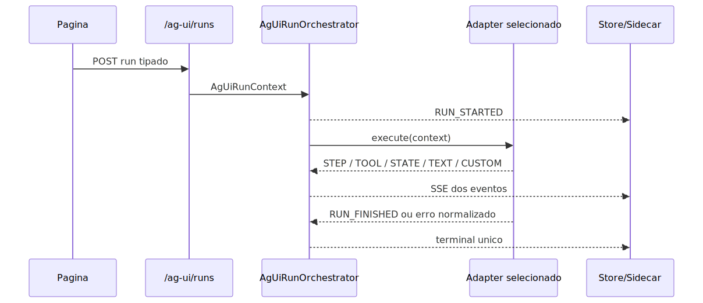

# Manual tecnico, operacional e de uso: implementacao de AG-UI no repositorio

## 1. Superficie implementada

O slice AG-UI deste repositorio e composto por um boundary HTTP FastAPI, um conjunto de modelos Pydantic estritos, um orchestrator de lifecycle, um registry explicito de adapters, um event store com provider canonico e sanitizacao, um runtime compartilhado em JavaScript puro e um conjunto de paginas demo de varejo que exercitam o contrato.

O recorte executavel confirmado no codigo inclui estas superficies publicas.

1. GET /ag-ui/capabilities.
2. POST /ag-ui/runs.
3. GET /ag-ui/runs/{run_id}/events.
4. GET /ag-ui/threads/{thread_id}/events.

O recorte executavel confirmado do lado web inclui estas superficies de reuso.

1. packages/ag-ui-runtime/index.js.
2. app/ui/static/js/vendor/prometeu-ag-ui-runtime.browser.js.
3. app/ui/static/js/shared/ag-ui-client.js.
4. app/ui/static/js/shared/ag-ui-state-store.js.
5. app/ui/static/js/shared/ag-ui-sidecar-chat.js.
6. app/ui/static/js/shared/ag-ui-dashboard-renderer.js.
7. app/ui/static/js/shared/ag-ui-dashboard-validator.js.
8. app/ui/static/js/shared/ag-ui-retail-demo-page.js.

Existe uma segunda superficie de consumo AG-UI no frontend, **independente do stream `/ag-ui/runs`**: a renderizacao de specs que chegam no **corpo da resposta** dos endpoints de chat (`/rag/execute`, `/agent/execute`). Ela e usada pelo componente global de chat embutivel e suas hosts. As superficies de reuso desse caminho sao:

1. app/ui/static/js/shared/embeddable-chat-spec-runtime.js (deteccao de spec + registry de renderizadores + renderer de Capacidades).
2. app/ui/static/js/shared/ag-ui-spec-render-bridge.js (ponte ESM que liga os renderizadores oficiais ao componente UMD).
3. app/ui/static/js/shared/ag-ui-chart-adapter.js + ag-ui-chart-adapter-apexcharts.js (porta de grafico neutra + adapter ApexCharts).
4. src/api/schemas/ag_ui_capabilities_models.py (contrato fail-closed do **CapabilitiesSpec**).
5. src/agentic_layer/tools/system_tools/describe_capabilities.py (tool builtin `descrever_capacidades`, auto-injetada em todo supervisor DeepAgent).

Os tres specs reconhecidos nessa superficie sao CapabilitiesSpec (painel de capacidades), DashboardSpec (dashboard dinamico) e UISpec (interface generica). Ativacao, ordem de scripts e estado por host estao no [guia do componente embutivel](../usuario/GUIA-COMPONENTE-WEBCHAT-EMBUTIVEL.md) — incluindo o status atual: `ui-webchat-v3.html` tem o wiring AG-UI **ativo** desde 2026-06-10 (Fase B), com gate falha-fechada que exige o spec runtime resolvido. A porta de grafico esta detalhada em [Registry e adapters](README-TECNICO-AG-UI-REGISTRY-E-ADAPTERS.md).

O tutorial de entrada para quem vai configurar AG-UI pela primeira vez (como fazer o agente devolver dashboard via YAML, os tres specs, bind de campos, FAQ) esta em [TUTORIAL-101-GENERATIVE-UI.md](../usuario/TUTORIAL-101-GENERATIVE-UI.md).

Detalhamento técnico por etapa:

1. [Fronteira de protocolo](README-TECNICO-AG-UI-FRONTEIRA-DE-PROTOCOLO.md)
2. [Borda HTTP dedicada](README-TECNICO-AG-UI-BORDA-HTTP-DEDICADA.md)
3. [Orquestração do lifecycle](README-TECNICO-AG-UI-ORQUESTRACAO-DO-LIFECYCLE.md)
4. [Registry e adapters](README-TECNICO-AG-UI-REGISTRY-E-ADAPTERS.md)
5. [Domínio varejo demo](README-TECNICO-AG-UI-DOMINIO-VAREJO-DEMO.md)
6. [Runtime compartilhado do frontend](README-TECNICO-AG-UI-RUNTIME-COMPARTILHADO-DO-FRONTEND.md)
7. [Replay e auditoria](README-TECNICO-AG-UI-REPLAY-E-AUDITORIA.md)

Como **configurar por YAML** um agente que responde com gráficos (as 3 peças — regra de roteamento no prompt do supervisor, subagente com `response_format` DashboardSpec 1.0 e renderização automática no frontend), com o demo varejo como exemplo comentado: capítulo [35. AG-UI no YAML](README-CONFIGURACAO-YAML.md#35-ag-ui-no-yaml-respostas-com-gráficos-generative-ui--exemplo-real-do-demo-varejo) do manual de configuração YAML.

## 1A. Contrato de geração do spec no caminho do chat embutível

Esta seção detalha como um spec AG-UI nasce no backend e chega ao componente `PrometeuEmbeddableChatRuntime` (Superfície A). Difere do fluxo `/ag-ui/runs` (Superfície B, SSE) em transporte, ciclo de vida e configuração.

### 1A.1. Como o DashboardSpec é gerado via `response_format`

O mecanismo é a instrução `response_format` em JSON Schema aplicada a um subagente dentro de um supervisor DeepAgent. Essa instrução força a LLM a devolver a resposta inteiramente como JSON válido segundo o esquema fornecido, sem texto antes, sem markdown.

O ciclo de vida completo:

1. O usuário envia uma pergunta pelo chat embutível (`/rag/execute` ou `/agent/execute`).
2. O supervisor DeepAgent roteia a pergunta para o subagente especializado em dashboard.
3. A LLM do subagente gera o JSON do DashboardSpec 1.0 conforme o `response_format` declarado no YAML.
4. O backend devolve o JSON no corpo da resposta HTTP normal (sem stream, sem SSE).
5. O componente recebe a resposta já normalizada.
6. `embeddable-chat-spec-runtime.js` executa `detectAgUiSpec(payload)`: procura o spec na raiz e em chaves container (`ag_ui`, `structured`, `data`, `result`); classifica como `dashboard` se encontrar `version: "1.0"` + `widgets`.
7. O spec passa pelo validador fail-closed de DashboardSpec (`ag-ui-dashboard-validator.js`).
8. Se válido, o renderer de DashboardSpec (`ag-ui-dashboard-renderer.js`) monta o DOM — widgets, gráficos (ApexCharts), KPIs, tabelas, rankings — na bolha do assistente.
9. Qualquer falha em qualquer etapa acima aciona o fallback: o componente exibe o conteúdo como texto. A tela nunca quebra.

O contrato das 3 peças obrigatórias no YAML do subagente:

- `prompt`: instrui a LLM a devolver JSON puro, sem texto extra, sem markdown, proibindo HTML/JS/CSS/SQL livre.
- `tools`: lista apenas as queries `dyn_sql` aprovadas (o subagente não pode executar SQL arbitrário).
- `response_format`: JSON Schema com `const: "1.0"` no campo `version` e os campos obrigatórios do DashboardSpec (`version`, `title`, `layout`, `widgets`, `dataSources`, `narrative`, `refreshPolicy`, `safety`).

Exemplo real desta estrutura em producao: `app/yaml/rag-config-pdv-vendas-demo.yaml`, subagente `subdominio_dashboard_dinamico` (linhas 504-606+).

### 1A.2. Como o CapabilitiesSpec é gerado

O CapabilitiesSpec nao exige configuracao especial no YAML. A tool builtin `descrever_capacidades` (em `src/agentic_layer/tools/system_tools/describe_capabilities.py`) e **auto-injetada em todo supervisor DeepAgent**. Quando o usuario pergunta sobre as capacidades do agente, o supervisor chama essa tool, que le os subagentes declarados em `multi_agents[]` e monta o CapabilitiesSpec a partir dos campos `name` e `description` de cada subagente.

O spec e emitido como resposta normal do endpoint de chat. O componente detecta o marcador `specType: "capabilities"` (constante `SPEC_TYPE_CAPABILITIES` em `embeddable-chat-spec-runtime.js`), valida e renderiza o painel de capacidades.

Guardrails do CapabilitiesSpec: quatro flags de segurança (`htmlAllowed`, `scriptAllowed`, `sqlAllowed`, `secretsAllowed`) devem ser todas `false`; o validador fail-closed rejeita o spec se qualquer flag vier diferente. O backend usa `src/api/schemas/ag_ui_capabilities_models.py` para garantir o contrato antes de emitir.

### 1A.3. O campo `multi_agents[].ag_ui.ui_specs` (implementado, sem uso exercitado)

Os modelos internos (AST, validators, compilacao) reconhecem um campo `ag_ui.ui_specs` por subagente que permitiria declarar specs de interface diretamente no YAML por subagente. Ao verificar o repositorio em 2026-06-12, **nenhum arquivo YAML no projeto usa esse campo**. Esta implementado no codigo mas nao exercitado por nenhum exemplo real. O caminho comprovado e operacional hoje e o `response_format` descrito em 1A.1.

### 1A.4. Deteccao no frontend: como o componente decide o tipo do spec

O modulo `embeddable-chat-spec-runtime.js` executa `detectAgUiSpec(payload)` em cada resposta. A funcao:

1. Verifica se o payload e um objeto plano.
2. Monta uma lista de candidatos: o proprio payload + o conteudo de chaves container convencionais (`ag_ui`, `agUi`, `agui`, `structured`, `ui_spec`, `uiSpec`, `spec`, `data`, `result`).
3. Chama `classifyCandidate(candidato)` em cada um, que retorna `{ type, spec }` ou `null`.
4. Retorna o primeiro que casar. Se nenhum casar, retorna `null` e o componente renderiza texto.

`classifyCandidate` identifica o tipo por:
- `specType === 'capabilities'` → CapabilitiesSpec.
- presenca de `version` + `widgets` em formato esperado → DashboardSpec.
- marcadores do UISpec → UISpec.

Esse mecanismo nao inventa contrato de backend — apenas detecta padroes conhecidos na resposta normalizada, qualquer que seja o container que o backend usou.

## 2. Endpoints publicos

### 2.1. GET /ag-ui/capabilities

Objetivo: discovery das capabilities expostas por executionKind.

Caracteristicas confirmadas.

1. Usa a mesma permissao de execucao do run AG-UI.
2. Pode filtrar por executionKind.
3. Falha com 404 para executionKind desconhecido.
4. Nao expõe SQL cru, DSN ou segredo.

No estado atual, o discovery inclui executionKind deepagent, workflow, retail_demo e erp_backoffice_demo. O supervisor classico `agent` foi desligado no boundary AG-UI publico. O payload agora e versionado e explicita `contractVersion`, `eventContractVersion`, `supportsInterrupt`, `supportsHil`, `supportsResume`, `resumeSchema`, `domain`, `requiredPermissions`, `examples`, `uiSpecs` estruturado e `uiSpecNames` como ponte de compatibilidade. Os dominios governados agora saem de um registry comum de capability packs, o que evita hardcode duplicado no discovery e no runtime.

Este endpoint continua sendo o catalogo de negocio Plataforma de Agentes de IA. Ele responde a pergunta "o que este tenant pode pedir ao produto". Ele nao tenta espelhar sozinho o shape oficial `AgentCapabilities` do SDK AG-UI.

### 2.2. Discovery oficial continua centralizado em GET /ag-ui/capabilities

Objetivo: publicar no mesmo payload de discovery o catalogo de negocio e os metadados AG-UI necessarios para frontend, exemplos, resume e `UISpecs` governadas.

Caracteristicas confirmadas.

1. Usa a mesma permissao de execucao do run AG-UI.
2. Entrega metadados suficientes para o frontend e para integradores mapearem seus contratos sem uma segunda rota publica.
3. DeepAgent, Workflow e capability packs governados aparecem no mesmo catalogo canônico.
4. Nao inventa HIL, resume, tools ou `UISpec` fora do suporte real do runtime.

Na pratica, o produto responde discovery e metadados AG-UI no mesmo endpoint canônico, sem discovery paralelo por `agent_id`.

### 2.3. POST /ag-ui/runs

Objetivo: iniciar ou continuar um run AG-UI publico por streaming SSE usando `AgUiRunRequest` oficial.

Caracteristicas confirmadas.

1. Responde com text/event-stream.
2. Devolve X-Correlation-Id no header.
3. Exige autenticacao por X-API-Key ou sessao.
4. Exige fonte de configuracao explicita por `yaml_config`, `yaml_inline_content` ou `encrypted_data`.
5. Deriva o runtime pelo YAML e falha fechado em ambiguidade.
6. Rejeita `executionKind` divergente e segredos fora do contrato.

Este e o caminho publico novo para integracoes de terceiros. O cliente externo confiavel envia o envelope canônico, a plataforma resolve autenticacao e runtime pelo YAML e o browser nao precisa inventar selecao paralela por `agent_id`.

### 2.4. Rotas públicas por agent_id foram removidas

Objetivo: manter um único boundary de execução e discovery, sem identidade paralela por URL.

Caracteristicas confirmadas.

1. A OpenAPI publica nao expõe execucao por `agent_id`.
2. A OpenAPI publica nao expõe capabilities por `agent_id`.
3. Novas integrações usam apenas `/ag-ui/runs` e `/ag-ui/capabilities`.
4. O contrato antigo deixou de ser superfície pública recomendada ou suportada.

### 2.5. GET /ag-ui/runs/{run_id}/events

Objetivo: replay ordenado e sanitizado dos eventos de um run.

Caracteristicas confirmadas.

1. Escopo run.
2. Ordenacao por sequence.
3. Payload sanitizado antes da devolucao.

### 2.6. GET /ag-ui/threads/{thread_id}/events

Objetivo: replay ordenado da thread inteira, nao apenas de um run.

Caracteristicas confirmadas.

1. Escopo thread.
2. Ordenacao monotona por run e sequence.
3. Mesmo controle de autenticacao e sanitizacao.

## 3. Contrato do request

O contrato publico novo e `AgUiRunRequest`, recebido em `POST /ag-ui/runs`.

Campos relevantes confirmados.

1. threadId.
2. runId.
3. executionKind.
4. user_email.
5. parentRunId.
6. input.
7. metadata.
8. yaml_config.
9. yaml_inline_content.
10. encrypted_data.
11. resume.

No boundary Plataforma de Agentes de IA, o corpo precisa trazer uma fonte de configuracao explicita e um `input` compativel com o runtime derivado. Campos internos como `securityKeys`, `toolsLibrary`, DSN, SQL livre ou qualquer seletor paralelo de runtime sao bloqueados.

O bloqueio nao vale apenas para o topo do JSON. O backend tambem rejeita chaves internas quando aparecem escondidas dentro de `input`, `metadata` ou blocos aninhados. Isso impede que uma integracao externa tente transportar YAML, tenant ou segredo por um campo aparentemente generico.

### 3.1. Exemplo minimo de AgUiRunRequest em backend confiavel

Este e o formato canônico que um backend confiavel envia para `POST /ag-ui/runs`. Pode ser o backend do integrador, um backend-for-frontend ou o proprio backend da plataforma. O browser puro nao deve enviar esse YAML diretamente.

```json
{
  "threadId": "orcamentos",
  "runId": "orcamentos-1714720000000",
  "user_email": "operacao@cliente.exemplo",
  "input": {
    "message": "Resuma os pedidos pendentes."
  },
  "metadata": {
    "surface": "portal-terceiro"
  },
  "yaml_inline_content": "<yaml-governado-no-servidor>"
}
```

Endpoint correspondente:

```text
POST /ag-ui/runs
```

Na pratica, quem envia `yaml_config`, `yaml_inline_content` ou `encrypted_data` e sempre um boundary confiavel. O browser publico fala com um backend autenticado, mas nao carrega YAML cru, `tools_library`, `tenantId`, `securityKeys` nem segredos.

### 3.1.1. Exemplo de RunAgentInput publico no backend do integrador

Quando existe um backend-for-frontend proprio, o browser pode montar um payload local compativel com o template third-party. Esse envelope nao substitui `AgUiRunRequest`; ele precisa ser convertido no servidor antes da chamada produtiva para `/ag-ui/runs`.

```json
{
  "threadId": "orcamentos",
  "runId": "orcamentos-1714720000000",
  "state": {},
  "messages": [
    {
      "id": "msg-user-1",
      "role": "user",
      "content": "Resuma os pedidos pendentes."
    }
  ],
  "tools": [],
  "context": [],
  "forwardedProps": {
    "metadata": {
      "surface": "portal-terceiro"
    }
  }
}
```

Endpoint correspondente:

```text
POST /api/ag-ui/runs
```

Na pratica, o browser nao envia `yaml_config`, `yaml_inline_content`, `encrypted_data`, `executionKind`, `tenantId`, `securityKeys` nem `toolsLibrary` para a plataforma. Se existir um backend-for-frontend, a fonte de configuracao continua entrando apenas no servidor confiavel. Tambem nao entram tools internas da plataforma no payload publico.

### 3.1.2. Exemplo de frontend tool permitida

O formato abaixo so e valido quando o discovery da capability devolver a mesma tool em `frontendTools`. Sem esse contrato publico previo, o backend rejeita o request.

```json
{
  "threadId": "orcamentos",
  "runId": "orcamentos-1714720000001",
  "state": {},
  "messages": [
    {
      "id": "msg-user-1",
      "role": "user",
      "content": "Mostre o resumo de vendas."
    }
  ],
  "tools": [
    {
      "name": "abrir_painel_vendas",
      "description": "Abre painel visual de vendas no frontend.",
      "parameters": {
        "type": "object",
        "properties": {},
        "additionalProperties": false
      }
    }
  ],
  "context": [],
  "forwardedProps": {
    "capability": "sales_summary",
    "parameters": {
      "p1": "2026-05-01T00:00:00Z",
      "p2": "2026-05-02T00:00:00Z"
    }
  }
}
```

Esse exemplo nao autoriza SQL nem infraestrutura no browser. A tool e apenas uma declaracao de interface; as `platform_tools` reais continuam resolvidas no backend pelo YAML governado e pelo catalogo interno.

## 3.2. Contrato antigo por agent_id foi removido

O produto nao mantem mais um envelope publico separado para URL por `agent_id`. Clientes que ainda tenham esse desenho precisam migrar para `AgUiRunRequest` em `POST /ag-ui/runs`, com fonte explicita de configuracao e sem contrato paralelo de discovery.

### 3.2.2. Exemplo historico de resume no envelope legado

```json
{
  "threadId": "orcamentos",
  "runId": "orcamentos-resume-1",
  "executionKind": "workflow",
  "user_email": "aprovador@empresa.com",
  "parentRunId": "orcamentos-1",
  "input": {
    "message": "Continuar"
  },
  "yaml_config": {
    "workflows": []
  },
  "resume": [
    {
      "interruptId": "interrupt-1",
      "status": "resolved",
      "payload": {
        "decisions": [
          {
            "type": "approve"
          }
        ]
      }
    }
  ]
}
```

No estado atual, esse exemplo serve apenas para entender o shape historico que precisa ser migrado. A retomada ativa do boundary AG-UI deve usar o mesmo `POST /ag-ui/runs` da superficie publica.

```json
{
  "threadId": "orcamentos",
  "runId": "orcamentos-resume-2",
  "executionKind": "workflow",
  "user_email": "aprovador@empresa.com",
  "yaml_config": {
    "workflows": []
  },
  "resume": [
    {
      "interruptId": "interrupt-1",
      "status": "resolved",
      "payload": {
        "decisions": [
          {
            "type": "edit",
            "editedPayload": {
              "approved_limit": 15000,
              "reason": "ajuste manual"
            }
          }
        ]
      }
    }
  ]
}
```

### 3.2.3. Exemplo de dashboard dinamico legado

```json
{
  "threadId": "dashboard-dinamico",
  "runId": "dashboard-dinamico-1",
  "executionKind": "retail_demo",
  "user_email": "diretoria@empresa.com",
  "input": {
    "message": "Monte um painel executivo",
    "capability": "dashboard_dynamic",
    "dashboardSpec": {
      "version": "1.0",
      "title": "Painel executivo",
      "layout": {
        "kind": "grid",
        "columns": 12,
        "rowHeight": 120,
        "gap": 12
      },
      "widgets": [],
      "dataSources": [],
      "narrative": {
        "summary": "Exemplo",
        "insights": ["Exemplo"]
      },
      "refreshPolicy": {
        "mode": "manual",
        "maxAgeSeconds": 300
      },
      "safety": {
        "htmlAllowed": false,
        "scriptAllowed": false,
        "freeSqlAllowed": false,
        "secretsAllowed": false,
        "correlationIdAllowed": false
      }
    }
  },
  "yaml_inline_content": "schema_version: \"1.0.0\"\n..."
}
```

## 4. Contrato dos eventos

Os eventos oficiais ficam em src/api/schemas/ag_ui_models.py. O conjunto confirmado por leitura de codigo e testes inclui lifecycle, mensagens, steps, tools, snapshots, deltas, custom events e outcome interrupt.

### 4.1. Eventos mais relevantes para a UI

1. RUN_STARTED.
2. RUN_FINISHED.
3. RUN_ERROR.
4. STEP_STARTED.
5. STEP_FINISHED.
6. TEXT_MESSAGE_START.
7. TEXT_MESSAGE_CONTENT.
8. TEXT_MESSAGE_END.
9. TOOL_CALL_START.
10. TOOL_CALL_ARGS.
11. TOOL_CALL_END.
12. TOOL_CALL_RESULT.
13. STATE_SNAPSHOT.
14. STATE_DELTA.
15. CUSTOM.

### 4.2. Outcome interrupt

O contrato nao cria um evento inventado so para HIL. Ele usa RUN_FINISHED com outcome.type = interrupt e interrupts[]. Isso e importante porque o terminal do run continua unico e tipado.

### 4.3. JSON Patch suportado

O backend aceita delta com add, remove, replace, move, copy e test. O store do frontend foi alinhado para suportar o mesmo conjunto.

## 5. Sequencia real de execucao



Esse fluxo mostra a separacao central da implementacao. O router monta contexto. O orchestrator governa lifecycle. O adapter produz dominio. O frontend so consome eventos.

## 6. Registry e orchestrator

O registry fica em src/api/services/ag_ui_adapter_registry.py. Ele existe para evitar fallback implicito ou wiring hardcoded espalhado. O default registra quatro executionKinds.

1. deepagent.
2. workflow.
3. retail_demo.
4. erp_backoffice_demo.

Se um executionKind nao estiver registrado, o orchestrator termina com erro estruturado. O core nao inventa adapter.

O orchestrator fica em src/api/services/ag_ui_run_orchestrator.py e tem responsabilidades bem delimitadas.

1. Emitir RUN_STARTED.
2. Repassar eventos do adapter.
3. Persistir eventos se houver event store.
4. Bloquear adapters que tentem emitir RUN_STARTED de novo.
5. Encerrar automaticamente com success quando o adapter nao emite terminal.
6. Traduzir excecoes controladas e inesperadas para RUN_ERROR.

## 7. Adapters agentic suportados

### 7.1. deepagent

O adapter deepagent usa DeepAgentSupervisor, expoe `CompiledStateGraph` e delega a execucao padrao para `LangGraphAgent` do pacote `ag-ui-langgraph`. O resume reutiliza o mecanismo de continuidade agentic suportado pelo helper comum.

### 7.2. workflow

O adapter workflow usa `Workflowagent`, obtem o `CompiledStateGraph` do runtime inicializado e delega a execucao padrao para `LangGraphAgent`. Falhas viram RUN_ERROR pelo orquestrador AG-UI. O resume AG-UI continua suportado por um executor de continuidade dedicado, que valida `interruptId`, traduz `decisions` estruturadas para o contrato oficial de workflow e chama o service canonico de continuacao antes de reemitir eventos AG-UI normalizados. Esse contrato agora preserva `approve`, `reject`, `cancel` e `edit` com `edited_payload`, em vez de achatar tudo para string.

### 7.3. retail_demo

Esse adapter continua sendo o mais rico em termos de dominio visual pronto. Agora ele e entregue como capability pack governado, consumido pelo registry AG-UI comum, e continua suportando query governada e dashboard dinamico.

### 7.4. erp_backoffice_demo

Esse dominio foi adicionado como segundo capability pack governado. Ele publica as capabilities `fechar_caixa` e `conferir_turno_caixa`, ambas baseadas no contrato de procedimento `prc_fechar_caixa` ja documentado no repositório, mas executadas como fixtures seguras de preview para nao depender de DSN nem inventar schema de banco fora do contrato lido.

## 8. Capability packs governados

### 8.0. Decisao arquitetural

`capability_pack` nao e uma quarta espinha dorsal da plataforma. Em linguagem simples: ele nao cria uma familia nova de runtime ao lado de DeepAgent, Workflow e ETL. Ele e um adaptador AG-UI unico usado para expor aceleradores de dominio governados pelo backend.

Na pratica, os packs atuais `retail_demo` e `erp_backoffice_demo` sao aceleradores governados. Eles aparecem no discovery publico de AG-UI com `executionKind=capability_pack`, `surfaceKind=capability_pack` e `officialRuntime=false`. Isso significa que podem emitir eventos AG-UI e ser chamados pelo endpoint `/ag-ui/runs`, mas nao substituem os runtimes oficiais YAML-backed de DeepAgent e Workflow.

Essa separacao evita um erro arquitetural comum: tratar cada demo como se fosse um runtime produtivo independente. O runtime produtivo continua vindo do YAML e dos adapters canônicos `deepagent` e `workflow`. O capability pack atual so pode executar capabilities fechadas, previamente aprovadas no codigo ou em contrato lido no repositorio, sem receber SQL livre, DSN, procedure livre ou segredo vindo do browser.

Se um pack deixar de ser acelerador e passar a ser runtime produtivo de primeira classe, ele precisa ser promovido explicitamente para contrato equivalente aos runtimes YAML-backed. Isso exige AST/YAML governado, seguranca, logs, replay, HIL/resume quando aplicavel, testes de contrato e registro proprio no adapter registry. Enquanto isso nao acontecer, a classificacao correta e: acelerador governado, nao nova espinha dorsal.

### 8.1. retail_demo

O catalogo de capabilities fechadas do retail_demo inclui estas entradas.

1. sales_summary.
2. checkout_funnel.
3. catalog_opportunities.
4. customer_segments.
5. dashboard_dynamic.

As protecoes tecnicas confirmadas nesse adapter sao essenciais.

1. Chaves como sql, raw_sql, sql_query e statement sao bloqueadas recursivamente.
2. Cada capability aponta para uma query aprovada.
3. Cada query e validada como read-only, com exatamente uma instrucao SELECT.
4. Parametros sao validados contra o catalogo da capability.
5. DATABASE_VAREJO_DSN e DATABASE_VAREJO_SCHEMA sao obrigatorios.

Isso significa que o browser nunca escolhe conexao, nunca injeta DSN e nunca manda SQL livre para execucao.

### 8.2. erp_backoffice_demo

O catalogo inicial do pack ERP/backoffice inclui duas capabilities governadas.

1. fechar_caixa.
2. conferir_turno_caixa.

As protecoes tecnicas confirmadas nesse pack sao estas.

1. Chaves como sql, raw_sql, sql_query e statement sao bloqueadas recursivamente.
2. O discovery publica apenas o contrato do procedimento, sem expor `CALL`, segredo ou DSN.
3. O resultado atual e uma fixture governada de preview baseada no contrato `prc_fechar_caixa` lido no repositório.
4. As duas superficies administrativas existentes usam capabilities publicas diferentes, mas continuam no mesmo pack governado e no mesmo procedimento homologado.
4. Os parametros `p1` e `p2` continuam obrigatorios e escalares.

### 8.3. Como uma software house cria um pack seguro

O caminho seguro agora e este.

1. Definir um `execution_kind` exclusivo para o dominio.
2. Publicar capabilities com `inputSchema`, `examples`, `requiredPermissions` e `uiSpecs` sem vazar SQL, DSN ou segredos.
3. Bloquear SQL livre logo na entrada do payload AG-UI, antes de qualquer executor.
4. Executar apenas query, procedure ou fixture previamente aprovada no codigo ou em contrato real do repositório.
5. Registrar o pack no registry comum. Discovery e runtime passam a enxergar o novo dominio pelo mesmo ponto de registro.

## 9. Dashboard dinamico

### 9.1. Rota especial do retail_demo

Quando capability = dashboard_dynamic, o adapter nao segue o fluxo padrao de dyn_sql unico. Em vez disso, ele desvia para DashboardMaterializationService.

### 9.2. Eventos customizados emitidos

Os eventos customizados agora seguem o `eventPrefix` do `uiNamespace`. Quando o dashboard usa o namespace default de compatibilidade, os eventos continuam exatamente estes.

1. retail.dashboard.spec.started.
2. retail.dashboard.spec.validated.
3. retail.dashboard.data.bound.
4. retail.dashboard.widget.added.
5. retail.dashboard.render.ready.
6. retail.dashboard.validation.failed.

### 9.3. Estado inicial e estado final

O service sempre comeca com um `STATE_SNAPSHOT` na chave definida por `uiNamespace.stateKey`. No default compatível, essa chave continua sendo `retailDashboard`. Em caso de sucesso, o estado termina com `status=ready`. Em caso de falha de validacao, termina com `validation_failed` e `errors` estruturados.

### 9.4. Contrato da DashboardSpec

Os blocos estruturais confirmados sao estes.

1. version = 1.0.
2. layout grid.
3. widgets tipados.
4. dataSources com sourceType dyn_sql.
5. narrative.
6. refreshPolicy.
7. safety com cinco flags obrigatoriamente false.
8. uiNamespace com `specType`, `stateKey`, `eventPrefix` e `version`.

### 9.5. Tipos de widget confirmados

1. kpi.
2. line_chart.
3. bar_chart.
4. donut_chart.
5. table.
6. insight_card.
7. alert.
8. timeline.
9. ranking.

### 9.6. Regras de validacao mais importantes

1. Rejeicao de HTML e script.
2. Rejeicao de SQL ou query livre em strings ou chaves.
3. Rejeicao de segredos e correlation_id no payload.
4. Rejeicao de widget apontando para data source inexistente.
5. Rejeicao de parametro nao declarado em allowedParameters.
6. Rejeicao de layout impossivel ou sobreposicao de widgets.

## 10. Runtime compartilhado do frontend

### 10.0. Component Catalog da Plataforma de Agentes de IA

O Component Catalog da Plataforma de Agentes de IA define quais componentes de UI generativa podem ser renderizados com segurança. Em linguagem simples, ele funciona como uma lista permitida: se um componente, uma action, um binding ou uma prop nao estiver no catalogo, a UI nao trata o payload como verdadeiro e nao renderiza.

O codigo fica em app/ui/static/js/shared/ag-ui-component-catalog.js e e reexportado pelo pacote @prometeu/ag-ui-runtime. O fluxo protegido e este.

1. validatePrometeuComponentCatalog valida o catalogo antes de uso.
2. PrometeuComponentRegistry carrega somente catalogo valido.
3. validateComponentSpec valida componentId, props, actions e bindings antes de renderizar.
4. buildCustomEvent emite a spec validada em evento AG-UI CUSTOM schemaado com name prometeu.component.render.
5. app/ui/static/js/shared/ag-ui-safe-content.js bloqueia HTML, script, SQL livre, segredos e correlation_id tanto no DashboardSpec quanto no ComponentCatalog.

Isso evita dois problemas comuns. Primeiro, impede que um agente envie um componente desconhecido e a tela tente adivinhar como renderizar. Segundo, impede que actions ou bindings virem atalhos escondidos para HTML, SQL, segredo ou dado interno.

Checklist minimo para cadastrar componente novo com seguranca:

1. Registrar o componente no Component Catalog da Plataforma de Agentes de IA.
2. Validar o catalogo com `validatePrometeuComponentCatalog`.
3. Garantir props, actions e bindings em allowlist explicita.
4. Cobrir o cadastro com teste frontend do catalogo ou renderer.
5. Cobrir o fluxo backend com teste de `DashboardSpec` validada ou materializacao segura.

### 10.1. Cliente SSE via POST

createAgUiSseClient faz fetch POST, nao EventSource tradicional. Esse ponto e importante porque o contrato exige corpo JSON no request. No pacote `@prometeu/ag-ui-runtime`, esse cliente agora e uma fachada fina sobre `@ag-ui/client`: o transporte usa eventos HTTP e o parsing do stream passa por `transformHttpEventStream`, que e o parser oficial do SDK JS.

O wrapper Plataforma de Agentes de IA ainda preserva as necessidades da plataforma: monta headers por helper compartilhado, injeta X-API-Key quando presente, le X-Correlation-Id de volta e nao gera correlation_id no browser.

O comportamento confirmado em teste mostra tambem que o cliente nao tenta reconectar por padrao. Isso evita replay implicito de POST, o que seria perigoso em execucao agentic.

### 10.2. Store de estado

createAgUiStateStore reconstrui o estado local da UI. Ele guarda run, messages, tools, state, activities, steps, interrupts, rawEvents, customEvents e lastEvent. Ele tambem aplica JSON Patch completo, inclusive move, copy e test.

### 10.3. Sidecar reutilizavel

createAgUiSidecarChat monta um aside com status, correlation_id, contexto, mensagens, tools, interrupcoes e formulario de envio. Ele integra o painel HIL compartilhado e pode postar resume AG-UI no mesmo endpoint, com protecao contra decisao duplicada pelo mesmo interruptId.

### 10.4. Fachada interna de pacote

packages/ag-ui-runtime/index.js reexporta o runtime compartilhado, fornece getHilContract(), expõe createPrometeuAgUiOfficialClient() e reexporta tipos oficiais de @ag-ui/core. O sidecar criado por esse pacote usa o cliente oficial por padrao quando o consumidor nao injeta um client customizado. Para o browser estático, o repositório agora gera o artefato versionado `app/ui/static/js/vendor/prometeu-ag-ui-runtime.browser.js`, e `app/ui/static/js/shared/ag-ui-client.js` ficou apenas como fachada fina sobre esse bundle. Isso facilita reuso interno sem obrigar as paginas a importar sempre a arvore inteira de arquivos em app/ui/static/js/shared.

O pacote tambem expõe helpers da Plataforma de Agentes de IA em packages/ag-ui-runtime/prometeu-helpers.js e o Component Catalog da Plataforma de Agentes de IA em app/ui/static/js/shared/ag-ui-component-catalog.js. Os helpers cobrem auth, agent id, tenant, replay, diagnostics, catalog mapping e frontend tools. O catalogo cobre components, actions, bindings e props permitidas. Nenhum desses modulos cria parser de protocolo AG-UI proprio; eles apenas organizam detalhes da plataforma ao redor do SDK oficial.

## 11. Paginas reais do repositorio

Os testes de contrato e Playwright confirmam que a implementacao nao vive apenas em componentes isolados. Ela aparece em paginas estaticas reais.

### 11.1. Hub de varejo demo

O hub AG-UI de varejo lista quatro telas.

1. Cockpit de vendas.
2. Checkout radar.
3. Catalogo central.
4. Dashboard dinamico.

Os testes tambem confirmam que essas paginas usam o endpoint `/ag-ui/runs`, o bundle browser oficial versionado, o layout mestre da plataforma e o shell administrativo, sem acoplamento ao webchat legado.

### 11.2. Controller compartilhado das paginas

AgUiRetailDemoPageController concentra padroes comuns das paginas fixas.

1. Resolve API key do contexto padrao.
2. Exige user_email no contexto.
3. Exige YAML inline ou payload criptografado no contexto.
4. Monta threadId, runId, metadata e input padronizados.
5. Usa executionKind = retail_demo.
6. Atualiza a area principal a partir de STATE_SNAPSHOT.

Isso mostra que o frontend das demos ja foi desenhado como padrao de integracao, nao como paginas totalmente independentes.

## 12. Replay e event store

O event store AG-UI agora funciona por provider canônico.

1. Em development e teste, sem configuracao explicita, o replay usa InMemoryAgUiEventStore.
2. Fora de development/test, o provider precisa ser declarado explicitamente por AG_UI_EVENT_STORE_PROVIDER.
3. O provider duravel suportado hoje e postgres, persistindo em ag_ui.run_events.
4. Sem provider explicito fora de development/test, o backend falha fechado e nao cai silenciosamente para memoria.

O store tem caracteristicas importantes.

1. Thread-safe.
2. Append-only.
3. Ordenacao por sequence.
4. Idempotencia por run_id + sequence quando o payload e identico.
5. Erro explicito quando a mesma sequence chega com payload divergente.
6. Sanitizacao recursiva de campos sensiveis antes do replay.
7. Indexacao preparada para tenant_id quando o boundary autenticado trouxer esse contexto.

Campos como api_key, authorization, password, secret, token, dsn, connection string, database URL, encrypted_data, correlation_id interno e chaves de SQL livre (`sql`, `raw_sql`, `sql_query`, `statement`) sao redigidos para [REDACTED].

### 12.1. Variaveis do provider AG-UI

As variaveis operacionais confirmadas no codigo agora sao estas.

1. ENVIRONMENT.
2. AG_UI_EVENT_STORE_PROVIDER.
3. AG_UI_EVENT_STORE_DSN.
4. AG_UI_EVENT_STORE_SCHEMA.
5. AG_UI_EVENT_STORE_TABLE.
6. AG_UI_EVENT_STORE_POOL_MIN_SIZE.
7. AG_UI_EVENT_STORE_POOL_MAX_SIZE.
8. AG_UI_EVENT_STORE_POOL_MAX_IDLE.
9. AG_UI_EVENT_STORE_POOL_TIMEOUT_SECONDS.
10. AG_UI_EVENT_STORE_RETRY_ATTEMPTS.
11. AG_UI_EVENT_STORE_RETRY_MIN_SECONDS.
12. AG_UI_EVENT_STORE_RETRY_MAX_SECONDS.

Em linguagem simples, development/test pode continuar usando memoria para velocidade local. Produção e ambientes equivalentes nao podem depender disso. Nesses casos, AG_UI_EVENT_STORE_PROVIDER precisa estar configurado e o DSN do PostgreSQL precisa existir, senao o router AG-UI falha de forma explicita.

### 12.2. Tabela duravel e retencao

O provider PostgreSQL persiste o replay em ag_ui.run_events, criado pelo DDL scripts/sql/20260503_create_ag_ui_schema.sql.

Essa tabela guarda tenant_id opcional, correlation_id, thread_id, run_id, sequence, event_type, payload sanitizado e created_at. O indice unico run_id + sequence protege idempotencia de escrita. Indices por thread, correlation_id, tenant_id e event_type protegem replay e suporte operacional.

No estado atual, a retencao nao tem TTL automatico no proprio adapter. Em termos práticos, o replay fica duravel ate que a operacao aplique politica de limpeza do banco. Isso e intencional nesta etapa: primeiro o slice deixa de perder historico em restart e replica; depois a politica de expurgo pode ser acoplada sem reabrir o contrato do event store.

### 12.3. Falhas esperadas

Os erros esperados do provider canônico agora sao estes.

1. Fora de development/test, AG_UI_EVENT_STORE_PROVIDER ausente ou invalido falha fechado.
2. Com provider postgres, AG_UI_EVENT_STORE_DSN ausente falha fechado.
3. Duplicidade de run_id + sequence com payload divergente falha explicitamente.
4. Payload persistido invalido ou nao JSON object falha explicitamente.
5. Falha de escrita no provider vira RUN_ERROR com code AG_UI_EVENT_STORE_WRITE_FAILED no orquestrador.

## 13. HIL e resume

O helper central fica em src/api/services/ag_ui_runtime_adapter_support.py. Ele faz tres trabalhos importantes.

1. Resolve a configuracao agentic a partir de yaml_config, yaml_inline_content ou encrypted_data.
2. Converte resultado runtime em eventos AG-UI.
3. Faz a ponte entre interrupcao HIL do runtime agentic e o contrato AG-UI de outcome interrupt.

No fluxo de resume, deepagent reaproveita AgentHilContinuationService pelo helper execute_agentic_resume(). O sidecar monta payload de resume usando HilContract.buildResumePayload() e envia tudo ao mesmo boundary AG-UI.

Workflow segue a mesma ideia de continuidade, mas com executor proprio. O adapter valida o `interruptId` no event store, traduz a decisao AG-UI para `human_response` no formato esperado pelo runtime de workflow e chama `WorkflowExecutionService.continue_sync(...)` antes de publicar o stream de continuidade.

O ponto importante aqui e arquitetural: esse caminho nao cria um segundo motor de resume. O Workflow ja retoma pelo proprio grafo LangGraph com `thread_id` e `Command(resume=...)`; a mudanca recente apenas parou de perder informacao no payload intermediario.

## 14. Contratos de discovery e uso por terceiros

Do ponto de vista de integracao, o discovery e a principal porta de entrada para explicar o que a UI pode pedir. Em retail_demo, o discovery devolve cinco capabilities e seus parametros sem vazar SQL ou DSN. Em erp_backoffice_demo, ele devolve os contratos governados de `fechar_caixa` e `conferir_turno_caixa` sem expor `CALL` nem segredo. Em deepagent e workflow, o discovery continua expondo a capability `execute`, so que agora com metadata suficiente para terceiros entenderem o contrato sem adivinhar comportamento interno.

Os campos novos mais importantes para integracao sao estes.

1. `contractVersion`: versao do contrato publico da capability.
2. `eventContractVersion`: versao do contrato de eventos esperados no stream.
3. `supportsInterrupt` e `supportsResume`: diferenciam pausa HIL de retomada suportada.
4. `resumeSchema`: mostra o shape esperado do payload de resume quando ele existe.
5. `domain`: identifica o dominio funcional da capability.
6. `requiredPermissions`: deixa explicita a permissao exigida no boundary.
7. `examples`: traz exemplos minimos de input para acelerar integracao.
8. `uiSpecs` e `uiSpecNames`: informam o contrato visual estruturado e a ponte de compatibilidade para clientes legados.
9. `frontendTools`: lista de tools AG-UI de frontend permitidas para aquela capability. Lista vazia significa que `RunAgentInput.tools` deve vir vazio.

### 14.1. Pacote @prometeu/ag-ui-runtime

O pacote interno `packages/ag-ui-runtime` agora funciona como wrapper fino de plataforma para consumidores HTML e JavaScript puro.

1. A entrada publica fica em `packages/ag-ui-runtime/index.js`.
2. O cliente HTTP/SSE do pacote fica em `packages/ag-ui-runtime/official-http-client.js` e usa `@ag-ui/client` para transformar o stream em eventos oficiais.
3. `packages/ag-ui-runtime/prometeu-helpers.js` centraliza helpers de auth, agent id, tenant, replay, diagnostico, catalogo de capabilities e frontend tools.
4. `app/ui/static/js/shared/ag-ui-component-catalog.js` define o Component Catalog da Plataforma de Agentes de IA seguro para UI generativa.
5. `app/ui/static/js/shared/ag-ui-safe-content.js` centraliza bloqueio de HTML, script, SQL livre, segredos e correlation_id para specs de UI.
6. A entrada publica reexporta tipos oficiais de `@ag-ui/core`, quando eles sao uteis para consumidores.
7. APIs antigas de parser manual ficam removidas no pacote. Em termos simples: o runtime da Plataforma de Agentes de IA nao deve voltar a interpretar o protocolo por conta propria quando o SDK oficial ja faz esse trabalho.
8. A API minima documentada cobre cliente oficial, helpers Plataforma de Agentes de IA, Component Catalog, store, sidecar, renderer de dashboard, validador e contrato HIL.
9. O exemplo oficial minimo do runtime interno fica em `examples/ag-ui-runtime-minimal.html`.
10. O template oficial para integradores externos fica em `templates/ag-ui-official-third-party` e mostra backend-for-frontend, frontend vanilla com `@ag-ui/client`, `RunAgentInput`, frontend tool allowlisted e replay.
11. O pacote ainda permanece `private: true`, o que significa que a API esta organizada e protegida, mas ainda nao foi aberta como pacote externo publicado.

### 14.2. Suite de conformidade AG-UI

O repositório agora possui um fixture canônico do protocolo em `tests/fixtures/ag_ui_conformance_events.json`.

Na prática, isso significa o seguinte:

1. Backend e frontend validam o mesmo conjunto de eventos públicos, replay sanitizado, interrupção HIL e payload de resume.
2. O fixture serve como contrato executável para integradores, sem depender de infraestrutura externa.
3. O exemplo de falha esperada para `resume` inválido também fica centralizado nesse mesmo arquivo.

Comandos mínimos para rodar a conformidade:

```bash
source .venv/bin/activate && python suite_de_testes_padrao.py --focus-tests tests/unit/test_02-01-46_ag_ui_protocol_contract.py tests/unit/test_02-01-48_ag_ui_router.py --run-id ag-ui-contratos-local
npm test -- tests/js/ag_ui_runtime.test.js tests/js/ag_ui_sidecar_chat.test.js
```

Importante: nesse comando da suíte oficial, os caminhos acima entram apenas como
seletores explícitos de pytest no `--focus-tests`. Eles não definem família,
domínio, prioridade nem pertencimento por pasta.

Esses comandos validam quatro pontos que importam para terceiros:

1. Os eventos públicos continuam em camelCase oficial.
2. O replay segue sanitizado sem expor segredo persistido.
3. O runtime JS continua aplicando o mesmo fixture no store e no renderer.
4. O sidecar continua montando `resume` a partir da interrupção oficial.

### 14.3. Demos backoffice nao-PDV

O slice AG-UI agora possui um hub dedicado para cenarios administrativos fora do PDV.

1. `app/ui/static/ui-admin-plataforma-ag-ui-backoffice-demo.html`.
2. `app/ui/static/ui-admin-plataforma-ag-ui-erp-fechamento-financeiro.html`.
3. `app/ui/static/ui-admin-plataforma-ag-ui-erp-turno-caixa.html`.

Essas telas reutilizam o mesmo core do varejo.

1. Mesmo endpoint publico canônico, em `/ag-ui/runs`.
2. Mesmo sidecar compartilhado.
3. Mesmo controller governado de página.
4. Mesmo pack governado `erp_backoffice_demo`, com capabilities públicas distintas por superfície.

O ponto importante aqui e de arquitetura, nao de marketing: o runtime nao foi duplicado para parecer que existem novos dominios. O que mudou foi a configuracao da superficie HTML e do payload governado, preservando o mesmo trilho AG-UI.

Limite atual explicito.

1. O slice de backoffice agora prova duas capabilities governadas publicas, `fechar_caixa` e `conferir_turno_caixa`, sem abrir SQL ou DSN no browser.
2. Isso melhora a demonstracao de agnosticidade fora do PDV, mas ainda nao substitui a expansao futura do catalogo backoffice para financeiro, estoque, compras e atendimento.

Isso significa que um terceiro pode seguir esta estrategia.

1. Consultar capabilities.
2. Escolher executionKind e capability de forma governada.
3. Montar o run.
4. Consumir eventos AG-UI.
5. Reconstruir estado pela semantica oficial do protocolo.

## 15. Caminho feliz confirmado

### 15.1. retail_demo query governada

1. RUN_STARTED.
2. STEP_STARTED.
3. TOOL_CALL_START.
4. TOOL_CALL_ARGS.
5. TOOL_CALL_END.
6. TOOL_CALL_RESULT.
7. STATE_SNAPSHOT com retailDemo.result.
8. TEXT_MESSAGE_START.
9. TEXT_MESSAGE_CONTENT.
10. TEXT_MESSAGE_END.
11. STEP_FINISHED.
12. RUN_FINISHED.

### 15.2. dashboard dinamico

1. RUN_STARTED.
2. CUSTOM `<eventPrefix>.spec.started`.
3. STATE_SNAPSHOT inicial.
4. CUSTOM de validacao.
5. STATE_DELTA da spec.
6. CUSTOM e STATE_DELTA de data source.
7. CUSTOM e STATE_DELTA de widgets.
8. CUSTOM `<eventPrefix>.render.ready`.
9. STATE_DELTA final com status ready.
10. RUN_FINISHED.

### 15.3. deepagent ou workflow com HIL

1. RUN_STARTED.
2. Eventos de step, state e texto.
3. RUN_FINISHED com outcome interrupt.
4. Novo POST no mesmo endpoint publico de run da superficie usada: `/ag-ui/runs`.
5. Novo RUN_STARTED do run-resume.
6. Eventos de continuidade.
7. RUN_FINISHED success.

## 16. Erros reais e como diagnosticar

### 16.1. 401 sem autenticacao

Sintoma: chamada para /ag-ui/runs ou /ag-ui/capabilities retorna 401.

Causa provavel: ausencia de X-API-Key ou sessao autenticada.

Confirmacao: resposta com detalhe de cabecalho obrigatorio.

### 16.2. 404 ao chamar URL publica antiga removida

Sintoma: o cliente tenta uma URL publica por `agent_id` e recebe 404.

Causa provavel: a integracao ainda nao foi migrada para a borda canônica.

Confirmacao: a OpenAPI publica mostra apenas `/ag-ui/runs`, `/ag-ui/capabilities` e os endpoints de replay.

Observacao pratica: no endpoint publico canônico, os erros equivalentes continuam sendo falta de cadastro governado do YAML para o tenant ou uso de payload com campo interno proibido.

### 16.3. 404 em executionKind inexistente no discovery

Sintoma: GET /ag-ui/capabilities?executionKind=inexistente retorna 404.

Causa provavel: executionKind nao registrado no registry.

Confirmacao: detalhe explicito informando capability nao registrada.

### 16.4. RUN_ERROR por adapter ausente

Sintoma: stream inicia e termina com erro estruturado.

Causa provavel: executionKind nao registrado no orchestrator.

Confirmacao: code AG_UI_ADAPTER_NOT_FOUND no evento terminal.

### 16.5. RUN_ERROR por payload de resume invalido

Sintoma: resume de agent ou deepagent termina imediatamente em erro.

Causa provavel: payload sem decisions validas.

Confirmacao: code AG_UI_RESUME_INVALID_PAYLOAD.

### 16.6. Falha PDV por configuracao ausente

Sintoma: retail_demo termina em erro antes de tool call.

Causa provavel: DATABASE_VAREJO_DSN ou DATABASE_VAREJO_SCHEMA ausentes.

Confirmacao: code AG_UI_RETAIL_CONFIG_MISSING.

### 16.7. Dashboard recusado antes da renderizacao

Sintoma: a UI recebe validation_failed e nao recebe render.ready.

Causa provavel: DashboardSpec insegura ou semanticamente invalida.

Confirmacao: custom event `<eventPrefix>.validation.failed` com errors estruturados. No namespace default de compatibilidade, ele continua aparecendo como `retail.dashboard.validation.failed`.

## 17. Observabilidade

O slice se preocupa com observabilidade em quatro niveis.

1. Correlation_id retornado no header de runs.
2. Logging estruturado no orchestrator e na materializacao de dashboard.
3. Replay por run e por thread.
4. Event store sanitizado para nao reexpor segredos.

Em termos praticos, a investigacao costuma seguir esta ordem.

1. Confirmar o response HTTP inicial e o X-Correlation-Id.
2. Ver se o stream tem RUN_STARTED.
3. Verificar o ultimo evento terminal recebido.
4. Se necessario, consultar replay por run ou por thread.
5. Usar o correlation_id para cruzar com logs do backend.

## 18. Como terceiros devem integrar

Para uma leitura de produto SDK, com explicacao 101, quickstart, seguranca, varejo/vendas, migracao ERP e matriz de eventos, use primeiro [GUIA-AG-UI-SDK-TERCEIROS.md](../usuario/GUIA-AG-UI-SDK-TERCEIROS.md). Esta secao permanece como resumo tecnico dentro do manual completo.

O caminho recomendado para um integrador e este.

1. Descobrir as capabilities disponiveis em /ag-ui/capabilities.
2. Escolher executionKind e capability coerentes com o caso de uso.
3. Mandar um run em /ag-ui/runs usando `AgUiRunRequest`, com fonte de configuracao explicita e sem `security_keys`, `tools_library`, DSN ou SQL livre no body.
4. Consumir SSE por POST.
5. Aplicar eventos em um store local.
6. Renderizar mensagens, tools, estado e interrupcoes usando o runtime compartilhado ou implementacao propria compativel.
7. Consultar replay em /ag-ui/runs/{run_id}/events quando precisar reconstruir a visualizacao.

Para acelerar a primeira integracao, use `templates/ag-ui-official-third-party`. O template separa a credencial no backend do integrador, deixa o browser sem API key, demonstra uma frontend tool permitida apenas por allowlist e mostra como trocar a camada visual sem alterar o protocolo.

O erro mais comum a evitar e tratar o AG-UI como se fosse apenas streaming de texto. Quem faz isso perde o principal valor do protocolo, que e estado observavel e reconstituivel.

## 19. Limites e lacunas reais

Esta secao resume o que ainda nao deve ser exagerado em documentacao ou venda.

1. Event store nao e mais apenas memoria: em development/test ele pode usar `InMemoryAgUiEventStore`, mas fora disso depende de provider canônico configurado e hoje o provider duravel suportado e postgres.
2. O discovery ja foi generalizado para capability packs governados e hoje cobre pelo menos `retail_demo` e `erp_backoffice_demo`, mas o dominio visual mais maduro continua sendo o demo de varejo porque so ele traz dashboard dinamico pronto.
3. O dominio mais bem servido visualmente e o varejo demo.
4. O pacote de runtime e interno e privado.
5. O controller compartilhado das demos depende do contexto mestre da plataforma para API key, YAML e user_email.

## 20. Testes que protegem o slice

O slice AG-UI nao esta documentado no vazio. Ele tem protecao automatizada relevante.

### 20.1. Backend unitario

1. tests/unit/test_02-01-46_ag_ui_protocol_contract.py.
2. tests/unit/test_02-01-48_ag_ui_router.py.
3. tests/unit/test_02-01-32_ag_ui_capabilities_service.py.
4. tests/unit/test_02-01-38_ag_ui_event_store.py.
5. tests/unit/test_02-01-36_ag_ui_deepagent_adapter.py.
6. tests/unit/test_02-01-56_ag_ui_workflow_adapter.py.
7. tests/unit/test_02-01-34_ag_ui_dashboard_materialization.py.

### 20.2. Frontend e pacote runtime

1. tests/js/ag_ui_runtime.test.js.
2. tests/js/ag_ui_sidecar_chat.test.js.
3. tests/frontend/ag_ui_varejo_demo_hub_contract.test.js.
4. tests/frontend/ag_ui_dashboard_dinamico_contract.test.js.

### 20.3. Playwright

1. tests/playwright/test_08-01-05_ag_ui_varejo_demo_pages.py.
2. tests/playwright/test_08-01-04_ag_ui_dashboard_dinamico.py.

Esses testes protegem contrato, fluxo visual, HIL, replay, dashboard dinamico e ausencia de acoplamento ao webchat legado.

## 21. Explicacao 101

Se alguem novo no projeto perguntar "o que exatamente esse AG-UI faz?", a resposta simples e esta.

Ele e um jeito padronizado de a tela conversar com o runtime de IA sem ficar cega. A tela pede uma execucao. O backend responde com uma sequencia de eventos que contam o que esta acontecendo. O frontend usa esses eventos para mostrar mensagem, progresso, ferramenta usada, estado e eventual aprovacao humana. Quando o processo termina, a tela sabe como terminou e consegue reconstruir o contexto.

## 22. Evidencias no codigo

- src/api/schemas/ag_ui_models.py
  - Motivo da leitura: confirmar request, eventos e outcomes oficiais.
  - Simbolo relevante: AgUiRunRequest, AgUiEvent, AgUiRunFinishedEvent.
  - Comportamento confirmado: contrato estrito com aliases AG-UI e suporte a resume.

- src/api/services/ag_ui_run_orchestrator.py
  - Motivo da leitura: confirmar lifecycle central.
  - Simbolo relevante: AgUiRunOrchestrator.run.
  - Comportamento confirmado: RUN_STARTED obrigatorio, terminal unico e traducao de erro.

- src/api/services/ag_ui_runtime_adapter_support.py
  - Motivo da leitura: entender resume e ponte com runtimes agentic.
  - Simbolo relevante: execute_agentic_resume, emit_runtime_result_events.
  - Comportamento confirmado: reutilizacao do fluxo agentic canônico para agent e deepagent.

- src/api/services/ag_ui_retail_demo_adapter.py
  - Motivo da leitura: confirmar capabilities e guardrails do pack PDV.
  - Simbolo relevante: RetailDemoCapabilityPack, RetailDemoQueryCatalog, RetailDemoAgUiAdapter.
  - Comportamento confirmado: pack governado, SQL read-only e dashboard_dynamic.

- src/api/services/ag_ui_capability_pack.py
  - Motivo da leitura: confirmar o contrato comum dos dominios governados.
  - Simbolo relevante: AgUiCapabilityPack, AgUiCapabilityPackRegistry.
  - Comportamento confirmado: discovery e runtime consomem o mesmo registry de packs sem fallback implícito.

- src/api/services/ag_ui_erp_backoffice_demo_pack.py
  - Motivo da leitura: confirmar o segundo dominio governado alem do varejo.
  - Simbolo relevante: ErpBackofficeDemoCapabilityPack.
  - Comportamento confirmado: capabilities `fechar_caixa` e `conferir_turno_caixa` publicadas sem SQL/DSN e executadas como fixtures seguras baseadas em contrato real do repositório.

- src/api/schemas/ag_ui_dashboard_models.py
  - Motivo da leitura: confirmar o contrato seguro do canvas dinamico.
  - Simbolo relevante: DashboardSpec, DashboardSpecValidator.
  - Comportamento confirmado: contrato versionado, widget types e safety obrigatoria.

- app/ui/static/js/shared/ag-ui-client.js
  - Motivo da leitura: entender o transporte no browser.
  - Simbolo relevante: createAgUiSseClient.
  - Comportamento confirmado: POST SSE, propagacao do X-Correlation-Id e retry explicito.

- app/ui/static/js/shared/ag-ui-state-store.js
  - Motivo da leitura: entender reconstruicao de estado.
  - Simbolo relevante: createAgUiStateStore.
  - Comportamento confirmado: store oficial com JSON Patch completo.

- app/ui/static/js/shared/ag-ui-sidecar-chat.js
  - Motivo da leitura: entender reuso visual e HIL.
  - Simbolo relevante: createAgUiSidecarChat.
  - Comportamento confirmado: sidecar reutilizavel, painel HIL compartilhado e resume no mesmo endpoint.

- packages/ag-ui-runtime/index.js
  - Motivo da leitura: confirmar a fachada publica do SDK interno.
  - Simbolo relevante: createAgUiSseClient, createAgUiStateStore, createAgUiSidecarChat, getHilContract.
  - Comportamento confirmado: API publica minima documentada sem exigir import direto de caminhos internos do app.

- tests/fixtures/ag_ui_conformance_events.json
  - Motivo da leitura: centralizar o contrato executavel de conformance AG-UI.
  - Simbolo relevante: successfulRunEvents, interruptRunEvents, sanitizedReplayResponse, resumePayload.
  - Comportamento confirmado: backend e frontend validam o mesmo fixture canônico sem infraestrutura externa.

- app/ui/static/ui-admin-plataforma-ag-ui-backoffice-demo.html
  - Motivo da leitura: confirmar hub nao-PDV navegavel reutilizando o mesmo endpoint AG-UI.
  - Simbolo relevante: links para fechamento financeiro e conferencia de turno.
  - Comportamento confirmado: duas superficies administrativas nao-PDV convivem com o hub de varejo sem duplicar runtime.
