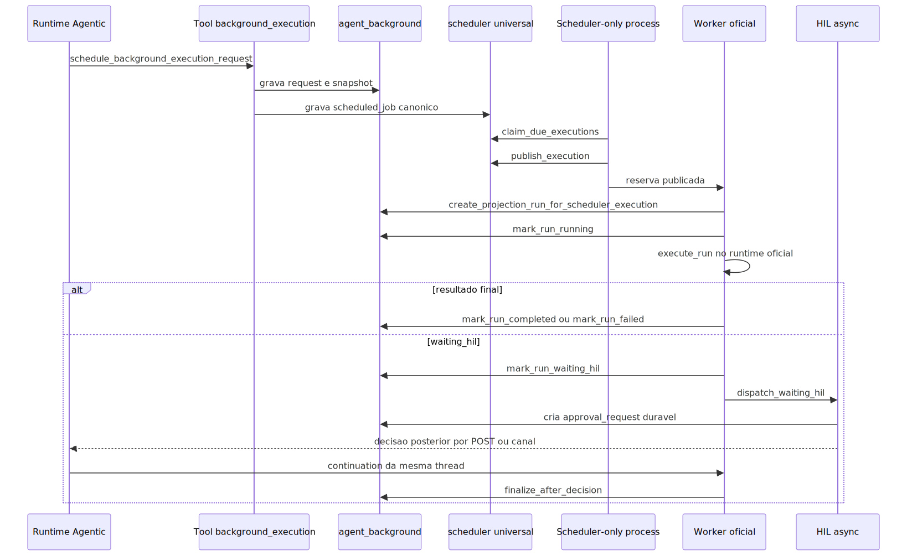

# Manual técnico e operacional: scheduler, agendamento agentic em background, comunicação HIL e Generative UI

## 1. O que é este slice técnico

Este slice técnico descreve o caminho canônico hoje confirmado no código para três capacidades que se encadeiam:

1. criação de solicitação agentic em background a partir de tool interna;
2. despacho temporal pelo scheduler universal;
3. continuação HIL assíncrona vinculada ao run background.

O objetivo deste manual é explicar o fluxo real, as tabelas e serviços envolvidos, os contratos que mudam o comportamento e as lacunas confirmadas no slice lido.

## 2. Entrypoints reais confirmados

### 2.1. Criação da solicitação

No slice lido, a criação não entra por endpoint administrativo. Ela entra pela tool interna schedule_background_execution_request, construída em background_execution_tools.

Isso significa que o caminho oficial de criação é agentic e governado pela configuração carregada no runtime. A ferramenta exige contexto autenticado já presente em user_session e client_context.

### 2.2. Observação e cancelamento

O boundary administrativo está em /admin/background-executions. Ele oferece leitura de requests, schedules, runs, eventos e HIL, além de cancelamento de agenda.

Esse boundary não cria a solicitação. Ele observa e controla o que já foi registrado.

### 2.2.1. Comunicação assíncrona consumível pelo webchat

No estado atual do código, o mesmo boundary administrativo também expõe a projeção consolidada de pendências do webchat.

Os endpoints confirmados são estes:

- GET /admin/background-executions/communications/summary
- GET /admin/background-executions/communications
- POST /admin/background-executions/communications/{communication_id}/ack

Na prática, essa superfície não agenda nada. Ela serve para o webchat consultar o que ficou pendente para o tenant, por exemplo:

- um resultado final pronto para materializar no chat como mensagem normal do assistente;
- uma revisão humana pendente para montar o HilReviewPanel no próprio chat.

Os tipos confirmados hoje são `final_result_pending` e `hil_pending`.

Isso importa porque o canal externo e o webchat cumprem papéis diferentes.

- WhatsApp e e-mail são canais declarativos de async_approval no YAML.
- O webchat, por enquanto, é uma superfície de acompanhamento e decisão apoiada nesse boundary de communications.
- Portanto, “existe webchat” não significa “o YAML aceita webchat como canal declarativo de async_approval”.

### 2.3. Despacho temporal

O disparo temporal nasce no processo scheduler-only, iniciado por app/scheduler_main.py e app/runners/scheduler_runner.py.

O bootstrap central fica em RuntimeBootstrap. Quando liderança e configuração permitem, ele sobe o maintenance scheduler e agenda o job universal-scheduler-dispatcher.

### 2.4. Execução real

O scheduler universal publica uma reserva canônica. O handler específico BackgroundExecutionSchedulerJobHandler projeta um run no domínio background e chama o worker handler. O runtime agentic oficial só roda a partir desse ponto.

### 2.5. Continuação HIL

Há dois caminhos confirmados.

O primeiro é a continuação síncrona tradicional por /agent/continue.

O segundo é a decisão assíncrona por /agent/hil/decisions ou por canal interceptado pela HilApprovalChannelBridge.

### 2.6. Generative UI como superfície de comunicação

No slice lido, a Generative UI nao substitui scheduler, run nem o dominio oficial de decisao. Ela funciona como superficie de apresentacao, coleta de decisao e, nas integracoes AG-UI atuais, continuacao encapsulada no proprio `POST /ag-ui/runs`. O backend AG-UI emite interrupcoes no stream, o sidecar compartilhado adapta essas interrupcoes ao contrato do painel HIL e pode tanto disparar callback pluggavel quanto reenviar `resume` ao boundary AG-UI quando a integracao usa o fluxo nativo suportado.

## 3. Contrato de criação da solicitação

O serviço usa três contratos principais.

### 3.1. Escopo autenticado

BackgroundExecutionActorScope exige tenant_id, user_email e correlation_id. Campos como user_code, client_code, source_channel e source_conversation_id são opcionais.

Sem esse escopo, a solicitação nem entra no domínio.

### 3.2. Comando da solicitação

BackgroundExecutionRequestCommand contém:

- target_type com valores agent, deepagent ou workflow;
- target_ref com a referência do alvo;
- requested_command com o texto original do pedido;
- normalized_command opcional;
- input_payload;
- yaml_snapshot_hash;
- yaml_snapshot;
- context_snapshot;
- metadata;
- schedule.

O requested_command é o ponto central do “NL”. O pedido textual continua persistido e reaproveitado depois pelo runtime.

### 3.3. Agenda tipada

BackgroundExecutionScheduleSpec aceita apenas:

- once, com run_at obrigatório;
- interval, com interval_seconds obrigatório e positivo;
- cron, com cron_expression obrigatória e validada por croniter.

O timezone é validado por ZoneInfo. Misfire e concorrência existem no modelo, mas a tool atual de criação não expõe esses campos. No caminho atual da tool, os defaults do modelo permanecem ativos.

## 4. O que “agendamento com NL” significa no código lido

No slice lido, “agendamento com NL” não significa parser livre de data ou recorrência em linguagem natural.

O que o código confirma é isto:

1. a intenção do trabalho pode ficar em linguagem natural dentro de requested_command;
2. a agenda temporal é preenchida por argumentos estruturados da tool;
3. a tool não aceita uma frase livre para run_at ou cron_expression;
4. run_at precisa ser ISO-8601 quando informado na tool;
5. cron_expression e interval_seconds continuam explícitos.

Isso é um limite importante do contrato atual.

## 4.1. O que “genérico e agnóstico” significa no código lido

No scheduler e no runtime background, genérico significa isto:

1. a criação trabalha com target_type e target_ref, não com um agente hardcoded;
2. o runtime aceita agent, deepagent e workflow como alvos distintos;
3. o worker handler não conhece domínio de negócio, só reserva canônica, request_id e run;
4. o pedido do usuário segue em requested_command sem depender de uma tela específica.

Na camada de interação com humano, agnóstico significa isto:

1. a decisão HIL pode entrar por POST seguro ou por bridge de canal;
2. o painel HilReviewPanel é compartilhado e não pertence a um único front;
3. o sidecar AG-UI adapta interrupts ao mesmo contrato de revisão usado por outras superfícies.

O limite real também precisa ficar explícito: o contrato declarativo de async_approval hoje aceita apenas whatsapp e email, mesmo que a bridge de decisão por canal tenha mapeamentos mais amplos.

## 5. Persistência canônica confirmada

### 5.1. Domínio background

O schema agent_background continua sendo o ledger do domínio, com tabelas para:

- background_execution_targets;
- background_execution_requests;
- background_execution_runs;
- background_execution_events;
- agent_hil_approval_requests;
- background_execution_outbox.

Essas estruturas guardam alvo habilitado, solicitação, execução, eventos auditáveis, pedidos HIL e outbox.

### 5.2. Agenda universal

A agenda canônica usada pelo caminho atual é gravada no schema scheduler, especialmente em scheduled_jobs e job_executions.

Na criação da solicitação, o repositório insere o request no domínio background e registra a agenda em scheduler.scheduled_jobs com handler_key background_execution_request, queue_name background_execution e payload contendo request_id.

### 5.3. Importante: coexistência de superfícies

O script SQL histórico ainda materializa agent_background.background_execution_schedules e a classe de repositório mantém métodos do dispatcher legado baseados nessa superfície.

Mas o bootstrap atual registra explicitamente que o dispatcher legado de background é ignorado e que o scheduler universal é a única fonte canônica de scheduling.

Na prática, o caminho ativo lido para criação de agenda usa scheduler.scheduled_jobs e job_executions, não um agendador paralelo local do domínio background.

Essa coexistência é uma lacuna de convergência técnica e documental que precisa ser tratada como tal, não como dois caminhos igualmente válidos.

## 6. Pipeline técnico ponta a ponta

### 6.1. Tool agentic cria a solicitação

A tool schedule_background_execution_request:

1. monta BackgroundExecutionScheduleSpec;
2. monta BackgroundExecutionRequestCommand;
3. calcula yaml_snapshot e yaml_snapshot_hash;
4. delega ao BackgroundExecutionService.schedule_request.

### 6.2. Serviço valida o escopo e o alvo

O serviço:

1. valida o scope;
2. valida o comando;
3. busca o target habilitado para tenant, tipo e referência;
4. calcula next_run_at;
5. chama create_request_with_schedule.

Sem target habilitado, a operação falha antes de persistir.

### 6.3. Repositório grava request e schedule

O repositório grava:

1. a solicitação em agent_background.background_execution_requests;
2. o agendamento canônico em scheduler.scheduled_jobs.

O payload do job canônico contém request_id. O job_type e o handler_key ficam como background_execution_request.

### 6.4. Processo scheduler-only dispara o dispatcher universal

O RuntimeBootstrap sobe o maintenance scheduler apenas quando:

1. a política de startup permite scheduler;
2. o processo é líder, quando liderança Redis está habilitada;
3. o universal scheduler dispatcher está ativado por configuração.

Se background_execution_dispatcher_enabled estiver ligado, o bootstrap apenas emite warning de que o dispatcher legado é ignorado.

### 6.5. Dispatcher universal claima e publica

SchedulerDispatchMaintenanceJob:

1. resolve UNIVERSAL_SCHEDULER_DSN;
2. cria repositório do scheduler universal;
3. chama dispatch_due_executions;
4. chama reconcile_pending_dispatches.

O resultado é uma lista de reservas canônicas publicadas para o worker oficial.

### 6.6. Handler projeta o run no domínio background

BackgroundExecutionSchedulerJobHandler:

1. recebe SchedulerExecutionReservation;
2. extrai request_id do payload da reserva;
3. usa create_projection_run_for_scheduler_execution;
4. cria runtime e worker handler;
5. executa o worker handler em thread dedicada.

Esse ponto é importante: o scheduler continua sendo coordenador. O worker handler continua sendo o executor.

### 6.7. Worker marca running e chama o runtime agentic

BackgroundExecutionWorkerHandler:

1. marca o run como running;
2. chama runtime.execute_run;
3. se o resultado vier waiting_hil, marca o run como waiting_hil;
4. se vier final, marca completed;
5. em exceção, marca failed.

### 6.8. Runtime reconstrói o contexto e executa

AgenticBackgroundExecutionRuntime:

1. carrega BackgroundExecutionRunContext;
2. exige yaml_snapshot, sem fallback implícito;
3. injeta correlation_id, user_email, tenant_id e client_code no YAML de execução;
4. reidrata security_keys redigidas usando ClientDirectory e expand_placeholders;
5. resolve thread_id;
6. escolhe AgentSupervisor, DeepAgentSupervisor ou WorkflowOrchestrator;
7. executa requested_command.

### 6.9. Normalização do resultado

O runtime normaliza o resultado agentic em BackgroundExecutionResult.

Se metrics.status for paused, metrics.requires_human for true ou houver bloco hil no payload, o status lógico vira waiting_hil. Caso contrário, vira completed.

### 6.10. HIL assíncrono em background

Se o run ficar waiting_hil e existir dispatcher HIL configurado no runtime, o BackgroundExecutionHilApprovalDispatcher tenta criar um pedido HIL durável.

Ele converte o bloco hil do resultado em AgentHilResponse, chama HilBackgroundApprovalService e, quando houver sucesso, injeta um resumo hil_async_approval em result_payload e telemetry.

### 6.11. Finalização da decisão HIL

Quando a decisão é aceita pelo serviço de HIL:

1. a continuação é executada na mesma thread;
2. o BackgroundExecutionHilRunFinalizer sincroniza o run background;
3. se continuation.success for false, o run vira failed;
4. se a continuação gerar nova HIL sem emissão durável vinculada ao run, o run também vira failed;
5. se a continuação for final, o run vira completed.

## 7. Scheduler runtime em mais detalhe

### 7.1. Processo dedicado

O scheduler roda em processo próprio, não dentro do ciclo HTTP.

### 7.2. Liderança Redis

Quando habilitada, a liderança é controlada por SchedulerLeaderElector com lock Redis, TTL, renovação periódica e tentativa de reassumir liderança após perda.

Sem liderança, jobs críticos não devem ser ativados.

### 7.3. Maintenance scheduler

O JobScheduler local do processo scheduler-only agenda tarefas periódicas de manutenção. Entre elas, está o universal-scheduler-dispatcher.

Esse JobScheduler local não é a fonte canônica do calendário dos trabalhos de negócio. Ele é o relógio interno do processo scheduler para disparar jobs de manutenção, claim e reconciliação.

## 8. Comunicação HIL confirmada

### 8.1. Registro do pedido HIL

HilBackgroundApprovalService resolve async_approval a partir de multi_agents[].middlewares.human_in_the_loop.async_approval.

Se enabled=false, retorna not_configured e o run continua apenas como waiting_hil.

Se enabled=true, cria um registro em agent_hil_approval_requests com TTL, allowed_decisions, action_requests, review_configs, aprovadores esperados e metadata.

### 8.2. Canais declarativos aceitos

O contrato HilAsyncApprovalContract aceita apenas whatsapp e email como canais declarativos de async_approval.

Esse é o limite confirmado do YAML atual.

### 8.3. Decisões por notificação

O serviço de notificação cria ações interativas apenas para approve e reject. Mesmo que a HIL permita edit no envelope, o fluxo de notificação por canal não constrói botões para edit.

### 8.4. Decisão por POST seguro

O endpoint /agent/hil/decisions recebe token, decisão e configuração resolvida. Ele chama HilApprovalDecisionService e não faz GET para evitar aprovação por scanner de link.

No slice lido, esse endpoint preenche decided_channel como email na decisão interna.

### 8.5. Decisão por canal

HilApprovalChannelBridge:

1. extrai payload HIL de botões ou texto bruto;
2. intercepta a mensagem antes da fila e da execução agentic normal do canal;
3. monta HilApprovalDecisionCommand;
4. chama o mesmo serviço de decisão.

Isso significa que a resposta de aprovação por canal não entra como nova conversa de negócio. Ela entra como continuação HIL.

### 8.6. Validações de decisão

HilApprovalDecisionService valida:

1. existência do token;
2. status pending;
3. expiração;
4. decisão permitida;
5. coerência entre approval_request_id do payload e o registro real;
6. principal esperado, por e-mail, canal, channel_user_id ou metadata.async_approval.allowed_principals.

## 8.1. Generative UI e painel HIL compartilhado

O sidecar AG-UI compartilhado faz três coisas importantes para HIL.

1. consome o stream do endpoint AG-UI e mantém snapshot local de run, mensagens, tools, estado e interrupts;
2. adapta cada interrupt AG-UI para um contrato de revisão comum com message, allowedDecisions, actionRequests, threadId, correlationId e mode;
3. monta o HilReviewPanel compartilhado e, quando a integracao nao injeta callback externo, consegue postar o resume no proprio `POST /ag-ui/runs` da capability ativa.

Isso prova que a Generative UI local foi desenhada como camada reutilizável de apresentação, não como lógica proprietária do runtime HIL.

## 8.2. HilReviewPanel compartilhado fora do AG-UI

O mesmo componente visual de revisão humana também é montado no webchat clássico. Isso é evidência importante de agnosticismo de interface: a regra de revisão humana foi empacotada num componente comum, em vez de ser duplicada em cada página.

## 8.3. Limite atual da superfície AG-UI

O slice AG-UI lido confirma emissao de interrupcoes, renderizacao de painel e continuacao encapsulada na propria superficie publica quando a capability suporta `resume`, porque o sidecar consegue montar `resume` e reenviar a decisao ao mesmo `POST /ag-ui/runs`. O limite atual continua sendo a cobertura por runtime e por capability, e outras superficies, como webchat, seguem dependendo do callback pluggavel para conversar com o boundary oficial.

## 9. Configurações que mudam o comportamento

### 9.1. Scheduler e dispatcher

- SCHEDULER_LEADER_ELECTION_ENABLED controla liderança distribuída.
- SCHEDULER_LEADER_LOCK_TTL_SECONDS controla a duração do lock.
- SCHEDULER_LEADER_LOCK_RENEW_SECONDS controla a renovação.
- UNIVERSAL_SCHEDULER_DISPATCHER_ENABLED liga o dispatcher canônico.
- UNIVERSAL_SCHEDULER_DISPATCHER_INTERVAL_SECONDS define a cadência da rodada.
- UNIVERSAL_SCHEDULER_DISPATCHER_LIMIT define o volume por rodada.
- UNIVERSAL_SCHEDULER_DISPATCHER_CLAIM_TTL_SECONDS define a janela de claim.
- UNIVERSAL_SCHEDULER_DSN é obrigatório para o dispatcher universal.

### 9.2. Domínio background

- AGENT_BACKGROUND_EXECUTION_DSN é obrigatório para o repositório background.
- AGENT_BACKGROUND_EXECUTION_SCHEMA define o schema do domínio, default agent_background.
- UNIVERSAL_SCHEDULER_SCHEMA define o schema canônico do scheduler, default scheduler.
- Configurações de pool e retry do domínio background controlam resiliência do repositório.

### 9.3. HIL assíncrono

- multi_agents[].middlewares.human_in_the_loop.async_approval.enabled liga ou desliga o pedido HIL durável.
- ttl_seconds controla validade do pedido.
- expiration_policy aceita expire ou fail_run.
- require_approver_match define se a decisão exige identidade compatível.
- channels aceita apenas whatsapp e email.
- approvers define user_email, user_code e channel_user_ids.

### 9.4. Generative UI compartilhada

- POST /ag-ui/runs e a superficie de streaming AG-UI ativa no projeto.
- GET /ag-ui/capabilities e replay por run/thread também já existem no boundary AG-UI atual.
- AgUiRunOrchestrator resolve execution_kind por adapter registrado, não por domínio hardcoded do scheduler.
- ag-ui-sidecar-chat adapta interrupts ao HilReviewPanel compartilhado e consegue retomar a capability ativa no proprio `POST /ag-ui/runs` quando nao recebe callback externo.
- HilReviewPanel também é usado fora do AG-UI, por exemplo no webchat, o que reforça reuso e agnosticismo.

## 10. O que acontece em sucesso

### 10.1. Sucesso do agendamento

O serviço retorna request_id, schedule_id, target_id, next_run_at e correlation_id.

### 10.2. Sucesso do run

O run sai de queued para running e depois para completed, com final_response, result_payload e telemetry persistidos.

### 10.3. Sucesso do HIL

O run sai de waiting_hil para completed depois que a decisão é validada e a continuação finaliza com sucesso.

## 11. O que acontece em erro

### 11.1. Erro antes da persistência

Falha de contrato, target desabilitado, tenant errado ou schedule inválido interrompem a criação cedo.

### 11.2. Erro de snapshot

yaml_snapshot ausente ou inválido interrompe a execução. O runtime não cria fallback implícito.

### 11.3. Erro de execução

Qualquer exceção do runtime agentic vira BackgroundExecutionFailure e mark_run_failed.

### 11.4. Erro HIL

Token inválido, aprovador incompatível, expiração, decisão proibida ou continuação malsucedida resultam em erro explícito e, quando houver run background vinculado, falha sincronizada do ledger.

### 11.5. Workflow waiting_hil

O runtime lança erro explícito porque aprovação HIL assíncrona ainda não suporta retomada de workflow no caminho background.

## 12. Observabilidade e diagnóstico

### 12.1. Identificadores-chave

- request_id identifica a intenção persistida.
- schedule_id identifica a agenda canônica.
- execution_id do scheduler vira o run_id projetado no caminho universal.
- run_id identifica a execução do domínio background.
- approval_request_id identifica o pedido HIL durável.
- correlation_id une a história de ponta a ponta.

### 12.2. Onde começar a investigação

Se o problema é “não rodou”, comece em scheduled_jobs e job_executions.

Se o problema é “rodou e falhou”, comece no run e nos eventos do ledger background.

Se o problema é “parou esperando humano”, comece em agent_hil_approval_requests.

### 12.3. Sinais úteis

- SCHEDULER_READY confirma prontidão do processo scheduler-only.
- scheduler.dispatcher.maintenance_job.start e end mostram as rodadas do dispatcher universal.
- agent_background.schedule.created marca criação da solicitação.
- agent_background.run.published marca publish do run.
- agent_background.run.waiting_hil marca pausa humana.
- agent_background.hil_decision.run_finalized marca sincronização final do run após decisão.

## 13. Exemplos práticos guiados

### 13.1. Pedido recorrente com cron

Cenário: a tool agenda um deepagent para rodar todo dia às 7h.

Entrada confirmada: target_type, target_ref, requested_command, schedule_type=cron, cron_expression e timezone.

Saída esperada: schedule_id persistido, next_run_at calculado e job canônico em scheduled_jobs.

### 13.2. Pedido único com run_at

Cenário: a tool agenda um workflow para rodar uma vez.

Entrada confirmada: schedule_type=once com run_at ISO-8601.

Risco: se esse workflow pausar por HIL em background, o runtime atual falha fechado.

### 13.3. Deepagent com aprovação por WhatsApp

Cenário: o run entra em waiting_hil e async_approval habilita canal whatsapp.

Fluxo confirmado: pedido HIL durável, notificação interativa com approve/reject, bridge do canal interceptando a decisão, continuação da thread e finalização do run.

### 13.4. Execução sem canal externo, acompanhada no webchat

Cenário: o run background conclui com resultado final ou entra em `waiting_hil`, mas o operador acompanha a execução pelo webchat em vez de depender de uma notificação declarativa por canal externo.

Fluxo confirmado:

1. o backend persiste um item canônico de comunicação no outbox background;
2. o boundary `/admin/background-executions/communications` projeta esse item para o tenant correto;
3. o WebChat v3 e o webchat administrativo consultam essa projeção e materializam:
  - `final_result_pending` como mensagem final do assistente;
  - `hil_pending` como mensagem com HilReviewPanel compartilhado;
4. depois da materialização, a UI envia `ack` do item de comunicação.

Efeito prático: o webchat passa a ser uma superfície de consumo e decisão segura do trabalho já persistido, sem inventar uma segunda fila nem um segundo contrato HIL.

## 14. Explicação 101

Tecnicamente, existem dois relógios diferentes no sistema e isso costuma confundir.

O primeiro relógio é o do processo scheduler-only, que serve para disparar manutenção e claim das execuções canônicas.

O segundo “relógio” é a agenda de negócio de cada solicitação background, persistida no scheduler universal.

Quando essa agenda vence, o scheduler entrega o trabalho para o worker. O worker executa o pedido do usuário. Se precisar de humano, ele pausa de forma durável e espera a decisão certa chegar.

## 15. Limites e lacunas confirmados

Não foi confirmado endpoint público administrativo para criar solicitação background; a criação lida nasce de tool interna.

Não foi confirmado parser livre de agenda em linguagem natural.

O contrato de async_approval aceita apenas whatsapp e email.

A bridge de decisão por canal mapeia whatsapp, instagram, teams, slack e webchat para auditoria da decisão, mas isso não amplia automaticamente o contrato declarativo de async_approval. É uma diferença entre superfície técnica da bridge e política oficialmente suportada pelo YAML.

Quando a operação usa e-mail, também é preciso separar duas coisas.

- O contrato atual suporta e-mail como canal declarativo para async_approval.
- Isso não prova reply inbound automático por resposta direta ao e-mail.
- No slice lido, a decisão segura continua entrando pelo POST dedicado /agent/hil/decisions ou por bridge de canal suportada.

Em linguagem simples: receber uma mensagem por e-mail não significa, por si só, que “responder ao e-mail” já retoma o agente automaticamente. Essa automação só existe quando há um boundary explícito ligando a decisão ao approval_token correto.

As notificações por canal suportam approve e reject, não edit.

O endpoint /agent/hil/decisions trata a decisão como canal email no slice lido.

O AG-UI local já substitui esse boundary de continuação para agent e deepagent no seu próprio slice, mas ainda não para todos os runtimes nem para todas as superfícies visuais do produto.

Existe coexistência entre superfícies históricas de schedule no schema agent_background e a agenda canônica atual no schema scheduler.

## 16. Troubleshooting

### 16.1. schedule criado, mas nenhum execution_id apareceu

Causa provável: dispatcher universal desligado, scheduler sem liderança ou problema de DSN do scheduler.

Como confirmar: revisar UNIVERSAL_SCHEDULER_DSN, liderança Redis e logs do maintenance job.

### 16.2. execution_id existe, mas o run background não fechou

Causa provável: worker indisponível, falha do runtime ou waiting_hil sem decisão.

Como confirmar: consultar run_id, status, error_type, error_message e eventos do ledger.

### 16.3. waiting_hil sem notificação

Causa provável: async_approval desativado, inválido, sem approver compatível ou falha de notificação.

Como confirmar: inspecionar agent_hil_approval_requests, notification_status e metadata.async_approval.

### 16.4. decisão por canal não foi tratada como HIL

Causa provável: payload não tinha approval_token válido, o canal não passou pela bridge ou a mensagem caiu no fluxo comum antes da interceptação.

Como confirmar: validar se a mensagem contém payload gerado por HilApprovalDecisionPayloadCodec e se o ChannelMessageProcessor invocou _try_handle_hil_approval_decision.

### 16.5. workflow pausou e falhou

Causa provável: o runtime bloqueia explicitamente workflow waiting_hil em background.

Como confirmar: revisar a falha gerada pelo runtime e o status failed do run.

## 17. Diagrama técnico

O diagrama destaca que a agenda canônica, o ledger background e o HIL durável são peças diferentes do mesmo fluxo.

## 18. Evidências no código

- src/agentic_layer/background_execution/models.py
  - Motivo da leitura: contrato de request, schedule, run e status.
  - Símbolo relevante: BackgroundExecutionScheduleSpec, BackgroundExecutionRequestCommand.
  - Comportamento confirmado: agenda tipada, status waiting_hil e contratos de validação.

- src/agentic_layer/tools/system_tools/background_execution.py
  - Motivo da leitura: entrada real de criação.
  - Símbolo relevante: schedule_background_execution_request.
  - Comportamento confirmado: requested_command permanece persistido e a criação usa tool interna.

- src/agentic_layer/background_execution/services.py
  - Motivo da leitura: casos de uso centrais.
  - Símbolo relevante: BackgroundExecutionService, BackgroundExecutionWorkerHandler.
  - Comportamento confirmado: criação, cancelamento, execução do worker e transição para waiting_hil.

- src/agentic_layer/background_execution/runtime.py
  - Motivo da leitura: runtime real.
  - Símbolo relevante: AgenticBackgroundExecutionRuntime.execute_run.
  - Comportamento confirmado: yaml_snapshot obrigatório, reidratação de security_keys e bloqueio de workflow waiting_hil.

- src/agentic_layer/background_execution/postgres_repository.py
  - Motivo da leitura: persistência canônica.
  - Símbolo relevante: create_request_with_schedule, create_projection_run_for_scheduler_execution, mark_run_waiting_hil.
  - Comportamento confirmado: request em agent_background, schedule em scheduler, run no ledger background.

- src/api/startup/runtime_bootstrap.py
  - Motivo da leitura: topologia ativa do scheduler.
  - Símbolo relevante: RuntimeBootstrap.start.
  - Comportamento confirmado: dispatcher legado ignorado e universal dispatcher como caminho canônico.

- src/api/services/scheduler_dispatch_maintenance_job.py
  - Motivo da leitura: job periódico do dispatcher universal.
  - Símbolo relevante: SchedulerDispatchMaintenanceJob.run.
  - Comportamento confirmado: claim e reconciliação via scheduler universal.

- src/scheduler_layer/handlers/background_execution_job_handler.py
  - Motivo da leitura: integração do scheduler com o domínio background.
  - Símbolo relevante: BackgroundExecutionSchedulerJobHandler.handle.
  - Comportamento confirmado: projeção de run e delegação ao worker handler.

- src/api/services/hil_background_approval_service.py
  - Motivo da leitura: pedido HIL durável.
  - Símbolo relevante: HilBackgroundApprovalService.dispatch.
  - Comportamento confirmado: criação do approval_request e notificação assíncrona.

- src/agentic_layer/supervisor/hil_async_approval_contract.py
  - Motivo da leitura: canais e regras do async_approval.
  - Símbolo relevante: ALLOWED_ASYNC_APPROVAL_CHANNELS, HilAsyncApprovalContract.normalize.
  - Comportamento confirmado: apenas whatsapp e email no contrato declarativo atual.

- src/api/services/hil_approval_channel_bridge.py
  - Motivo da leitura: decisão por canal.
  - Símbolo relevante: HilApprovalChannelBridge.handle.
  - Comportamento confirmado: interceptação antes do fluxo normal do canal e chamada do mesmo caso de uso de decisão.

- app/ui/static/js/shared/ag-ui-sidecar-chat.js
  - Motivo da leitura: confirmar como a Generative UI consome interrupções HIL.
  - Símbolo relevante: adaptInterruptToReviewContract, renderInterrupts, createAgUiSidecarChat.
  - Comportamento confirmado: interrupts AG-UI são adaptados ao contrato comum do painel HIL e a decisão pode sair por callback pluggável ou por `resume` nativo no próprio endpoint público de run por `agent_id`, conforme a superfície usada.

- app/ui/static/js/shared/hil-review-panel.js
  - Motivo da leitura: confirmar o componente comum de revisão humana.
  - Símbolo relevante: window.HilReviewPanel.create.
  - Comportamento confirmado: painel reutilizável, independente de scheduler ou domínio específico, com decisões approve, edit e reject.

- app/ui/static/js/ui-webchat-v3.js
  - Motivo da leitura: confirmar reuso do mesmo painel fora do AG-UI.
  - Símbolo relevante: montarPainelHilCompartilhado, sincronizarPainelHilCompartilhado.
  - Comportamento confirmado: webchat clássico reutiliza o mesmo HilReviewPanel, reforçando a natureza agnóstica da superfície HIL.

- src/api/routers/agent_router.py
  - Motivo da leitura: boundary HTTP da continuação e da decisão assíncrona.
  - Símbolo relevante: /agent/continue, /agent/hil/decisions.
  - Comportamento confirmado: decisão segura por POST e continuação formal da thread.
