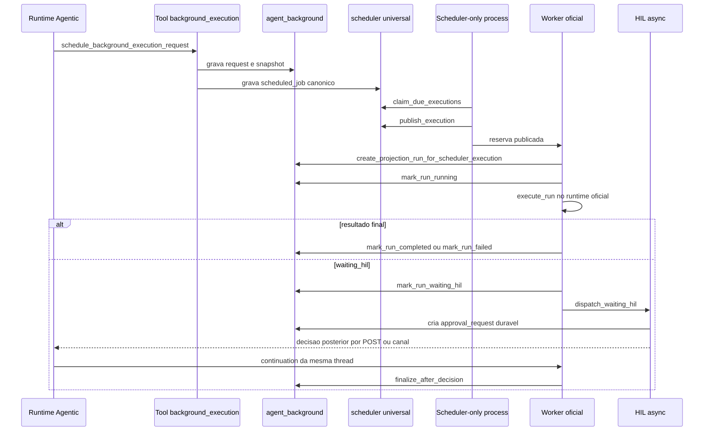

# Manual técnico e operacional: scheduler, agendamento agentic em background, comunicação HIL e Generative UI

## 1. O que é este slice técnico

Este slice técnico descreve o caminho canônico hoje confirmado no código para três capacidades que se encadeiam:

1. criação de solicitação agentic em background a partir de tool interna;
2. despacho temporal pelo scheduler universal;
3. continuação HIL assíncrona vinculada ao run background.

O objetivo deste manual é explicar o fluxo real, as tabelas e serviços envolvidos, os contratos que mudam o comportamento e as lacunas confirmadas no slice lido.

## 2. Entrypoints reais confirmados

### 2.1. Criação da solicitação

No slice lido, a criação não entra por endpoint administrativo. Ela entra pela tool interna schedule_background_execution_request, construída em background_execution_tools.

Isso significa que o caminho oficial de criação é agentic e governado pela configuração carregada no runtime. A ferramenta exige contexto autenticado já presente em user_session e client_context.

### 2.2. Observação e cancelamento

O boundary administrativo está em /admin/background-executions. Ele oferece leitura de requests, schedules, runs, eventos e HIL, além de cancelamento de agenda.

Esse boundary não cria a solicitação. Ele observa e controla o que já foi registrado.

### 2.2.1. Comunicação assíncrona consumível pelo webchat

No estado atual do código, o mesmo boundary administrativo também expõe a projeção consolidada de pendências do webchat.

Os endpoints confirmados são estes:

- GET /admin/background-executions/communications/summary
- GET /admin/background-executions/communications
- POST /admin/background-executions/communications/{communication_id}/ack

Na prática, essa superfície não agenda nada. Ela serve para o webchat consultar o que ficou pendente para o tenant, por exemplo:

- um resultado final pronto para materializar no chat como mensagem normal do assistente;
- uma revisão humana pendente para montar o HilReviewPanel no próprio chat.

Os tipos confirmados hoje são `final_result_pending` e `hil_pending`.

Isso importa porque o canal externo e o webchat cumprem papéis diferentes.

- WhatsApp e e-mail são canais declarativos de async_approval no YAML.
- O webchat, por enquanto, é uma superfície de acompanhamento e decisão apoiada nesse boundary de communications.
- Portanto, “existe webchat” não significa “o YAML aceita webchat como canal declarativo de async_approval”.

### 2.3. Despacho temporal

O disparo temporal nasce no processo scheduler-only, iniciado por app/scheduler_main.py e app/runners/scheduler_runner.py.

O bootstrap central fica em RuntimeBootstrap. Quando liderança e configuração permitem, ele sobe o `SchedulerAgendaFeederRuntime`: uma única thread daemon dedicada (`scheduler-agenda-feeder`) que, a cada `UNIVERSAL_SCHEDULER_AGENDA_INTERVAL_SECONDS`, roda `SchedulerAgendaMaintenanceJob.run()`. Não existe mais um `JobScheduler` local genérico executando rotinas de manutenção inline: esse componente (`src/core/job_scheduler.py`) foi removido do bootstrap.

### 2.4. Execução real

`SchedulerAgendaMaintenanceJob` chama `SchedulerAgendaService.submit_next_occurrences`, que lê as agendas vencidas em `scheduler.scheduled_jobs`, monta uma `SchedulerOccurrence` determinística (id via `uuid5`) para cada uma e delega a `AsyncJobSchedulerWorkPublisher.confirm_or_publish_occurrence`. Esse publisher resolve o `JobProcessDescriptor` pelo `process_key` da ocorrência no **mesmo** `JobProcessRegistry` genérico do Job Core e publica um `JobEnvelope`/`QueuedJobEnvelope` comum pelo `AsyncJobPublisherPort` canônico — não existe handler, dispatcher ou registry específicos do scheduler.

A partir da publicação, o job da agenda é um job do Job Core como qualquer outro: o worker o reivindica por `route_kind + dispatch_mode` (`"background_execution"` + `"scheduler_execution"` no caso do agendamento agentic), instancia o `JobProcess` registrado (`BackgroundExecutionSchedulerProcess`) e delega para `BackgroundExecutionProcessService.execute(...)`. O runtime agentic oficial só roda a partir desse ponto. Não existem mais `BackgroundExecutionSchedulerJobHandler` nem `BackgroundExecutionWorkerHandler`: esses arquivos foram removidos porque decidiam lifecycle (`running`/`waiting_hil`/`completed`/`failed`) fora do Job Core, violando a Parte 4 de `src/CLAUDE.md`. Hoje só o `JobCoreExecutor` decide o status final, a partir do `ProcessOutcome` devolvido ou da exceção propagada pelo processo.

### 2.5. Continuação HIL

Há dois caminhos confirmados.

O primeiro é a continuação síncrona tradicional por /agent/continue.

O segundo é a decisão assíncrona por /agent/hil/decisions ou por canal interceptado pela HilApprovalChannelBridge.

### 2.6. Generative UI como superfície de comunicação

No slice lido, a Generative UI nao substitui scheduler, run nem o dominio oficial de decisao. Ela funciona como superficie de apresentacao, coleta de decisao e, nas integracoes AG-UI atuais, continuacao encapsulada no proprio `POST /ag-ui/runs`. O backend AG-UI emite interrupcoes no stream, o sidecar compartilhado adapta essas interrupcoes ao contrato do painel HIL e pode tanto disparar callback pluggavel quanto reenviar `resume` ao boundary AG-UI quando a integracao usa o fluxo nativo suportado.

## 3. Contrato de criação da solicitação

O serviço usa três contratos principais.

### 3.1. Escopo autenticado

BackgroundExecutionActorScope exige tenant_id, user_email e correlation_id. Campos como user_code, client_code, source_channel e source_conversation_id são opcionais.

Sem esse escopo, a solicitação nem entra no domínio.

### 3.2. Comando da solicitação

BackgroundExecutionRequestCommand contém:

- target_type com valores agent, deepagent ou workflow;
- target_ref com a referência do alvo;
- requested_command com o texto original do pedido;
- normalized_command opcional;
- input_payload;
- yaml_snapshot_hash;
- yaml_snapshot;
- context_snapshot;
- metadata;
- schedule.

O requested_command é o ponto central do “NL”. O pedido textual continua persistido e reaproveitado depois pelo runtime.

### 3.3. Agenda tipada

BackgroundExecutionScheduleSpec aceita apenas:

- once, com run_at obrigatório;
- interval, com interval_seconds obrigatório e positivo;
- cron, com cron_expression obrigatória e validada por croniter.

O timezone é validado por ZoneInfo. `misfire_policy` (default `fire_once`) já é usado de verdade pelo `SchedulerAgendaService` para decidir se um backlog perdido dispara uma única vez, é ignorado (`skip`) ou é recuperado (`catch_up`); a tool atual de criação não expõe esse campo, então o default do modelo é o que sempre roda no caminho da tool.

## 4. O que “agendamento com NL” significa no código lido

No slice lido, “agendamento com NL” não significa parser livre de data ou recorrência em linguagem natural.

O que o código confirma é isto:

1. a intenção do trabalho pode ficar em linguagem natural dentro de requested_command;
2. a agenda temporal é preenchida por argumentos estruturados da tool;
3. a tool não aceita uma frase livre para run_at ou cron_expression;
4. run_at precisa ser ISO-8601 quando informado na tool;
5. cron_expression e interval_seconds continuam explícitos.

Isso é um limite importante do contrato atual.

## 4.1. O que “genérico e agnóstico” significa no código lido

No scheduler e no runtime background, genérico significa isto:

1. a criação trabalha com target_type e target_ref, não com um agente hardcoded;
2. o runtime aceita agent, deepagent e workflow como alvos distintos;
3. o worker handler não conhece domínio de negócio, só reserva canônica, request_id e run;
4. o pedido do usuário segue em requested_command sem depender de uma tela específica.

Na camada de interação com humano, agnóstico significa isto:

1. a decisão HIL pode entrar por POST seguro ou por bridge de canal;
2. o painel HilReviewPanel é compartilhado e não pertence a um único front;
3. o sidecar AG-UI adapta interrupts ao mesmo contrato de revisão usado por outras superfícies.

O limite real também precisa ficar explícito: o contrato declarativo de async_approval hoje aceita apenas whatsapp e email, mesmo que a bridge de decisão por canal tenha mapeamentos mais amplos.

## 5. Persistência canônica confirmada

### 5.1. Domínio background

O schema agent_background é o ledger de fatos do domínio, hoje com apenas estas tabelas efetivamente lidas/escritas por `PostgresBackgroundExecutionRepository` (`src/agentic_layer/background_execution/postgres_repository.py`):

- background_execution_targets (alvo habilitado por tenant/target_type/target_ref);
- background_execution_runs (fatos de execução: contexto, resultado, falha);
- background_execution_outbox (fila de comunicação para o webchat, via `communication_outbox_repository.py`);
- agent_hil_approval_requests (pedido HIL durável, inalterado — `hil_background_approval_service.py`).

Não existe mais uma tabela própria para a "solicitação" (`background_execution_requests`) nem uma tabela de eventos auditáveis do domínio (`background_execution_events`): o comando completo (`BackgroundExecutionScheduledRequest`) fica embutido no próprio `payload` da agenda em `scheduler.scheduled_jobs`, e a trilha de eventos auditáveis é o ledger genérico `job_core.job_run_events`, não uma tabela paralela do domínio.

### 5.2. Agenda universal

A agenda canônica é gravada inteiramente no schema scheduler, na única tabela scheduled_jobs (`PostgresSchedulerRepository`, `src/scheduler_layer/postgres_repository.py`). Não existe mais tabela scheduler.job_executions: o conceito de "execução" do scheduler foi substituído pela ocorrência determinística (`SchedulerOccurrence`) que vira diretamente um job do Job Core.

Na criação da solicitação, `BackgroundExecutionService.schedule_request` não grava linha própria em agent_background: ele chama `scheduler.create_schedule(definition=...)` com uma `SchedulerJobDefinition` cujo `process_key` é `BACKGROUND_SCHEDULER_PROCESS_KEY` (`"background_execution:scheduler_execution"`) e cujo `payload` já é o `BackgroundExecutionScheduledRequest.to_payload()` inteiro.

### 5.3. Sem coexistência: o caminho legado foi removido

Os arquivos que materializavam o dispatcher legado (`src/scheduler_layer/handler_registry.py`, `src/scheduler_layer/handlers/background_execution_job_handler.py`, `etl_job_handler.py`, `ingestion_job_handler.py` e `src/api/services/scheduler_dispatch_maintenance_job.py`) foram apagados do repositório. Não há mais um segundo caminho de scheduling para ignorar: o único caminho ativo é a agenda factual descrita em 5.2, publicando sempre no ledger único do Job Core.

Lacuna documental herdada: `docs/tecnico/README-SCHEMA-BANCO.md` ainda descreve `background_execution_requests`, `background_execution_events`, `background_execution_schedules` e `scheduler.job_executions` como se fossem lidos pelo runtime atual. Esse documento não está no escopo de edição desta rodada; ver "divergências reportadas" no retorno desta tarefa.

## 6. Pipeline técnico ponta a ponta

### 6.1. Tool agentic cria a solicitação

A tool schedule_background_execution_request:

1. monta SchedulerScheduleSpec (`src/scheduler_layer/models.py`);
2. monta BackgroundExecutionRequestCommand;
3. calcula yaml_snapshot e yaml_snapshot_hash;
4. delega ao BackgroundExecutionService.schedule_request.

### 6.2. Serviço valida o escopo e o alvo

O serviço:

1. valida o scope;
2. valida o comando;
3. busca o target habilitado para tenant, tipo e referência (facts.get_enabled_target);
4. monta o `SchedulerJobDefinition` com o comando inteiro no payload;
5. chama scheduler.create_schedule.

Sem target habilitado, a operação falha antes de persistir. Não há mais uma segunda escrita no domínio background nesta etapa — é uma escrita única, na agenda.

### 6.3. Repositório grava só a agenda

O repositório do scheduler (`PostgresSchedulerRepository`) grava a definição inteira em scheduler.scheduled_jobs, com process_key `background_execution:scheduler_execution` e o payload contendo o `BackgroundExecutionScheduledRequest` serializado (request_id, target, requested_command, yaml_snapshot etc.). Não existe gravação em agent_background nesta etapa.

### 6.4. Processo scheduler-only alimenta a agenda no Job Core

O RuntimeBootstrap sobe o `SchedulerAgendaFeederRuntime` apenas quando:

1. a política de startup permite scheduler;
2. o processo é líder, quando liderança Redis está habilitada;
3. `UNIVERSAL_SCHEDULER_AGENDA_ENABLED` está ligado.

O feeder é uma única thread daemon dedicada (não é mais uma rotina dentro de um `JobScheduler` genérico compartilhado com outras manutenções). Ela chama `SchedulerAgendaMaintenanceJob.run()` a cada `UNIVERSAL_SCHEDULER_AGENDA_INTERVAL_SECONDS`.

### 6.5. A rodada da agenda materializa ocorrências no Job Core

`SchedulerAgendaService.submit_next_occurrences`:

1. lista agendas vencidas (`list_pending_occurrences`);
2. para cada uma, cria uma `SchedulerOccurrence` determinística (`SchedulerOccurrenceFactory`, id via uuid5 — replay-safe);
3. aplica a política de misfire (`skip`, `fire_once` ou `catch_up`) quando há atraso;
4. confirma a ocorrência no Job Core via `AsyncJobSchedulerWorkPublisher.confirm_or_publish_occurrence`;
5. avança a agenda por CAS (`advance_schedule`), calculando o próximo `next_run_at`.

O publisher resolve o `JobProcessDescriptor` pelo `process_key` no `JobProcessRegistry` genérico, monta um `JobEnvelope`/`QueuedJobEnvelope` comum e publica pelo `AsyncJobPublisherPort` canônico — o mesmo caminho usado por ingestão, ETL e demais jobs. Não existe mais claim/reserva própria do scheduler nem `SchedulerExecutionReservation`.

### 6.6. O Job Core claima e executa como qualquer outro job

O worker reivindica o job por `route_kind + dispatch_mode` (`"background_execution"` + `"scheduler_execution"`), resolve o `JobProcessDescriptor` correspondente e instancia `BackgroundExecutionSchedulerProcess` (`src/scheduler_layer/job_processes.py`). Não existem mais `BackgroundExecutionSchedulerJobHandler` nem `create_projection_run_for_scheduler_execution`: o worker do Job Core é o único coordenador e o único executor, sem uma camada intermediária de "handler de scheduler".

### 6.7. O processo de domínio delega ao runtime, sem decidir lifecycle

`BackgroundExecutionSchedulerProcess.execute` reconstrói `BackgroundExecutionRunContext` a partir do payload da ocorrência e chama `BackgroundExecutionProcessService.execute(context)` (`src/agentic_layer/background_execution/services.py`), que:

1. checa cancelamento (`context.host`/`ProcessHostReporter`) e grava o fato `record_execution_context`;
2. reporta progresso via `ProgressFact` (`stage="background.context_recorded"`, etc.) sem nunca escrever status no ledger;
3. chama `runtime.execute_context(...)`;
4. grava `write_result_fact` ou `write_failure_fact` conforme o desfecho;
5. se o resultado for final (`outcome_kind == "completed"`), enfileira a comunicação para o webchat.

Este processo **não decide** `running`/`waiting_hil`/`completed`/`failed`: ele só devolve `ProcessOutcome` (sucesso) ou deixa a exceção propagar. Quem traduz isso em lifecycle é exclusivamente o `JobCoreExecutor`, exatamente como a Parte 4 de `src/CLAUDE.md` exige. A violação antes documentada aqui (`BackgroundExecutionWorkerHandler` decidindo lifecycle sozinho) foi corrigida: esse arquivo foi removido.

### 6.8. Runtime reconstrói o contexto e executa

AgenticBackgroundExecutionRuntime.execute_context:

1. carrega BackgroundExecutionRunContext;
2. exige yaml_snapshot, sem fallback implícito (`BackgroundExecutionValidationError` se ausente);
3. reidrata security_keys redigidas via `rehydrate_execution_yaml_snapshot`/`ExecutionYamlIdentity` (`src/security/execution_yaml_snapshot.py`), injetando correlation_id, tenant_id, client_code, user_email e user_code na identidade de execução;
4. resolve thread_id;
5. seleciona o alvo por target_ref dentro de multi_agents (DeepAgent) ou workflows (Workflow) e ajusta selected_entrypoint;
6. executa via DeepAgentSupervisor ou WorkflowOrchestrator, em thread separada (`asyncio.to_thread`).

O módulo antigo `src/agentic_layer/background_execution/yaml_snapshot.py` foi removido; a reidratação de snapshot é hoje um utilitário compartilhado em `src/security/execution_yaml_snapshot.py`, usado também pelos caminhos diretos de agent/workflow/RAG assíncronos.

### 6.9. Normalização do resultado

O runtime normaliza o resultado agentic em BackgroundExecutionResult com `outcome_kind` (`"completed"` ou `"approval_requested"`, não mais `"waiting_hil"` como texto de status de job): se `metrics.status` for `paused`, `metrics.requires_human` for `true` ou houver bloco `hil` no payload, `outcome_kind` vira `approval_requested`. Isso é só um dado funcional do resultado — não é status do Job Core.

### 6.10. HIL assíncrono em background

Se `outcome_kind` for `approval_requested`, o runtime exige um `hil_approval_dispatcher` configurado (senão levanta `BackgroundExecutionHilDispatchError`); `BackgroundExecutionHilApprovalDispatcher` cria o pedido HIL durável.

Ele converte o bloco hil do resultado em AgentHilResponse, chama HilBackgroundApprovalService e, quando houver sucesso, injeta um resumo hil_async_approval em result_payload e telemetry. **O job do Job Core termina normalmente (sucesso) neste ponto** — pedir aprovação não é uma pausa de lifecycle, é o desfecho funcional do primeiro job. Isso implementa literalmente a regra "HIL usa duas execuções explícitas" da Parte 4 de `src/CLAUDE.md`.

### 6.11. Segundo job: continuação HIL

A decisão humana (por POST seguro ou bridge de canal) chega a `HilApprovalDecisionService.decide`. Para pedidos originados em background (`_is_background_record`), o serviço **não** executa a continuação inline: ele publica um **segundo job do Job Core**, `BackgroundHilContinuationProcess` (`process_key="background_execution:hil_continuation"`, `src/api/services/background_hil_continuation_process.py`), exigindo um `continuation_correlation_id` novo e inédito (nunca reaproveita o correlation_id da execução anterior — gate ativo, `_require_new_continuation_correlation_id`).

O executor desse segundo job (`BackgroundHilContinuationExecutionService`) suporta tanto agent/deepagent quanto **workflow** — a limitação antiga de bloquear retomada de workflow em background não existe mais no código: o executor é composto com `agent_continuation_service` **e** `workflow_continuation_service=WorkflowHilContinuationService()` (`src/api/services/async_job_process_catalog.py::_build_background_hil_continuation_executor`). Como qualquer job do Job Core, ele termina como `succeeded` (continuação final), `failed` (continuação malsucedida) ou pode, por sua vez, gerar um novo pedido HIL durável (nova rodada de aprovação), sem finalizador de domínio reescrevendo status do run.

## 7. Scheduler runtime em mais detalhe

### 7.1. Processo dedicado

O scheduler roda em processo próprio, não dentro do ciclo HTTP.

### 7.2. Liderança Redis

Quando habilitada, a liderança é controlada por SchedulerLeaderElector com lock Redis, TTL, renovação periódica e tentativa de reassumir liderança após perda.

Sem liderança, jobs críticos não devem ser ativados.

### 7.3. Agenda de manutenção: não existe mais scheduler local genérico

O componente `src/core/job_scheduler.py` (`JobScheduler`) foi removido e não é mais importado por `RuntimeBootstrap`. Não existe hoje um relógio local do processo scheduler que execute rotinas de manutenção inline, em série, dentro da própria thread.

O que existe no lugar:

1. um único feeder dedicado (`SchedulerAgendaFeederRuntime`, seção 7.3.1) cuja única função é alimentar `scheduler.scheduled_jobs` no Job Core;
2. cada rotina de manutenção (log GC, reconciliação de HIL expirado, retenção e compactação de conversas) é sincronizada como uma **entrada normal em `scheduler.scheduled_jobs`** (via `sync_*_maintenance_schedule`, chamados no startup) e **executada pelo Worker do Job Core como um job comum**, não mais inline no processo scheduler.

Consequência prática: não há mais "head-of-line blocking" entre rotinas de manutenção — cada uma vira um job independente, com claim, heartbeat e concorrência do próprio Job Core, em vez de competir por uma única thread serial.

#### 7.3.1. Como o feeder da agenda roda (modelo de execução real)

`SchedulerAgendaFeederRuntime` (`src/api/services/scheduler_agenda_maintenance_job.py`) funciona assim:

- Ao iniciar (`start()`), cria **uma única thread daemon** (`scheduler-agenda-feeder`).
- A cada `interval_seconds` (`UNIVERSAL_SCHEDULER_AGENDA_INTERVAL_SECONDS`), chama `SchedulerAgendaMaintenanceJob.run()` uma vez.
- Uma rodada com falha (`SchedulerAgendaRoundError`) não derruba o feeder: o próximo tick é preservado e o erro fica no log canônico com `correlation_id` próprio da rodada.
- O feeder só faz a **materialização da agenda** (ler due schedules e publicar ocorrências no Job Core); ele não executa nenhum trabalho de negócio.

Consequências práticas que o operador precisa conhecer:

- **Somente no líder:** o feeder só sobe quando o processo é líder do scheduler (liderança Redis, seção 7.2) e `UNIVERSAL_SCHEDULER_AGENDA_ENABLED` está ligado. Sem liderança, fica inibido com log explícito.
- **Cron em UTC:** as expressões cron das agendas (ex.: retenção e compactação de conversas) são interpretadas em **UTC**. Ex.: `0 6 * * *` = 06:00 UTC = **03:00 em America/Sao_Paulo** (UTC−3).
- **Trabalho pesado nunca roda no scheduler:** toda execução real (ingestão, ETL, background agentic, log GC, manutenção de HIL, retenção/compactação de conversas) roda no Worker, como job do Job Core.

#### 7.3.2. Rotinas de manutenção agendadas hoje (catálogo confirmado no código)

Cada rotina é sincronizada em `src/api/startup/runtime_bootstrap.py` com uma flag de habilitação e cadência próprias em `src/config/settings.py`, materializada como entrada em `scheduler.scheduled_jobs` e executada pelo Worker via o `process_key` correspondente (constantes em `src/scheduler_layer/models.py`).

| Rotina | Tipo | Cadência default | Habilitada por default | `process_key` | O que faz |
| --- | --- | --- | --- | --- | --- |
| Log GC | intervalo | configurável (`log_gc_interval_seconds`) | conforme `log_gc_enabled` | `background_execution:log_gc_maintenance` | Coleta e limpa logs conforme a política de retenção de logs. |
| Manutenção de aprovação HIL | intervalo | 300s (5min) | não | `background_execution:hil_approval_maintenance` | Fecha aprovações HIL expiradas (TTL vencido). |
| Retenção de conversas do chat | cron | `0 5 * * *` (02:00 BRT) | sim | `background_execution:chat_conversation_retention_maintenance` | Purga conversas do chat paradas há mais de N dias e apaga seus checkpoints via API oficial do LangGraph. Detalhe em **[Gestão e ciclo de vida das conversas](README-TECNICO-GESTAO-CONVERSAS-CHAT.md)**. |
| Compactação de conversas do chat | cron | `0 6 * * *` (03:00 BRT) | sim | `background_execution:chat_conversation_compaction_maintenance` | Compacta o contexto das conversas DeepAgent com atividade recente, usando a tool oficial `compact_conversation`. Detalhe do mecanismo em **[DeepAgent Supervisor §7.8](README-TECNICO-DEEPAGENT-SUPERVISOR-COMPLETO.md)**. |

Notas de leitura do catálogo:

- A reconciliação de runs "fantasma" do Job Core (travados/órfãos) **não é** uma dessas rotinas: ela roda dentro do próprio laço de polling do Worker (`JobCoreCancelOnlyReconciler.run_if_due()`), não como job agendado — ver `docs/tecnico/README-TECNICO-SISTEMA-JOBS-WORKER-PARALELISMO.md`.
- Não existe mais uma rotina específica de "reconciliação de ingestão": o Job Core é a única autoridade de reconciliação, para qualquer tipo de job (ingestão, ETL, background, scheduler).
- **Retenção antes de compactação:** a retenção roda 02:00 BRT e a compactação 03:00 BRT. A ordem é intencional: a retenção remove primeiro as conversas vencidas, e a compactação só trabalha sobre o que sobrou e teve atividade recente.
- Todos os nomes de recurso persistente usados por essas rotinas são segregados por `ENVIRONMENT`, conforme a regra global da plataforma.

## 8. Comunicação HIL confirmada

### 8.1. Registro do pedido HIL

HilBackgroundApprovalService resolve async_approval a partir de multi_agents[].middlewares.human_in_the_loop.async_approval.

Se enabled=false, retorna not_configured e o run continua apenas como waiting_hil.

Se enabled=true, cria um registro em agent_hil_approval_requests com TTL, allowed_decisions, action_requests, review_configs, aprovadores esperados e metadata.

### 8.2. Canais declarativos aceitos

O contrato HilAsyncApprovalContract aceita apenas whatsapp e email como canais declarativos de async_approval.

Esse é o limite confirmado do YAML atual.

### 8.3. Decisões por notificação

O serviço de notificação cria ações interativas apenas para approve e reject. Mesmo que a HIL permita edit no envelope, o fluxo de notificação por canal não constrói botões para edit.

### 8.4. Decisão por POST seguro

O endpoint /agent/hil/decisions recebe token, decisão e configuração resolvida. Ele chama HilApprovalDecisionService e não faz GET para evitar aprovação por scanner de link.

No slice lido, esse endpoint preenche decided_channel como email na decisão interna.

### 8.5. Decisão por canal

HilApprovalChannelBridge:

1. extrai payload HIL de botões ou texto bruto;
2. intercepta a mensagem antes da fila e da execução agentic normal do canal;
3. monta HilApprovalDecisionCommand;
4. chama o mesmo serviço de decisão.

Isso significa que a resposta de aprovação por canal não entra como nova conversa de negócio. Ela entra como continuação HIL.

### 8.6. Validações de decisão

HilApprovalDecisionService valida:

1. existência do token;
2. status pending;
3. expiração;
4. decisão permitida;
5. coerência entre approval_request_id do payload e o registro real;
6. principal esperado, por e-mail, canal, channel_user_id ou metadata.async_approval.allowed_principals.

## 8.1. Generative UI e painel HIL compartilhado

O sidecar AG-UI compartilhado faz três coisas importantes para HIL.

1. consome o stream do endpoint AG-UI e mantém snapshot local de run, mensagens, tools, estado e interrupts;
2. adapta cada interrupt AG-UI para um contrato de revisão comum com message, allowedDecisions, actionRequests, threadId, correlationId e mode;
3. monta o HilReviewPanel compartilhado e, quando a integracao nao injeta callback externo, consegue postar o resume no proprio `POST /ag-ui/runs` da capability ativa.

Isso prova que a Generative UI local foi desenhada como camada reutilizável de apresentação, não como lógica proprietária do runtime HIL.

## 8.2. HilReviewPanel compartilhado fora do AG-UI

O mesmo componente visual de revisão humana também é montado no webchat clássico. Isso é evidência importante de agnosticismo de interface: a regra de revisão humana foi empacotada num componente comum, em vez de ser duplicada em cada página.

## 8.3. Limite atual da superfície AG-UI

O slice AG-UI lido confirma emissao de interrupcoes, renderizacao de painel e continuacao encapsulada na propria superficie publica quando a capability suporta `resume`, porque o sidecar consegue montar `resume` e reenviar a decisao ao mesmo `POST /ag-ui/runs`. O limite atual continua sendo a cobertura por runtime e por capability, e outras superficies, como webchat, seguem dependendo do callback pluggavel para conversar com o boundary oficial.

## 9. Configurações que mudam o comportamento

### 9.1. Scheduler e dispatcher

- SCHEDULER_LEADER_ELECTION_ENABLED controla liderança distribuída.
- SCHEDULER_LEADER_LOCK_TTL_SECONDS controla a duração do lock.
- SCHEDULER_LEADER_LOCK_RENEW_SECONDS controla a renovação.
- UNIVERSAL_SCHEDULER_AGENDA_ENABLED liga o feeder da agenda.
- UNIVERSAL_SCHEDULER_AGENDA_INTERVAL_SECONDS define a cadência do tick do feeder.
- UNIVERSAL_SCHEDULER_AGENDA_LIMIT_PER_RUN define o volume de ocorrências por rodada.
- UNIVERSAL_SCHEDULER_DSN é obrigatório para o repositório do scheduler universal.

Não existe mais uma janela de claim própria do scheduler (`CLAIM_TTL_SECONDS`): a ocorrência vira diretamente um job do Job Core, e quem controla claim, TTL e heartbeat a partir daí é o próprio Job Core.

### 9.2. Domínio background

- AGENT_BACKGROUND_EXECUTION_DSN é obrigatório para o repositório background.
- AGENT_BACKGROUND_EXECUTION_SCHEMA define o schema do domínio, default agent_background.
- UNIVERSAL_SCHEDULER_SCHEMA define o schema canônico do scheduler, default scheduler.
- Configurações de pool e retry do domínio background controlam resiliência do repositório.

### 9.3. HIL assíncrono

- multi_agents[].middlewares.human_in_the_loop.async_approval.enabled liga ou desliga o pedido HIL durável.
- ttl_seconds controla validade do pedido.
- expiration_policy aceita expire ou fail_run.
- require_approver_match define se a decisão exige identidade compatível.
- channels aceita apenas whatsapp e email.
- approvers define user_email, user_code e channel_user_ids.

### 9.4. Generative UI compartilhada

- POST /ag-ui/runs e a superficie de streaming AG-UI ativa no projeto.
- GET /ag-ui/capabilities e replay por run/thread também já existem no boundary AG-UI atual.
- AgUiRunOrchestrator resolve execution_kind por adapter registrado, não por domínio hardcoded do scheduler.
- ag-ui-sidecar-chat adapta interrupts ao HilReviewPanel compartilhado e consegue retomar a capability ativa no proprio `POST /ag-ui/runs` quando nao recebe callback externo.
- HilReviewPanel também é usado fora do AG-UI, por exemplo no webchat, o que reforça reuso e agnosticismo.

## 10. O que acontece em sucesso

### 10.1. Sucesso do agendamento

O serviço retorna request_id, schedule_id, target_id, next_run_at e correlation_id.

### 10.2. Sucesso do run

O run sai de queued para running e depois para completed, com final_response, result_payload e telemetry persistidos.

### 10.3. Sucesso do HIL

O run sai de waiting_hil para completed depois que a decisão é validada e a continuação finaliza com sucesso.

## 11. O que acontece em erro

### 11.1. Erro antes da persistência

Falha de contrato, target desabilitado, tenant errado ou schedule inválido interrompem a criação cedo.

### 11.2. Erro de snapshot

yaml_snapshot ausente ou inválido interrompe a execução. O runtime não cria fallback implícito.

### 11.3. Erro de execução

Qualquer exceção do runtime agentic vira BackgroundExecutionFailure e mark_run_failed.

### 11.4. Erro HIL

Token inválido, aprovador incompatível, expiração, decisão proibida ou continuação malsucedida resultam em erro explícito e, quando houver run background vinculado, falha sincronizada do ledger.

### 11.5. Workflow waiting_hil

O runtime lança erro explícito porque aprovação HIL assíncrona ainda não suporta retomada de workflow no caminho background.

## 12. Observabilidade e diagnóstico

### 12.1. Identificadores-chave

- request_id identifica a intenção persistida.
- schedule_id identifica a agenda canônica.
- execution_id do scheduler vira o run_id projetado no caminho universal.
- run_id identifica a execução do domínio background.
- approval_request_id identifica o pedido HIL durável.
- correlation_id une a história de ponta a ponta.

### 12.2. Onde começar a investigação

Se o problema é “não rodou”, comece em scheduled_jobs e job_executions.

Se o problema é “rodou e falhou”, comece no run e nos eventos do ledger background.

Se o problema é “parou esperando humano”, comece em agent_hil_approval_requests.

### 12.3. Sinais úteis

- SCHEDULER_READY confirma prontidão do processo scheduler-only.
- scheduler.dispatcher.maintenance_job.start e end mostram as rodadas do dispatcher universal.
- agent_background.schedule.created marca criação da solicitação.
- agent_background.run.published marca publish do run.
- agent_background.run.waiting_hil marca pausa humana.
- agent_background.hil_decision.run_finalized marca sincronização final do run após decisão.

## 13. Exemplos práticos guiados

### 13.1. Pedido recorrente com cron

Cenário: a tool agenda um deepagent para rodar todo dia às 7h.

Entrada confirmada: target_type, target_ref, requested_command, schedule_type=cron, cron_expression e timezone.

Saída esperada: schedule_id persistido, next_run_at calculado e job canônico em scheduled_jobs.

### 13.2. Pedido único com run_at

Cenário: a tool agenda um workflow para rodar uma vez.

Entrada confirmada: schedule_type=once com run_at ISO-8601.

Risco: se esse workflow pausar por HIL em background, o runtime atual falha fechado.

### 13.3. Deepagent com aprovação por WhatsApp

Cenário: o run entra em waiting_hil e async_approval habilita canal whatsapp.

Fluxo confirmado: pedido HIL durável, notificação interativa com approve/reject, bridge do canal interceptando a decisão, continuação da thread e finalização do run.

### 13.4. Execução sem canal externo, acompanhada no webchat

Cenário: o run background conclui com resultado final ou entra em `waiting_hil`, mas o operador acompanha a execução pelo webchat em vez de depender de uma notificação declarativa por canal externo.

Fluxo confirmado:

1. o backend persiste um item canônico de comunicação no outbox background;
2. o boundary `/admin/background-executions/communications` projeta esse item para o tenant correto;
3. o WebChat v3 e o webchat administrativo consultam essa projeção e materializam:
  - `final_result_pending` como mensagem final do assistente;
  - `hil_pending` como mensagem com HilReviewPanel compartilhado;
4. depois da materialização, a UI envia `ack` do item de comunicação.

Efeito prático: o webchat passa a ser uma superfície de consumo e decisão segura do trabalho já persistido, sem inventar uma segunda fila nem um segundo contrato HIL.

## 14. Explicação 101

Tecnicamente, existem dois relógios diferentes no sistema e isso costuma confundir.

O primeiro relógio é o do processo scheduler-only, que serve para disparar manutenção e claim das execuções canônicas.

O segundo “relógio” é a agenda de negócio de cada solicitação background, persistida no scheduler universal.

Quando essa agenda vence, o scheduler entrega o trabalho para o worker. O worker executa o pedido do usuário. Se precisar de humano, ele pausa de forma durável e espera a decisão certa chegar.

## 15. Limites e lacunas confirmados

Não foi confirmado endpoint público administrativo para criar solicitação background; a criação lida nasce de tool interna.

Não foi confirmado parser livre de agenda em linguagem natural.

O contrato de async_approval aceita apenas whatsapp e email.

A bridge de decisão por canal mapeia whatsapp, instagram, teams, slack e webchat para auditoria da decisão, mas isso não amplia automaticamente o contrato declarativo de async_approval. É uma diferença entre superfície técnica da bridge e política oficialmente suportada pelo YAML.

Quando a operação usa e-mail, também é preciso separar duas coisas.

- O contrato atual suporta e-mail como canal declarativo para async_approval.
- Isso não prova reply inbound automático por resposta direta ao e-mail.
- No slice lido, a decisão segura continua entrando pelo POST dedicado /agent/hil/decisions ou por bridge de canal suportada.

Em linguagem simples: receber uma mensagem por e-mail não significa, por si só, que “responder ao e-mail” já retoma o agente automaticamente. Essa automação só existe quando há um boundary explícito ligando a decisão ao approval_token correto.

As notificações por canal suportam approve e reject, não edit.

O endpoint /agent/hil/decisions trata a decisão como canal email no slice lido.

O AG-UI local já substitui esse boundary de continuação para agent e deepagent no seu próprio slice, mas ainda não para todos os runtimes nem para todas as superfícies visuais do produto.

Existe coexistência entre superfícies históricas de schedule no schema agent_background e a agenda canônica atual no schema scheduler.

## 16. Troubleshooting

### 16.1. schedule criado, mas nenhum execution_id apareceu

Causa provável: dispatcher universal desligado, scheduler sem liderança ou problema de DSN do scheduler.

Como confirmar: revisar UNIVERSAL_SCHEDULER_DSN, liderança Redis e logs do maintenance job.

### 16.2. execution_id existe, mas o run background não fechou

Causa provável: worker indisponível, falha do runtime ou waiting_hil sem decisão.

Como confirmar: consultar run_id, status, error_type, error_message e eventos do ledger.

### 16.3. waiting_hil sem notificação

Causa provável: async_approval desativado, inválido, sem approver compatível ou falha de notificação.

Como confirmar: inspecionar agent_hil_approval_requests, notification_status e metadata.async_approval.

### 16.4. decisão por canal não foi tratada como HIL

Causa provável: payload não tinha approval_token válido, o canal não passou pela bridge ou a mensagem caiu no fluxo comum antes da interceptação.

Como confirmar: validar se a mensagem contém payload gerado por HilApprovalDecisionPayloadCodec e se o ChannelMessageProcessor invocou _try_handle_hil_approval_decision.

### 16.5. workflow pausou e falhou

Causa provável: o runtime bloqueia explicitamente workflow waiting_hil em background.

Como confirmar: revisar a falha gerada pelo runtime e o status failed do run.

## 17. Diagrama técnico

O diagrama destaca que a agenda canônica, o ledger background e o HIL durável são peças diferentes do mesmo fluxo.

## 18. Evidências no código

- src/agentic_layer/background_execution/models.py
  - Motivo da leitura: contrato de request, schedule, run e status.
  - Símbolo relevante: BackgroundExecutionScheduleSpec, BackgroundExecutionRequestCommand.
  - Comportamento confirmado: agenda tipada, status waiting_hil e contratos de validação.

- src/agentic_layer/tools/system_tools/background_execution.py
  - Motivo da leitura: entrada real de criação.
  - Símbolo relevante: schedule_background_execution_request.
  - Comportamento confirmado: requested_command permanece persistido e a criação usa tool interna.

- src/agentic_layer/background_execution/services.py
  - Motivo da leitura: casos de uso centrais.
  - Símbolo relevante: BackgroundExecutionService, BackgroundExecutionWorkerHandler.
  - Comportamento confirmado: criação, cancelamento, execução do worker e transição para waiting_hil.

- src/agentic_layer/background_execution/runtime.py
  - Motivo da leitura: runtime real.
  - Símbolo relevante: AgenticBackgroundExecutionRuntime.execute_run.
  - Comportamento confirmado: yaml_snapshot obrigatório, reidratação de security_keys e bloqueio de workflow waiting_hil.

- src/agentic_layer/background_execution/postgres_repository.py
  - Motivo da leitura: persistência canônica.
  - Símbolo relevante: create_request_with_schedule, create_projection_run_for_scheduler_execution, mark_run_waiting_hil.
  - Comportamento confirmado: request em agent_background, schedule em scheduler, run no ledger background.

- src/api/startup/runtime_bootstrap.py
  - Motivo da leitura: topologia ativa do scheduler.
  - Símbolo relevante: RuntimeBootstrap.start.
  - Comportamento confirmado: dispatcher legado ignorado e universal dispatcher como caminho canônico.

- src/api/services/scheduler_dispatch_maintenance_job.py
  - Motivo da leitura: job periódico do dispatcher universal.
  - Símbolo relevante: SchedulerDispatchMaintenanceJob.run.
  - Comportamento confirmado: claim e reconciliação via scheduler universal.

- src/scheduler_layer/handlers/background_execution_job_handler.py
  - Motivo da leitura: integração do scheduler com o domínio background.
  - Símbolo relevante: BackgroundExecutionSchedulerJobHandler.handle.
  - Comportamento confirmado: projeção de run e delegação ao worker handler.

- src/api/services/hil_background_approval_service.py
  - Motivo da leitura: pedido HIL durável.
  - Símbolo relevante: HilBackgroundApprovalService.dispatch.
  - Comportamento confirmado: criação do approval_request e notificação assíncrona.

- src/agentic_layer/supervisor/hil_async_approval_contract.py
  - Motivo da leitura: canais e regras do async_approval.
  - Símbolo relevante: ALLOWED_ASYNC_APPROVAL_CHANNELS, HilAsyncApprovalContract.normalize.
  - Comportamento confirmado: apenas whatsapp e email no contrato declarativo atual.

- src/api/services/hil_approval_channel_bridge.py
  - Motivo da leitura: decisão por canal.
  - Símbolo relevante: HilApprovalChannelBridge.handle.
  - Comportamento confirmado: interceptação antes do fluxo normal do canal e chamada do mesmo caso de uso de decisão.

- app/ui/static/js/shared/ag-ui-sidecar-chat.js
  - Motivo da leitura: confirmar como a Generative UI consome interrupções HIL.
  - Símbolo relevante: adaptInterruptToReviewContract, renderInterrupts, createAgUiSidecarChat.
  - Comportamento confirmado: interrupts AG-UI são adaptados ao contrato comum do painel HIL e a decisão pode sair por callback pluggável ou por `resume` nativo no próprio endpoint público de run por `agent_id`, conforme a superfície usada.

- app/ui/static/js/shared/hil-review-panel.js
  - Motivo da leitura: confirmar o componente comum de revisão humana.
  - Símbolo relevante: window.HilReviewPanel.create.
  - Comportamento confirmado: painel reutilizável, independente de scheduler ou domínio específico, com decisões approve, edit e reject.

- app/ui/static/js/ui-webchat-v3.js
  - Motivo da leitura: confirmar reuso do mesmo painel fora do AG-UI.
  - Símbolo relevante: montarPainelHilCompartilhado, sincronizarPainelHilCompartilhado.
  - Comportamento confirmado: webchat clássico reutiliza o mesmo HilReviewPanel, reforçando a natureza agnóstica da superfície HIL.

- src/api/routers/agent_router.py
  - Motivo da leitura: boundary HTTP da continuação e da decisão assíncrona.
  - Símbolo relevante: /agent/continue, /agent/hil/decisions.
  - Comportamento confirmado: decisão segura por POST e continuação formal da thread.
