# Manual técnico, operacional e de sintaxe: agente workflow completo

## 1. O que é esta feature

No plano técnico, agente workflow é o subsistema que recebe a seção workflows do YAML agentic, converte esse bloco em AST tipada, valida coerência semântica, resolve o workflow ativo, monta um StateGraph LangGraph e expõe execução, retomada e integração com runtime background.

O valor técnico da feature está em fechar o ciclo inteiro.

YAML -> AST -> compilação canônica -> validação -> resolução de contexto -> runtime -> observabilidade -> retomada.

Essa cadeia evita que o sistema trate processo corporativo como prompt livre ou como wiring espalhado em código.

## 2. Que problema ela resolve

Tecnicamente, o workflow resolve dois grupos de falha.

O primeiro grupo é erro de contrato: YAML aparentemente válido, mas com workflow selecionado inexistente, tool ausente, ids duplicados, rota sem destino, edge inválida ou sub_workflow recursivo.

O segundo grupo é erro de continuidade: processo longo sem thread estável, pausa humana sem checkpoint, tentativa de retomar sem identidade da execução ou execução assíncrona sem trilha observável.

O recurso evita os dois grupos com validação forte e runtime governado.

## 3. Conceitos necessários para entender

### 3.1. Estado canônico do workflow

O estado operacional do runtime carrega, no mínimo, messages, input_text, last_output, current_step, metadata, context, variables, status, error_log e max_iterations. Em termos práticos:

- messages guarda histórico conversacional ou operacional.
- variables guarda dados estruturados compartilhados entre nodes.
- metadata guarda trilha de execução, aprovações, snapshots e decisões.
- last_output e context fazem a cola entre uma etapa e outra.

### 3.2. Catálogo oficial de modos

O catálogo real do executor nasce do NodeFactory.registry em Workflowagent. Se um modo não estiver nessa registry, ele não existe no runtime oficial, mesmo que alguém tente descrevê-lo em YAML.

### 3.3. Retry policy

retry_policy é o contrato canônico de repetição por node. As chaves aceitas são max_attempts, backoff_seconds e breaker_threshold. A execução concreta é delegada a ExecutionPolicyRunner.

### 3.4. Human approval

human_approval.enabled ativa um gate de pausa via interrupt. O node constrói um payload serializável, suspende a thread e depende de Command resume para retomar a mesma execução.

### 3.5. Dois modelos assíncronos

O projeto possui dois caminhos assíncronos para workflow.

- O assíncrono da API, disparado por /workflow/execute em modo direct_async, com FastAPI BackgroundTasks e progress tracking.
- O background persistido da capacidade agentic, que aceita target_type workflow, agenda execuções, persiste runs e permite recorrência.

Eles servem para problemas operacionais diferentes e não devem ser confundidos.

## 4. Como a feature funciona por dentro

O caminho real começa no assembly agentic. A seção workflows é parseada por WorkflowParser, compilada por WorkflowCompiler e validada por WorkflowSemanticValidator. O resultado governado é o fragmento que o runtime deveria consumir.

Na execução, WorkflowConfigResolver aplica o detector de drift do contrato, extrai defaults, compõe tools_library, resolve memória e escolhe o workflow ativo. Workflowagent usa esse contexto para:

1. carregar a configuração do fluxo ativo;
2. rodar WorkflowIntegrityAnalyzer;
3. inicializar ToolsFactory, MemoryFactory e checkpointer;
4. tentar reaproveitar o grafo compilado por hash;
5. construir o StateGraph caso o cache não seja válido;
6. executar ou retomar a thread.

WorkflowOrchestrator encapsula esse runtime e devolve OrchestratorResult. WorkflowRouter usa o orquestrador para expor execute e continue. O runtime de background agentic também usa o mesmo orquestrador quando target_type é workflow.

## 5. Divisão em etapas ou submódulos

### 5.1. AST e schema

Responsabilidade: definir o contrato formal do recurso.

Recebe: YAML agentic.

Entrega: WorkflowAST, WorkflowNodeAST, WorkflowEdgeAST, WorkflowCollectionAST.

Valor: impedir que o runtime aceite estrutura sem gramática.

### 5.2. Parse leniente

Responsabilidade: ler o documento e coletar diagnóstico sem interromper cedo demais.

Entrega: ASTs parciais, diagnósticos e UnsupportedNodeAST quando necessário.

Valor: produzir evidência melhor para erro de modelagem.

### 5.3. Compilação canônica

Responsabilidade: normalizar ids, rejeitar unsupported na compilação real e gerar fragmento consistente.

Valor: diminuir fragilidade do runtime.

### 5.4. Validação semântica

Responsabilidade: bloquear ambiguidades, referências cruzadas inválidas, tools inexistentes, sub_workflow incorreto, edges ruins e expressões quebradas.

Valor: falhar fechado antes da execução.

### 5.5. Resolução de contexto

Responsabilidade: escolher o workflow ativo e materializar defaults, memória e catálogo de tools do ponto de vista do runtime.

Valor: centralizar precedência e impedir seleção implícita insegura.

### 5.6. Runtime executor

Responsabilidade: compilar ou reutilizar StateGraph, executar nodes e consolidar saída.

Valor: transformar contrato em execução observável.

### 5.7. Borda HTTP

Responsabilidade: expor execução direta, execução assíncrona curta e retomada HIL.

Valor: conectar o runtime ao produto.

### 5.8. Background runtime persistido

Responsabilidade: executar workflow como alvo durável e agendável dentro da capacidade agentic de background execution.

Valor: suportar jobs corporativos recorrentes e auditáveis.

## 6. Pipeline ou fluxo principal

### 6.1. Parse

WorkflowParser lê workflows. Se workflows não for lista, emite WORKFLOWS_TIPO_INVALIDO. Se um node vier com modo desconhecido, emite diagnóstico e converte para UnsupportedNodeAST. Isso é parse tolerante, não aceitação do modo inválido.

### 6.2. Compilação

WorkflowCompiler normaliza ids de workflow e nodes. Unsupported não entra no fragmento compilado final. Isso garante que o executor não receba um node que a plataforma já sabe ser ilegítimo.

### 6.3. Validação semântica

WorkflowSemanticValidator valida:

- coleção de workflows;
- selected_workflow;
- tools e local_tools_configuration;
- referências cruzadas;
- edges;
- expressões;
- integridade do catálogo de modos usando NodeFactory.registry.

### 6.4. Resolução do workflow ativo

WorkflowConfigResolver aplica regras de seleção.

- Um único workflow habilitado pode ser resolvido sem selected_workflow.
- Vários habilitados exigem selected_workflow.
- selected_workflow apontando para fluxo inexistente ou desabilitado falha cedo.

### 6.5. Inicialização do runtime

Workflowagent.initialize executa, em ordem:

1. _load_workflow_config
2. _analyze_workflow_integrity
3. _initialize_factories
4. _create_dynamic_workflow

Se o relatório de integridade vier inválido, o runtime lança WorkflowIntegrityError e interrompe antes da compilação do grafo.

### 6.6. Construção do StateGraph

_add_nodes_to_graph registra os nodes. _add_edges_to_graph decide o modo de transição.

- Se edges existir e não estiver vazia, o fluxo entra em edge-first e delega a EdgeCompiler.
- Caso contrário, usa node-driven com base na ordem dos nodes e nos campos específicos de router, if e executor.

### 6.7. Execução

run resolve thread_id, define config com workflow_id, correlation_id, user_email e session_id, calcula recursion_limit quando há loops fora do executor e invoca o grafo de forma assíncrona.

### 6.8. Continuidade HIL

continue_execution reinicializa o runtime, recompõe invoke_config com a mesma thread e chama ainvoke(Command(resume=...)). Esse detalhe é o coração da retomada real.

## 7. Sintaxe do workflow

## 7.1. Bloco de seleção

selected_workflow escolhe o alvo ativo. Quando há mais de um workflow habilitado, esse campo deixa de ser opcional na prática.

## 7.2. Bloco de defaults

workflows_defaults agrega defaults compartilhados. O slice lido confirmou consumo de memory, tools_library e local_tools_configuration.

## 7.3. Item de workflow

Cada item de workflows aceita, no contrato canônico:

- id
- name
- description
- enabled
- settings
- tools_library
- local_tools_configuration
- local_mcp_configuration
- nodes
- edges

## 7.4. Settings

Os consumos confirmados no slice lido são estes:

- settings.max_iterations: limita a quantidade de iterações do runtime.
- settings.background_execution_subagent.enabled: governa, no resolver canônico de workflow, a presença das tools oficiais de background execution no catálogo efetivo do fluxo.

Em linguagem simples: esse subbloco não agenda nada sozinho, mas decide se o workflow vai ou não enxergar as tools canônicas para agendar, consultar, remarcar e cancelar execuções em background.

## 7.5. Campos compartilhados de node

Todos os nodes herdam os campos comuns de WorkflowNodeBaseAST.

- id
- mode
- prompt
- reads
- writes
- tools
- params
- settings
- router
- retry_policy
- human_approval

## 7.6. Parâmetros específicos de deepagent_call

O node `deepagent_call` adiciona um contrato especializado dentro de `params`.

- `supervisor_id`: obrigatório; precisa apontar para um item real de `multi_agents` com `execution.type: deepagent`.
- `input_path`: opcional; lê a mensagem de entrada a partir do estado do workflow.
- `input_value`: opcional; define mensagem literal ou template renderizado no próprio node.
- `extract`: opcional; escolhe qual parte do payload normalizado do DeepAgent será gravada em `writes`, `last_output` e `context`.
- `thread_id_path`: opcional; reaproveita um thread de DeepAgent já existente dentro do estado.

Regra estrutural importante: `input_path` e `input_value` são mutuamente exclusivos. O AST do workflow falha fechado quando os dois aparecem juntos ou quando ambos faltam.

## 7.7. Edges declarativas

Cada edge aceita:

- from
- to
- when
- default

from pode ser START ou um node_id. to pode ser END ou um node_id. when é expressão booleana. default é a rota fallback daquela origem.

## 8. Exemplos de sintaxe baseada no código real

### 8.1. Exemplo edge-first real do modelo

```yaml
workflows:
  - id: "workflow_edge_first_demo"
    enabled: false
    settings:
      max_iterations: 50
    nodes:
      - id: "classificar_pedido"
        mode: "router"
        prompt:
          system: |
            Classifique o pedido em A, B ou DEFAULT.
        router:
          allowed_labels: ["A", "B", "DEFAULT"]

      - id: "tratar_rota_a"
        mode: "agent"
        prompt:
          system: |
            Trate a rota A com resposta objetiva.
        tools: []

      - id: "tratar_rota_b"
        mode: "agent"
        prompt:
          system: |
            Trate a rota B com resposta objetiva.
        tools: []

    edges:
      - from: "START"
        to: "classificar_pedido"
      - from: "classificar_pedido"
        to: "tratar_rota_a"
        when: "metadata.router_decision == 'A'"
      - from: "classificar_pedido"
        to: "tratar_rota_b"
        default: true
```

### 8.2. Exemplo node-driven real com sub_workflow

```yaml
workflows:
  - id: "workflow_food_atendimento_modular"
    enabled: false
    nodes:
      - id: "preparar_modular"
        mode: "set"
        reads:
          - "input_text"
        params:
          assign:
            vars.food.pergunta_normalizada: "{input_text}"

      - id: "delegar_faq_modular"
        mode: "sub_workflow"
        params:
          workflow_id: "workflow_food_responde_perguntas"
          inherit_variables: true
          inherit_metadata: true
          inherit_messages: false
          input_path: "vars.food.pergunta_normalizada"
          result_path: "last_output"
        writes:
          - "vars.food.resposta_base"
```

### 8.3. Exemplo realista de delegação síncrona para DeepAgent

```yaml
workflows:
  - id: "workflow_atendimento_varejo"
    enabled: true
    nodes:
      - id: "preparar_solicitacao"
        mode: "set"
        params:
          assign:
            vars.solicitacao_deepagent: "Analise o histórico do cliente {{ variables.cliente_id }} e proponha a melhor ação comercial."

      - id: "consultar_supervisor_food"
        mode: "deepagent_call"
        reads:
          - "vars.solicitacao_deepagent"
        writes:
          - "vars.resposta_deepagent"
        params:
          supervisor_id: "supervisor_food"
          input_path: "vars.solicitacao_deepagent"
          extract: "final_response"

      - id: "formalizar_resposta"
        mode: "set"
        params:
          assign:
            vars.resposta_final: "{{ variables.resposta_deepagent }}"
```

Esse é o padrão canônico quando o workflow precisa delegar uma sub-tarefa aberta a um DeepAgent e continuar o grafo com o retorno síncrono já normalizado.

### 8.4. Exemplo real de planner e executor

```yaml
workflows:
  - id: "workflow_food_planejamento_estrategico"
    enabled: false
    settings:
      max_iterations: 200
    nodes:
      - id: plan
        mode: planner
        prompt:
          system: |
            Você é um planner. Gere um plano objetivo para resolver a solicitação do usuário.
        tools:
          - duckduckgo_search
          - qa_rag_with_sources

      - id: execute
        mode: executor
        settings:
          retry_policy:
            max_attempts: 3
            backoff_seconds: 2
            breaker_threshold: 2
          failure_policy:
            mode: "request_human"
            human_message: >-
              Falha ao executar o passo do plano.
```

## 9. Catálogo de nodes suportados

O catálogo oficial confirmado pelo runtime é este.

### 9.1. agent

Responsabilidade: executar raciocínio e geração possivelmente com tools.

Sinais importantes: prompt.system, tools, retry_policy, human_approval.

### 9.2. set

Responsabilidade: atribuir valores declarativos em variables ou payloads derivados.

Sinal importante: params.assign.

### 9.3. if

Responsabilidade: decidir TRUE ou FALSE por expressão e desviar para true_go_to ou false_go_to.

Sinais importantes: condition, true_go_to, false_go_to.

Exemplo composto mínimo validado em teste, normalmente vindo depois de um `set` que prepara flags operacionais:

```yaml
- id: "verificar_prioridade"
  mode: "if"
  reads:
    - "vars.is_priority"
  condition: "vars.is_priority == True"
  true_go_to: "prioridade"
  false_go_to: "resposta_padrao"
```

### 9.4. function

Responsabilidade: executar transformação local, normalmente expressão segura sobre dados do estado.

Sinal importante: params.expression.

### 9.5. tool

Responsabilidade: invocar explicitamente uma tool do catálogo, sem delegar a decisão a um agent genérico.

Exemplo composto mínimo para agendamento governado em background, quando o workflow precisa persistir a solicitação em vez de esperar resposta síncrona:

```yaml
- id: "agendar_conciliacao"
  mode: "tool"
  writes:
    - "vars.background.schedule_result"
  params:
    tool_id: "schedule_background_execution_request"
    arguments:
      target_type: "workflow"
      target_ref: "workflow_conciliacao_financeira"
      requested_command:
        expr: "input_text"
      schedule_type: "cron"
      cron_expression: "0 2 * * *"
      timezone: "America/Sao_Paulo"
```

### 9.6. merge

Responsabilidade: combinar leituras múltiplas em um payload consolidado.

### 9.7. router

Responsabilidade: escolher label de rota e disparar transição baseada em allowed_labels, go_to_node e fallback.

### 9.8. rule_router

Responsabilidade: roteamento determinístico por regra, sem depender de decisão LLM.

Exemplo composto mínimo quando a decisão sai de score ou regra objetiva já calculada por nodes anteriores:

```yaml
- id: "decidir_segmento"
  mode: "rule_router"
  params:
    default_label: "DEFAULT"
    rules:
      - when: "vars.pontuacao >= 80"
        label: "PREMIUM"
      - when: "vars.pontuacao >= 50"
        label: "BASICO"
  router:
    allowed_labels: ["PREMIUM", "BASICO", "DEFAULT"]
    go_to_node:
      PREMIUM: "node_premium"
      BASICO: "node_basico"
      DEFAULT: "END"
```

### 9.9. transform

Responsabilidade: transformar mensagens ou payloads conforme tipo definido em settings.

Exemplo composto mínimo para mapear campos estruturados antes de um `set`, `if` ou `merge` posterior:

```yaml
- id: "mapear_itens"
  mode: "transform"
  settings:
    kind: "json_map"
    source: "vars.payload"
    mappings:
      - query: "items[*].name"
        target: "vars.item_names"
      - query: "items[0].name"
        target: "vars.first_item"
```

### 9.10. planner

Responsabilidade: gerar plano estruturado que será consumido pelo executor.

### 9.11. executor

Responsabilidade: percorrer passos do plano, respeitar retry_policy, failure_policy e loop interno.

### 9.12. schema_validator

Responsabilidade: validar payload contra schema antes de seguir.

Exemplo composto mínimo para bloquear consolidação ruim antes de roteamento, persistência ou envio a canal:

```yaml
- id: "validar_plano"
  mode: "schema_validator"
  writes:
    - "vars.plano_validado"
  params:
    source: "last_output"
    parse_json: true
    on_error: "log"
    schema:
      type: object
      required: ["nome", "itens"]
      properties:
        nome:
          type: string
        itens:
          type: array
          minItems: 1
          items:
            type: object
```

### 9.13. sub_workflow

Responsabilidade: chamar outro workflow do mesmo documento, com regras de herança de variables, metadata e messages.

Exemplo composto real do repositório, usado quando um fluxo pai prepara contexto, delega um trecho reutilizável e retoma o pós-processamento depois:

```yaml
- id: "delegar_faq_modular"
  mode: "sub_workflow"
  params:
    workflow_id: "workflow_food_responde_perguntas"
    inherit_variables: true
    inherit_metadata: true
    inherit_messages: false
    input_path: "vars.food.pergunta_normalizada"
    result_path: "last_output"
  writes:
    - "vars.food.resposta_base"
```

### 9.14. deepagent_call

Responsabilidade: delegar explicitamente uma etapa do workflow a um supervisor DeepAgent, receber o retorno síncrono normalizado e continuar o grafo com o mesmo estado.

O contrato confirmado no runtime é este.

- validação cruzada por `supervisor_id`, com falha fechada para supervisor inexistente, tipo errado ou supervisor desabilitado;
- delegação síncrona pelo boundary `DeepAgentWorkflowDelegationService`;
- escrita em `variables`, `last_output` e `context` usando `writes` e `extract`;
- auditoria em `metadata.deepagent_calls`, `metadata.deepagent_runs` e `metadata.execution_trace`;
- HIL tratada com `interrupt(...)` do workflow e retomada convertida para `Command(resume=...)` do DeepAgent, sempre com a mesma `thread_id`.

Os diagnósticos semânticos específicos já documentados pelo validator cobrem três cenários: DeepAgent inexistente, DeepAgent com tipo incompatível e DeepAgent desabilitado para delegação.

Em termos práticos, `deepagent_call` não mistura as duas espinhas dorsais. O workflow continua sendo o orquestrador determinístico. O DeepAgent continua sendo o supervisor agentic governado. O node apenas cria a ponte explícita e auditável entre os dois.

### 9.15. whatsapp_media_resolver

Responsabilidade: resolver payload multimídia de WhatsApp em formato operacional.

Exemplo composto mínimo para preparar um payload que veio de `agent -> function -> merge` antes do envio ao canal:

```yaml
- id: "resolver_midias"
  mode: "whatsapp_media_resolver"
  reads:
    - "vars.payload"
  params:
    payload_path: "vars.payload"
    write_path: "vars.whatsapp.media_payload"
    channel:
      channel_id: "whatsapp_demo"
```

### 9.16. whatsapp_send

Responsabilidade: montar outgoing_message estruturado para o canal WhatsApp.

Exemplo composto mínimo para o passo final do canal, normalmente depois de `whatsapp_media_resolver`:

```yaml
- id: "enviar_whatsapp"
  mode: "whatsapp_send"
  reads:
    - "vars.whatsapp.media_payload"
  params:
    payload_path: "vars.whatsapp.media_payload"
    write_path: "vars.whatsapp.mensagem"
```

### 9.17. Inventário canônico de nodes do runtime

Esta seção existe para deixar explícito, em um único ponto, o conjunto atual de nodes suportados pelo runtime do WorkflowAgent.

### Node `agent`

Executa uma etapa agentic orientada por prompt, tools e estado do workflow.

### Node `deepagent_call`

Faz a ponte síncrona e auditável entre WorkflowAgent e DeepAgent.

### Node `set`

Escreve valores determinísticos no estado do workflow.

### Node `if`

Avalia condição declarativa e escolhe o próximo ramo do fluxo.

### Node `function`

Executa função registrada e reaproveitável dentro do contrato do workflow.

### Node `tool`

Executa tool governada no passo atual do fluxo.

### Node `merge`

Consolida fragmentos de estado produzidos por etapas anteriores.

### Node `router`

Decide o próximo caminho com roteamento orientado por regras ou saída de agente.

### Node `rule_router`

Aplica roteamento determinístico baseado em regras explícitas.

### Node `transform`

Transforma dados intermediários antes do próximo passo do processo.

### Node `planner`

Gera um plano estruturado para orientar a sequência seguinte do workflow.

### Node `executor`

Executa o plano ou a ação preparada pelas etapas anteriores.

### Node `schema_validator`

Valida a estrutura do payload antes de permitir a continuidade do fluxo.

### Node `sub_workflow`

Delegа um trecho reutilizável para outro workflow do mesmo documento.

### Node `whatsapp_media_resolver`

Prepara payload multimídia de WhatsApp em formato operacional.

### Node `whatsapp_send`

Monta a mensagem final de saída para o canal WhatsApp.

## 10. Recursos avançados confirmados no código

Os recursos avançados confirmados pelo slice lido são estes.

### 10.1. Edge-first declarativo

Quando edges existe e não está vazia, Workflowagent usa EdgeCompiler para montar o grafo a partir das arestas, em vez de depender da ordem dos nodes.

### 10.2. Cache do workflow compilado por hash

O runtime calcula workflow_hash e armazena o artefato compilado no resource pool. Se o hash bater, reaproveita o grafo compilado.

### 10.3. Reads, writes e snapshots

BaseNodeHandler resolve reads, aplica writes, registra data_flow, read_snapshots e write_snapshots em metadata. Isso é importante para auditoria do dado e não só da resposta final.

### 10.4. Execution trace por node

BaseNodeHandler registra execution_trace com status, duração e código de erro por node.

### 10.5. Retry canônico por node

ExecutionPolicyRunner centraliza retry, backoff e circuit breaker. Isso evita que cada node implemente resiliência do seu próprio jeito.

### 10.6. Human approval com interrupt

BaseNodeHandler monta payload de human approval, chama interrupt e grava auditoria da decisão em metadata quando a thread é retomada.

### 10.7. Sub-workflow com proteção contra recursão

SubWorkflowNode mantém workflow_stack e bloqueia recursão quando o workflow alvo já está na pilha.

### 10.8. Background execution canônico

AgenticBackgroundExecutionRuntime aceita target_type workflow e delega a execução ao WorkflowOrchestrator, reaproveitando a espinha oficial do recurso.

### 10.9. Limitação explícita para waiting_hil em workflow background

Se o resultado de workflow em background persistido voltar com status waiting_hil, o runtime lança BackgroundExecutionValidationError para não deixar um run pausado sem continuidade durável.

### 10.10. Ponte nativa workflow -> DeepAgent

O node `deepagent_call` cria a ponte síncrona oficial entre Workflowagent e DeepAgent.

O caminho confirmado pelo código é este.

1. o workflow resolve a entrada do node a partir de `input_path` ou `input_value`;
2. o validador semântico confere se `supervisor_id` aponta para um DeepAgent habilitado;
3. o runtime delega a execução ao `DeepAgentSupervisor` pelo service isolado, preservando `correlation_id` e `thread_id`;
4. se o DeepAgent responder normalmente, o node grava o resultado no estado e segue o próximo edge;
5. se o DeepAgent entrar em HIL, o workflow chama `interrupt(...)` com payload serializável e pausa a thread;
6. na retomada do workflow, a decisão humana vira `Command(resume=...)` do DeepAgent dentro do mesmo node.

Isso é diferente de sub_workflow e diferente de tool. O ponto central aqui é delegação explícita entre backbones, não reuso do mesmo grafo e não agendamento assíncrono em background.

### 10.11. Ponte indireta por tools governadas

O node `tool` consegue invocar tools do catálogo efetivo do workflow e, depois, escrever o resultado em `variables`, `last_output`, `context` e seguir para o próximo node.

Isso abre uma integração indireta com o subsistema de background execution. As tools governadas desse subsistema aceitam `target_type` com os valores `agent`, `deepagent` e `workflow`.

Mas é importante entender a limitação prática.

Essa ponte indireta não equivale ao `deepagent_call`. O caminho confirmado pelo código oficial é:

1. um node `tool` agenda ou consulta execução background;
2. o subsistema background pode executar um alvo `deepagent`;
3. o resultado imediato do node de workflow é o payload da tool, como `request_id`, `schedule_id`, `run_id` ou consulta de resultado;
4. o workflow só obtém o resultado final do DeepAgent se modelar explicitamente uma consulta posterior por outra tool ou outra etapa do processo.

Ou seja: hoje coexistem dois modelos válidos.

- `deepagent_call` para delegação síncrona e continuidade imediata do grafo.
- `tool` com background execution para agendamento durável, polling e desacoplamento temporal.

## 11. Configurações que mudam o comportamento

- selected_workflow: escolhe o alvo ativo.
- enabled: define se o fluxo pode ser selecionado.
- settings.max_iterations: altera recursion_limit e o comportamento do executor.
- retry_policy: altera a resiliência por node.
- human_approval: ativa interrupt e governança humana.
- params.supervisor_id em `deepagent_call`: escolhe explicitamente qual DeepAgent será chamado.
- params.thread_id_path em `deepagent_call`: força reaproveitamento de thread existente do DeepAgent.
- failure_policy do executor: muda o destino da falha do passo.
- edges: força o modo edge-first.
- tools_library: altera o catálogo de tools do workflow.
- local_tools_configuration: altera a configuração local das tools do fluxo.

Dois pontos merecem prudência documental.

- settings.background_execution_subagent.enabled já tem consumo confirmado no resolver canônico do workflow para governar o catálogo efetivo de tools de background execution.
- local_mcp_configuration aparece no contrato e em YAMLs reais, mas seu consumo específico pelo runtime do workflow não foi confirmado nesta investigação.

## 12. Contratos de API e execução

### 12.1. /workflow/execute

WorkflowRequest aceita:

- message
- user_email
- thread_id opcional
- format
- correlation_id opcional
- encrypted_data
- execution_mode
- estimated_duration_seconds

O router autentica com workflow.execute, resolve YAML, seleciona modo e executa.

### 12.2. /workflow/continue

WorkflowContinueRequest exige:

- thread_id
- correlation_id
- human_response
- encrypted_data opcional
- user_email opcional

O router falha cedo se thread_id estiver ausente ou vazio.

### 12.3. Execução assíncrona curta

WorkflowExecutionService.schedule_async usa BackgroundTasks para agendar `_execute_workflow_async`. Esse é o caminho efêmero da API para execução assíncrona com progress tracking.

### 12.4. Execução background persistida

A tool schedule_background_execution_request aceita `agent`, `deepagent` ou `workflow` como `target_type` e persiste agenda, solicitação e runs no subsistema background execution.

Quando esse recurso é usado de dentro de um workflow por meio de node `tool`, o que o workflow recebe imediatamente é o retorno da tool governada, não a resposta síncrona final do alvo agendado.

Exemplo fiel ao contrato da tool:

```yaml
# Exemplo conceitual de uso via tool governada
target_type: deepagent
target_ref: supervisor_erp_conciliacao
requested_command: "Concilie títulos vencidos e liquidados nas últimas 24 horas"
schedule_type: cron
cron_expression: "0 2 * * *"
timezone: "America/Sao_Paulo"
```

## 13. O que acontece em caso de sucesso

### 13.1. Sucesso síncrono

### 13.2. Sucesso com pausa HIL

No foreground, o runtime pode pausar a thread e depois continuar por /workflow/continue.

### 13.3. Sucesso em background persistido

No runtime agentic de background, o resultado é normalizado como run terminal válido com telemetry e result_payload.

## 14. O que acontece em caso de erro

### 14.1. Erro de parse

Sintoma: WORKFLOWS_TIPO_INVALIDO, NODE_TIPO_INVALIDO, EDGE_TIPO_INVALIDO.

Reação: diagnóstico estruturado e bloqueio do caminho governado.

### 14.2. Erro de validação semântica

Sintoma: WORKFLOW_SELECAO_OBRIGATORIA, WORKFLOW_SELECIONADO_INEXISTENTE, WORKFLOW_TOOL_INEXISTENTE, SUB_WORKFLOW_AUTOREFERENCIA.

Reação: ValidationReport inválido.

### 14.3. Erro de integridade runtime

Sintoma: WorkflowIntegrityError antes da compilação do grafo.

Reação: initialize aborta sem criar grafo executável.

### 14.4. Erro de execução de node

Sintoma: exception no node, trace do ExecutionPolicyRunner, error_log ou falha do orquestrador.

Reação: retry até o limite e propagação do erro ao esgotar a política.

### 14.5. Erro de retomada

Sintoma: 400 por thread_id inválido ou 404 por checkpoint/thread não encontrado.

Reação: router falha cedo e não inventa continuidade.

### 14.6. Erro específico do workflow background com waiting_hil

Sintoma: run background falha ao pausar por HIL.

Reação: AgenticBackgroundExecutionRuntime lança erro explícito dizendo que workflow em background ainda não suporta continuidade durável para waiting_hil.

## 15. Observabilidade e diagnóstico

O runtime registra e expõe sinais fortes de diagnóstico.

- logs com correlation_id;
- execução por node em execution_trace;
- data_flow com reads e writes;
- read_snapshots e write_snapshots;
- workflow_metadata;
- router_decision e if_results;
- thread_id para continuidade;
- telemetry e result_payload no background persistido.

Ordem prática de investigação:

1. Confirmar workflow_id, thread_id e correlation_id.
2. Ver se a falha aconteceu antes ou depois do initialize.
3. Checar se o runtime entrou em edge-first ou node-driven.
4. Ler execution_trace e snapshots.
5. Revisar tool_catalog, selected_workflow e referências cruzadas.

## 16. Estado da arte e comparação

O LangGraph oficial trata workflow como fluxo com trilha predeterminada, normalmente sobre StateGraph, com uso de interrupt e Command resume para human-in-the-loop. O projeto segue esse núcleo, mas adiciona uma camada de governança que não aparece em exemplos básicos do framework.

Em vez de montar o grafo manualmente direto em código, a plataforma passa por AST, parser, compiler, validator, resolver e runtime com caching e background execution. Isso torna a feature mais pesada do que um tutorial de LangGraph, mas muito mais alinhada a ambiente empresarial governado.

## 17. Exemplos práticos guiados

### 17.1. Real do repositório: Instagram comentário para reply e DM

workflow_instagram_comment_followup usa set, agent, function e merge para sair do comentário bruto e chegar em um payload final de resposta pública e DM.

### 17.2. Real do repositório: WhatsApp com mídia

workflow_food_whatsapp_atendimento usa agent para montar JSON de produtos, function para parsear, merge para consolidar, whatsapp_media_resolver para resolver media_id e whatsapp_send para produzir outgoing_message.

### 17.3. Real do repositório: planejamento estruturado

workflow_food_planejamento_estrategico usa planner, executor e finalize, além de retry_policy e failure_policy.

### 17.4. Modelável no runtime atual: contas a pagar em background

Arquitetura sugerida baseada no código real:

- planner para quebrar o lote de títulos;
- executor para iterar passos por lote;
- tool nodes ou agent nodes para consultar ERP e banco;
- schema_validator para validar o consolidado;
- sub_workflow para reaproveitar a classificação de divergências;
- agendamento via background execution com target_type workflow.

### 17.5. Modelável no runtime atual: auditoria fiscal recorrente

Arquitetura sugerida baseada no código real:

- set para preparar contexto fiscal;
- planner para montar o plano de auditoria;
- executor para percorrer documentos;
- router ou if para separar trilha de divergência;
- merge e function para consolidar payloads;
- execução como run background recorrente.

### 17.6. Modelável no runtime atual: repriorização de backlog do ERP

Arquitetura sugerida baseada no código real:

- set e function para normalizar critérios;
- planner para agrupar o backlog;
- executor para aplicar a priorização;
- sub_workflow para cálculo reutilizável de criticidade;
- payload final estruturado para fila, canal ou dashboard operacional.

### 17.7. Matriz rápida de exemplos por mode

Esta matriz centraliza onde cada mode já aparece com exemplo composto claro no repositório ou nos testes executáveis usados como contrato do runtime.

| Mode                      | Exemplo principal                                                   | Composição prática confirmada                            |
| ------------------------- | ------------------------------------------------------------------- | -------------------------------------------------------- |
| `agent`                   | `workflow_instagram_comment_followup`                               | `set -> agent -> function -> merge`                      |
| `set`                     | `workflow_food_whatsapp_atendimento`                                | `transform -> set -> if` e `set -> deepagent_call`       |
| `if`                      | contrato de `tests/unit/test_02-07-02_workflow_runtime_nodes_set_if.py`      | desvio depois de `set` por flag objetiva                 |
| `function`                | `workflow_instagram_comment_followup`                               | parse local depois de `agent`                            |
| `tool`                    | tool governada `schedule_background_execution_request`              | agendamento durável dentro do workflow                   |
| `merge`                   | `workflow_instagram_comment_followup`                               | consolidação de payload base + payload do modelo         |
| `router`                  | `workflow_edge_first_demo`                                          | classificação LLM + `edges` declarativas                 |
| `rule_router`             | contrato de `tests/unit/test_02-07-01_workflow_runtime_nodes_schema_rule.py` | roteamento determinístico por score/regra                |
| `transform`               | contrato de `tests/unit/workflow/test_02-75-01_transform_node.py`            | preparação estruturada antes de `set`, `if` ou `merge`   |
| `planner`                 | `workflow_food_planejamento_estrategico`                            | planejamento do lote antes do `executor`                 |
| `executor`                | `workflow_food_planejamento_estrategico`                            | iteração de passos com `retry_policy` e `failure_policy` |
| `schema_validator`        | contrato de `tests/unit/test_02-07-01_workflow_runtime_nodes_schema_rule.py` | guarda estrutural antes de seguir o fluxo                |
| `sub_workflow`            | `workflow_food_atendimento_modular`                                 | reuso de subfluxo com retorno ao fluxo pai               |
| `deepagent_call`          | `workflow_pdv_vendas_deepagent_cliente_360`                         | `set -> deepagent_call -> set`                           |
| `whatsapp_media_resolver` | `workflow_food_whatsapp_atendimento`                                | enriquecimento multimídia após consolidação              |
| `whatsapp_send`           | `workflow_food_whatsapp_atendimento`                                | montagem final de `outgoing_message`                     |

## 18. Explicação 101

Tecnicamente, workflow é uma esteira de produção com regras claras. O YAML descreve a esteira. A AST confere se a descrição é válida. O validator checa se ela faz sentido. O runtime liga a esteira. O thread_id marca qual item está passando por ela. Se houver pausa humana, o sistema retoma o mesmo item, e não outro qualquer.

## 19. Limites e pegadinhas

- Não trate continue_execution como novo execute. Ele depende da mesma thread.
- Não trate interrupt como simples mensagem. Sem checkpoint e thread estável não existe continuidade real.
- Não trate presença no schema como consumo garantido pelo executor. Algumas chaves exigem prova no código lido.
- Não modele workflow background persistido contando com HIL durável hoje, porque o runtime atual interrompe waiting_hil nesse caminho.

## 20. Troubleshooting

### 20.1. Sintoma: selected_workflow rejeitado

Causa provável: selected_workflow inexistente, desabilitado ou ambiguidade entre vários workflows habilitados.

Como confirmar: revisar WorkflowSemanticValidator e WorkflowConfigResolver.

### 20.2. Sintoma: falha antes de compilar o grafo

Causa provável: WorkflowIntegrityAnalyzer encontrou contrato inconsistente.

Como confirmar: inspecionar relatório de integridade e logs de erro do runtime.

### 20.3. Sintoma: router não encontra rota válida

Causa provável: allowed_labels, go_to_node, fallback_node ou edges.when/default inconsistentes.

Como confirmar: revisar metadata.router_decision e logs de transição.

### 20.4. Sintoma: sub_workflow quebra cedo

Causa provável: workflow_id inexistente ou recursão detectada.

Como confirmar: revisar workflow_stack e catálogo de workflows do documento.

### 20.5. Sintoma: workflow background falha ao pausar para humano

Causa provável: limitação atual do runtime persistido para waiting_hil em workflow.

Como confirmar: revisar erro lançado por AgenticBackgroundExecutionRuntime.

## 21. Diagramas



O diagrama resume a execução real: primeiro o contrato é governado, depois o runtime decide o modo de transição, e só então a thread é exposta para API ou background runtime.

## 22. Como colocar para funcionar

### 22.1. Execução direta pela API

1. Montar um YAML com seção workflows válida.
2. Garantir selected_workflow quando houver mais de um fluxo habilitado.
3. Chamar /workflow/execute com workflow.execute autorizado.
4. Se houver HIL, chamar /workflow/continue com a mesma thread.

### 22.2. Execução assíncrona curta pela API

Use execution_mode auto ou direct_async quando a intenção for rodar fora da resposta síncrona do request, mas ainda dentro do modelo efêmero de BackgroundTasks.

### 22.3. Execução background persistida

Use a capacidade agentic de background execution com target_type workflow. Esse é o caminho correto para recorrência, agendamento e histórico durável.

## 23. Exercícios guiados

Exercício 1. Explique por que um modo desconhecido pode ser parseado, mas não pode entrar na compilação canônica.

Exercício 2. Compare direct_async da API com background execution persistido e explique por que os dois existem.

Exercício 3. Modele um sub_workflow de classificação de divergências e explique como evitar recursão.

## 24. Checklist de entendimento

- Entendi o pipeline YAML -> AST -> validação -> runtime.
- Entendi a diferença entre parser leniente e validator rígido.
- Entendi a diferença entre node-driven e edge-first.
- Entendi o catálogo oficial de nodes suportados.
- Entendi como HIL funciona em foreground.
- Entendi por que workflow background persistido hoje não aceita waiting_hil durável.
- Entendi como a API curta e o background persistido se diferenciam.

## 25. Evidências no código

- src/config/agentic_assembly/ast/workflow.py
  - Motivo da leitura: confirmar gramática canônica, node base, edges e settings.
  - Símbolos relevantes: WorkflowNodeBaseAST, WorkflowNodeAST, WorkflowSettingsAST.
  - Comportamento confirmado: catálogo formal de modos e campos compartilhados.

- src/agentic_layer/workflow/agent_workflow.py
  - Motivo da leitura: confirmar NodeFactory, cache por hash, edge-first, node-driven, thread_id e run.
  - Símbolo relevante: Workflowagent.
  - Comportamento confirmado: executor real do recurso.

- src/agentic_layer/workflow/nodes/base.py
  - Motivo da leitura: confirmar reads, writes, execution_trace, human approval e snapshots.
  - Símbolo relevante: BaseNodeHandler.
  - Comportamento confirmado: contrato comum entre nodes.

- src/agentic_layer/workflow/execution_policy.py
  - Motivo da leitura: confirmar retry canônico.
  - Símbolo relevante: ExecutionPolicyRunner.
  - Comportamento confirmado: max_attempts, backoff_seconds e breaker_threshold.

- src/agentic_layer/workflow/nodes/sub_workflow_node.py
  - Motivo da leitura: confirmar modularização e bloqueio de recursão.
  - Símbolo relevante: SubWorkflowNode.
  - Comportamento confirmado: workflow_stack e herança controlada de contexto.

- src/api/routers/workflow_router.py
  - Motivo da leitura: confirmar contratos /workflow/execute e /workflow/continue.
  - Símbolo relevante: WorkflowRequest, WorkflowContinueRequest, execute_workflow, continue_workflow.
  - Comportamento confirmado: execução híbrida e retomada HIL.

- src/api/services/workflow_execution_service.py
  - Motivo da leitura: confirmar diferença entre hidratação, execução sync e agendamento async efêmero.
  - Símbolo relevante: WorkflowExecutionService.
  - Comportamento confirmado: direct_async usa BackgroundTasks e progress tracking.

- src/agentic_layer/background_execution/runtime.py
  - Motivo da leitura: confirmar execução persistida de workflow como alvo background.
  - Símbolo relevante: AgenticBackgroundExecutionRuntime.
  - Comportamento confirmado: workflow é target_type suportado e waiting_hil em background é bloqueado explicitamente.

- src/agentic_layer/tools/system_tools/background_execution.py
  - Motivo da leitura: confirmar a superfície de agendamento do background agentic.
  - Símbolo relevante: schedule_background_execution_request.
  - Comportamento confirmado: tool aceita workflow como target_type e agenda runs persistidos.

### 18.3. Sintoma: router sem destino

Causa provável: allowed_labels não bate com go_to_node, label devolvida inválida ou fallback mal definido.

Como confirmar: revisar router.allowed_labels, go_to_node, fallback_node e metadata.router_decision.

### 18.4. Sintoma: continue retorna 400

Causa provável: thread_id vazio, só com espaços ou human_response ausente.

Como confirmar: revisar _require_continue_thread_id e payload enviado.

### 18.5. Sintoma: continue retorna 404

Causa provável: thread/checkpoint inexistente para a combinação informada.

Como confirmar: verificar storage do checkpointer e logs da retomada.

## 19. Diagramas



## 20. Mapa de navegação conceitual

Quando a dúvida é gramática, o ponto certo é ast/workflow.py e schema_service.py. Quando a dúvida é parse e diagnóstico, o ponto certo é workflow_parser.py. Quando a dúvida é coerência, o ponto certo é workflow_semantic_validator.py e integrity_analyzer.py. Quando a dúvida é execução real, o ponto certo é agent_workflow.py, orchestrator e workflow_router.py. Quando a dúvida é comportamento de um modo específico, o ponto certo é nodes/base.py mais o handler daquele modo.

## 21. Como colocar para funcionar

O caminho confirmado pelo código é:

1. Resolver um YAML agentic com seção workflows válida.
2. Garantir selected_workflow coerente quando necessário.
3. Passar pela borda /workflow/execute com autenticação compatível com workflow.execute.
4. Observar thread_id, correlation_id e workflow_metadata devolvidos.
5. Se houver pausa humana, chamar /workflow/continue com o mesmo thread_id e human_response.

O slice lido confirma esse caminho por leitura de código e testes, mas esta tarefa não executou um fluxo manual real nem a suíte oficial completa.

## 22. Exercícios guiados

Exercício 1. Compare workflow_edge_first_demo com um fluxo linear node-driven e explique qual deles torna a transição mais explícita para auditoria.

Exercício 2. Pegue o workflow de Instagram e identifique, node por node, onde o estado muda de input_text para payload estruturado.

Exercício 3. Pegue o workflow de WhatsApp e explique por que resolver mídia e montar outgoing_message são nodes diferentes.

## 23. Checklist de entendimento

- Entendi o pipeline YAML -> AST -> validação -> runtime.
- Entendi quando selected_workflow é obrigatório.
- Entendi os dois modos de transição.
- Entendi o papel de retry_policy e human_approval.
- Entendi o catálogo de nodes suportados.
- Entendi o contrato dos endpoints execute e continue.
- Entendi como diagnosticar falha de validação, integridade e runtime.

## 24. Evidências no código

- src/config/agentic_assembly/assembly_service.py
  - Motivo da leitura: confirmar ciclo parse, validate e fragmento governado.
  - Símbolo relevante: _parse_document_from_yaml, _validate_document, _select_fragment.
  - Comportamento confirmado: workflow entra no assembly AST oficial.

- src/config/agentic_assembly/schema_service.py
  - Motivo da leitura: confirmar schemas e catálogo expostos para workflow.
  - Símbolo relevante: AgenticAssemblySchemaService.
  - Comportamento confirmado: workflow_modes nascem de NodeFactory e safe_functions são publicados.

- src/agentic_layer/workflow/config_resolver.py
  - Motivo da leitura: confirmar seleção do workflow ativo e merge de defaults.
  - Símbolo relevante: WorkflowConfigResolver, ActiveWorkflowContext.
  - Comportamento confirmado: múltiplos workflows habilitados exigem seleção explícita.

- src/agentic_layer/workflow/workflow_state.py
  - Motivo da leitura: confirmar contrato de estado.
  - Símbolo relevante: WorkflowState.
  - Comportamento confirmado: chaves canônicas do state compartilhado.

- src/agentic_layer/workflow/nodes/base.py
  - Motivo da leitura: confirmar comportamento comum dos handlers.
  - Símbolo relevante: BaseNodeHandler.
  - Comportamento confirmado: reads, writes, retry_policy, human_approval e execution_trace.

- src/agentic_layer/workflow/execution_policy.py
  - Motivo da leitura: confirmar retry e breaker.
  - Símbolo relevante: ExecutionPolicyRunner.
  - Comportamento confirmado: max_attempts, backoff_seconds e breaker_threshold.

- src/orchestrators/workflow_orchestrator.py
  - Motivo da leitura: confirmar execute e continue_execution.
  - Símbolo relevante: WorkflowOrchestrator.
  - Comportamento confirmado: retomada usa Command resume e reaproveita thread_id.

- src/api/routers/workflow_router.py
  - Motivo da leitura: confirmar contrato HTTP e falha sem fallback na retomada.
  - Símbolo relevante: WorkflowRequest, WorkflowContinueRequest, execute_workflow, continue_workflow.
  - Comportamento confirmado: /workflow/continue exige thread_id válido.
