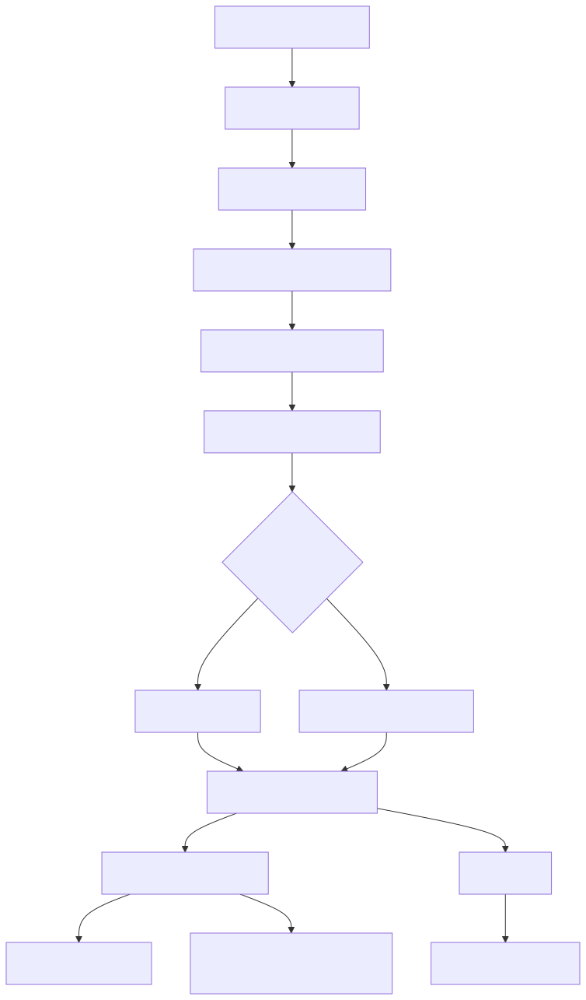

# Manual técnico do WorkflowAgent

## 1. Escopo

WorkflowAgent é a espinha dorsal determinística da plataforma para processos
descritos em YAML e executados como grafo LangGraph. O caminho oficial é:

```text
YAML -> AST -> parser -> compiler -> validator -> resolver -> StateGraph -> API/Job Core
```

Este manual cobre o contrato atual de nodes, Skills, Human-in-the-Loop (HIL),
execução síncrona, `direct_async`, agendamento durável, observabilidade e
integração com DeepAgent.

O código executável e os YAMLs versionados vencem qualquer exemplo deste
documento. O exemplo mais direto de Skills por node é
[`rag-config-workflow-skills-demo.yaml`](../../app/yaml/rag-config-workflow-skills-demo.yaml).

## 2. Responsabilidades e fronteiras

WorkflowAgent é responsável por:

- validar e compilar a seção `workflows` do YAML agentic;
- selecionar um único workflow habilitado;
- montar ou reutilizar o `StateGraph` por hash;
- executar nodes, transições, retry e snapshots;
- preservar `thread_id` para checkpoints e retomadas;
- materializar Skills declaradas por node;
- delegar a um DeepAgent pelo node `deepagent_call`;
- publicar execução assíncrona no Job Core;
- executar como alvo `workflow` da capacidade agentic de background.

Ele não é responsável por:

- inventar campos YAML ou tools fora do catálogo;
- persistir lifecycle próprio de job;
- criar `correlation_id` abaixo do boundary HTTP/Job Core;
- buscar conteúdo de uma Skill por fora do store canônico;
- executar DDL durante o runtime.

## 3. Arquitetura executável

### 3.1. AST e governança

`WorkflowParser` lê o YAML de forma diagnóstica. `WorkflowCompiler` produz o
fragmento canônico. `WorkflowSemanticValidator` verifica seleção, ids, modes,
tools, edges, subworkflows e Skills. Um mode desconhecido pode aparecer como
diagnóstico no parse, mas não entra no fragmento executável.

No escopo agentic, a AST é a fonte de verdade. Mudanças em campos de Workflow
exigem sincronização entre AST, parser, compiler, validator, runtime e docs.

### 3.2. Resolução do workflow ativo

`WorkflowConfigResolver` combina defaults, `tools_library`, memória e
`selected_entrypoint`. Se houver mais de um workflow habilitado sem seleção
inequívoca, o runtime falha fechado.

### 3.3. Runtime

`Workflowagent`:

1. carrega o workflow ativo;
2. executa `WorkflowIntegrityAnalyzer`;
3. inicializa `ToolsFactory`, `MemoryFactory`, checkpointer e, quando
   necessário, store de Skills;
4. calcula o hash do workflow;
5. reutiliza o grafo compatível ou monta um novo `StateGraph`;
6. executa a thread ou aplica `Command(resume=...)` na retomada.

`WorkflowOrchestrator` encapsula esse runtime e devolve o contrato normalizado
usado pela API e pelos processos de background.

### 3.4. Estado

O estado operacional inclui, entre outros campos:

- `messages`: histórico conversacional da execução;
- `input_text`: entrada original;
- `last_output`: última saída útil;
- `variables`: dados estruturados entre nodes;
- `metadata`: trace, decisões, snapshots e HIL;
- `context`: contexto compartilhado;
- `current_step`, `status`, `error_log` e `max_iterations`.

## 4. Catálogo atual de nodes

O catálogo real nasce de `NodeFactory.registry`. Os principais modes são:

| Mode | Responsabilidade |
| --- | --- |
| `agent` | raciocínio LLM, tools e Skills opcionais |
| `set` | atribuição declarativa em estado/variáveis |
| `if` | desvio booleano determinístico |
| `function` | transformação local por expressão segura |
| `tool` | chamada explícita a uma Tool do catálogo |
| `merge` | consolidação de leituras múltiplas |
| `router` | escolha de label, destino e fallback |
| `rule_router` | roteamento por regras, sem decisão LLM |
| `transform` | mapeamento de payload intermediário |
| `planner` | geração de plano estruturado |
| `executor` | execução de passos do plano |
| `schema_validator` | guarda estrutural do payload |
| `sub_workflow` | composição de outro workflow do documento |
| `deepagent_call` | delegação síncrona a um DeepAgent |
| `whatsapp_media_resolver` | preparação de mídia para WhatsApp |
| `whatsapp_send` | composição do payload final de WhatsApp |

Um campo aceito por um mode não deve ser transplantado para outro. Em
particular, `skills` só existe em node `mode: agent`.

## 5. Transições

### 5.1. Node-driven

Sem `edges`, o runtime liga os nodes na ordem declarada:

```text
START -> node_1 -> node_2 -> ... -> END
```

### 5.2. Edge-first

Quando `edges` existe e não está vazio, `EdgeCompiler` controla as transições.
As condições, labels, destinos e edge default precisam ser semanticamente
válidos antes do runtime.

Exemplo:

```yaml
edges:
  - source: "classificar"
    target: "tratar_critico"
    when: "variables.risco == 'critico'"
  - source: "classificar"
    target: "finalizar"
    default: true
```

## 6. Skills por node

### 6.1. Contrato

`skills_library` fica na raiz do documento. Cada node `agent` seleciona os
nomes que poderá usar:

```yaml
skills_library:
  - name: "politica-troca"
    description: "Use para perguntas sobre troca e devolução."
    content: |
      # Política de troca

      - Confirme a data de entrega.
      - O prazo de arrependimento é 7 dias corridos.

workflows:
  - id: "workflow_atendimento"
    enabled: true
    nodes:
      - id: "consultar_politica"
        mode: "agent"
        skills:
          - "politica-troca"
        prompt:
          system: >-
            Abra o SKILL.md aplicável com read_file antes de responder.
        tools: []
```

O validator rejeita:

- `skills` que não seja lista;
- `skills` em mode diferente de `agent`;
- item vazio;
- nome repetido no mesmo node;
- nome ausente em `skills_library`.

Os códigos estáveis incluem `WORKFLOW_NODE_SKILLS_TIPO_INVALIDO`,
`WORKFLOW_NODE_SKILLS_MODO_INVALIDO`,
`WORKFLOW_NODE_SKILLS_ITEM_INVALIDO`,
`WORKFLOW_NODE_SKILLS_DUPLICADA` e
`WORKFLOW_SKILL_NAO_DECLARADA_NA_LIBRARY`.

### 6.2. Runtime e progressive disclosure

Quando nenhum node declara Skills, o workflow não abre store e mantém o
caminho anterior inalterado.

Quando ao menos um node declara Skills:

1. o runtime exige `memory.checkpointer.postgres.connection_string` resolvida;
2. usa o `AsyncPostgresStore` do provider compartilhado;
3. `SkillsStoreMaterializer` compõe e versiona cada `SKILL.md`;
4. cada node recebe namespace próprio no formato lógico
   `workflow_store/<ENVIRONMENT>/user/<user_email>/<workflow_id>/<node_id>`;
5. o `SkillsMiddleware` publica apenas nome e descrição no prompt;
6. a tool oficial `read_file` abre `/skills/<nome>/SKILL.md` quando o modelo
   precisa do corpo.

O namespace por node impede que seleções diferentes se apaguem ou se vazem.
A reconciliação remove arquivos fora da seleção corrente e não regrava
conteúdo cujo hash permaneceu igual.

Não existe tabela atual `agent_skills`. O YAML resolvido é a fonte e o store é
a materialização durável de runtime.

### 6.3. Falhas explícitas

O runtime falha se:

- o backend do checkpointer não for PostgreSQL;
- o DSN estiver ausente ou ainda contiver placeholder;
- a tool `read_file` oficial não estiver disponível;
- uma Tool do YAML tentar usar o mesmo nome `read_file`;
- o conteúdo da Skill não puder ser materializado.

Rodar sem a Skill prometida pelo YAML não é fallback válido.

## 7. Retry, snapshots e auditoria por node

`retry_policy` aceita:

```yaml
settings:
  retry_policy:
    max_attempts: 3
    backoff_seconds: 2
    breaker_threshold: 2
```

`ExecutionPolicyRunner` centraliza tentativas, backoff e circuit breaker. O
runtime registra `execution_trace`, `data_flow`, `read_snapshots` e
`write_snapshots`. `reads` e `writes` tornam explícito o dado consumido e
produzido pelo node.

## 8. Human-in-the-Loop no foreground

`human_approval.enabled` ativa um `interrupt`. A pausa só é retomável quando
existem checkpointer e `thread_id` estável.

O endpoint de continuação é `POST /workflow/continue`. O request exige:

- `thread_id` da pausa;
- `correlation_id` da execução pausada;
- exatamente um entre `human_response` e `resume`;
- a mesma configuração por `yaml_config` ou `encrypted_data`;
- `interrupt_ids` quando o contrato precisar mapear interrupções específicas.

Exemplo com decisão tipada:

```json
{
  "thread_id": "thread_01J...",
  "correlation_id": "20260728_110000-...",
  "resume": {
    "decisions": [
      {"type": "approve"}
    ]
  },
  "interrupt_ids": ["interrupt_01J..."],
  "user_email": "aprovador@empresa.com",
  "encrypted_data": {
    "session_id": "<sessao>",
    "wrapped_key": "<chave-protegida>",
    "encrypted_yaml": "<yaml-cifrado>",
    "original_filename": "workflow.yaml",
    "encryption_scheme": "FERNET+RSA-OAEP",
    "yaml_operational_contract": "root_user_session_only_v1"
  }
}
```

As decisões canônicas são `approve`, `edit`, `reject` e `respond`. `edit`
exige `edited_action`; os outros tipos não aceitam esse campo.

### 8.1. HIL em background: dois jobs

WorkflowAgent em background suporta continuidade durável. A limitação antiga
que bloqueava `waiting_hil` foi removida.

O fluxo atual é:

1. o primeiro job executa o workflow;
2. o resultado funcional vira `outcome_kind=approval_requested`;
3. `agent_background.agent_hil_approval_requests` guarda a pendência;
4. o aprovador consulta `POST /agent/hil/review-context` e decide por
   `POST /agent/hil/decisions` ou por bridge de canal;
5. a decisão atômica publica um segundo job no Job Core;
6. o segundo job recebe novo `correlation_id`, preserva o vínculo com a
   execução anterior e aplica a continuação ao mesmo `thread_id`;
7. se houver outro interrupt, uma nova aprovação pode ser criada.

Para esse branch, `/agent/hil/decisions` responde HTTP `202` com:

```json
{
  "status": "continuation_submission_confirmed",
  "approval_request_id": "hil_01J...",
  "decision_type": "approve",
  "correlation_id": "20260728_110000-...",
  "thread_id": "thread_01J...",
  "continuation": null,
  "continuation_job_id": "job_01J...",
  "continuation_correlation_id": "20260728_111000-...",
  "previous_execution_correlation_id": "20260728_110000-..."
}
```

`202` confirma submissão, não conclusão. O consumidor acompanha o novo job.
Não reutilize a correlação anterior como identidade da continuação.

## 9. Catálogo detalhado de nodes suportados

O resumo da seção 4 é expandido abaixo para preservar o inventário canônico
usado pelo designer, pelos validadores e pelos testes de sincronização. Um
`mode` ausente deste catálogo falha em `NodeFactory.build`; não existe fallback
para um handler aproximado.

### 9.1. agent

Executa uma etapa agentic orientada por prompt, tools e estado. É o único modo
que aceita `workflows[].nodes[].skills`: a lista referencia a
`skills_library` raiz e é materializada no store antes da criação do agente.

### 9.2. set

Escreve valores determinísticos em `variables` ou nos destinos declarados pelo
node. É adequado para preparar flags e payloads sem chamar LLM ou integração.

### 9.3. if

Avalia uma condição declarativa e escolhe `true_go_to` ou `false_go_to`.
Ambos os destinos precisam existir no grafo ou ser `END`.

### 9.4. function

Executa uma função registrada e reutilizável. A configuração identifica a
função suportada e seus parâmetros; não autoriza código arbitrário no YAML.

### 9.5. tool

Invoca explicitamente uma Tool do catálogo interno da `ToolsFactory`. O node
recebe argumentos declarados e aplica a política de execução, retry e log do
workflow.

### 9.6. merge

Consolida fragmentos de estado produzidos por etapas anteriores, preservando o
contrato de leituras, escritas e snapshots do `BaseNodeHandler`.

### 9.7. router

Seleciona um label permitido e resolve o próximo destino pelo mapa governado
do node. Saída fora de `allowed_labels` não vira transição implícita.

### 9.8. rule_router

Aplica roteamento determinístico por regras explícitas e fallback declarado.
Use quando a decisão já pode ser expressa a partir do estado, sem LLM.

### 9.9. transform

Transforma um payload intermediário conforme o tipo e os mapeamentos
suportados pelo handler. O resultado pode alimentar nodes de validação,
roteamento ou persistência.

### 9.10. planner

Gera um plano estruturado para o `executor`, mantendo o plano no estado
auditável do workflow.

### 9.11. executor

Percorre os passos produzidos pelo planner e aplica as políticas de retry e
falha declaradas. Não substitui o Job Core: sua responsabilidade é o plano
interno da execução atual.

### 9.12. schema_validator

Valida um payload contra o schema configurado antes de liberar a próxima
etapa. Erro estrutural segue o comportamento explícito do node; não é
silenciado por valor padrão inventado.

### 9.13. sub_workflow

Executa outro workflow do mesmo documento, com herança configurável de
mensagens, metadata e variables. O runtime mantém uma pilha e bloqueia
recursão do workflow alvo.

### 9.14. deepagent_call

Delega uma etapa ao supervisor DeepAgent indicado por `supervisor_id`. O
validator falha fechado quando o supervisor não existe, está desabilitado ou
tem tipo incompatível. O runtime usa o
`DeepAgentWorkflowDelegationService`, normaliza a saída e registra a chamada
no metadata do workflow.

Se o DeepAgent interromper, o node propaga o `interrupt` para a mesma
`thread_id`. Na retomada, a decisão humana é convertida em
`Command(resume=...)` dentro da delegação; o workflow não reinicia o
supervisor nem cria uma thread paralela.

### 9.15. whatsapp_media_resolver

Resolve e normaliza o payload multimídia recebido do WhatsApp antes do envio
ou de uma etapa de processamento posterior.

### 9.16. whatsapp_send

Monta a mensagem de saída estruturada para o canal WhatsApp a partir do
payload já resolvido. O node prepara a saída; as credenciais continuam sob o
contrato governado do canal.

### 9.17. Inventário canônico de nodes do runtime

Os headings seguintes espelham exatamente as chaves atuais de
`NodeFactory.registry` e funcionam como checklist de sincronização.

### Node `agent`

Etapa agentic com prompt, tools e Skills opcionais do node.

### Node `deepagent_call`

Ponte síncrona, tipada e auditável entre WorkflowAgent e DeepAgent.

### Node `executor`

Executa os passos do plano estruturado no estado.

### Node `function`

Executa uma função registrada pelo runtime.

### Node `if`

Escolhe entre os ramos verdadeiro e falso declarados.

### Node `merge`

Consolida fragmentos de estado de etapas anteriores.

### Node `planner`

Produz o plano estruturado consumido pelo executor.

### Node `router`

Resolve um label permitido para o próximo node.

### Node `rule_router`

Roteia por regras determinísticas declaradas.

### Node `schema_validator`

Valida a estrutura de um payload antes da continuidade.

### Node `set`

Escreve valores determinísticos no estado.

### Node `sub_workflow`

Delega um trecho para outro workflow do mesmo documento.

### Node `tool`

Executa uma Tool governada da plataforma.

### Node `transform`

Transforma dados intermediários pelo contrato do handler.

### Node `whatsapp_media_resolver`

Normaliza mídia do WhatsApp em payload operacional.

### Node `whatsapp_send`

Prepara a mensagem estruturada de saída do WhatsApp.

## 10. Recursos avançados e integração com DeepAgent

### 10.10. Ponte nativa workflow -> DeepAgent

É a delegação síncrona oficial entre as duas espinhas:

```yaml
- id: "consultar_especialista"
  mode: "deepagent_call"
  params:
    supervisor_id: "supervisor_cliente_360"
    input_path: "input_text"
```

O validator confirma o `supervisor_id`. O runtime preserva a correlação e a
thread, normaliza o retorno e continua o grafo. Se o DeepAgent pausar, o node
propaga `interrupt`; a retomada do workflow aplica o resume no mesmo node.

### 10.11. Tool de background

Um node `tool` pode agendar uma execução desacoplada:

```yaml
- id: "agendar_conciliacao"
  mode: "tool"
  params:
    tool_id: "schedule_background_execution_request"
    arguments:
      target_type: "workflow"
      target_ref: "workflow_conciliacao_financeira"
      requested_command:
        expr: "input_text"
      schedule_type: "cron"
      cron_expression: "0 2 * * *"
      timezone: "America/Sao_Paulo"
```

Os `target_type` atuais são `deepagent` e `workflow`. O retorno imediato da
Tool descreve o agendamento; não é a resposta final do alvo. Para consumir o
resultado, modele consulta posterior pelas superfícies oficiais.

## 11. API de execução

### 11.1. `POST /workflow/execute`

`WorkflowRequest` aceita:

- `projectKey` opcional;
- `message` e `user_email` obrigatórios;
- `thread_id`, `conversation_id` e `scope_ref` opcionais;
- `format` igual a `text` ou `json`;
- `encrypted_data` como alternativa a `projectKey`;
- `execution_mode`: `auto`, `direct_sync` ou `direct_async`;
- `estimated_duration_seconds` opcional.

`projectKey` e `encrypted_data` são mutuamente exclusivos. `subprocess` é
rejeitado pelo boundary HTTP.

### 11.2. `direct_sync`

O router hidrata o YAML, executa `WorkflowOrchestrator` na chamada e devolve
`final_response`, `execution_steps`, `thread_id`, `workflow_metadata`,
`analysis`, tempo e correlação.

### 11.3. `direct_async`

`WorkflowDirectAsyncJobPublisher` publica um job no Job Core. A resposta
imediata contém `task_id`, `polling_url`, `status_url` e `stream_url`.
Não há `FastAPI BackgroundTasks` nesse caminho.

```json
{
  "projectKey": "conciliacao",
  "message": "Concilie os títulos do último fechamento.",
  "user_email": "operador@empresa.com",
  "execution_mode": "direct_async",
  "estimated_duration_seconds": 180
}
```

O cliente acompanha `/api/v1/status/{task_id}` ou
`/api/v1/status/stream/{task_id}` até um estado terminal.

## 12. Execução agentic agendada

Agendamento durável e `direct_async` compartilham o Job Core, mas têm entradas
diferentes:

| Caminho | Entrada | Uso |
| --- | --- | --- |
| `/workflow/execute` + `direct_async` | request HTTP imediato | executar uma vez fora da resposta web |
| `schedule_background_execution_request` | agenda tipada | recorrência ou execução futura |

No agendamento:

- a agenda e o comando vivem em `scheduler.scheduled_jobs`;
- lifecycle e eventos vivem em `job_core.job_runs` e
  `job_core.job_run_events`;
- `agent_background.background_execution_runs` guarda contexto, resultado ou
  erro funcional, não status de job;
- `agent_background.agent_hil_approval_requests` guarda a aprovação durável;
- `agent_background.background_execution_outbox` guarda fatos de comunicação.

Não existem tabelas atuais `background_execution_requests`,
`background_execution_schedules` ou `background_execution_events` no schema
agentic.

## 13. Observabilidade

Para reconstruir uma execução, preserve:

- `correlation_id` do boundary;
- `thread_id` do checkpoint;
- `task_id`/`job_id` quando houver Job Core;
- `workflow_id` e node atual;
- `execution_trace` e `data_flow`;
- `read_snapshots` e `write_snapshots`;
- eventos de retry e erro;
- eventos de Skills, incluindo node, namespace, materializadas, removidas e
  falhas;
- ids da aprovação e do segundo job quando houver HIL background.

O cliente captura o `correlation_id` devolvido; não cria um identificador
paralelo. O segundo job HIL recebe uma nova correlação e mantém a anterior como
referência.

## 14. Diagnóstico por sintoma

### Workflow não selecionado

Verifique `selected_entrypoint`, `enabled` e os diagnósticos
`WORKFLOW_SELECAO_OBRIGATORIA`/
`WORKFLOW_SELECIONADO_INEXISTENTE`.

### Grafo falha antes do primeiro node

Leia o relatório de `WorkflowIntegrityAnalyzer`, as referências de tools,
edges e subworkflows. Não trate isso como erro de LLM.

### Skill não aparece no prompt

Confirme, nesta ordem:

1. node é `mode: agent`;
2. nome existe na biblioteca raiz;
3. DSN PostgreSQL está resolvido;
4. eventos `workflow.runtime.skills.materialized` e
   `workflow.node.agent.skills_middleware_attached` usam o mesmo namespace;
5. evento `workflow.node.agent.skills_read_tool_injected` existe.

### Continuação retorna `400` ou `404`

`400` costuma indicar contrato inválido, thread vazia ou ausência/conflito
entre `human_response` e `resume`. `404` indica que o checkpoint da combinação
informada não foi localizado. Use a mesma thread e correlação da pausa.

### Decisão HIL retorna `202`, mas não há resposta final

Esse é o contrato esperado para background. Consulte
`continuation_job_id`; não repita a decisão.

### Agendamento aparece, mas não há lifecycle no schema agentic

Consulte Scheduler e Job Core. `agent_background` é projeção factual, não um
ledger paralelo.

## 15. Validação recomendada

Antes de publicar um YAML de Workflow:

1. valide a AST por `POST /config/assembly/validate` com `target=workflow`;
2. exija `success=true`, `is_valid=true` e `error_count=0`;
3. execute os testes do slice alterado;
4. valide o caminho HTTP oficial;
5. para HIL, prove pausa e retomada na mesma thread;
6. para background, prove o primeiro job, o pedido HIL, a decisão `202` e o
   segundo job terminal;
7. leia o log pela correlação oficial.

Tutorial de integração: [WorkflowAgent com Skills e HIL pelas APIs](../usuario/TUTORIAL-101-WORKFLOW-SKILLS-HIL.md).

## 16. Diagrama



## 17. Fontes de verdade no repositório

- `src/config/agentic_assembly/ast/workflow.py`
- `src/config/agentic_assembly/parsers/workflow_parser.py`
- `src/config/agentic_assembly/compilers/workflow_compiler.py`
- `src/config/agentic_assembly/validators/workflow_semantic_validator.py`
- `src/agentic_layer/workflow/agent_workflow.py`
- `src/agentic_layer/workflow/integrity_analyzer.py`
- `src/agentic_layer/workflow/execution_policy.py`
- `src/agentic_layer/workflow/nodes/agent_node.py`
- `src/agentic_layer/workflow/nodes/deepagent_call_node.py`
- `src/agentic_layer/skills/skills_store_materializer.py`
- `src/api/routers/workflow_router.py`
- `src/api/services/workflow_direct_async_publisher.py`
- `src/api/services/workflow_hil_continuation_service.py`
- `src/api/services/background_hil_continuation_execution_service.py`
- `src/api/routers/agent_router.py`
- `scripts/sql/20260502_create_agent_background_schema.sql`

## 18. Referências oficiais do ecossistema

- [LangGraph: interrupts](https://docs.langchain.com/oss/python/langgraph/interrupts)
- [Deep Agents: Skills](https://docs.langchain.com/oss/python/deepagents/skills)
- [Deep Agents: overview](https://docs.langchain.com/oss/python/deepagents/overview)
