# Manual tecnico: runtime de correlation_id, logging estruturado e leitura administrativa

## 1. Escopo

Este documento descreve o comportamento tecnico confirmado no codigo atual para quatro pontos.

1. resolucao do correlation_id no boundary HTTP;
2. criacao de logger correlacionado e logger tecnico;
3. contrato de payload canônico dos logs;
4. leitura administrativa via provider oficial.

O objetivo e documentar o que o runtime realmente faz hoje, sem preencher lacunas por inferencia.

## 2. Entry points confirmados

Os pontos donos deste subsistema, confirmados no codigo lido, sao estes.

1. src/api/service_api.py: middleware HTTP, injecao do header e do correlationId em JSON.
2. src/core/logging_system.py: normalizacao, formatter, logger correlacionado, logger tecnico e CloudWatch.
3. src/core/base_correlation_component.py: contrato de componentes correlacionados.
4. src/core/log_canonical_fields.py: campos canônicos globais e builder oficial.
5. src/core/log_origin_metadata.py: sidecar e manifest por correlacao.
6. src/api/services/log_provider_service.py: resolucao do provider ativo e classes concretas.
7. src/api/services/canonical_log_reader.py: leitura canônica da familia de logs.
8. src/api/services/logs_admin_service.py: boundary de servicos para analise administrativa.
9. src/api/routers/logs_router.py: endpoints HTTP de administracao.
10. app/ui/static/js/plataforma-agentes-ia-crypto.js, admin-ingestao.js e ui-webchat-v3.js: captura e propagacao do correlation_id no frontend.

## 3. Correlation_id no runtime HTTP

### 3.1. Criacao e leitura fora do middleware

generate_correlation_id() delega para CorrelationIdFactory.generate().
Ja _get_request_correlation_id(request) faz o oposto: ele resolve o id do request sem gerar novo valor fora do middleware.

Ordem confirmada em _get_request_correlation_id:

1. request.state.correlation_id
2. header x-correlation-id ou X-Correlation-Id
3. se nada existir, levanta ValueError

Em linguagem simples: qualquer camada fora do middleware deve consumir o id oficial ja existente. Ela nao pode inventar outro por conveniencia.

### 3.2. Boundary HTTP compartilhado

O middleware log_requests em src/api/service_api.py segue este fluxo.

1. le request.state.correlation_id;
2. le o header x-correlation-id;
3. escolhe o primeiro valor nao vazio;
4. normaliza esse valor;
5. se nada existir, cria um novo correlation_id oficial;
6. grava o valor em request.state.correlation_id;
7. propaga o contexto via _request_logger_scope;
8. sempre devolve X-Correlation-Id na resposta;
9. injeta correlationId no body quando a resposta for JSON compativel.

### 3.3. Regras da injecao em JSON

_inject_correlation_in_json_body so atua quando todas as condicoes abaixo sao verdadeiras.

1. a resposta e application/json;
2. nao e SSE, HTML, texto puro, estatico ou binario;
3. o payload ainda nao contem correlationId nem correlation_id;
4. nao ha background task anexada;
5. o body pode ser parseado como JSON valido.

Em linguagem simples: o middleware reforca o contrato de correlacao para respostas JSON, mas nao toca HTML, stream ou arquivo binario.

## 3.4. Boundary nao HTTP e iniciadores do sistema

O codigo atual confirma que o boundary oficial nao e exclusivo da API.

Quando um processo real de produto nasce de um iniciador nao interativo do proprio sistema, como scheduler, runner ou bootstrap de execucao, esse iniciador vira o primeiro dono oficial daquela execucao.

Nesse caso, a regra pratica e esta.

1. o iniciador cria uma unica vez o `correlation_id` oficial;
2. o iniciador cria o logger oficial da execucao ja vinculado a esse mesmo `correlation_id`;
3. as camadas abaixo passam apenas a preservar e propagar esse valor.

Em linguagem simples: se o scheduler abriu a execucao, ele faz o papel que o endpoint HTTP faria numa chamada interativa. Depois disso, ninguem abaixo dele pode inventar outro id ou outro logger com identidade propria.

## 4. Normalizacao e contrato do correlation_id

normalize_correlation_id(correlation_id) nao gera id novo.
Ela aceita apenas um valor nao vazio e valido segundo CorrelationIdFactory.is_valid().
Se o valor vier vazio ou invalido, a funcao falha com ValueError.

Isso confirma duas regras praticas.

1. normalizar nao significa regenerar;
2. o valor oficial deve nascer no boundary e depois ser apenas preservado.

## 5. Contrato de componentes correlacionados

BaseCorrelationComponent reforca no construtor que yaml_config precisa conter:

1. user_session;
2. user_session.correlation_id;
3. user_session.user_email.

Depois disso, a base:

1. normaliza o correlation_id recebido;
2. sincroniza o valor final de volta no user_session;
3. cria self.logger via create_logger_with_correlation(self.correlation_id).

Em linguagem simples: os componentes da aplicacao nao recebem permissao para operar sem correlation_id oficial.

## 6. Logger correlacionado versus logger tecnico

### 6.1. create_logger_with_correlation

create_logger_with_correlation(correlation_id, origin=None, log_file_suffix=None) tem dois comportamentos.

#### Caminho 1: logger compartilhado

Se enable_correlation_file_logging estiver desligado ou se o id nao for elegivel para arquivo dedicado, a funcao cria um shared bound logger e retorna SystemLogger com mirror_to_standard=False.

No codigo atual, a elegibilidade do arquivo dedicado e definida por _is_file_correlation_id(), que exige CorrelationIdFactory.is_valid(correlation_id).

#### Caminho 2: logger com arquivo dedicado

Se o correlation_id estiver no formato canônico e a flag enable_correlation_file_logging estiver ligada, a funcao:

1. calcula o nome deterministico do arquivo;
2. resolve o diretorio usando log_correlation_directory e log_output_directory;
3. cria FileHandler dedicado;
4. aplica _CorrelationFileIsolationFilter para aceitar apenas eventos da mesma correlacao;
5. grava sidecar de origem;
6. retorna SystemLogger associado a esse handler.

### 6.2. create_component_logger

create_component_logger(component_name, origin=None) cria um shared bound logger tecnico, com component bindado, sem ocupar o campo correlation_id.

Uso correto:

1. bootstrap tecnico;
2. inicializacao da aplicacao;
3. eventos fora de processo real correlacionado.

Uso incorreto:

1. service chamado dentro de request real;
2. worker processando job de produto;
3. qualquer trecho que ja tenha correlation_id oficial disponivel.

Regra complementar importante: fora do boundary oficial, o componente nao pode criar logger com identidade propria por conveniencia.
Se a arquitetura da classe exigir um logger local, esse logger local so pode nascer com o mesmo `correlation_id` oficial ja presente no contexto atual.
Em linguagem simples: pode existir uma nova instancia local do logger oficial, mas nao pode existir uma identidade nova de execucao.

## 7. Formatter, payload e contrato canônico

### 7.1. Catalogo global

src/core/log_canonical_fields.py define LOG_CANONICAL_GLOBAL_FIELDS e os grupos oficiais em LOG_CANONICAL_FIELD_GROUPS.
O builder global e build_canonical_log_context(...).

Campos globais confirmados no catalogo incluem, entre outros:

- event_name
- correlation_id
- component
- operation
- stage
- status
- duration_ms
- http_method
- http_path
- http_status
- run_id
- parent_run_id
- child_run_id
- error_type
- error_message
- stack_trace
- worker_execution_correlation_id

### 7.2. Enriquecimento em runtime

_resolve_runtime_log_context complementa o payload com correlation_id, run_id, parent_run_id e child_run_id a partir do payload explicito e dos contextvars do request.

### 7.3. Evento sem event_name

_build_standard_log_payload converte LogRecord em payload JSON estruturado.
Quando nao encontra event_name valido, ele marca o evento como logging.contract.violation e preenche dados de origem como source_file, source_function e source_line.

Em linguagem simples: o subsistema nao assume que qualquer JSON ja e canônico. Se faltar event_name, o proprio log denuncia a violacao do contrato.

### 7.4. Sanitizacao

sanitize_structlog_event percorre o evento e mascara chaves sensiveis, como token, secret, password, dsn e authorization, preservando a estrutura basica do payload.

## 8. Builders de slice confirmados

O codigo atual confirma pelo menos dois builders especializados usados sobre o contrato global.

1. build_ingestion_event_log_context em src/ingestion_layer/telemetry/log_vocabulary.py
2. build_rag_event_log_context em src/telemetry/rag/log_vocabulary.py

Em linguagem simples: slices importantes nao montam o vocabulário global “na mao”. Eles compoem sobre o builder canônico.

## 9. Arquivos dedicados, sidecar e manifest

write_correlation_origin_sidecar(...) em src/core/log_origin_metadata.py grava um sidecar atomico por correlacao em _meta.
Essa mesma rotina registra a relacao no correlation_manifest.jsonl.

Dois efeitos praticos saem disso.

1. a origem do logger e preservada sem sobrescrever a primeira criacao;
2. a familia de logs pode ser reencontrada depois via manifest, sem varredura cega.

Além disso, build_correlation_log_file_fields(...) em src/core/logging_system.py expoe os nomes determinísticos de log_file_name, worker_log_file_name e scheduler_log_file_name usados pelos endpoints.

## 10. CloudWatch no processo atual

O wiring confirmado para CloudWatch e este.

1. defer_cloudwatch_until_worker() adia a anexacao durante o ciclo inicial.
2. activate_cloudwatch_for_worker() libera o adiamento no processo worker atual.
3. no lifespan da aplicacao, src/api/service_api.py grava em application.state:
   - cloudwatch_stream_name
   - cloudwatch_handler_ativo
   - active_log_provider_type

Em linguagem simples: habilitar CloudWatch na configuracao nao significa que todo processo ja saiu com handler ativo desde o primeiro momento. O worker atual precisa passar pela ativacao efetiva.

## 11. Provider administrativo de logs

### 11.1. Resolucao do provider ativo

resolve_active_log_provider_type(settings_instance) segue exatamente esta regra.

1. se environment == development, retorna filesystem;
2. fora de development, exige LOG_PROVIDER_TYPE explicito;
3. os tipos suportados hoje sao filesystem, northflank, aws_cloudwatch e azure;
4. valor ausente ou invalido gera RuntimeError.

### 11.2. Instanciacao concreta

build_log_provider(...) usa o tipo resolvido para instanciar uma destas classes.

1. FileSystemProvider
2. AWSCloudWatchProvider
3. NorthflankProvider
4. AzureLogProvider

Em linguagem simples: nao existe fallback silencioso para outro provider fora de development.

## 12. Leitura canônica e analise administrativa

CanonicalLogReader e a abstracao unica para leitura e descoberta da familia de logs materializados.
Entre as responsabilidades confirmadas no codigo estao:

1. resolver o diretorio real de logs;
2. validar arquivo ou diretorio existente;
3. expandir padroes de arquivos pelo provider;
4. classificar o papel do arquivo como api, worker, scheduler ou correlacionado;
5. ordenar a familia de forma estavel.

Na camada de servicos, analyze_logs_via_admin_provider(...) em src/api/services/logs_admin_service.py:

1. instancia o provider canônico;
2. prepara os logs para analise;
3. executa AnalyzeLogsCommand usando yaml minimo de analise;
4. limpa artefatos temporarios no bloco final.

Os endpoints HTTP que expõem essa operacao estao em src/api/routers/logs_router.py.

## 13. Regra tecnica da UI

O codigo atual confirma tres comportamentos importantes do frontend.

1. plataforma-agentes-ia-crypto.js tem generateCorrelationId() que sempre lança erro para impedir geracao client-side.
2. admin-ingestao.js tem buildPinnedCorrelationHeaders(correlationId), que reaproveita o mesmo id emitido pelo backend em chamadas auxiliares.
3. ui-webchat-v3.js prioriza o header HTTP x-correlation-id e depois campos do body para extrair o id da resposta.

Em linguagem simples: a UI trabalha como consumidora e propagadora do id oficial. Ela nao atua como fabrica de correlation_id.

## 14. Checklist de diagnostico

Quando houver problema de rastreabilidade ou de leitura de log, a ordem tecnica mais barata de verificacao e esta.

1. confirmar X-Correlation-Id na resposta HTTP;
2. confirmar request.state.correlation_id no boundary envolvido;
3. confirmar se o componente usou create_logger_with_correlation ou create_component_logger no lugar correto;
4. confirmar se o evento saiu com event_name canônico;
5. confirmar se a correlacao era elegivel para arquivo dedicado;
6. confirmar sidecar e correlation_manifest.jsonl quando o arquivo dedicado era esperado;
7. confirmar environment e LOG_PROVIDER_TYPE antes de culpar o provider;
8. confirmar se o frontend so reaproveitou o id oficial, sem tentar gerar outro.

## 15. Diagrama tecnico

## 16. Evidencia no codigo

- src/api/service_api.py
- src/core/logging_system.py
- src/core/base_correlation_component.py
- src/core/log_canonical_fields.py
- src/core/log_origin_metadata.py
- src/api/services/log_provider_service.py
- src/api/services/canonical_log_reader.py
- src/api/services/logs_admin_service.py
- src/api/routers/logs_router.py
- src/ingestion_layer/telemetry/log_vocabulary.py
- src/telemetry/rag/log_vocabulary.py
- app/ui/static/js/plataforma-agentes-ia-crypto.js
- app/ui/static/js/admin-ingestao.js
- app/ui/static/js/ui-webchat-v3.js

## 17. Lacunas no codigo

### 17.1. OpenTelemetry ou tracing distribuido formal

Nao encontrado no codigo deste subsistema.

Onde deveria estar:

- src/core/
- src/api/services/
- src/telemetry/

### 17.2. Contrato oficial de logs canônicos emitidos pelo frontend

Nao encontrado no codigo.
O frontend atual apenas captura, exibe e propaga correlation_id devolvido pela API.

Onde deveria estar:

- app/ui/static/js/
- app/ui/static/
