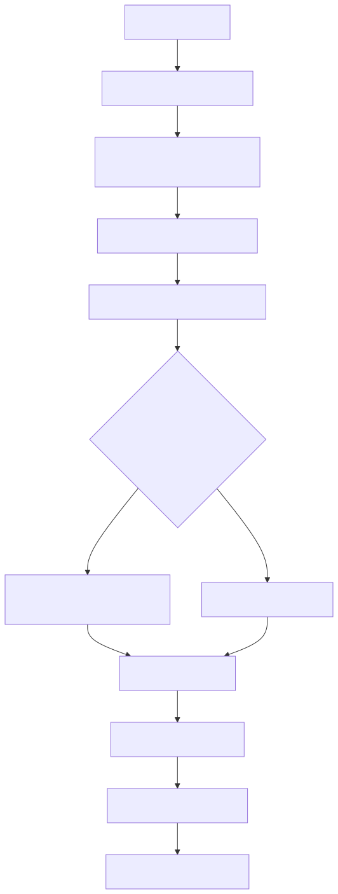

# Manual tecnico: runtime de correlation_id, logging estruturado, destinos de escrita e leitura administrativa

## 1. Escopo

Este documento descreve o comportamento tecnico confirmado no codigo atual para seis pontos.

1. resolucao do correlation_id no boundary HTTP;
2. criacao de logger correlacionado e logger tecnico;
3. hierarquia de destinos de escrita de logs;
4. contrato de payload canônico dos logs;
5. object storage e sink MinIO de logs;
6. leitura administrativa via provider oficial.

O objetivo e documentar o que o runtime realmente faz hoje, sem preencher lacunas por inferencia.

## 2. Entry points confirmados

Os pontos donos deste subsistema, confirmados no codigo lido, sao estes.

1. `src/api/service_api.py`: middleware HTTP, injecao do header e do `correlationId` em JSON.
2. `src/core/logging_system.py`: normalizacao, formatter, logger correlacionado, logger tecnico, wiring de filesystem, CloudWatch e MinIO.
3. `src/core/log_destinations.py`: hierarquia de destinos concretos de escrita e shipper de MinIO.
4. `src/core/log_object_storage.py`: contrato de object storage, adapter MinIO e montagem segura de key e prefix.
5. `src/core/base_correlation_component.py`: contrato de componentes correlacionados.
6. `src/core/log_canonical_fields.py`: campos canônicos globais e builder oficial.
7. `src/core/log_origin_metadata.py`: sidecar e manifest por correlacao.
8. `src/api/services/log_provider_service.py`: resolucao do provider ativo e classes concretas de leitura.
9. `src/api/services/canonical_log_reader.py`: leitura canônica da familia de logs.
10. `src/api/services/logs_admin_service.py`: boundary de servicos para analise administrativa.
11. `src/api/routers/logs_router.py`: endpoints HTTP de administracao.
12. `app/ui/static/js/plataforma-agentes-ia-crypto.js`, `admin-ingestao.js` e `ui-webchat-v3.js`: captura e propagacao do `correlation_id` no frontend.

## 3. Correlation_id no runtime HTTP

### 3.1. Criacao e leitura fora do middleware

`generate_correlation_id()` delega para `CorrelationIdFactory.generate()`.
Ja `_get_request_correlation_id(request)` faz o oposto: ele resolve o id do request sem gerar novo valor fora do middleware.

Ordem confirmada em `_get_request_correlation_id`:

1. `request.state.correlation_id`;
2. header `x-correlation-id` ou `X-Correlation-Id`;
3. se nada existir, levanta `ValueError`.

Em linguagem simples: qualquer camada fora do middleware deve consumir o id oficial ja existente. Ela nao pode inventar outro por conveniencia.

### 3.2. Boundary HTTP compartilhado

O middleware `log_requests` em `src/api/service_api.py` segue este fluxo.

1. le `request.state.correlation_id`;
2. le o header `x-correlation-id`;
3. escolhe o primeiro valor nao vazio;
4. normaliza esse valor;
5. se nada existir, cria um novo `correlation_id` oficial;
6. grava o valor em `request.state.correlation_id`;
7. propaga o contexto via `_request_logger_scope`;
8. sempre devolve `X-Correlation-Id` na resposta;
9. injeta `correlationId` no body quando a resposta for JSON compativel.

### 3.3. Regras da injecao em JSON

`_inject_correlation_in_json_body` so atua quando todas as condicoes abaixo sao verdadeiras.

1. a resposta e `application/json`;
2. nao e SSE, HTML, texto puro, estatico ou binario;
3. o payload ainda nao contem `correlationId` nem `correlation_id`;
4. nao ha background task anexada;
5. o body pode ser parseado como JSON valido.

Em linguagem simples: o middleware reforca o contrato de correlacao para respostas JSON, mas nao toca HTML, stream ou arquivo binario.

## 3.4. Boundary nao HTTP e iniciadores do sistema

O codigo atual confirma que o boundary oficial nao e exclusivo da API.

Quando um processo real de produto nasce de um iniciador nao interativo do proprio sistema, como scheduler, runner ou bootstrap de execucao, esse iniciador vira o primeiro dono oficial daquela execucao.

Nesse caso, a regra pratica e esta.

1. o iniciador cria uma unica vez o `correlation_id` oficial;
2. o iniciador cria o logger oficial da execucao ja vinculado a esse mesmo `correlation_id`;
3. as camadas abaixo passam apenas a preservar e propagar esse valor.

Em linguagem simples: se o scheduler abriu a execucao, ele faz o papel que o endpoint HTTP faria numa chamada interativa. Depois disso, ninguem abaixo dele pode inventar outro id ou outro logger com identidade propria.

## 4. Normalizacao e contrato do correlation_id

`normalize_correlation_id(correlation_id)` nao gera id novo.
Ela aceita apenas um valor nao vazio e valido segundo `CorrelationIdFactory.is_valid()`.
Se o valor vier vazio ou invalido, a funcao falha com `ValueError`.

Isso confirma duas regras praticas.

1. normalizar nao significa regenerar;
2. o valor oficial deve nascer no boundary e depois ser apenas preservado.

## 5. Contrato de componentes correlacionados

`BaseCorrelationComponent` reforca no construtor que `yaml_config` precisa conter:

1. `user_session`;
2. `user_session.correlation_id`;
3. `user_session.user_email`.

Depois disso, a base:

1. normaliza o `correlation_id` recebido;
2. sincroniza o valor final de volta no `user_session`;
3. cria `self.logger` via `create_logger_with_correlation(self.correlation_id)`.

Em linguagem simples: os componentes da aplicacao nao recebem permissao para operar sem `correlation_id` oficial.

## 6. Logger correlacionado versus logger tecnico

### 6.1. create_logger_with_correlation

`create_logger_with_correlation(correlation_id, origin=None, log_file_suffix=None)` tem dois comportamentos.

#### Caminho 1: logger compartilhado

Se `enable_correlation_file_logging` estiver desligado ou se o id nao for elegivel para arquivo dedicado, a funcao cria um shared bound logger e retorna `SystemLogger` com `mirror_to_standard=False`.

No codigo atual, a elegibilidade do arquivo dedicado e definida por `_is_file_correlation_id()`, que exige `CorrelationIdFactory.is_valid(correlation_id)`.

#### Caminho 2: logger com arquivo dedicado e destinos anexados

Se o `correlation_id` estiver no formato canônico e a flag `enable_correlation_file_logging` estiver ligada, a funcao:

1. calcula o nome deterministico do arquivo;
2. resolve o diretorio usando `log_correlation_directory` e `log_output_directory`;
3. monta um `LogDestinationContext` com `correlation_id`, origem, papel do log, ambiente e `process_id`;
4. anexa primeiro o destino `FilesystemLogDestination`;
5. aplica `_CorrelationFileIsolationFilter` para aceitar apenas eventos da mesma correlacao;
6. grava sidecar de origem;
7. anexa `CloudWatchLogDestination` quando o wiring estiver habilitado e ativo;
8. anexa `MinioLogDestination` quando `enable_minio_logging` estiver ligado e `minio_log_upload_mode` nao for `disabled`;
9. retorna `SystemLogger` associado aos handlers criados.

Em linguagem simples: o codigo que cria o logger correlacionado nao precisa mais conhecer detalhes de `FileHandler`, CloudWatch ou MinIO. Ele conhece apenas destinos concretos que sabem anexar seus proprios handlers.

### 6.2. create_component_logger

`create_component_logger(component_name, origin=None)` cria um shared bound logger tecnico, com `component` bindado, sem ocupar o campo `correlation_id`.

Uso correto:

1. bootstrap tecnico;
2. inicializacao da aplicacao;
3. eventos fora de processo real correlacionado.

Uso incorreto:

1. service chamado dentro de request real;
2. worker processando job de produto;
3. qualquer trecho que ja tenha `correlation_id` oficial disponivel.

Regra complementar importante: fora do boundary oficial, o componente nao pode criar logger com identidade propria por conveniencia.
Se a arquitetura da classe exigir um logger local, esse logger local so pode nascer com o mesmo `correlation_id` oficial ja presente no contexto atual.

Em linguagem simples: pode existir uma nova instancia local do logger oficial, mas nao pode existir uma identidade nova de execucao.

## 7. Formatter, payload e contrato canônico

### 7.1. Catalogo global

`src/core/log_canonical_fields.py` define `LOG_CANONICAL_GLOBAL_FIELDS` e os grupos oficiais em `LOG_CANONICAL_FIELD_GROUPS`.
O builder global e `build_canonical_log_context(...)`.

Campos globais confirmados no catalogo incluem, entre outros:

- `event_name`
- `correlation_id`
- `component`
- `operation`
- `stage`
- `status`
- `duration_ms`
- `http_method`
- `http_path`
- `http_status`
- `run_id`
- `parent_run_id`
- `child_run_id`
- `error_type`
- `error_message`
- `stack_trace`
- `worker_execution_correlation_id`

### 7.2. Enriquecimento em runtime

`_resolve_runtime_log_context` complementa o payload com `correlation_id`, `run_id`, `parent_run_id` e `child_run_id` a partir do payload explicito e dos contextvars do request.

### 7.3. Evento sem event_name

`_build_standard_log_payload` converte `LogRecord` em payload JSON estruturado.
Quando nao encontra `event_name` valido, ele marca o evento como `logging.contract.violation` e preenche dados de origem como `source_file`, `source_function` e `source_line`.

Em linguagem simples: o subsistema nao assume que qualquer JSON ja e canônico. Se faltar `event_name`, o proprio log denuncia a violacao do contrato.

### 7.4. Sanitizacao

`sanitize_structlog_event` percorre o evento e mascara chaves sensiveis, como `token`, `secret`, `password`, `dsn` e `authorization`, preservando a estrutura basica do payload.

## 8. Builders de slice confirmados

O codigo atual confirma pelo menos dois builders especializados usados sobre o contrato global.

1. `build_ingestion_event_log_context` em `src/ingestion_layer/telemetry/log_vocabulary.py`;
2. `build_rag_event_log_context` em `src/telemetry/rag/log_vocabulary.py`.

Em linguagem simples: slices importantes nao montam o vocabulario global na mao. Eles compoem sobre o builder canônico.

## 9. Hierarquia de escrita de logs

### 9.1. Classe ancestral dos destinos

`BaseLogDestination` em `src/core/log_destinations.py` e a classe ancestral dos destinos concretos de escrita.

O contrato confirmado hoje e este:

1. `build_handlers(context)` devolve uma tupla de handlers `logging`;
2. `after_file_created(...)` existe como hook opcional para destinos que dependem do arquivo local;
3. `close()` existe como ponto de encerramento de recursos quando necessario.

### 9.2. Contexto comum dos destinos

`LogDestinationContext` concentra o contexto compartilhado entre os destinos:

1. `correlation_id`;
2. `origin`;
3. `log_file_suffix`;
4. `log_path`;
5. `log_role`;
6. `environment`;
7. `process_id`.

Em linguagem simples: o contexto comum evita que cada destino precise reconstruir sozinho dados basicos da correlacao e do arquivo.

### 9.3. Destino filesystem

`FilesystemLogDestination` e o destino primario de escrita local.

O comportamento confirmado e este:

1. exige `log_path`;
2. garante que a pasta exista;
3. pode tocar o arquivo antes da primeira escrita quando `delay=False`;
4. cria `FileHandler` simples ou `RotatingFileHandler`, conforme configuracao;
5. aplica formatter, nivel e filtros recebidos.

Em linguagem simples: o arquivo local continua sendo a primeira trilha de gravacao do log correlacionado.

### 9.4. Destino CloudWatch

`CloudWatchLogDestination` preserva o wiring ja existente.

O comportamento confirmado e simples:

1. recebe uma `handler_factory`;
2. pede um handler pronto para a factory;
3. anexa esse handler apenas quando a factory devolver algo valido.

### 9.5. Destino MinIO para escrita

`MinioLogDestination` e o destino concreto de upload para object storage.

Ele nao envia uma linha por vez. O fluxo real e este:

1. `MinioLogDestination.build_handlers(...)` exige `log_path`;
2. ele cria um `MinioShippingHandler`;
3. `MinioShippingHandler.emit(record)` nao faz upload e `flush()` nao faz I/O remoto;
4. `MinioShippingHandler.close()` dispara o envio do arquivo completo **em uma thread daemon** (envio em background), para nao bloquear o caller (ex.: o fim de um request/job nao pode travar esperando latencia do MinIO);
5. o handler registra callback best-effort para shutdown normal do processo;
6. o envio concreto fica em `MinioLogShipper.ship_file(...)`.

`MinioLogShipper` monta a key canônica, le os bytes do arquivo local e chama o adapter de object storage.

**Guarda de finalizacao do interpretador.** Tanto `_ship_async` quanto `ship_file` consultam
`_interpreter_is_shutting_down()` antes de tentar o envio. Durante os callbacks de `atexit` (ex.:
`logging.shutdown` fechando os handlers), `sys.is_finalizing()` ainda retorna `False`, mas o pool
global de `concurrent.futures` ja foi desligado — qualquer I/O que agende um future (o cliente
boto3 do MinIO faz isso) levantaria `RuntimeError: cannot schedule new futures after interpreter
shutdown` e dispararia retry/erro ruidoso por handler. Por isso o helper checa os dois sinais
(`sys.is_finalizing()` e `concurrent.futures.thread._shutdown`) e, em finalizacao, pula o envio de
forma limpa. O envio confiavel acontece no `close()` explicito dos runners (api/worker/scheduler
chamam `close_runner_logger`), que ocorre **antes** da finalizacao do interpretador.

No MinIO, o objeto remoto e organizado pelo `correlation_id` e pelo papel operacional do processo. O papel vem de `PROCESS_ROLE` quando disponivel, com valores esperados `api`, `worker` ou `scheduler`. Se `PROCESS_ROLE` nao estiver definido ou vier com valor diferente desses papeis, o sink usa `api`.

Exemplos de keys remotas:

1. `logs/<correlation_id>/api/<correlation_id>.json`;
2. `logs/<correlation_id>/worker/<correlation_id>-worker.json`;
3. `logs/<correlation_id>/scheduler/<correlation_id>-scheduler.json`.

Em linguagem simples: o MinIO nao participa da escrita quente de cada evento. O arquivo local recebe os eventos primeiro, e o MinIO recebe uma copia completa quando o handler fecha. Em encerramento normal do processo, o handler tambem tenta fechar e enviar o arquivo de forma best-effort. A copia remota fica separada por papel para evitar colisao entre API, worker e scheduler.

Configuracao pratica por processo:

1. API: `PROCESS_ROLE=api`;
2. worker: `PROCESS_ROLE=worker`;
3. scheduler: `PROCESS_ROLE=scheduler`.

Configuracao de retencao local apos upload:

1. `MINIO_LOG_DELETE_LOCAL_AFTER_SHIP=false`: mantem o arquivo local depois do upload para MinIO;
2. `MINIO_LOG_DELETE_LOCAL_AFTER_SHIP=true`: remove o arquivo local somente depois de o upload para MinIO terminar com sucesso;
3. se o upload falhar ou esgotar retry, o arquivo local nao e removido por essa flag.

### 9.6. Retry minimo do sink MinIO

O envio ao MinIO hoje usa retry sincrono central via `run_sync_with_external_retry(...)`.

O wiring confirmado em `logging_system.py` injeta estes controles:

1. `minio_log_ship_retry_attempts`;
2. `minio_log_ship_retry_wait_min_seconds`;
3. `minio_log_ship_retry_wait_max_seconds`.

Os defaults confirmados no codigo atual sao:

1. `attempts=2`;
2. `wait_min_seconds=0.5`;
3. `wait_max_seconds=2.0`.

Em linguagem simples: o sistema continua tratando o MinIO como destino secundario best-effort, mas agora tolera falhas momentaneas de rede antes de declarar o envio como esgotado.

### 9.7. Limite atual do modo periodic

`src/config/settings.py` ja expoe `minio_log_upload_mode` com tres valores:

1. `disabled`;
2. `on_close`;
3. `periodic`.

Mas o comportamento efetivo confirmado hoje no wiring e este:

1. `disabled` desliga o destino MinIO;
2. qualquer outro valor habilita o destino MinIO;
3. o envio real continua acontecendo no fechamento do handler.

Em linguagem simples: o nome `periodic` ja existe na configuracao, mas ainda nao existe um uploader periodico real neste subsistema. Hoje o comportamento pratico continua sendo `on_close`.

### 9.8. Garantia de shutdown normal

O destino MinIO tenta enviar o arquivo em tres caminhos normais:

1. chamada explicita de `SystemLogger.close()`;
2. fechamento do `MinioShippingHandler.close()`;
3. callback de encerramento normal registrado pelo handler.

Os runners de API, worker e scheduler fecham seus loggers de processo no caminho de finalizacao normal, depois do ultimo log de shutdown (`close_runner_logger`). Esse e o caminho **confiavel**: ocorre antes da finalizacao do interpretador, com o pool de `concurrent.futures` ainda ativo, entao o upload MinIO realmente acontece.

O callback de `atexit` (item 3) e apenas rede de seguranca. Quando ele dispara, o interpretador ja iniciou a finalizacao e o pool global de `concurrent.futures` ja esta desligado; a guarda `_interpreter_is_shutting_down()` faz o sink **pular** o envio nesse momento, em vez de tentar um I/O que falharia com `RuntimeError` e poluiria o encerramento. Em outras palavras: o ship via `atexit` durante a finalizacao real e intencionalmente pulado — confie no `close()` explicito dos runners.

Limite tecnico: a garantia de envio nao cobre `SIGKILL`, OOM kill, crash do interpretador, queda abrupta de energia, encerramento do host sem cleanup Python, nem o caminho `atexit` apos a finalizacao ja ter comecado. Nesses casos o arquivo local permanece (nao e apagado) e pode ser materializado depois pelo provider de leitura ou reenviado por rotina de lifecycle.

## 10. Object storage de logs

### 10.1. Contrato sincrono

`LogObjectStorage` em `src/core/log_object_storage.py` e o contrato sincrono usado pela camada de logs para object storage.

As operacoes confirmadas no protocolo sao:

1. `put_bytes`;
2. `get_bytes`;
3. `list_keys`;
4. `delete_key`.

### 10.2. Adapter MinIO e montagem das keys

`MinioLogObjectStorage` e o adapter concreto MinIO ou S3-compativel.

O comportamento confirmado e este:

1. `from_settings(...)` valida a configuracao minima antes de criar o adapter;
2. a criacao concreta usa `MinioDataSource`;
3. `put_bytes` envia bytes do arquivo;
4. `get_bytes` baixa um objeto inteiro;
5. `list_keys` lista a familia de objetos por prefixo;
6. `delete_key` remove um objeto.

As validacoes minimas obrigatorias para o storage de logs sao:

1. `minio_log_bucket`;
2. `minio_log_endpoint`;
3. `minio_log_access_key`;
4. `minio_log_secret_key`.

O bucket raiz fica em `minio_log_bucket`.
Dentro dele, a key canônica e montada por `build_minio_log_key(...)` neste formato:

`<prefix>/<correlation_id>/<log_role>/<remote_file_name>`

O prefixo de listagem por correlacao e montado por `build_minio_log_prefix(...)` neste formato:

`<prefix>/<correlation_id>/`

Em linguagem simples: o bucket e a raiz fisica, o `prefix` e a raiz logica configuravel, e o `correlation_id` agrupa a familia de logs. Se a operacao precisar separar ambientes no mesmo bucket, essa segregacao deve ser feita no valor configurado em `minio_log_prefix`.

## 11. Arquivos dedicados, sidecar e manifest

`write_correlation_origin_sidecar(...)` em `src/core/log_origin_metadata.py` grava um sidecar atomico por correlacao em `_meta`.
Essa mesma rotina registra a relacao no `correlation_manifest.jsonl`.

Dois efeitos praticos saem disso.

1. a origem do logger e preservada sem sobrescrever a primeira criacao;
2. a familia de logs pode ser reencontrada depois via manifest, sem varredura cega.

Além disso, `build_correlation_log_file_fields(...)` em `src/core/logging_system.py` expoe os nomes determinísticos de `log_file_name`, `worker_log_file_name` e `scheduler_log_file_name` usados pelos endpoints.

### 11.1. Resolucao da correlacao em runtime: grafo LangGraph versus boundary HTTP

`src/core/log_origin_metadata.py` expoe dois resolvedores distintos de `correlation_id` para runtime, e usar o errado vaza log de uma execucao para outra.

1. `get_request_correlation_id()`: le o `correlation_id` do contextvar do boundary HTTP (`_REQUEST_CORRELATION_CONTEXT`, setado pelo middleware). Use quando o objeto roda no request/boundary HTTP, fora do grafo.
2. `get_graph_correlation_id()`: le o `correlation_id` que o LangGraph propaga em `config['configurable']` por toda a execucao do grafo — modelo, subagentes e tools. Use quando o objeto roda **dentro do grafo**. Retorna `None` quando nao ha config de grafo ativo e nunca levanta excecao, para nao quebrar log por ausencia de config.

Por que dois resolvedores: o contextvar do boundary HTTP nao atravessa a thread do no de tool do grafo. Um objeto que roda dentro do grafo (por exemplo uma tool dinamica cacheada) que tentasse ler o contextvar HTTP resolveria o valor errado. Por isso, dentro do grafo, a correlacao correta vem de `get_graph_correlation_id()`.

Regra do objeto cacheado/compartilhado: qualquer objeto reutilizado entre requisicoes (tool, client, adapter, repository, logger, checkpointer, factory, resolver) **nao pode** congelar o `correlation_id` capturado na construcao — esse valor pertence a execucao que construiu o objeto, e reusa-lo em outra requisicao vaza o log. A correlacao da execucao corrente deve ser resolvida **em tempo de chamada** por um desses dois resolvedores; qualquer valor guardado no objeto serve apenas como fallback. Padroes de referencia no codigo: `dynamic_sql_factory._resolve_runtime_correlation` e `agent_middlewares._resolve_active_correlation_id` (dentro do grafo); `ag_ui_event_store` (boundary/request).

## 12. CloudWatch no processo atual

O wiring confirmado para CloudWatch e este.

1. `defer_cloudwatch_until_worker()` adia a anexacao durante o ciclo inicial;
2. `activate_cloudwatch_for_worker()` libera o adiamento no processo worker atual;
3. no lifespan da aplicacao, `src/api/service_api.py` grava em `application.state`:
   - `cloudwatch_stream_name`;
   - `cloudwatch_handler_ativo`;
   - `active_log_provider_type`.

Em linguagem simples: habilitar CloudWatch na configuracao nao significa que todo processo ja saiu com handler ativo desde o primeiro momento. O worker atual precisa passar pela ativacao efetiva.

## 13. Provider administrativo de logs

### 13.1. Resolucao do provider ativo

`resolve_active_log_provider_type(settings_instance)` segue exatamente esta regra.

1. se `environment == development`, retorna `filesystem`;
2. fora de `development`, exige `LOG_PROVIDER_TYPE` explicito;
3. os tipos suportados hoje sao `filesystem`, `northflank`, `aws_cloudwatch`, `minio` e `azure`;
4. valor ausente ou invalido gera `RuntimeError`.

### 13.2. Instanciacao concreta

`build_log_provider(...)` usa o tipo resolvido para instanciar uma destas classes.

1. `FileSystemProvider`;
2. `AWSCloudWatchProvider`;
3. `MinioLogProvider`;
4. `NorthflankProvider`;
5. `AzureLogProvider`.

Em linguagem simples: nao existe fallback silencioso para outro provider fora de `development`.

### 13.3. Como o provider MinIO le os logs

`MinioLogProvider` materializa primeiro os arquivos remotos e so depois entrega uma origem preparada para o analisador.

O fluxo confirmado em `prepare_logs(...)` e este:

1. exige `request.correlation_id`;
2. monta o prefixo remoto via `build_minio_log_prefix(...)`;
3. lista as keys daquele prefixo;
4. baixa cada objeto encontrado;
5. reconstroi os arquivos em um diretorio local materializado preservando a arvore relativa, como `api/<correlation_id>.json` e `worker/<correlation_id>-worker.json`;
6. nao cria copia plana na raiz materializada;
7. devolve `PreparedLogSource` apontando para esse materializado.

Em linguagem simples: o analisador administrativo continua lendo arquivos locais. Quando a origem e MinIO, o provider baixa os objetos primeiro para reproduzir localmente a familia de logs daquela correlacao, mantendo a mesma estrutura de arvore do bucket.

### 13.4. Como acionar download por correlation_id

Quando o consumidor administrativo ja possui o `correlation_id`, ele nao deve montar request de provider, key remota, prefixo MinIO ou URI de storage.

O uso canônico e este:

```python
provider = build_log_provider(
    correlation_id=operation_correlation_id,
    user_email=user_email,
)
prepared = provider.prepare_logs_for_correlation(target_correlation_id)
```

O retorno `PreparedLogSource` contem:

1. `logs_dir`: diretorio local pronto para o analisador;
2. `correlation_target`: arquivo ou pasta da correlacao materializada;
3. `include_rotated`: politica efetiva de rotacionados;
4. `cleanup_paths`: artefatos temporarios que o boundary deve limpar ao final.

Para filesystem local, esse fluxo preserva a configuracao atual de diretorio e apenas resolve a origem local. Para MinIO, ele baixa a arvore remota `logs/<correlation_id>/...` e a reproduz localmente sem criar copia plana.

## 14. Leitura canônica e analise administrativa

`CanonicalLogReader` e a abstracao unica para leitura e descoberta da familia de logs materializados.
Entre as responsabilidades confirmadas no codigo estao:

1. resolver o diretorio real de logs;
2. validar arquivo ou diretorio existente;
3. expandir padroes de arquivos pelo provider;
4. classificar o papel do arquivo como API, worker, scheduler ou correlacionado;
5. ordenar a familia de forma estavel.

Na camada de servicos, `analyze_logs_via_admin_provider(...)` em `src/api/services/logs_admin_service.py`:

1. instancia o provider canônico;
2. prepara os logs para analise;
3. executa `AnalyzeLogsCommand` usando YAML minimo de analise;
4. limpa artefatos temporarios no bloco final.

Os endpoints HTTP que expoem essa operacao estao em `src/api/routers/logs_router.py`.

## 15. Regra tecnica da UI

O codigo atual confirma tres comportamentos importantes do frontend.

1. `plataforma-agentes-ia-crypto.js` tem `generateCorrelationId()` que sempre lanca erro para impedir geracao client-side;
2. `admin-ingestao.js` tem `buildPinnedCorrelationHeaders(correlationId)`, que reaproveita o mesmo id emitido pelo backend em chamadas auxiliares;
3. `ui-webchat-v3.js` prioriza o header HTTP `x-correlation-id` e depois campos do body para extrair o id da resposta.

Em linguagem simples: a UI trabalha como consumidora e propagadora do id oficial. Ela nao atua como fabrica de `correlation_id`.

## 16. Checklist de diagnostico

Quando houver problema de rastreabilidade ou de leitura de log, a ordem tecnica mais barata de verificacao e esta.

1. confirmar `X-Correlation-Id` na resposta HTTP;
2. confirmar `request.state.correlation_id` no boundary envolvido;
3. confirmar se o componente usou `create_logger_with_correlation` ou `create_component_logger` no lugar correto;
4. confirmar se o evento saiu com `event_name` canônico;
5. confirmar se a correlacao era elegivel para arquivo dedicado;
6. confirmar sidecar e `correlation_manifest.jsonl` quando o arquivo dedicado era esperado;
7. confirmar se o destino MinIO estava habilitado por `enable_minio_logging` e `minio_log_upload_mode`;
8. confirmar se o caso depende de upload imediato ou apenas de upload no `close()`;
9. confirmar `environment` e `LOG_PROVIDER_TYPE` antes de culpar o provider;
10. confirmar se a leitura administrativa veio do provider correto;
11. confirmar se o frontend so reaproveitou o id oficial, sem tentar gerar outro.

## 17. Diagrama tecnico



## 18. Evidencia no codigo

- `src/api/service_api.py`
- `src/core/logging_system.py`
- `src/core/log_destinations.py`
- `src/core/log_object_storage.py`
- `src/core/base_correlation_component.py`
- `src/core/log_canonical_fields.py`
- `src/core/log_origin_metadata.py`
- `src/api/services/log_provider_service.py`
- `src/api/services/canonical_log_reader.py`
- `src/api/services/logs_admin_service.py`
- `src/api/routers/logs_router.py`
- `src/ingestion_layer/telemetry/log_vocabulary.py`
- `src/telemetry/rag/log_vocabulary.py`
- `app/ui/static/js/plataforma-agentes-ia-crypto.js`
- `app/ui/static/js/admin-ingestao.js`
- `app/ui/static/js/ui-webchat-v3.js`

## 19. Lacunas no codigo

### 19.1. OpenTelemetry ou tracing distribuido formal

Nao encontrado no codigo deste subsistema.

Onde deveria estar:

- `src/core/`
- `src/api/services/`
- `src/telemetry/`

### 19.2. Contrato oficial de logs canônicos emitidos pelo frontend

Nao encontrado no codigo.
O frontend atual apenas captura, exibe e propaga `correlation_id` devolvido pela API.

Onde deveria estar:

- `app/ui/static/js/`
- `app/ui/static/`

### 19.3. Upload periodico real para MinIO

Nao encontrado no codigo deste subsistema.

O que existe hoje:

1. a configuracao `minio_log_upload_mode` ja aceita `periodic`;
2. o destino MinIO ja pode ser habilitado;
3. o envio real ainda acontece no `close()` do handler.

Em linguagem simples: o nome da estrategia periodica ja existe, mas o comportamento periodico ainda nao existe no runtime confirmado.
