# Manual técnico e operacional: arquitetura e stack do projeto

## 1. O que é esta feature

Este manual técnico descreve a arquitetura executável do repositório e a stack confirmada no código, nos manifests e nos entrypoints reais. O foco aqui não é “visão institucional do sistema”, e sim responder tecnicamente como a plataforma sobe, quais papéis existem, quais dependências são mandatórias, quais tecnologias compõem o runtime e como os grandes domínios se conectam.

## 2. Que problema ela resolve

O problema técnico da documentação de arquitetura é evitar duas leituras erradas:

- tratar o repositório como um monólito FastAPI simples;
- tratar a stack como se fosse só Python mais algumas bibliotecas de IA.

O código lido mostra uma plataforma multiprocesso, com bootstrap coordenado, infraestrutura obrigatória, stack híbrida Python + Node para certos slices, e dependências de OCR, Java, banco relacional, vector store, fila e cache. Sem esse mapa técnico, qualquer operação, troubleshooting ou evolução arquitetural tende a começar de um modelo mental errado.

## 3. Conceitos necessários para entender

### 3.1 Entry point versus runner

Os arquivos app/main.py, app/worker_main.py e app/scheduler_main.py são fachadas compatíveis. O comportamento real mora nos runners dedicados em app/runners. Isso importa porque a lógica de bootstrap e as garantias operacionais não estão concentradas apenas no arquivo invocado pelo shell.

### 3.2 Process role

Cada processo define explicitamente PROCESS_ROLE. O runner da API força api, o worker força worker e o scheduler força scheduler. Esse papel molda o bootstrap e impede que o mesmo processo tente acumular responsabilidades conflitantes.

### 3.3 Infrastructure guardrails

Antes de entregar controle ao runtime principal, a plataforma valida infraestrutura mandatória. Esse contrato inclui PostgreSQL obrigatório para telemetria e cofres correlatos, Redis obrigatório, backend assíncrono RabbitMQ e consumer runtime Dramatiq.

### 3.4 YAML-first governado

O runtime não trata configuração como texto arbitrário. A stack agentic usa YAML, mas o comportamento executável depende de resolução, AST, validators, compiladores e runtime específico por espinha dorsal.

## 4. Stack confirmada no repositório

## 4.1 Linguagem e runtime principal

- Python 3.11 é o runtime principal confirmado pelo pyproject e pelo Dockerfile.
- FastAPI é o boundary HTTP principal.
- Uvicorn é o servidor ASGI usado pelo runner da API.
- Pydantic 2 e pydantic-settings sustentam contratos e settings.

## 4.2 Stack agentic e LLM

- LangChain e langchain-community aparecem como base de tools, documentos e integrações.
- LangGraph, langgraph-supervisor e langgraph-sdk sustentam workflows, supervisors e partes do runtime agentic.
- LangGraph checkpoint postgres, mysql e sqlite confirmam persistência de estado para grafos e HIL.
- langchain-openai e openai sustentam parte da integração de modelos.

## 4.3 Persistência e dados

- PostgreSQL é obrigatório em contratos de runtime e aparece tanto na telemetria quanto em domínios persistidos.
- MySQL e MSSQL aparecem como bancos suportados em integrações e guardrails SQL.
- SQLAlchemy e psycopg sustentam parte do acesso relacional.
- Qdrant e Azure Search são superfícies confirmadas de busca/indexação vetorial.
- Redis é usado para cache, coordenação e partes da operação multicanal.

## 4.4 Execução assíncrona e agendamento

- RabbitMQ é o backend assíncrono obrigatório confirmado pelas guardrails.
- Dramatiq é o consumer runtime obrigatório do processamento assíncrono.
- aio-pika e pika aparecem na stack de mensageria.
- APScheduler faz parte da stack de agendamento.

## 4.5 UI, frontend e documentação visual

- Node.js aparece como runtime opcional no Dockerfile para slices específicos como MCP stdio em JavaScript.
- package.json confirma TypeScript, ESLint, Vitest, Jest, html-validate, htmlhint e Mermaid CLI.
- A UI servida pela API é baseada em assets estáticos montados em app/ui/static.

## 4.6 Runtime de OCR e parsing pesado

O Dockerfile confirma dependências de sistema relevantes:

- Tesseract e leptonica para OCR.
- ghostscript, qpdf, poppler e mupdf para PDFs.
- Java minimal via jlink para cenários como Tabula.
- Playwright opcional para automação de browser.

Esse ponto é importante porque mostra que a stack real do projeto inclui bibliotecas e binários de sistema, não apenas pacotes Python.

## 5. Como a arquitetura funciona por dentro

### 5.1 API

O runner da API resolve host, porta, workers e debug a partir da configuração FastAPI. Antes de subir o Uvicorn, executa validate_required_infrastructure em modo api. Também adia a ativação de CloudWatch até o ciclo correto do worker, em vez de tratar observabilidade remota como detalhe invisível do bootstrap HTTP.

No boundary principal, src/api/service_api.py monta o app FastAPI, middlewares, CORS, sessão federada, routers administrativos e de produto, arquivos estáticos, endpoints agentic, canais, UCP e AG-UI. Não há rota /mcp: o projeto é apenas consumidor de MCP (o antigo proxy stdio foi eliminado; servidores stdio viram subprocesso local spawnado pelo cliente MCP).

### 5.2 Worker

O runner de worker carrega dotenv, força PROCESS_ROLE=worker, instala signal handlers, valida infraestrutura obrigatória, sobe o RuntimeBootstrap e depois constrói o runtime específico de worker por build_worker_process_runtime. O código emite markers claros de prontidão e shutdown coordenado.

Esses markers não têm o mesmo significado. `MULTICHANNEL_SUPERVISOR_READY` confirma o plano de controle, `WORKER_RUNTIME_READY` confirma o runtime unificado e `WORKER_READY` fecha o bootstrap completo do processo. Essa distinção evita atribuir ao domínio um problema que ainda é de startup do worker.

Na prática, o worker concentra o plano de execução assíncrona, canal control plane, runtime de jobs, reconciliadores e componentes que não devem viver no processo HTTP.

### 5.2.1 Contrato oficial do runtime de jobs

O corte atual do runtime assíncrono consolidou um contrato único para publicação. O caminho oficial deixou de aceitar fachadas especializadas de publish por domínio e passou a exigir `publish_job_envelope(...)` como porta única do transporte assíncrono.

Isso quer dizer o seguinte, de forma objetiva:

- quem produz monta `JobEnvelope` e `QueuedJobEnvelope`;
- quem publica usa `AsyncJobQueuePort.publish_job_envelope(...)`;
- quem consome entrega o envelope ao Job Core V1;
- quem decide o handler usa `route_kind + dispatch_mode`.

O ganho técnico é eliminar caminhos paralelos de publicação, que antes aumentavam acoplamento entre domínio e transporte. O worker continua com RabbitMQ como backend e Dramatiq como consumer runtime, mas agora o transporte opera sobre um envelope genérico e não sobre métodos especializados de ingestão ou ETL.

No slice de ingestão, isso não elimina os dois boundaries de entrada do job pai. O que o contrato elimina é o publish paralelo fora do envelope canônico. Hoje `schedule_prepared_ingestion_worker_job(...)` publica `prepared_yaml`, e `IngestionJobExecutor` publica `resolve_on_worker`; ambos convergem para o mesmo `QueuedJobEnvelope`, para o mesmo transporte e para o mesmo Job Core.

Também é importante não interpretar o bridge de consumo Dramatiq como legado morto. Ele ainda faz parte do runtime oficial que recebe a mensagem do broker e a entrega ao Job Core. O que saiu do contrato oficial foram apenas as fachadas especializadas de publish.

### 5.3 Scheduler

O runner de scheduler repete o padrão de papel explícito, valida infraestrutura, executa bootstrap coordenado e depois fica aguardando sinal de parada. Ele emite markers como SCHEDULER_READY e registra se o processo virou leader e quais schedulers foram ativados.

### 5.4 Launcher principal

run.sh não assume comportamento default. Ele exige flags explícitas para subir api, worker e scheduler. Isso reforça um padrão operacional deliberado: ninguém sobe “o sistema inteiro” por acaso. O operador escolhe quais papéis deseja ativar.

## 6. Divisão em submódulos arquiteturais

### 6.1 Borda e routers

Responsabilidade: expor contratos HTTP.

Exemplos confirmados: auth, agent, workflow, AG-UI, channels, UCP, logs, admin, Instagram provision e WhatsApp provision. (Não há router MCP: o consumo de MCP acontece dentro do runtime agentic, sem boundary HTTP próprio.)

### 6.2 Startup e bootstrap

Responsabilidade: validar ambiente, compor estado de runtime, ligar schedulers e componentes obrigatórios.

Exemplos confirmados: infrastructure_guardrails, RuntimeBootstrap, StartupPolicy, StartupOrchestrator.

### 6.2.1 Runtime de jobs dentro do bootstrap

Dentro do bootstrap do worker, a camada assíncrona não sobe mais como um conjunto de publishers por caso de uso. Ela sobe como transporte comum de envelopes, registro de handlers e executor central do Job Core. Isso importa porque separa duas responsabilidades que antes tendem a se misturar em sistemas grandes:

- domínio decide qual envelope quer publicar;
- runtime decide como transportar, consumir e executar esse envelope.

### 6.3 Camada agentic

Responsabilidade: AST, parsers, validators, assembly, supervisors, DeepAgent, workflows, tools factory e runtime de execução.

### 6.4 Camada de dados e contexto

Responsabilidade: ingestão, ETL, vector stores, schema metadata, SQL guardrails, telemetria e persistências de domínio.

### 6.5 Camada de canais e integrações

Responsabilidade: WhatsApp, Instagram, UCP, integrações administrativas, dyn_api, dyn_sql e outras capacidades orientadas a operação real.

### 6.6 Camada transversal

Responsabilidade: logging, correlation_id, permissões, autenticação, settings, retry e contratos de infraestrutura.

## 7. Pipeline ou fluxo principal

### 7.1 Fluxo HTTP síncrono

1. O request chega na API.
2. Middlewares aplicam contexto, sessão e outros controles transversais.
3. O router valida contrato, autenticação e permissão.
4. A operação executa localmente ou delega para camadas internas.
5. Logs e correlation_id acompanham a execução.

### 7.2 Fluxo assíncrono

1. A API aceita a solicitação e decide delegar.
2. O produtor monta `JobEnvelope` e `QueuedJobEnvelope`.
3. A publicação oficial acontece por `publish_job_envelope(...)`.
4. A camada assíncrona usa RabbitMQ como backend obrigatório.
5. O consumer runtime confirmado é Dramatiq.
6. O worker consome, resolve `route_kind + dispatch_mode`, executa o caso de uso e persiste estado e telemetria do Job Core.

### 7.3 Fluxo agendado

1. O scheduler sobe com papel próprio.
2. O bootstrap decide liderança e bloqueios aplicáveis.
3. Os ciclos periódicos de manutenção ou dispatch passam a rodar.

## 8. Ordem de execução real

Uma leitura correta do runtime deve respeitar esta ordem:

1. Loader do entrypoint.
2. Runner dedicado.
3. Definição explícita de PROCESS_ROLE.
4. Carregamento de ambiente e locale quando aplicável.
5. Preflight de infraestrutura obrigatória.
6. Bootstrap do runtime.
7. Exposição do boundary HTTP ou prontidão do processo de fundo.

Essa ordem importa porque muitos problemas aparentes de aplicação são, na prática, violações do contrato de infraestrutura detectadas antes do runtime de negócio começar.

## 9. Configurações que mudam o comportamento

### 9.1 Configurações de API

- FASTAPI_HOST
- FASTAPI_PORT
- FASTAPI_WORKERS

### 9.2 Configurações de infraestrutura obrigatória

- INGESTION_TELEMETRY_DSN
- OFFLINE_KEY_STORE_DSN
- ASYNC_JOB_QUEUE_BACKEND
- ASYNC_JOB_CONSUMER_RUNTIME
- ASYNC_JOB_QUEUE_AMQP_URL, ASYNC_JOB_BROKER_URL, RABBITMQ_AMQP_URL ou RABBITMQ_AMQPS_URL

### 9.3 Configurações de suporte transversal

- REDIS_* ou REDIS_PROMETEU_GENERIC_RAG_URL
- LOG_PROVIDER_TYPE e correlatas
- Variáveis de integração cloud, busca, storage e canais

### 9.4 Configuração declarativa de domínio

- YAMLs em app/yaml e variantes de sistema, tenant e exemplo

## 10. Contratos, entradas e saídas

### 10.1 Contrato de infraestrutura do startup

O runtime falha cedo quando:

- PostgreSQL obrigatório está ausente ou indisponível.
- Redis obrigatório está indisponível.
- O backend assíncrono não é RabbitMQ.
- O consumer runtime não é Dramatiq.
- A AMQP URL obrigatória não existe.

### 10.1.1 Contrato do transporte assíncrono

O transporte assíncrono oficial do repositório assume estes pontos como regra operacional:

- o publish canônico é `publish_job_envelope(...)`;
- o envelope canônico é `QueuedJobEnvelope`;
- o consumo oficial continua em RabbitMQ + Dramatiq;
- o boundary oficial em [src/api/services/async_job_dramatiq.py](../src/api/services/async_job_dramatiq.py) monta o `JobCoreExecutor` com `PostgresJobRunStore`, resolvido por `INGESTION_TELEMETRY_DSN` e sem fallback implícito para store volátil;
- o Job Core V1 registra ledger operacional próprio em `job_core.job_runs` e `job_core.job_run_events`, incluindo `route_kind`, `dispatch_mode`, `envelope_payload` e `envelope_metadata` para reconstituir o envelope real recebido pelo worker;
- o runtime não expõe como contrato oficial métodos especializados como `publish_ingestion_prepared(...)`, `publish_ingestion_encrypted_request(...)` ou `publish_etl_prepared(...)`.

O impacto prático dessa regra é simples: job cancelado, falho ou concluído passa a ser tratado por um trilho único de publicação e observabilidade. Isso reduz o risco de um produtor antigo reaparecer por um caminho paralelo e voltar a publicar trabalho fora do contrato atual.

Tambem existe uma consequencia operacional importante: o store em memoria do Job Core continua util para teste e slices locais do pacote, mas ele nao tem mais autoridade no caminho oficial do runtime. Em linguagem simples, memoria virou apoio de teste; o ledger real do worker agora fica no PostgreSQL de telemetria.

### 10.2 Contrato de container

O Dockerfile produz uma imagem que pode iniciar com CMD api, enquanto docker-compose.worker.yml confirma o padrão de três serviços principais: api, worker e scheduler, mais RabbitMQ e PostgreSQL para desenvolvimento/execução composta.

### 10.3 Contrato de UI

A API monta arquivos estáticos em /ui/static e expõe uma coleção ampla de routers especializados. Isso confirma uma arquitetura de backend servindo UI estática acoplada ao mesmo boundary HTTP.

## 11. O que acontece em caso de sucesso

### 11.1 API

O processo HTTP sobe com Uvicorn, valida infraestrutura antes do bootstrap, monta routers e expõe suas superfícies.

### 11.2 Worker

O worker marca prontidão, inicia runtimes relevantes e fica aguardando eventos de trabalho e sinal de shutdown.

### 11.3 Scheduler

O scheduler sobe, decide liderança, ativa seus ciclos e permanece apto para manutenção e dispatch temporal.

## 12. O que acontece em caso de erro

### 12.1 Infraestrutura obrigatória ausente

O startup aborta com RequiredInfrastructureError. Esse é o comportamento esperado e faz parte do contrato do sistema.

### 12.2 Processo errado para a responsabilidade errada

O uso explícito de PROCESS_ROLE reduz esse risco e ajuda o troubleshooting. O operador consegue distinguir melhor falhas de API, worker e scheduler.

### 12.3 Dependência de sistema ausente

Slices que dependem de OCR, Java, browser automation ou runtime Node podem falhar se a imagem ou o ambiente não trouxer esses binários. O Dockerfile existe justamente para padronizar esse conjunto de dependências.

## 13. Observabilidade e diagnóstico

### 13.1 Marcadores de prontidão

O código emite logs claros de preflight, bootstrap, ready e shutdown para API, worker e scheduler. Isso ajuda a distinguir falha de ambiente, falha de bootstrap e falha de negócio.

### 13.2 Correlation id

O projeto usa correlation_id como eixo transversal. Mesmo quando este manual não aprofunda o slice de logging, a arquitetura lida depende desse identificador para observabilidade consistente.

### 13.3 Como começar uma investigação

Perguntas iniciais corretas:

- Qual processo falhou: API, worker ou scheduler?
- O processo chegou a passar no preflight de infraestrutura?
- A falha está no bootstrap, no boundary HTTP ou no domínio executado?
- O ambiente trouxe as dependências de sistema exigidas pelo slice acionado?

## 14. Decisões técnicas e trade-offs

### 14.1 Fail-fast em infraestrutura obrigatória

Vantagem: evita runtime semi-vivo.

Desvantagem: torna o ambiente local mais exigente, mas de forma correta.

### 14.2 Container com dependências pesadas

Vantagem: padroniza OCR, Java, PDF tooling, Node opcional e Python runtime.

Desvantagem: imagem maior e mais complexa.

### 14.3 Backend único servindo UI estática e APIs

Vantagem: simplifica entrega integrada em certos cenários.

Desvantagem: exige cuidado para não misturar preocupações de UI, domínio e infraestrutura no boundary HTTP.

## 15. Limites e pegadinhas

- O pyproject sozinho subrepresenta a stack operacional; requirements.txt e Dockerfile completam a verdade executável.
- O índice central do projeto estava referenciando README-ARQUITETURA inexistente; isso era um sinal de drift documental.
- A existência de muitas rotas e domínios não significa ausência de topologia. O desenho canônico continua sendo API, worker e scheduler.
- Node.js é opcional no container, mas faz parte do desenho de certos slices como MCP stdio em JavaScript.

## 16. Troubleshooting

### Sintoma: API não sobe

Confirmar primeiro FASTAPI_HOST, FASTAPI_PORT, PostgreSQL obrigatório, Redis e backend assíncrono. O runner da API falha cedo se o contrato estiver violado.

### Sintoma: worker sobe, mas não processa corretamente

Confirmar RabbitMQ, Dramatiq, bootstrap do runtime de worker e markers de prontidão.

### Sintoma: scheduler sobe sem executar o esperado

Confirmar liderança, bloqueios de startup e flags de manutenção ligadas no bootstrap.

### Sintoma: slice específico falha só no container

Revisar dependências de sistema exigidas por OCR, PDF, Java, Playwright ou runtime Node.

## 17. Diagramas

### 17.1 Componentes principais da arquitetura



O diagrama mostra a arquitetura como plataforma composta, onde o boundary FastAPI coordena múltiplos slices, mas não executa sozinho toda a responsabilidade do sistema.

## 18. Como colocar para funcionar

### 18.1 Modo local com launcher

O caminho confirmado no código é usar o launcher com flags explícitas:

```bash
./run.sh +a +w +s
```

Também é possível subir só os papéis necessários:

```bash
./run.sh +a
./run.sh +w
./run.sh +s
```

### 18.2 Modo containerizado

O compose lido confirma um arranjo com api, worker, scheduler, RabbitMQ e PostgreSQL. Esse arranjo é coerente com a topologia encontrada nos runners.

### 18.3 O que esperar nos logs

- preflight obrigatório antes do bootstrap HTTP;
- markers de WORKER_READY e SCHEDULER_READY;
- logs separados por papel e por correlation_id.

## 19. Exemplos práticos guiados

### 19.1 Exemplo de topologia mínima funcional

Para um ambiente com ingestão e execução assíncrona, a arquitetura mínima coerente exige API + worker + RabbitMQ + PostgreSQL + Redis. A ausência de qualquer um desses pode impedir prontidão plena do runtime.

### 19.2 Exemplo de stack ampliada por slice

Se o cenário usa OCR e parsing pesado, a arquitetura não depende só de Python. Ela passa a depender também de Tesseract, poppler, ghostscript, qpdf e Java minimal.

## 20. Explicação 101

Tecnologicamente, este projeto parece um backend Python, mas opera como um ecossistema. Python e FastAPI são o centro, mas não carregam a plataforma sozinhos. Há processos diferentes para trabalhos diferentes, bancos com papéis diferentes, fila, cache, vector store, bibliotecas agentic, validação de configuração e até binários de sistema para OCR e PDF.

## 21. Checklist de entendimento

- Entendi os entrypoints e runners reais.
- Entendi que PROCESS_ROLE separa API, worker e scheduler.
- Entendi a stack Python principal.
- Entendi a infraestrutura obrigatória do startup.
- Entendi o papel de RabbitMQ, Dramatiq, Redis e PostgreSQL.
- Entendi que Dockerfile e requirements completam a stack além do pyproject.

## 22. Evidências no código

- app/runners/api_runner.py
  - Símbolos relevantes: build_api_runner_config, validate_api_startup_preflight, run_api_server.
  - Comportamento confirmado: Uvicorn, preflight obrigatório e role API.
- app/runners/worker_runner.py
  - Símbolos relevantes: enforce_worker_process_role, run_worker_process.
  - Comportamento confirmado: runtime assíncrono dedicado com shutdown coordenado.
- src/api/services/worker_process_runtime.py
  - Motivo da leitura: confirmar a composição do runtime unificado do worker.
  - Símbolos relevantes: WorkerProcessRuntime.start, WorkerProcessRuntimeSnapshot.ready.
  - Comportamento confirmado: a prontidão final do worker depende do plano de controle e do runtime assíncrono já ativos.
- src/api/services/ingestion_job_executor.py
  - Motivo da leitura: confirmar o boundary canônico do job pai com payload criptografado.
  - Símbolos relevantes: RedisRuntimeIngestionStreamPublisher.publish, build_resolve_on_worker_ingestion_job_envelope.
  - Comportamento confirmado: o caminho `resolve_on_worker` não cria trilho paralelo; ele entra no mesmo contrato assíncrono de jobs.
- app/runners/scheduler_runner.py
  - Símbolos relevantes: enforce_scheduler_process_role, run_scheduler_process.
  - Comportamento confirmado: scheduler dedicado com bootstrap próprio.
- src/api/service_api.py
  - Motivo da leitura: confirmar boundary FastAPI e superfícies montadas.
  - Comportamento confirmado: routers especializados e arquivos estáticos montados no app principal; sem rota /mcp (proxy MCP eliminado — projeto apenas consumidor).
- app/ui/static/js/admin-ingestao.js
  - Motivo da leitura: confirmar que a UI administrativa de ingestão é servida pelo mesmo boundary HTTP da API.
  - Comportamento confirmado: a superfície administrativa integrada consome a API real sem exigir um frontend separado.
- src/api/startup/infrastructure_guardrails.py
  - Motivo da leitura: confirmar contratos de infraestrutura obrigatória.
  - Comportamento confirmado: PostgreSQL, Redis, RabbitMQ e Dramatiq são parte mandatória do runtime.
- src/config/settings.py
  - Motivo da leitura: confirmar breadth das integrações, clouds e infraestrutura suportadas.
  - Comportamento confirmado: settings cobrem Azure, Google, Redis, MySQL, Qdrant, Apify, hospitalidade e outros slices.
- requirements.txt
  - Motivo da leitura: confirmar stack operacional que não cabe só no pyproject.
  - Comportamento confirmado: FastAPI, Uvicorn, LangGraph, Dramatiq, APScheduler, Psycopg, Qdrant, Redis, Playwright, Structlog e Azure Search fazem parte da stack ativa.
- package.json
  - Motivo da leitura: confirmar toolchain frontend.
  - Comportamento confirmado: TypeScript, Vitest, Jest, ESLint, html-validate e Mermaid CLI compõem a esteira de frontend/documentação.
- Dockerfile
  - Motivo da leitura: confirmar dependências de sistema e imagem operacional.
  - Comportamento confirmado: OCR, PDF tooling, Java minimal, Python 3.11, Node opcional e Playwright opcional fazem parte do desenho de execução.
