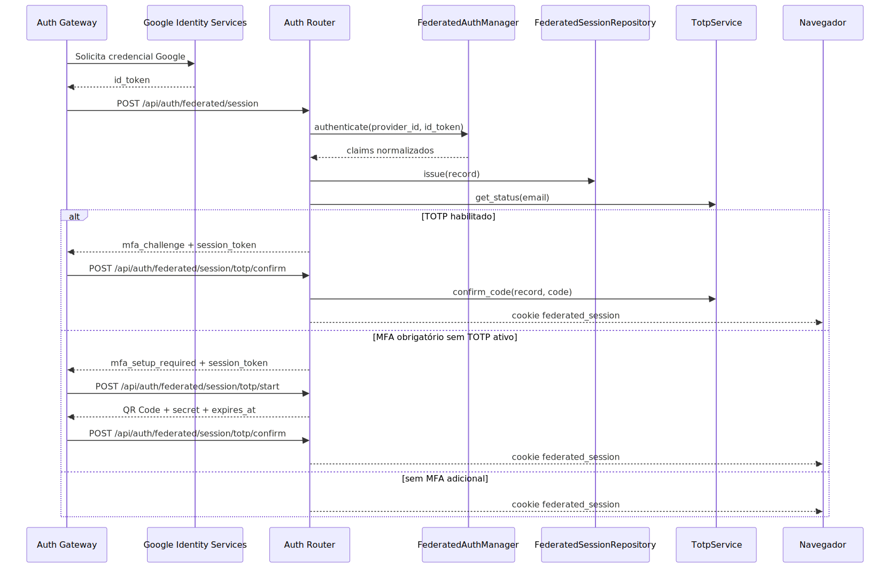

# Manual técnico: autenticação do projeto com Google e MFA

## 1. O que este manual cobre

Este manual descreve o comportamento técnico e operacional da autenticação humana do projeto. O foco é o fluxo real implementado para login federado com Google, login local, sessão web federada, middleware de proteção de HTML e MFA por TOTP.

O texto foi escrito a partir do código executável lido, não de documentação prévia.

## 2. Entry points e boundaries

O boundary HTTP da autenticação humana está no router com prefixo /api/auth. Ele é incluído pela API principal sem prefixo adicional. No código lido, esse router concentra duas famílias de superfície.

1. Endpoints públicos de entrada, sessão e MFA.
2. Endpoints já autenticados de perfil pessoal e governança administrativa, que dependem da mesma sessão web.

Os caminhos públicos confirmados no código são exatamente estes.

1. POST /api/auth/federated/session
2. POST /api/auth/local/register
3. POST /api/auth/local/session
4. POST /api/auth/federated/session/totp/start
5. POST /api/auth/federated/session/totp/confirm
6. GET /api/auth/federated/session
7. POST /api/auth/federated/logout

Os caminhos autenticados confirmados no mesmo router são estes.

1. GET /api/auth/account/profile
2. PUT /api/auth/account/profile
3. POST /api/auth/account/payment-cards
4. GET /api/auth/admin/memberships
5. POST /api/auth/admin/memberships/invitations
6. POST /api/auth/admin/memberships/{tenant_user_id}/revoke
7. GET /api/auth/admin/permission-catalog
8. GET /api/auth/admin/memberships/{tenant_user_id}/governance
9. PUT /api/auth/admin/memberships/{tenant_user_id}/governance

O enforcement de navegação HTML protegida não acontece nesse router. Ele acontece no middleware [src/api/middleware/federated_session.py](../src/api/middleware/federated_session.py), que intercepta requisições HTTP, tenta carregar a sessão do cookie e só redireciona páginas HTML relevantes para /ui/auth-gateway.html.

## 3. Arquitetura resumida



O ponto importante do diagrama é que a sessão já existe no backend antes da conclusão do MFA. O MFA trabalha sobre uma sessão temporária real, não sobre estado transitório exclusivo do frontend.

## 4. Configuração consumida pelo runtime

### 4.1. Configuração da autenticação web

Em [src/config/settings.py](../src/config/settings.py), a classe WebFederatedAuthSettings controla o runtime web.

Os campos com impacto operacional direto confirmados no código lido são estes.

1. enabled
2. cookie_name
3. signing_secret
4. session_ttl_seconds
5. local_bypass_enabled
6. local_bypass_email
7. local_bypass_full_name
8. providers

### 4.2. Configuração do provedor Google

Cada item de providers usa FederatedProviderSettings. Os campos de comportamento confirmados são estes.

1. enabled
2. client_id
3. audience
4. issuer
5. allowed_domains

O método is_ready exige pelo menos enabled e client_id para considerar o provedor operacional.

### 4.3. Política global de MFA

Em [src/api/security/federated_mfa_policy.py](../src/api/security/federated_mfa_policy.py), a função is_federated_mfa_required lê a variável FEDERATED_MFA_REQUIRED via system_config e normaliza valores típicos como true, false, 1, 0, yes, no, on e off.

### 4.4. Rate limit do TOTP

Em [src/config/settings.py](../src/config/settings.py), o serviço TOTP consome três parâmetros globais.

1. totp_attempt_window_seconds
2. totp_attempt_max_attempts
3. totp_attempt_block_seconds

## 5. Contratos HTTP confirmados

### 5.1. Login federado

Payload confirmado em CreateFederatedSessionRequest.

```json
{
  "provider_id": "google",
  "id_token": "<token-id-do-google>"
}
```

Resposta confirmada em CreateFederatedSessionResponse. Os campos mais relevantes são estes.

1. status
2. provider_id
3. email
4. email_verified
5. expires_at
6. mfa_required
7. totp_enabled
8. session_token
9. yaml_path
10. tenant_id
11. tenant_user_id
12. user_account_id
13. membership_role
14. effective_permissions
15. full_name
16. picture_url
17. tenants

Os estados de status confirmados no fluxo lido são estes.

1. ok
2. mfa_challenge
3. mfa_setup_required

### 5.2. Início da ativação TOTP

Payload confirmado em TotpStartRequest.

```json
{
  "session_token": "<token-assinado-opcional>"
}
```

Resposta confirmada em TotpActivationResponse.

```json
{
  "secret": "BASE32...",
  "provisioning_uri": "otpauth://...",
  "account_label": "usuario@dominio.com",
  "issuer": "<nome-da-aplicacao>",
  "qr_code_base64": "data:image/png;base64,...",
  "expires_at": "2026-05-02T12:34:56Z"
}
```

### 5.3. Confirmação do TOTP

Payload confirmado em TotpConfirmRequest.

```json
{
  "code": "123456",
  "session_token": "<token-assinado-opcional>"
}
```

Quando a confirmação dá certo, a resposta volta no mesmo contrato de CreateFederatedSessionResponse, com status igual a ok e cookie final emitido.

### 5.4. Login local

Cadastro local confirmado em LocalRegisterRequest.

```json
{
  "email": "usuario@dominio.com",
  "full_name": "Nome da Pessoa",
  "password": "senha-com-pelo-menos-6-caracteres"
}
```

Login local confirmado em LocalLoginRequest.

```json
{
  "email": "usuario@dominio.com",
  "password": "senha-da-conta"
}
```

## 6. Fluxo técnico do login federado Google

### 6.1. Frontend obtém a credencial

Em [app/ui/static/js/auth-gateway.js](../app/ui/static/js/auth-gateway.js), o gateway carrega a biblioteca oficial do Google Identity Services, inicializa o provedor com o client_id exposto à página e usa ux_mode popup. Se o prompt automático falhar, a UI renderiza um botão fallback do próprio GIS. O bootstrap do client_id também é redundante por design: ele aceita tanto window.PROMETEU_GOOGLE_CLIENT_ID quanto a meta tag da página via [app/ui/static/js/auth-gateway-bootstrap.js](../app/ui/static/js/auth-gateway-bootstrap.js).

Quando o Google devolve a credencial, o frontend envia provider_id igual a google e o id_token recebido para o backend. O redirecionamento final também é saneado na UI para permanecer no mesmo origin, evitando que o parâmetro next vire desvio aberto de navegação.

### 6.2. Backend valida o token

Em [src/api/security/federated_auth.py](../src/api/security/federated_auth.py), o provider Google usa as bibliotecas oficiais google.auth.transport.requests e google.oauth2.id_token.

As validações confirmadas no código são estas.

1. token não pode ser vazio
2. audience ou client_id do provedor precisa estar configurado
3. token precisa passar em verify_oauth2_token
4. issuer precisa bater, quando configurado
5. domínio do usuário precisa estar na allowlist, quando configured
6. claim email precisa existir
7. claim sub precisa existir
8. audience efetiva do token precisa incluir a esperada
9. exp precisa existir e não pode estar no passado
10. iat precisa existir e não pode estar muito no futuro
11. email_verified precisa ser verdadeiro

Se qualquer uma dessas etapas falhar, o manager levanta FederatedAuthError e o endpoint responde 401.

### 6.3. Backend emite a sessão interna

Em [src/api/routers/auth_router.py](../src/api/routers/auth_router.py), create_federated_session monta correlation_id, instancia FederatedAuthManager, autentica o token, reforça a identidade interna, resolve YAML e contexto organizacional e delega a emissão da resposta autenticada para a rotina interna que consolida a sessão.

Essa função emite o registro via FederatedSessionRepository.issue, persistindo dados como email, subject, provider_id, tenant_id, tenant_user_id, membership_role, effective_permissions e timestamps relevantes.

## 7. Fluxo técnico do login local

O login local entra por dois endpoints.

1. POST /api/auth/local/register cria a conta com senha local.
2. POST /api/auth/local/session autentica conta já existente.

O código lido mostra uso de Argon2 para hash e verificação da senha. Depois da prova inicial, o fluxo converge para _issue_authenticated_session_response, usando provider local, audience local e issuer prometeu-local. Isso evita uma arquitetura paralela de sessão só para contas locais.

## 8. Emissão e leitura da sessão web

### 8.1. Repositório da sessão

Em [src/api/security/federated_session_store.py](../src/api/security/federated_session_store.py), FederatedSessionRepository persiste a sessão no cache criado por SessionCacheFactory. O cookie não guarda tudo; ele referencia um session_id, e o registro completo fica serializado no cache central.

Campos importantes do snapshot persistido.

1. provider_id
2. subject
3. email
4. token_audience
5. token_issuer
6. token_issued_at
7. token_expires_at
8. yaml_path
9. tenant_id
10. tenant_user_id
11. user_account_id
12. membership_role
13. effective_permissions
14. authorization_refreshed_at

### 8.2. Cookie final

O endpoint de login e o endpoint de confirmação TOTP assinam o session_id com itsdangerous, usando signing_secret. O cookie é httpOnly e usa os atributos calculados por _build_cookie_attributes, que variam conforme o request veio ou não por FedCM e conforme o esquema HTTP/HTTPS.

### 8.3. Middleware

FederatedSessionMiddleware faz duas coisas diferentes.

1. Sempre tenta carregar a sessão para request.state.federated_session em toda request HTTP.
2. Só redireciona para /ui/auth-gateway.html quando a request é GET ou HEAD de página HTML protegida.

Isso evita tratar chamadas de API como se fossem navegação de browser, mas preserva a proteção da UI.

## 9. Fluxo técnico do MFA TOTP

### 9.1. Decisão de exigir MFA

O ponto decisório está em _issue_authenticated_session_response. Depois de criar a sessão, o router consulta TotpService.get_status(record.email) e a política is_federated_mfa_required(False).

As regras confirmadas são estas.

1. Se o usuário já tem TOTP habilitado, a resposta é mfa_challenge.
2. Se o usuário não tem TOTP habilitado e a política global exige MFA, a resposta é mfa_setup_required.
3. Caso contrário, a resposta é ok e o cookie final é emitido imediatamente.

### 9.2. Ativação

POST /api/auth/federated/session/totp/start resolve a sessão por session_token ou pelo cookie atual, chama TotpService.start_activation e devolve secret, provisioning_uri, account_label, issuer, qr_code_base64 e expires_at.

No serviço, o segredo é criado por TotpManager.create_activation_payload, criptografado antes de qualquer persistência durável e guardado temporariamente em TotpActivationCache com TTL padrão de 300 segundos.

Um detalhe operacional importante: durante esse onboarding o cache efêmero guarda tanto a forma criptografada quanto a forma plain do segredo para que a UI possa receber o QR Code e o código manual sem exigir persistência definitiva prematura. A persistência durável só acontece depois da confirmação bem-sucedida.

### 9.3. Confirmação

POST /api/auth/federated/session/totp/confirm resolve a sessão, consulta o limitador, valida o código e segue por um de dois caminhos.

1. Existe ativação pendente no cache: o backend valida o código, consome o cache, persiste o segredo criptografado no banco e marca o TOTP como habilitado.
2. Não existe ativação pendente, mas o usuário já tinha TOTP ativo: o backend apenas valida o código contra o segredo persistido e atualiza totp_last_verified_at.

Depois do sucesso, o endpoint assina o session_id e finalmente grava o cookie final da sessão web.

### 9.4. Bloqueio por excesso de tentativas

TotpService usa TotpAttemptLimiter. O fluxo confirmado é este.

1. ensure_allowed antes de validar o código
2. register_failure em erro
3. reset após sucesso

Se o teto é excedido, o endpoint responde 429 com Retry-After.

## 10. Persistência e auditoria do TOTP

Em [src/api/security/federated_login_audit.py](../src/api/security/federated_login_audit.py), a tabela de auditoria persistida em PostgreSQL guarda não apenas dados do login federado, mas também o estado TOTP.

Colunas confirmadas no schema inicial.

1. session_id
2. provider_id
3. subject
4. email
5. email_verified
6. token_audience
7. token_issuer
8. token_issued_at
9. token_expires_at
10. issued_at
11. raw_claims
12. totp_secret_encrypted
13. totp_enabled
14. totp_confirmed_at
15. totp_last_verified_at

As operações SQL usam retry com tenacity, até cinco tentativas por padrão, com backoff exponencial. Isso é relevante porque TOTP persistido não depende de uma única tentativa frágil de gravação.

## 11. Integração da UI com o backend

O gateway da UI lido em [app/ui/static/js/auth-gateway.js](../app/ui/static/js/auth-gateway.js) confirma estes comportamentos.

1. Carrega o SDK do Google sob demanda.
2. Exige client_id configurado no frontend.
3. Envia id_token ao backend.
4. Interpreta status ok, mfa_setup_required e mfa_challenge.
5. Usa session_token temporário ao chamar os endpoints TOTP.
6. Se o setup TOTP expirar com 410, reinicia o onboarding do QR Code.
7. Sanitiza o redirect de sucesso para não sair do mesmo origin.
8. Mostra fallback visual quando o prompt automático do Google é pulado ou dispensado pelo navegador.

O frontend não emite o cookie final por conta própria. Ele depende do backend para isso.

## 12. Códigos de resposta e cenários de erro confirmados

### 12.1. Login federado

1. 404 quando autenticação web está desabilitada.
2. 500 quando signing_secret está ausente.
3. 401 quando o token Google falha na validação.

### 12.2. Start TOTP

1. 409 quando o usuário já possui TOTP habilitado.
2. 500 quando o serviço não consegue iniciar a ativação.

### 12.3. Confirm TOTP

1. 429 quando o limitador bloqueia novas tentativas.
2. 400 quando o código é inválido.
3. 410 quando o segredo temporário expirou.
4. 400 quando não há TOTP habilitado nem ativação pendente válida.
5. 500 quando há falha interna na validação.

### 12.4. Sessão atual

GET /api/auth/federated/session devolve o snapshot resumido da sessão ativa. Se request.state.federated_session estiver ausente ou inválido, o helper de carga da sessão levanta 401.

## 13. Como colocar para funcionar

Com base no código e na configuração lida, os pré-requisitos mínimos confirmados são estes.

1. web_federated_auth.enabled verdadeiro
2. web_federated_auth.signing_secret configurado
3. web_federated_auth.providers.google.client_id configurado
4. audience e issuer coerentes com o projeto, quando usados
5. cache central funcional para a sessão federada
6. frontend com PROMETEU_GOOGLE_CLIENT_ID ou meta equivalente preenchido

Para MFA efetivamente operar com persistência, também é necessário que a infraestrutura da auditoria federada esteja configurada via FEDERATED_LOGIN_AUDIT_DSN e parâmetros correlatos. Sem isso, o código lido não confirma um caminho durável de persistência do TOTP.

## 14. Observabilidade e diagnóstico

### 14.1. Ordem de investigação recomendada

1. Confirmar se o provider Google foi bootstrapado por FederatedAuthManager.
2. Confirmar se o frontend está recebendo client_id.
3. Confirmar se a resposta inicial do login veio com ok, mfa_challenge ou mfa_setup_required.
4. Se o backend respondeu mfa_*, confirmar se session_token veio preenchido.
5. Se a confirmação falhar, diferenciar erro de código inválido, setup expirado e bloqueio por tentativas.
6. Se o HTML continuar redirecionando, verificar se o cookie federated_session existe e se o middleware carrega a sessão do cache.

### 14.2. Onde o fluxo deixa evidência

1. Logs do auth router com correlation_id.
2. Logs do TotpManager ao gerar e validar códigos.
3. Cache central de sessão federada.
4. Tabela de auditoria federated_login_audit para estado persistido do TOTP.

## 15. Decisões técnicas e trade-offs

### Google só como provedor, não como dono da sessão

Isso reduz dependência do browser e do provedor externo, mas exige mais infraestrutura local.

### Cookie assinado apontando para cache central

Isso melhora revogação e atualização de snapshot, mas aumenta a importância operacional do cache.

### MFA com session_token temporário

Isso evita expor diretamente o cookie final antes da segunda prova, mas obriga a UI a lidar com estados intermediários.

### TOTP persistido em auditoria federada

Isso unifica trilha de identidade e estado do segundo fator, mas também acopla a saúde do MFA à disponibilidade dessa persistência.

## 16. Limites e lacunas confirmadas

1. O manager lido registra somente o builder do provedor google.
2. Não foi confirmado endpoint público para desabilitar TOTP, embora o serviço tenha método disable.
3. Não foram confirmados recovery codes, SMS, WebAuthn ou push approval.
4. O cache efêmero de ativação TOTP guarda o segredo plain durante a janela curta de onboarding; isso é intencional para materializar QR Code e entrada manual, mas exige disciplina operacional sobre TTL e backend de cache.
5. A documentação antiga ainda estava fragmentada entre um manual geral e outro de MFA; este manual e seu par conceitual passam a ser a referência canônica.

## 17. Exemplos práticos guiados

### Exemplo 1. Login Google seguido de desafio TOTP

1. UI obtém id_token do Google.
2. POST /api/auth/federated/session responde mfa_challenge.
3. UI apresenta o campo para o código.
4. POST /api/auth/federated/session/totp/confirm com code e session_token.
5. Backend valida e grava o cookie final.

### Exemplo 2. Primeiro acesso com MFA obrigatório

1. Login inicial responde mfa_setup_required.
2. UI chama /api/auth/federated/session/totp/start.
3. Backend devolve QR Code e segredo temporário.
4. Usuário escaneia, informa o código e confirma.
5. Backend persiste o segredo criptografado e libera a sessão final.

### Exemplo 3. HTML protegido sem sessão válida

1. Navegador tenta abrir /ui/...
2. Middleware não encontra sessão válida.
3. Resposta é redirect 307 para /ui/auth-gateway.html.

## 18. Explicação 101

O fluxo real é mais simples do que parece quando visto por partes. O Google só entrega uma prova inicial. O backend confere se essa prova faz sentido para este sistema e cria uma sessão própria. Se a política de segurança pedir, o sistema pausa ali e pede também o código do autenticador. Só depois o navegador recebe o crachá final, que é o cookie da sessão.

## 19. Checklist de entendimento

- Entendi quais endpoints públicos formam a autenticação humana.
- Entendi como o id_token do Google é validado.
- Entendi que o backend emite a sessão no cache central e o navegador recebe apenas um cookie assinado.
- Entendi quando o MFA produz mfa_challenge e quando produz mfa_setup_required.
- Entendi como diferenciar falha de login, falha de sessão e falha de TOTP.

## 20. Evidências no código

- src/api/routers/auth_router.py
  - Motivo da leitura: confirmar prefixo do router, contratos HTTP, emissão da sessão e endpoints de MFA.
  - Símbolo relevante: create_federated_session, create_local_session, start_totp_activation, confirm_totp_code, get_federated_session, get_account_profile, list_admin_memberships.
  - Comportamento confirmado: session_token temporário, cookie final, rotas públicas, superfícies autenticadas derivadas da mesma sessão e estados ok ou mfa_*.
- app/ui/static/js/auth-gateway.js
  - Motivo da leitura: confirmar bootstrap do Google, fallback visual, MFA no browser e sanitização do redirect.
  - Símbolo relevante: executarFluxoGis, finalizeAuthenticatedPayload, renderTotpSetup, sanitizeRedirect.
  - Comportamento confirmado: fallback do GIS, tratamento explícito de mfa_setup_required e mfa_challenge, redirecionamento restrito ao mesmo origin.
- app/ui/static/js/auth-gateway-bootstrap.js
  - Motivo da leitura: confirmar como o client_id do Google chega ao gateway.
  - Símbolo relevante: bootstrap autoexecutável.
  - Comportamento confirmado: client_id pode vir de variável global ou meta tag da página.
- src/api/security/federated_auth.py
  - Motivo da leitura: confirmar provedor suportado e regras de validação do token do Google.
  - Símbolo relevante: GoogleIdentityProvider e FederatedAuthManager.
  - Comportamento confirmado: verificação com google-auth e validações de audience, issuer, domínio e e-mail.
- src/api/middleware/federated_session.py
  - Motivo da leitura: entender a proteção de páginas HTML.
  - Símbolo relevante: FederatedSessionMiddleware.
  - Comportamento confirmado: tentativa de carga em toda request HTTP e redirect seletivo para páginas HTML.
- src/api/security/totp_service.py
  - Motivo da leitura: confirmar ativação, confirmação, expiração e bloqueio.
  - Símbolo relevante: TotpService.
  - Comportamento confirmado: cache efêmero, persistência do segredo cifrado e limitador de tentativas.
- src/api/security/federated_login_audit.py
  - Motivo da leitura: confirmar onde o estado TOTP persiste de forma durável.
  - Símbolo relevante: FederatedTotpState e schema da tabela.
  - Comportamento confirmado: auditoria PostgreSQL com campos específicos de TOTP.
