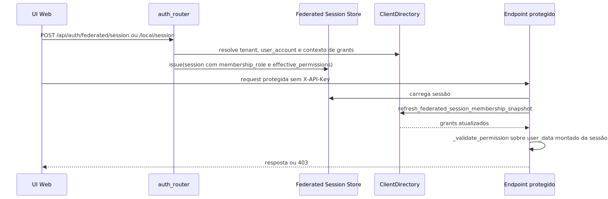

# Manual técnico e operacional: autorização e permissão do projeto e APIs

## 1. Visão técnica da capacidade

O sistema de autorização e permissão do projeto é composto por cinco blocos executáveis que se complementam:

1. catálogo normativo de permissões, tipos de principal e papéis em src/api/security/permissions.py;
2. enforcement HTTP por middleware e dependências em src/api/security/permission_registry.py, src/api/security/user_auth.py e src/api/service_api.py;
3. governança humana e cálculo de grants efetivos no diretório central, principalmente em src/security/user_yaml_membership_governance_repository_mixin.py;
4. rotas web de sessão, catálogo e governança em src/api/routers/auth_router.py;
5. filtro de ACL sobre documentos recuperados em src/security/access_control.py.

O desenho real não é apenas “validar token”. Ele resolve a permissão exigida pela rota, encontra o principal correspondente, compõe os grants efetivos desse principal e, no caso de documentos recuperados, ainda aplica ACL do conteúdo.

## 2. Entradas reais do sistema

### 2.1. Credencial técnica por X-API-Key

O caminho técnico passa por UserCatalog e ClientDirectory. A chave é resolvida a partir do header ou de outras fontes compatíveis lidas pela rotina de resolução de access key do request. Depois disso, a obtenção do user_data e a validação da permissão transformam o cadastro da credencial em user_data com user_code, client_code, tenant_id, permissions e metadata.

Esse fluxo é o caminho mais comum para APIs técnicas e vários endpoints administrativos e operacionais.

### 2.2. Sessão web federada ou local

Quando a request protegida não traz X-API-Key, require_permission tenta construir user_data a partir da sessão federada. Esse caminho usa refresh_federated_session_membership_snapshot para recalcular grants do membership antes do enforcement quando a governança foi invalidada ou quando a sessão está desatualizada.

Esse fluxo é o caminho da UI administrativa e dos endpoints web de auth/account/admin.

### 2.3. Principal persistido de canal

O modelo canônico também declara channel_end_user como tipo de principal. No slice lido, esse principal é resolvido em canais WhatsApp e Instagram quando o metadata do canal define principal_mode persistido. O enforcement não usa PermissionKeys por remetente, mas usa política de acesso do canal para permitir, pendenciar ou bloquear mensagens.

## 3. Catálogo normativo

O catálogo central fica em src/api/security/permissions.py e define:

1. AuthorizationPrincipalType: machine_credential, user_account_membership e channel_end_user.
2. AuthorizationAudience: public, machine, human e both.
3. MembershipRole: owner, admin, member e billing_manager.
4. PermissionKeys: taxonomia completa das capacidades expostas.
5. MEMBERSHIP_ROLE_BASE_PERMISSIONS: grants herdados por papel humano.
6. PERMISSION_CATALOG: descritor normativo de cada permissão, incluindo audience e resumo.

O próprio módulo faz uma checagem de consistência: se PermissionKeys e PERMISSION_CATALOG divergirem, o import falha com RuntimeError. Em termos práticos, isso força o time a manter o catálogo fechado e consistente.

## 4. Como a borda HTTP decide a permissão

### 4.1. Registro por endpoint

O decorador endpoint_permission marca a função de rota com __permission_key__ e __permission_mode__. Depois, o middleware HTTP em src/api/service_api.py chama enforce_endpoint_permission antes de entregar o request ao endpoint.

Esse registry suporta modos diferentes:

1. PUBLIC: não exige enforcement.
2. HEADER e READ: exigem X-API-Key obrigatoriamente.
3. HEADER_OR_YAML: aceita chave quando houver, mas permite caminhos em que o endpoint completa a lógica.
4. CUSTOM: deixa a rota assumir a parte final do controle.

### 4.2. Dependência explícita por endpoint

Além do registry, muitos endpoints usam Depends(require_permission(...)). Esse segundo mecanismo continua importante porque:

1. injeta user_data no handler;
2. aceita sessão federada quando a chave técnica não existe;
3. reaproveita cache request.state.permission_validations;
4. materializa dados úteis para auditoria, rate limit e contexto do fluxo.

O código mostra convivência intencional entre as duas camadas. Um bom exemplo é o slice de configuração e o slice AG-UI: a rota tem metadata via endpoint_permission e também depende de require_permission para receber user_data já validado.

## 5. Validação técnica da permissão

No caminho de chave técnica, _validate_permission executa a regra prática de autorização.

A ordem confirmada no código lido é:

1. validar se permissions é um dict;
2. flatten da árvore de permissões com _flatten_permissions_tree;
3. bypass imediato se admin=True na árvore plana;
4. tentar a permissão exata;
5. tentar as candidatas da hierarquia geradas por resolve_candidate_keys;
6. tentar curingas * e all;
7. se nada bater, devolver 403.

resolve_candidate_keys adiciona comportamento útil para leitura: quando a permissão termina em .view, o runtime também considera .manage e .write como candidatas implícitas. Isso evita duplicação manual de grants para casos em que write ou manage naturalmente incluem view.

## 6. Fluxo principal para credencial técnica

Esse fluxo importa porque mostra que o runtime tenta falhar cedo. Se a chave está ausente em modo HEADER ou READ, o retorno é 401. Se a chave existe, mas a árvore de permissões não contempla a operação, o retorno é 403.

## 7. Fluxo principal para sessão web

O detalhe importante é o refresh antes do enforcement. O sistema não confia cegamente no cookie emitido horas atrás. Se a governança mudou, a próxima request protegida recalcula effective_permissions e atualiza o snapshot persistido da sessão.

## 8. Como grants humanos são calculados

O cálculo executável confirmado em resolve_membership_authorization_context é este:

1. localizar o membership por tenant_user_id ou por tenant_id mais user_account_id;
2. se não houver contexto suficiente, retornar grants vazios;
3. se não houver membership, retornar grants vazios;
4. se o membership não estiver active, retornar grants vazios;
5. carregar role_base_permissions a partir de MembershipRole;
6. carregar explicit_allow_permissions e explicit_deny_permissions de tenant_user_permission_grants;
7. calcular effective_permissions como role base união explicit allow menos explicit deny.

Em forma matemática:

$$
effective\_permissions = (role\_base \cup explicit\_allow) - explicit\_deny
$$

Isso significa que deny explícito vence o grant herdado ou o allow explícito. Quando o membership está inativo, o sistema não tenta ser permissivo: o retorno é vazio.

## 9. Governança administrativa de memberships

Os endpoints em auth_router para governança são:

1. POST /api/auth/federated/session, POST /api/auth/local/register e POST /api/auth/local/session para criar sessão.
2. GET e PUT /api/auth/account/profile para operar a conta humana autenticada.
3. GET /api/auth/admin/memberships para listar memberships visíveis ao operador.
4. POST /api/auth/admin/memberships/invitations para criar convite organizacional.
5. POST /api/auth/admin/memberships/{tenant_user_id}/revoke para revogar membership.
6. GET /api/auth/admin/permission-catalog para expor o catálogo de permissões para a UI.
7. GET e PUT /api/auth/admin/memberships/{tenant_user_id}/governance para ler e atualizar grants explícitos e papel.

Esses endpoints não usam require_permission com PermissionKeys específicas no trecho lido. Eles exigem sessão autenticada e delegam a autorização fina ao diretório central. A policy confirmada é:

1. requester precisa estar active;
2. requester precisa ser owner ou admin no tenant alvo;
3. se requester não for owner, não pode alterar nem delegar owner.

Esse comportamento está centralizado em _assert_human_membership_governance_access.

## 10. Grant explícito: leitura, escrita e auditoria

_load_membership_explicit_permissions lê tenant_user_permission_grants e separa dois conjuntos:

1. explicit_allow_permissions;
2. explicit_deny_permissions.

Ao atualizar governança, o sistema:

1. valida se a role é uma MembershipRole suportada;
2. impede overlap entre allow e deny para a mesma permissão;
3. rejeita permissões inexistentes ou que não suportem principal humano;
4. substitui os grants persistidos do membership;
5. grava tenant_audit_log com before e after;
6. invalida o snapshot da sessão federada para refresh na próxima request protegida.

Isso é importante porque mostra duas defesas simultâneas: validação semântica do grant e invalidacão operacional do snapshot.

## 11. Principal persistido de canal

O slice multicanal adiciona uma terceira trilha relevante de autorização prática.

O metadata channel_end_user_policy pode declarar:

1. principal_mode anonymous ou persist_optional;
2. access_policy observe_only, allowlist ou blocklist.

Quando o modo é persistido, o processor resolve ou cria o principal do remetente via channel_repository. A regra confirmada é:

1. observe_only: o remetente é observado, mas não bloqueado por default;
2. allowlist: remetente novo nasce pending e só passa se o status ficar allowed;
3. blocklist: remetente blocked é barrado no processamento.

Isso não substitui PermissionKeys da API. É outra camada de controle, voltada ao runtime de canais e ao remetente externo.

## 12. ACL em tempo de consulta sobre documentos

Depois que a autorização da request já passou, AccessControlEvaluator ainda pode bloquear documentos individuais.

As regras confirmadas no código lido são:

1. documento sem metadata é permitido;
2. permitted_groups transforma o documento em restrito mesmo se is_restricted não vier marcado;
3. documento não restrito é permitido;
4. documento restrito com allows_anonymous é permitido;
5. documento restrito sem autenticação é negado;
6. documento restrito sem grupos permitidos é negado;
7. documento restrito só passa se houver interseção entre permitted_groups e user_groups normalizados.

Em termos práticos, isso protege o momento em que a evidência já foi recuperada do store e precisa ser filtrada antes de aparecer na resposta.

## 13. Configurações e contratos que mudam comportamento

### 13.1. web_federated_auth

Consumido em auth_router e no fluxo de refresh de sessão.

Controla pelo menos:

1. enabled;
2. signing_secret;
3. session_ttl_seconds;
4. cookie_name.

Impacto prático: se enabled estiver desligado, autenticação web retorna 404; se signing_secret faltar, o runtime falha ao emitir sessão; se TTL inválido impedir repositório, o refresh de snapshot não acontece.

Valor padrão não confirmado no código lido.

### 13.2. permission mode da rota

Consumido por endpoint_permission e enforce_endpoint_permission.

Controla se o endpoint exige header obrigatório, aceita fallback parcial ou delega lógica customizada.

### 13.3. metadata.channel_end_user_policy

Consumido pelo channel processor.

Controla se o remetente externo vira principal persistido e qual política de acesso vale para ele.

### 13.4. Metadados ACL do documento

Consumidos por AccessControlEvaluator.

Campos relevantes confirmados: permitted_groups, is_restricted, allows_anonymous e visibility.

## 14. Contratos e saídas importantes

### 14.1. user_data injetado em request.state

Quando a borda autoriza a request, ela injeta user_data com campos como:

1. user_code;
2. client_code;
3. permissions;
4. metadata;
5. tenant_id quando disponível;
6. tenant_user_id e user_account_id no caso de sessão humana.

Isso é o contrato que endpoints e middlewares reaproveitam para auditoria e contexto.

### 14.2. Resposta do catálogo de permissões

GET /api/auth/admin/permission-catalog expõe o catálogo central para a UI de governança. O comportamento confirmado é publicação do catálogo normativo de PermissionKeys, não do mapa completo de rotas registradas pelo middleware.

### 14.3. Resposta de governança de membership

GET /api/auth/admin/memberships/{tenant_user_id}/governance devolve:

1. membership_role;
2. membership_status;
3. role_base_permissions;
4. explicit_allow_permissions;
5. explicit_deny_permissions;
6. effective_permissions;
7. grants com grant_effect, scope e origem.

## 15. O que acontece em sucesso

### 15.1. Sucesso em API técnica

1. a rota resolve a permissão exigida;
2. a chave técnica é encontrada;
3. a árvore de permissões contempla a capacidade;
4. request.state.user_data fica preenchido;
5. o endpoint executa com contexto do principal.

### 15.2. Sucesso em sessão web

1. a sessão autenticada existe e pode ser desserializada;
2. o diretório resolve membership ativo;
3. grants efetivos são recalculados se necessário;
4. require_permission monta permissions booleanas a partir de effective_permissions;
5. a rota segue com user_data compatível com a trilha técnica.

### 15.3. Sucesso em governança administrativa

1. owner ou admin válido entra no endpoint;
2. grants são validados semanticamente;
3. tenant_user_permission_grants é regravado;
4. tenant_audit_log recebe before e after;
5. o snapshot de sessão do membership é invalidado.

## 16. O que acontece em erro

### 16.1. 401 por falta de chave técnica

Em modos HEADER e READ, se não houver X-API-Key e não existir caminho de sessão web aplicável, a borda devolve 401 com mensagem de cabeçalho obrigatório.

### 16.2. 403 por falta de permissão

Se a árvore de permissões não satisfaz a operação, _validate_permission devolve 403. O mesmo ocorre quando a governança administrativa detecta requester sem role owner ou admin suficiente.

### 16.3. Grants humanos vazios

Se o membership não existe, não está ativo ou a estrutura de tabelas humanas está ausente, o resolvedor retorna grants vazios. Isso não é um fallback permissivo; é falha fechada.

### 16.4. Sessão sem user_account_id

Alguns endpoints de auth/admin retornam 400 quando a sessão autenticada não traz user_account_id suficiente para operar governança ou perfil.

### 16.5. Grant inválido

Se uma permissão não existe no catálogo ou não suporta principal humano, update_admin_membership_governance retorna erro de validação. Também falha quando allow e deny contêm a mesma permissão.

### 16.6. ACL nega documento

Quando o documento é restrito e não há grupo compatível, AccessControlEvaluator remove o documento do conjunto permitido e o registra no resumo denied_documents.

## 17. Observabilidade e diagnóstico

### 17.1. Onde começar

1. se o problema está na borda técnica, comece por src/api/service_api.py, src/api/security/permission_registry.py e src/api/security/user_auth.py;
2. se o problema está na UI ou governança humana, comece por src/api/routers/auth_router.py e src/security/user_yaml_membership_governance_repository_mixin.py;
3. se o problema é vazamento ou ausência de evidência em RAG, comece por src/security/access_control.py e pelos metadados do documento.

### 17.2. Como diferenciar as causas

1. 401 antes do handler costuma indicar ausência de chave ou sessão inválida.
2. 403 antes do handler costuma indicar permissão/grant insuficiente.
3. 403 em governança administrativa costuma indicar role inadequado no tenant alvo.
4. resposta vazia ou evidência faltando com request autorizada pode ser ACL do documento, não da rota.
5. mudança recente de grants com sessão ainda ativa pede checagem do refresh/invalidação de snapshot.

### 17.3. Logs relevantes

O código lido registra logs explícitos em pontos importantes:

1. sincronização ou invalidação de snapshot de autorização de sessão federada;
2. governança administrativa carregada ou atualizada;
3. principal de canal resolvido, bloqueado por allowlist ou bloqueado por blocklist.

## 18. Lacunas reais encontradas

1. docs/README-INDICE.MD e docs/README-SISTEMA-AUTENTICACAO.md apontavam para README-AUTORIZACAO.md, mas esse arquivo não foi encontrado no workspace lido.
2. O catálogo de permissões é publicado para a UI, mas não encontrei no código lido um endpoint consolidado que exponha, no mesmo payload, o mapeamento completo rota -> permission -> mode vindo de EndpointPermissionRegistry.
3. A precedência canônica enumera SUPERADMIN, mas não foi confirmada no slice lido uma trilha HTTP específica de superadmin humano separada da composição role base mais allow menos deny.

## 19. Exemplos práticos guiados

### Exemplo 1: operador técnico tentando gerar configuração

Cenário: uma integração chama POST /config/generate com X-API-Key.

Processamento: a rota carrega endpoint_permission para config.generate, o middleware tenta validar a chave e o handler também depende de require_permission para receber user_data. Se a credencial tiver config.generate ou admin, a execução segue.

Impacto prático: a operação sensível ganha enforcement na borda e contexto de auditoria dentro do handler.

### Exemplo 2: admin perde grant e continua com a aba aberta

Cenário: a UI está autenticada, mas alguém remove grants do membership.

Processamento: update_admin_membership_governance invalida o snapshot. Na próxima request protegida, refresh_federated_session_membership_snapshot recalcula effective_permissions antes do enforcement.

Impacto prático: a revogação entra em vigor sem depender de logout manual completo.

### Exemplo 3: pergunta autorizada, documento negado

Cenário: o usuário pode fazer rag.ask, mas o documento recuperado está restrito a outro grupo.

Processamento: a borda aceita a pergunta, mas AccessControlEvaluator remove o documento porque permitted_groups não intersecta user_groups.

Impacto prático: a plataforma evita que a pergunta certa exponha a evidência errada.

## 20. Troubleshooting

### Sintoma: endpoint técnico retorna 401 imediatamente

Causa provável: X-API-Key ausente em rota HEADER ou READ.

Como confirmar: verificar se a rota usa endpoint_permission com AccessMode.HEADER ou se depende de require_permission sem sessão web válida.

Ação recomendada: enviar a chave técnica correta ou usar endpoint compatível com sessão web.

### Sintoma: sessão web existe, mas endpoint responde 403

Causa provável: effective_permissions da sessão não contemplam a capacidade após refresh.

Como confirmar: inspecionar refresh_federated_session_membership_snapshot e a governança do tenant_user_id no diretório.

Ação recomendada: revisar role, grants allow e deny do membership.

### Sintoma: admin consegue ler, mas não consegue promover owner

Causa provável: policy de governança humana bloqueia alteração ou delegação de owner por requester que não seja owner.

Como confirmar: verificar _assert_human_membership_governance_access.

Ação recomendada: executar a operação com requester owner do mesmo tenant.

### Sintoma: RAG responde sem um documento esperado

Causa provável: ACL do documento negou a evidência.

Como confirmar: revisar metadados permitted_groups, is_restricted, allows_anonymous e o AccessControlResult.

Ação recomendada: corrigir metadata ACL na origem ou alinhar groups do contexto do usuário.

## 21. Checklist de entendimento

- Entendi como a borda resolve permission e mode por rota.
- Entendi como require_permission aceita chave técnica e sessão web.
- Entendi a composição de effective_permissions para membership humano.
- Entendi a diferença entre governança administrativa e enforcement HTTP.
- Entendi como o principal persistido de canal entra no desenho.
- Entendi por que ACL de documento continua sendo necessária depois da autorização da request.

## 22. Evidências no código

- src/api/security/permissions.py
  - Motivo da leitura: catálogo, papéis, audience e resolução hierárquica.
  - Comportamento confirmado: catálogo fechado, grants base por papel e inferência de manage/write para view.
- src/api/security/permission_registry.py
  - Motivo da leitura: registro central de permissão por rota.
  - Comportamento confirmado: modos PUBLIC, HEADER, HEADER_OR_YAML, CUSTOM e READ.
- src/api/security/user_auth.py
  - Motivo da leitura: enforcement por chave e sessão web.
  - Comportamento confirmado: require_permission faz fallback controlado para sessão federada e guarda cache por request.
- src/api/service_api.py
  - Motivo da leitura: integração do middleware de enforcement no app.
  - Comportamento confirmado: middleware chama enforce_endpoint_permission antes do handler e há validator configurado em app.state.
- src/api/routers/auth_router.py
  - Motivo da leitura: contratos HTTP de sessão, perfil e governança administrativa.
  - Comportamento confirmado: criação de sessão, catálogo de permissões e endpoints de memberships administrativos.
- src/security/user_yaml_membership_governance_repository_mixin.py
  - Motivo da leitura: cálculo de grants e política owner/admin.
  - Comportamento confirmado: effective_permissions = role base união allow menos deny; update grava audit log e invalida snapshot.
- src/security/access_control.py
  - Motivo da leitura: ACL de documentos recuperados.
  - Comportamento confirmado: documentos restritos dependem de autenticação e interseção de grupos.
- src/channel_layer/processor.py
  - Motivo da leitura: política de principal de canal.
  - Comportamento confirmado: allowlist, blocklist e observe_only atuam sobre remetentes persistidos.
