# Manual tecnico e operacional: BYOK e isolamento de custos por tenant

## 1. Escopo tecnico deste manual

Este manual descreve o caminho tecnico real que separa credenciais, integracoes e rastreio de consumo por tenant. O objetivo e explicar como a plataforma faz isso no codigo, quais limites existem hoje e como diagnosticar quando a separacao falha.

O recorte confirmado foi montado a partir destes blocos.

1. Autenticacao e permissao.
2. Portal do cliente.
3. Repositorio de security_keys e tenant_secrets.
4. Catalogo governado de integracoes.
5. Billing e telemetria de tokens.

## 2. Entrypoints reais envolvidos

### 2.1. Autenticacao por access_key

O fluxo passa por user_auth. Depois de validar a credencial, o codigo exige tenant_id valido no user_data. Se tenant_id estiver ausente, a requisicao aborta com erro de configuracao invalida.

Consequencia tecnica: o restante da plataforma nao deveria operar em modo anonimo quando o contrato exige tenant.

### 2.2. Portal do cliente

O portal do cliente expoe endpoints autenticados para:

1. /client-portal/credentials
2. /client-portal/tenant-secrets

O helper _resolve_target_client e a primeira fronteira tecnica de isolamento. Credencial comum opera apenas o proprio client_code. Credencial superadmin pode informar outro client_code.

### 2.3. Runtime e resolucao de YAML

Tanto a auth HTTP quanto o runtime de canais chamam enrich_yaml_with_client_context para transformar YAML generico em YAML multi-tenant concreto.

## 3. Fluxo tecnico ponta a ponta

O diagrama mostra a ordem real importante. O runtime nao deveria consumir integracao antes do enrich multi-tenant.

## 4. Passo a passo do enriquecimento

### 4.1. Validacao do tenant na autenticacao

O fluxo em user_auth faz tres coisas importantes.

1. Recupera user_data da credencial.
2. Le tenant_id e falha se vier vazio.
3. Chama enrich_yaml_with_client_context com client_code, tenant_id e access_key.

Isso significa que tenant_id nao e opcional para o caminho multi-tenant canonicamente protegido.

### 4.2. Montagem do client_context

SecurityKeysRepository.enrich_yaml_with_client_context carrega o registro do cliente por tenant_id ou client_code e injeta em yaml_config.client_context.client:

1. client_code
2. display_name
3. domain
4. tier
5. yaml_path
6. default_user_email
7. metadata
8. tenant_id

Se houver access_key, ela tambem entra em client_context.access_key.

### 4.3. Carga de security_keys

Depois de montar client_context, o repositorio carrega tenant_security_keys. Se nao houver registros, ele gera SecurityKeysNotFoundError. Isso evita que o runtime siga sem material de credencial.

### 4.4. Carga de tenant_secrets

O loader consulta tenant_secrets filtrando por tenant_id. O cache tambem e keyed por tenant_id. Quando um segredo e criado, atualizado ou removido, o repositorio invalida os caches afetados.

### 4.5. Resolucao de placeholders

SecurityKeysLoader reconhece a sintaxe $security_credential, com ou sem sufixo explicito. A resolucao usa somente o secret_store carregado para aquele tenant. Se a referencia faltar, gera TenantSecretNotFoundError.

## 5. Modos de BYOK confirmados no codigo

### 5.1. BYOK via tenant_secrets mais secret_ref indireto

Esse e o modo mais alinhado a governanca. O tenant grava o segredo no namespace tenant_secrets e o payload operacional aponta para ele por referencia.

Quando usar: quando o tenant quer rotacionar credencial sem regravar todo o catalogo de integracoes.

### 5.2. BYOK via credencial inline criptografada

Auth profiles aceitam credentials_json_encrypted e SQL connections aceitam connection_string_encrypted quando o modo e inline_encrypted.

Quando usar: quando a operacao precisa armazenar a credencial dentro do proprio registro governado e quando o endpoint administrativo seguro ainda nao suporta o resolvedor de secret_ref para aquele teste.

### 5.3. O que nao foi confirmado como BYOK puro

O codigo de teste administrativo seguro ainda rejeita auth_profile.secret_ref e sql_connection.connection_mode igual a secret_ref quando nao ha resolvedor explicito de segredos do tenant naquela superficie. Isso mostra que o runtime suporta a referencia governada, mas nem toda ferramenta administrativa de teste a consome diretamente nesta fase.

## 6. Catalogos governados e segregacao por tenant

### 6.1. api_auth_profile_registry

O schema exige tenant_id, auth_profile_code e uma estrategia de credencial valida. Existe unique por tenant_id e auth_profile_code.

O repository nao so grava isso. Ele tambem le e atualiza filtrando por tenant_id.

### 6.2. sql_connection_registry

O schema exige tenant_id, connection_code e connection_mode igual a secret_ref ou inline_encrypted. Existe unique por tenant_id e connection_code.

O repository tambem faz load e update filtrando por tenant_id.

### 6.3. Resultado pratico

Mesmo que dois tenants usem o mesmo connection_code ou auth_profile_code, o catalogo continua separado porque a identidade efetiva do registro e o par tenant_id mais codigo.

## 7. Separacao administrativa no portal

O portal do cliente usa `_extract_context` para obter client_code e permissao da credencial autenticada. Depois aplica `_resolve_target_client`.

Regras confirmadas:

1. Superadmin pode informar outro client_code.
2. Nao superadmin nao pode operar outro client_code.
3. Se a credencial nao tiver client_code associado, a operacao falha.

Esse bloqueio importa porque sem ele o tenant poderia sobrescrever segredos ou credenciais de outro tenant mesmo que o banco estivesse separado.

## 8. Onde o isolamento de custos e forte

### 8.1. No provedor externo

Quando o tenant usa a propria credencial de LLM, API ou banco, o custo real sai na conta dele. Esse e o isolamento mais forte, porque acontece fora da plataforma. O codigo suporta isso justamente por permitir secret_ref e inline_encrypted tenant-scoped.

### 8.2. Na identidade da credencial de entrada

As access keys do portal sao vinculadas ao cliente e recebem tenant_id quando gravadas. Isso ajuda a atribuir a sessao ao tenant certo antes de qualquer chamada externa.

### 8.3. Na telemetria de consumo

TokenBillingCollector registra eventos com:

1. client_id
2. session_id
3. provider
4. model
5. tokens
6. costs
7. correlation_id

O extrator de conversacao tambem soma tokens a partir de token_billing_event. Isso cria uma trilha de rastreio tecnico do consumo.

## 9. Onde o isolamento de custos ainda e parcial

### 9.1. Tabela de precos global

PricingConfigLoader afirma explicitamente que a tabela de precos e global e nao varia por cliente. Isso significa que a plataforma estima custo com uma regua unica, nao com uma tabela customizada por tenant.

### 9.2. Ausencia de ledger financeiro nativo por tenant no slice lido

Eu nao encontrei no codigo lido uma tabela de chargeback financeiro por tenant, invoice interna por tenant ou repositorio dedicado de consolidacao financeira por tenant. O que existe com seguranca e telemetria detalhada e precificacao global.

### 9.3. client_id nao e o mesmo que tenant_id em todos os coletores

No TokenBillingCollector de ingestao, client_id e derivado de authentication.access_key do YAML. Isso e util para rastreio da credencial, mas nao e o mesmo que uma contabilidade financeira canonica por tenant.

## 10. Contratos e campos relevantes

### 10.1. Campos canonicamente injetados no YAML

1. client_context.client.client_code
2. client_context.client.tenant_id
3. client_context.client.display_name
4. client_context.access_key
5. security_keys

### 10.2. Campos de segredo e integracao

1. secret_key e secret_value em tenant_secrets
2. secret_ref em auth profile e SQL connection
3. credentials_json_encrypted em auth profile
4. connection_string_encrypted em SQL connection

### 10.3. Campos de billing e telemetria

1. token_billing_event
2. provider
3. model
4. tokens.input, tokens.output, tokens.total
5. costs.input, costs.output, costs.total
6. correlation_id
7. session_id
8. client_id

## 11. Exemplo tecnico guiado

### 11.1. Tenant grava um segredo proprio

O tenant chama /client-portal/tenant-secrets e persiste algo como openai.api_key no proprio namespace. O registro vai para tenant_secrets com tenant_id associado ao client_code do portal.

### 11.2. Runtime precisa daquele segredo

O YAML ou security_keys referencia $security_credential::openai.api_key. Durante o enrich, o loader carrega tenant_secrets do tenant autenticado e substitui o placeholder.

### 11.3. Integracao governada usa o segredo

Se a integracao estiver modelada com secret_ref, o runtime usa a referencia segura. Se estiver modelada como inline_encrypted, usa a credencial descriptografada do proprio registro governado.

### 11.4. Consumo fica rastreado

Se o runtime passar pelo coletor de billing, um token_billing_event e emitido com client_id, provider, model e correlation_id.

## 12. O que acontece em caso de sucesso

1. Auth resolve tenant_id.
2. YAML recebe client_context e security_keys do tenant certo.
3. Placeholders sao resolvidos com tenant_secrets do tenant certo.
4. Integracao usa segredo ou conexao pertencente ao tenant certo.
5. Billing emite evento estruturado do consumo.

## 13. O que acontece em caso de erro

### tenant_id ausente

Falha na auth antes do enrich.

### security_keys ausentes

Falha com SecurityKeysNotFoundError ou HTTP 400/503 conforme o boundary.

### segredo inexistente em tenant_secrets

Falha com TenantSecretNotFoundError e detalhe do secret_key ou reference_path.

### client_code indevido no portal

Falha 403 em _resolve_target_client.

### teste administrativo com secret_ref

Falha 400 orientando uso de credencial inline nesta fase do endpoint de teste seguro.

## 14. Observabilidade e diagnostico

### Logs importantes

1. tenant_id ausente na auth.
2. Cliente localizado para enriquecimento de YAML.
3. tenant_secrets carregados.
4. Placeholder de segredo resolvido.
5. Security_keys ausentes.
6. token_billing_event nos logs estruturados.

### Ordem de investigacao recomendada

1. Validar a access_key e o user_data resolvido.
2. Confirmar tenant_id e client_code.
3. Confirmar client_context.client.tenant_id no YAML enriquecido.
4. Confirmar tenant_security_keys.
5. Confirmar tenant_secrets.
6. Confirmar o registro governado da integracao no tenant correto.
7. Confirmar o token_billing_event da sessao.

## 15. Troubleshooting

### Sintoma: placeholder de segredo nao resolve

Confirme se o tenant autenticado e o esperado, se tenant_secrets contem a secret_key e se o sufixo do $security_credential bate com a chave persistida.

### Sintoma: consumo aparece, mas nao parece separado entre clientes

Confirme se os tenants realmente usam credenciais externas diferentes. Se compartilharem a mesma conta do provedor, a separacao sera analitica, nao financeira no provedor.

### Sintoma: endpoint administrativo de teste nao aceita secret_ref

Isso nao invalida o runtime multi-tenant. Significa apenas que essa superficie administrativa segura ainda exige inline_encrypted para o teste local daquele slice.

## 16. Explicacao 101

Tecnicamente, a plataforma faz o que um bom cofre multi-tenant deveria fazer. Primeiro identifica o dono da requisicao. Depois abre so a gaveta daquele dono. Em seguida monta o ambiente de execucao com os dados daquela gaveta. E por fim registra o que foi consumido.

O que ela ainda nao prova no codigo lido e um financeiro completo por tenant dentro da propria plataforma. Ela prova, sim, um isolamento forte de credenciais e um rastreio tecnico razoavel de consumo.

## 17. Checklist tecnico

- Entendi onde tenant_id e exigido.
- Entendi como client_context.client.tenant_id entra no YAML.
- Entendi a diferenca entre tenant_secrets, security_keys e secret_ref.
- Entendi a diferenca entre secret_ref e inline_encrypted.
- Entendi por que o isolamento de custo mais forte depende de credencial propria no provedor.
- Entendi que a tabela de precos interna e global.
- Entendi que o slice lido nao confirmou um ledger financeiro nativo por tenant.

## 18. Evidencias no codigo

- src/api/routers/client_portal_router.py
  - Motivo da leitura: confirmar os endpoints de autoatendimento e a regra _resolve_target_client.
  - Comportamento confirmado: operacoes de credencial e tenant secret respeitam o client_code autenticado, salvo superadmin.
- src/security/access_key_repository.py
  - Motivo da leitura: confirmar que as credenciais do portal sao vinculadas ao tenant/cliente.
  - Comportamento confirmado: create_client_api_key carrega o perfil do cliente e grava a credencial com tenant_id resolvido.
- src/api/security/user_auth.py
  - Motivo da leitura: confirmar falha sem tenant_id e enrich do YAML.
  - Comportamento confirmado: aborta quando tenant_id nao existe e injeta contexto multi-tenant antes da execucao.
- src/security/security_keys_repository.py
  - Motivo da leitura: confirmar enriquecimento do YAML, lookup de tenant_security_keys e tenant_secrets e invalidacao de cache por tenant.
  - Comportamento confirmado: monta client_context, consulta segredos por tenant_id e falha cedo quando security_keys nao existe.
- src/security/security_keys_loader.py
  - Motivo da leitura: confirmar algoritmo de resolucao de $security_credential.
  - Comportamento confirmado: placeholder e resolvido apenas contra tenant_secrets do tenant carregado.
- src/integrations/schema.py
  - Motivo da leitura: confirmar constraints de tenant e de estrategia de credencial.
  - Comportamento confirmado: tenant_id e obrigatorio e a credencial precisa obedecer secret_ref ou inline_encrypted conforme o tipo.
- src/integrations/models.py
  - Motivo da leitura: confirmar validacoes de auth profile e SQL connection.
  - Comportamento confirmado: o model validator bloqueia registros sem estrategia de credencial coerente.
- src/integrations/repository.py
  - Motivo da leitura: confirmar filtro operacional por tenant_id.
  - Comportamento confirmado: load e update de auth profile e SQL connection filtram por tenant_id.
- src/api/services/admin/integrations_actions_service.py
  - Motivo da leitura: confirmar limite atual dos endpoints administrativos seguros.
  - Comportamento confirmado: secret_ref ainda nao e testado diretamente nessas superficies sem resolvedor explicito do tenant.
- src/ingestion_layer/token_billing_collector.py
  - Motivo da leitura: confirmar formato do evento de billing.
  - Comportamento confirmado: registra token_billing_event com client_id, provider, model, costs e correlation_id.
- src/qa_layer/rag_engine/metrics.py
  - Motivo da leitura: confirmar resumo de metrics e billing no pipeline de QA.
  - Comportamento confirmado: consolida token usage e expõe client_id e correlation_id no resumo da sessao.
- src/core/pricing_config_loader.py
  - Motivo da leitura: confirmar se a precificacao varia por cliente.
  - Comportamento confirmado: a tabela de precos e global e nao varia por cliente.
