# Cofre de integrações AIDAN — arquitetura, segurança e estado real

## 1. Para que serve este documento

Este documento explica, em nível 101, como está sendo construída a proteção das
credenciais de Shopify, Instagram e outras integrações usadas pelo AIDAN.

Ele consolida:

- o problema que o cofre resolve;
- a separação entre a plataforma genérica e a experiência AIDAN;
- o contrato criptográfico já implementado;
- a evolução planejada do banco;
- o tratamento temporário das sete linhas legadas;
- o backup e a recuperação da chave mestra;
- os testes e evidências já produzidos;
- o que ainda não foi executado;
- os bloqueios e próximos passos exatos.

Este **não é o relatório final do projeto AIDAN**. É a documentação técnica
consolidada do cofre e do estado atual das integrações. O projeto completo ainda
possui etapas pendentes.

Nenhuma senha, token, chave privada, material criptográfico, nonce ou conteúdo
de credencial é reproduzido neste arquivo.

## 2. Resumo executivo do estado atual

Em 11 de agosto de 2026, o estado comprovado é:

| Item | Estado comprovado | Significado prático |
|---|---|---|
| Investigação do cofre e dos consumidores | Concluída, somente leitura | Foram identificados os owners, tabelas, consumidores e lacunas sem alterar dados. |
| Owner criptográfico AES-256-GCM | Implementado e testado | A plataforma já consegue criar, abrir e reempacotar envelopes cifrados com falha fechada. |
| Key ring local do desenvolvimento | Configurado | A variável existe no `.env` local protegido, sem valor exposto neste documento. |
| Recuperação local | `RECOVERY_LOCAL_PROVISORIO_VERDE` | O backup DPAPI local foi restaurado em outro processo e validado, mas continua no mesmo computador. |
| Gate de desenvolvimento | `T4_DESENVOLVIMENTO_VERDE` | Permite desenvolver e testar T5–T10 em ambiente controlado. |
| Gate de produção | `T4_CUTOVER_PRODUCAO_BLOQUEADO` | Proíbe DDL real, credenciais AIDAN reais e cutover até existir recuperação off-device coordenada com o banco. |
| Scripts SQL T5 | Criados e validados estaticamente | Precheck, migration, postcheck e rollback existem, mas não foram executados no PostgreSQL. |
| Execução física T5 | `NAO_INICIADA` | Nenhuma coluna, constraint, índice ou linha foi alterada pelos scripts novos. |
| Ensaio T6 em cópia restaurada | Bloqueado | Falta instalar o servidor PostgreSQL 16 local; a instalação exige senha de `sudo` digitada pelo usuário. |
| Credenciais AIDAN no cofre novo | Não gravadas | No último snapshot real, o AIDAN possuía zero segredo e zero mapa de referência nessas tabelas. |
| Shopify/Meta operacionais | Não conectados pelo cofre novo | Nenhum token real foi migrado ou gravado no novo contrato. |

Portanto, “código pronto” e “scripts prontos” não significam “banco migrado” nem
“integração conectada”. Essas são etapas diferentes e permanecem explicitamente
separadas.

### 2.1 Cofre provisório de `development` — fonte TEMPORÁRIA já ligada (2026-08-19/20)

O cofre criptográfico descrito no resto deste documento continua sendo o destino final, mas
o cutover dele virou **hardening pós-MVP** por decisão do usuário (decisão **D1** do plano
`docs/.interno/.planos/aidan-consolidado/00-PLANO.md`). Enquanto isso, para que o
desenvolvimento tenha de onde ler credencial real, entrou em operação uma fonte **temporária**:

- **O que é:** o arquivo `aidan-vault-provisorio.txt`, na raiz do repositório, com uma linha
  `CHAVE=valor` por credencial. Permissão `600`, ignorado pelo `.gitignore` e protegido por
  teste automatizado de não-rastreabilidade. Os nomes das chaves são **os mesmos** que o código
  já procura no ambiente (`AIDAN_SHOPIFY_STORE_URL`, `AIDAN_META_APP_SECRET`,
  `AIDAN_META_VERIFY_TOKEN`, `AIDAN_META_ACCESS_TOKEN`, `AIDAN_SHOPIFY_ADMIN_ACCESS_TOKEN`) —
  o cofre provisório é uma fonte alternativa, nunca um vocabulário novo.
- **Onde é lido:** somente em `src/security/provisional_integration_vault.py`, chamado pelo
  resolvedor canônico `src/security/security_keys_resolver.py`. **Não existe segundo
  resolvedor**: a ordem única de fontes é `security_keys` do YAML → cofre provisório → `.env`
  → default.
- **Só em `development`:** a checagem de ambiente acontece **antes** de qualquer toque no
  filesystem. Em `prod` o arquivo não é procurado, aberto nem interpretado — a resolução segue
  o caminho canônico e falha fechada quando a credencial não existe.
- **Nunca vaza:** o log registra apenas a **origem** da resolução
  (`reason="cofre_provisorio_development"` no evento
  `security.security_keys_resolver.secret_resolved`) — jamais o valor, o prefixo do valor ou o
  nome da chave. O arquivo não entra em Git, navegador, YAML persistido, modelo ou documento.
- **Ponto exato de remoção (pós-MVP):** apagar `src/security/provisional_integration_vault.py`;
  remover a chamada a `read_provisional_vault_secret` em
  `SecurityKeysStore._resolve_outside_yaml`; apagar o arquivo e as duas linhas do `.gitignore`;
  remover `tests/validation/test_08-01-09_security_keys_provisional_vault.py`. Nenhum outro
  ponto do código conhece esse arquivo.

Efeito prático: em `development` a credencial passa a ter de onde ser lida sem hardening
prematuro; em produção **nada** mudou, e o cofre criptográfico continua sendo o único caminho
previsto.

## 3. O que é um cofre de integrações

Uma integração com Shopify, Instagram ou WhatsApp usa credenciais que permitem
à aplicação agir em nome da loja ou da conta conectada. Exemplos são tokens de
acesso, client secrets e segredos usados para validar webhooks.

Esses valores não podem ficar:

- escritos em YAML;
- enviados ao modelo de IA;
- devolvidos por endpoint administrativo;
- exibidos pela interface;
- registrados em log;
- armazenados em texto aberto no banco.

O cofre é o conjunto de contratos que protege esses valores. Ele não é apenas
uma tabela. Ele combina:

1. uma chave mestra fornecida pelo deployment;
2. um componente criptográfico único;
3. um envelope cifrado armazenável;
4. referências opacas usadas pelos agentes e YAMLs;
5. regras de ciclo de vida, rotação e revogação;
6. auditoria sem exposição do segredo;
7. backup e recuperação coordenados.

## 4. Como a informação deve circular



O wizard coleta ou recebe o resultado de uma autorização externa. O backend
valida o contexto, cifra o segredo e persiste somente o envelope. Quando uma
tool precisa chamar uma API, ela apresenta uma referência; o backend resolve o
valor por poucos instantes, usa-o server-side e não o devolve ao agente.

## 5. Separação entre plataforma genérica e AIDAN

O AIDAN é uma camada de produto construída sobre a plataforma de agentes. A
regra arquitetural permanece:

| Responsabilidade | Plataforma genérica | Camada AIDAN |
|---|---|---|
| Criptografia e key ring | Implementa e governa | Apenas consome |
| Persistência e lifecycle do segredo | Implementa store, resolve, rotate e revoke | Solicita ações autorizadas |
| OAuth, callbacks e webhooks | Implementa os boundaries reutilizáveis | Apresenta o fluxo com linguagem de clube |
| Registry e health checks | Mantém os fatos técnicos | Exibe estado compreensível ao administrador |
| Clientes e tools Shopify/Meta | Implementa de forma reutilizável | Configura e usa no projeto do clube |
| YAML e AST | Publica IDs e bindings oficiais | Referencia tools e chaves publicadas |
| Layout e UX | Fornece contratos compartilhados de auth e HTTP | Usa identidade visual própria, wizards e orientação nível 101 |

A plataforma genérica não deve importar módulos AIDAN. O AIDAN pode consumir a
plataforma.

### 5.1 YAML-first não significa guardar token no YAML

O YAML deve declarar agentes, workflows, tools e referências já publicadas. Ele
não deve carregar senha ou token livre.

O fluxo esperado é:

```text
YAML AIDAN -> ID da tool + referência de segurança -> owner do cofre -> API externa
```

Assim, trocar ou revogar uma credencial não exige reescrever prompts nem expor
o valor ao modelo.

## 6. Wizard Shopify versus tela de comércio

Essas telas têm responsabilidades diferentes.

### Wizard de integração Shopify

O wizard serve para **conectar e administrar a conexão técnica**. Ele deve:

- explicar pré-requisitos;
- iniciar a autorização correta;
- receber o callback OAuth;
- validar loja, scopes e estado da conexão;
- guardar a credencial no cofre;
- executar um teste real de saúde;
- permitir revogação ou reconexão.

Ele não é uma tela de catálogo.

### Tela Comércio e Shopify

A tela de comércio serve para **operar a loja depois que a conexão já existe**.
Ela poderá apresentar, conforme permissões e APIs implementadas:

- produtos e variantes;
- preço e disponibilidade;
- pedidos;
- carrinho e checkout;
- fatos comerciais relevantes para o atendimento.

A autoridade de produto, preço, estoque, pedido e checkout continua sendo a
Shopify. O AIDAN consulta a API; não cria uma cópia concorrente da verdade da
loja.

No estado atual, a experiência visual AIDAN já diferencia esses dois conceitos,
mas as ações externas continuam bloqueadas até os boundaries operacionais serem
implementados e comprovados.

## 7. Contrato criptográfico implementado

O owner genérico está em
[`src/security/at_rest_envelope_crypto.py`](../../src/security/at_rest_envelope_crypto.py).
Ele deixou de ser exclusivo de integrações em 2026-08-20 (T13 do plano Aidan), quando o
atendimento omnichannel passou a proteger o conteúdo de mensagem com o mesmo owner: cada
domínio fornece apenas o seu contexto de AAD, e o `crypto_scope` autenticado impede que o
envelope de um domínio seja aberto no contexto de outro. O contexto de AAD das integrações
está em
[`src/security/integration_secret_crypto.py`](../../src/security/integration_secret_crypto.py).
O adapter que recebe o key ring do deployment está em
[`src/security/deployment_secret_master_key_provider.py`](../../src/security/deployment_secret_master_key_provider.py).

### 7.1 Algoritmo e envelope

O contrato usa `AES-256-GCM`, com nonce aleatório de 96 bits. O envelope fechado
versão 1 contém exatamente:

```text
envelope_version
algorithm
key_id
key_version
nonce_b64
ciphertext_b64
```

A tag de autenticação produzida pelo `AESGCM` permanece incorporada ao
ciphertext. O envelope recusa campos extras, tipos inválidos, versão desconhecida
ou algoritmo diferente.

`nonce_b64` e `ciphertext_b64` são material sensível de armazenamento e não
devem aparecer em logs, respostas públicas ou relatórios.

### 7.2 Vínculo com o contexto

Além de cifrar, o owner autentica o contexto completo como AAD, ou *associated
authenticated data*:

```text
envelope_version + algorithm + key_id + key_version
+ environment + tenant_id + provider_code + connection_code
```

Em linguagem simples: copiar o envelope de uma conexão para outra não funciona.
Se ambiente técnico, tenant, provider ou conexão forem alterados, a autenticação
falha.

O campo `environment` é técnico, derivado no backend e não cria seletor de
ambiente, tenant duplicado ou opção adicional para o administrador AIDAN.

### 7.3 Key ring

O deployment fornece o key ring pela variável:

```text
INTEGRATION_VAULT_KEYRING_JSON
```

O contrato exige:

- JSON com estrutura fechada;
- uma ou mais entradas;
- material de exatamente 32 bytes por chave;
- `key_id` único;
- `key_version` única;
- exatamente uma chave ativa para novas escritas;
- versões anteriores identificadas exatamente para leitura e rewrap.

Ausência, formato inválido, material incorreto, duplicidade, nenhuma chave ativa
ou mais de uma ativa fazem o componente falhar fechado. Não existe geração de
chave temporária e não existe getter para exportar a chave mestra.

No ambiente local, a configuração comprovada possui uma única chave ativa, com
metadados não sensíveis `key_id=integration-vault-20260810` e
`key_version=1`. O valor da chave não deve ser lido, copiado ou exibido.

### 7.4 Leitura e rotação

A leitura usa somente a referência exata declarada no envelope. O componente não
tenta várias chaves até alguma funcionar.

O `rewrap` troca a proteção do envelope para a chave mestra ativa sem trocar o
token ou a senha do provider:

- `rewrapped`: foi gerado um envelope substituto;
- `already_active`: o envelope já usa a chave ativa e nenhuma alteração é
  necessária.

Essa operação é idempotente e retorna a referência esperada para uma futura
gravação com compare-and-swap no repository.

### 7.5 Logs

Os eventos de cifragem, abertura e rewrap usam o logger canônico e carregam
`correlation_id`. Os logs podem registrar operação, estágio, duração, resultado,
tenant, provider, conexão e referência não sensível da master key.

Eles não registram:

- plaintext;
- material da chave mestra;
- envelope completo;
- nonce;
- ciphertext;
- tag;
- digest criado como atalho para identificar o segredo.

### 7.6 Por que o `CryptoManager` existente não foi reutilizado

O componente legado usa Fernet, mas não oferece o contrato necessário para este
cofre: envelope de aplicação versionado, vínculo com tenant/provider/conexão,
key ring, leitura por versão exata e recuperação fail-closed. Ele também pode
gerar uma chave temporária quando a configuração falta e possui forma de obter a
chave codificada.

Por isso ele não é o owner das novas credenciais AIDAN. Os consumidores legados
que ainda persistem formatos Fernet não foram convertidos dentro do slice
criptográfico, pois isso exigiria migration real e um dual-read proibido.

## 8. Modelo de dados e migração incremental

O desenho usa autoridades já existentes; não cria um cofre paralelo:

| Tabela | Papel |
|---|---|
| `public.tenant_secrets` | Guarda o segredo legado ou, no contrato novo, o envelope cifrado e seu lifecycle. |
| `public.tenant_security_keys` | Mapeia uma referência de canal/tool para uma referência de segredo; não guarda o valor. |
| `integrations.provider_connection_registry` | Registra a conexão técnica, seu estado e a referência opaca. |
| `integrations.integration_health_checks` | Registra verificações de saúde ligadas à conexão correta. |

### 8.1 Estado legado comprovado antes da mudança

O último precheck real, feito sem abrir os valores, encontrou sete linhas
legadas:

| Tenant | `tenant_secrets` | `tenant_security_keys` | Total |
|---|---:|---:|---:|
| `casa_moderna` | 2 | 1 | 3 |
| `engenharia_dnit` | 2 | 1 | 3 |
| `pdv-vendas` | 0 | 1 | 1 |
| `aidan` | 0 | 0 | 0 |

Esse é um snapshot datado, não uma afirmação de que o banco nunca poderá mudar.
Por isso o precheck físico deve ser repetido imediatamente antes de qualquer
janela de migration.

### 8.2 Decisão incremental autorizada

A decisão foi:

- não alterar nem recriptografar as sete linhas legadas agora;
- fazer o AIDAN nascer diretamente no contrato novo;
- proibir fallback legado para o AIDAN;
- permitir leitura legada temporária e somente leitura apenas para os três
  tenants enumerados;
- recusar novas gravações no formato legado;
- remover o ramo legado somente depois que cada tenant tiver uma migration
  própria e comprovada.

Não existe allowlist genérica para “qualquer tenant antigo”. Os três nomes são
fechados para impedir que o caminho temporário se transforme em solução
permanente.

### 8.3 Evolução aditiva planejada

A migration adiciona 18 colunas distribuídas pelas quatro tabelas, nove
constraints e sete índices. Entre os campos principais estão:

- `environment`, `provider_code` e `connection_code` para isolamento técnico;
- `storage_contract` para distinguir legado e envelope governado;
- `secret_version` e `record_version` para versionamento e concorrência;
- `lifecycle_status`, `expires_at` e `revoked_at` para ciclo de vida;
- `secret_envelope_json` para o envelope fechado AES-256-GCM.

No contrato novo, `secret_value` fica nulo e o envelope fica em
`secret_envelope_json`. Por isso a migration precisa remover o `NOT NULL` de
`secret_value`, mantendo uma constraint que exige valor apenas no legado
enumerado e proíbe plaintext no contrato governado.

As constraints aditivas usam `NOT VALID` quando necessário para não varrer as
linhas legadas nesta fase. Colunas são adicionadas sem default. Isso reduz
rewrite de tabela, mas não elimina locks de DDL; a duração e o impacto precisam
ser medidos no ensaio T6.

Todos os novos campos e constraints recebem comentários no dicionário do
PostgreSQL.

## 9. Os quatro scripts SQL

Os scripts estão versionados em `scripts/sql` e foram criados para execução
manual, controlada e ordenada. O runtime da aplicação não executa DDL.

1. [`20260810_01_precheck_integration_vault_aidan_incremental.sql`](../../scripts/sql/20260810_01_precheck_integration_vault_aidan_incremental.sql)
   faz somente leitura. Valida autoridades, constraints, índices, contagens e
   fingerprint estrutural sem selecionar valor, alias, metadata ou envelope.
2. [`20260810_02_migrate_integration_vault_aidan_incremental.sql`](../../scripts/sql/20260810_02_migrate_integration_vault_aidan_incremental.sql)
   executa apenas DDL aditivo e comentários. Não faz `INSERT`, `UPDATE`,
   `DELETE`, backfill, trigger ou criação de tabela-cofre paralela.
3. [`20260810_03_postcheck_integration_vault_aidan_incremental.sql`](../../scripts/sql/20260810_03_postcheck_integration_vault_aidan_incremental.sql)
   verifica o contrato final, nulabilidade, constraints, índices, comentários e
   preservação das linhas.
4. [`20260810_04_rollback_integration_vault_aidan_incremental.sql`](../../scripts/sql/20260810_04_rollback_integration_vault_aidan_incremental.sql)
   remove somente o aditivo e apenas quando ele não está em uso. Recusa rollback
   se houver linha governada, registry/health preenchido, estado parcial ou
   fingerprint legado divergente.

### Atenção operacional

Esses scripts **não foram executados no banco-alvo**. Eles não devem ser
executados manualmente em produção agora. A próxima prova é o ciclo completo em
uma cópia restaurada e descartável.

## 10. Backup e recuperação da chave mestra

O `.env` local é ignorado pelo Git e possui modo `0600`. O key ring não foi
copiado para documentação, log ou repositório.

A cópia local provisória está fora do repositório:

```text
/home/mrctito/.aidan-recovery/integration-vault-keyring-20260810.dpapi
/home/mrctito/.aidan-recovery/README.txt
```

O diretório possui modo `0700`; os arquivos possuem `0600` e pertencem ao
usuário local. O blob usa DPAPI `CurrentUser`, vinculado à conta e ao perfil
Windows. Um processo separado restaurou o conteúdo somente em memória e
comprovou:

- igualdade lógica com o key ring configurado;
- exatamente uma chave ativa de 32 bytes;
- round-trip de cifragem e abertura pelo provider/owner reais;
- rewrap com decisão `already_active`;
- ausência de plaintext temporário preservado.

A primeira tentativa de backup no diretório Documentos do Windows foi
descartada porque a ACL herdada não pôde ser fechada com segurança. O artefato
parcial foi removido antes da alternativa Linux.

### 10.1 Limite importante

O backup DPAPI atual continua no mesmo computador, WSL e perfil Windows. Uma
falha física, perda da conta ou perda conjunta do ambiente pode tornar banco e
backup inutilizáveis ao mesmo tempo.

Por isso ele libera desenvolvimento, mas não produção.

O procedimento operacional completo está em
`procedimento--backup-restore-keyring-cofre-integracoes.md`.

## 11. Os dois gates de segurança

### `T4_DESENVOLVIMENTO_VERDE`

Já está verde. Permite:

- manter o código do owner;
- criar e validar scripts sem aplicá-los;
- ensaiar migration e rollback em cópia controlada;
- implementar e testar os boundaries T2b/T7–T10 sem mutação do banco-alvo.

### `T4_CUTOVER_PRODUCAO_BLOQUEADO`

Continua bloqueado. Ainda proíbe:

- executar o DDL no banco-alvo;
- gravar credenciais reais AIDAN no contrato novo;
- ativar cutover T11/T12;
- afirmar que existe recuperação operacional completa.

Para ficar verde, exige em conjunto:

1. backup off-device do key ring em mecanismo independente, protegido e
   auditável;
2. snapshot PostgreSQL compatível da mesma janela;
3. restore dos dois em ambiente isolado;
4. leitura de envelope e rewrap comprovados sem revelar plaintext;
5. registro de IDs, responsáveis, timestamps e `correlation_id`.

O secret group do deployment é a fonte de injeção em runtime, mas não foi
comprovado como backup independente de recuperação.

## 12. Ensaio T6 e bloqueio atual

O T6 deve provar o ciclo na cópia real restaurada:

```text
snapshot/stream -> banco temporário isolado
-> precheck -> migration -> postcheck
-> testes funcionais com vetor técnico
-> rollback -> comparação do fingerprint
-> segunda restauração
```

A origem `prometeu_generic_rag` permaneceu estritamente somente leitura. O plano
é usar streaming direto `pg_dump -Fc | pg_restore`, sem criar arquivo de dump
com dados.

O ensaio não começou porque a máquina tinha apenas os clientes PostgreSQL 16,
sem `postgres`, `initdb` e `pg_ctl`. A tentativa autorizada de instalar o pacote
parou antes de qualquer alteração porque `sudo` pediu senha interativa.

Não foram criados dump, banco temporário, schema, datadir, processo ou alteração
parcial.

### 12.1 Ação manual necessária para destravar o T6

O usuário deve executar em seu próprio terminal:

```bash
sudo apt-get install -y --no-install-recommends postgresql-16
```

Não envie nem registre a senha de `sudo` no chat. Depois da instalação, basta
informar que ela terminou. O ensaio deve revalidar o pacote e manter eventual
cluster padrão criado pelo instalador fora do laboratório.

O write-ahead reservado para a retomada usa:

- run id `c2f6b6df-fb1b-4b38-8cb6-e812f0127e43`;
- porta local `65439`;
- banco temporário `t6_aidan_vault_c2f6b6dffb1b`;
- datadir e socket sob a pasta temporária exclusiva do run.

Esses nomes identificam somente o laboratório planejado; eles não provam que o
laboratório já existe.

## 13. Testes e evidências

### 13.1 Owner criptográfico

O contrato é protegido por
[`tests/unit/security/test_02-62-06_at_rest_envelope_crypto.py`](../../tests/unit/security/test_02-62-06_at_rest_envelope_crypto.py).

| Rodada | Resultado |
|---|---|
| `2be452d6-1538-47a2-9ff7-298494952c93` | RED esperado: 25/25 falharam porque os módulos ainda não existiam. |
| `20aae208-fc3d-4215-96bd-9ae1ebdefb3e` | GREEN: 25/25 passaram. |
| `cfc991d1-8f24-47c8-b4fe-1ff6e1f465f5` | Fechamento: 26/26 passaram, sem falhas ou skips. |
| `e02e08f1-f76a-4619-991a-24eb05d9a6cb` | Pós-recovery: 4/4 targets, 29 itens e 26/26 testes do owner, sem falhas ou skips. |

O slice também passou `ruff` e `mypy --strict --follow-imports=silent`.

### 13.2 Scripts T5

O contrato dos scripts está em
[`tests/contract/test_04-03-38_integration_vault_aidan_schema_ddl.py`](../../tests/contract/test_04-03-38_integration_vault_aidan_schema_ddl.py).

A rodada oficial `14f42e84-80ca-4c31-8a75-4a079bb0675e` concluiu 4/4 targets e
11/11 testes, sem falhas ou skips. Durante o bloqueio T6, a rodada
`3b61d935-6a12-4f2d-93a9-2ae2fb7ce2cb` revalidou o mesmo contrato com 4/4
targets e 11/11 testes verdes.

Essas são provas estáticas dos arquivos. Elas não substituem o ensaio físico em
PostgreSQL.

## 14. Lacunas ainda abertas no produto de integrações

Além do cofre, a investigação comprovou que ainda faltam componentes para uma
conexão real completa:

- o wizard Shopify AIDAN possui apresentação factual, mas ainda não possui o
  boundary operacional completo;
- falta o callback OAuth Shopify canônico;
- registry e health possuem leitura/DDL, mas ainda não têm writer/probe
  operacionais completos;
- os toolkits Shopify existentes se sobrepõem e ainda não formam um owner
  canônico único;
- o fluxo Meta ainda precisa de autorização, seleção de ativos elegíveis,
  grants e subscriptions reais;
- o receiver Instagram interno possui partes GET/POST, mas a exposição pública
  HTTPS/DNS/proxy não foi comprovada;
- a validação HMAC do Instagram falha aberta quando o secret não está
  configurado, comportamento que precisa ser eliminado;
- o provisionamento Instagram atual protege respostas e metadados, mas ainda
  não entrega ao agente um segredo utilizável por meio do owner novo;
- a versão Graph API deve ser tratada como configuração validada e atualizada;
  não deve haver `v20.0` assumida como valor de produção;
- T2b e T7–T10 ainda precisam ligar repository, lifecycle, bindings, cache,
  consumers e wiring oficial ao owner único;
- T11/T12 dependem do gate de produção e do ensaio T6.

Enquanto uma capability não possuir prova real, a UI AIDAN deve mostrá-la como
indisponível e manter a ação bloqueada. Não se usa resposta fictícia, token de
exemplo ou sucesso simulado.

## 15. Segurança e privacidade aplicadas

As regras operacionais são:

- menor privilégio para ler ou alterar credenciais;
- UI e DTOs sem campo de exportação de segredo;
- segredo resolvido somente server-side e pelo tempo necessário;
- referências isoladas por ambiente técnico, tenant, provider e conexão;
- AIDAN proibido de acessar o ramo legado;
- novas escritas permitidas somente no contrato cifrado;
- revogação e expiração avaliadas antes da resolução;
- cache segregado e invalidado após rotação ou revogação;
- todas as operações críticas correlacionadas e auditáveis;
- logs e relatórios sem conteúdo sensível;
- backup do key ring coordenado com snapshot do banco;
- nenhuma credencial em YAML, prompt, commit, ticket ou documentação.

Credenciais de integração e dados pessoais dos torcedores são domínios
diferentes. O cofre protege as credenciais técnicas dos providers; consentimento,
opt-out, minimização e autorização de dados pessoais continuam sendo obrigações
dos fluxos de CRM e atendimento.

## 16. Próxima sequência de trabalho



O próximo passo imediato não é executar SQL no banco real. É instalar o servidor
PostgreSQL 16 local e retomar o ensaio T6 na cópia isolada.

## 17. Arquivos de referência

- Plano principal Shopify e Instagram AIDAN
- Subplano robusto do cofre
- Investigação técnica que antecedeu o plano
- Procedimento de backup e restore
- [Tutorial 101 para obter credenciais Shopify e Instagram](../usuario/TUTORIAL-101-CREDENCIAIS-SHOPIFY-INSTAGRAM-AIDAN.md)
- [Conceito BYOK e isolamento por tenant](../conceitual/README-CONCEITUAL-BYOK-ISOLAMENTO-CUSTOS-TENANT.md)

## 18. Glossário rápido

- **AAD:** contexto autenticado junto com a cifragem. Não fica secreto, mas
  impede reutilizar o envelope em outro escopo.
- **AES-256-GCM:** algoritmo de cifragem autenticada usado pelo owner novo.
- **Boundary:** ponto controlado pelo backend que recebe a ação e aplica auth,
  permissão, validação e correlação.
- **Cutover:** momento em que o caminho novo passa a ser usado no ambiente real.
- **Envelope:** estrutura versionada que guarda ciphertext e metadados mínimos da
  chave usada.
- **Fail-closed:** na dúvida ou falta de configuração, a operação é recusada.
- **Key ring:** conjunto versionado de chaves mestras, com exatamente uma ativa.
- **Owner:** componente único responsável por uma regra; neste caso, toda
  operação criptográfica at-rest do cofre.
- **Plaintext:** valor original legível de uma credencial.
- **Rewrap:** troca a master key que protege o envelope sem trocar a credencial
  do provider.
- **Secret reference:** identificador opaco usado para localizar um segredo sem
  transportar seu valor.
