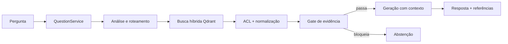
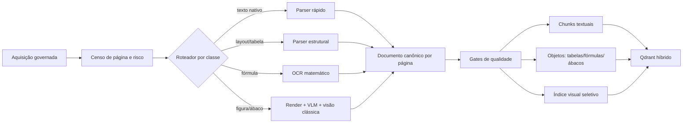
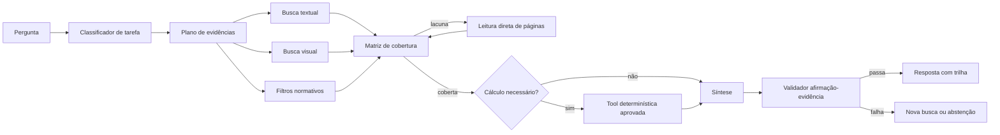

# Pipelines DNIT de ingestão e resposta técnica: posição atual e arquitetura de referência

> **Data-base da análise:** 31 de agosto de 2026<br>
> **Recorte:** PDFs técnicos do DNIT; ingestão, indexação, RAG Q&A e DeepAgent para perguntas de engenharia com múltiplos documentos, tabelas, fórmulas, figuras, gráficos e ábacos.<br>
> **Natureza:** auditoria arquitetural e econômica baseada em código, configuração, testes e medições existentes. Não é certificação de engenharia nem validação ao vivo do ambiente de produção.

## Resumo executivo

A plataforma está **bem posicionada na fundação** e **ainda não está no estado da arte ponta a ponta para as perguntas mais difíceis do recorte**.

Ela já possui capacidades que muitos pipelines convencionais não têm: execução assíncrona governada, fan-out por documento, retomada, versionamento ativo, OCR seletivo por página, múltiplos parsers, preservação de tabelas, transcrição seletiva de figuras, chunking estrutural, busca híbrida nativa, BM25 em português, late interaction, rastreabilidade por página e um DeepAgent que pesquisa iterativamente no mesmo boundary governado do Q&A.

O déficit não está em “adicionar mais um LLM” nem em substituir a base atual. Ele se concentra em quatro lacunas:

1. **a representação visual é convertida principalmente em texto**, sem índice visual de páginas ou regiões;
2. **fórmulas e ábacos não são objetos computáveis versionados**;
3. **perguntas com muitos requisitos dependem de disciplina de prompt**, sem uma matriz de cobertura determinística;
4. **citações apontam para fontes entregues, mas não passam por verificação automática afirmação a afirmação**.

Para o objetivo específico deste documento, a avaliação ponderada é:

| Capacidade avaliada | Plataforma atual | Alvo pragmático | Leitura executiva |
|---|---:|---:|---|
| Ingestão técnica DNIT | **6,97/10** | **9,02/10** | Base operacional forte; fórmulas, geometria visual e ábacos computáveis concentram o gap. |
| RAG Q&A para engenharia complexa | **5,87/10** | **9,07/10** | Recuperação textual é avançada; cobertura multi-evidência, visão e cálculo seguro são insuficientes. |
| DeepAgent técnico | **5,42/10** | **9,08/10** | Pesquisa iterativa real; planejamento, ferramentas visuais/computacionais e validação ainda são majoritariamente semânticos. |
| **Adequação integrada ao recorte** | **6,20/10** | **9,05/10** | A plataforma não precisa ser refeita; precisa completar a cadeia de evidência técnica. |

Essas notas **não são percentuais de acerto**. Elas medem adequação arquitetural ao recorte mais exigente descrito acima. Em perguntas textuais simples e normativas, a plataforma é mais madura do que a nota integrada sugere. Nas perguntas que exigem sete a nove evidências, leitura de figura ou cálculo, as lacunas passam a dominar o resultado.

O alvo recomendado é uma evolução, não uma substituição:

- preservar Job Core, governança multi-tenant, manifestos, versionamento e Qdrant;
- manter a recuperação textual híbrida já existente;
- acrescentar uma representação canônica por página com geometria e ativos visuais;
- indexar visualmente apenas páginas de alto valor;
- transformar tabelas, fórmulas e famílias priorizadas de ábacos em artefatos estruturados;
- permitir leitura direta e limitada de páginas pelo agente;
- separar raciocínio generativo de cálculos determinísticos;
- exigir cobertura de requisitos e suporte de citações antes da resposta final.

O esforço estimado para esse alvo é de **10 a 18 FTE-mês**, com custo de construção dado por `10–18 × custo carregado mensal por FTE`. Em um cenário ilustrativo de **US$ 10 mil a US$ 18 mil por FTE-mês**, isso corresponde a **US$ 100 mil a US$ 324 mil**. O intervalo inclui engenharia, dados de avaliação e validação especializada; não é cotação comercial. O custo variável de modelos é secundário diante do custo de construção e validação.

---

## 1. Como ler esta avaliação

### 1.1 Três classes de evidência

Este documento separa explicitamente:

- **fato estático atual:** confirmado por leitura direta do código ou do YAML no workspace;
- **medição histórica:** resultado de artefato de benchmark ou snapshot datado;
- **arquitetura proposta:** componente que existe tecnicamente no mercado ou na literatura, mas ainda não está integrado à plataforma.

Não foi feita consulta ao banco, ao Qdrant ou aos logs vivos nesta análise. Assim, números de corpus e desempenho são apresentados como **último snapshot auditado**, não como estado vivo garantido.

No snapshot do workspace analisado existe um delta ainda não commitado que troca a configuração de serving de `rerank ON, k=5` para `rerank OFF, k=20`. O relatório considera essa mudança como **configuração materializada no workspace**, mas não presume que ela já esteja publicada. O A/B que fundamenta a decisão permanece tratado como medição histórica.

### 1.2 Rubrica de notas

Cada nota de componente usa a mesma escala:

| Nota | Significado |
|---:|---|
| 0 | Capacidade ausente. |
| 2 | Experimento ou representação indireta, sem contrato operacional suficiente. |
| 4 | Parcialmente funcional; depende de prompt, trabalho manual ou caminho não oficial. |
| 6 | Funcional em produção para parte relevante do recorte, com lacunas materiais. |
| 8 | Forte, governado e mensurável; cobre a maior parte do recorte. |
| 10 | Validado ponta a ponta no domínio, com regressão, comportamento fail-closed e operação sustentável. |

A fórmula é:

```text
nota do pipeline = soma(peso do componente × nota do componente) / 100
```

A nota integrada usa `40% ingestão + 35% RAG Q&A + 25% DeepAgent`. O peso maior da ingestão reflete uma propriedade inevitável: uma informação perdida no PDF não pode ser recuperada por um agente melhor.

O alvo fica próximo de 9, e não de 10, porque permanece pragmático: fórmulas e ábacos só se tornam executáveis após validação por família, e nenhum pipeline elimina a necessidade de avaliação contínua no domínio.

### 1.3 O que “estado da arte pragmático” significa aqui

Não existe um produto único que resolva de forma confiável todos os PDFs DNIT, toda relação normativa, toda tabela e todo ábaco. O alvo deste documento combina técnicas existentes e implementáveis:

- parsers estruturais como [Docling](https://arxiv.org/abs/2408.09869) e [PP-StructureV3](https://github.com/PaddlePaddle/PaddleOCR/blob/main/docs/version3.x/pipeline_usage/PP-StructureV3.en.md);
- OCR científico especializado, quando necessário, como a classe de abordagem do [Nougat](https://arxiv.org/abs/2308.13418);
- recuperação visual por página, como [ColPali](https://arxiv.org/abs/2407.01449);
- busca híbrida e multiestágio, já suportada pela [Query API do Qdrant](https://qdrant.tech/documentation/search/hybrid-queries/);
- recuperação iterativa, na linha do [IRCoT](https://aclanthology.org/2023.acl-long.557/);
- conversão de gráficos em dados estruturados, como demonstra o [DePlot](https://arxiv.org/abs/2212.10505);
- verificação de qualidade de citações, motivada pelo benchmark [ALCE](https://arxiv.org/abs/2305.14627);
- avaliação separada de retrieval, fidelidade e resposta, como no [RAGAS](https://aclanthology.org/2024.eacl-demo.16/).

Essas referências provam que os componentes existem. Elas **não provam desempenho no corpus DNIT**. A prova DNIT precisa vir de um benchmark próprio, com gabarito de engenharia e repetição suficiente.

---

## 2. Por que documentos DNIT são difíceis

O problema não é apenas “extrair texto de PDF”. O corpus combina classes de defeito e de raciocínio que se amplificam.

### 2.1 Heterogeneidade física e histórica

O acervo mistura PDFs digitais, digitalizações, documentos com OCR prévio defeituoso, páginas rotacionadas, imagens embutidas, desenhos vetoriais, múltiplas colunas, cabeçalhos repetidos e numeração física diferente da numeração impressa.

Uma página pode conter texto pesquisável suficiente para evitar OCR convencional e, ao mesmo tempo, esconder numa imagem o valor técnico necessário. Por isso, “a página tem texto” não é um critério suficiente para decidir se ela foi compreendida.

### 2.2 Tabelas não são apenas texto alinhado

Tabelas DNIT carregam relações de linha, coluna, unidade, classe, condição e exceção. Um pipeline pode reconhecer todas as palavras e ainda destruir a semântica ao:

- fundir cabeçalhos;
- deslocar uma célula;
- perder unidade;
- colar rótulos;
- alterar sinal, vírgula decimal ou desigualdade;
- separar tabela e nota de rodapé.

Para engenharia, preservar números não basta: é necessário preservar **qual número pertence a qual condição**.

### 2.3 Fórmulas exigem estrutura e semântica

Uma fórmula útil precisa conservar símbolos, subscritos, sobrescritos, frações, operadores, unidades e definição de variáveis. OCR textual comum frequentemente produz uma sequência visualmente parecida, mas matematicamente diferente.

Além da extração, responder corretamente requer:

- selecionar a fórmula aplicável;
- obter variáveis e unidades;
- validar domínio e hipóteses;
- executar a conta de modo determinístico;
- apresentar resultado e trilha de cálculo.

### 2.4 Figuras e ábacos guardam relações geométricas

Uma transcrição textual pode dizer quais eixos e curvas aparecem. Ela não preserva necessariamente a posição exata de uma curva, a escala logarítmica, a interpolação ou a interseção usada na leitura.

O benchmark [ChartQA](https://arxiv.org/abs/2203.10244) foi criado justamente porque perguntas sobre gráficos exigem combinação de percepção visual, lógica e aritmética. Em cenários mais diversos, o [ChartQAPro](https://arxiv.org/abs/2504.05506) mostra queda acentuada de desempenho dos modelos, reforçando que “o modelo viu a imagem” não equivale a “o valor foi calculado com confiabilidade”.

Um ábaco é ainda mais exigente do que um gráfico comum: ele é um instrumento de cálculo. Para torná-lo computável é preciso identificar e calibrar eixos, escalas, famílias de curvas, unidades, domínio, direção de leitura e regra de interpolação. Técnicas de visão clássica como a [transformada de Hough do OpenCV](https://docs.opencv.org/5.0/tutorials/imgproc/imgtrans/hough_lines/hough_lines.html) existem para detectar linhas, mas precisam ser combinadas com OCR, segmentação, calibração e validação de domínio.

### 2.5 A resposta pode depender de vários documentos

Perguntas técnicas reais raramente pedem apenas um valor. Elas podem exigir simultaneamente:

- critério normativo;
- documento aplicável e sua vigência;
- definição de variáveis;
- tabela ou figura correta;
- procedimento;
- condicionantes;
- exceções;
- cálculo;
- fontes para cada conclusão.

Recuperar cinco trechos muito relevantes não garante que os nove requisitos diferentes estejam cobertos. Relevância e cobertura são problemas distintos.

### 2.6 “Não consta” é uma conclusão cara

Encontrar uma evidência pode depender de poucos trechos. Provar ausência pode exigir varrer documentos inteiros, versões, emendas e referências cruzadas. Um agente não deve transformar “não apareceu no top-k” em “não existe no acervo”.

---

## 3. Pipeline real de ingestão PDF DNIT

### 3.1 Visão de ponta a ponta


O boundary HTTP está em [`rag_ingestion_router.py`](../../src/api/routers/rag_ingestion_router.py), a resolução da requisição e do YAML em [`rag_ingestion_application_service.py`](../../src/api/services/rag_ingestion_application_service.py), e a execução assíncrona em [`rag_async_execution_service.py`](../../src/api/services/rag_async_execution_service.py). O trabalho é materializado no Job Core e repartido pelos serviços de fan-out em [`document_fanout_coordinator.py`](../../src/services/document_fanout_coordinator.py) e [`document_fanout_child_executor_service.py`](../../src/services/document_fanout_child_executor_service.py).

### 3.2 Aquisição, deduplicação e controle operacional

O cliente de Google Drive pagina a enumeração com `nextPageToken`, e a família de conteúdo remoto deduplica identificadores. O pipeline possui cancelamento cooperativo, manifestos, artefatos de retomada e separação de falha por documento. Isso é uma vantagem estrutural: um corpus grande não depende de um processo monolítico sem checkpoint.

A persistência usa hash, fingerprint de política de extração, guarda de versão ativa e arquivamento da versão anterior. A consequência é que a plataforma já tem o owner correto para uma ingestão evolutiva: novos extratores devem produzir artefatos no mesmo ciclo de versão, não criar uma segunda esteira paralela.

### 3.3 OCR seletivo por página

O fluxo PDF canônico passa por [`pdf_document_processing_application_service.py`](../../src/ingestion_layer/processors/pdf_document_processing_application_service.py), [`pdf_runtime_coordinator.py`](../../src/ingestion_layer/processors/pdf_runtime_coordinator.py) e [`pdf_document_ocr_service.py`](../../src/ingestion_layer/processors/pdf_document_ocr_service.py).

O serviço de OCR inspeciona todas as páginas e decide OCR com sinais como ausência de texto, presença de elementos visuais e cobertura por imagem. Quando uma página precisa de OCR, o pipeline usa seleção por página; quando o OCR falha, mantém o PDF original e registra degradação. Essa política é mais eficiente e mais segura do que OCR indiscriminado do documento inteiro.

Limite: a decisão é orientada à legibilidade textual. Uma figura técnica pode continuar sem representação visual pesquisável mesmo quando a página não necessita de OCR.

### 3.4 Parsing multi-engine

O YAML canônico de ingestão, [`rag-config-mrctito-dnit-ingest-producao-600.yaml`](../../app/yaml/rag-config-mrctito-dnit-ingest-producao-600.yaml), usa PyMuPDF4LLM como caminho geral e overrides explícitos para Docling em documentos curados. Há timeout por documento e por subprocesso, inclusive um perfil especial de longa duração para o IPR-726.

O uso seletivo de Docling é tecnicamente coerente. O próprio [relatório técnico do Docling](https://arxiv.org/abs/2408.09869) descreve modelos especializados de layout e tabela executáveis em hardware comum. O problema atual não é ausência de parser avançado, e sim **roteamento estático por nomes de arquivos**. Um documento novo com o mesmo defeito não recebe automaticamente o tratamento adequado.

Existe ainda um terceiro adapter canônico, [`opendataloader_pdf_parsing_engine.py`](../../src/ingestion_layer/pdf_tools/opendataloader_pdf_parsing_engine.py), registrado no [`engine_catalog.py`](../../src/ingestion_layer/engine_catalog.py), mas o YAML de produção analisado não o seleciona. A bancada histórica concluiu que ele é muito mais barato para uma classe específica de célula de tabela embaralhada, mas inadequado para fórmulas e escaneados. Isso reforça o desenho recomendado: **rotear por defeito comprovado**, não eleger uma engine universal.

### 3.5 Tabelas

O pipeline:

- habilita extração de tabelas;
- cria chunks dedicados para tabelas;
- preserva a grade original;
- aplica normalização textual determinística;
- pode enriquecer apenas tabelas degradadas com LLM;
- rejeita reescrita se a sequência numérica mudar.

O gate em [`pdf_table_numeric_gate.py`](../../src/ingestion_layer/processors/pdf_table_numeric_gate.py) é uma decisão correta para o domínio: falhar fechado em número é preferível a “corrigir” uma tabela de forma plausível. O enriquecimento em [`pdf_table_enricher.py`](../../src/ingestion_layer/processors/pdf_table_enricher.py) mantém a original ao lado da interpretação.

Limite: a saída principal continua orientada a Markdown/texto. Não existe um objeto de tabela canônico com células, coordenadas, cabeçalhos hierárquicos, unidades, notas e confiança pronto para consulta e cálculo determinístico.

### 3.6 Figuras e ábacos

Há um funil real e economicamente disciplinado:

1. triagem estrutural gratuita em [`acervo_structure_analyzer.py`](../../src/ingestion_layer/analysis/acervo_structure_analyzer.py);
2. classificação visual das páginas candidatas em [`acervo_page_classifier.py`](../../src/ingestion_layer/analysis/acervo_page_classifier.py);
3. transcrição das figuras confirmadas em [`acervo_figure_transcription_stage.py`](../../src/ingestion_layer/analysis/acervo_figure_transcription_stage.py) e [`acervo_figure_transcriber.py`](../../src/ingestion_layer/analysis/acervo_figure_transcriber.py);
4. anexação da transcrição ao texto da página antes do chunking.

O YAML registra 5.043 páginas triadas, 3.144 confirmadas e estimativa de US$ 249,63 para transcrição, mais aproximadamente US$ 3 de classificação. Esse desenho é pragmático: evita mandar todas as páginas a um modelo visual caro.

Limite crítico: o perfil PDF mantém `extract_images: false`, descrição de imagem desativada e embedding visual desativado. A figura vira texto, mas sua geometria, seu recorte e sua representação visual não viram uma segunda via de recuperação. O pipeline reconhece que existe um ábaco e pode descrevê-lo; ele não o transforma em uma função computável.

### 3.7 Fórmulas

Existe capacidade de normalização textual em [`pdf_formula_text_normalization.py`](../../src/ingestion_layer/processors/pdf_pipeline/pdf_formula_text_normalization.py), mas o YAML de ingestão não ativa essa etapa. O perfil Docling usado nos overrides também não habilita enriquecimento específico de fórmulas.

Portanto, a plataforma possui peças de software e medições dirigidas, mas **não possui uma rota de fórmula ativa e geral no pipeline canônico**. Modelos existentes como [Nougat](https://arxiv.org/abs/2308.13418) e os módulos de fórmula do [PP-StructureV3](https://github.com/PaddlePaddle/PaddleOCR/blob/main/docs/version3.x/pipeline_usage/PP-StructureV3.en.md) mostram que a extração para markup matemático é implementável; ainda assim, precisam ser avaliados em documentos DNIT, que não são idênticos ao corpus acadêmico usado nesses trabalhos.

### 3.8 Chunking, metadados e índice

[`pdf_chunking_service.py`](../../src/ingestion_layer/processors/pdf_chunking_service.py) preserva fronteiras de página e seção, cria chunks específicos para tabelas, evita pseudotabelas de navegação e propaga página física e impressa. Transcrições de figuras também recebem chunks dedicados.

O Qdrant recebe:

- vetor denso;
- vetor esparso BM25 nativo em português;
- multivetor de late interaction;
- payload com proveniência, hashes e assinaturas.

Isso coloca a fundação de retrieval textual acima de um RAG convencional baseado apenas em embeddings densos. A literatura de [ColBERTv2](https://arxiv.org/abs/2112.01488) explica a vantagem da interação tardia e seu custo maior de armazenamento; a [documentação do Qdrant sobre multivetores](https://qdrant.tech/documentation/tutorials-search-engineering/using-multivector-representations/) descreve justamente o trade-off entre precisão, RAM e tempo de inserção.

Limite: metadados de vigência e identidade documental existem no payload, mas não formam um grafo normativo nem um conjunto completo de filtros indexados para resolver relação entre documento, edição, emenda e revogação.

### 3.9 Completude

[`document_completeness.py`](../../src/ingestion_layer/core/document_completeness.py) calcula estado a partir de páginas, OCR, tabelas, figuras e chunks. A ingestão falha se não houver chunks.

Há uma escolha importante: esgotamento do orçamento de transcrição de figuras não invalida o documento inteiro. Operacionalmente isso permite concluir a carga; semanticamente significa que “documento ingerido com sucesso” não garante “toda figura técnica ficou utilizável”. O relatório de completude deve, portanto, distinguir sucesso operacional de cobertura técnica.

---

## 4. Pipeline real de RAG Q&A e DeepAgent

### 4.1 Q&A governado



O boundary de consulta passa por [`question_service.py`](../../src/services/question_service.py), `ContentQASystem`, `QAQuestionProcessor` e [`intelligent_orchestrator.py`](../../src/qa_layer/rag_engine/intelligent_orchestrator.py). O `RagQaLangGraphRuntime` é um wrapper de grafo, mas a lógica substantiva continua no mesmo Q&A governado.

O orquestrador analisa a pergunta, escolhe rota, recupera, aplica ACL, normaliza documentos, avalia evidência, gera resposta e registra telemetria. Códigos exatos e termos técnicos tendem a forçar busca híbrida; perguntas comparativas e procedurais podem gerar múltiplas consultas.

### 4.2 Recuperação híbrida

[`qdrant_client.py`](../../src/ingestion_layer/vector_stores/qdrant_client.py) combina dense, BM25 e late interaction numa consulta nativa multiestágio. Esse é um ponto forte real e alinhado à [Query API híbrida do Qdrant](https://qdrant.tech/documentation/search/hybrid-queries/).

O workspace analisado materializa `rerank: false` e `k: 20`; o `git diff` mostra que essa é uma mudança concorrente ainda não assumida como deploy. O benchmark histórico mediu:

- rerank ligado: separação mediana de scores de 1,94%, com 281/281 empates no lote;
- rerank desligado: separação de 56,38%, com 1/260 empate;
- ambos os braços finais: 7/17 no placar, com latências medianas diferentes.

Conclusão: possuir late interaction é um ativo, mas ligá-la indiscriminadamente não é automaticamente melhor. O modelo atual, monolíngue e aplicado ao corpus em português, achatou a ordenação no experimento. Estado da arte pragmático significa **avaliar e calibrar por corpus**, não habilitar cada técnica disponível.

### 4.3 Contexto de geração e fontes

O YAML de serving, [`rag-config-mrctito-dnit-producao.yaml`](../../app/yaml/rag-config-mrctito-dnit-producao.yaml), permite recuperar 20 trechos, mas `max_source_references: 5` limita o contexto efetivamente entregue ao gerador de Q&A. [`generation_engine.py`](../../src/qa_layer/rag_engine/generation_engine.py) usa esse mesmo teto para o contexto.

Para uma pergunta simples, cinco fontes podem ser suficientes. Para uma pergunta com sete a nove requisitos independentes, o limite cria competição entre evidências. A resposta pode perder um critério não porque ele não foi recuperado, mas porque não entrou na janela do gerador.

As referências usam título/código/seção e preferem página impressa à página física. O benchmark histórico auditou 263/263 páginas citadas como pertencentes aos documentos entregues. Isso é prova de proveniência da fonte entregue, não de que cada afirmação da resposta esteja semanticamente suportada pelo trecho citado.

### 4.4 Gate de evidência

[`intelligent_orchestrator.py`](../../src/qa_layer/rag_engine/intelligent_orchestrator.py) tem um gate de evidência com limiar denso. Quando o rerank está ativo, o próprio código registra que não existe piso MaxSim calibrado e deixa a geração seguir. Quando não há score denso medido, também não bloqueia.

Essa decisão evita falsa segurança, mas revela o gap: o gate atual mede **qualidade do conjunto por um score disponível**, não cobertura dos requisitos nem suporte de cada conclusão. O alvo deve manter a honestidade atual — não inventar limiar — e adicionar sinais avaliáveis: requisito coberto, evidência visual acessível, documento vigente e afirmação vinculada ao trecho.

### 4.5 DeepAgent

O entrypoint selecionado é `dnit_v4_conduta_normativa`. O supervisor encaminha perguntas técnicas ao `pesquisador_acervo`, que usa [`qa_governed_retrieve`](../../src/agentic_layer/tools/vector_store_tools/governed_qa_tools.py). Essa tool devolve chunks crus e reaproveita `QuestionService.retrieve_governed_chunks`, mantendo ACL, YAML, observabilidade e política de retrieval.

O agente pode pesquisar em camadas, reformular termos, buscar vigência e auto-auditar a resposta. `max_tool_calls: 10` é realmente aplicado por `ToolCallLimitMiddleware`. Já `timeout_s: 120` e `token_budget: 8000` são declarativos no YAML e não possuem enforcement equivalente; o próprio YAML registra esse limite.

Os chunks retornados projetam:

- `title`;
- `reference`;
- `page`;
- `score`;
- `content`.

Não entregam ao agente, como contrato de primeira classe, ano de publicação, tipo normativo, status de vigência, objeto de tabela, fórmula estruturada ou região visual. O agente tenta reconstruir identidade e hierarquia a partir de título e texto.

### 4.6 Imagens e leitura direta

O retriever tem caminho de busca visual, mas [`retrievers.py`](../../src/qa_layer/rag_engine/retrievers.py) só o ativa quando `vision_embedding` está habilitado. No YAML atual essa capacidade está desligada. Uma imagem anexada à pergunta, portanto, não ganha recuperação visual efetiva nesse perfil.

Existe `POST /rag/documents/content` em [`rag_documents_router.py`](../../src/api/routers/rag_documents_router.py), capaz de devolver o PDF completo pelo identificador do documento. Não existe uma tool agentic oficial para ler uma faixa de páginas, renderizar a página ou obter um recorte visual. O DeepAgent vê os chunks; ele não pode escalar sozinho de “o chunk parece insuficiente” para “abra as páginas 143–145 do manual”.

### 4.7 Cálculo técnico

O prompt ativo proíbe executar cálculo numérico de projeto. Ele orienta o agente a localizar metodologia, fórmula, variáveis e unidades e devolver o cálculo ao engenheiro.

Essa é uma proteção correta para o estado atual: sem fórmula estruturada, unidade validada e solver governado, cálculo generativo seria arriscado. Ao mesmo tempo, significa que a plataforma atual **não entrega a capacidade computacional** pedida no recorte mais avançado. A evolução correta não é remover a proibição; é criar ferramentas determinísticas aprovadas e permitir apenas os cálculos cobertos por elas.

### 4.8 Evidência empírica existente

O último snapshot auditado registra 65.324 pontos e 564 documentos alinhados entre ledger e store, após remoção de gerações antigas. A documentação integrada registra aproximadamente 20,9 mil páginas. Esses números são snapshots, não leitura viva feita para este relatório.

O benchmark consolidado em `99-TABELA-COMPARATIVA-FINAL.md` mostra:

| Versão | Placar | Latência mediana |
|---|---:|---:|
| Q&A V0 | 3/17 | 29,9 s |
| DeepAgent V4a | 7/17 | 68–70 s, conforme rodada consolidada |
| Melhor rodada V7 | 10/17 | 74,0 s |
| Produção pós-janela | 7/17 | 65,2 s |
| A/B final rerank ligado | 7/17 | 67,3 s |
| A/B final rerank desligado | 7/17 | 78,5 s |

O mapa de decisão em `00-MAPA-DECISAO-90-PORCENTO.md` registra variação de até dois pontos entre execuções e separa:

- perguntas de alvo único: 71% de acerto;
- perguntas de síntese com sete a nove pontos críticos: 20%.

Esse é o sinal mais importante do posicionamento atual. A arquitetura encontra evidência pontual com competência, mas não garante cobertura de perguntas compostas.

---

## 5. Arquitetura de referência pragmática

### 5.1 Princípio: duas representações, uma governança

O documento técnico deve existir em duas formas sincronizadas:

1. **representação textual e estruturada**, otimizada para busca exata, normas, fórmulas e tabelas;
2. **representação visual por página ou região**, otimizada para diagramas, gráficos, layout e ábacos.

Ambas devem compartilhar o mesmo `document_key`, versão ativa, página física, página impressa, hash, tenant e origem. Não devem virar dois acervos independentes.

### 5.2 Pipeline-alvo de ingestão



#### Etapa A — censo e classificação de risco

Antes de escolher parser, medir por página:

- densidade e confiabilidade de texto;
- proporção de imagem e desenho vetorial;
- presença provável de tabela, fórmula, gráfico e ábaco;
- complexidade de layout;
- idioma e qualidade do OCR existente;
- sinais de cabeçalho, rodapé e múltiplas colunas.

O roteamento deixa de depender apenas de uma lista de nomes e passa a depender de características observáveis. Overrides manuais continuam possíveis para exceções conhecidas.

#### Etapa B — representação canônica por página

Cada página deve produzir um artefato versionado com:

```text
PageArtifact
  document_key, version, physical_page, printed_page
  width, height, rotation, image_asset
  blocks[]: type, text, bbox, reading_order, confidence
  tables[]: cells, row/column spans, headers, units, notes, bbox
  formulas[]: latex, normalized_ast, variables, units, bbox, confidence
  figures[]: caption, type, bbox, transcription, visual_asset
  provenance: engine, model, policy_fingerprint, timestamps
```

Esse objeto não precisa substituir os chunks. Ele se torna a fonte estruturada a partir da qual chunks e ferramentas são derivados.

#### Etapa C — roteamento de parser com gate

Uma política possível:

- PyMuPDF4LLM para texto nativo simples;
- Docling ou PP-StructureV3 para layout e tabelas;
- OpenDataLoader local para a classe de tabela digital em que a bancada DNIT já provou vantagem, mantendo-o fora de fórmulas e escaneados;
- OCR matemático apenas em regiões ou documentos classificados como formula-heavy;
- fallback para parser alternativo quando métricas de estrutura falharem;
- quarentena quando dois parsers discordarem em valores críticos.

O estado da arte pragmático não processa toda página pelo modelo mais caro. Ele aplica o modelo suficiente e promove a página apenas quando a qualidade medida exige.

#### Etapa D — tabelas como dados

Para cada tabela:

- preservar imagem e extração original;
- guardar células e coordenadas;
- reconstruir cabeçalhos hierárquicos;
- normalizar unidades sem alterar valor;
- comparar tokens numéricos com a origem;
- renderizar novamente a estrutura e comparar visualmente;
- permitir consulta por linha, coluna, condição e unidade;
- bloquear cálculo se a confiança estrutural estiver abaixo do piso.

O gate numérico atual deve ser reaproveitado. A mudança é elevar a tabela de texto enriquecido para objeto estruturado.

#### Etapa E — fórmulas como objetos verificáveis

Para cada fórmula priorizada:

- imagem da região;
- LaTeX extraído;
- AST ou expressão simbólica normalizada;
- definições de variáveis e unidades recuperadas do entorno;
- renderização de volta para comparação;
- casos de teste extraídos dos exemplos resolvidos do próprio manual;
- status `extraída`, `revisada` ou `aprovada para cálculo`.

Fórmula extraída não deve ser automaticamente executável. A promoção para cálculo exige validação de domínio.

#### Etapa F — figuras e recuperação visual

O [ColPali](https://arxiv.org/abs/2407.01449) representa páginas visualmente com multivetores e foi criado para documentos visualmente ricos. Para este corpus, o uso pragmático é **seletivo**:

- indexar visualmente páginas classificadas como tabela, figura, gráfico, fórmula ou ábaco;
- conservar a via textual atual;
- fundir resultados textuais e visuais;
- recuperar a página inteira e, quando possível, a região relevante;
- medir ganho numa bateria DNIT antes de expandir para todas as páginas.

#### Etapa G — ábacos computáveis por família

Não há caminho seguro para um “solver universal de ábacos DNIT” de uma só vez. A unidade correta de construção é a **família de ábaco**.

Um contrato possível:

```text
NomogramSpec
  id, document_key, version, page, figure_id
  inputs[]: name, unit, scale, domain
  output: name, unit, scale, domain
  axes[]: geometry, calibration_points
  curve_families[]: parameter, labels, geometry
  reading_rule: ordered steps
  interpolation_rule
  source_regions[]
  validation_cases[]
  approval_status, approved_by, approved_at
```

O VLM propõe componentes, rótulos e regras. Visão computacional detecta e calibra geometria. Um especialista confirma pontos de controle e casos resolvidos. Em consulta, um solver determinístico executa interpolação, retorna incerteza e mostra a trilha sobre a figura.

Essa combinação é mais cara para construir, mas muito mais segura do que pedir ao LLM que “leia aproximadamente” o ábaco a cada pergunta.

### 5.3 Pipeline-alvo de resposta



#### Etapa 1 — classificação da tarefa

Classificar a pergunta em eixos independentes:

- fato simples;
- síntese multi-documento;
- vigência/conflito normativo;
- tabela;
- fórmula;
- figura/gráfico;
- ábaco;
- cálculo;
- ausência/negative evidence.

Uma pergunta pode pertencer a várias classes.

#### Etapa 2 — plano explícito de evidências

Transformar a pergunta em requisitos verificáveis:

```text
R1 documento e versão aplicáveis
R2 critério normativo
R3 valor de tabela e condicionantes
R4 fórmula e definição de variáveis
R5 unidade e domínio
R6 evidência visual
R7 cálculo ou regra de leitura
R8 exceções
```

Cada requisito mantém estado `não buscado`, `candidato`, `sustentado`, `conflitante` ou `ausente após varredura definida`. O agente só redige quando a política de cobertura permitir.

Esse desenho operacionaliza o benefício observado no [IRCoT](https://aclanthology.org/2023.acl-long.557/): a próxima busca depende do que já foi encontrado. A diferença é que o estado fica estruturado, não apenas implícito na cadeia de raciocínio.

#### Etapa 3 — retrieval multimodal e normativo

Combinar:

- dense + BM25 atual;
- late interaction apenas se o benchmark DNIT provar ganho;
- filtros por tipo, ano, status e versão;
- diversidade por documento e seção;
- índice visual de páginas/regiões;
- relações explícitas de emenda, substituição e documento-base.

#### Etapa 4 — leitura direta como escalada

Criar uma tool que use o serviço documental canônico e aceite:

```text
document_key
page_start
page_end
mode: text | image | both
purpose
```

Ela deve impor tenant, faixa máxima, timeout, custo e observabilidade. O agente a usa quando:

- o chunk termina no meio da evidência;
- a figura foi mencionada, mas não está representada;
- uma tabela precisa de contexto adjacente;
- é necessário provar ausência numa seção;
- duas fontes conflitam.

#### Etapa 5 — ferramentas determinísticas

Cada ferramenta deve ter contrato tipado, unidades, domínio e evidência de origem. Exemplos:

- consultar célula estruturada de tabela;
- avaliar fórmula aprovada;
- converter unidades;
- interpolar uma família de ábaco aprovada;
- comparar alternativas e tolerâncias;
- montar memória de cálculo reproduzível.

O LLM decide **qual ferramenta chamar** e explica o resultado. Ele não substitui a ferramenta na aritmética.

#### Etapa 6 — validação de suporte

Antes de responder:

- toda afirmação técnica recebe uma ou mais evidências;
- todo número aponta para tabela, fórmula, figura ou resultado da tool;
- cada requisito da pergunta tem estado explícito;
- conflitos são declarados;
- a ausência só é afirmada após estratégia de busca adequada;
- citações são verificadas por entailment e, para itens críticos, por regra determinística.

O [ALCE](https://arxiv.org/abs/2305.14627) demonstra por que presença de citações não basta: mesmo sistemas fortes podem deixar afirmações sem suporte completo. Para engenharia, completude e correção de citação devem ser métricas separadas.

---

## 6. Comparação componente a componente — ingestão

| Componente | Peso | Plataforma atual | Nota | Alvo pragmático | Nota | Trade-off principal |
|---|---:|---|---:|---|---:|---|
| Aquisição e governança | 10% | HTTP governado, Drive paginado, deduplicação e tenant. | 9,0 | Mesmos owners, com censo de risco persistido. | 9,5 | Mais metadados e retenção de artefatos. |
| Orquestração, retomada e versão | 12% | Job Core, fan-out, cancelamento, manifestos, versão ativa. | 9,0 | Reprocesso por página/região e linhagem completa. | 9,5 | Maior complexidade de estado e migração. |
| OCR e digitalizados | 12% | Seleção por página, OCRmyPDF, degradação explícita. | 8,5 | Score de OCR, fallback por região e regressão de caracteres/unidades. | 9,0 | Mais compute em páginas difíceis. |
| Layout e roteamento de parser | 12% | PyMuPDF4LLM geral; Docling por allowlist; OpenDataLoader integrado, mas não selecionado no YAML. | 7,0 | Roteamento por classe de defeito com gate e fallback. | 9,0 | Classificador e avaliação precisam ser mantidos. |
| Tabelas | 10% | Grade original, chunk dedicado, enriquecimento e gate numérico. | 7,5 | Células, cabeçalhos, bboxes, unidades e consulta estruturada. | 9,0 | Estrutura custa armazenamento e validação. |
| Fórmulas | 8% | Capacidade presente, mas rota canônica não ativada. | 3,5 | OCR matemático seletivo, AST, render-back e aprovação. | 8,5 | Alto custo de validação; nem toda fórmula será executável. |
| Figuras e gráficos | 10% | Triagem e transcrição textual seletiva; sem vetor visual. | 6,0 | Ativo visual versionado + índice de páginas/regiões de alto valor. | 9,0 | Mais GPU, storage e custo de consulta. |
| Ábacos computáveis | 10% | Detecta/transcreve; não há schema, calibração ou solver. | 2,0 | `NomogramSpec`, calibração, solver e aprovação por família. | 8,0 | Construção especializada e escopo necessariamente incremental. |
| Chunking, proveniência e índice | 10% | Página/seção/tabela, página impressa, dense+BM25+late. | 8,5 | Chunks derivados do objeto canônico e ligados às regiões. | 9,5 | Migração e compatibilidade de índices. |
| Qualidade e regressão | 6% | Completude, gates, testes e benchmarks dirigidos. | 7,5 | Golden set por classe, regressão de perda e SLO de cobertura. | 9,0 | Custo contínuo de curadoria. |
| **Nota ponderada** | **100%** |  | **6,97** |  | **9,02** |  |

### Veredito da ingestão

A ingestão atual é **forte para texto, operação e rastreabilidade**, **boa para tabelas com defesa numérica**, **intermediária para figuras** e **fraca para fórmulas e ábacos computáveis**. A maior oportunidade não é trocar de parser, mas criar uma camada canônica que preserve estrutura e geometria e permita usar vários parsers como produtores intercambiáveis.

---

## 7. Comparação componente a componente — RAG Q&A

| Componente | Peso | Plataforma atual | Nota | Alvo pragmático | Nota | Trade-off principal |
|---|---:|---|---:|---|---:|---|
| Boundary, ACL e versão | 10% | Q&A governado, YAML por invocação, fontes e telemetria. | 9,0 | Mesmo boundary para texto, página, visual e tools. | 9,5 | Mais contratos para governar. |
| Entendimento e roteamento | 10% | Query analyzer e roteamento adaptativo; rewrite desligado. | 7,0 | Classificação multi-rótulo por tipo de evidência e risco. | 9,0 | Erro de rota precisa de fallback explícito. |
| Retrieval textual | 15% | Dense + BM25 PT + fusão + late interaction disponível. | 8,5 | Calibração por classe, filtros normativos e diversidade. | 9,5 | Mais experimentos e índices de payload. |
| Cobertura multi-evidência | 12% | Multi-query e prompt; sem matriz de requisitos. | 5,0 | Plano de evidências e cobertura fail-closed. | 9,0 | Mais chamadas e latência. |
| Retrieval visual e página | 12% | Caminho de visão desligado; agente não lê página diretamente. | 2,0 | Índice visual seletivo + leitura direta de faixa/região. | 9,0 | Custo visual e controle de contexto. |
| Tabela, fórmula e cálculo | 12% | Consome texto/Markdown; cálculo de projeto proibido. | 2,5 | Objetos estruturados e tools determinísticas aprovadas. | 8,5 | Validação de domínio e responsabilidade técnica. |
| Grounding, citação e abstenção | 12% | Página rastreável; gate parcial; sem verificador por afirmação. | 5,5 | Cobertura, entailment, regra numérica e abstenção calibrada. | 9,0 | Validação adiciona custo e pode reduzir taxa de resposta. |
| Síntese e apresentação | 7% | Prompts técnicos detalhados e referências explícitas. | 7,0 | Resposta por requisito, trilha de cálculo e incerteza. | 9,0 | Respostas podem ficar mais extensas. |
| Observabilidade e avaliação | 7% | Correlation ID, etapas, scores e campanha de benchmark. | 7,5 | Golden set determinístico, N≥3 e métricas por camada. | 9,5 | Curadoria e operação do benchmark. |
| Latência e custo | 3% | Limites parciais; medianas complexas de ~65–79 s. | 6,0 | Budget por rota, cache de artefatos e escalada seletiva. | 8,0 | Respostas visuais continuarão mais lentas. |
| **Nota ponderada** | **100%** |  | **5,87** |  | **9,07** |  |

### Veredito do RAG Q&A

O motor de retrieval textual é uma das partes mais bem posicionadas. O gap aparece depois de recuperar: o sistema precisa saber **quais evidências distintas ainda faltam**, acessar a página quando o chunk não basta e validar que cada conclusão foi realmente sustentada.

---

## 8. Comparação componente a componente — DeepAgent

| Componente | Peso | Plataforma atual | Nota | Alvo pragmático | Nota | Trade-off principal |
|---|---:|---|---:|---|---:|---|
| Reuso do boundary governado | 12% | `qa_governed_retrieve` reutiliza QuestionService e ACL. | 9,0 | Todas as novas tools usam os mesmos owners. | 9,5 | Exige contratos consistentes entre modalidades. |
| Planejamento/decomposição | 15% | Instrução rica no prompt; estado não tipado. | 6,0 | Planner gera requisitos e plano estruturado. | 9,0 | Mais estado e testes de orquestração. |
| Retrieval iterativo | 15% | Até dez buscas reais, refinadas pelo agente. | 8,0 | Busca adaptativa guiada por lacunas de cobertura. | 9,5 | Pode elevar tokens e latência. |
| Matriz de cobertura | 12% | Auto-auditoria sem enforcement determinístico. | 4,5 | Requisito, evidência, conflito e status explícitos. | 9,0 | Pode produzir mais abstenções inicialmente. |
| Metadados e vigência | 10% | Inferidos de título/conteúdo; não projetados integralmente. | 5,5 | Identidade normativa tipada e relações versionadas. | 9,0 | Curadoria de grafo e regras. |
| Leitura direta/visual | 12% | Sem tool oficial de faixa de páginas ou imagem. | 2,0 | Page reader governado e recuperação visual. | 9,0 | Custo por página e segurança de acesso. |
| Computação determinística | 12% | Sem solver DNIT; prompt proíbe cálculo de projeto. | 2,0 | Tools aprovadas para tabela, fórmula, unidade e ábaco. | 8,5 | Alto custo inicial por família de cálculo. |
| Validação e citação | 7% | Auto-auditoria por prompt; sem pós-validador. | 4,5 | Validador de suporte e reparo/abstenção. | 9,0 | Chamada adicional e falsos negativos. |
| Limites, logs e benchmark | 5% | Tool-call limit real, logs ricos e campanha com 17 perguntas; outros limites declarativos. | 7,0 | Budgets reais, benchmark ampliado e SLO por rota. | 9,0 | Mais instrumentação e disciplina experimental. |
| **Nota ponderada** | **100%** |  | **5,42** |  | **9,08** |  |

### Veredito do DeepAgent

O DeepAgent não é apenas uma camada cosmética: ele pesquisa várias vezes e reutiliza a recuperação governada. Sua limitação é que dispõe de **uma única ferramenta textual generalista**. Um agente mais inteligente com a mesma ferramenta continua cego à geometria e incapaz de calcular de forma auditável.

---

## 9. Custos

### 9.1 Regras para interpretar os valores

- Valores monetários estão em dólar norte-americano.
- Preços públicos são referências de 31 de agosto de 2026 e podem mudar.
- Medições internas são estimativas registradas nos YAMLs e artefatos, não faturas auditadas.
- Custos de infraestrutura dependem de CPU, GPU, RAM, disco, região, disponibilidade e volume.
- O maior custo do alvo é engenharia e validação, não embeddings de texto.

### 9.2 Custo variável da ingestão atual

| Item | Base | Estimativa |
|---|---|---:|
| Classificação de páginas candidatas | 5.043 páginas triadas, custo medido no YAML | ~US$ 3,00 |
| Transcrição de figuras | 3.144 páginas confirmadas | ~US$ 249,63 |
| Enriquecimento de tabelas degradadas | 641 tabelas × US$ 0,0133 | ~US$ 8,55 |
| **Subtotal medido/estimado no repositório** | Sem embeddings, compute e storage | **~US$ 261,18** |
| Tetos configurados | US$ 400 figuras + US$ 15 tabelas | **US$ 415,00**, mais classificador |

O embedding `text-embedding-3-large` custa publicamente [US$ 0,13 por milhão de tokens](https://developers.openai.com/api/docs/models/text-embedding-3-large). Como o corpus não possui, nesta auditoria, uma soma de tokens materializada e verificável, o custo correto é expresso por:

```text
custo_embedding = tokens_ingeridos / 1.000.000 × US$ 0,13
```

Um intervalo meramente ilustrativo de 15 a 40 milhões de tokens custaria US$ 1,95 a US$ 5,20. Esse intervalo **não é medição do corpus** e a cobrança real do provider configurado pode diferir.

OCRmyPDF, PyMuPDF4LLM, Docling e modelos locais podem ter licença/API igual a zero, mas consomem máquina e operação. O benchmark interno de fórmula estimou 24–75 horas sequenciais ou 8–25 horas com paralelismo três para 995 páginas. O custo de compute é:

```text
custo_compute_formula = horas_medidas × preço_hora_da_máquina
```

Aplicar a mesma leitura visual a todas as 20.905 páginas, ao custo unitário medido de aproximadamente US$ 0,0794, ficaria na ordem de **US$ 1.660**. A seleção atual de 3.144 páginas reduz esse componente para cerca de US$ 250. O ganho econômico do funil seletivo deve ser preservado no alvo.

### 9.3 Referência de serviços gerenciados

Como referência externa — não como recomendação de migração — o [Google Document AI](https://cloud.google.com/products/document-ai/pricing) publica:

- OCR: US$ 1,50 por mil páginas após a faixa gratuita;
- layout: US$ 10 por mil páginas;
- form parser: US$ 30 por mil páginas;
- classificador: US$ 5 por mil páginas.

Aplicados a 20.905 páginas, esses preços dão aproximadamente:

| Serviço comparável | Custo aproximado |
|---|---:|
| OCR do corpus, descontadas as primeiras mil páginas | US$ 29,86 |
| Layout em todas as páginas | US$ 209,05 |
| Parser estrutural de formulário/tabela em todas as páginas | US$ 627,15 |
| Parser estrutural em apenas 15% das páginas | US$ 94,07 |
| Classificação de todas as páginas | US$ 104,53 |

Isso mostra que processamento por página pode ficar na ordem de centenas de dólares para o tamanho atual. Não inclui VLM visual, embeddings, transferência, storage, revisão nem operação.

### 9.4 Armazenamento visual

Se cada raster de página comprimido ocupar entre 150 e 400 kB, 20.905 páginas exigem aproximadamente **3,1 a 8,4 GB** apenas para imagens. Indexar visualmente 10% a 25% das páginas reduz esse ativo para cerca de **0,3 a 2,1 GB**, antes dos vetores e índices.

Multivetores visuais podem custar mais que as imagens. A dimensão, quantidade de patches, precisão numérica e quantização devem ser escolhidas após benchmark. O Qdrant cobra cloud por CPU, memória e disco, conforme sua [documentação de preços](https://qdrant.tech/pricing/); portanto, não existe um preço confiável sem dimensionar o índice real.

### 9.5 Custo por consulta complexa

O custo atual por pergunta não pode ser reconstruído com precisão a partir dos artefatos lidos porque falta uma série consolidada de tokens e preço efetivo por execução. A latência, porém, está medida: aproximadamente 65–79 segundos de mediana nas rodadas complexas, com cauda maior em casos iterativos.

Para o alvo, a parte visual pode ser estimada usando o custo interno de transcrição:

```text
US$ 249,63 / 3.144 páginas ≈ US$ 0,0794 por página visual
```

Se a leitura direta for limitada a uma a três páginas, o acréscimo visual seria aproximadamente **US$ 0,08 a US$ 0,24 por pergunta complexa**, usando o mesmo perfil de custo. Dez páginas custariam aproximadamente US$ 0,79 e deveriam exigir justificativa e budget explícitos.

| Volume mensal de perguntas com escalada visual | Uma página | Três páginas |
|---:|---:|---:|
| 1.000 | ~US$ 79 | ~US$ 238 |
| 10.000 | ~US$ 794 | ~US$ 2.382 |

Esses valores são apenas o adicional visual; não incluem planner, síntese, validador, retrieval ou infraestrutura.

O custo total deve ser observado por rota:

```text
C_total = C_planner + C_retrieval + páginas_visuais × C_visão
        + C_síntese + C_validador + C_infra
```

O solver determinístico tende a ter custo marginal pequeno por consulta. Seu custo está na construção, validação e manutenção.

### 9.6 Custo de construção

`FTE-mês` significa o trabalho de uma pessoa equivalente em tempo integral durante um mês.

| Bloco | Escopo | Esforço estimado |
|---|---|---:|
| Confiabilidade de resposta | Matriz de cobertura, leitura de página, filtros, citation verifier e benchmark | 3–5 FTE-mês |
| Documento canônico e visual seletivo | Artefato por página, roteador, tabelas/fórmulas, assets e índice visual | 4–7 FTE-mês |
| Ábaco computável piloto | Uma ou duas famílias, schema, calibração, solver, UI de revisão e testes | 3–6 FTE-mês |
| **Total com sobreposição de integração** | Alvo pragmático completo | **10–18 FTE-mês** |

O custo financeiro é:

```text
custo_construção = 10–18 × custo_carregado_mensal_por_FTE
```

Com US$ 10 mil a US$ 18 mil por FTE-mês, o intervalo ilustrativo é US$ 100 mil a US$ 324 mil. Uma equipe com conhecimento prévio da plataforma tende a ficar mais perto do limite inferior; validação extensa de muitas famílias de ábacos empurra para o superior.

Cada nova família de ábaco deve reservar aproximadamente **2 a 5 dias de revisão especializada**, além da engenharia, para calibração, casos de teste e aprovação. Esse intervalo é hipótese de planejamento e precisa ser recalibrado após o primeiro piloto.

---

## 10. Trade-offs

### 10.1 Texto enriquecido versus preservação visual

**Texto enriquecido** é barato, pesquisável e excelente para normas. Perde geometria e pode suavizar incerteza.<br>
**Representação visual** preserva layout e permite recuperar ábacos, mas aumenta storage, GPU e latência.

Decisão recomendada: manter os dois, com índice visual seletivo.

### 10.2 Parser único versus roteamento

**Parser único** reduz operação e variação. Falha de forma sistemática em certas classes.<br>
**Roteamento multi-engine** melhora qualidade e custo, mas exige classificador, métricas comuns e fallback.

Decisão recomendada: manter PyMuPDF4LLM como rápido, Docling/alternativas como especialistas e promover páginas por gate mensurável.

### 10.3 Transcrever ábaco versus torná-lo computável

**Transcrição** escala e ajuda descoberta. Não garante leitura quantitativa.<br>
**Objeto computável** entrega resultado reproduzível. Exige calibração e validação por família.

Decisão recomendada: transcrever todos os candidatos úteis; tornar computáveis apenas famílias priorizadas por demanda e risco.

### 10.4 Mais contexto versus cobertura explícita

**Aumentar top-k/contexto** pode recuperar mais evidência, mas adiciona ruído e custo.<br>
**Cobertura explícita** busca uma evidência por requisito e permite parar cedo.

Decisão recomendada: controlar contexto por requisito, não por um número global de chunks.

### 10.5 VLM calculando versus tool determinística

**VLM** lida com variedade e linguagem; pode errar número ou interpolação.<br>
**Tool** é reproduzível e testável; cobre apenas contratos implementados.

Decisão recomendada: VLM interpreta e seleciona; tool calcula; especialista aprova o contrato.

### 10.6 Responder sempre versus abster

**Responder sempre** melhora percepção de disponibilidade, mas aumenta risco de conclusão não sustentada.<br>
**Abstenção calibrada** reduz cobertura aparente e melhora confiabilidade.

Decisão recomendada: permitir resposta parcial por requisito, declarar lacunas e bloquear apenas a conclusão que depende da evidência ausente.

### 10.7 Open source versus serviço gerenciado

**Open source/local** reduz custo variável e exposição de dados, mas transfere custo para operação e GPU.<br>
**Gerenciado** simplifica capacidade e SLA, mas cria custo por página, dependência e governança de dados.

Decisão recomendada: preservar o caminho local como padrão e usar serviço gerenciado como fallback mensurado, não como segunda verdade permanente.

---

## 11. Sequenciamento recomendado

### Fase 1 — medir e fechar a cadeia de evidência

Construir primeiro:

- golden set DNIT por tipo de pergunta;
- matriz estruturada de requisitos;
- tool de leitura direta de páginas;
- projeção de metadados normativos na tool;
- verificador de suporte de citação;
- budgets reais de tokens, chamadas e tempo.

Critério de saída:

- recall de evidências críticas medido;
- completude e correção de citação separadas;
- pelo menos três repetições por pergunta estocástica;
- melhoria nas perguntas multi-evidência sem regressão nas simples.

Motivo: essa fase ataca o gargalo observado de 20% em síntese e reutiliza toda a ingestão atual.

### Fase 2 — representação canônica e visão seletiva

Construir:

- `PageArtifact` versionado;
- roteador por classe de página;
- tabela estruturada;
- rota seletiva de fórmula;
- armazenamento de página/região;
- índice ColPali ou equivalente em 10%–25% das páginas;
- fusão textual/visual.

Critério de saída:

- benchmark DNIT visual com regiões gabaritadas;
- comparação texto versus texto+visual;
- custo por página e por pergunta;
- nenhuma perda de proveniência ou isolamento de tenant.

### Fase 3 — primeiro ábaco computável

Selecionar uma ou duas famílias de alta demanda e complexidade delimitada. Construir:

- `NomogramSpec`;
- ferramenta de anotação/calibração;
- solver determinístico;
- casos de teste de pontos conhecidos e bordas;
- resposta com overlay e incerteza;
- fluxo de aprovação e versionamento.

Critério de saída:

- erro máximo definido por família;
- 100% dos casos gabaritados dentro da tolerância;
- rejeição de entradas fora do domínio;
- trilha reproduzível de documento, página, versão e cálculo.

### Fase 4 — expansão condicionada a prova

Só expandir índice visual, fórmulas executáveis e famílias de ábacos quando o benchmark demonstrar ganho proporcional ao custo. O princípio é simples: uma capacidade cara sem pergunta real e sem gabarito não melhora a plataforma; apenas amplia a superfície operacional.

---

## 12. Métricas que devem governar o alvo

### Ingestão

- páginas sem texto utilizável;
- caracteres/unidades críticos preservados;
- precisão de estrutura de tabela;
- equivalência numérica;
- precisão de fórmula e render-back;
- figuras/ábacos detectados, transcritos e visualmente indexados;
- páginas com degradação explícita;
- custo e tempo por classe de página.

### Retrieval

- recall@k por evidência crítica, não apenas por documento;
- nDCG/MRR para alvo único;
- cobertura de requisitos para síntese;
- diversidade por documento;
- recall de página/região visual;
- precisão de filtro de vigência e versão.

### Resposta

- acerto por ponto crítico;
- completude de resposta;
- correção e completude de citação;
- fidelidade numérica;
- taxa de conflito declarado;
- precisão da abstenção;
- reprodutibilidade de cálculo;
- latência p50/p95 e custo por rota.

O [CRAG](https://arxiv.org/abs/2406.04744) mostra que RAG simples continua longe de ser universalmente confiável mesmo em benchmarks amplos. O [RAGAS](https://aclanthology.org/2024.eacl-demo.16/) é útil para ciclos rápidos, mas métricas automáticas não substituem gabarito especializado em engenharia. O alvo deve combinar automação com amostra humana periódica.

---

## 13. Conclusão

A plataforma não está atrasada naquilo que já escolheu resolver. Sua base de ingestão governada, OCR seletivo, multi-engine, chunking estrutural e retrieval híbrido é sólida e reutilizável. Em vários componentes, ela já está próxima de uma arquitetura avançada.

O que falta é completar a passagem de **documento pesquisável** para **evidência técnica computável**.

Hoje, a plataforma consegue localizar e sintetizar texto técnico, recuperar múltiplas vezes e citar páginas. Ela ainda não preserva toda a informação visual como objeto consultável, não transforma fórmulas e ábacos em ferramentas aprovadas e não prova sistematicamente que todos os requisitos de uma pergunta composta foram cobertos.

Por isso, o posicionamento correto é:

- **forte fundação de produção**;
- **retrieval textual acima do RAG convencional**;
- **maturidade intermediária para engenharia multi-evidência**;
- **capacidade inicial, não final, para imagens e ábacos**;
- **ausência atual de cálculo técnico determinístico ponta a ponta**.

O caminho de maior retorno começa por cobertura, leitura direta e verificação de citações; depois preserva estrutura visual; por fim, torna computáveis as famílias de cálculo com maior valor. Essa sequência usa o que já existe, reduz risco e transforma investimento em capacidade mensurável.

---

## Apêndice A — owners e evidências internas principais

### Configuração

- [`rag-config-mrctito-dnit-ingest-producao-600.yaml`](../../app/yaml/rag-config-mrctito-dnit-ingest-producao-600.yaml): política real de ingestão, parsers, OCR, figuras, tabelas, chunks e multimodal.
- [`rag-config-mrctito-dnit-producao.yaml`](../../app/yaml/rag-config-mrctito-dnit-producao.yaml): retrieval, Q&A, fontes e entrypoint DeepAgent.

### Ingestão

- [`pdf_document_processing_application_service.py`](../../src/ingestion_layer/processors/pdf_document_processing_application_service.py)
- [`pdf_runtime_coordinator.py`](../../src/ingestion_layer/processors/pdf_runtime_coordinator.py)
- [`pdf_document_ocr_service.py`](../../src/ingestion_layer/processors/pdf_document_ocr_service.py)
- [`pdf_chunking_service.py`](../../src/ingestion_layer/processors/pdf_chunking_service.py)
- [`pdf_table_enricher.py`](../../src/ingestion_layer/processors/pdf_table_enricher.py)
- [`pdf_table_numeric_gate.py`](../../src/ingestion_layer/processors/pdf_table_numeric_gate.py)
- [`acervo_figure_transcription_stage.py`](../../src/ingestion_layer/analysis/acervo_figure_transcription_stage.py)
- [`document_completeness.py`](../../src/ingestion_layer/core/document_completeness.py)
- [`qdrant_client.py`](../../src/ingestion_layer/vector_stores/qdrant_client.py)

### Q&A e DeepAgent

- [`question_service.py`](../../src/services/question_service.py)
- [`intelligent_orchestrator.py`](../../src/qa_layer/rag_engine/intelligent_orchestrator.py)
- [`generation_engine.py`](../../src/qa_layer/rag_engine/generation_engine.py)
- [`retrievers.py`](../../src/qa_layer/rag_engine/retrievers.py)
- [`governed_qa_tools.py`](../../src/agentic_layer/tools/vector_store_tools/governed_qa_tools.py)
- [`limits_helper.py`](../../src/agentic_layer/supervisor/limits_helper.py)
- [`rag_documents_router.py`](../../src/api/routers/rag_documents_router.py)

### Medições

- `99-TABELA-COMPARATIVA-FINAL.md`
- `00-MAPA-DECISAO-90-PORCENTO.md`
- `00-COMPARATIVO-CHATGPT-X-PIPELINE.md`
- `04-ENGINES-COMPARATIVO.md`
- `HANDOVER-2026-08-25.md`

## Apêndice B — fontes externas primárias

- Auer et al., [Docling Technical Report](https://arxiv.org/abs/2408.09869).
- PaddlePaddle, [PP-StructureV3 Pipeline](https://github.com/PaddlePaddle/PaddleOCR/blob/main/docs/version3.x/pipeline_usage/PP-StructureV3.en.md).
- Blecher et al., [Nougat](https://arxiv.org/abs/2308.13418).
- Faysse et al., [ColPali](https://arxiv.org/abs/2407.01449).
- Santhanam et al., [ColBERTv2](https://arxiv.org/abs/2112.01488).
- Qdrant, [Hybrid and Multi-Stage Queries](https://qdrant.tech/documentation/search/hybrid-queries/).
- Trivedi et al., [IRCoT](https://aclanthology.org/2023.acl-long.557/).
- Gao et al., [ALCE](https://arxiv.org/abs/2305.14627).
- Es et al., [RAGAS](https://aclanthology.org/2024.eacl-demo.16/).
- Liu et al., [DePlot](https://arxiv.org/abs/2212.10505).
- Masry et al., [ChartQA](https://arxiv.org/abs/2203.10244).
- Masry et al., [ChartQAPro](https://arxiv.org/abs/2504.05506).
- Yang et al., [CRAG](https://arxiv.org/abs/2406.04744).
- OpenCV, [Hough Line Transform](https://docs.opencv.org/5.0/tutorials/imgproc/imgtrans/hough_lines/hough_lines.html).
- OpenAI, [text-embedding-3-large](https://developers.openai.com/api/docs/models/text-embedding-3-large).
- Google Cloud, [Document AI pricing](https://cloud.google.com/products/document-ai/pricing).
- Qdrant, [Cloud pricing](https://qdrant.tech/pricing/).

## Apêndice C — limites desta análise

- Não houve execução de ingestão, pergunta, browser ou consulta a stores vivos.
- Não houve medição nova de acurácia, tokens, custo ou latência.
- A nota representa adequação arquitetural ao recorte definido, não qualidade universal da plataforma.
- Preços públicos mudam; devem ser reconsultados no momento de contratação.
- Estimativas de esforço dependem do número de famílias de fórmulas e ábacos priorizadas.
- Nenhuma resposta automática deve substituir verificação e responsabilidade profissional sobre decisão de engenharia.
