# Manual técnico e operacional: configuração YAML total de agentes, workflows e ETL sem necessidade de programação

## 1. Objetivo deste manual

Este manual explica o ciclo técnico real que permite configurar a plataforma por YAML em três domínios ao mesmo tempo.

1. Workflows.
2. Supervisores e deepagents.
3. ETL.

O objetivo é mostrar o que o runtime realmente aceita, valida e executa sem exigir alteração de Python, e também marcar com clareza onde esse limite acaba.

## 2. Entry points reais

Os pontos de entrada mais importantes confirmados no código são estes.

1. ConfigurationFactory para carregar YAML de arquivo ou payload.
2. Endpoint /config/generate para gerar configuração a partir de template, overrides e assignments.
3. Endpoints /config/assembly/draft, /objective-to-yaml, /validate e /confirm para o escopo agentic governado.
4. TargetScopeResolver para escolher o backbone agentic efetivo: workflow ou deepagent.
5. ExtractTransformLoadService para acionar o domínio ETL declarativo.

## 3. Ciclo de vida do YAML

O ciclo técnico observado no código segue esta ordem.

1. O YAML chega por arquivo ou payload em memória.
2. ConfigurationFactory converte o conteúdo em dicionário.
3. user_session recebe correlation_id e, quando disponível, user_email.
4. security_keys é preparado como store lógico.
5. placeholders podem ser expandidos.
6. O catálogo builtin de tools é injetado quando o contrato agentic exige tools_library vazia.
7. Se o fluxo for agentic, o documento pode seguir para parse, AST, validação e confirmação.
8. Se o fluxo for ETL, o runtime procura extract_transform_load e chama o serviço correspondente.

Esse ponto é crítico: o runtime não executa o YAML bruto que entrou. Ele executa o YAML finalizado.

## 4. Geração sem programação via template

O endpoint /config/generate já suporta montar YAML final a partir de template, arquivos de override, blocos inline e assignments declarativos. Isso mostra que a plataforma não depende apenas de editar arquivo manualmente. Ela também suporta geração assistida a partir do template mestre.

As entradas mais relevantes confirmadas nesse boundary são.

1. template_path.
2. override_files.
3. inline_overrides.
4. assignments.
5. output_path.
6. force.
7. return_content.

## 5. Assembly agentic via AST

### 5.1. Objetivo do assembly

No escopo agentic, a plataforma não trata YAML como texto livre. O fluxo de assembly existe para transformar intenção declarativa em AST canônica e só depois em fragmento executável e publicável.

### 5.2. Endpoints confirmados

O boundary /config/assembly expõe os fluxos principais.

1. draft.
2. objective-to-yaml.
3. validate.
4. confirm.
5. schema.

### 5.3. Guardrail de feature flag

Esses endpoints só ficam disponíveis quando FEATURE_AGENTIC_AST_ENABLED está ativo. Isso significa que o caminho governado por AST é uma capacidade explicitamente controlada de ambiente.

## 6. Chaves top-level mais importantes para configuração total

Estas são as chaves top-level mais decisivas para o tema pedido, confirmadas no código e nos modelos do assembly.

1. user_session.
2. security_keys.
3. tools_library.
4. selected_workflow.
5. workflows_defaults.
6. workflows.
7. selected_supervisor.
8. multi_agents.
9. extract_transform_load.

No recorte técnico desta documentação, essas chaves são as que mais importam para configurar agentes, workflows e ETL sem editar Python.

## 7. Configuração total de workflows

### 7.1. Estrutura decisiva

No escopo de workflow, os campos mais importantes são.

1. selected_workflow.
2. workflows_defaults.
3. workflows.
4. tools_library.

### 7.2. Como a escolha ativa funciona

O TargetScopeResolver resolve o workflow efetivo nesta ordem.

1. Se selected_workflow estiver preenchido e corresponder a um workflow real, ele é escolhido.
2. Se não houver seleção explícita, o resolver usa o primeiro workflow habilitado.
3. Se não houver workflow utilizável, o resultado é nulo e o fluxo de validação posterior deve tratar isso como documento inválido ou incompleto.

### 7.3. O que isso permite sem código

Esse contrato já permite, sem editar Python.

1. Trocar o workflow ativo.
2. Publicar outro fluxo já descrito no YAML.
3. Ajustar defaults e parâmetros do conjunto de workflows.
4. Controlar a topologia declarativa do fluxo.

### 7.4. O que não permite sem código

Não permite criar um modo de node que o runtime ainda não conhece. Essa parte continua pertencendo ao código e à AST.

## 8. Configuração total de supervisores e deepagents

### 8.1. Estrutura decisiva

No escopo de agentes, os campos mais importantes são.

1. selected_supervisor.
2. multi_agents.
3. tools_library.

### 8.2. Como a escolha ativa funciona

O TargetScopeResolver olha multi_agents e identifica o DeepAgent ativo pelo campo execution.type.

O fluxo observado no código é este.

1. Se selected_supervisor existir, ele tenta localizar o id compatível com o target.
2. Se não encontrar, procura o primeiro supervisor habilitado com execution.type compatível.
3. Se ainda assim não encontrar um item compatível, o resultado é nulo.

### 8.3. O que isso permite sem código

Esse contrato já permite, sem editar Python.

1. Trocar o supervisor ativo.
2. Trocar para um deepagent já existente e compatível com o target.
4. Ajustar parâmetros e diretivas dos agentes já implementados.

### 8.4. O que não permite sem código

Não permite criar um supervisor com engine inédita nem inventar middleware que o runtime ainda não implementa.

## 9. tools_library e catálogo builtin

### 9.1. Regra operacional

O contrato agentic espera que tools_library exista, mas chegue vazia para que o runtime injete as tools builtin ativas. Isso é feito pela ConfigurationFactory a partir do catálogo carregado do cache e sincronizado pelo builder.

### 9.2. O que isso permite sem código

Permite montar agentes e workflows sobre um catálogo builtin já existente sem declarar manualmente cada tool no YAML.

### 9.3. Limite real

Se a organização precisa de uma tool nova, ela precisa nascer em Python com o fluxo oficial do catálogo. YAML só monta o que já existe.

## 10. Configuração total de ETL

### 10.1. Estrutura decisiva

No domínio ETL, o campo top-level decisivo é extract_transform_load.

Dentro dele, o código lido confirma estes ramos principais.

1. enabled.
2. apify.enabled.
3. apify.booking.enabled.
4. apify.hotels_com.enabled.
5. apify.tripadvisor.enabled.
6. schema_metadata.enabled.

### 10.2. Como o serviço ativa o ETL

ExtractTransformLoadService segue esta regra.

1. O bloco extract_transform_load precisa existir.
2. extract_transform_load.enabled precisa ser verdadeiro.
3. Pelo menos um subsistema entre apify ou schema_metadata precisa estar ativo.

Se essas condições não forem atendidas, o serviço falha cedo.

### 10.3. Como o orquestrador escolhe os pipelines

O orquestrador dedicado de ETL executa apenas os pipelines cujo enabled esteja explicitamente verdadeiro no YAML. No slice lido, isso cobre Booking, Hotels.com, TripAdvisor e schema metadata.

### 10.4. O que isso permite sem código

Permite ligar ou desligar pipelines ETL existentes, ajustar seus parâmetros e trocar origem e destino quando o contrato já foi implementado.

### 10.5. O que não permite sem código

Não permite criar novo provedor ETL do zero nem inventar nova engine apenas por configuração.

## 11. Regras de seleção e ambiguidade

O comportamento real observado no código pode ser resumido assim.

### 11.1. Workflow

1. selected_workflow preenchido e válido prioriza o item correspondente.
2. Sem seleção explícita, o primeiro workflow habilitado pode ser escolhido pelo resolvedor local.
3. A validação semântica decide se esse cenário é aceitável ou se há ambiguidade para o alvo.

### 11.2. DeepAgent

1. selected_supervisor preenchido e compatível prioriza o item correspondente.
2. Sem seleção explícita, o resolver tenta o primeiro item habilitado e compatível.
3. A validação semântica continua sendo a proteção principal contra documento ambíguo ou incoerente.

## 12. Fluxo técnico ponta a ponta

## 13. Endpoints e contratos operacionais

### 13.1. /config/generate

Serve para produzir YAML final a partir de template e overrides.

### 13.2. /config/assembly/draft

Serve para gerar rascunho AST e preview.

### 13.3. /config/assembly/objective-to-yaml

Serve para transformar objetivo em YAML governado, quando a feature está ativa e o ambiente permite.

### 13.4. /config/assembly/validate

Serve para validar o payload AST antes de confirmar publicação.

### 13.5. /config/assembly/confirm

Serve para confirmar, aplicar e opcionalmente salvar a versão final.

## 14. Pré-requisitos para a promessa “sem programação” funcionar

Para que o fluxo realmente funcione sem editar Python, estes pré-requisitos precisam estar satisfeitos.

1. O recurso desejado já precisa existir no runtime.
2. A feature de AST precisa estar habilitada quando o caso for agentic governado.
3. O catálogo builtin de tools precisa estar sincronizado.
4. O YAML precisa respeitar o contrato top-level esperado.
5. ETL precisa apontar apenas para pipelines concretos já implementados.

## 15. O que acontece em caso de sucesso

No caminho feliz, o operador monta ou gera o YAML, a plataforma finaliza a configuração, resolve o alvo ativo e executa o domínio escolhido sem alteração de Python. A configuração vira runtime governado, e não apenas arquivo bonito.

## 16. O que acontece em caso de erro

Os principais cenários confirmados no código são estes.

1. YAML que não é objeto top-level.
2. tools_library ausente ou em formato incompatível com o fluxo esperado.
3. selected_workflow apontando para item inexistente ou inválido.
4. selected_supervisor sem supervisor compatível.
5. FEATURE_AGENTIC_AST_ENABLED desligada nos endpoints de assembly.
6. extract_transform_load ausente, disabled ou sem subsistemas habilitados.

## 17. Observabilidade e diagnóstico

Para investigar, siga esta ordem.

1. Descubra qual domínio falhou, como workflow, deepagent ou ETL.
2. Descubra qual seletor ativo deveria governar o caso, como selected_workflow ou selected_supervisor.
3. Confirme se tools_library entrou pela trilha esperada.
4. Confirme se o target e a feature flag estavam coerentes no fluxo de assembly.
5. No ETL, confirme primeiro extract_transform_load.enabled e só depois o pipeline específico.

## 18. Como colocar para funcionar

### 18.1. Configuração declarativa de workflow

O caminho mínimo confirmado é.

1. YAML base carregável.
2. workflows presente.
3. selected_workflow coerente quando necessário.
4. tools_library disponível para o runtime agentic.

### 18.2. Configuração declarativa de DeepAgent

O caminho mínimo confirmado é.

1. multi_agents presente.
2. execution.type coerente com o alvo.
3. selected_supervisor coerente quando necessário.
4. fluxo de assembly habilitado quando houver validação governada.

### 18.3. Configuração declarativa de ETL

O caminho mínimo confirmado é.

1. extract_transform_load presente.
2. enabled igual a true.
3. apify ou schema_metadata ativos.
4. parâmetros internos completos do pipeline escolhido.

## 19. Exemplos práticos guiados

### 19.1. Publicar outro workflow sem tocar no core

Cenário: a empresa já possui dois workflows válidos e quer ativar outro para um tenant específico.

O ajuste é feito pela configuração do workflow ativo e pela publicação do documento governado, sem editar Python.

### 19.2. Alternar para um DeepAgent já existente

Cenário: o produto quer mudar a estratégia de orquestração dentro da trilha oficial, e o DeepAgent de destino já existe no runtime.

O ajuste acontece pela seleção declarativa do DeepAgent compatível com o target.

### 19.3. Ligar schema metadata para preparação de NL2SQL

Cenário: o time quer usar o ETL de schema metadata já pronto.

O ajuste acontece no bloco extract_transform_load, ativando schema_metadata e preenchendo origem e destino.

## 20. Explicação 101

O YAML funciona como painel de comando do produto. Ele consegue ligar recursos existentes, escolher o fluxo correto e ajustar parâmetros. Mas, se a empresa quiser instalar uma máquina totalmente nova na fábrica, isso ainda exige engenharia. Esse é o limite prático entre configuração e desenvolvimento.

## 21. Limites e pegadinhas

1. O resolvedor local escolhe alvos ativos, mas a validação semântica continua sendo a proteção principal do contrato.
2. Tools builtin são montadas automaticamente; não trate tools_library como catálogo manual do cliente.
3. ETL declarativo não significa ETL ilimitado.
4. Objective-to-yaml depende de feature flag e prontidão do ambiente.
5. Nem toda mudança operacional precisa de código, mas toda nova capacidade estrutural ainda precisa.

## 22. Troubleshooting

### 22.1. Sintoma: o assembly agentic parece indisponível

Causa provável: FEATURE_AGENTIC_AST_ENABLED está desligada.

### 22.2. Sintoma: o YAML é carregado, mas o runtime não encontra as tools certas

Causa provável: problema no catálogo builtin ou no formato esperado de tools_library.

### 22.3. Sintoma: o backbone agentic certo não entra em execução

Causa provável: seletor ativo ausente, incompatível ou documento ambíguo.

### 22.4. Sintoma: o ETL recusa a execução antes mesmo do provider externo

Causa provável: extract_transform_load não está pronto para execução segundo a validação do serviço.

## 23. Checklist de entendimento

- Entendi como o YAML é carregado e finalizado.
- Entendi como a configuração agentic passa por AST.
- Entendi como o runtime escolhe workflow e supervisor ativos.
- Entendi o papel de tools_library.
- Entendi como o ETL é ligado por extract_transform_load.
- Entendi o que o produto realmente faz sem programação.
- Entendi onde o limite da configuração termina e o desenvolvimento começa.

## 24. Evidências no código

- src/config/config_cli/configuration_factory.py
  - Motivo da leitura: confirmar carga do YAML, sessão, placeholders e injeção de tools builtin.
  - Comportamento confirmado: o YAML é finalizado antes da execução, com support a payload, template e catálogo builtin.

- src/api/routers/config_router.py
  - Motivo da leitura: confirmar geração de configuração por template e overrides.
  - Comportamento confirmado: a API já suporta produzir YAML final sem editar manualmente um arquivo base do zero.

- src/api/routers/config_assembly_router.py
  - Motivo da leitura: confirmar draft, objective-to-yaml, validate e confirm.
  - Comportamento confirmado: o fluxo agentic governado já tem boundary HTTP próprio para montagem e publicação.

- src/config/agentic_assembly/assembly_service.py
  - Motivo da leitura: confirmar orquestração do assembly AST.
  - Comportamento confirmado: o serviço resolve target, parseia, valida, compila, faz preview e confirma o fragmento governado.

- src/config/agentic_assembly/target_scope_resolver.py
  - Motivo da leitura: confirmar como workflow e supervisor ativos são escolhidos.
  - Comportamento confirmado: selected_workflow e selected_supervisor governam o alvo ativo, com regras restritas de fallback.

- src/services/etl_service.py
  - Motivo da leitura: confirmar pré-condições do ETL declarativo.
  - Comportamento confirmado: o ETL só executa quando o bloco extract_transform_load fecha o contrato mínimo.

- src/etl_layer/orchestrator.py
  - Motivo da leitura: confirmar seleção dos pipelines ETL concretos.
  - Comportamento confirmado: o orquestrador executa apenas pipelines explicitamente enabled no YAML.

- app/yaml/system/rag-config-modelo.yaml
  - Motivo da leitura: confirmar o template mestre usado pela geração de configuração.
  - Comportamento confirmado: o modelo reúne o envelope declarativo amplo da plataforma.

- app/yaml/rag-config-pdv-schema-metadata-etl.yaml
  - Motivo da leitura: confirmar um exemplo real de ETL declarativo no repositório.
  - Comportamento confirmado: o bloco extract_transform_load já materializa um caso real de schema metadata via YAML.
