# Manual técnico e operacional: DeepAgent Supervisor completo

## 1. Escopo técnico deste manual

Este manual documenta o funcionamento técnico real do DeepAgent Supervisor no código atual. O foco aqui é o ciclo YAML para AST, parser, validator, resolução do supervisor ativo, bootstrap do runtime, toolset, filesystem, shell, todo_list, memória Redis, HIL, aprovação assíncrona, subagentes, background execution, contratos HTTP de continuação e observabilidade.

O objetivo não é listar arquivos. O objetivo é explicar como a feature realmente funciona, quais recursos avançados ela expõe, quais restrições o contrato impõe e por que esse desenho é especialmente adequado para agentes que executam processos duráveis em background.

## 2. Onde o DeepAgent entra na arquitetura

O DeepAgent Supervisor entra na arquitetura em seis pontos conectados.

1. O YAML declara execution.type igual a deepagent dentro de multi_agents.
2. O assembly agentic detecta o alvo DeepAgent.
3. O parser converte o supervisor para DeepAgentSupervisorAST.
4. O validator semântico verifica coerência entre middlewares, permissions, HIL, checkpointer, memory e subagentes.
5. O resolver de configuração produz um ActiveSupervisorContext com o supervisor selecionado.
6. O runtime DeepAgentSupervisor monta a factory governada, middlewares, store, backend, checkpointer, tools e subagentes, e então executa o agente.

Em paralelo, o mesmo supervisor também pode ser chamado pelo runtime canônico de background execution, pelo node `deepagent_call` do Workflowagent, e a continuação HIL pode ocorrer por /agent/continue, por /agent/hil/decisions ou pelo próprio fluxo do workflow quando a delegação partiu de `deepagent_call`.

## 3. Ciclo YAML para runtime

Esse diagrama mostra a ideia central: o DeepAgent não nasce diretamente do YAML cru. Ele passa por contrato tipado, validação semântica e resolução de contexto antes de virar runtime executável.

## 4. Contrato declarativo especializado

O contrato AST especializado do DeepAgent expõe recursos que o WorkflowAgent não carrega da mesma forma, porque resolve outro tipo de problema.

## 4.1. Middlewares governados

O bloco middlewares contém a fonte de verdade dos toggles principais.

- filesystem
- shell
- memory
- subagents
- background_execution_subagent
- human_in_the_loop
- summarization
- pii
- todo_list
- skills

Defaults confirmados no AST:

- filesystem.enabled = true
- shell.enabled = false
- memory.enabled = true
- subagents.enabled = true
- background_execution_subagent.enabled = false
- human_in_the_loop.enabled = false
- summarization.enabled = false
- pii.enabled = true
- todo_list.enabled = true
- skills.enabled = false

## 4.2. Features top-level do supervisor

O supervisor DeepAgent também aceita explicitamente:

- memory com caminhos absolutos
- backend persistente top-level
- context_schema
- skills
- response_format
- ag_ui.ui_specs
- interrupt_on
- permissions
- agents especializados
- async_subagents

### 4.2.1. ag_ui.ui_specs

O contrato `ag_ui.ui_specs` agora faz parte da AST oficial do supervisor DeepAgent.

Na prática, isso significa o seguinte.

1. O YAML pode declarar uma lista governada de receitas visuais em `multi_agents[].ag_ui.ui_specs`.
2. Cada item precisa ter `id` estável e `spec` em formato `UISpec` válido.
3. O validator semântico falha fechado quando a spec estiver insegura, malformada ou quando alguém tentar usar o caminho legado `multi_agents[].ui_specs` fora do bloco `ag_ui`.

Importante: nesta etapa do plano, o assembly já conhece e valida `ag_ui.ui_specs`, mas a publicação em discovery e a execução AG-UI dessa spec ainda dependem das próximas tarefas do plano. Isso evita documentar como pronto um runtime que ainda não foi ligado de ponta a ponta.

## 4.3. Campos removidos ou não suportados

O parser e o runtime rejeitam ou marcam como erro campos que não pertencem mais ao contrato efetivo.

- planner
- capabilities
- deepagent_memory legado

Isso é importante porque a plataforma tenta evitar drift entre YAML antigo e runtime atual.

## 5. Parser e validação semântica

## 5.1. Parser

O DeepAgentParser filtra apenas supervisores cujo execution.type seja deepagent. Para cada item válido, ele:

- aplica id padrão se necessário;
- normaliza enabled para true por default;
- força execution.type para deepagent;
- coleta diagnósticos de contrato obsoleto;
- parseia tools_library com o ToolDefinitionsParser;
- converte para DeepAgentSupervisorAST.

## 5.2. Regras semânticas mais importantes

O DeepAgentSemanticValidator impõe coerência operacional, não apenas forma.

Regras confirmadas:

- middlewares.filesystem.enabled=true exige permissions explícitas no mesmo escopo;
- permissions só podem existir com filesystem habilitado;
- ag_ui.ui_specs só é aceito no caminho canônico `multi_agents[].ag_ui.ui_specs`;
- cada `ag_ui.ui_specs[].spec` passa pelo validator de `UISpec` antes da execução;
- interrupt_on só pode existir quando HIL está habilitado;
- HIL habilitado exige interrupt_on;
- HIL habilitado exige memory.checkpointer.enabled=true no YAML;
- middlewares.skills.enabled exige skills top-level;
- skills top-level sem middlewares.skills.enabled são rejeitadas;
- middlewares.memory.enabled exige memory top-level com ao menos um caminho absoluto;
- memory top-level só é aceito quando middlewares.memory.enabled=true;
- backend.enabled=true aceita apenas type state ou store;
- backend.type=store exige backend.redis.url;
- backend.scope aceita apenas user, agent ou org;
- scope org exige user_session.tenant_id;
- backend.policy aceita apenas read_only ou read_write;
- async_subagents exigem name, description e graph_id válidos;
- headers em async_subagents exigem URL explícita;
- permissions aceitam apenas operações read e write;
- permissions aceitam apenas mode allow ou deny;
- response_format precisa conter chaves válidas de JSON Schema.

Conclusão técnica: o runtime não aceita “quase configurado”. A feature é desenhada para falhar cedo quando a governança declarativa está incoerente.

## 6. Bootstrap do DeepAgentSupervisor

O DeepAgentSupervisor.initialize segue um fluxo rígido.

1. Carrega a configuração ativa.
2. Inicializa ToolsFactory e MemoryFactory compartilhadas.
3. Resolve a factory governada do runtime DeepAgent.
4. Compõe a pilha extra de middlewares do produto.
5. Constrói backend e store persistente do DeepAgent quando backend top-level está habilitado.
6. Resolve o checkpointer.
7. Cria o agente final.

Se qualquer uma dessas etapas falha com erro estrutural, o supervisor retorna erro de inicialização em vez de continuar degradado.

## 7. Superfície completa de recursos avançados

## 7.1. Toolset efetivo

O método _collect_tools percorre todos os agentes do contexto, resolve as tools de cada um via _resolve_agent_tools e deduplica por nome. Na prática, o supervisor principal recebe um conjunto único de ferramentas, evitando repetição entre subagentes.

Isso importa porque:

- reduz ambiguidade para o modelo;
- evita exposição duplicada da mesma tool;
- mantém o supervisor principal alinhado ao contrato real do YAML.

## 7.2. Prompt por agente com placeholders obrigatórios

Cada subagente recebe system_prompt próprio. Se o template não trouxer placeholders mínimos de descrição e ferramentas disponíveis, o runtime injeta essas seções. Isso reduz risco de subagentes nascerem com prompt incompleto ou opaco.

## 7.3. Middleware de todo_list

O middleware TodoListMiddleware é ligado por default. Ele pode receber system_prompt e tool_description específicos. O efeito prático é permitir que o agente mantenha uma lista de tarefas operacionais durante execuções complexas.

## 7.4. Middleware de PII

Quando pii.enabled=true, o runtime monta PIIMiddleware a partir de regras declarativas. Se não houver regras explícitas, o supervisor ainda normaliza um conjunto default para email, credit_card, ip, mac_address e url.

Estratégias aceitas:

- block
- redact
- mask
- hash

## 7.5. Middleware de skills

Se middlewares.skills.enabled=true, o runtime exige skills top-level e injeta SkillsMiddleware com backend e sources. O mesmo padrão vale para subagentes que definem skills próprias.

## 7.6. Filesystem governado

O FilesystemMiddleware é injetado quando filesystem.enabled=true. Nesse momento, o runtime também exige permissions válidas e ativa _PermissionMiddleware mais tarde.

Contrato de permissions:

- operations: apenas read e write;
- paths: caminhos absolutos e sem ..;
- mode: allow ou deny.

Efeito prático: o agente pode operar sobre arquivos, mas somente no que foi declarado.

## 7.7. Shell persistente governado

O ShellToolMiddleware é criado quando shell.enabled=true. A política de execução pode ser:

- host
- docker
- codex_sandbox

Parâmetros suportados no contrato:

- workspace_root
- startup_commands
- shutdown_commands
- tool_name
- env
- execution_policy.command_timeout
- execution_policy.startup_timeout
- execution_policy.termination_timeout
- execution_policy.max_output_lines
- execution_policy.max_output_bytes
- execution_policy.cpu_time_seconds
- execution_policy.memory_bytes
- execution_policy.create_process_group
- execution_policy.binary
- execution_policy.image
- execution_policy.remove_container_on_exit
- execution_policy.network_enabled
- execution_policy.extra_run_args
- execution_policy.cpus
- execution_policy.read_only_rootfs
- execution_policy.user
- execution_policy.platform
- execution_policy.config_overrides

Isso transforma o shell em ferramenta governada, não em escape hatch livre.

Guardrail operacional confirmado no runtime atual:

- shell.enabled=true não pode ser combinado com human_in_the_loop.enabled=true no mesmo supervisor;
- quando essa combinação aparece, o runtime falha fechado com ValueError antes de montar os middlewares.

## 7.8. Summarization

Quando summarization.enabled=true, o runtime injeta SummarizationMiddleware ou create_summarization_middleware, dependendo do contrato disponível no runtime carregado.

Parâmetros observados:

- trigger
- keep
- summary_prompt
- trim_tokens_to_summarize
- truncate_args_settings

Essa etapa é especialmente útil para execuções longas, porque ajuda a comprimir contexto sem perder histórico essencial.

## 7.9. Memory top-level e memória de prompt

Quando middlewares.memory.enabled=true, o supervisor exige `memory` top-level com caminhos absolutos e repassa essa lista ao parâmetro `memory` da factory oficial `create_deep_agent`. Isso representa memória operacional carregada no runtime. O contrato governado não usa mais `middlewares.memory.sources` no YAML.

## 7.10. backend top-level em Redis

O bloco `backend` aciona persistência durável via DeepAgentRedisStore e StoreBackend quando `backend.type=store`.

Contrato confirmado:

- enabled
- type = state | store
- scope = user | agent | org
- policy = read_only | read_write
- redis.url obrigatório quando type=store
- redis.key_prefix opcional com default deepagent_store
- redis.ttl_seconds opcional > 0

Detalhes relevantes do store:

- usa BaseStore do LangGraph;
- aplica retry externo central em operações Redis;
- exige que backend.redis.url coincida com REDIS_PROMETEU_GENERIC_RAG_URL enquanto usar o Redis global;
- recusa cliente Redis assíncrono nesse store síncrono;
- bloqueia escrita quando policy=read_only;
- organiza namespace por user, agent ou org.

## 7.11. Structured output

Se o runtime create_deep_agent aceitar response_format, o supervisor injeta o JSON Schema top-level do supervisor. O mesmo vale para subagentes que definem response_format local.

## 7.12. HIL e interrupt_on

O DeepAgent suporta interrupt_on em nível de supervisor e subagente. As decisões aceitas são:

- approve
- edit
- reject

Quando human_in_the_loop.enabled=true, o runtime injeta HumanInTheLoopMiddleware. Se interrupt_on não estiver configurado, isso falha cedo.

Quando shell.enabled=true no mesmo supervisor, isso também falha cedo. O produto trata shell persistente com HIL no mesmo escopo como combinação não suportada e não tenta degradar silenciosamente.

## 7.13. Async approval

O contrato de async approval é validado por HilAsyncApprovalContract.

Campos confirmados:

- enabled
- ttl_seconds
- expiration_policy = expire | fail_run
- require_approver_match
- channels
- approvers

Canais aceitos:

- whatsapp
- email

Regras confirmadas:

- canal habilitado exige template_id;
- enabled=true exige ao menos um canal habilitado;
- approvers precisam de user_email ou user_code;
- require_approver_match controla validação de identidade do aprovador.

## 7.14. Subagentes síncronos

Cada item em agents do contexto vira um subagente com:

- name
- description
- system_prompt
- tools
- middleware de limites e retry
- model opcional
- skills opcionais
- response_format opcional
- interrupt_on opcional
- permissions opcionais

Depois, no runtime governado, esses subagentes ainda podem receber filesystem, shell, PII, summarization, skills, tool exclusion e permission middleware herdados da política principal.

## 7.15. Async subagents

O DeepAgent também suporta async_subagents no supervisor. Eles são validados e convertidos em especificações contendo name, description, graph_id e, quando configurado, URL, headers e demais parâmetros do contrato externo.

Na montagem final, esses itens entram por AsyncSubAgentMiddleware.

## 7.16. Background execution subagent automático

Quando middlewares.background_execution_subagent.enabled=true, o supervisor cria um subagente automático chamado background_execution.

No slice atual, a descrição textual e o system prompt desse subagente não ficam soltos no supervisor. Eles são governados por constantes canônicas do módulo de background execution tools, o que reduz drift entre o catálogo de tools e a intenção operacional do subagente.

Esse subagente usa exatamente estas tools governadas:

- schedule_background_execution_request
- list_scheduled_background_requests
- cancel_scheduled_background_request
- reschedule_background_execution_request
- get_last_background_execution_result
- get_background_execution_result
- list_recent_background_executions
- list_running_background_agents

Ele só é permitido quando middlewares.subagents.enabled=true.

Isso é um dos pontos mais fortes do desenho para ERP: o próprio agente passa a saber orquestrar sua fila de trabalho em segundo plano.

## 8. Pilha de middlewares do runtime

O schema service expõe a distinção entre middlewares oficiais do DeepAgent e middlewares da plataforma.

Middlewares oficiais confirmados:

- ToolCallLimitMiddleware
- ModelCallLimitMiddleware
- LLMToolSelectorMiddleware
- ToolRetryMiddleware
- ModelRetryMiddleware
- ContextEditingMiddleware
- ClearToolUsesEdit
- FilesystemMiddleware
- ShellToolMiddleware
- MemoryMiddleware
- SubAgentMiddleware
- AsyncSubAgentMiddleware
- HumanInTheLoopMiddleware
- SummarizationMiddleware
- PIIMiddleware
- TodoListMiddleware
- SkillsMiddleware
- PatchToolCallsMiddleware

Middlewares de plataforma confirmados:

- ToolSelectionAuditMiddleware
- ToolExecutionMiddleware
- ResponsePostProcessingMiddleware
- ErrorHandlingMiddleware

Na prática, isso significa que o runtime combina disciplina de execução do framework com telemetria, auditoria e pós-processamento específicos do produto.

## 9. Cache, limites e robustez operacional

## 9.1. Cache do supervisor

O _create_agent usa cache por:

- supervisor_id
- hash do YAML
- SUPERVISOR_CACHE_VERSION

Se houver hit válido, o agente é reutilizado. Se a versão ou o hash mudam, o cache é invalidado e o agente é recriado.

## 9.2. Limites e retry

O supervisor monta middlewares de limite e retry tanto para o runtime principal quanto para subagentes.

Itens confirmados:

- ToolCallLimitMiddleware
- ModelCallLimitMiddleware
- ToolRetryMiddleware
- ModelRetryMiddleware

## 9.3. Prompt caching

Se disponível no runtime carregado, o supervisor injeta AnthropicPromptCachingMiddleware com unsupported_model_behavior=ignore.

## 9.4. Observabilidade do ciclo de vida

O supervisor registra eventos de lifecycle como:

- runtime.init
- runtime.initialize.start
- runtime.initialize.success
- runtime.run.start
- runtime.run.error

E ainda registra telemetria de tool, resposta pós-processada, middleware error, resume e known_subagents via DeepAgentRuntimeTelemetry.

## 10. Entrada, execução e continuação

## 10.1. Execução síncrona e assíncrona HTTP

O boundary HTTP oficial fica em /agent/execute. A descrição do endpoint já documenta que o backend decide entre execução direta e assíncrona e que mode=deepagent força o supervisor DeepAgents.

O contrato também já documenta:

- thread_id para continuidade;
- hil para pausa Human in the Loop;
- envelope assíncrono com task_id, polling_url, stream_url e cancel_url.

## 10.2. Continuação HIL

O endpoint /agent/continue reaproveita correlation_id e exige o mesmo thread_id da pausa anterior. Internamente ele executa um comando de continuação tipado, não uma reinicialização improvisada.

Quando o DeepAgent é chamado de dentro do Workflowagent por `deepagent_call`, a retomada segue outra borda canônica, mas com a mesma lógica central: o workflow pausa com `interrupt(...)`, recebe a decisão humana ao retomar a thread do próprio workflow e converte essa decisão para `Command(resume=...)` do DeepAgent, mantendo exatamente o mesmo `thread_id` do supervisor pausado. Se o DeepAgent sinalizar `requires_human=true` sem payload `hil` resumível, o node falha fechado em vez de continuar com estado ambíguo.

## 10.3. Decisão HIL assíncrona por POST seguro

O endpoint /agent/hil/decisions recebe token, decisão e contexto resolvido, valida status, expiração e aprovador, resolve o pedido e executa a continuação. O design explicitamente evita GET para não permitir aprovação acidental por scanner de link.

## 11. Runtime canônico de background

O AgenticBackgroundExecutionRuntime suporta explicitamente target_type deepagent.

Fluxo confirmado:

1. Obtém BackgroundExecutionRunContext do repositório.
2. Reconstrói YAML a partir de yaml_snapshot obrigatório.
3. Injeta correlation_id, user_email, user_code e tenant_id no YAML.
4. Reidrata security_keys quando o snapshot veio redigido.
5. Resolve thread_id e persiste esse vínculo no repositório.
6. Instancia DeepAgentSupervisor.
7. Inicializa e executa run(requested_command, thread_id=thread_id).
8. Normaliza o resultado.
9. Se o resultado estiver waiting_hil, pode disparar o fluxo durável de aprovação assíncrona.

Detalhes críticos:

- yaml_snapshot ausente é erro; não há fallback implícito;
- se workflow entrar em waiting_hil, o runtime barra porque a retomada de workflow background ainda não está suportada da mesma forma;
- para deepagent, waiting_hil pode seguir pelo caminho durável de approval dispatcher.

## 12. Por que isso é muito forte para processos background de ERP

Do ponto de vista técnico, a combinação abaixo é rara e poderosa.

- thread_id durável
- correlation_id propagado
- checkpointer obrigatório quando HIL existe
- store durável em Redis
- possibilidade de async approval
- subagente automático de background execution
- structured output
- filesystem e shell governados
- memória por escopo
- toolset do tenant

Isso permite montar agentes que trabalham ao longo do tempo, suportam revisão humana parcial, mantêm rastreabilidade e continuam do ponto certo sem reiniciar a investigação inteira.

## 13. Casos de uso ERP complexos explicados tecnicamente

Os cenários abaixo são exemplos reais de uso corporativo possíveis com esse runtime, desde que o tenant publique tools de domínio adequadas no catálogo.

### 13.1. Fechamento financeiro com exceções e aprovação posterior

Recursos usados:

- background_execution_subagent para agendar e acompanhar o job;
- subagentes de análise financeira e compliance;
- todo_list para etapas do fechamento;
- response_format para saída tabular de exceções;
- HIL assíncrono para aprovar decisões fora do horário.

Por que o runtime aguenta isso: ele suporta processo longo, pausa formal, structured output e continuação no mesmo thread_id.

### 13.2. Auditoria de compras recorrente com memória organizacional

Recursos usados:

- backend.scope=org para manter histórico por tenant;
- PII middleware para sanitizar dados sensíveis;
- async_subagents para delegar a fluxos externos de análise;
- schedule_background_execution_request para rodar periodicamente.

Por que o runtime aguenta isso: ele preserva contexto entre execuções e consegue agir como camada durável de vigilância operacional.

### 13.3. Reconciliação de estoque e evidências em arquivos

Recursos usados:

- filesystem com permissions allow/deny;
- shell governado para automação operacional controlada;
- subagentes especialistas de logística, fiscal e supply;
- HIL para decisões críticas;
- structured output para encaminhar divergências.

Por que o runtime aguenta isso: ele combina operação sobre arquivos, delegação multiagente, memória e continuidade segura.

## 14. Erros e falhas confirmadas no código

Principais falhas que o runtime trata explicitamente:

- create_deep_agent ausente ou runtime DeepAgent incompleto gera ImportError;
- skills top-level sem suporte da factory gera erro explícito;
- response_format sem suporte da factory gera erro explícito;
- interrupt_on sem suporte da factory gera erro explícito;
- permissions sem suporte da factory gera erro explícito;
- filesystem, memory, skills, subagents ou summarization sem backend gera ValueError;
- backend.type inválido gera ValueError;
- backend.redis.url ausente quando type=store gera ValueError;
- scope org sem tenant_id gera ValueError;
- background_execution_subagent ligado com subagents desligado gera ValueError;
- HIL habilitado sem interrupt_on gera ValueError;
- async_approval.enabled sem HIL gera ValueError;
- permissions ausentes quando filesystem está habilitado geram ValueError.

Em resumo: o DeepAgent do projeto favorece falha fechada para configuração inconsistente.

## 15. Troubleshooting

### 15.1. O supervisor não sobe

Causa provável: runtime DeepAgent incompleto, create_deep_agent ausente ou middleware obrigatório não encontrado.

Onde investigar:

- logs de initialize
- _resolve_deep_agent_factory
- lista de middlewares obrigatórios importados

### 15.2. Filesystem não funciona

Causa provável: permissions ausentes, filesystem desligado ou paths inválidos.

Onde investigar:

- middlewares.filesystem.enabled
- permissions do supervisor ou subagente
- _normalize_permissions_config

### 15.3. HIL assíncrono não dispara

Causa provável: async_approval mal configurado, canal sem template_id, HIL desligado ou approver inválido.

Onde investigar:

- middlewares.human_in_the_loop.async_approval
- HilAsyncApprovalContract
- repositório de agent_hil_approval_requests

### 15.4. Memória Redis não persiste

Causa provável: backend diferente de redis, URL inválida, mismatch com REDIS_PROMETEU_GENERIC_RAG_URL ou policy read_only bloqueando escrita.

Onde investigar:

- backend
- DeepAgentRedisStore
- logs de deepagent store configurado

### 15.5. Job background não continua após aprovação

Causa provável: pedido HIL não foi resolvido corretamente, token inválido, aprovador incorreto ou problema na continuação.

Onde investigar:

- /agent/hil/decisions
- HilApprovalDecisionService
- AgentHilApprovalRequestsRepository
- thread_id e correlation_id persistidos no pedido HIL

## 16. Explicação 101

Tecnicamente, o DeepAgent Supervisor é um coordenador de trabalho agentic com mais ferramentas e mais disciplina. Ele não só conversa: ele monta equipe de subagentes, usa uma lista de tarefas, lembra contexto, sabe operar em background, pausa quando precisa de humano e continua depois.

O que o torna forte não é “ter muita feature”. O que o torna forte é que essas features foram conectadas por contrato, validação e runtime governado.

## 17. Evidências no código

- Runtime principal do DeepAgent
  - Motivo da leitura: confirmar montagem governada e ciclo de execução do DeepAgent.
  - Símbolos relevantes: initialize, run, _create_agent, _build_subagents_spec, _build_background_execution_subagent_spec, _build_deepagent_store_backend, _compose_deepagents_extra_middleware, _collect_tools.
  - Comportamento confirmado: cache por YAML hash, toolset deduplicado, filesystem, shell, memory, HIL, todo_list, PII, skills, summarization, background subagent e telemetria.

- src/config/agentic_assembly/ast/deepagent.py
  - Motivo da leitura: contrato AST oficial do DeepAgent.
  - Símbolos relevantes: DeepAgentMiddlewaresAST, DeepAgentFilesystemPermissionAST, DeepAgentAsyncApprovalAST, DeepAgentSupervisorAST.
  - Comportamento confirmado: lista oficial de middlewares e campos especializados.

- src/config/agentic_assembly/parsers/deepagent_parser.py
  - Motivo da leitura: parser dedicado do modo deepagent.
  - Símbolo relevante: DeepAgentParser.parse.
  - Comportamento confirmado: filtragem por execution.type, defaults, parse de tools_library e rejeição de campos antigos.

- src/config/agentic_assembly/validators/deepagent_semantic_validator.py
  - Motivo da leitura: coerência operacional do contrato.
  - Símbolos relevantes: validações de permissions, HIL, skills, memory, backend e async approval.
  - Comportamento confirmado: fail-fast para configurações incoerentes.

- src/config/agentic_assembly/schema_service.py
  - Motivo da leitura: catálogo de middlewares e recursos publicados do DeepAgent.
  - Símbolo relevante: deepagent_middlewares, deepagent_official_middlewares, deepagent_platform_middlewares.
  - Comportamento confirmado: distinção entre middlewares do runtime e middlewares do produto.

- src/agentic_layer/background_execution/runtime.py
  - Motivo da leitura: execução canônica de deepagent em segundo plano.
  - Símbolos relevantes: execute_run,_execute_deepagent,_build_execution_yaml.
  - Comportamento confirmado: snapshot obrigatório, reidratação de security_keys, thread_id durável e HIL background.

- src/agentic_layer/tools/system_tools/background_execution.py
  - Motivo da leitura: ferramenta canônica de background execution.
  - Símbolos relevantes: BACKGROUND_EXECUTION_TOOL_IDS, create_background_execution_tools.
  - Comportamento confirmado: tools para agendar, listar, cancelar, reagendar e consultar execuções background.

- src/api/routers/agent_router.py
  - Motivo da leitura: contratos HTTP oficiais.
  - Símbolos relevantes: /agent/execute, /agent/continue, /agent/hil/decisions.
  - Comportamento confirmado: execução DeepAgent por mode, continuação por thread_id e resolução segura de aprovação HIL.

- src/agentic_layer/supervisor/hil_async_approval_contract.py
  - Motivo da leitura: contrato de aprovação HIL assíncrona.
  - Símbolo relevante: HilAsyncApprovalContract.normalize.
  - Comportamento confirmado: canais permitidos, TTL, política de expiração, aprovadores e validações.

- src/agentic_layer/supervisor/deepagent_redis_store.py
  - Motivo da leitura: persistência durável de memória do DeepAgent.
  - Símbolo relevante: DeepAgentRedisStore.
  - Comportamento confirmado: BaseStore em Redis com retry, TTL, escopo e policy de escrita.
