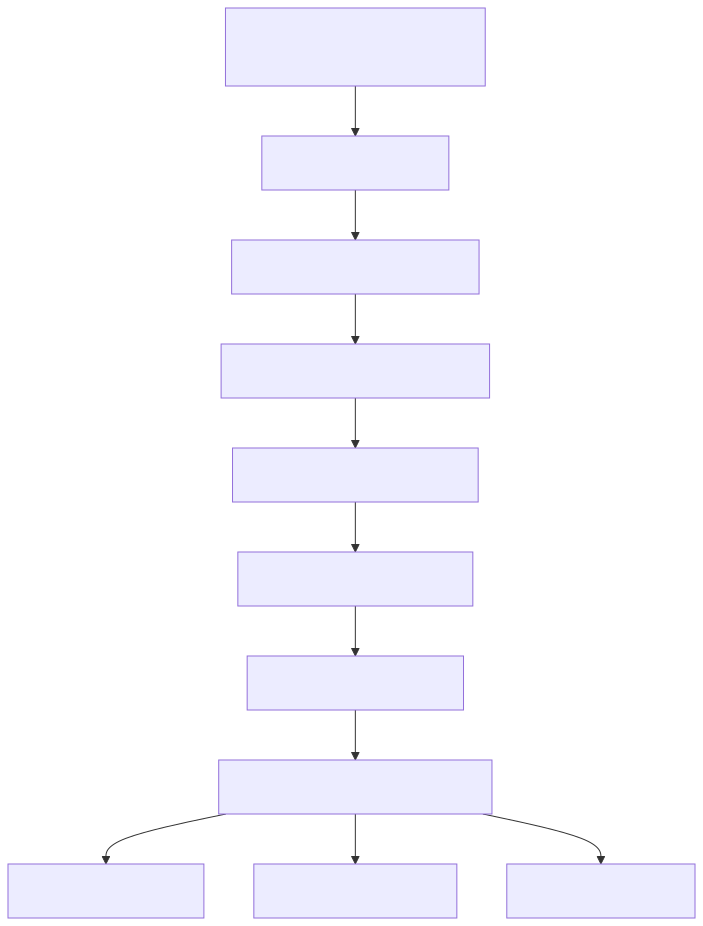

# Manual técnico e operacional: DeepAgent Supervisor completo

## 1. Escopo técnico deste manual

Este manual documenta o funcionamento técnico real do DeepAgent Supervisor no código atual. O foco aqui é o ciclo YAML para AST, parser, validator, resolução do supervisor ativo, bootstrap do runtime, toolset, filesystem, shell, todo_list, memória durável (Redis ou Postgres), skills declaradas no YAML (`skills_library`), interpreter, HIL, aprovação assíncrona, subagentes, background execution, contratos HTTP de continuação e observabilidade.

O objetivo não é listar arquivos. O objetivo é explicar como a feature realmente funciona, quais recursos avançados ela expõe, quais restrições o contrato impõe e por que esse desenho é especialmente adequado para agentes que executam processos duráveis em background.

## 2. Onde o DeepAgent entra na arquitetura

O DeepAgent Supervisor entra na arquitetura em seis pontos conectados.

1. O YAML declara execution.type igual a deepagent dentro de multi_agents.
2. O assembly agentic detecta o alvo DeepAgent.
3. O parser converte o supervisor para DeepAgentSupervisorAST.
4. O validator semântico verifica coerência entre middlewares, permissions, HIL, checkpointer, memory e subagentes.
5. O resolver de configuração produz um ActiveSupervisorContext com o supervisor selecionado.
6. O runtime DeepAgentSupervisor monta a factory governada, middlewares, store, backend, checkpointer, tools e subagentes, e então executa o agente.

O seletor `selected_entrypoint` é obrigatório, precisa ser não vazio e deve apontar para exatamente
um supervisor DeepAgent habilitado. O alvo do assembly é `deepagent_supervisor`; seletores legados
ou a tentativa de escolher implicitamente o primeiro item falham fechado.

Em paralelo, o mesmo supervisor também pode ser chamado pelo runtime canônico de background execution, pelo node `deepagent_call` do Workflowagent, e a continuação HIL pode ocorrer por /agent/continue, por /agent/hil/decisions ou pelo próprio fluxo do workflow quando a delegação partiu de `deepagent_call`.

## 3. Ciclo YAML para runtime



Esse diagrama mostra a ideia central: o DeepAgent não nasce diretamente do YAML cru. Ele passa por contrato tipado, validação semântica e resolução de contexto antes de virar runtime executável.

## 4. Contrato declarativo especializado

O contrato AST especializado do DeepAgent expõe recursos que o WorkflowAgent não carrega da mesma forma, porque resolve outro tipo de problema.

## 4.1. Middlewares governados

O bloco middlewares contém a fonte de verdade dos toggles principais.

- filesystem
- filesystem_file_search
- shell
- memory
- subagents
- background_execution_subagent
- human_in_the_loop
- summarization
- pii
- todo_list
- skills
- interpreter

Defaults confirmados no AST:

- filesystem.enabled = true
- filesystem_file_search.enabled = true
- shell.enabled = false
- memory.enabled = true
- subagents.enabled = true
- background_execution_subagent.enabled = false
- human_in_the_loop.enabled = false
- summarization.enabled = false
- pii.enabled = true
- todo_list.enabled = true
- skills.enabled = false
- interpreter.enabled = true

Os built-ins seguem a propriedade do middleware que os fornece:

- `todo_list.enabled=false` remove `write_todos` da lista enviada ao modelo;
- `filesystem_file_search.enabled=false` remove `glob` e `grep`;
- `filesystem.enabled=false` remove `ls`, `read_file`, `write_file`, `edit_file`, `glob`, `grep` e o `execute` fornecido pelo filesystem;
- `subagents.enabled=false` remove `task`;
- `interpreter.enabled=false` impede a criação do `CodeInterpreterMiddleware` e da tool configurada por `interpreter.tool_name`.

O `FilesystemMiddleware` do DeepAgents já fornece `glob` e `grep`. Por isso, `filesystem_file_search` governa essas tools no stack existente em vez de montar um segundo `FilesystemFileSearchMiddleware`, que duplicaria nomes de tools. O built-in `execute` só fica visível quando o backend efetivo suporta execução; o toggle não transforma um backend sem sandbox em backend executável.

## 4.2. Features top-level do supervisor

O supervisor DeepAgent também aceita explicitamente:

- memory com caminhos absolutos
- backend persistente top-level
- context_schema
- skills
- response_format
- ag_ui.ui_specs
- interrupt_on
- permissions
- agents especializados
- async_subagents

### 4.2.1. ag_ui.ui_specs

O contrato `ag_ui.ui_specs` agora faz parte da AST oficial do supervisor DeepAgent.

Na prática, isso significa o seguinte.

1. O YAML pode declarar uma lista governada de receitas visuais em `multi_agents[].ag_ui.ui_specs`.
2. Cada item precisa ter `id` estável e `spec` em formato `UISpec` válido.
3. O validator semântico falha fechado quando a spec estiver insegura, malformada ou quando alguém tentar usar o caminho legado `multi_agents[].ui_specs` fora do bloco `ag_ui`.

O caminho está ligado de ponta a ponta. O assembly parseia e valida a declaração;
`AgUiYamlUiSpecRegistry` publica a descoberta governada; services e adapters resolvem a spec pelo
contexto ativo; e o runtime AG-UI materializa o resultado no evento canônico `STATE_SNAPSHOT`.
Esse catálogo não se confunde com `ag_ui.generative`: `ui_specs` seleciona uma `UISpec` fixa e
governada, enquanto `generative` governa a superfície A2UI. Id inexistente, spec insegura ou YAML
ambíguo falha fechado.

## 4.3. Campos removidos ou não suportados

O parser e o runtime rejeitam ou marcam como erro campos que não pertencem mais ao contrato efetivo.

- planner
- capabilities
- deepagent_memory legado

Isso é importante porque a plataforma tenta evitar drift entre YAML antigo e runtime atual.

## 5. Parser e validação semântica

## 5.1. Parser

O DeepAgentParser filtra apenas supervisores cujo execution.type seja deepagent. Para cada item válido, ele:

- aplica id padrão se necessário;
- normaliza enabled para true por default;
- força execution.type para deepagent;
- coleta diagnósticos de contrato obsoleto;
- parseia tools_library com o ToolDefinitionsParser;
- converte para DeepAgentSupervisorAST.

## 5.2. Regras semânticas mais importantes

O DeepAgentSemanticValidator impõe coerência operacional, não apenas forma.

Regras confirmadas:

- middlewares.filesystem.enabled=true exige permissions explícitas no mesmo escopo;
- permissions só podem existir com filesystem habilitado;
- ag_ui.ui_specs só é aceito no caminho canônico `multi_agents[].ag_ui.ui_specs`;
- cada `ag_ui.ui_specs[].spec` passa pelo validator de `UISpec` antes da execução;
- interrupt_on só pode existir quando HIL está habilitado;
- HIL habilitado exige interrupt_on;
- HIL habilitado exige memory.checkpointer.enabled=true no YAML;
- middlewares.skills.enabled exige skills top-level;
- skills top-level sem middlewares.skills.enabled são rejeitadas;
- middlewares.memory.enabled exige memory top-level com ao menos um caminho absoluto;
- memory top-level só é aceito quando middlewares.memory.enabled=true;
- backend.enabled=true aceita apenas type state, store ou postgres;
- backend.type=store exige backend.redis.url;
- backend.type=postgres exige o bloco postgres com dsn_env ou dsn; redis e postgres no mesmo backend são conflito e falham explícito;
- backend.scope aceita apenas user, agent ou org;
- scope org exige user_session.tenant_id;
- backend.policy aceita apenas read_only ou read_write;
- async_subagents exigem name, description e graph_id válidos;
- headers em async_subagents exigem URL explícita;
- permissions aceitam apenas operações read e write;
- permissions aceitam apenas mode allow ou deny;
- response_format precisa conter chaves válidas de JSON Schema.

Conclusão técnica: o runtime não aceita “quase configurado”. A feature é desenhada para falhar cedo quando a governança declarativa está incoerente.

## 6. Bootstrap do DeepAgentSupervisor

O DeepAgentSupervisor.initialize segue um fluxo rígido.

1. Carrega a configuração ativa.
2. Inicializa ToolsFactory e MemoryFactory compartilhadas.
3. Resolve a factory governada do runtime DeepAgent.
4. Compõe a pilha extra de middlewares do produto.
5. Constrói backend e store persistente do DeepAgent quando backend top-level está habilitado;
   havendo skills selecionadas, materializa o catálogo de cada proprietário a partir da
   `skills_library` do YAML: supervisor em `/skills/supervisor-<id>/main/` e subagente em
   `/skills/supervisor-<id>/subagent-<id>/` (§7.10.1). A instrução compartilhada da release entra
   pelo prompt composto, não por `/memories/agents.md`.
6. Resolve o checkpointer.
7. Cria o agente final.

Se qualquer uma dessas etapas falha com erro estrutural, o supervisor retorna erro de inicialização em vez de continuar degradado.

## 7. Superfície completa de recursos avançados

## 7.1. Toolset efetivo

O método _collect_tools percorre todos os agentes do contexto, resolve as tools de cada um via _resolve_agent_tools e deduplica por nome. Na prática, o supervisor principal recebe um conjunto único de ferramentas, evitando repetição entre subagentes.

Isso importa porque:

- reduz ambiguidade para o modelo;
- evita exposição duplicada da mesma tool;
- mantém o supervisor principal alinhado ao contrato real do YAML.

## 7.2. Prompt por agente com placeholders obrigatórios

Cada subagente recebe system_prompt próprio. Se o template não trouxer placeholders mínimos de descrição e ferramentas disponíveis, o runtime injeta essas seções. Isso reduz risco de subagentes nascerem com prompt incompleto ou opaco.

## 7.3. Middleware de todo_list

O middleware TodoListMiddleware é ligado por default. Ele pode receber system_prompt e tool_description específicos. O efeito prático é permitir que o agente mantenha uma lista de tarefas operacionais durante execuções complexas.

## 7.4. Middleware de PII

Quando pii.enabled=true, o runtime monta PIIMiddleware a partir de regras declarativas. Se não houver regras explícitas, o supervisor ainda normaliza um conjunto default para email, credit_card, ip, mac_address e url.

Estratégias aceitas:

- block
- redact
- mask
- hash

## 7.5. Middleware de skills

Se middlewares.skills.enabled=true, o runtime exige a lista `skills` top-level e injeta
SkillsMiddleware com backend e a source própria do catálogo funcional do supervisor. O mesmo
padrão vale para subagentes que definem skills próprias. O **conteúdo** de cada skill vem da
`skills_library` do YAML da release (não mais de banco). Source própria não significa ACL nem
filesystem separado; ver §7.10.1.

## 7.6. Filesystem governado

O FilesystemMiddleware é injetado quando filesystem.enabled=true. Nesse momento, o runtime também exige permissions válidas e ativa _PermissionMiddleware mais tarde.

Contrato de permissions:

- operations: apenas read e write;
- paths: caminhos absolutos e sem ..;
- mode: allow ou deny.

Efeito prático: o agente pode operar sobre arquivos, mas somente no que foi declarado.

## 7.7. Shell persistente governado

O ShellToolMiddleware é criado quando shell.enabled=true. A política de execução pode ser:

- host
- docker
- codex_sandbox

Parâmetros suportados no contrato:

- workspace_root
- startup_commands
- shutdown_commands
- tool_name
- env
- execution_policy.command_timeout
- execution_policy.startup_timeout
- execution_policy.termination_timeout
- execution_policy.max_output_lines
- execution_policy.max_output_bytes
- execution_policy.cpu_time_seconds
- execution_policy.memory_bytes
- execution_policy.create_process_group
- execution_policy.binary
- execution_policy.image
- execution_policy.remove_container_on_exit
- execution_policy.network_enabled
- execution_policy.extra_run_args
- execution_policy.cpus
- execution_policy.read_only_rootfs
- execution_policy.user
- execution_policy.platform
- execution_policy.config_overrides

Isso transforma o shell em ferramenta governada, não em escape hatch livre.

Guardrail operacional confirmado no runtime atual:

- shell.enabled=true não pode ser combinado com human_in_the_loop.enabled=true no mesmo supervisor;
- quando essa combinação aparece, o runtime falha fechado com ValueError antes de montar os middlewares;
- shell.enabled=true não pode usar execution_policy.type=host em ambiente multi-tenant (a plataforma é multi-tenant por natureza): o validador semântico reprova com o código `DEEPAGENT_SHELL_HOST_MULTITENANT_PROIBIDO`, permitindo apenas `docker` ou `codex_sandbox` (execução isolada). Como o default de execution_policy é `host`, shell habilitado sem `execution_policy.type` explícito também é reprovado.

## 7.8. Summarization e compactação de contexto

Quando summarization.enabled=true, o runtime injeta SummarizationMiddleware ou create_summarization_middleware, dependendo do contrato disponível no runtime carregado.

Parâmetros observados:

- trigger
- keep
- summary_prompt
- trim_tokens_to_summarize
- truncate_args_settings

Essa etapa é especialmente útil para execuções longas, porque ajuda a comprimir contexto sem perder histórico essencial.

### 7.8.1. O que é "compactação de contexto" (nível 101)

Uma conversa DeepAgent longa acumula muitas mensagens no estado do LangGraph. Quanto maior esse histórico, mais caro e lento fica cada turno, porque o modelo precisa reler tudo. **Compactar o contexto** é resumir o histórico antigo em um bloco curto e manter só as mensagens recentes intactas — reduzindo custo e latência **sem perder o fio da conversa**.

A plataforma usa o mecanismo **oficial do ecossistema LangChain/deepagents** para isso, não uma solução caseira. São duas formas complementares:

- **Automática (`SummarizationMiddleware`):** dispara sozinha durante a execução quando o histórico cruza o `trigger` (ex.: número de mensagens ou tokens), mantendo as últimas `keep` mensagens.
- **Sob demanda (`SummarizationToolMiddleware`):** expõe a tool `compact_conversation`, que o agente (ou a plataforma) chama explicitamente para compactar naquele momento.

### 7.8.2. Como a tool `compact_conversation` altera o estado (importante)

Ponto que evita mal-entendido ao ler o código: a tool `compact_conversation` **não reescreve nem apaga a lista de mensagens** do estado. Ela faz duas coisas:

1. **Acrescenta** uma `ToolMessage` de confirmação ao final das mensagens.
2. Grava no estado um evento `_summarization_event` com o resumo gerado (`summary_message`) e um índice de corte **absoluto** (`cutoff_index`).

O resumo é aplicado **de forma virtual** na hora de chamar o modelo: a conversa efetiva vista pelo LLM passa a ser `[resumo] + mensagens[cutoff_index:]`. As mensagens originais continuam no estado; o que muda é o recorte que o modelo enxerga. Por isso a compactação é reversível em termos de auditoria (o histórico bruto persiste) e barata (não há reescrita destrutiva da lista).

### 7.8.3. Compactação programática diária (rotina de manutenção)

Além da compactação automática/sob demanda dentro de um turno, a plataforma roda uma **compactação programática diária** das conversas DeepAgent persistidas, para manter o custo sob controle mesmo em conversas que ficam paradas entre turnos.

- **Quem executa:** o método `DeepAgentSupervisor.compact_conversation(thread_id)`, acionado pelo job de manutenção `chat-conversation-compaction`.
- **Como executa:** monta um agente isolado que expõe **apenas** a tool `compact_conversation`, resolve o YAML original da conversa pelo `config_ref`, e opera o checkpoint **somente pelas APIs públicas do LangGraph** (`get_state`, `invoke`, `update_state`, `RemoveMessage`) — nunca manipulando tabelas de checkpoint diretamente. As mensagens internas usadas para disparar a tool são removidas do estado ao final, deixando a conversa limpa.
- **Escopo por atividade:** só entram conversas com atividade recente (janela default de 2 dias). Conversa parada há mais tempo não tem conteúdo novo a compactar e é ignorada, o que limita o trabalho por rodada.
- **Agendamento e cadência:** ver **[Scheduler §7.3.2](README-TECNICO-AGENDAMENTO-AGENTIC-BACKGROUND-HIL.md)** (cron `0 6 * * *` = 03:00 BRT). O ciclo de vida completo das conversas está em **[Gestão e ciclo de vida das conversas](README-TECNICO-GESTAO-CONVERSAS-CHAT.md)**.

## 7.9. Memory top-level e memória de prompt

Quando middlewares.memory.enabled=true, o supervisor exige `memory` top-level com caminhos absolutos e repassa essa lista ao parâmetro `memory` da factory oficial `create_deep_agent`. Isso representa memória operacional carregada no runtime. O contrato governado não usa mais `middlewares.memory.sources` no YAML.

## 7.10. backend top-level (Redis ou Postgres durável)

O bloco `backend` aciona persistência durável do store do DeepAgent. Ele decide **onde** ficam os arquivos virtuais que os middlewares nativos leem/gravam — `/memories/` (memória) e `/skills/` (skills). Há dois backends duráveis: `store` (Redis) e `postgres` (Postgres, via `PostgresStore` do LangGraph).

Contrato confirmado:

- enabled
- type = state | store | postgres
- scope = user | agent | org
- policy = read_only | read_write
- **quando type=store (Redis):** redis.url obrigatório; redis.key_prefix opcional com default `deepagent_store`; redis.ttl_seconds opcional > 0.
- **quando type=postgres:** bloco `postgres` obrigatório com `postgres.dsn_env` (nome da variável de ambiente com o DSN) **ou** `postgres.dsn` (DSN inline); `postgres.namespace_prefix` opcional. **Sem TTL** — Postgres é durável, não expira.
- `redis` e `postgres` no mesmo `backend` é conflito e falha explícito no validador.

Detalhes relevantes do store:

- usa BaseStore do LangGraph (Redis: `DeepAgentRedisStore`; Postgres: `PostgresStore` via provider canônico `get_shared_postgres_store`, cacheado por `ENVIRONMENT+DSN`);
- aplica retry externo central em operações de I/O;
- bloqueia escrita quando policy=read_only;
- organiza namespace por user, agent ou org;
- **segregação por ambiente:** no Redis o `ENVIRONMENT` vem do `key_prefix`; no Postgres **não** há camada de key_prefix, então o `ENVIRONMENT` e o tenant são embutidos no **namespace** do store (segregação obrigatória, nunca cross-tenant).

### 7.10.1. Fonte das skills (YAML-First) e materialização no store

O backend durável (Redis ou Postgres) decide **onde** ficam os arquivos virtuais `/skills/` e
`/memories/`. A **fonte do conteúdo** das skills é o YAML da release — não mais o banco.

- **skills** → declaradas na `skills_library` no nível raiz do YAML da release e publicadas pelo
  `DocumentCompiler` tanto para Workflow quanto para DeepAgent (ver contrato em
  `docs/tecnico/README-AST-AGENTIC-DESIGNER.md` §8.5.4). Cada agente/supervisor seleciona skills por
  nome (`skills: [...]` + `middlewares.skills.enabled=true`). O runtime materializa somente a
  seleção daquele proprietário: `/skills/supervisor-<id>/main/<skill>/SKILL.md` para o supervisor e
  `/skills/supervisor-<id>/subagent-<id>/<skill>/SKILL.md` para cada subagente. O `SKILL.md` é
  composto com frontmatter `name`/`description` e corpo `content`; `files` opcionais ficam sob o
  mesmo diretório da skill como **material de apoio legível**. Execução de scripts está fora de
  escopo; não há tool de execução nem sandbox para skills.
- **Sources e compartilhamento:** cada `SkillsMiddleware` recebe somente a source do próprio
  catálogo. A source delimita descoberta e reconciliação funcional; **não é ACL nem isolamento de
  filesystem**. Todos os catálogos da família continuam no mesmo backend, namespace e rota virtual
  `/skills/`. A rota remove apenas o prefixo global `/skills/`; os segmentos de família e
  proprietário permanecem nas keys internas do store.
- **Materialização idempotente + reconciliação:** a versão de cada skill é o `sha256` do bundle
  (`name`+`description`+`content`+`files`); o store só é reescrito quando o conteúdo muda. Skills que
  saíram da seleção daquele proprietário são **removidas somente da source correspondente**. Sources
  irmãs e memórias genéricas (`/memories/user.md`) do mesmo namespace são preservadas.
- **Instrução compartilhada da release:** vive na chave `agent-instructions-md` do YAML e é injetada
  por **um único canal — o prompt composto** (`compose_agent_system_prompt`). **Não há mais**
  materialização de `/memories/agents.md`: o modelo antigo de dupla injeção (prompt composto + memória
  agents.md a partir da coluna `agent_instructions_md`) foi removido.
- **Memória genérica preservada:** o `MemoryMiddleware` nativo continua roteando `/memories/` (ex.:
  `/memories/user.md`) quando `middlewares.memory.enabled=true` + `memory` top-level declaram um path.
- **Sem schema de domínio para skills/instrução:** o runtime não lê `agent_skills` nem
  `agent_instructions_md`; a introspecção read-only de 2026-07-28 confirmou que a tabela e a coluna
  antigas já foram removidas fisicamente. O único schema persistente usado pelas skills é o store
  do framework LangGraph, não uma tabela de skills da aplicação.

### 7.10.2. Exemplo completo (Postgres + skills YAML-First + interpreter)

Recorte de um documento com a `skills_library` no nível raiz, um supervisor DeepAgent com backend
Postgres durável, seleção de skills por nome e interpreter (default-on) explicitado. A instrução
compartilhada da release fica em `agent-instructions-md` no raiz e é injetada pelo prompt composto:

```yaml
agent-instructions-md: |
  Você é o supervisor de vendas. Priorize dados do período solicitado.

skills_library:
  - name: analise-de-vendas
    description: Analisa vendas por período com foco em variação e sazonalidade.
    content: |
      # Análise de vendas
      Passos: (1) delimitar o período; (2) comparar com o anterior; (3) destacar desvios.
  - name: relatorio-financeiro
    description: Consolida resultado financeiro executivo.
    content: |
      # Relatório financeiro
      Estruture receita, custo e margem, com o principal achado no topo.
    files:
      modelo.md: |
        ## Modelo de saída
        - Receita | Custo | Margem

multi_agents:
  supervisor:
    middlewares:
      skills:
        enabled: true            # habilita o SkillsMiddleware nativo
      interpreter:
        enabled: true            # default-on; use enabled: false para DESLIGAR
        tool_name: eval
        timeout: 5.0
        memory_limit: 67108864
    backend:
      enabled: true
      type: postgres             # store durável em Postgres (não Redis)
      scope: org                 # namespace do store por tenant (segregação obrigatória)
      policy: read_only          # curadoria da plataforma; agente não reescreve
      postgres:
        dsn_env: DATABASE_PROMETEU_GENERIC_RAG_DSN
        namespace_prefix: deepagent_store   # opcional
    skills:
      - analise-de-vendas        # nomes existentes na skills_library (fail-closed se não existir)
      - relatorio-financeiro
```

Notas do exemplo:

- considerando o `id` do supervisor como `<id>`, as skills selecionadas são materializadas em
  `/skills/supervisor-<id>/main/analise-de-vendas/SKILL.md` e
  `/skills/supervisor-<id>/main/relatorio-financeiro/SKILL.md`; o `modelo.md` da segunda fica sob o
  mesmo diretório (material de apoio legível, sem execução).
- um nome em `skills:` que não exista na `skills_library` **reprova na validação de assembly**
  (fail-closed, código `DEEPAGENT_SKILL_NAO_DECLARADA_NA_LIBRARY`) — nunca vira no-op silencioso.
- `agent-instructions-md` no raiz é injetada **uma única vez** pelo prompt composto — não existe mais
  materialização em `/memories/agents.md`.
- `scope: org` exige `user_session.tenant_id` resolvido no boundary; ausência **falha explícito** (fail-closed).
- para desligar o interpreter, basta `middlewares.interpreter.enabled: false` — o default global permanece ligado.

## 7.11. Structured output

Se o runtime create_deep_agent aceitar response_format, o supervisor injeta o JSON Schema top-level do supervisor. O mesmo vale para subagentes que definem response_format local.

## 7.12. HIL e interrupt_on

O DeepAgent suporta interrupt_on em nível de supervisor e subagente. As decisões aceitas são:

- approve
- edit
- reject
- respond

Quando human_in_the_loop.enabled=true, o runtime injeta HumanInTheLoopMiddleware. Se interrupt_on não estiver configurado, isso falha cedo.

### 7.12.1. interrupt_on em tools parametrizadas (nome resolvido vs. nome de referência)

O validador semântico confere cada chave de `interrupt_on` contra o catálogo efetivo de tools do escopo (`tools` do agente/supervisor, `tools_library` e MCP local). Para famílias de tools **parametrizadas** (ex.: `dyn_sql<q>`), existe uma diferença deliberada entre duas formas:

- a **forma de referência**, declarada em `agent.tools` (ex.: `dyn_sql<q>`);
- o **nome resolvido em runtime**, o único que o HIL realmente enxerga quando a tool dispara (ex.: `dyn_sql_q`).

Sem tratamento, um `interrupt_on` correto (com o nome resolvido) seria reprovado por só existir a forma de referência no conjunto de tools declaradas. Por isso o validador expande o conjunto disponível com o nome resolvido de cada tool parametrizada antes de checar `interrupt_on` — reusando `ToolsSemanticValidator.resolve_parametrized_tool_name` como fonte única das famílias parametrizadas, sem duplicar essa lógica no validador do DeepAgent. Efeito prático: `interrupt_on: {dyn_sql_q: {...}}` é aceito mesmo quando o YAML só declara `dyn_sql<q>` em `tools`.

Quando shell.enabled=true no mesmo supervisor, isso também falha cedo. O produto trata shell persistente com HIL no mesmo escopo como combinação não suportada e não tenta degradar silenciosamente.

## 7.13. Async approval

O contrato de async approval é validado por HilAsyncApprovalContract.

Campos confirmados:

- enabled
- ttl_seconds
- expiration_policy = expire | fail_run
- require_approver_match
- channels
- approvers

Canais aceitos:

- whatsapp
- email

Regras confirmadas:

- canal habilitado exige template_id;
- enabled=true exige ao menos um canal habilitado;
- approvers precisam de user_email ou user_code;
- require_approver_match controla validação de identidade do aprovador.

## 7.14. Subagentes síncronos

Cada item em agents do contexto vira um subagente com:

- name
- description
- system_prompt
- tools
- middleware de limites e retry
- model opcional
- skills opcionais
- response_format opcional
- interrupt_on opcional
- permissions opcionais

Depois, no runtime governado, esses subagentes ainda podem receber filesystem, shell, PII, summarization, skills, tool exclusion e permission middleware herdados da política principal.

## 7.15. Async subagents

O DeepAgent também suporta async_subagents no supervisor. Eles são validados e convertidos em especificações contendo name, description, graph_id e, quando configurado, URL, headers e demais parâmetros do contrato externo.

Na montagem final, esses itens entram por AsyncSubAgentMiddleware.

## 7.16. Background execution subagent automático

Quando middlewares.background_execution_subagent.enabled=true, o supervisor cria um subagente automático chamado background_execution.

No slice atual, a descrição textual e o system prompt desse subagente não ficam soltos no supervisor. Eles são governados por constantes canônicas do módulo de background execution tools, o que reduz drift entre o catálogo de tools e a intenção operacional do subagente.

Esse subagente usa exatamente estas tools governadas:

- schedule_background_execution_request
- list_scheduled_background_requests
- cancel_scheduled_background_request
- reschedule_background_execution_request
- get_last_background_execution_result
- get_background_execution_result
- list_recent_background_executions
- list_running_background_agents

Ele só é permitido quando middlewares.subagents.enabled=true.

Isso é um dos pontos mais fortes do desenho para ERP: o próprio agente passa a saber orquestrar sua fila de trabalho em segundo plano.

## 8. Pilha de middlewares do runtime

O schema service expõe a distinção entre middlewares oficiais do DeepAgent e middlewares da plataforma.

Middlewares oficiais confirmados:

- ToolCallLimitMiddleware
- ModelCallLimitMiddleware
- LLMToolSelectorMiddleware
- ToolRetryMiddleware
- ModelRetryMiddleware
- ContextEditingMiddleware
- ClearToolUsesEdit
- FilesystemMiddleware
- FilesystemFileSearchMiddleware
- ShellToolMiddleware
- MemoryMiddleware
- SubAgentMiddleware
- AsyncSubAgentMiddleware
- HumanInTheLoopMiddleware
- SummarizationMiddleware
- PIIMiddleware
- TodoListMiddleware
- CodeInterpreterMiddleware
- SkillsMiddleware
- PatchToolCallsMiddleware

Middlewares de plataforma confirmados:

- ModelCallLoggingMiddleware
- ToolLoggingMiddleware
- ResponsePostProcessingMiddleware
- ErrorHandlingMiddleware
- InterpreterExecutionLoggingMiddleware (só quando `interpreter.enabled=true`)

A observabilidade de chamada/retorno de tool usa o hook oficial que o runtime LangChain realmente invoca (`wrap_tool_call`/`awrap_tool_call`), emitido pelo `ToolLoggingMiddleware`. Ele registra os eventos canônicos `deepagent_supervisor.tool.start/.end/.error` (com `correlation_id`, duração e SHAPE — contagem e nomes dos argumentos, tipo/tamanho do retorno, nunca o conteúdo) e alimenta a telemetria de uso. Esse mesmo middleware roda tanto no runtime top-level do supervisor quanto por subagente.

O `InterpreterExecutionLoggingMiddleware` usa o mesmo hook (`wrap_tool_call`/`awrap_tool_call`) e observa **só** a tool cujo nome é igual a `interpreter.tool_name` (default `eval`); qualquer outra tool passa direto, sem overhead. Ele existe porque a lib `langchain_quickjs` **não levanta exceção** em timeout/estouro de memória/erro de JS — ela codifica o desfecho dentro do próprio conteúdo da `ToolMessage` (`<error type="Timeout">`, `<error type="OutOfMemory">`, `<error type="...">`). Sem esse observador, a falha do interpreter é invisível no log oficial (a tool "deu certo" do ponto de vista do `ToolLoggingMiddleware` genérico). Ver detalhes dos eventos em §9.4.

Na prática, isso significa que o runtime combina disciplina de execução do framework com telemetria, auditoria e pós-processamento específicos do produto.

## 9. Cache, limites e robustez operacional

## 9.1. Cache do supervisor

O _create_agent usa cache por:

- supervisor_id
- hash do YAML
- SUPERVISOR_CACHE_VERSION

Se houver hit válido, o agente é reutilizado. Se a versão ou o hash mudam, o cache é invalidado e o agente é recriado.

## 9.2. Limites e retry

O supervisor monta middlewares de limite e retry tanto para o runtime principal quanto para subagentes.

Itens confirmados:

- ToolCallLimitMiddleware
- ModelCallLimitMiddleware
- ToolRetryMiddleware
- ModelRetryMiddleware

## 9.3. Prompt caching

Se disponível no runtime carregado, o supervisor injeta AnthropicPromptCachingMiddleware com unsupported_model_behavior=ignore.

## 9.4. Observabilidade do ciclo de vida

O supervisor registra eventos de lifecycle como:

- runtime.init
- runtime.initialize.start
- runtime.initialize.success
- runtime.run.start
- runtime.run.error

E ainda registra telemetria de tool, resposta pós-processada, middleware error, resume e known_subagents via DeepAgentRuntimeTelemetry.

### 9.4.1. Eventos canônicos de backend, skills, memory e interpreter

Além do lifecycle geral, os componentes durável (backend Postgres/Redis), a materialização de skills (fonte YAML) e o interpreter emitem eventos próprios, todos via `build_supervisor_log_context` (builder oficial do slice) e com `correlation_id` resolvido **em tempo de chamada** (nunca congelado no objeto cacheado — `_resolve_active_correlation_id`/`get_graph_correlation_id`). Nenhum desses eventos substitui o `logging` nativo da lib; eles complementam, tornando por `correlation_id` o que antes só existia no log genérico do Python.

| event_name | Quando dispara | Campos-chave (shape, nunca conteúdo) |
| --- | --- | --- |
| `deepagent_supervisor.backend_store.configured` | Ao montar o backend do supervisor (Redis ou Postgres) | `store_type`, `store_scope`, `store_policy`, `store_key_prefix` (Redis) ou `store_namespace_prefix`/`store_dsn_source` (Postgres) |
| `deepagent_supervisor.skills.materialized` | Ao final da materialização dos catálogos por proprietário sob `/skills/` (só quando há backend e skills configuradas) | `skills_source` (`yaml.skills-library`), `skills_total`, `skills_materialized`, `skills_unchanged`, `skills_failed`, `skills_removed`, `skill_names`, `skill_names_removed`, `skill_sources` (source virtual → nomes selecionados) |
| `deepagent_supervisor.skills.load_failed` | Por skill malformada (frontmatter inválido, `name` != diretório, ou caminho de `files` inseguro) — a skill/arquivo é pulado, não derruba o agente | `skill_name`, `skill_failure_reason` (`invalid_skill_md`, `name_directory_mismatch`, `not_in_skills_library`, `unsafe_file_path`) |
| `deepagent_supervisor.interpreter.executed` | Execução do `eval` (QuickJS) terminou sem erro/timeout/OOM | `interpreter_outcome=success`, `interpreter_code_chars`, `interpreter_result_chars`, `duration_ms` |
| `deepagent_supervisor.interpreter.timeout` | Execução estourou `interpreter.timeout` | `interpreter_outcome=timeout`, `interpreter_error_type=Timeout` |
| `deepagent_supervisor.interpreter.oom` | Execução estourou `interpreter.memory_limit` | `interpreter_outcome=oom`, `interpreter_error_type=OutOfMemory` |
| `deepagent_supervisor.interpreter.error` | Erro de JS dentro do código (`ReferenceError`, etc.) ou exceção de infraestrutura na própria tool | `interpreter_outcome=error`, `interpreter_error_type` classificado |

Disciplina de dado sensível: nenhum desses eventos loga o código executado, o conteúdo do SKILL.md ou a mensagem de erro do JS — apenas contagem, nomes de skill, tamanho em bytes/chars e a decisão tomada.

## 10. Entrada, execução e continuação

## 10.1. Execução síncrona e assíncrona HTTP

O boundary HTTP oficial fica em /agent/execute. A descrição do endpoint já documenta que o backend decide entre execução direta e assíncrona e que mode=deepagent força o supervisor DeepAgents.

O contrato também já documenta:

- thread_id para continuidade;
- hil para pausa Human in the Loop;
- envelope assíncrono com task_id, polling_url, stream_url e cancel_url.

## 10.2. Continuação HIL

O endpoint /agent/continue reaproveita correlation_id e exige o mesmo thread_id da pausa anterior. Internamente ele executa um comando de continuação tipado, não uma reinicialização improvisada.

Quando o DeepAgent é chamado de dentro do Workflowagent por `deepagent_call`, a retomada segue outra borda canônica, mas com a mesma lógica central: o workflow pausa com `interrupt(...)`, recebe a decisão humana ao retomar a thread do próprio workflow e converte essa decisão para `Command(resume=...)` do DeepAgent, mantendo exatamente o mesmo `thread_id` do supervisor pausado. Se o DeepAgent sinalizar `requires_human=true` sem payload `hil` resumível, o node falha fechado em vez de continuar com estado ambíguo.

## 10.3. Decisão HIL assíncrona por POST seguro

O endpoint /agent/hil/decisions recebe token, decisão e contexto resolvido, valida status, expiração e aprovador, resolve o pedido e executa a continuação. O design explicitamente evita GET para não permitir aprovação acidental por scanner de link.

## 11. Runtime canônico de background

O AgenticBackgroundExecutionRuntime suporta explicitamente target_type deepagent.

Fluxo confirmado:

1. Obtém BackgroundExecutionRunContext do repositório.
2. Reconstrói YAML a partir de yaml_snapshot obrigatório.
3. Injeta correlation_id, user_email, user_code e tenant_id no YAML.
4. Reidrata security_keys quando o snapshot veio redigido.
5. Resolve thread_id e persiste esse vínculo no repositório.
6. Instancia DeepAgentSupervisor.
7. Inicializa e executa run(requested_command, thread_id=thread_id).
8. Normaliza o resultado.
9. Se o resultado estiver waiting_hil, pode disparar o fluxo durável de aprovação assíncrona.

Detalhes críticos:

- yaml_snapshot ausente é erro; não há fallback implícito;
- HIL em background, tanto para DeepAgent quanto para WorkflowAgent, é representado por dois jobs:
  a execução inicial termina com o pedido de aprovação e a decisão humana publica uma continuação
  distinta, com nova correlação;
- o Job Core não cria um estado intermediário `waiting_hil`: o pedido e a decisão ficam no contrato
  de aprovação, e cada job preserva seu próprio ciclo terminal auditável;
- no DeepAgent, o approval dispatcher retoma o mesmo `thread_id`; no WorkflowAgent, a continuação
  retoma a thread do workflow e preserva a ponte tipada para `deepagent_call` quando aplicável.

## 12. Por que isso é muito forte para processos background de ERP

Do ponto de vista técnico, a combinação abaixo é rara e poderosa.

- thread_id durável
- correlation_id propagado
- checkpointer obrigatório quando HIL existe
- store durável em Redis ou Postgres, onde as skills selecionadas da `skills_library` são materializadas
- possibilidade de async approval
- subagente automático de background execution
- structured output
- filesystem e shell governados
- memória por escopo
- toolset do tenant

Isso permite montar agentes que trabalham ao longo do tempo, suportam revisão humana parcial, mantêm rastreabilidade e continuam do ponto certo sem reiniciar a investigação inteira.

## 13. Casos de uso ERP complexos explicados tecnicamente

Os cenários abaixo são exemplos reais de uso corporativo possíveis com esse runtime, desde que o tenant publique tools de domínio adequadas no catálogo.

### 13.1. Fechamento financeiro com exceções e aprovação posterior

Recursos usados:

- background_execution_subagent para agendar e acompanhar o job;
- subagentes de análise financeira e compliance;
- todo_list para etapas do fechamento;
- response_format para saída tabular de exceções;
- HIL assíncrono para aprovar decisões fora do horário.

Por que o runtime aguenta isso: ele suporta processo longo, pausa formal, structured output e continuação no mesmo thread_id.

### 13.2. Auditoria de compras recorrente com memória organizacional

Recursos usados:

- backend.scope=org para manter histórico por tenant;
- PII middleware para sanitizar dados sensíveis;
- async_subagents para delegar a fluxos externos de análise;
- schedule_background_execution_request para rodar periodicamente.

Por que o runtime aguenta isso: ele preserva contexto entre execuções e consegue agir como camada durável de vigilância operacional.

### 13.3. Reconciliação de estoque e evidências em arquivos

Recursos usados:

- filesystem com permissions allow/deny;
- shell governado para automação operacional controlada;
- subagentes especialistas de logística, fiscal e supply;
- HIL para decisões críticas;
- structured output para encaminhar divergências.

Por que o runtime aguenta isso: ele combina operação sobre arquivos, delegação multiagente, memória e continuidade segura.

## 14. Erros e falhas confirmadas no código

Principais falhas que o runtime trata explicitamente:

- create_deep_agent ausente ou runtime DeepAgent incompleto gera ImportError;
- skills top-level sem suporte da factory gera erro explícito;
- response_format sem suporte da factory gera erro explícito;
- interrupt_on sem suporte da factory gera erro explícito;
- permissions sem suporte da factory gera erro explícito;
- filesystem, memory, skills, subagents ou summarization sem backend gera ValueError;
- backend.type inválido gera ValueError;
- backend.redis.url ausente quando type=store gera ValueError;
- scope org sem tenant_id gera ValueError;
- background_execution_subagent ligado com subagents desligado gera ValueError;
- HIL habilitado sem interrupt_on gera ValueError;
- async_approval.enabled sem HIL gera ValueError;
- permissions ausentes quando filesystem está habilitado geram ValueError;
- backend.type=postgres sem bloco postgres, ou sem dsn/dsn_env, gera erro de validação (DEEPAGENT_POSTGRES_INVALIDO/DEEPAGENT_POSTGRES_DSN_AUSENTE);
- backend.redis e backend.postgres juntos no mesmo backend gera erro de validação (DEEPAGENT_BACKEND_REDIS_POSTGRES_CONFLITO);
- shell.enabled=true com execution_policy.type=host (explícito ou por default) gera erro de validação (DEEPAGENT_SHELL_HOST_MULTITENANT_PROIBIDO);
- nome citado em `skills:` sem correspondente na `skills_library` do documento reprova na validação de assembly (`DEEPAGENT_SKILL_NAO_DECLARADA_NA_LIBRARY`), fail-closed, antes do runtime — nunca vira no-op silencioso.

Em resumo: o DeepAgent do projeto favorece falha fechada para configuração inconsistente.

## 15. Troubleshooting

### 15.1. O supervisor não sobe

Causa provável: runtime DeepAgent incompleto, create_deep_agent ausente ou middleware obrigatório não encontrado.

Onde investigar:

- logs de initialize
- _resolve_deep_agent_factory
- lista de middlewares obrigatórios importados

### 15.2. Filesystem não funciona

Causa provável: permissions ausentes, filesystem desligado ou paths inválidos.

Onde investigar:

- middlewares.filesystem.enabled
- permissions do supervisor ou subagente
- _normalize_permissions_config

### 15.3. HIL assíncrono não dispara

Causa provável: async_approval mal configurado, canal sem template_id, HIL desligado ou approver inválido.

Onde investigar:

- middlewares.human_in_the_loop.async_approval
- HilAsyncApprovalContract
- repositório de agent_hil_approval_requests

### 15.4. Memória Redis não persiste

Causa provável: backend diferente de redis, URL inválida, mismatch com REDIS_PROMETEU_GENERIC_RAG_URL ou policy read_only bloqueando escrita.

Onde investigar:

- backend
- DeepAgentRedisStore
- logs de deepagent store configurado

### 15.4.1. Skills não aparecem no agente

Causa provável: skill não declarada na `skills_library` do YAML (a seleção reprova fail-closed no assembly); `backend` ausente (sem store para materializar `/skills/`); `dsn_env`/`dsn` não resolve; skill malformada (frontmatter inválido ou `name` diferente do diretório); caminho de `files` inseguro (pulado); `scope: org` sem `user_session.tenant_id` (fail-closed).

Onde investigar:

- eventos `deepagent_supervisor.skills.materialized` (campos `skills_source`, `skill_sources`,
  contadores e nomes) / `.skills.load_failed` (§9.4.1)
- diagnóstico de assembly `DEEPAGENT_SKILL_NAO_DECLARADA_NA_LIBRARY` (nome selecionado sem entrada na `skills_library`)
- `backend.postgres.dsn_env` e a variável de ambiente correspondente (store onde as skills são materializadas)

### 15.4.2. Interpreter (eval) falha ou trava sem aparecer no log

Causa provável: código excedeu `interpreter.timeout` ou `interpreter.memory_limit`; erro de JS dentro do código executado.

Onde investigar:

- logs `deepagent_supervisor.interpreter.timeout` / `.oom` / `.error` (§9.4.1) — a lib QuickJS não levanta exceção nesses casos, então só esses eventos canônicos tornam a falha visível
- `interpreter.timeout` / `interpreter.memory_limit` no YAML do supervisor

### 15.5. Job background não continua após aprovação

Causa provável: pedido HIL não foi resolvido corretamente, token inválido, aprovador incorreto ou problema na continuação.

Onde investigar:

- /agent/hil/decisions
- HilApprovalDecisionService
- AgentHilApprovalRequestsRepository
- thread_id e correlation_id persistidos no pedido HIL

## 16. Explicação 101

Tecnicamente, o DeepAgent Supervisor é um coordenador de trabalho agentic com mais ferramentas e mais disciplina. Ele não só conversa: ele monta equipe de subagentes, usa uma lista de tarefas, lembra contexto, sabe operar em background, pausa quando precisa de humano e continua depois.

O que o torna forte não é “ter muita feature”. O que o torna forte é que essas features foram conectadas por contrato, validação e runtime governado.

## 17. Evidências no código

- Runtime principal do DeepAgent
  - Motivo da leitura: confirmar montagem governada e ciclo de execução do DeepAgent.
  - Símbolos relevantes: initialize, run, _create_agent, _build_subagents_spec, _build_background_execution_subagent_spec, _build_deepagent_store_backend, _compose_deepagents_extra_middleware, _collect_tools.
  - Comportamento confirmado: cache por YAML hash, toolset deduplicado, filesystem, shell, memory, HIL, todo_list, PII, skills, summarization, background subagent e telemetria.

- src/config/agentic_assembly/ast/deepagent.py
  - Motivo da leitura: contrato AST oficial do DeepAgent.
  - Símbolos relevantes: DeepAgentMiddlewaresAST, DeepAgentFilesystemPermissionAST, DeepAgentAsyncApprovalAST, DeepAgentSupervisorAST.
  - Comportamento confirmado: lista oficial de middlewares e campos especializados.

- src/config/agentic_assembly/parsers/deepagent_parser.py
  - Motivo da leitura: parser dedicado do modo deepagent.
  - Símbolo relevante: DeepAgentParser.parse.
  - Comportamento confirmado: filtragem por execution.type, defaults, parse de tools_library e rejeição de campos antigos.

- src/config/agentic_assembly/validators/deepagent_semantic_validator.py
  - Motivo da leitura: coerência operacional do contrato.
  - Símbolos relevantes: validações de permissions, HIL, skills, memory, backend (`_validate_backend_config`), guarda de shell host (`_validate_shell_execution_policy`) e resolução de nome de tool parametrizada em interrupt_on (`_augment_with_resolved_parametrized_names`).
  - Comportamento confirmado: fail-fast para configurações incoerentes; `backend.type=postgres` exige `dsn`/`dsn_env` e é incompatível com `redis`; `shell.enabled=true` reprova `execution_policy.type=host` em qualquer cenário (inclusive default implícito); `interrupt_on` aceita o nome de runtime resolvido de tools parametrizadas, não só a forma de referência declarada em `tools`.

- src/config/agentic_assembly/schema_service.py
  - Motivo da leitura: catálogo de middlewares e recursos publicados do DeepAgent.
  - Símbolo relevante: deepagent_middlewares, deepagent_official_middlewares, deepagent_platform_middlewares.
  - Comportamento confirmado: distinção entre middlewares do runtime e middlewares do produto.

- src/agentic_layer/background_execution/runtime.py
  - Motivo da leitura: execução canônica de deepagent em segundo plano.
  - Símbolos relevantes: execute_run,_execute_deepagent,_build_execution_yaml.
  - Comportamento confirmado: snapshot obrigatório, reidratação de security_keys, thread_id durável e HIL background.

- src/agentic_layer/tools/system_tools/background_execution.py
  - Motivo da leitura: ferramenta canônica de background execution.
  - Símbolos relevantes: BACKGROUND_EXECUTION_TOOL_IDS, create_background_execution_tools.
  - Comportamento confirmado: tools para agendar, listar, cancelar, reagendar e consultar execuções background.

- src/api/routers/agent_router.py
  - Motivo da leitura: contratos HTTP oficiais.
  - Símbolos relevantes: /agent/execute, /agent/continue, /agent/hil/decisions.
  - Comportamento confirmado: execução DeepAgent por mode, continuação por thread_id e resolução segura de aprovação HIL.

- src/agentic_layer/supervisor/hil_async_approval_contract.py
  - Motivo da leitura: contrato de aprovação HIL assíncrona.
  - Símbolo relevante: HilAsyncApprovalContract.normalize.
  - Comportamento confirmado: canais permitidos, TTL, política de expiração, aprovadores e validações.

- src/agentic_layer/supervisor/deepagent_redis_store.py
  - Motivo da leitura: persistência durável de memória do DeepAgent.
  - Símbolo relevante: DeepAgentRedisStore.
  - Comportamento confirmado: BaseStore em Redis com retry, TTL, escopo e policy de escrita.

- src/core/store/postgres_store_provider.py
  - Motivo da leitura: provider compartilhável de `PostgresStore` reusado pelo backend `postgres` do DeepAgent e pela memória RAG.
  - Símbolos relevantes: get_shared_postgres_store, encode_namespace_label.
  - Comportamento confirmado: cache de 1 `PostgresStore` por `DSN+ENVIRONMENT`, `store.setup()` (DDL de framework do LangGraph) executado 1×/processo sob lock, sem cliente Postgres novo por consumidor.

- Fonte das skills (YAML-First, sem tabela de domínio): a regra compartilhada vive em
  `src/agentic_layer/skills/skills_store_materializer.py::SkillsStoreMaterializer`. Ela compõe e
  revalida `SKILL.md`, sanitiza `files`, calcula `skill_version` por SHA-256, evita regravação
  idêntica e remove artefatos fantasmas. O DeepAgent resolve a seleção em
  `deep_agent_supervisor.py::_collect_selected_skills_by_source` e delega a materialização a esse
  componente; o WorkflowAgent usa a mesma implementação por node, com a source default `/skills/`
  dentro do namespace exclusivo do node. O índice canônico da
  `skills_library` fica em `src/agentic_layer/skills/skills_library_index.py`. O modelo antigo
  `agent_skills` foi removido do código e, conforme introspecção read-only de 2026-07-28, também
  não existe mais fisicamente no banco principal.

- src/security/user_yaml_repository.py
  - Motivo da leitura: confirmar que o repositório remanescente governa conta, membership e billing,
    sem voltar a resolver configuração executável por `tenant_user_yaml`.
  - Símbolo relevante: `UserYamlRepository`.
  - Comportamento confirmado: o runtime de configuração não lê `agent_instructions_md`; conforme
    introspecção read-only de 2026-07-28, essa coluna já não existe fisicamente. A instrução
    compartilhada vem apenas de `agent-instructions-md` no YAML resolvido, via prompt composto.

- src/agentic_layer/supervisor/agent_middlewares.py
  - Motivo da leitura: middlewares de observabilidade do produto que rodam dentro do grafo do DeepAgent.
  - Símbolos relevantes: InterpreterExecutionLoggingMiddleware, ModelCallLoggingMiddleware, ToolLoggingMiddleware, `_resolve_active_correlation_id`.
  - Comportamento confirmado: `InterpreterExecutionLoggingMiddleware` usa `wrap_tool_call`/`awrap_tool_call` para classificar o desfecho do `eval` (sucesso/timeout/OOM/erro) a partir do conteúdo da `ToolMessage` (a lib QuickJS não levanta exceção nesses casos); correlação sempre resolvida em tempo de chamada, nunca congelada no middleware cacheado.

## 18. Exemplo completo: consumindo o DeepAgent pela API (JavaScript)

O DeepAgent é acionado pelo mesmo boundary HTTP de todo agente da plataforma: `POST /agent/execute`, com `mode: "deepagent"` para fixar o runtime (ver §10.1 e `src/api/routers/agent_router.py:134-204`). O exemplo abaixo é end-to-end: executa, trata uma pausa HIL (se o supervisor tiver `interrupt_on`) e retoma via `POST /agent/continue`.

```javascript
const BASE_URL = "https://SEU-HOST/agent";

async function executarDeepAgent(task, encryptedData) {
  const resposta = await fetch(`${BASE_URL}/execute`, {
    method: "POST",
    headers: {
      "Content-Type": "application/json",
      "Authorization": `Bearer ${SEU_TOKEN}`,
    },
    body: JSON.stringify({
      task,
      user_email: "analista@empresa.com",
      mode: "deepagent",          // fixa o runtime DeepAgent (único valor aceito no contrato público)
      execution_mode: "direct_sync",
      format: "text",
      encrypted_data: encryptedData, // payload cifrado (YAML + chaves) — ver docs de segurança/security_keys
    }),
  });

  const corpo = await resposta.json();
  // X-Correlation-Id também vem no header da resposta (força máxima em erro).
  console.log("correlation_id:", corpo.correlation_id);

  if (corpo.hil?.pending) {
    // Supervisor pausou em interrupt_on aguardando decisão humana (§7.12).
    console.log("Pausado para revisão:", corpo.hil.action_requests);
    return { pausado: true, resposta: corpo };
  }

  console.log("Resposta final:", corpo.response);
  return { pausado: false, resposta: corpo };
}

async function continuarDeepAgent(corpoAnterior, decisoes) {
  // decisoes: lista de { type: "approve" | "edit" | "reject" | "respond", edited_action? }
  // na MESMA ordem dos action_requests recebidos na pausa.
  const resposta = await fetch(`${BASE_URL}/continue`, {
    method: "POST",
    headers: {
      "Content-Type": "application/json",
      "Authorization": `Bearer ${SEU_TOKEN}`,
    },
    body: JSON.stringify({
      user_email: "analista@empresa.com",
      mode: "deepagent",
      correlation_id: corpoAnterior.correlation_id, // reaproveita o MESMO correlation_id
      thread_id: corpoAnterior.thread_id,           // exige o MESMO thread_id da pausa
      resume: { decisions: decisoes },
    }),
  });

  const corpo = await resposta.json();
  console.log("Resposta após retomada:", corpo.response);
  return corpo;
}

// Uso:
const { pausado, resposta } = await executarDeepAgent("Quanto é 241 * 17?", meuPayloadCifrado);
if (pausado) {
  await continuarDeepAgent(resposta, [{ type: "approve" }]);
}
```

Pontos que evitam erro comum:

- `mode` só aceita `"deepagent"` no contrato público; `"agent"` é legado e o boundary rejeita explicitamente (`agent_router.py:192-204`).
- `correlation_id` e `thread_id` da resposta de `/execute` são obrigatórios em `/continue` — sem eles a retomada não sabe qual pausa resolver (`src/api/schemas/agent_hil_models.py:98-125`, classe `AgentContinueRequest`).
- `resume.decisions` precisa ter a mesma quantidade e ordem dos `action_requests` recebidos em `hil.action_requests`; `type: "edit"` exige `edited_action`.
- Se a execução não pausar (`hil` vazio/ausente), `corpo.response` já é a resposta final — não há necessidade de chamar `/continue`.

## 19. FAQ técnica

Perguntas reais de quem vai configurar ou operar um supervisor DeepAgent pela primeira vez, com resposta direta e nível 101.

**1. O que é o DeepAgent Supervisor, em uma frase?**
É um modo de execução próprio (`execution.type: deepagent`), com AST, validação semântica e runtime dedicados, que monta um agente sobre o pacote oficial `deepagents` (LangChain/LangGraph) com middlewares governados por YAML — não é um supervisor genérico com nome diferente.

**2. Como eu ligo ou desligo um middleware específico?**
Pelo bloco `middlewares.<nome>.enabled` no supervisor (ex.: `middlewares.skills.enabled: true`). Cada middleware tem um default próprio (ver a tabela em §4.1); a chave só precisa aparecer no YAML quando você quer um valor diferente do default.

**3. Liguei `middlewares.skills.enabled: true` mas nada aconteceu. Por quê?**
Faltou a lista `skills` top-level (ex.: `skills: ["minha-skill"]`) **e** um `backend` que resolva `/skills/` (Redis ou Postgres). O toggle sozinho não basta — o validador semântico exige os dois juntos (§5.2) e, sem backend, não há de onde ler o conteúdo.

**4. Onde ficam declaradas as skills?**
Na `skills_library` do nível raiz do YAML da release (cada skill = `name` + `description` +
`content` + `files?`), não mais em banco. O runtime materializa separadamente a seleção do
supervisor em `/skills/supervisor-<id>/main/<skill>/SKILL.md` e a de cada subagente em
`/skills/supervisor-<id>/subagent-<id>/<skill>/SKILL.md`. Cada `SkillsMiddleware` recebe a source do
seu proprietário (§7.10.1).

**5. E se eu não configurar nenhum `backend`?**
Skills e memory continuam declaráveis no YAML, mas sem backend não há `/skills/` nem `/memories/` para rotear — o runtime levanta erro explícito em vez de degradar silenciosamente (§14).

**6. Qual a diferença prática entre `backend.type: store` e `backend.type: postgres`?**
`store` é Redis, com `ttl_seconds` opcional (pode expirar). `postgres` é durável (sem TTL) e mantém as skills materializadas e a memória persistente indefinidamente. Os dois usam o mesmo `CompositeBackend`/roteamento; só muda o `BaseStore` por baixo (§7.10). Em ambos, o **conteúdo** das skills vem da `skills_library` do YAML — o store só guarda o que foi materializado.

**7. Preciso rodar alguma migração de banco para usar skills com `backend.type: postgres`?**
Não para as skills: o conteúdo vem do YAML e o store Postgres usa apenas o schema de framework do LangGraph (`PostgresStore.setup()`), criado 1×/processo. Não há tabela de skills a migrar — o modelo por banco (`agent_skills`) foi removido do runtime.

**8. Como a instrução compartilhada da release chega até o agente?**
Pela chave `agent-instructions-md` no nível raiz do YAML da release. Ela é injetada por um **único canal — o prompt composto** (`compose_agent_system_prompt`), que a concatena ao system prompt do supervisor. Não há mais materialização em `/memories/agents.md` nem leitura da coluna `agent_instructions_md`: o modelo antigo de dupla injeção foi removido.

**9. Editei a instrução e ela não mudou. Onde eu altero?**
No `agent-instructions-md` do YAML da release (a fonte é o YAML versionado e hash-bound, não um cadastro de banco). Como o canal é único (prompt composto), a instrução aparece exatamente uma vez — sem cópia paralela em memória para dessincronizar.

**10. O interpreter (tool `eval`) vem sempre ligado?**
Sim, `interpreter.enabled=true` é o default do contrato (diferente da lib oficial, que é opt-in). Para desligar, declare `middlewares.interpreter.enabled: false` no supervisor.

**11. O interpreter roda Python?**
Não. É QuickJS (JavaScript/TypeScript) in-process, sem filesystem, rede ou shell por padrão — a opção mais segura para um processo compartilhado entre tenants. Não há pandas/numpy nem qualquer pacote Python disponível.

**12. Como eu descubro se uma skill falhou ao carregar?**
Pelo log canônico `deepagent_supervisor.skills.load_failed` (campos `skill_name` + `skill_failure_reason`), buscando pelo `correlation_id` da montagem. Uma skill malformada é pulada — não derruba o agente, mas também não aparece magicamente (§9.4.1).

**13. Como eu confirmo que a instrução compartilhada foi injetada numa execução?**
Ela entra no system prompt composto (`compose_agent_system_prompt`), uma única vez. O contrato é protegido por teste de não-duplicação (o prompt contém a instrução exatamente uma vez); não há mais o evento `memory.injected` nem o campo `memory_scope`, removidos junto com a materialização de agents.md.

**14. Por que `shell.execution_policy.type: host` é bloqueado?**
Porque a plataforma é multi-tenant por natureza: `host` executaria comandos no processo compartilhado entre tenants, criando superfície de execução cruzada. O validador reprova com `DEEPAGENT_SHELL_HOST_MULTITENANT_PROIBIDO` e sugere `docker` ou `codex_sandbox`, que isolam a execução (§7.7).

**15. Posso usar HIL (`human_in_the_loop`) junto com shell persistente?**
Não. O contrato trata essa combinação como incoerente e falha cedo antes de montar os middlewares — o produto não tenta arbitrar entre os dois no meio da execução (§7.7, §7.12).

**16. Quais decisões o `interrupt_on` aceita?**
`approve`, `edit`, `reject` e `respond`. `edit` exige um `edited_action` explícito na retomada; as demais não.

**17. Configurei `interrupt_on` para uma tool parametrizada (ex.: `dyn_sql<q>`) e o validador reprovou o nome. O que fiz errado?**
Provavelmente nada — declare o nome **resolvido em runtime** (`dyn_sql_q`), não a forma de referência do YAML (`dyn_sql<q>`). O validador expande automaticamente o catálogo disponível com o nome resolvido de tools parametrizadas antes de checar `interrupt_on` (§7.12.1), então ambas as formas funcionam, mas o nome que efetivamente dispara o HIL em runtime é o resolvido.

**18. Como chamo o DeepAgent pela API sem passar por HIL?**
Se o supervisor não tiver `interrupt_on`/`human_in_the_loop` habilitado, `POST /agent/execute` já devolve a resposta final em `response`, sem `hil` no corpo. Ver exemplo completo em JavaScript em §18.

**19. O que acontece se eu ligar `filesystem` mas esquecer `permissions`?**
O runtime falha explícito na inicialização (`ValueError`) — filesystem habilitado sem permissions explícitas não é um estado aceito, mesmo que a intenção fosse "liberar tudo" (§14).

**20. Dá para trocar `backend.type: postgres` por `backend.type: store` (Redis) sem mexer em código?**
Sim. É só troca de bloco YAML — o restante do contrato (`scope`, `policy`, roteamento `/memories/`/`/skills/`) é o mesmo `CompositeBackend`; só muda o `BaseStore` por baixo. É inclusive o caminho de rollback recomendado se o backend Postgres precisar ser desligado rapidamente (§7.10).

## 20. Alinhamento com as fontes oficiais em 2026-08-07

As fontes oficiais consultadas foram [Deep Agents overview](https://docs.langchain.com/oss/python/deepagents/overview),
[subagents](https://docs.langchain.com/oss/python/deepagents/subagents),
[skills](https://docs.langchain.com/oss/python/deepagents/skills),
[memory](https://docs.langchain.com/oss/python/deepagents/memory),
[LangGraph interrupts](https://docs.langchain.com/oss/python/langgraph/interrupts),
[LangGraph persistence](https://docs.langchain.com/oss/python/langgraph/persistence), o
[repositório oficial Deep Agents](https://github.com/langchain-ai/deepagents) e a distribuição
[ag-ui-langgraph](https://pypi.org/project/ag-ui-langgraph/).

Essas referências orientam o desenho; não substituem a prova do runtime local descrita nas seções
anteriores. A comparação confirma quatro escolhas:

1. Deep Agents é um harness sobre LangGraph, com subagentes para isolar contexto em vez de acumular
   toda a investigação no agente principal.
2. Skills usam divulgação progressiva: nome e descrição chegam primeiro, e o corpo é aberto pelo
   agente somente quando necessário.
3. HIL durável exige checkpointer, o mesmo `thread_id` e retomada explícita; como o node reinicia do
   começo após um `interrupt()`, efeitos anteriores à pausa precisam ser idempotentes.
4. Memória de longo prazo é apoiada por filesystem/store durável. Neste produto, YAML/AST,
   isolamento multi-tenant, Job Core e permissões adicionam governança local sobre esse padrão.
