# Manual tecnico e operacional: dyn_api

## 1. O que e esta feature

dyn_api e a family parametrizada do catalogo builtin que materializa operacoes HTTP aprovadas como tools executaveis por agentes e workflows. O comportamento real observado no codigo e este:

- a family base dyn_api e registrada manualmente no catalogo builtin;
- a referencia parametrizada usa endpoint_id como chave operacional;
- a factory tenta resolver primeiro o endpoint em tools_config.api_dynamic.endpoints;
- se o endpoint nao existir localmente, o runtime tenta resolver a operacao em registro governado por tenant.

Em termos práticos, dyn_api funciona como um tradutor entre um contrato declarativo de operacao HTTP e uma tool concreta que o runtime consegue carregar, validar e executar.

## 2. Que problema ela resolve

Tecnicamente, a feature evita espalhar clientes HTTP ad hoc para operacoes simples e recorrentes. Em vez de cada integracao virar codigo dedicado, dyn_api concentra:

- definicao de parametros de path, query e body;
- interpolacao de placeholders;
- resolucao de autenticacao;
- timeout e retry HTTP;
- fallback governado para catalogo persistido.

O ganho pratico e que o runtime trata operacoes HTTP homologadas como capacidade configuravel e nao como excecao arquitetural.

## 3. Conceitos necessarios para entender

### Family parametrizada builtin

O builder do catalogo adiciona dyn_api manualmente como factory base. Isso acontece porque dyn_api nao representa uma tool unica. Ela e uma family que precisa de um identificador para ser materializada.

### endpoint_id

O loader do supervisor mapeia dyn_api para o parametro endpoint_id. Esse detalhe e importante porque a string parametrizada do agente precisa virar o payload correto para a factory.

### api_dynamic.endpoints

Este e o bloco local onde o YAML pode definir operacoes HTTP dinamicas diretamente. Quando um endpoint esta aqui, o runtime nao precisa consultar o registro persistido.

### api_dynamic.authentications

Este bloco local concentra perfis de autenticacao que podem ser reutilizados por endpoints locais. Quando o registro persistido materializa auth profile associado, ele e mesclado para dentro desta mesma estrutura.

### Registro governado por tenant

Quando o YAML nao traz o endpoint, o runtime consulta o catalogo persistido do tenant. O resolvedor nao aceita qualquer operacao. Ele exige filtros de seguranca e compatibilidade antes de devolver o contrato para a factory.

## 4. Arquitetura interna

O comportamento tecnico observado se organiza em cinco camadas logicas.

### 4.1 Catalogo builtin e parsing da referencia

O catalogo builtin sabe que dyn_api existe como family parametrizada. Em seguida, o loader transforma a referencia parametrizada em payload de factory e injeta endpoint_id no nome esperado.

### 4.2 Resolucao do contrato

A factory procura o endpoint no YAML local. Se ele nao estiver la, ela chama o DynamicToolRegistryResolver para carregar operacao e autenticacao governadas do tenant e mesclar tudo em tools_config.api_dynamic.

### 4.3 Montagem do schema dinamico

Com o contrato resolvido, a factory monta schema Pydantic para os parametros aceitos. O codigo lido mostra subestruturas separadas para path, query e body. O objetivo e falhar cedo quando o agente mandar dado fora do contrato.

### 4.4 Resolucao da autenticacao

Se o endpoint declara autenticacao, a factory resolve o auth config e usa o AuthenticationManager. Quando o auth type exige token dinamico, o manager consulta cache Redis, resolve placeholders em credenciais e executa a autenticacao usando o cliente HTTP.

### 4.5 Execucao HTTP resiliente

O HttpClient encapsula a chamada usando httpx e tenacity, com retry para falhas de conexao e timeout. A factory resolve URL final, query params, body e headers antes de disparar a chamada.

## 5. Fluxo principal de ponta a ponta

O diagrama mostra a ordem real da decisao mais importante: dyn_api primeiro tenta configuracao local e so depois sobe para o registro governado. Isso importa porque explica por que o YAML continua sendo a primeira fonte de verdade operacional do runtime.

## 6. Divisao em etapas ou submodulos

### 6.1 Registro da family parametrizada

O builder do catalogo garante que dyn_api exista mesmo nao sendo uma tool concreta fixa. Sem essa etapa, o assembly e a validacao semantica nao saberiam que a family e conhecida.

### 6.2 Traducao da referencia parametrizada

O tool loader identifica a referencia dyn_api e a converte para endpoint_id. Essa traducao parece pequena, mas e contratual: se o nome do parametro estiver errado, a factory nao encontra o endpoint.

### 6.3 Resolucao local ou governada

Esta e a etapa de governanca principal. A factory tenta endpoint local. Quando falha, o resolvedor exige tenant_id e valida se a operacao existe, esta ativa, foi publicada para agentes e usa protocol_type compativel. Se houver auth_profile_id, o mesmo fluxo valida o perfil de autenticacao associado.

### 6.4 Montagem do schema de entrada

Aqui a tool deixa de ser uma chamada HTTP vaga e vira contrato executavel. O schema dinamico define o que e valido em path, query e body. Isso protege o runtime de payload arbitrario e melhora a qualidade do uso pelo agente.

### 6.5 Autenticacao

Quando a operacao exige autenticacao, o AuthenticationManager resolve o token ou o cabecalho apropriado. No fluxo dinamico, o cache Redis e parte da capacidade. Isso nao e opcional no codigo lido: se Redis nao puder ser configurado, a obtencao de token falha.

### 6.6 Chamada HTTP

O HttpClient executa a chamada e reaproveita a politica central desta family para conexao e timeout. O objetivo desta etapa e encapsular resiliencia e isolamento de infraestrutura.

## 7. Contratos, entradas e saidas

### 7.1 Referencia agentic

A surface publica para agents usa a family parametrizada dyn_api com endpoint_id especifico. O loader mapeia essa family para o parametro endpoint_id.

### 7.2 Contrato local

No YAML local, o runtime procura dados em tools_config.api_dynamic.endpoints e tools_config.api_dynamic.authentications. O endpoint pode descrever metodo HTTP, URL base, path template, schemas de path, query e body, templates de cabecalho, timeout e referencia de autenticacao.

### 7.3 Contrato governado persistido

No registro persistido, a operacao HTTP observada no codigo possui campos relevantes como:

- operation_code;
- protocol_type;
- http_method;
- base_url;
- path_template;
- auth_profile_id;
- path_params_schema_json;
- query_params_schema_json;
- header_template_json;
- body_template_json;
- response_mapping_json;
- timeout_seconds;
- publish_to_agents.

No banco, essa operacao vive na tabela integrations.api_operation_registry. Esse e o ativo central do dyn_api por registro. Em termos praticos, e essa tabela que o resolvedor consulta quando o endpoint nao esta no YAML local.

Dois pontos sao especialmente importantes nessa tabela.

1. swagger_source_id e swagger_operation_id preservam o vinculo com a origem OpenAPI quando a operacao veio de importacao.
2. publish_to_agents separa cadastro administrativo de capability realmente exposta ao runtime agentic.

O perfil de autenticacao governado observado possui campos como:

- auth_profile_code;
- auth_type;
- auth_method;
- auth_url;
- auth_headers_json;
- auth_body_json;
- token_key;
- token_prefix;
- secret_ref;
- credentials_json_encrypted;
- cache_ttl_seconds.

Esse contrato vive na tabela integrations.api_auth_profile_registry. Ela existe para evitar que cada operacao replique segredo, token e estrategia de autenticacao.

Quando a operacao veio de importacao OpenAPI, a origem do documento fica em integrations.api_swagger_source_registry, que guarda swagger_code, source_type, source_uri ou source_file_name, document_hash, openapi_version e raw_document_json. Isso e importante para auditoria, reimportacao e rastreabilidade.

### 7.4 Boundaries administrativos confirmados

O codigo lido confirma dois boundaries principais para governanca administrativa.

- /admin/integrations/technical/auth-profiles
  - Lista, cria, atualiza e altera status de perfis de autenticacao governados.
  - Protegido por permissoes tecnicas de leitura, escrita e status.

- /admin/integrations/functional/api-operations
  - Lista, cria, atualiza e altera status de operacoes HTTP governadas.
  - Protegido por permissoes funcionais de leitura, escrita e status.

- /admin/integrations/actions/api-operations/test
  - Executa teste HTTP seguro da operacao governada.
  - Protegido por permissao de execucao de teste.

- /admin/integrations/actions/swagger/import
  - Importa especificacao Swagger para o catalogo governado sem publicar automaticamente para agentes.

- /client-portal/integrations/swagger-import
  - Importa especificacao Swagger remota para o catalogo do tenant no boundary do portal do cliente.
  - Tambem nao publica automaticamente para agentes.

## 8. O que acontece em caso de sucesso

No caminho feliz, o agente referencia dyn_api, o loader injeta endpoint_id, a factory encontra o contrato local ou governado, monta schema dinamico, resolve autenticacao quando necessario e executa a chamada HTTP. O resultado volta para a tool com os dados da resposta da API externa.

Do ponto de vista operacional, sucesso significa que tres camadas passaram juntas:

- governanca do contrato;
- validacao da entrada da tool;
- execucao HTTP com autenticacao coerente.

## 9. O que acontece em caso de erro

### Endpoint nao encontrado

Sintoma: a family e conhecida, mas a materializacao falha.

Causa provavel: endpoint ausente no YAML local e inexistente no catalogo governado.

Reacao do sistema: a factory nao consegue resolver a operacao.

### Tenant ausente no fallback governado

Sintoma: a operacao governada nunca e encontrada, mesmo existindo no catalogo.

Causa provavel: user_session sem tenant_id disponivel no contexto.

Reacao do sistema: o resolvedor falha cedo porque tenant_id e obrigatorio.

### Operacao nao publicada ou inativa

Sintoma: o cadastro existe, mas o runtime continua recusando a exposicao.

Causa provavel: publish_to_agents falso ou is_active falso.

Reacao do sistema: o resolvedor trata o registro como inelegivel para dyn_api.

### Operacao importada via Swagger, mas ainda invisivel ao runtime

Sintoma: a operacao aparece administrativamente, mas dyn_api continua falhando ao materializar.

Causa provavel: importacao bem-sucedida, porem publish_to_agents permaneceu falso, que e exatamente o comportamento padrao da esteira de importacao.

Reacao do sistema: a operacao fica cadastrada e rastreavel, mas nao e exposta ao runtime agentic.

### protocol_type fora de rest_json

Sintoma: operacao cadastrada e ativa, mas nao entra no runtime dyn_api.

Causa provavel: protocolo fora do escopo suportado pela factory governada.

Reacao do sistema: falha fechada antes da execucao.

### Auth profile invalido ou inativo

Sintoma: a operacao e encontrada, mas a autenticacao nao fecha.

Causa provavel: auth_profile_id associado a perfil ausente ou desativado.

Reacao do sistema: o resolvedor nao materializa autenticacao valida.

### Falha no cache de token

Sintoma: autenticacao dinamica quebra antes da chamada do endpoint principal.

Causa provavel: Redis indisponivel ou configuracao de cache impossibilitada.

Reacao do sistema: o AuthenticationManager falha, porque o codigo lido trata Redis como dependencia obrigatoria para cache de token.

### Timeout ou erro de rede

Sintoma: o endpoint e valido, mas a execucao externa falha.

Causa provavel: problema transitório de rede, timeout ou indisponibilidade do provider externo.

Reacao do sistema: o HttpClient tenta retry para a classe de erro suportada e depois propaga a falha.

## 10. Observabilidade e diagnostico

O melhor jeito de investigar dyn_api e separar o problema por camada.

### Camada 1: parsing e materializacao

Confirme se a referencia do agente realmente aponta para dyn_api com endpoint_id correto. Sem isso, a factory nunca entra no contrato esperado.

### Camada 2: resolucao do contrato

Verifique primeiro tools_config.api_dynamic.endpoints. Se a expectativa for fallback governado, confirme tenant_id no contexto e depois valide operacao ativa, publish_to_agents e protocol_type.

### Camada 3: autenticacao

Se houver auth profile, confirme que ele esta ativo e que o tipo de autenticacao e suportado pelo resolvedor. Em falha dinamica, diferencie erro de token de erro do endpoint principal.

### Camada 4: infraestrutura HTTP

Se o contrato parece correto, revise timeout, URL base, path template, placeholders e rede. Aqui a pergunta principal e se a falha esta antes da API externa ou na API externa.

### Camada 5: boundary administrativo

Quando a operacao vem do catalogo persistido, use os endpoints administrativos para listar operacoes, conferir status, revisar auth profiles e disparar teste seguro da operacao. Isso ajuda a isolar erro de cadastro de erro de runtime agentic.

Se a operacao nasceu de OpenAPI, inclua mais uma pergunta no diagnostico: a origem Swagger foi importada corretamente e a operacao resultante foi de fato publicada para agentes? Sem essa checagem, e comum confundir cadastro importado com capability liberada.

## 11. Configuracoes que mudam o comportamento

### publish_to_agents

Controla se uma operacao governada pode virar capacidade agentic. Sem ele, o cadastro existe administrativamente, mas dyn_api nao deve expor a operacao.

### protocol_type

Controla a compatibilidade do cadastro com o resolvedor governado. O codigo lido confirma aceite apenas para rest_json nessa trilha.

### is_active

Controla se operacao e auth profile continuam elegiveis para runtime.

### timeout_seconds

Controla o limite de espera da operacao HTTP.

### auth_type e campos associados

Controlam se a autenticacao sera estatica, por api key, basic, bearer, oauth ou custom_endpoint, conforme o resolvedor do registro persistido.

### cache_ttl_seconds

Influencia o reaproveitamento de token quando a autenticacao dinamica usa cache.

### swagger_source_id e swagger_operation_id

Nao mudam a execucao HTTP diretamente, mas mudam rastreabilidade e manutencao do catalogo. Eles dizem se a operacao veio de importacao OpenAPI e permitem relacionar o registro atual com a fonte de contrato que o originou.

## 12. Troubleshooting

### A tool dyn_api e reconhecida, mas o endpoint nao materializa

Confirme primeiro se o endpoint esta em api_dynamic.endpoints. Se nao estiver, confirme tenant_id e depois valide se o cadastro governado esta ativo, publicado e em protocol_type rest_json.

### O cadastro existe, mas a autenticacao nao entra

Revise auth_profile_id da operacao e confirme se o perfil esta ativo. Depois valide se os campos de auth_type, auth_url, token_key e credenciais protegidas estao coerentes com o tipo de autenticacao configurado.

### O teste administrativo funciona, mas o agente falha

Isso costuma apontar divergencia entre contexto agentic e cadastro. Revise a referencia parametrizada do agente, o endpoint_id efetivo e a presenca do tenant_id no user_session do runtime.

### A autenticacao dinamica falha de forma intermitente

Isole Redis e o endpoint de autenticacao. A chamada principal pode estar correta, mas o problema pode estar no cache de token ou no fluxo de obtencao do token.

### A operacao veio do Swagger, mas nao aparece para agentes

O import Swagger nao publica automaticamente para agentes. Depois da importacao, ainda e necessario validar o cadastro, revisar status e publicar a operacao de forma coerente com a governanca.

Na pratica, o comportamento confirmado e este.

1. a origem vai para integrations.api_swagger_source_registry;
2. as operacoes vao para integrations.api_operation_registry;
3. a importacao e idempotente e pode atualizar registros ja existentes;
4. as operacoes importadas continuam com publish_to_agents=false ate revisao posterior.

## 13. Impacto tecnico

dyn_api reduz proliferacao de clientes HTTP dedicados, concentra resiliência em um cliente unico, fortalece separacao entre contrato HTTP e autenticacao e reforca a governanca multi-tenant por catalogo persistido. O principal ganho tecnico nao e apenas reduzir codigo. E reduzir superficie improvisada.

## 14. Exemplos praticos guiados

### Exemplo 1: consulta de status de pedido em ERP

Cenario: um agente comercial precisa consultar status de pedido numa API interna do ERP.

Entrada: o agente referencia dyn_api para um endpoint de consulta publicado.

Processamento: a factory resolve a operacao, valida o parametro de path do pedido, injeta autenticacao e chama a API.

Saida: a resposta do ERP retorna para o agente sem exigir um conector novo em Python.

Impacto: o time libera uma capacidade de consulta controlada com menor custo de manutencao.

### Exemplo 2: auth profile compartilhado por varias operacoes

Cenario: tres operacoes HTTP do mesmo sistema usam o mesmo fluxo de token.

Processamento: o catalogo governado associa todas ao mesmo auth profile.

Saida: o runtime reaproveita a logica de autenticacao sem duplicar contrato em cada operacao.

Impacto: menor duplicacao administrativa e manutencao mais previsivel.

### Exemplo 3: falha fechada por operacao nao publicada

Cenario: a operacao foi cadastrada, mas publish_to_agents permaneceu desligado.

Processamento: o resolvedor encontra o registro, mas o considera inelegivel.

Saida: a tool nao e publicada para o agente.

Impacto: a plataforma protege o ambiente contra exposicao acidental.

### Exemplo 4: importacao Swagger de API de clientes

Cenario: o time quer acelerar cadastro de uma API de clientes sem preencher manualmente cada operacao.

Entrada: um documento OpenAPI e enviado ao endpoint administrativo de importacao ou ao endpoint do portal do cliente.

Processamento: o servico cria ou atualiza a origem na tabela integrations.api_swagger_source_registry, gera operacoes em integrations.api_operation_registry e preserva o vinculo por swagger_source_id.

Saida: as operacoes ficam catalogadas e rastreaveis, mas ainda nao publicadas para agentes.

Impacto: onboarding mais rapido sem perder o gate de governanca.

### Exemplo 5: e-commerce consultando status de pedido

Cenario: um assistente operacional precisa consultar status, entrega e situacao de pagamento numa API interna de commerce.

Entrada: o agente referencia dyn_api para uma operacao HTTP ja homologada e publicada.

Processamento: o runtime resolve operation_code, autentica com profile compartilhado e chama a operacao REST.

Saida: a resposta volta ao agente como capacidade governada, sem criar um conector Python dedicado para esse endpoint.

Impacto: menor backlog de integracoes pequenas e mais velocidade para operar jornadas digitais.

## 15. Explicacao 101

dyn_api e como uma tomada padronizada para operacoes HTTP aprovadas. Em vez de puxar um fio novo toda vez que um agente precisa falar com um sistema externo, a plataforma usa um encaixe conhecido: contrato da operacao, autenticacao, validacao e chamada HTTP resiliente. Mas a tomada so funciona para o que foi homologado. Isso e o que mantem a seguranca e a governanca.

## 16. Checklist de entendimento

- Entendi como dyn_api vira tool parametrizada do catalogo builtin.
- Entendi a ordem local primeiro e registro governado depois.
- Entendi quais campos do catalogo persistido influenciam a resolucao.
- Entendi o papel separado de operacao HTTP e auth profile.
- Entendi os principais cenarios de falha e como isolar cada um.

## 17. Evidencias no codigo

- src/agentic_layer/tools/domain_tools/dynamic_api_tools/dynamic_api_factory.py
  - Motivo da leitura: confirmar resolucao do endpoint, schema dinamico, interpolacao de placeholders e chamada HTTP.
  - Simbolo relevante: create_dynamic_api_tool.
  - Comportamento confirmado: resolucao local, merge com registro persistido e execucao da chamada.

- src/agentic_layer/tools/domain_tools/dynamic_api_tools/auth_manager.py
  - Motivo da leitura: confirmar cache de token e dependencia de Redis.
  - Simbolo relevante: get_token.
  - Comportamento confirmado: fluxo de autenticacao com cache, TTL e invalidacao.

- src/agentic_layer/tools/domain_tools/dynamic_api_tools/http_client.py
  - Motivo da leitura: confirmar retry e timeout na chamada HTTP.
  - Simbolo relevante: execute.
  - Comportamento confirmado: uso de httpx e tenacity para falhas transitorias suportadas.

- src/agentic_layer/tools/domain_tools/dynamic_tool_registry_resolver.py
  - Motivo da leitura: confirmar filtros de governanca do fallback por tenant.
  - Simbolo relevante: resolve_api_dynamic_section e merge_api_dynamic_section.
  - Comportamento confirmado: tenant obrigatorio, publicacao, status ativo, protocol_type rest_json e carga do auth profile.

- src/agentic_layer/tools/tools_library_builder.py
  - Motivo da leitura: confirmar o registro manual da family parametrizada.
  - Simbolo relevante: _ensure_parametrized_factories_exist.
  - Comportamento confirmado: dyn_api entra no catalogo builtin como factory base.

- src/agentic_layer/supervisor/tool_loader.py
  - Motivo da leitura: confirmar o mapeamento do nome do parametro.
  - Simbolo relevante: resolve_param_key.
  - Comportamento confirmado: dyn_api usa endpoint_id.

- src/api/routers/admin/integrations_router.py
  - Motivo da leitura: confirmar o boundary tecnico de auth profiles.
  - Simbolo relevante: rotas /auth-profiles.
  - Comportamento confirmado: CRUD e status de perfis de autenticacao governados.

- src/api/routers/admin/integrations_functional_router.py
  - Motivo da leitura: confirmar o boundary funcional de operacoes HTTP.
  - Simbolo relevante: rotas /api-operations.
  - Comportamento confirmado: CRUD e status de operacoes HTTP governadas.

- src/api/routers/admin/integrations_actions_router.py
  - Motivo da leitura: confirmar teste seguro e importacao Swagger.
  - Simbolo relevante: /api-operations/test e /swagger/import.
  - Comportamento confirmado: teste controlado e importacao sem publicacao automatica.

- src/integrations/schema.py
  - Motivo da leitura: confirmar as tabelas reais do catalogo dyn_api.
  - Simbolo relevante: api_operation_registry, api_auth_profile_registry e api_swagger_source_registry.
  - Comportamento confirmado: as tres tabelas existem com chaves, checks e relacionamentos dedicados no schema integrations.

- src/integrations/swagger_import_service.py
  - Motivo da leitura: confirmar semantica exata da importacao OpenAPI.
  - Simbolo relevante: SwaggerImportApplicationService.execute.
  - Comportamento confirmado: a importacao e idempotente, cria ou atualiza operacoes e grava publish_to_agents=false para registros importados.

## 18. Lacunas reais encontradas

- Valor padrao completo de todos os campos opcionais do contrato local nao foi consolidado em um unico documento de codigo lido; eles aparecem distribuidos entre factory e schemas administrativos.
- Nao foi confirmada no codigo lido uma documentacao operacional unica, gerada pelo proprio runtime, listando por tenant todas as operacoes dyn_api efetivamente publicadas para agentes.
