# Manual técnico, operacional e de diagnóstico: hash governado do YAML agentic

## 1. O que este manual documenta

Este manual documenta o comportamento técnico real do hash governado no projeto, com foco em quatro perguntas:

- como o hash é calculado;
- como o runtime detecta drift;
- como o helper público funciona;
- como o script operacional deve ser usado sem sair do trilho oficial.

## 2. Fonte de verdade lida no código

O conteúdo abaixo foi confirmado diretamente no código executável e nos clientes reais de UI:

- src/config/agentic_assembly/drift_detector.py;
- src/config/agentic_assembly/assembly_service.py;
- scripts/refresh_agentic_governed_hash.py;
- src/api/routers/config_assembly_router.py;
- app/ui/static/js/admin-assembly-ast.js;
- app/ui/static/js/objective-yaml-studio.js.

## 3. Arquitetura resumida do fluxo

O fluxo técnico pode ser entendido em três camadas.

### 3.1 Camada de cálculo e verificação

O detector de drift sabe:

- quais chaves são governadas por alvo;
- como extrair o fragmento governado do YAML;
- como serializar o payload de forma determinística;
- como calcular o hash SHA-256;
- como comparar o valor atual com o valor armazenado.

### 3.2 Camada de assembly

O AgenticAssemblyService é o trilho oficial que transforma YAML em AST, valida, compila e confirma o artefato final. O helper público não substitui esse trilho. Ele o reaproveita.

### 3.3 Camada de entrada operacional

O problema pode ser resolvido por três entradas:

- interface web AST administrativa;
- Studio de objetivo para YAML;
- CLI refresh_agentic_governed_hash.py.

Todas convergem para o backend oficial.

## 4. Como o hash é calculado de fato

O método fingerprint_fragment monta este payload lógico:

```json
{
  "target": "deepagent_supervisor",
  "fragment": {
    "selected_supervisor": "...",
    "multi_agents": [...],
    "tools_library": []
  }
}
```

Depois disso, o projeto faz:

1. deepcopy do fragmento;
2. json.dumps com ordenação estável de chaves;
3. SHA-256 do texto serializado;
4. gravação do hexdigest no bloco governed_hashes.

Isso importa porque evita que o hash dependa de detalhes acidentais da serialização.

## 5. Quais chaves entram no fragmento governado

Os conjuntos padrão confirmados no detector são:

### Workflow

- selected_workflow;
- workflows_defaults;
- workflows;
- tools_library.

### DeepAgent supervisor

- selected_supervisor;
- multi_agents;
- tools_library.

O detector também consegue reaproveitar governed_keys já armazenadas no metadata, quando esse bloco existe e está bem formado.

## 6. Como o hash é estampado no YAML

O método stamp_yaml grava o selo em:

```yaml
metadata:
  agentic_assembly:
    governed_hashes:
      <target>:
        hash: <sha256>
        algorithm: sha256
        version: 1
        governed_keys:
          - ...
```

Em termos operacionais, isso significa que o YAML final carrega não apenas o valor do hash, mas também o contexto mínimo para explicar o que foi governado.

## 7. Como o runtime detecta deriva

O fluxo de verificação faz estas etapas:

1. resolve o fragmento governado do target;
2. tenta ler o hash armazenado em metadata.agentic_assembly.governed_hashes;
3. se metadata estiver inválida, gera diagnóstico específico de metadata inválida;
4. se o hash estiver ausente, gera diagnóstico de selo canônico obrigatório;
5. recalcula o hash atual;
6. compara o valor atual com o armazenado;
7. se divergir, gera o diagnóstico AGENTIC_AST_GOVERNED_YAML_DRIFT.

## 8. Modos de runtime

O detector suporta dois comportamentos principais de runtime:

- warn;
- enforce.

Em warn, o problema pode ser registrado como aviso.

Em enforce, erros de drift passam a bloquear o fluxo quando a política exige isso.

Isso é importante para operação porque explica por que o mesmo YAML pode aparecer como “aviso” em um ambiente e como “bloqueio” em outro.

## 9. Helper público: o que ele faz exatamente

O helper público é:

```python
refresh_governed_yaml_from_current_yaml(
    *,
    base_yaml: dict[str, Any],
    target: AssemblyTarget,
    apply: bool = False,
    output_path: str | None = None,
    force: bool = True,
    correlation_id: str | None = None,
) -> AssemblyConfirmResponse
```

O comportamento real é este:

1. garante que o target é suportado;
2. faz parse do documento atual em AST oficial por _parse_document_from_yaml(...);
3. converte a AST para ast_payload;
4. chama confirm(...) com:
   - base_yaml como cópia do YAML atual;
   - ast_payload reconstruído;
   - apply conforme solicitado;
   - output_path opcional;
   - force conforme solicitado, por padrão true;
   - correlation_id propagado.

O ponto central do helper é este: ele não recalcula o hash “na mão”. Ele chama o confirm oficial depois de reconstruir a AST do YAML atual.

## 10. Por que isso dá autonomia operacional

Antes do helper, a operação podia cair na tentação errada de:

- editar metadata manualmente;
- escrever um hash externo;
- criar um script local fora do contrato oficial.

Com o helper público, a autonomia existe sem quebrar governança, porque o operador usa o próprio serviço canônico do assembly.

## 11. Script CLI: contrato real

O contrato real do CLI é posicional para o caminho do YAML:

```bash
python scripts/refresh_agentic_governed_hash.py CAMINHO_DO_YAML [--target workflow|deepagent_supervisor] [--write]
```

Isso significa que este é o formato correto para apenas conferir:

```bash
python scripts/refresh_agentic_governed_hash.py app/yaml/rag-config-pdv-vendas-demo.yaml --target deepagent_supervisor
```

E este é o formato correto para conferir e gravar:

```bash
python scripts/refresh_agentic_governed_hash.py app/yaml/rag-config-pdv-vendas-demo.yaml --target deepagent_supervisor --write
```

## 12. O que o CLI faz passo a passo

1. valida os argumentos;
2. resolve o caminho do arquivo;
3. carrega o YAML com yaml.safe_load;
4. garante que a raiz é objeto;
5. instancia AgenticAssemblyService;
6. resolve o target explicitamente ou por inferência;
7. chama refresh_governed_yaml_from_current_yaml(...);
8. emite JSON de sucesso ou falha no stdout.

## 13. Como a inferência de target funciona no script

Se você não informar --target, o script tenta inferir um alvo único chamando infer_present_targets no detector.

Se o YAML indicar exatamente um alvo agentic, o script segue.

Se houver ambiguidade ou ausência de alvo único, ele falha com mensagem clara pedindo:

- workflow; ou
- deepagent_supervisor.

## 14. Saída de sucesso do CLI

Em sucesso, o script imprime JSON com estes campos:

- success;
- target;
- yaml_path;
- write;
- saved_path;
- correlation_id;
- governed_hash.

Isso é útil para automação e para auditoria manual rápida.

## 15. Saída de falha do CLI

Em falha, o script imprime JSON com:

- success=false;
- target;
- correlation_id;
- diagnostics.

Isso permite ver por que o YAML não conseguiu ser recomposto e confirmado pelo fluxo oficial.

## 16. Como a interface web usa o caminho oficial

Os clientes web lidos no repositório chamam explicitamente:

- /config/assembly/objective-to-yaml;
- /config/assembly/validate;
- /config/assembly/confirm.

Isso prova um ponto importante de arquitetura: a correção do hash não está escondida em um front-end paralelo. A UI delega para a mesma borda HTTP oficial que o backend expõe.

## 17. Jornada operacional recomendada

### 17.1 Quando você alterou o YAML manualmente e quer só conferir

1. rode o CLI sem --write;
2. veja se houve sucesso;
3. examine governed_hash e target;
4. só depois decida gravar.

### 17.2 Quando você quer corrigir o drift no próprio arquivo

1. rode o CLI com --write;
2. confirme que success veio como true;
3. verifique se saved_path voltou preenchido quando aplicável;
4. revise o bloco metadata.agentic_assembly.governed_hashes no YAML resultante.

### 17.3 Quando você está usando a interface web

1. gere ou carregue o YAML base;
2. rode validate;
3. rode confirm;
4. use o preview final como referência do YAML sincronizado.

## 18. Como diagnosticar problemas reais

### Sintoma 1: AGENTIC_AST_GOVERNED_YAML_DRIFT

Causa provável:

- o fragmento governado mudou e o selo não foi regenerado.

Como confirmar:

- use o helper ou o CLI e observe se um novo governed_hash é produzido;
- confirme que o YAML atual não bate mais com o hash armazenado.

Ação recomendada:

- recalcular pelo fluxo oficial;
- evitar edição manual do bloco metadata.

### Sintoma 2: metadado inválido

Causa provável:

- metadata.agentic_assembly.governed_hashes está com tipo errado ou estrutura incompleta.

Como confirmar:

- inspecione se governed_hashes é objeto e se target.hash é string válida.

Ação recomendada:

- regenerar o selo pelo confirm oficial em vez de reparar manualmente a estrutura.

### Sintoma 3: selo canônico obrigatório

Causa provável:

- o YAML governado ainda não passou por um confirm capaz de estampar o bloco governed_hashes.

Como confirmar:

- verifique ausência de metadata.agentic_assembly.governed_hashes.<target>.hash.

Ação recomendada:

- usar helper, CLI ou interface oficial para reconstruir e confirmar o YAML.

### Sintoma 4: o script não consegue inferir target

Causa provável:

- o YAML não expõe um único alvo agentic detectável.

Ação recomendada:

- informar --target explicitamente.

## 19. O que não deve ser feito

- não editar o hash manualmente;
- não gerar hash por script improvisado externo ao assembly;
- não tratar drift como detalhe cosmético;
- não supor que um YAML “abre normalmente” significa que ele está governado corretamente.

## 20. Exemplo prático guiado

### Cenário

Você alterou o YAML de demo do DeepAgent e quer validar se o selo continua correto.

### Passo 1: conferir sem gravar

```bash
python scripts/refresh_agentic_governed_hash.py app/yaml/rag-config-pdv-vendas-demo.yaml --target deepagent_supervisor
```

O que observar:

- success=true;
- target=deepagent_supervisor;
- governed_hash preenchido.

### Passo 2: corrigir gravando no arquivo

```bash
python scripts/refresh_agentic_governed_hash.py app/yaml/rag-config-pdv-vendas-demo.yaml --target deepagent_supervisor --write
```

O que observar:

- success=true;
- write=true;
- governed_hash preenchido;
- YAML persistido no mesmo caminho.

## 21. Troubleshooting rápido

### O script falhou antes de gerar output de sucesso

Revise:

- se o arquivo existe;
- se o YAML tem raiz objeto;
- se o target foi informado corretamente;
- se os diagnostics retornados apontam inconsistência semântica do assembly.

### O runtime ainda acusa drift depois do --write

Revise:

- se o arquivo realmente salvo é o mesmo que o runtime está consumindo;
- se o target usado no script corresponde ao alvo executado no runtime;
- se houve nova edição manual depois do refresh.

## 22. Diagrama do fluxo



O diagrama mostra o ponto principal desta documentação: o hash não nasce de um cálculo solto no CLI. Ele nasce do confirm oficial depois da reconstrução da AST.

## 23. Checklist final de validação

- o target está correto;
- o helper ou CLI passou pelo confirm oficial;
- metadata.agentic_assembly.governed_hashes existe;
- hash está preenchido;
- algorithm está como sha256;
- version está como 1;
- governed_keys faz sentido para o target;
- o runtime não acusa mais drift para o mesmo YAML.

## 24. Evidências no código

- src/config/agentic_assembly/drift_detector.py
  - Motivo da leitura: confirmar o algoritmo, as chaves governadas, os diagnósticos e os modos de runtime.
  - Símbolos relevantes: fingerprint_fragment, stamp_yaml, resolve_stored_hash, build_drift_diagnostic.
  - Comportamento confirmado: o detector calcula, estampa e verifica o hash governado.

- src/config/agentic_assembly/assembly_service.py
  - Motivo da leitura: confirmar o helper público.
  - Símbolo relevante: refresh_governed_yaml_from_current_yaml.
  - Comportamento confirmado: o helper reconstrói a AST e chama confirm com o payload oficial.

- scripts/refresh_agentic_governed_hash.py
  - Motivo da leitura: confirmar o contrato operacional do CLI.
  - Símbolos relevantes: _build_parser, _resolve_target, main.
  - Comportamento confirmado: o script usa caminho posicional para o YAML, resolve target e imprime JSON de sucesso ou falha.

- src/api/routers/config_assembly_router.py
  - Motivo da leitura: confirmar a borda HTTP oficial.
  - Comportamento confirmado: a família /config/assembly é o boundary oficial usado pela UI.

- app/ui/static/js/admin-assembly-ast.js
  - Motivo da leitura: confirmar o uso do fluxo oficial na interface administrativa.
  - Comportamento confirmado: a UI chama objective-to-yaml, validate e confirm.

- app/ui/static/js/objective-yaml-studio.js
  - Motivo da leitura: confirmar o uso do fluxo oficial no Studio.
  - Comportamento confirmado: o Studio também delega para confirm do assembly.
