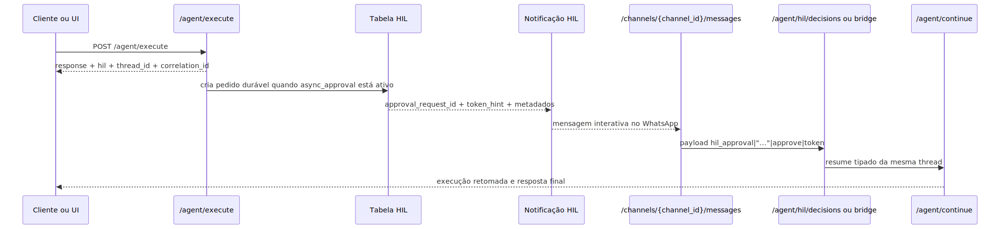

# Manual técnico e guia de integração por exemplo: HIL por APIs, WhatsApp e banco

## 1. O que este guia cobre

Este documento é um guia técnico e de exemplos completos de uso das APIs HIL.

Ele cobre quatro coisas práticas:

1. Como receber uma pausa HIL pelo endpoint de agente.
2. Como devolver a decisão e retomar a execução.
3. Como funciona o HIL assíncrono persistido em banco e distribuído por WhatsApp.
4. Como configurar o canal de WhatsApp para ser usado nesse fluxo.

## 2. Entry points confirmados no código

### 2.1. HIL síncrono de agente

- `POST /agent/execute`
- `POST /agent/continue`

### 2.2. HIL assíncrono por token

- `POST /agent/hil/decisions`

### 2.3. Webhook e decisão por canal

- `GET /channels/{channel_id}/messages` para verificação do webhook Meta
- `POST /channels/{channel_id}/messages` para receber mensagens e payloads interativos

### 2.4. Operação administrativa do HIL persistido

- `GET /admin/background-executions/hil`

### 2.5. Provisionamento de WhatsApp

- `POST /api/whatsapp/provision/start`
- `POST /api/whatsapp/provision/takeover`

## 3. Fluxo técnico de ponta a ponta



Esse diagrama mostra a separação importante do sistema: o canal entrega a decisão, mas a continuação formal da execução continua sendo um caso de uso próprio.

## 4. HIL síncrono: como receber a pausa e devolver a decisão

### 4.1. Chamada inicial

O teste integrado confirma o seguinte padrão mínimo para receber uma pausa HIL de DeepAgent.

```json
POST /agent/execute
{
  "task": "Fluxo HIL deepagent",
  "user_email": "hil.deepagent@prometeu.dev",
  "execution_mode": "direct_sync",
  "mode": "deepagent",
  "encrypted_data": {
    "cipher": "mock"
  }
}
```

### 4.2. Resposta esperada quando houve pausa

```json
{
  "success": true,
  "response": "DeepAgent pausado aguardando aprovação humana",
  "thread_id": "agent_0f4d7c2b8a9e4d31b72fa2c9607b6f21",
  "correlation_id": "a1b2c3d4-e5f6-7890-abcd-ef1234567890",
  "execution_mode": "direct_sync",
  "metrics": {
    "status": "paused",
    "requires_human": true,
    "mode": "deepagent"
  },
  "hil": {
    "pending": true,
    "protocol_version": "hil-http-v1",
    "message": "DeepAgent pausado aguardando aprovação humana",
    "allowed_decisions": ["approve", "edit", "reject"],
    "action_requests": [
      {
        "name": "human_gate",
        "args": {"approved": null},
        "description": "Aprovar ação pendente no DeepAgent."
      }
    ],
    "review_configs": [
      {
        "action_name": "human_gate",
        "allowed_decisions": ["approve", "edit", "reject"]
      }
    ],
    "resume_endpoint": "/agent/continue"
  }
}
```

### 4.3. O que o cliente deve guardar

O cliente precisa guardar pelo menos estes campos.

- `thread_id`
- `correlation_id`
- `hil.allowed_decisions`
- `hil.action_requests`
- `hil.review_configs`
- `hil.resume_endpoint`

Sem `thread_id` e `correlation_id`, a retomada deixa de apontar para a mesma execução.

### 4.4. Retomando com `approve`

```json
POST /agent/continue
{
  "resume": {
    "decisions": [
      {"type": "approve"}
    ]
  },
  "user_email": "analista@empresa.com",
  "correlation_id": "a1b2c3d4-e5f6-7890-abcd-ef1234567890",
  "thread_id": "agent_0f4d7c2b8a9e4d31b72fa2c9607b6f21",
  "mode": "deepagent",
  "yaml_config": "app/yaml/hil-deepagent-minimo.yaml"
}
```

### 4.5. Retomando com `reject`

```json
POST /agent/continue
{
  "resume": {
    "decisions": [
      {"type": "reject"}
    ]
  },
  "user_email": "analista@empresa.com",
  "correlation_id": "a1b2c3d4-e5f6-7890-abcd-ef1234567890",
  "thread_id": "agent_0f4d7c2b8a9e4d31b72fa2c9607b6f21",
  "mode": "deepagent",
  "yaml_config": "app/yaml/hil-deepagent-minimo.yaml"
}
```

### 4.6. Retomando com `edit`

```json
POST /agent/continue
{
  "resume": {
    "decisions": [
      {
        "type": "edit",
        "edited_action": {
          "name": "calculator",
          "args": {
            "expression": "241 * 17"
          }
        }
      }
    ]
  },
  "user_email": "analista@empresa.com",
  "correlation_id": "a1b2c3d4-e5f6-7890-abcd-ef1234567890",
  "thread_id": "agent_0f4d7c2b8a9e4d31b72fa2c9607b6f21",
  "mode": "deepagent",
  "yaml_config": "app/yaml/hil-deepagent-minimo.yaml"
}
```

Importante: o arquivo `app/yaml/hil-deepagent-minimo.yaml` aparece nos exemplos OpenAPI do router, mas não foi localizado no workspace lido. Use esse caminho apenas como referência do contrato do endpoint, não como arquivo confirmado.

### 4.7. Resposta esperada do continue

```json
{
  "resume": {"decisions": [{"type": "approve"}]},
  "response": "DeepAgent retomado e finalizado",
  "steps": ["continue_deepagent"],
  "tools_used": [],
  "metrics": {
    "status": "completed",
    "mode": "deepagent",
    "stage": "continue"
  },
  "processing_time_ms": 94.1,
  "correlation_id": "a1b2c3d4-e5f6-7890-abcd-ef1234567890",
  "thread_id": "agent_0f4d7c2b8a9e4d31b72fa2c9607b6f21",
  "success": true,
  "error": null
}
```

## 5. HIL assíncrono: banco + notificação + decisão posterior

## 5.1. Quando ele existe

O HIL assíncrono é habilitado pelo bloco `middlewares.human_in_the_loop.async_approval` no supervisor ativo.

O contrato canônico confirmado aceita:

- `enabled`
- `ttl_seconds`
- `expiration_policy`
- `require_approver_match`
- `channels`
- `approvers`

Os canais aceitos no contrato lido são `whatsapp` e `email`.

## 5.2. Exemplo de configuração válida

```yaml
multi_agents:
  - id: supervisor-operacao
    execution:
      type: deepagent
    middlewares:
      human_in_the_loop:
        enabled: true
        async_approval:
          enabled: true
          ttl_seconds: 600
          expiration_policy: expire
          require_approver_match: true
          channels:
            - type: whatsapp
              enabled: true
              channel_id: canal-operacao
              template_id: hil_aprovacao_operacao
            - type: email
              enabled: true
              template_id: hil_aprovacao_email
          approvers:
            - user_email: aprovador@empresa.com
              user_code: aprovador-1
              channel_user_ids:
                whatsapp: "5511999999999"
```

## 5.3. Regras operacionais importantes

Se `whatsapp` estiver habilitado, ao menos um aprovador precisa ter `channel_user_ids.whatsapp`.

Se `email` estiver habilitado, ao menos um aprovador precisa ter `user_email`.

Cada canal habilitado exige `template_id`.

`ttl_seconds` precisa ficar entre 60 e 604800.

## 5.4. O que é persistido no banco

O pedido durável fica em `agent_background.agent_hil_approval_requests`.

Os campos operacionais mais importantes confirmados são:

- `approval_request_id`
- `run_id`
- `correlation_id`
- `thread_id`
- `task_id`
- `user_email`
- `user_code`
- `supervisor_id`
- `agent_mode`
- `action_requests`
- `review_configs`
- `allowed_decisions`
- `status`
- `notification_status`
- `approval_token_hash`
- `approval_token_hint`
- `expected_approver_email`
- `expected_channel`
- `expected_channel_user_id`
- `decision_type`
- `decision_payload`
- `decided_by_email`
- `decided_by_user_code`
- `decided_channel`
- `decided_channel_user_id`
- `expires_at`

O token bruto não é persistido. O banco guarda hash e um hint curto.

## 5.5. Como consultar operacionalmente sem abrir o banco

O endpoint administrativo confirmado para runs de background é este.

```http
GET /admin/background-executions/hil?access_key=...&status=pending&limit=50
```

Ele lista aprovações HIL duráveis sem expor token ou hash.

Observação importante: a listagem administrativa confirmada no código foi encontrada no slice de background. Não foi localizado um endpoint administrativo equivalente, genérico e separado, para todas as aprovações HIL fora desse escopo.

## 6. Decidindo o HIL assíncrono por API

### 6.1. Quando usar

Use `POST /agent/hil/decisions` quando você já tem o `approval_token` e quer resolver a pendência por uma API segura, sem depender do botão do canal.

Essa rota é a superfície correta para:

- `approve`
- `reject`
- `edit`
- múltiplas ações com `resume` tipado completo

### 6.2. Exemplo com `approve`

```json
POST /agent/hil/decisions
{
  "approval_token": "token-seguro-recebido-pelo-aprovador",
  "decision_type": "approve",
  "yaml_config": "app/yaml/agente.yaml",
  "approver_email": "aprovador@empresa.com",
  "approver_user_code": "aprovador-1",
  "correlation_id": "corr-chamada-decisao"
}
```

### 6.3. Exemplo com `edit`

```json
POST /agent/hil/decisions
{
  "approval_token": "token-seguro-recebido-pelo-aprovador",
  "decision_type": "edit",
  "yaml_config": "app/yaml/agente.yaml",
  "approver_email": "aprovador@empresa.com",
  "edited_action": {
    "name": "human_gate",
    "args": {
      "approved": true,
      "reason": "ajuste manual"
    }
  }
}
```

### 6.4. Regras importantes dessa rota

Se `decision_type=edit` e houver mais de uma ação pendente, o serviço exige `resume` tipado completo.

Se o pedido tiver `agent_mode=workflow`, a decisão assíncrona ainda não suporta a retomada. O serviço retorna erro de modo não suportado.

Na implementação atual, o router de decisão por POST envia `decided_channel="email"` ao serviço de decisão.

## 7. Decidindo o HIL assíncrono por WhatsApp

## 7.1. Como o payload interativo é montado

O codec do payload curto do botão usa este formato:

```text
hil_approval|approval_request_id|decision_type|approval_token
```

Exemplo real produzido nos testes:

```text
hil_approval|apr-123|approve|token-seguro-123
```

### 7.2. Limitação prática do payload curto

O codec de botão aceita apenas `approve` e `reject`.

Isso significa que o caminho de canal interativo não é a superfície certa para `edit`. Se você precisa editar argumentos, use `POST /agent/hil/decisions` com `edited_action` ou `resume` completo.

### 7.3. Como o webhook processa a decisão

O webhook chega em:

```http
POST /channels/{channel_id}/messages
```

Se o payload for reconhecido como decisão HIL, o `ChannelMessageProcessor` chama o `HilApprovalChannelBridge` antes do fluxo agentic comum.

O bridge monta `HilApprovalDecisionCommand` com:

- `approval_token`
- `approval_request_id`
- `decision_type`
- `decided_channel="whatsapp"`
- `decided_channel_user_id=incoming.payload.sender_id`
- `decided_by_email` e `decided_by_user_code` vindos de `user_session`, quando existirem

Em seguida, o serviço resolve o pedido e continua a execução original.

### 7.4. Exemplo conceitual de body recebido no webhook

```json
POST /channels/wa-hil/messages
{
  "object": "whatsapp_business_account",
  "entry": [
    {
      "changes": [
        {
          "value": {
            "messages": [
              {
                "from": "5511999999999",
                "type": "interactive",
                "interactive": {
                  "button_reply": {
                    "title": "Aprovar",
                    "id": "hil_approval|approval-1|approve|token-seguro"
                  }
                }
              }
            ]
          }
        }
      ]
    }
  ]
}
```

## 8. Como configurar o canal para usar WhatsApp

## 8.1. O que o runtime precisa

Para o canal conseguir enviar mensagens HIL por WhatsApp, o runtime precisa resolver duas camadas de configuração.

Primeira camada: a definição do canal, com `channel_id`, `channel_type`, `yaml_path` e política de segurança.

Segunda camada: as credenciais do WhatsApp em `security_keys`, com as chaves canônicas:

- `access_token`
- `phone_number_id`
- `api_version` opcional
- `base_url` opcional
- `timeout` opcional

## 8.2. Onde as credenciais podem estar

O cliente Meta WhatsApp procura as credenciais em `security_keys` nestes escopos:

- raiz de `security_keys`
- `security_keys.active_channel.{channel_id}`
- `security_keys.channels.{channel_id}`

Se `access_token` ou `phone_number_id` estiverem ausentes ou com placeholder, o envio falha fechado.

## 8.3. Exemplo de definição de canal

O registry local do repositório contém um exemplo deste tipo:

```json
{
  "channel_id": "whatsapp_suporte",
  "channel_type": "whatsapp",
  "description": "Canal de suporte via WhatsApp",
  "yaml_path": "app/yaml/rag-config-food.yaml",
  "execution_mode": "ask",
  "queue_mode": "redis",
  "security": {
    "secret_token": null,
    "allowed_ips": []
  },
  "metadata": {
    "default_user_email": "suporte@empresa.com"
  }
}
```

## 8.4. Registro manual do canal

Se você quiser registrar o canal pela API de channels, o endpoint confirmado é:

```http
POST /channels/register
```

Ele recebe `ChannelDefinition` e persiste a definição no registry local do canal.

## 8.5. Provisionamento operacional do número WhatsApp

O caminho operacional de onboarding confirmado no código é este.

### Passo 1. Iniciar provisionamento

```json
POST /api/whatsapp/provision/start
{
  "client_code": "cliente-1",
  "phone_e164": "+5511999999999",
  "channel_id": "canal-operacao"
}
```

Esse passo registra o número localmente e inicia a etapa de verificação na Meta.

### Passo 2. Assumir o webhook

```json
POST /api/whatsapp/provision/takeover
{
  "client_code": "cliente-1",
  "phone_e164": "+5511999999999",
  "channel_id": "canal-operacao",
  "ensure_template": true
}
```

Esse passo usa `MultiTenantWhatsAppManager.ensure_webhook_subscription(...)`, marca `webhook_configured=true` e atualiza o telefone no diretório.

## 8.6. Verificação do webhook Meta

O desafio de verificação é confirmado por:

```http
GET /channels/{channel_id}/messages?hub.mode=subscribe&hub.challenge=...&hub.verify_token=...
```

O endpoint confere o token do cliente (`meta_webhook_verify_token`) no diretório e devolve o `hub.challenge` quando a assinatura é válida.

## 8.7. Assinatura do webhook de mensagens

O `POST /channels/{channel_id}/messages` valida HMAC pelo `secret_token` do canal quando ele está configurado.

Se o token existir e o header `X-Hub-Signature-256` vier ausente ou inválido, o webhook falha com 401.

## 9. Regras e validações importantes

### 9.1. Ordem das decisões

No `resume`, a lista `decisions` precisa seguir a ordem de `hil.action_requests`.

### 9.2. Uma decisão vence

O repositório resolve o pedido pendente de forma atômica. A primeira decisão válida vence. Chamadas posteriores encontram estado não pendente.

### 9.3. Expiração

Se `expires_at` passar, o pedido vira `expired` ou `failed` conforme a política configurada.

### 9.4. Match de aprovador

Quando `require_approver_match=true`, o sistema valida canal, usuário do canal, e-mail e `user_code` contra os aprovadores permitidos.

## 10. O que acontece em caso de sucesso

### 10.1. Sucesso síncrono

`/agent/execute` devolve `hil`, o cliente envia `resume`, `/agent/continue` devolve resposta final e a pausa pendente é marcada como resolvida.

### 10.2. Sucesso assíncrono por API

O pedido durável muda para `resolved`, `decision_type` é preenchido, a continuação executa e a resposta final volta no corpo de `AgentHilDecisionResponse`.

### 10.3. Sucesso assíncrono por WhatsApp

O botão chega ao webhook, o bridge intercepta, resolve a decisão, retoma a thread e devolve um snapshot com `execution.success` e `hil_approval_decision.status=resolved`.

## 11. O que acontece em caso de erro

Pedido inexistente: HTTP 404 em `/agent/hil/decisions`.

Pedido expirado: HTTP 410.

Pedido já resolvido ou não pendente: HTTP 409.

Canal ou aprovador incompatível: HTTP 403.

`edit` sem `edited_action` ou `resume`: HTTP 400.

Canal WhatsApp sem `channel_id`: falha fechada no adapter.

Canal WhatsApp sem `channel_user_ids.whatsapp`: falha fechada no adapter.

Canal cadastrado sem `yaml_path` ou `client_code`: erro de execução do canal.

## 12. Troubleshooting

### Sintoma: a execução pausa, mas não há pedido durável

Verifique se `async_approval.enabled=true` no supervisor ativo.

No trecho lido, a criação do pedido durável foi confirmada no caminho assíncrono DeepAgent. Se você estiver usando apenas o fluxo síncrono da API, o contrato `hil` existe, mas o despacho durável não foi confirmado no mesmo trecho.

### Sintoma: WhatsApp não envia a notificação

Confira:

- `channel_id` do canal no bloco `async_approval.channels`
- `security_keys` com `access_token` e `phone_number_id`
- `yaml_path` e `client_code` do canal
- `template_id` do canal assíncrono

### Sintoma: o botão do WhatsApp chega, mas a decisão falha

Confira:

- `sender_id` do webhook contra `channel_user_ids.whatsapp`
- expiração do pedido
- status `pending`
- se o pedido já não foi resolvido antes

### Sintoma: preciso editar argumentos pelo canal

O caminho de botão curto não suporta `edit`. Use `POST /agent/hil/decisions` com `edited_action` ou `resume` completo.

### Sintoma: preciso retomar workflow por decisão assíncrona

Esse suporte não foi encontrado no serviço atual. O código confirma erro de modo não suportado para `workflow` no caso de decisão assíncrona por token.

## 13. Como colocar para funcionar

### 13.1. Pré-requisitos confirmados

- Canal com `channel_id`, `channel_type=whatsapp`, `yaml_path` e `client_code` válidos.
- `security_keys` resolvíveis pelo `ClientDirectory`.
- Credenciais canônicas do WhatsApp (`access_token`, `phone_number_id`).
- Token de verificação Meta para o `GET /channels/{channel_id}/messages`.
- `secret_token` do canal, quando quiser validação HMAC no webhook.
- Supervisor DeepAgent com HIL e `async_approval` configurados.

### 13.2. Validação mínima

1. Chame `POST /agent/execute` e confirme resposta com `hil.pending=true`.
2. Se estiver usando HIL síncrono, chame `POST /agent/continue` com o mesmo `thread_id`.
3. Se estiver usando HIL assíncrono, confirme a criação do pedido durável.
4. Envie ou receba a decisão por `POST /agent/hil/decisions` ou por `POST /channels/{channel_id}/messages`.
5. Verifique logs `hil.decision.accepted` e `hil.continuation.finished`.

## 14. Checklist de entendimento

- Entendi qual endpoint publica a pausa HIL.
- Entendi qual endpoint retoma a execução.
- Entendi quando usar `/agent/hil/decisions`.
- Entendi o papel da tabela `agent_hil_approval_requests`.
- Entendi como o WhatsApp entra como canal de decisão.
- Entendi quais credenciais o runtime realmente lê.
- Entendi os limites atuais de `edit` e `workflow`.

## 15. Evidências no código

- `src/api/routers/agent_router.py`
  - Motivo da leitura: contratos públicos de execute, continue e decision.
  - Comportamento confirmado: `POST /agent/continue`, `POST /agent/hil/decisions`, exemplos OpenAPI e envelope `hil`.

- `src/api/services/agent_hil_continuation_service.py`
  - Motivo da leitura: confirmar que a continuação usa `Command(resume=...)` na mesma thread.
  - Comportamento confirmado: retomada reaproveita `thread_id` e `correlation_id`.

- `src/api/services/hil_approval_decision_service.py`
  - Motivo da leitura: validar regras de decisão assíncrona.
  - Comportamento confirmado: `edit` com múltiplas ações exige `resume` completo; `workflow` não é suportado nesse caso de uso.

- `src/api/services/hil_approval_notification_service.py`
  - Motivo da leitura: confirmar adapters, retry e payload de canal.
  - Comportamento confirmado: WhatsApp e e-mail; payload curto só para `approve` e `reject`.

- `src/api/routers/channel_router.py`
  - Motivo da leitura: confirmar webhook GET/POST e interceptação HIL.
  - Comportamento confirmado: `GET /channels/{channel_id}/messages` valida Meta; `POST /channels/{channel_id}/messages` intercepta decisão HIL.

- `src/channel_layer/clients/meta_whatsapp_client.py`
  - Motivo da leitura: confirmar chaves canônicas de credenciais.
  - Comportamento confirmado: `access_token`, `phone_number_id`, `api_version`, `base_url`, `timeout`.

- `src/security/channel_repository.py`
  - Motivo da leitura: confirmar persistência do telefone WhatsApp por canal.
  - Comportamento confirmado: `register_whatsapp_phone(...)` exige `client_code` e `yaml_path` para registrar o número.

- `src/api/routers/whatsapp_provision_router.py`
  - Motivo da leitura: confirmar APIs de provisionamento.
  - Comportamento confirmado: `POST /api/whatsapp/provision/start` e `POST /api/whatsapp/provision/takeover`.

- `scripts/sql/20260502_create_agent_background_schema.sql`
  - Motivo da leitura: confirmar a estrutura durável do pedido HIL.
  - Comportamento confirmado: tabela com status, notificação, token em hash, decisão e expiração.
