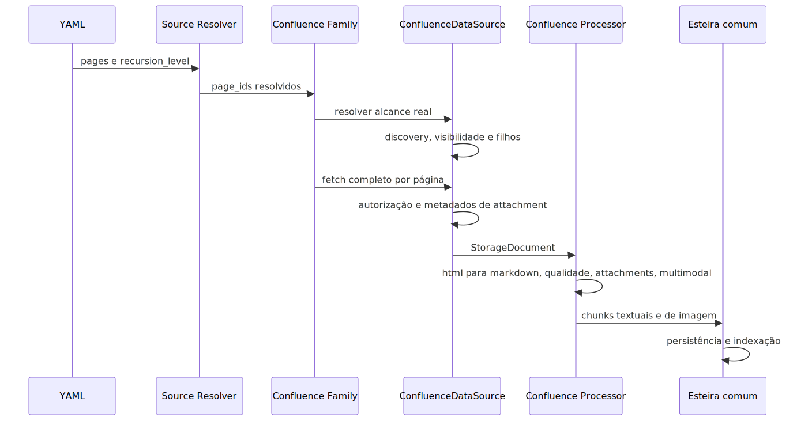

# Manual técnico e operacional: Pipeline de Ingestão Confluence completo

## 1. O que este manual técnico cobre

Este manual descreve o runtime real da ingestão de Confluence no código lido. O foco aqui não é vender a capacidade, mas explicar a mecânica do slice: contrato YAML, resolução de sources, transporte, autenticação, recursão, visibilidade, materialização da página, quality gating, anexos, multimodalidade, chunking e diagnóstico.

O objetivo é responder quatro perguntas práticas.

- Como o pipeline nasce no request de ingestão.
- Como uma página vai do Confluence até o documento canônico.
- Onde o runtime toma decisões de bloqueio, fallback controlado ou degradação.
- Como investigar quando uma página, um anexo ou uma imagem não aparece no índice.

## 2. Entrypoint real do slice

O slice começa na borda comum da ingestão, mas o entrypoint específico do tema está na combinação de três pontos.

- O resolvedor de fontes transforma o YAML em confluence_page_ids e recursion_level.
- O dispatcher da ingestão desvia o request para a família de conteúdo Confluence.
- A família Confluence processa o lote, resolve page_ids finais e entrega as páginas para a esteira comum de pipeline.

Tecnicamente, isso significa que o pipeline de Confluence não nasce no datasource. Ele nasce antes, quando o request já foi classificado como Confluence e ganhou seeds explícitas.

## 3. Contrato YAML canônico

O contrato oficial está centralizado em ingestion.confluence. Os caminhos legados confluence na raiz, ingestion.multimodal_ai.attachments e multimodal_ai.attachments são rejeitados explicitamente.

### 3.1. Defaults confirmados no código

- enabled: true.
- data_source_transport: sdk.
- domain_profile: software_manual.
- visibility_filter: all.
- processing.chunking.chunk_size: 1100.
- processing.chunking.chunk_overlap: 220.
- processing.chunking.include_headings: true.
- processing.chunking.preserve_code_blocks: true.
- processing.chunking.normalize_whitespace: true.
- processing.chunking.collapse_admonitions: true.
- processing.cleaning.strip_macros: true.
- processing.cleaning.remove_empty_sections: true.
- processing.cleaning.min_section_length: 120.
- processing.cleaning.max_section_length: 8000.
- processing.cleaning.allowed_headings: lista vazia por padrão.
- processing.code_blocks.capture: true.
- processing.code_blocks.detect_languages: true.
- processing.code_blocks.normalize_indentation: true.
- processing.code_blocks.max_block_chars: 4000.
- processing.tables.extract: true.
- processing.tables.max_columns: 12.
- processing.tables.max_rows: 80.
- processing.tables.include_markdown: true.
- processing.links.include_internal: true.
- processing.links.include_external: true.
- processing.links.resolve_space: true.
- attachments.enabled: false.
- attachments.download_diagrams: true.
- attachments.include_images: true.
- attachments.max_attachment_size: 15 MB.
- quality_filters.enabled: true.
- quality_filters.min_characters: 500.
- quality_filters.max_characters: 120000.
- quality_filters.required_headings: introducao, resumo e procedimento.
- quality_filters.require_version_match: true.
- metadata.capture_release_info: true.
- metadata.capture_component: true.
- metadata.capture_last_editor: true.
- metadata.capture_labels: true.
- metadata.include_navigation_tree: true.
- multimodal.enabled: true.
- multimodal.image_extraction.enabled: true.
- multimodal.image_extraction.min_dimensions: 60 por 60.
- multimodal.image_extraction.min_size_bytes: 2000.
- multimodal.image_extraction.max_images_per_page: 10.
- multimodal.ocr.enabled: true.
- multimodal.ocr.languages: por e eng.
- multimodal.ocr.confidence_threshold: 0.6.

### 3.2. Configurações que mudam comportamento de forma mais forte

#### visibility_filter

Controla se o lote aceita tudo, apenas páginas públicas ou apenas páginas privadas. Esse filtro é aplicado tanto na recursão quanto no pré-filtro das próprias seeds quando a recursão está desligada.

#### data_source_transport

Escolhe entre sdk e http. Valor inválido gera erro explícito. Não há fallback implícito.

#### pages e recursion_level

Definem o conjunto inicial de páginas e a profundidade máxima de expansão. O resolvedor usa o maior recursion_level entre as entradas configuradas.

#### quality_filters

Controlam se páginas curtas demais, sem headings exigidos ou sem sinais de versão devem ser bloqueadas antes do chunking.

#### attachments

Ligam ou desligam a trilha de anexos e definem limites de tamanho, tipos e diretório de persistência local dos downloads.

#### multimodal

Controla se o wrapper multimodal do Confluence será usado para extrair valor adicional de imagens.

## 4. Contratos de entrada e saída

### 4.1. Entrada do resolvedor

O bloco ingestion.confluence.pages aceita entradas em dois formatos relevantes.

- string simples com id da página.
- objeto com id e recursion_level.

O resolvedor monta dois valores operacionais.

- page_ids: lista final de seeds.
- recursion_level: maior nível máximo pedido nas páginas declaradas.

### 4.2. Entrada do datasource

O datasource recebe page_id já normalizado e uma configuração resolvida do Confluence. Ele exige base_url válida e autenticação coerente com o método escolhido.

### 4.3. Saída do fetch completo

O fetch completo devolve um raw_data estruturado com payload da página, resumo de autorização e registros serializados de attachment quando houver. Esse raw_data é a matéria-prima da materialização do StorageDocument.

### 4.4. Saída do processor

O processor devolve ConfluencePage com conteúdo canônico, pages_info, metadados enriquecidos, estado de qualidade e, quando aplicável, metadados multimodais e de attachment.

### 4.5. Saída do chunking

O chunking gera ContentChunk com chunk_id, total_chunks, parâmetros adaptativos, metadados canônicos da página e, opcionalmente, chunks de imagem com content_kind igual a image_ocr.

## 5. Fluxo técnico de ponta a ponta

O ponto técnico mais importante é a ordem. Primeiro o runtime decide escopo. Depois busca a página. Depois materializa. Depois valida qualidade. Só então chunka e indexa. Essa ordem evita comportamento escondido e simplifica diagnóstico.

## 6. Resolução de alcance: seeds, recursão e visibilidade

Quando a recursão está maior que zero, o datasource usa busca paginada de filhos e faz classificação de visibilidade página por página. O ciclo interno mantém visited, queue, contadores de páginas públicas, privadas e unknown, além de registrar páginas unknown com page_id, título, URL e depth.

Quando a recursão está igual a zero, o runtime ainda normaliza, trimma e deduplica seeds antes de aplicar visibility_filter, se ele estiver configurado.

Esse desenho resolve um problema importante: a política de visibilidade vale para o lote inteiro, não apenas para a expansão recursiva.

## 7. Transporte, autenticação e retry

### 7.1. Transporte SDK

No modo sdk, o runtime cria o cliente Atlassian Confluence uma única vez e usa métodos como get_page_by_id, get_page_child_by_type e get_attachments_from_content.

### 7.2. Transporte HTTP

No modo http, o runtime usa requests para page fetch e attachments, e httpx.AsyncClient para filhos. Os endpoints observados no código são baseados em rest/api/content, child/page e child/attachment.

### 7.3. Autenticação

O datasource aceita dois métodos.

- basic: exige confluence_email e confluence_api_token.
- bearer: exige confluence_bearer_token.

Método inválido gera erro explícito. Token ou email ausente também.

### 7.4. Retry

O código implementa execução com retry explícito e os testes confirmam coerção para mínimo efetivo de cinco tentativas quando a configuração pedir menos. Isso vale como guardrail para comunicação com Confluence.

## 8. Fetch mínimo e fetch completo

### 8.1. Fetch mínimo de descoberta

O fetch mínimo usa expand restrito a restrictions.read.restrictions.group. Ele existe para classificação de visibilidade com custo menor do que o fetch completo.

### 8.2. Fetch completo da página

O fetch completo expande body.storage, body.view, body.export_view, version, history, space, metadata.labels, restrictions.read.restrictions.group e ancestors.

Esse payload é importante porque o pipeline não quer apenas o texto. Ele quer representação de conteúdo, labels, ancestralidade, sinais de restrição e metadados suficientes para rastreabilidade.

### 8.3. Snapshot de autorização

Depois do fetch completo, o runtime tenta consultar restrições oficiais via serviço específico. Se isso falhar por erro HTTP, ele ainda tenta resumir lock status a partir do payload expandido. Esse é um fallback explícito e diagnosticado, não um bypass silencioso.

## 9. Materialização do documento

O datasource transforma raw_data em StorageDocument e registra um log rico com page_title, content_representation, html_length, attachments_count, space_key, page_status, sinais de restrição e resumo de autorização.

Esse passo é o boundary entre “payload da API” e “documento interno”. A partir daqui, o restante da pipeline não precisa conhecer a estrutura original da resposta do Confluence.

## 10. Processamento textual da página

O ConfluenceContentProcessorBase faz cinco trabalhos principais.

- Converte HTML em Markdown legível com html2text.
- Remove boilerplate e normaliza tabelas Atlaskit com helpers compartilhados.
- Extrai seções por heading, blocos de código, tabelas e links.
- Compõe um texto final mais estável para chunking.
- Constrói pages_info e marca a origem do conteúdo canônico.

### 10.1. Headings e sections

O processor lê headings h1 a h6, agrupa o conteúdo até o próximo heading e pode filtrar seções por allowed_headings quando esse opt-in estiver configurado. Sem esse opt-in, o processor preserva seções válidas e não amputa headings por padrão.

### 10.2. Blocos de código

O processor coleta pre e macros ac:structured-macro com nome code. Isso é relevante para documentação técnica em Confluence, porque muito conteúdo útil de wiki corporativa está em blocos de código e não apenas em parágrafos.

### 10.3. Tabelas

Tabelas são convertidas para Markdown quando respeitam os limites de linhas e colunas. Isso evita quebrar o pipeline com tabelas gigantescas e, ao mesmo tempo, preserva tabelas pequenas que carregam regras, matrizes ou procedimentos.

### 10.4. Links

O processor resolve links relativos contra source_url, distingue links internos e externos e registra warning quando um link relativo não pode ser resolvido por falta de source_url válido.

## 11. Conteúdo canônico e materialização tardia

O processor tenta sempre reutilizar conteúdo canônico já materializado em pages_info. Se ele não existir, entra em materialização tardia controlada, normalizando o conteúdo legado de page.content e marcando degradação em metadata.

Esse comportamento tem dois valores operacionais.

- Evita reprocessamento desnecessário quando pages_info já está coerente.
- Não explode o pipeline se um documento escapou sem materialização anterior, desde que ainda exista conteúdo útil.

Se o fallback tardio também falhar, o runtime devolve o conteúdo original e marca a degradação como page_cleanup_error.

## 12. Quality gating e bloqueio de indexação

O helper de qualidade calcula flags, headings ausentes, presença de sinais de release e bloqueio final. Quando a página é bloqueada, o metadata explicita pelo menos quatro campos críticos.

- quality_blocked.
- ingestion_blocked.
- ingestion_block_reason igual a quality_filters.
- ingestion_block_details com flags, missing_headings e outros critérios.

Na sequência, create_chunks aborta imediatamente o chunking textual e retorna lista vazia. Isso evita indexação parcial de páginas que a política já considerou inadequadas.

## 13. Attachments

### 13.1. Coleta de metadados

O datasource primeiro pode listar attachments sem download, respeitando o bloco canônico ingestion.confluence.attachments. O adapter pagina a listagem e mantém cache local por page_id.

### 13.2. Download e persistência

Quando a trilha de download é acionada, o datasource usa download_attachments com filtros de tamanho, tipo e timeout. O caminho default de persistência local é .sandbox/confluence_attachments.

### 13.3. Contrato de imagens de attachment

Existe uma validação explícita para impedir uma situação perigosa: o profile de attachments pedir include_images, mas a política global efetiva de persistência de imagens desligar esse fluxo. Nesse caso o runtime falha fechado e aponta as chaves relevantes.

- ingestion.confluence.attachments.include_images.
- ingestion.images.persistence.include_images.
- ingestion.images.persistence.include_images_by_type.confluence.
- ingestion.images.persistence.include_images_by_source.confluence_page.

### 13.4. Reacoplamento ao documento e aos chunks

Depois da coleta, os attachments são indexados por page_id, serializados, deduplicados por URI e backend e reaplicados ao metadata do documento e dos chunks. Se o attachment for imagem, image_uris também é propagado.

## 14. Multimodalidade

O wrapper ConfluenceMultimodalProcessor resolve a configuração multimodal para content_type igual a confluence, tenta reaproveitar html_content de pages_info e, se habilitado, chama um processador multimodal específico do conteúdo.

Há três caminhos possíveis.

- Multimodal desabilitado: segue apenas com texto.
- Processador multimodal indisponível: loga warning e segue apenas com texto.
- Multimodal ativo e processador disponível: enriquece texto, anexa metadados multimodais e consolida chunks base com chunks adicionais de imagem.

O payload multimodal de imagens ainda respeita a flag global ingestion.image_chunking.enabled. Se ela estiver desligada, o payload existe, mas os image chunks são ignorados com log explícito.

## 15. Chunking

O chunking textual usa splitter configurado com parâmetros adaptativos e cria metadados canônicos por chunk, incluindo chunk_id, total_chunks, chunk_size e parâmetros adaptativos efetivos.

Se o splitter falhar, o runtime cai em fallback explícito para chunk único, marca content_chunking_degraded e conserva o documento em vez de abortar toda a ingestão.

## 16. O que acontece em caso de sucesso

No caminho feliz, os sinais técnicos observáveis são estes.

- page_ids finais resolvidos e, se necessário, expandidos.
- fetch completo com materialização de página e snapshot de autorização.
- quality_filters avaliados e não bloqueantes.
- attachments coletados e acoplados quando habilitados.
- multimodalidade processada ou ignorada de forma explícita.
- chunks textuais e, eventualmente, de imagem emitidos e enviados à esteira comum.

## 17. O que acontece em caso de erro

### 17.1. Erros de contrato

- data_source_transport inválido.
- método de autenticação inválido.
- caminhos YAML legados.
- política inconsistente para publicação de imagens de attachment.

### 17.2. Erros de aquisição

- timeout e falhas HTTP.
- credenciais ausentes ou inválidas.
- falha ao consultar restrições oficiais.

### 17.3. Erros de conteúdo

- HTML vazio ou sem texto útil.
- conteúdo canônico ausente, exigindo materialização tardia.
- quality_filters bloqueando a página.

### 17.4. Erros de enriquecimento

- falha ao baixar attachments de uma página específica.
- processador multimodal indisponível ou falhando durante enriquecimento.

## 18. Observabilidade e diagnóstico

Os logs mais valiosos para investigação são estes.

- Confluence estrategia de autenticacao e visibilidade configurada.
- Recursao Confluence iniciada e concluida.
- Pagina Confluence materializada a partir da API.
- Qualidade Confluence avaliada.
- Pagina Confluence nao cumpre criterios de qualidade.
- Conteúdo canônico Confluence ausente; aplicando materialização tardia.
- Materialização tardia Confluence concluída.
- Attachments Confluence listados com paginação completa.
- Anexos Confluence incorporados ao documento.
- Chunking Confluence concluído.
- Chunking de imagens Confluence desabilitado; payload multimodal será ignorado.

Esses eventos permitem separar onde o problema nasceu.

- Se o lote nem chega a páginas elegíveis, o problema está em seeds, recursão ou visibilidade.
- Se a página é baixada mas não vira chunk, o problema está em qualidade ou materialização.
- Se o texto existe mas o contexto ficou pobre, o problema pode estar em attachments ou multimodalidade.

## 19. Comparação técnica com o estado da arte

### 19.1. Onde o slice está forte

- Expansão seletiva de recursos, em linha com a lógica oficial da API Confluence.
- Paginação explícita de filhos e attachments.
- Snapshot de autorização integrado ao documento, algo que loaders genéricos frequentemente ignoram.
- Integração entre texto, attachments e multimodalidade no mesmo documento pai.
- Quality gating explícito antes da indexação.

### 19.2. Onde o slice ainda é mais restrito

- O escopo nasce de page_ids declarados, não de busca por espaço, label ou CQL confirmada no código lido.
- O transporte observado usa endpoints rest/api/content e SDK correspondente, enquanto a Atlassian vem enfatizando superfícies REST v2 com cursor e links next.
- Não foi confirmado um mecanismo de delta incremental específico para Confluence neste slice.

## 20. Exemplos práticos guiados

### 20.1. Recursão ligada e attachments habilitados

Entrada: seed root com recursion_level igual a dois e attachments.enabled verdadeiro.

Resultado técnico esperado: resolve_page_ids expande root para filhos; attachments são coletados sobre a lista já expandida; build_attachment_index deduplica registros; pipeline textual processa a mesma lista de páginas.

### 20.2. Visibility filter public_only sem recursão

Entrada: duas seeds, uma pública e uma privada, com recursion_level zero.

Resultado técnico esperado: o runtime normaliza e deduplica seeds, aplica visibility_filter antes do pipeline e só repassa a página pública para a família de processamento.

### 20.3. Página bloqueada por quality_filters

Entrada: HTML curto demais ou sem headings obrigatórios.

Resultado técnico esperado: build_from_storage marca metadata de bloqueio; create_chunks retorna lista vazia; a esteira comum não indexa a página.

## 21. Limites e lacunas confirmadas

- Caminho dedicado de execução manual do slice Confluence, fora da ingestão comum, não foi confirmado no código lido.
- Descoberta de páginas por busca ampla, label ou CQL não foi confirmada.
- Sincronização incremental por webhook ou delta temporal específica do Confluence não foi confirmada.
- A documentação mais nova da Atlassian destaca v2, mas o slice lido trabalha sobre superfícies v1 baseadas em content e no SDK correspondente.

## 22. Checklist de entendimento

- Entendi o contrato YAML canônico do Confluence.
- Entendi como seeds e recursion_level entram no request.
- Entendi a diferença entre fetch mínimo e fetch completo.
- Entendi como visibilidade e autorização entram no runtime.
- Entendi como a página vira conteúdo canônico.
- Entendi quando quality_filters bloqueiam a indexação.
- Entendi como attachments são coletados, deduplicados e reaplicados ao documento pai.
- Entendi como a multimodalidade complementa, mas não substitui, o pipeline textual.

## 23. Evidências no código

- src/utils/confluence_config_resolver.py
  - Motivo da leitura: contrato YAML, defaults e guardrails contra legado.
  - Símbolo relevante: validate_confluence_yaml_contract.
  - Comportamento confirmado: o resolvedor rejeita confluence na raiz e attachments em multimodal_ai.

- src/services/ingestion_request_source_resolvers.py
  - Motivo da leitura: entrada do slice no request.
  - Símbolo relevante: resolve_confluence.
  - Comportamento confirmado: page_ids e recursion_level são derivados do bloco pages.

- src/ingestion_layer/datasources/confluence_transport_support.py
  - Motivo da leitura: transporte HTTP e SDK, paginação de filhos e attachments.
  - Símbolo relevante: ConfluenceTransportAdapter.
  - Comportamento confirmado: listagem de attachments e children é paginada e deduplicada.

- src/ingestion_layer/datasources/confluence_data_source.py
  - Motivo da leitura: aquisição, autorização, visibilidade e attachment policy.
  - Símbolo relevante: métodos \_fetch\_document\_data, get\_pages\_recursive e \_validate\_attachment\_image\_persistence\_contract.
  - Comportamento confirmado: o datasource agrega payload, snapshot de autorização, attachments e valida contratos de persistência de imagem.

- src/ingestion_layer/processors/confluence_processor.py
  - Motivo da leitura: materialização textual, quality gating, multimodal payload e chunking.
  - Símbolo relevante: build_from_storage, process_page_content, create_chunks.
  - Comportamento confirmado: o processor produz conteúdo canônico, registra degradação controlada e aborta chunking quando a política manda.

- src/ingestion_layer/processors/multimodal_wrappers.py
  - Motivo da leitura: overlay multimodal específico do Confluence.
  - Símbolo relevante: ConfluenceMultimodalProcessor.process_document.
  - Comportamento confirmado: texto base e imagens processadas são consolidados em chunks finais.

- src/ingestion_layer/attachment_processor.py
  - Motivo da leitura: vida dos attachments depois do download.
  - Símbolo relevante: _attach_confluence_page_attachments.
  - Comportamento confirmado: documento e chunks recebem attachments e image_uris deduplicados.
