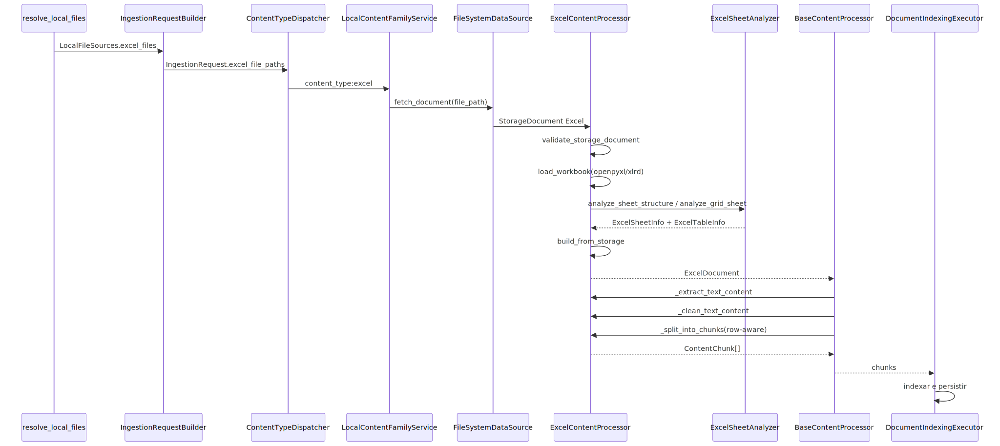

# Manual técnico do pipeline de ingestão de Excel

## 1. O que este documento cobre

Este manual técnico explica o comportamento real do pipeline Excel no código lido. O foco aqui é seguir o fluxo ponta a ponta desde a identificação do arquivo até a indexação final, deixando explícito quais contratos o runtime realmente usa, como o workbook é carregado, como as planilhas são analisadas e como os chunks são montados.

## 2. Entry point e boundary real local

O pipeline Excel agora tem um boundary oficial explícito no corredor local. O caminho confirmado no código lido é este.

1. `resolve_local_files` classifica `.xlsx` e `.xls` em `LocalFileSources.excel_files` quando `ingestion.excel.enabled` está ativo.
2. `IngestionRequestBuilder.build` materializa esses arquivos em `IngestionRequest.excel_file_paths`.
3. `IngestionPipelineCoordinator` e os summaries oficiais passam a contar Excel como fonte válida do request.
4. `ContentTypeDispatcher` executa a etapa oficial `content_type:excel`.
5. `LocalContentFamilyService.process_excel` delega para o pipeline comum de arquivos locais.
6. `FileSystemDataSource` materializa cada arquivo como `StorageDocument` com `content_type` de Excel.
7. `ContentProcessorFactory` resolve `ExcelContentProcessor` para `.xlsx` e `.xls`.
8. `DocumentProcessorExecutor` entrega o documento ao processor e `DocumentIndexingExecutor` fecha indexação e persistência.

Isso importa porque a planilha deixou de depender de um caminho implícito. O runtime local agora registra Excel no request oficial, atravessa o dispatcher oficial e só então entra no processor especializado.

## 3. Contrato de configuração que realmente governa o Excel

### 3.1. Contrato canônico confirmado

O código lido mostra um ponto importante: o contrato público e canônico do runtime para Excel é `ingestion.excel`.

- `YamlConfigManager.get_excel_config()` prioriza `ingestion.excel`.
- `yaml_config_handler` prioriza `ingestion.excel` e só reconhece o caminho legado `excel` com warning explícito.
- Os consumers internos do slice Excel passaram a resolver a configuração pelo manager canônico, em vez de ler o bloco legado diretamente.

Na prática, isso elimina a história dupla entre o lado de fora e o lado de dentro. Configuração nova deve usar `ingestion.excel`.

### 3.2. Blocos específicos de `ingestion.excel`

O processor consome quatro grupos principais.

- `file_handling`
- `analysis`
- `content_extraction`
- `data_output`

Além disso, lê algumas flags na própria raiz do bloco `ingestion.excel`, como `max_rows`, e combina isso com a configuração compartilhada do pipeline comum.

### 3.3. Efeito prático de cada grupo

`file_handling` controla extensão suportada, limite de tamanho, modo `read_only` e `data_only`.

`analysis` controla detecção automática de tabelas, cabeçalho, densidade mínima estrutural, tolerância a lacunas e limites de linhas e colunas para a heurística.

`content_extraction` controla nomes de abas excluídas, densidade mínima operacional, limite de abas e formato geral da extração.

`data_output` controla se o pipeline deve carregar `tables_data`, `raw_data` e preservação de tipos.

## 4. Identificação e materialização do documento

### 4.1. Identificação da extensão

`filesystem_data_source` identifica `.xlsx` como `ContentType.EXCEL_XLSX` e `.xls` como `ContentType.EXCEL_XLS`.

`content_type_dispatcher` confirma a mesma separação quando precisa carregar documento dinamicamente.

### 4.2. Registro do processor

`ContentProcessorFactory` registra `ExcelContentProcessor` para os dois tipos. Isso garante que o mesmo host trate os dois formatos, mas com branches internos próprios.

### 4.3. Coerção para `ExcelDocument`

Quando recebe um `StorageDocument`, o processor chama `_coerce_excel_document`. Se o tipo for suportado, ele registra log de conversão e chama `build_from_storage` para montar o `ExcelDocument` estruturado.

## 5. Validação do arquivo antes da carga

`validate_storage_document` impõe o contrato operacional do Excel.

### 5.1. Regras confirmadas

- `file_path` é obrigatório.
- `.xlsm` é rejeitado porque macros VBA estão fora do contrato.
- `.xlsb` é rejeitado porque workbook binário está fora do contrato.
- Se `supported_extensions` foi configurado, a extensão deve pertencer a essa allowlist.
- Para fontes locais, o arquivo precisa existir em disco.
- Se `max_file_size_mb` foi configurado, o arquivo não pode exceder o limite.
- `raw_bytes` são obrigatórios.

### 5.2. Implicação prática

Essa etapa falha cedo e evita que o pipeline tente abrir workbook inválido ou fora do contrato suportado.

## 6. Carga do workbook

### 6.1. Caminho principal `.xlsx`

`_load_workbook` tenta `openpyxl.load_workbook` com `read_only` e `data_only` vindos da configuração.

O efeito prático é este:

- `read_only` favorece consumo mais leve do workbook;
- `data_only` prioriza valores armazenados em vez de fórmulas.

### 6.2. Caminho legado `.xls`

Se a carga por `openpyxl` falha e o documento é `.xls`, o processor registra log explícito e tenta `_load_xls_workbook` via `xlrd`.

Esse caminho registra `processing_mode=best_effort_xls` e limitações operacionais na metadata.

### 6.3. Limitações explícitas do caminho legado

O código confirma pelo menos estas limitações.

- leitura best-effort via `xlrd`;
- ausência de tabelas nativas estruturadas do workbook;
- fórmulas não são interpretadas como engine de cálculo;
- macros, comentários, hyperlinks, filtros, validações, objetos embarcados e pivot tables são ignorados;
- `.xls` protegido por senha não é suportado.

## 7. Montagem do `ExcelDocument`

`build_from_storage` executa a sequência principal:

1. validar e carregar o workbook;
2. chamar `_extract_text_and_metadata`;
3. enriquecer metadata com `_attach_excel_contract_metadata`;
4. devolver um `ExcelDocument` com conteúdo, totais, `tables_data` e `raw_data`.

O `ExcelDocument` final expõe:

- `sheet_names`
- `total_sheets`
- `total_rows`
- `total_columns`
- `tables_data`
- `raw_data`

Esse é o contrato intermediário que sustenta o chunking row-aware posterior.

## 8. Análise estrutural das planilhas

`ExcelSheetAnalyzer` é o componente que decide como a planilha deve ser entendida.

### 8.1. Tabelas nativas

No caminho `.xlsx`, o pipeline tenta abrir um workbook auxiliar com `read_only=False` e `data_only=False` apenas para ler `ws.tables` e construir um índice de tabelas nativas.

Quando a tabela nativa existe, o analisador extrai:

- nome e intervalo da tabela;
- colunas da tabela;
- cabeçalhos;
- `totalsRowFunction` e `totalsRowLabel` quando existirem;
- fórmulas em células e metadados de totals row.

### 8.2. Heurística de grid

Quando a estrutura nativa não existe ou no caminho `.xls`, o analisador tenta descobrir tabelas por heurística.

Ele varre uma janela limitada de linhas e colunas e tenta responder:

- onde a tabela começa;
- onde termina por linha;
- onde termina por coluna;
- se a primeira linha parece cabeçalho;
- quais tipos aparecem nas colunas.

### 8.3. Densidade e tipo estrutural

O analisador calcula densidade de dados e classifica a folha como:

- `sparse`
- `form`
- `table`
- `mixed`

Isso é usado para enriquecer metadata e para apoiar filtros posteriores por densidade.

## 9. Extração de conteúdo por sheet no caminho `.xlsx`

`_extract_text_and_metadata` faz a extração principal do caminho moderno.

### 9.1. Ordem da iteração

Para cada aba do workbook, o processor:

1. aplica limite de número máximo de sheets;
2. pula nomes excluídos por configuração;
3. resolve `sheet_info` usando tabela nativa ou heurística;
4. percorre linhas até `max_rows`;
5. detecta ou assume headers;
6. processa cada linha e atualiza estatísticas por coluna;
7. avalia a densidade final da aba;
8. se a aba passou, registra texto, schema, tabelas e estatísticas numéricas.

### 9.2. Cabeçalhos

Se `auto_detect_headers` está ativo, a primeira linha é testada por proporção de texto. Se não parecer cabeçalho, o pipeline gera nomes sintéticos como `col_0`, `col_1` e já trata a primeira linha como dado.

### 9.3. Texto da planilha

O texto final da aba é montado com um título `# nome_da_aba` e linhas formatadas por delimitador markdown ou tabulação. Esse texto ainda existe porque o documento também precisa permanecer legível como conteúdo textual.

### 9.4. Schema resumido

Para cada coluna, o pipeline registra:

- tipo inferido dominante;
- papel analítico;
- nulos e não nulos;
- amostras de valores.

### 9.5. Estatísticas numéricas

Quando a coluna é numérica, o pipeline registra pelo menos:

- contagem;
- mínimo;
- máximo;
- média.

### 9.6. Tabelas e dados estruturados

Se `include_tables_data` está ativo e a aba contém tabelas detectadas, o processor inclui `tables_data` por aba. Se `include_raw_data` está ativo, também preserva as linhas cruas.

## 10. Extração de conteúdo no caminho `.xls`

O método `_extract_xls_text_and_metadata` replica a mesma intenção do caminho moderno, mas sobre o contrato reduzido do `xlrd`.

### 10.1. Diferenças principais

- linhas são lidas por `row_values` e `row_types`;
- datas tentam ser normalizadas com `xldate_as_datetime`;
- não há leitura de tabela nativa do workbook;
- quando `include_tables_data` está ativo, o pipeline grava `sheet_rows` como estrutura disponível, sem o mesmo nível de metadata nativa.

### 10.2. Consequência prática

O pipeline mantém compatibilidade legada, mas o contrato estrutural de `.xls` é mais pobre que o de `.xlsx`.

## 11. Metadados de contrato do Excel

`_attach_excel_contract_metadata` adiciona metadados explícitos ao documento.

- `excel_extension`
- `excel_supported_extensions`
- `excel_engine`
- `excel_processing_mode`
- `excel_contract_profile`
- `excel_processing_limitations`

Isso é valioso para observabilidade porque deixa visível, no próprio documento, qual rota técnica foi usada.

## 12. Processamento assíncrono canônico

Quando o `ExcelDocument` já foi montado, o boundary comum `BaseContentProcessor.process_document` executa o pipeline padrão:

1. `pre_process_hook`;
2. `_extract_text_content`;
3. `_clean_text_content`;
4. `_split_into_chunks`;
5. `post_process_hook`.

Para Excel, os métodos mais importantes são sobrescritos para preservar a semântica tabular.

## 13. Chunking do Excel

### 13.1. Caminho canônico assíncrono

O método assíncrono `_split_into_chunks` foi sobrescrito no `ExcelContentProcessor` e chama diretamente `_create_row_aware_chunks`.

Esse é o caminho canônico do pipeline real usado na ingestão assíncrona.

### 13.2. Estratégia row-aware

`_create_row_aware_chunks` percorre as abas registradas em `metadata.sheets`, localiza os dados estruturados da aba e gera um chunk por linha útil.

Cada chunk carrega metadata como:

- `sheet_name`
- `sheet_index`
- `row_index`
- `total_rows`
- `total_columns`
- `column_names`
- `row_data`
- `column_types`
- `column_roles`
- `numeric_columns`

### 13.3. Origem das linhas do chunk

O processor tenta primeiro `tables_data`. Se não encontrar, registra fallback textual e reconstrói linhas a partir do texto da aba.

### 13.4. Serialização do conteúdo do chunk

O conteúdo textual do chunk pode seguir três formatos, conforme configuração.

- JSON da linha, quando `embed_as_json` está ativo;
- mini tabela markdown de uma linha, quando `markdown_tables` está ativo;
- pares `chave: valor`, quando nenhum dos dois vale.

### 13.5. Superfície síncrona auxiliar

Existe também `create_chunks`, que faz chunking textual por linhas respeitando `chunk_size` e `chunk_overlap`. Essa superfície existe para compatibilidade, mas o caminho assíncrono canônico da ingestão usa o chunking row-aware.

## 14. Tipos, papéis analíticos e linhas estruturadas

O valor técnico do pipeline Excel aparece na combinação entre três grupos de metadados.

### 14.1. Tipos inferidos

O processor classifica valores como:

- `empty`
- `boolean`
- `number`
- `datetime`
- `text`

### 14.2. Papel analítico

O processor infere, por heurística simples, se a coluna se comporta como:

- `identifier`
- `metric`
- `dimension`
- `time_dimension`

### 14.3. Linha estruturada

Cada chunk carrega `row_data`, que preserva a linha como estrutura nomeada e não apenas como texto. Isso é o que permite consumo posterior mais especializado.

## 15. Integração com a esteira comum

Depois do chunking, `DocumentIndexingExecutor.finalize` faz o fechamento padrão do pipeline.

1. resolve hashes do documento;
2. injeta metadados canônicos em cada chunk;
3. indexa os chunks no vector store;
4. persiste o documento processado;
5. registra telemetria de sucesso.

O pipeline Excel não cria uma persistência paralela. Ele reaproveita a esteira comum do produto.

## 16. O que acontece em caso de sucesso

Os sinais técnicos de sucesso são estes.

- o workbook carregou com engine definida;
- existem `sheet_names` e totais coerentes no `ExcelDocument`;
- a metadata contém informações de sheets, schema ou tabelas úteis;
- os chunks finais carregam `row_data`, `column_names` e contexto de sheet;
- o vector store aceitou os chunks;
- o documento foi persistido pela camada comum.

## 17. O que acontece em caso de erro

### 17.1. Antes da carga

- documento sem `file_path`;
- extensão fora do contrato;
- arquivo ausente em fonte local;
- limite de tamanho excedido;
- ausência de bytes.

### 17.2. Durante a carga

- falha do `openpyxl` para `.xlsx`;
- falha do `xlrd` para `.xls`;
- `.xls` protegido por senha;
- workbook inválido ou corrompido.

### 17.3. Durante a extração

- aba inexistente em consulta auxiliar;
- aba descartada por densidade insuficiente;
- metadata auxiliar de tabelas nativas não carregando e forçando caminho heurístico.

### 17.4. Durante o fechamento

- vector store recusando os chunks;
- falha ao persistir o documento processado;
- falha de telemetria depois da persistência, sem invalidar o documento já processado.

## 18. Observabilidade e diagnóstico

### 18.1. Onde olhar primeiro

1. logs de validação do arquivo;
2. logs de carga do workbook;
3. logs de entrada em `best_effort_xls`, quando houver;
4. logs de exclusão por baixa densidade;
5. metadata do documento com engine, modo e limitations;
6. metadata dos chunks com `row_data` e contexto de sheet.

### 18.2. Como diferenciar causas

Erro de contrato:
extensão, tamanho, arquivo ausente ou bytes ausentes.

Erro de engine:
`openpyxl` ou `xlrd` falham ao abrir o workbook.

Erro de qualidade da planilha:
aba muito vazia, sem densidade suficiente ou com estrutura pobre demais.

Erro de indexação:
chunks foram criados, mas o vector store ou a persistência final falharam.

## 19. Troubleshooting

### Sintoma: planilha entrou, mas quase nada foi indexado

Causa provável: várias abas foram descartadas por nome excluído ou por densidade mínima.

Como confirmar: revisar `metadata.sheets`, `sheet_names` finais e logs de baixa densidade.

Ação recomendada: recalibrar `excluded_sheet_names` e `min_data_density` com base no perfil real do workbook.

### Sintoma: `.xls` carrega, mas com menos riqueza estrutural

Causa provável: caminho legado `xlrd` em modo best-effort.

Como confirmar: `excel_processing_mode=best_effort_xls` e presence de `excel_processing_limitations`.

Ação recomendada: quando possível, migrar a origem para `.xlsx`.

### Sintoma: pergunta posterior não enxerga linhas corretamente

Causa provável: chunks não saíram do caminho row-aware esperado ou a sheet caiu em fallback textual.

Como confirmar: verificar nos chunks a presença de `row_data`, `column_names` e `sheet_name`.

Ação recomendada: revisar `tables_data`, `include_tables_data` e o estado estrutural da aba.

### Sintoma: workbook válido falha logo na abertura

Causa provável: arquivo corrompido, senha, formato incompatível ou bytes inválidos.

Como confirmar: revisar a exceção registrada na carga do workbook e a extensão efetiva do arquivo.

Ação recomendada: validar o arquivo de origem e o contrato de formato aceito.

## 20. Como colocar para funcionar

O caminho confirmado no código é este: a planilha precisa entrar pela esteira oficial local, ser classificada em `excel_file_paths`, atravessar a etapa `content_type:excel` do dispatcher e então materializar um `StorageDocument` com `raw_bytes` e `content_type` de Excel. A configuração relevante precisa existir no YAML do runtime em `ingestion.excel`.

O que não ficou confirmado no slice lido é um comando oficial exclusivo para rodar apenas o pipeline Excel de forma isolada, fora da esteira geral da ingestão.

## 21. Lacunas reais observadas

### 21.1. Compatibilidade legada ainda existe, mas ficou isolada

O caminho canônico do runtime já é `ingestion.excel`. O bloco legado `excel` só permanece no resolvedor oficial de YAML, com warning explícito, para compatibilidade controlada. Isso não deve ser tratado como contrato novo nem como justificativa para dual-read permanente nos consumers internos.

### 21.2. Superfície síncrona e assíncrona de chunking coexistem

Existe uma superfície `create_chunks` textual e uma superfície assíncrona `_split_into_chunks` row-aware. O caminho canônico da ingestão usa a segunda, mas a coexistência pede cuidado para não documentar a superfície errada como principal.

### 21.3. Formatos modernos mais amplos não entram no contrato atual

O ecossistema atual já suporta `.xlsb`, `.xlsm` e engines mais rápidas, mas o contrato do projeto permanece restrito a `.xlsx` e `.xls`.

## 22. Diagrama técnico de responsabilidades

O diagrama mostra que o boundary local oficial agora inclui resolver, request, dispatcher e família local antes do processor. A inteligência especializada do Excel continua concentrada no processor e no analisador, enquanto o fechamento de indexação permanece comum ao restante da ingestão.

## 23. Checklist de entendimento

- Entendi o boundary local oficial do pipeline Excel.
- Entendi que o contrato canônico de configuração é `ingestion.excel`.
- Entendi a diferença entre carga moderna `.xlsx` e legado `.xls`.
- Entendi a função do analisador estrutural.
- Entendi como schema e estatísticas numéricas são produzidos.
- Entendi por que o chunking row-aware é o caminho canônico.
- Entendi como o Excel volta para a esteira comum de indexação.

## 24. Evidências no código

- `src/services/ingestion_request_source_resolvers.py`
  - Motivo da leitura: descoberta oficial de arquivos locais.
  - Símbolo relevante: `resolve_local_files`.
  - Comportamento confirmado: `.xlsx` e `.xls` entram em `LocalFileSources.excel_files` sob gate de `ingestion.excel.enabled`.

- `src/services/ingestion_request_builder.py`
  - Motivo da leitura: materialização do request canônico.
  - Símbolo relevante: `IngestionRequestBuilder.build`.
  - Comportamento confirmado: Excel entra em `IngestionRequest.excel_file_paths` e no summary oficial da execução.

- `src/ingestion_layer/content_type_dispatcher.py`
  - Motivo da leitura: wiring oficial do pipeline por tipo.
  - Símbolo relevante: etapa `content_type:excel`.
  - Comportamento confirmado: o dispatcher oficial executa Excel por etapa explícita, sem bypass.

- `src/ingestion_layer/local_content_family.py`
  - Motivo da leitura: superfície oficial da família local.
  - Símbolo relevante: `process_excel`.
  - Comportamento confirmado: Excel delega para o pipeline comum de arquivos locais.

- `src/ingestion_layer/processors/excel_processor.py`
  - Motivo da leitura: núcleo do pipeline Excel.
  - Símbolo relevante: `ExcelContentProcessor`.
  - Comportamento confirmado: validação, carga por engine, extração por aba, metadados estruturados e chunking row-aware.

- `src/ingestion_layer/processors/excel_sheet_analyzer.py`
  - Motivo da leitura: heurística estrutural e tabelas nativas.
  - Símbolo relevante: `ExcelSheetAnalyzer`.
  - Comportamento confirmado: cálculo de densidade, detecção de header, tabelas heurísticas e nativas, estrutura `sparse/form/table/mixed`.

- `src/ingestion_layer/processors/base.py`
  - Motivo da leitura: boundary comum do processador.
  - Símbolo relevante: `BaseContentProcessor.process_document`.
  - Comportamento confirmado: pipeline assíncrono padrão de extração, limpeza e chunking.

- `src/ingestion_layer/file_pipeline_services.py`
  - Motivo da leitura: encaixe do Excel na esteira comum.
  - Símbolo relevante: `DocumentProcessorExecutor.build_chunks` e `DocumentIndexingExecutor.finalize`.
  - Comportamento confirmado: entrega do documento ao processor e fechamento de indexação e persistência.

- `src/ingestion_layer/core/data_models.py`
  - Motivo da leitura: contrato do documento intermediário.
  - Símbolo relevante: `ExcelDocument`.
  - Comportamento confirmado: o pipeline produz documento estruturado com sheets, totais e dados tabulares opcionais.

- `src/ingestion_layer/core/factories.py`
  - Motivo da leitura: registro do processor por tipo.
  - Símbolo relevante: mapa lazy de processors.
  - Comportamento confirmado: `.xlsx` e `.xls` usam o mesmo `ExcelContentProcessor`.

- `app/yaml/system/rag-config-modelo.yaml`
  - Motivo da leitura: configuração de referência do runtime.
  - Símbolo relevante: bloco `ingestion.excel`.
  - Comportamento confirmado: parâmetros de arquivo, análise, extração e output que o processor espera.

- `src/qa_layer/json_rag/specialized_rag_excel.py`
  - Motivo da leitura: consumo downstream da estrutura ingerida.
  - Símbolo relevante: `_build_structured_entry`.
  - Comportamento confirmado: chunks do Excel alimentam consultas estruturadas com `row_data`, `column_types` e `column_roles`.
