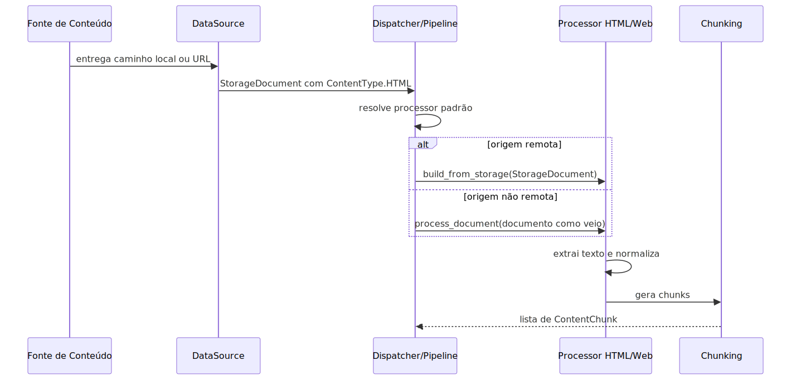

# Manual técnico, executivo, comercial e estratégico: Pipeline Técnico de Ingestão de HTML

## 1. O que é esta feature

Este manual técnico descreve o slice HTML da ingestão a partir do código real. O objetivo aqui não é explicar “web scraping” como capacidade ampla, e sim mostrar como o runtime trata documentos cujo `ContentType` é HTML, quais classes participam, que contratos existem, quais lacunas aparecem e onde o comportamento muda conforme a origem do documento.

## 2. Entry points e contrato real

O primeiro achado técnico importante é um contrato assimétrico.

- O núcleo da ingestão reconhece HTML como `ContentType.HTML`.
- `FileSystemDataSource` infere `.html` e `.htm`.
- `WebDataSource` produz HTML remoto.
- Existe `HtmlContentProcessor` para limpeza base.
- Existe `WebContentProcessor` e `WebMultimodalProcessor` para o slice web.

Mas o contrato YAML-first principal não expõe uma família `html_file_paths` nem um resolver local dedicado para HTML. Em `IngestionRequest`, as famílias locais publicadas são texto, markdown, docx, pdf, json, imagem e ppt. Em `resolve_local_files`, os padrões coletados também não incluem HTML.

Conclusão prática: o suporte a HTML existe no núcleo técnico, porém o caminho oficial exposto pelo builder do request não publica uma entrada local dedicada equivalente às demais famílias documentais.

## 3. Componentes que controlam o comportamento

### 3.1. `FileSystemDataSource`

Responsabilidade: ler arquivo local e montar `StorageDocument` com bytes e metadados básicos.

Comportamento confirmado:

- Reconhece `.html` e `.htm` como `ContentType.HTML`.
- Para HTML, decodifica os bytes em `content` textual logo na transformação para `StorageDocument`.
- Mantém também `raw_bytes`.

Impacto prático: há suporte estrutural para HTML local no nível do datasource.

### 3.2. `WebDataSource`

Responsabilidade: baixar uma página remota com retry e produzir `StorageDocument`.

Comportamento confirmado:

- Usa `requests.get` com retry de 3 tentativas e backoff exponencial.
- Marca a origem como `SourceType.REMOTE_FILE`.
- Devolve `raw_bytes` do HTML e metadados mínimos como URL e status.

Impacto prático: o caminho remoto chega ao processor com contexto web explícito.

### 3.3. `HtmlContentProcessor`

Responsabilidade: fazer a limpeza base do HTML e entregar texto pronto para chunking.

Comportamento confirmado:

- `supported_content_types = [ContentType.HTML]`.
- `build_from_storage()` aceita apenas `StorageDocument`.
- `_html_to_text()` prioriza `raw_bytes`, faz decode UTF-8 com `ignore`, instancia `BeautifulSoup(..., "html.parser")`, remove `script` e `style`, chama `get_text(separator="\n")` e colapsa whitespace com regex.
- `_extract_text_content()` devolve `document.content`.
- `_split_into_chunks()` registra telemetria de chunking HTML antes de delegar.

Observação crítica: a limpeza HTML real mora em `build_from_storage()` e `_html_to_text()`. Se o documento seguir ao `process_document()` sem passar por materialização canônica, `_extract_text_content()` usará `document.content` como veio.

### 3.4. `WebContentProcessor`

Responsabilidade: enriquecer a base HTML com metadados e comportamento próprios de página web.

Comportamento confirmado:

- Herda de `HtmlContentProcessor`.
- `build_from_storage()` cria `pages_info`, preserva HTML bruto e texto limpo, replica URL e status.
- `_split_into_chunks()` atualiza `pages_info` antes do chunking e pode aplicar processamento por domínio.

Impacto prático: o slice web tem uma representação muito mais rica do que o slice HTML base.

### 3.5. `WebMultimodalProcessor`

Responsabilidade: ser o processor padrão registrado para `ContentType.HTML` e, quando configurado, enriquecer a página com informação derivada de imagens.

Comportamento confirmado:

- Carrega configuração via `resolve_multimodal_config_from_yaml(..., content_type="web")`.
- Quando multimodal está desligado, processa só texto.
- Quando ligado, usa HTML bruto e texto limpo para gerar chunks multimodais.

Impacto prático: HTML no runtime padrão está atualmente orientado ao caso web.

## 4. Como o runtime escolhe processor e datasource

### 4.1. Processor padrão

Em `ContentProcessorFactory._register_builtin_processors`, `ContentType.HTML` aponta para `WebMultimodalProcessor`.

Isso significa que o processor padrão efetivo de HTML no runtime não é `HtmlContentProcessor`, mas a variante web multimodal que herda dele.

### 4.2. Materialização canônica

Em `content_type_dispatcher._materialize_document_for_processor`, a materialização canônica para HTML só ocorre quando as duas condições são verdadeiras.

- `content_type == ContentType.HTML`
- `source_type == SourceType.REMOTE_FILE`

Se essas condições não forem atendidas, o documento segue como está.

Impacto prático: para HTML remoto, o runtime garante passagem por `build_from_storage`. Para HTML não remoto, isso não foi confirmado no fluxo oficial lido.

### 4.3. Datasource por origem

O factory de datasource diferencia a origem pelo `SourceType`.

- `LOCAL_FILE` resolve `FileSystemDataSource`.
- `REMOTE_FILE` resolve `WebDataSource`.

Isso mantém correta a separação entre aquisição do documento e limpeza do conteúdo.

## 5. Fluxo técnico ponta a ponta

O fluxo técnico mais consistente com o código lido é este.

O diagrama mostra por que este slice exige documentação cuidadosa: o caminho remoto está bem fechado; o caminho não remoto aparece como capacidade parcial e não como contrato de produto claramente exposto.

## 6. Testes que confirmam o comportamento

Os testes lidos ajudam a separar o que o runtime garante do que só existe como capacidade técnica.

### 6.1. `test_02-43-10_html_processor_cleaning.py`

Confirma que:

- conteúdo de `script` e `style` sai da saída final;
- o texto humano permanece;
- o chunking HTML registra telemetria.

### 6.2. `test_02-43-11_html_processor_failfast.py`

Confirma que:

- falha interna do `BeautifulSoup` é propagada;
- o processor não mascara o erro com fallback silencioso.

### 6.3. `test_02-43-27_storage_build_processors.py`

Confirma que:

- `HtmlContentProcessor.build_from_storage()` limpa HTML corretamente em nível unitário;
- `WebContentProcessor.build_from_storage()` preserva o contexto web.

Observação importante: esse teste valida a materialização em unidade, não prova sozinho que todo caminho de produção local passa por essa materialização.

## 7. Configurações relevantes

As configurações observadas no código que influenciam o comportamento são estas.

### 7.1. `ingestion.content_processing.chunk_size`

Consumida em `BaseContentProcessor`.

Efeito: tamanho base dos chunks.

### 7.2. `ingestion.content_processing.chunk_overlap`

Consumida em `BaseContentProcessor`.

Efeito: sobreposição base entre chunks.

### 7.3. `ingestion.content_processing.max_chunks_per_document`

Consumida em `BaseContentProcessor`.

Efeito: limite máximo de chunks por documento.

### 7.4. `ingestion.web.multimodal`

Consumida em `WebMultimodalProcessor` via resolvedor canônico compartilhado.

Efeito: habilita ou desabilita enriquecimento multimodal para o slice web.

### 7.5. Parser HTML

O parser usado pelo `BeautifulSoup` está fixado como `html.parser` no código lido. Não há configuração YAML confirmada para trocar para `lxml` ou `html5lib` nesse slice.

## 8. O que acontece em caso de sucesso

### Fluxo remoto confirmado para operação

1. `WebDataSource` baixa a página.
2. O documento chega como `StorageDocument` com `ContentType.HTML` e `SourceType.REMOTE_FILE`.
3. O dispatcher chama `build_from_storage()`.
4. `WebContentProcessor` cria texto limpo, `pages_info`, URL e status.
5. O processor gera chunks.
6. O documento segue para persistência.

### Caminho local parcialmente confirmado

1. `FileSystemDataSource` reconhece `.html` e devolve `StorageDocument` com bytes e `content` textual.
2. Existe suporte unitário em `HtmlContentProcessor.build_from_storage()`.
3. Não foi encontrado no código lido um contrato YAML-first oficial que publique esse caminho ponta a ponta como família local dedicada.

## 9. O que acontece em caso de erro

### Erro de tipo na materialização

Sintoma: `ValueError` por tipo inválido.

Causa: `build_from_storage()` recebeu algo diferente de `StorageDocument`.

Reação do sistema: falha fechada.

### Erro de parsing HTML

Sintoma: exceção durante limpeza do HTML.

Causa: falha do parser ou markup/problemática no ponto de instanciar `BeautifulSoup`.

Reação do sistema: log de exceção e propagação do erro.

### Erro de contrato de origem

Sintoma: tentativa de usar HTML local via YAML sem efeito claro.

Causa provável: ausência de `html_file_paths` no request e nos resolvers.

Reação do sistema: o caminho oficial não é montado da mesma forma que outras famílias locais.

## 10. Observabilidade e diagnóstico

### Logs úteis

- “Processador HTML inicializado”
- “HTML CHUNKING: parâmetros adaptativos calculados”
- logs de `pages_info` no processor web
- logs de materialização do dispatcher para documento web

### Perguntas diagnósticas mais úteis

1. O documento entrou como `ContentType.HTML` ou caiu como texto puro?
2. A origem é `REMOTE_FILE` ou `LOCAL_FILE`?
3. O dispatcher chamou `build_from_storage()` ou não?
4. O texto final ficou limpo ou ainda tem markup?
5. O problema é parsing quebrado ou limitação de extração editorial?

## 11. Comparação com estado da arte

O código atual está mais próximo de um extrator estrutural simples do que de um extrator editorial completo.

### O que a implementação atual faz

- Parseia HTML com BeautifulSoup.
- Remove `script` e `style`.
- Extrai texto com `get_text()`.
- Normaliza espaços.
- Faz chunking.

### O que o estado da arte costuma adicionar

- seleção do melhor parser para robustez e performance;
- remoção de boilerplate com heurística editorial;
- identificação de corpo principal do artigo;
- pruning por XPath ou score de DOM;
- extração de metadados editoriais;
- deduplicação e filtros de idioma;
- estratégias de fallback como readability ou jusText.

Conforme a documentação oficial consultada, Trafilatura expõe extração com metadata, pruning, deduplicação e safety nets de readability/jusText. `readability-lxml` foca justamente em extrair e limpar o corpo principal de um documento HTML. Já o BeautifulSoup documenta `get_text()` como extração de texto humano e ressalta que `lxml` costuma ser a melhor opção quando performance importa.

Conclusão prática: a implementação atual está correta como base arquitetural e suficiente para limpeza estrutural, mas ainda não representa o topo do estado da arte em extração editorial de HTML.

## 12. Lacunas reais encontradas

Estas lacunas foram observadas diretamente no código lido e precisam ser tratadas como fatos técnicos, não como opinião.

### 12.1. Ausência de contrato YAML-first local dedicado para HTML

Impacto: o produto não publica HTML local com a mesma clareza operacional das demais famílias locais.

### 12.2. Materialização canônica protegida apenas para HTML remoto no slice lido

Impacto: o caminho remoto está melhor fechado do que o caminho local.

### 12.3. Ausência de extrator editorial avançado

Impacto: páginas com muito boilerplate podem entrar com ruído útil para navegação humana, mas ruim para recuperação semântica.

## 13. Como colocar para funcionar

### Caminho remoto confirmado

O caminho operacional confirmado pelo código lido é o de HTML vindo como página remota da família web. Esse fluxo depende da configuração da origem remota e do gate multimodal web quando aplicável.

### Caminho local dedicado

Caminho de execução oficial via YAML-first para HTML local não confirmado no código/configuração lidos.

## 14. Exemplos práticos guiados

### Exemplo 1: HTML remoto com multimodal desligado

Entrada: página HTML remota com URL e status 200.

Processamento: download, materialização canônica, limpeza HTML, chunking textual.

Saída: chunks com texto limpo e metadados de página.

### Exemplo 2: HTML remoto com multimodal ligado

Entrada: página com imagens relevantes.

Processamento: o stack web usa HTML bruto e texto limpo para enriquecer o conteúdo antes da geração dos chunks multimodais.

Saída: chunks textuais enriquecidos com contexto visual.

### Exemplo 3: HTML local inferido pelo datasource

Entrada: arquivo `.html` lido pelo `FileSystemDataSource`.

Processamento confirmado: inferência de `ContentType.HTML` e produção de `StorageDocument`.

Lacuna: o caminho ponta a ponta oficial que publique esse fluxo via request da ingestão não foi confirmado.

## 15. Explicação 101

O slice técnico de HTML funciona como uma peneira. Primeiro ele reconhece que o documento é HTML. Depois ele tenta jogar fora a parte claramente inútil para leitura, como script e estilo. Em seguida ele transforma o resto em texto e corta em pedaços.

Se a origem for uma página web remota, há uma camada extra que guarda URL, status e outras pistas úteis. Se a origem for local, o código ainda mostra suporte técnico, mas o contrato oficial de entrada não está publicado com a mesma clareza.

## 16. Limites e pegadinhas

- O processor default de HTML é o stack web multimodal, não a classe HTML base isolada.
- Teste unitário de `build_from_storage()` não prova sozinho a exposição oficial do caminho local.
- `html.parser` é simples, mas não é a opção mais robusta do ecossistema para HTML difícil.
- Remover `script` e `style` não elimina todo o boilerplate de uma página.

## 17. Troubleshooting

### Sintoma: chunks contêm tags HTML

Como confirmar: verificar se houve materialização canônica antes do `process_document()`.

Ação recomendada: distinguir se o problema veio do caminho remoto ou de um uso interno/local sem materialização explícita.

### Sintoma: a página veio muito poluída com menu e rodapé

Como confirmar: verificar se o texto final foi obtido apenas pela limpeza base do HTML, sem qualquer etapa de readability/boilerplate removal.

Ação recomendada: tratar como limitação da estratégia atual, não como simples erro de execução.

### Sintoma: não encontro configuração de HTML local no YAML

Como confirmar: revisar `IngestionRequest`, `IngestionRequestBuilder` e `resolve_local_files`.

Ação recomendada: documentar a limitação e só evoluir o contrato se o produto realmente quiser expor HTML local como família oficial.

## 18. Checklist de entendimento

- Entendi qual classe limpa o HTML.
- Entendi qual classe especializa o HTML remoto.
- Entendi que o processor padrão de HTML é o stack web multimodal.
- Entendi que a materialização canônica observada no runtime está garantida para `REMOTE_FILE`.
- Entendi a lacuna de contrato para HTML local.
- Entendi a diferença entre limpeza estrutural e extração editorial estado da arte.

## 19. Evidências no código

- `src/ingestion_layer/datasources/filesystem_data_source.py`
  - Motivo da leitura: confirmar suporte local estrutural para `.html` e `.htm`.
  - Símbolo relevante: `_infer_content_type()`.
  - Comportamento confirmado: HTML local é reconhecido e decodificado.
- `src/ingestion_layer/datasources/web_data_source.py`
  - Motivo da leitura: confirmar caminho remoto oficial para HTML.
  - Símbolo relevante: `_transform_to_document()`.
  - Comportamento confirmado: cria `StorageDocument` remoto com contexto web.
- `src/ingestion_layer/processors/html_processor.py`
  - Motivo da leitura: confirmar a técnica exata de extração de texto.
  - Símbolo relevante: `_html_to_text()`.
  - Comportamento confirmado: `BeautifulSoup`, remoção de `script/style`, `get_text()`, regex de whitespace.
- `src/ingestion_layer/processors/web_processor.py`
  - Motivo da leitura: fechar a diferença entre HTML base e página web.
  - Símbolo relevante: `build_from_storage()`.
  - Comportamento confirmado: criação de `pages_info`, URL e status.
- `src/ingestion_layer/processors/multimodal_wrappers.py`
  - Motivo da leitura: confirmar o processor efetivo do runtime.
  - Símbolo relevante: `WebMultimodalProcessor`.
  - Comportamento confirmado: gate multimodal via `content_type="web"`.
- `src/ingestion_layer/content_type_dispatcher.py`
  - Motivo da leitura: confirmar quando a materialização canônica acontece.
  - Símbolo relevante: `_materialize_document_for_processor()`.
  - Comportamento confirmado: HTML só é materializado automaticamente no slice lido quando a origem é `REMOTE_FILE`.
- `src/services/ingestion_request_source_resolvers.py`
  - Motivo da leitura: verificar publicação do contrato YAML-first.
  - Símbolo relevante: `resolve_local_files()`.
  - Comportamento confirmado: HTML local não aparece como família dedicada.
- `src/ingestion_layer/core/data_models.py`
  - Motivo da leitura: confirmar o request oficial do orquestrador.
  - Símbolo relevante: `IngestionRequest`.
  - Comportamento confirmado: não existe campo `html_file_paths`.
