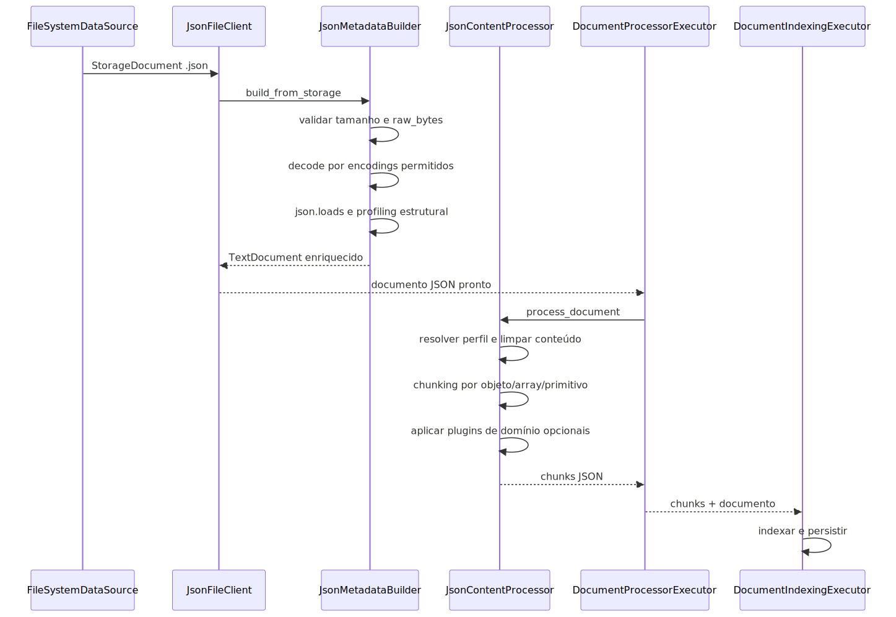

# Manual técnico do pipeline de ingestão de JSON

## 1. O que este documento cobre

Este manual técnico descreve o comportamento real do pipeline JSON no código lido. O foco é seguir o caminho ponta a ponta desde a identificação do arquivo até a indexação final, deixando claro onde o contrato YAML é resolvido, como a integridade do conteúdo é validada, como os metadados estruturais são construídos, como os perfis de processamento influenciam o chunking e como os plugins de domínio entram na esteira.

## 2. Entry point e boundary real

O caminho canônico do JSON começa pelo reconhecimento da extensão e converge para o processor dedicado.

1. O datasource local infere `.json` como `ContentType.JSON`.
2. A factory de clients resolve `JsonFileClient` para esse tipo.
3. O client delega ao `JsonMetadataBuilder` para materializar o documento a partir do `StorageDocument`.
4. `DocumentProcessorExecutor` escolhe `JsonContentProcessor` como processor dedicado.
5. `BaseContentProcessor.process_document` executa o pipeline assíncrono comum.
6. `DocumentIndexingExecutor` indexa e persiste os chunks gerados.

O ponto importante é que a inteligência do slice JSON está dividida entre materialização do documento e chunking. O builder faz o trabalho mais pesado de integridade e profiling; o processor faz o trabalho de perfil, chunking e enriquecimento por domínio.

## 3. Contrato YAML confirmado no código

### 3.1. Caminho canônico do JSON

O resolvedor aceita somente o caminho:

- ingestion.content_profiles.type_specific.json

Os caminhos legados rejeitados explicitamente são:

- content_profiles.type_specific.json
- ingestion.json
- json na raiz

### 3.2. Default contract resolvido

O resolvedor consolida um contrato com blocos principais:

- enabled
- domain_profile
- encoding
- size
- schema_detection
- coupon_processing
- catalog_processing
- quality_filters
- metadata
- normalization

### 3.3. Configuração paralela pouco visível

Há um detalhe importante no processor: o nome do perfil padrão também pode vir de json_processing_profile na raiz do YAML. Isso cria uma superfície de configuração paralela ao bloco canônico do JSON.

Na prática:

- o grosso do comportamento de ingestão vem de ingestion.content_profiles.type_specific.json;
- o perfil padrão do processor pode ser influenciado por json_processing_profile fora desse bloco.

Essa coexistência deve ser tratada como ponto de atenção documental e operacional.

## 4. Identificação do arquivo e contrato de extensão

### 4.1. Extensão suportada

`SUPPORTED_JSON_FILE_EXTENSIONS` confirma somente `.json`.

### 4.2. Consequência prática

Arquivos `.jsonl` não entram neste slice como JSON canônico. Os testes do orquestrador confirmam que `.jsonl` cai para o client textual, não para o `JsonFileClient`.

### 4.3. Tipo de origem do client fino

`JsonFileClient` aceita apenas `SourceType.LOCAL_FILE`. Ele é o wrapper fino do caminho local, mas o processor em si é capaz de receber qualquer `StorageDocument` já materializado com `ContentType.JSON`.

## 5. Materialização do documento: papel do JsonMetadataBuilder

`JsonMetadataBuilder` é o coração do slice JSON. Ele faz muito mais do que carregar o arquivo.

### 5.1. Validação de tamanho

`_validate_size` compara o tamanho do arquivo com `size.max_file_size_mb` e falha quando o limite é ultrapassado.

### 5.2. Bytes brutos obrigatórios

`_extract_storage_raw_bytes` exige `raw_bytes` no documento de storage. Se eles não existirem, a esteira falha fechado porque não consegue garantir integridade de encoding.

### 5.3. Decode com tentativa ordenada de encodings

`_decode_and_validate_json_bytes` usa a lista ordenada de encodings permitidos gerada pelo resolvedor. Para cada encoding:

1. tenta decodificar os bytes;
2. se falhar, registra warning de decode;
3. se decodificar, tenta `json.loads`;
4. se o parse falhar, registra warning de parse;
5. retorna apenas quando decode e parse passam juntos.

Se todas as tentativas falham, o builder diferencia claramente dois cenários:

- falha de decode para todos os encodings;
- decode íntegro, mas parse JSON inválido.

### 5.4. Auditoria de integridade

O builder registra SHA-256 dos bytes brutos, tamanho dos bytes, tamanho do texto e primeiro caractere útil do conteúdo decodificado. Isso ajuda a investigar corrupção, BOM, encoding e payload suspeito sem despejar o documento inteiro no log.

## 6. Construção do TextDocument enriquecido

Depois do decode, `build_document` gera um `TextDocument` com:

- `content` mantendo o JSON bruto como veio da fonte;
- `content_type=JSON`;
- metadata estrutural e semântica;
- `pages_info` sintético para manter compatibilidade com telemetria que espera paginação.

O método `_compose_document_content` confirma que o conteúdo do documento continua sendo apenas o JSON bruto. O enriquecimento mais pesado vai para metadata, não para o corpo textual principal.

## 7. Enriquecimento estrutural e semântico

### 7.1. Detecção de coleções de negócio

`_detect_record_sets` procura coleções de dicionários em listas de topo ou em listas dentro de objetos. A partir daí, duas heurísticas avaliam o conjunto:

- `_looks_like_coupon`
- `_looks_like_product`

Essas heurísticas usam listas configuráveis de campos esperados, como identificador, data, valor, SKU, nome e preço.

### 7.2. Normalização

`_apply_normalization` percorre registros e normaliza valores aninhados.

O comportamento confirmado inclui:

- arredondamento numérico configurável;
- serialização de datas quando necessário;
- manutenção de listas e dicionários como estruturas recursivas, não achatadas imediatamente.

### 7.3. Estatísticas de cupom e catálogo

O builder calcula dois blocos específicos:

- `cupom_estatisticas`
- `catalogo_estatisticas`

No caso de cupons, registra total, valor total, ticket médio e clientes únicos.

No caso de catálogo, registra quantidade de itens, faixa de preço, estoque total e categorias em destaque.

### 7.4. Metadados opcionais

`_collect_optional_metadata` percorre caminhos configurados para capturar campos complementares, como canal, loja, pagamentos, marca, fornecedor, embalagem e imagem.

### 7.5. Quality flags

`_validate_quality` avalia pelo menos:

- quantidade insuficiente;
- quantidade excessiva;
- ausência de preço quando exigido;
- ausência de identificador de cupom quando exigido.

O resultado é persistido em `quality_flags` e refletido em `qualidade_aprovada`.

### 7.6. Schema summary e numeric stats

`_analyze_json_structure` percorre o JSON recursivamente e produz:

- `json_schema_summary` com caminho, tipos e amostras;
- `json_numeric_stats` com caminho, contagem, mínimo, máximo e média.

O detalhe importante é que o caminho usa notação consistente por objeto e por lista, como sufixo de array com colchetes vazios, o que melhora a rastreabilidade dos campos numéricos e estruturais.

### 7.7. Sombra normalizada

`_generate_normalized_shadow` cria uma projeção textual reduzida do conteúdo:

- normaliza para ASCII;
- extrai tokens alfanuméricos;
- remove stopwords;
- evita duplicação excessiva;
- limita o total de tokens.

Essa sombra vai para metadata como reforço de recuperação textual, sem alterar o JSON principal.

## 8. Metadata final gerada pelo builder

O documento final pode carregar, entre outros, os campos:

- source
- filename
- file_extension
- file_size
- encoding
- domain_profile
- quality_flags
- registros_detectados
- qualidade_aprovada
- metadados_opcionais
- json_preview
- json_info
- json_schema_summary
- json_numeric_stats
- cupom_estatisticas
- catalogo_estatisticas
- amostras_cupons
- amostras_produtos
- json_structured_content
- json_normalized_shadow
- pages_info

Esse conjunto mostra que o valor do slice JSON nasce muito antes do chunking.

## 9. Papel do JsonContentProcessor

Depois que o documento enriquecido existe, o `JsonContentProcessor` assume o comando do chunking e da estratégia de perfil.

### 9.1. Carregamento da configuração específica

`_load_json_processing_config` lê ingestion.content_profiles.type_specific.json e usa essa estrutura para controlar:

- preserve_structure
- max_depth
- flatten_arrays
- chunk_size
- chunk_overlap
- max_chunks_per_document

### 9.2. Perfis suportados

O processor cria pelo menos dois perfis:

- standard
- schema_metadata

O perfil `standard`:

- preserva metadata estrutural;
- permite processamento por domínio;
- admite fallback de chunking quando necessário.

O perfil `schema_metadata`:

- mantém estrutura preservada;
- limita a um chunk;
- desliga metadata estrutural pesada;
- desliga plugins de domínio;
- proíbe fallback de chunking para JSON inválido.

### 9.3. Seleção do perfil

`_resolve_profile` decide o perfil nesta ordem prática:

1. metadata.processing_profile;
2. metadata.document_type igual a schema_metadata;
3. json_processing_profile na raiz do YAML;
4. fallback para standard.

## 10. Extração e limpeza do conteúdo

### 10.1. _extract_text_content

O processor retorna o conteúdo do documento como está e apenas garante `pages_info` sintético na metadata, se ainda não existir.

### 10.2. _clean_text_content

O conteúdo é parseado novamente e serializado com indentação consistente. Se o conteúdo estiver inválido nessa etapa, o processor falha fechado com resumo seguro do payload para log.

Isso significa que o chunking sempre opera sobre JSON normalizado, não sobre um texto com formatação arbitrária.

## 11. Chunking JSON-aware

### 11.1. Caminho assíncrono canônico

O método assíncrono `_split_into_chunks` é o caminho canônico do runtime. Ele:

1. resolve o perfil;
2. faz `json.loads` do conteúdo normalizado;
3. cria metadata estrutural adicional;
4. chama `_create_json_chunks`;
5. aplica limite de chunks;
6. executa processamento de domínio quando permitido.

### 11.2. Metadata estrutural adicional

`_create_json_metadata` injeta no metadata do chunk, quando permitido pelo perfil:

- `json_structure`
- `json_keys`
- `content_type_specific` com profundidade, total de chaves, caminhos numéricos e caminhos de schema
- `json_schema_summary`
- `json_numeric_stats`

### 11.3. Estratégia para objetos JSON

`_chunk_json_object` tem dois comportamentos:

- se `preserve_structure` está ligado, cria um único chunk com o objeto completo;
- caso contrário, cria um chunk por chave de primeiro nível.

### 11.4. Estratégia para arrays JSON

`_chunk_json_array` também bifurca:

- se `flatten_arrays` está desligado ou o array tem um único item, mantém o array inteiro em um chunk;
- se `flatten_arrays` está ligado e o array tem múltiplos itens, cria um chunk por item.

### 11.5. Estratégia para valores primitivos

Valores primitivos geram chunk único com tipo `json_primitive`.

### 11.6. Superfície síncrona auxiliar

Existe também `create_chunks`, que reproduz a lógica JSON-aware para a interface síncrona e calcula parâmetros adaptativos de chunk. Ela é importante para compatibilidade, mas o caminho assíncrono `_split_into_chunks` continua sendo a referência principal da ingestão.

### 11.7. Fallback controlado

Quando o conteúdo é inválido em `create_chunks`:

- o perfil `schema_metadata` falha sem fallback;
- o perfil `standard` pode produzir um único chunk simples, registrando warning explícito.

## 12. Plugins de domínio

### 12.1. Resolver central

`DomainProcessingResolver` é o ponto canônico do recurso. Ele lê `domain_specific_processing`, resolve a configuração efetiva de domínios, instancia `MetadataSchemaRegistry`, cria `DomainProcessorFactory` e só mantém o recurso ativo quando `is_enabled()` retorna verdadeiro.

O fluxo técnico confirmado no código é este:

1. o processor JSON cria o resolver durante `_setup_domain_processing`;
2. o perfil do documento é selecionado por `_resolve_profile`;
3. só o perfil `standard` permite domínio;
4. depois que os chunks são gerados, `apply_processing(document, chunks)` executa a cadeia;
5. o retorno vem como `DomainProcessingOutcome`, com `chunks` enriquecidos e `applied_domains` para log e diagnóstico.

O detalhe mais importante é que o resolver não escolhe um único plugin "vencedor" no escuro. A `DomainProcessorFactory` cria todos os processadores habilitados, ordena a lista por `get_processing_priority()` e a cadeia é executada nessa ordem. Isso permite compor enriquecimentos sem duplicar o processor JSON principal.

Os domínios built-in confirmados no registry atual são:

- `dnit`
- `product_catalog`
- `sales_coupon`
- `software_pdv`
- `software_management`
- `human_resources`
- `food_service`
- `hospitality`

Na base comum dos plugins, `BaseDomainProcessor.process_chunks` valida a metadata extraída contra o schema do domínio. Quando a validação falha, o código registra warning e aplica fallback de metadata reduzida para preservar a ingestão sem mascarar que houve perda de qualidade semântica.

### 12.2. ProductCatalogDomainProcessor

Este plugin tenta reconhecer catálogos de produtos e acrescenta metadados como:

- código do item;
- nome;
- categoria;
- marca;
- tags;
- faixa de preço;
- variantes;
- disponibilidade.

### 12.3. SalesCouponDomainProcessor

Este plugin tenta reconhecer cupons e promoções e acrescenta metadados como:

- código do cupom;
- descrição;
- tipo;
- valor;
- modalidade;
- datas de validade;
- canais válidos;
- restrições.

### 12.4. Quando os plugins não entram

Os plugins são ignorados quando:

- o processamento de domínio está desabilitado;
- o perfil não permite domínio;
- o perfil ativo é `schema_metadata`, que desliga explicitamente esse enriquecimento;
- o documento não parece pertencer ao domínio;
- o chunk não consegue ser interpretado como JSON válido pelo plugin.

## 13. Integração com a esteira comum

`DocumentProcessorExecutor` chama `processor.process_document(storage_document)` e registra logs de início, sucesso, ausência de chunks ou erro.

Depois, `DocumentIndexingExecutor.finalize`:

1. calcula hashes do documento e do conteúdo;
2. injeta metadados canônicos de telemetria;
3. indexa os chunks no vector store;
4. persiste o documento processado;
5. registra telemetria comum da ingestão.

O JSON não tem uma persistência paralela própria. Ele reusa o fechamento oficial da pipeline.

## 14. Configurações que realmente mudam o comportamento

### 14.1. encoding.default e encoding.fallbacks

Controlam a ordem de tentativa de decode. Se estiverem mal calibrados, o arquivo pode falhar cedo mesmo com bytes válidos em encoding diferente.

### 14.2. size.max_file_size_mb

Controla o corte duro de tamanho.

### 14.3. schema_detection.max_depth e max_array_length

Orientam o profiling estrutural e limitam leitura exploratória do schema.

### 14.4. coupon_processing e catalog_processing

Controlam os campos que definem detecção de domínio e estatísticas de negócio.

### 14.5. quality_filters

Controlam min_records, max_records e exigências mínimas como preço ou identificador.

### 14.6. metadata

Controla inclusão de schema summary, samples, estatísticas financeiras e de catálogo.

### 14.7. normalization

Controla deduplicação, serialização de datas, arredondamento e parâmetros da sombra normalizada.

### 14.8. preserve_structure e flatten_arrays

Definem se objeto e array viram chunks inteiros ou quebrados estruturalmente.

### 14.9. json_processing_profile

Muda o perfil padrão do processor. O problema é que essa chave aparece fora do bloco canônico principal, o que merece cuidado de operação e documentação.

## 15. O que acontece em caso de sucesso

Sinais técnicos de sucesso:

- bytes brutos existem;
- um encoding permitido foi aceito;
- `json.loads` passou no builder e na limpeza;
- metadata estrutural foi materializada;
- chunks foram produzidos com tipo coerente com a estrutura;
- os plugins de domínio enriqueceram os chunks quando aplicável;
- a esteira comum concluiu indexação e persistência.

## 16. O que acontece em caso de erro

### 16.1. Antes da materialização

- ausência de `raw_bytes`;
- tamanho acima do limite;
- extensão fora do contrato.

### 16.2. Durante decode e parse

- falha de decode para todos os encodings tentados;
- decode bem-sucedido, mas JSON inválido;
- parse inválido em perfil restrito sem fallback.

### 16.3. Durante chunking

- perfil desconhecido resolve para standard;
- perfil restrito bloqueia fallback permissivo;
- plugins de domínio podem se recusar a processar o chunk se a forma não combinar com o domínio.

### 16.4. Durante fechamento

- falhas do vector store ou da persistência comum seguem o comportamento padrão da pipeline de ingestão.

## 17. Observabilidade e diagnóstico

### 17.1. Onde olhar primeiro

1. logs de decode e parse com stage explícito;
2. metadata `encoding`, `json_info`, `json_preview`, `json_schema_summary` e `json_numeric_stats`;
3. metadata `quality_flags` e `qualidade_aprovada`;
4. metadata `json_normalized_shadow`;
5. metadata enriquecida por domínio nos chunks finais.

### 17.2. Como diferenciar causas

Erro de contrato:
extensão errada, caminho YAML legado, bytes ausentes ou tamanho acima do limite.

Erro de encoding:
nenhum encoding permitido conseguiu decodificar os bytes.

Erro de parse:
o texto foi decodificado, mas não representa JSON válido.

Erro de perfil:
o documento entrou em `schema_metadata` e, por isso, recusou fallback e plugins de domínio.

Erro de qualidade de negócio:
o documento é válido, mas carrega `quality_flags` que indicam valor operacional baixo ou inconsistente.

## 18. Troubleshooting

### Sintoma: o arquivo existe, mas falha antes de gerar documento

Causa provável: ausência de `raw_bytes` ou tamanho acima do limite.

Como confirmar: revisar a exceção do builder e os campos de storage do documento.

Ação recomendada: corrigir a materialização do `StorageDocument` e o limite de tamanho configurado.

### Sintoma: o JSON parece legível, mas a ingestão rejeita

Causa provável: decode em encoding incompatível ou parse inválido após decode.

Como confirmar: revisar `failure_stage` e a lista de encodings tentados no log.

Ação recomendada: alinhar o encoding do arquivo com a configuração ou corrigir o payload de origem.

### Sintoma: o documento entrou, mas não recebeu enriquecimento de catálogo ou cupom

Causa provável: heurística de domínio não encontrou os campos mínimos.

Como confirmar: conferir campos configurados em `catalog_processing` e `coupon_processing`, além do conteúdo real do documento.

Ação recomendada: ajustar o mapeamento de campos canônicos do domínio ou tratar o payload como outro tipo de documento.

### Sintoma: schema metadata virou chunk pesado demais

Causa provável: perfil restrito não foi aplicado.

Como confirmar: revisar `processing_profile` e `document_type` na metadata do documento de origem.

Ação recomendada: marcar corretamente o documento como `schema_metadata` antes do processamento.

### Sintoma: arquivo `.jsonl` não usa o pipeline JSON

Causa provável: o contrato de extensão aceita apenas `.json`.

Como confirmar: revisar `SUPPORTED_JSON_FILE_EXTENSIONS` e o teste do orquestrador para `.jsonl`.

Ação recomendada: tratar `.jsonl` em pipeline específico ou converter para JSON canônico antes da ingestão.

## 19. Comparação técnica com estado da arte

### 19.1. Frente a parsers de alta performance

Bibliotecas modernas como parsers de alta performance priorizam latência e conformidade estrita. O pipeline atual converge com a preocupação de correção, mas não com a meta de throughput máximo, pois usa o parser padrão da linguagem e reaproveita metadados ricos em vez de otimizar apenas o parse bruto.

### 19.2. Frente a parsing streaming

Ferramentas de parsing iterativo conseguem processar arquivos muito grandes sem carregar tudo em memória. O pipeline atual não faz isso. Ele carrega, parseia e analisa a árvore inteira do documento.

### 19.3. Frente a normalização tabular moderna

Ferramentas de normalização tabular achatam caminhos aninhados em colunas por `record_path`, `meta` e separadores configuráveis. O projeto não segue essa linha como contrato principal. Ele preserva o JSON e produz profiling estrutural e metadados de domínio, o que é melhor para payloads heterogêneos e menos ideal para analytics puramente tabulares.

## 20. Como colocar para funcionar

O caminho confirmado no código exige:

- arquivo `.json` materializado como `StorageDocument` com `raw_bytes`;
- configuração no bloco ingestion.content_profiles.type_specific.json;
- uso da esteira oficial de ingestão, que resolve o processor e finaliza indexação na pipeline comum.

O slice lido não confirmou um comando exclusivo de execução apenas do pipeline JSON fora da esteira geral da ingestão. O contrato operacional confirmado é o da pipeline comum do produto.

## 21. Lacunas reais observadas

### 21.1. Chave paralela para perfil padrão

O processor aceita `json_processing_profile` fora do bloco canônico principal. Isso cria uma superfície menos óbvia do que o restante do contrato JSON.

### 21.2. JSONL fora do contrato

`.jsonl` cai para texto, não para JSON canônico. Isso limita o slice para integrações que exportam dados linha a linha.

### 21.3. Sem streaming para arquivos muito grandes

O builder parseia o documento inteiro em memória. Para grandes volumes, isso fica atrás de parsers iterativos modernos.

### 21.4. Quality flags enriquecem, mas o bloqueio automático por elas não ficou explicitamente confirmado neste slice

O código lido confirma cálculo e persistência das flags. O que não ficou confirmado nesta leitura limitada foi um corte específico do slice JSON que transforme essas flags, por si só, em abortar o chunking.

## 22. Diagrama técnico de execução

O diagrama mostra a separação central do slice: o builder cuida de integridade e profiling do documento; o processor cuida de perfil e chunking; a esteira comum cuida do fechamento operacional.

## 23. Checklist de entendimento

- Entendi o caminho canônico de configuração do JSON.
- Entendi que `.json` e `.jsonl` não entram pelo mesmo slice.
- Entendi por que `raw_bytes` são obrigatórios.
- Entendi como schema summary e numeric stats são gerados.
- Entendi o papel dos perfis `standard` e `schema_metadata`.
- Entendi como os plugins de catálogo e cupom enriquecem os chunks.
- Entendi onde o pipeline converge de volta para indexação comum.

## 24. Evidências no código

- [src/utils/json_config_resolver.py](../src/utils/json_config_resolver.py)
  - Motivo da leitura: contrato YAML e defaults do slice JSON.
  - Símbolo relevante: validate_json_yaml_contract e resolve_json_ingestion_config.
  - Comportamento confirmado: rejeita caminhos legados e resolve defaults de encoding, schema, qualidade, metadata e normalização.

- [src/ingestion_layer/processors/json_metadata_builder.py](../src/ingestion_layer/processors/json_metadata_builder.py)
  - Motivo da leitura: materialização do documento e enriquecimento estrutural.
  - Símbolo relevante: build_from_storage e build_document.
  - Comportamento confirmado: valida tamanho, exige raw_bytes, tenta decode/parse, calcula schema, stats, quality flags, amostras e sombra normalizada.

- [src/ingestion_layer/processors/json_processor.py](../src/ingestion_layer/processors/json_processor.py)
  - Motivo da leitura: seleção de perfil e chunking JSON-aware.
  - Símbolo relevante: resolução de perfil e rotinas de chunking estrutural por objeto e array.
  - Comportamento confirmado: perfis `standard` e `schema_metadata`, chunking estrutural, fallback controlado e metadata de chunk.

- [src/ingestion_layer/clients/json_client.py](../src/ingestion_layer/clients/json_client.py)
  - Motivo da leitura: boundary fino do client local de JSON.
  - Símbolo relevante: JsonFileClient.
  - Comportamento confirmado: aceita somente local file, delega ao builder e ao processor.

- [src/ingestion_layer/processors/domain_plugins/domain_processing_resolver.py](../src/ingestion_layer/processors/domain_plugins/domain_processing_resolver.py)
  - Motivo da leitura: coordenação dos plugins de domínio.
  - Símbolo relevante: apply_processing.
  - Comportamento confirmado: aplica cadeia de processadores habilitados apenas quando o recurso está ativo.

- [src/ingestion_layer/processors/domain_plugins/product_catalog_domain_processor.py](../src/ingestion_layer/processors/domain_plugins/product_catalog_domain_processor.py)
  - Motivo da leitura: enriquecimento de catálogo.
  - Símbolo relevante: ProductCatalogDomainProcessor.
  - Comportamento confirmado: detecta catálogo e injeta metadados estruturados por produto.

- [src/ingestion_layer/processors/domain_plugins/sales_coupon_domain_processor.py](../src/ingestion_layer/processors/domain_plugins/sales_coupon_domain_processor.py)
  - Motivo da leitura: enriquecimento de cupons.
  - Símbolo relevante: SalesCouponDomainProcessor.
  - Comportamento confirmado: detecta cupons e injeta metadados comerciais estruturados.

- [src/ingestion_layer/file_pipeline_services.py](../src/ingestion_layer/file_pipeline_services.py)
  - Motivo da leitura: boundary comum da pipeline.
  - Símbolo relevante: run_processor_for_document, build_chunks e finalize.
  - Comportamento confirmado: o JSON roda dentro da mesma esteira oficial de processamento, indexação e persistência.

- [src/ingestion_layer/core/data_models.py](../src/ingestion_layer/core/data_models.py)
  - Motivo da leitura: contrato de extensão suportada.
  - Símbolo relevante: SUPPORTED_JSON_FILE_EXTENSIONS.
  - Comportamento confirmado: somente `.json` é extensão canônica deste slice.

- [tests/unit/ingestion_layer/processors/test_02-43-13_json_processor_schema_profile.py](../tests/unit/ingestion_layer/processors/test_02-43-13_json_processor_schema_profile.py)
  - Motivo da leitura: evidência de contrato protegido para perfil restrito.
  - Símbolo relevante: testes do perfil schema_metadata.
  - Comportamento confirmado: chunk único, sem metadados estruturais pesados e sem fallback permissivo.

- [tests/unit/test_02-06-53_utils_json_config_resolver.py](../tests/unit/test_02-06-53_utils_json_config_resolver.py)
  - Motivo da leitura: evidência do contrato YAML canônico.
  - Símbolo relevante: testes do resolvedor JSON.
  - Comportamento confirmado: caminhos legados são rejeitados explicitamente.
